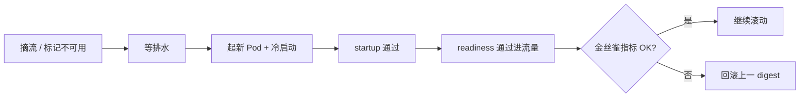

第 9 章把「怎么量、怎么门禁」钉住了；真正上线还要回答另一组问题：**镜像怎么复现、GPU 怎么被调度、模型加载慢时探针会不会误杀、滚动发布会折损多少容量**。本地 `vllm serve` 能跑，只证明引擎路径通了——生产要的是可滚动、可回滚、可扩缩的服务。这一节以 vLLM 为例，把容器与 Kubernetes 上的**可运维决策**讲清，而不是堆一份可复制粘贴的 YAML 教程。

<!-- more -->

## 📑 目录

- [1. 问题：从「能跑」到「能发布」](#1-问题从能跑到能发布)
- [2. 镜像：把运行时钉死](#2-镜像把运行时钉死)
- [3. GPU 调度与资源声明](#3-gpu-调度与资源声明)
- [4. 探针、生命周期与加载长尾](#4-探针生命周期与加载长尾)
- [5. 权重拉取与冷启动代价](#5-权重拉取与冷启动代价)
- [6. 滚动发布：容量折损怎么算](#6-滚动发布容量折损怎么算)
- [7. Production Stack、KServe 与自管](#7-production-stackkserve-与自管)
- [8. 代价与权衡](#8-代价与权衡)
- [总结](#-总结)
- [自我检验清单](#-自我检验清单)
- [参考资料](#-参考资料)

---

## 1. 问题：从「能跑」到「能发布」

生产编排至少要同时成立四件事：

1. **可复现**：同一 digest + 引擎参数 + 模型 revision，换节点结果一致；
2. **可调度**：GPU 数量、型号、TP 拓扑与容量模型一致（见 [10.4](./10.4-容量规划.md)）；
3. **可探活**：加载长尾内不被误杀，就绪后才进流量；
4. **可变更**：滚动时仍满足 SLO，失败能回滚到上一 digest。

🔑 **核心概念**：K8s 部署的成功标准不是 `Pod Running`，而是**发布窗口内 Goodput 不塌、回滚路径清晰**。

---

## 2. 镜像：把运行时钉死

推荐决策：

- 基于组织内维护的 CUDA runtime 构建，**钉死** vLLM / 用户态驱动组件 / 关键系统库；
- 用镜像 **digest** 部署，禁止漂浮的 `latest`；
- 权重通常**不进镜像**（除非合规要求离线一体包），避免百 GB 级膨胀拖垮拉取与回滚。

分层直觉：

```text
基础 CUDA runtime
  └─ Python + vLLM 与依赖
      └─ 入口 / 默认配置（不含巨型权重）
```

可复现的第一公民是 **digest + 引擎参数 + 模型版本**，不是某一台机器上的 conda env——这与 [9.5](../第9章-性能分析与Benchmark/9.5-性能回归门禁.md) 门禁要求「固定 Runner / 固定镜像」同一逻辑。

📌 **关键点**：镜像越「胖」、越「漂」，冷启动与回滚就越贵；瘦镜像是运维投资，不是洁癖。

---

## 3. GPU 调度与资源声明

GPU 一般经 device plugin 暴露为扩展资源。声明上要做的运维决策：

| 决策 | 建议 | 若不做会发生什么 |
|---|---|---|
| `nvidia.com/gpu` 请求=限制 | 整卡独占（除非确有时间分片方案） | 「分数 GPU」幻觉，容量账失真 |
| 同型号亲和 | `nodeSelector` / affinity 钉死型号 | H100/A10 混部，Q* 与延迟不可比 |
| 多卡 TP | Pod 申请多 GPU，且落同节点 | 调度成功但引擎失败，或隐性跨机退化（[6.5](../第6章-分布式推理/6.5-多节点部署Ray.md)） |
| CPU/内存 requests | Tokenizer、页缓存、多模态解码要给足 | 被驱逐或静默抖动，误判为引擎问题 |

「每副本 GPU 数」必须写进容量模型，并与 TP 配置一致：`TP=2` 的副本不是「1 卡服务的两倍吞吐」，而是**消耗 2 卡的一个调度单元**。

💡 **提示**：平台若混部多种 GPU，至少按型号拆节点池；否则 [10.3](./10.3-自动扩缩容与负载均衡.md) 的 HPA 与 [10.4](./10.4-容量规划.md) 的手算表都会建立在错误均值上。

---

## 4. 探针、生命周期与加载长尾

模型加载、编译、权重落盘常要数分钟。套用默认 HTTP 探针，常见后果是：**反复杀尚未就绪的 Pod → 滚动永远完不成 → 有效容量持续为 0**。

| 探针 | 职责 | LLM 场景建议 |
|---|---|---|
| **startupProbe** | 覆盖启动长尾 | 必须有；`failureThreshold × period` ≥ 最坏加载时间 |
| **readinessProbe** | 是否可接新流量 | 查 `/health` 或 `/v1/models`；失败则摘流 |
| **livenessProbe** | 是否已死锁 | 更保守；避免把短暂过载当死亡重启 |

教学示意（**非实测**）：最坏冷启动 $T_{\text{cold}}=8\,\mathrm{min}$。若 `periodSeconds=10`，则：

\[
\text{failureThreshold} \ge \lceil 8\times 60 / 10 \rceil = 48
\]

取 60～120 留余量；只抄「`failureThreshold: 3`」会在合法加载期内被杀。

⚠️ **注意**：就绪 ≠ 前缀缓存已热 ≠ CUDA Graph 已捕获。需要极致首秒体验时，用独立预热脚本/Job，而不是指望探针「顺便」完成预热。

生命周期配套：

- `terminationGracePeriodSeconds`：给在途请求排水（再配合网关摘流）；
- `preStop` sleep 数秒：等 Endpoint 从 Service 摘除后再停进程，减少连接重置。

---

## 5. 权重拉取与冷启动代价

| 模式 | 冷启动 | 运维代价 | 适用 |
|---|---|---|---|
| 启动时从对象存储 / HF 拉 | 高（网络 + 落盘） | 镜像小，依赖外网/内网带宽 | 副本少、变更勤 |
| 节点本地缓存 / PVC | 中→低 | 要管一致性与磁盘水位 | 同型号节点池固定 |
| initContainer 预取 | 中 | 编排稍复杂，主容器干净 | 想把「拉权重失败」与「引擎崩」分开 |
| 只读并行文件 / NFS | 视元数据 | 多副本共享，要压吞吐与小文件 | 已有高性能文件底座 |

冷启动不只影响「第一次上线」，更直接吃进**扩容时延**与**滚动窗口**（下一节）。取舍句：把权重打进镜像「省一次拉取」，往往用**更慢的镜像分发与更重的回滚**换——多数在线推理服务并不划算。

配置用 ConfigMap/Secret；密钥不进镜像；模型用显式 revision/hash。

---

## 6. 滚动发布：容量折损怎么算

滚动的运维问题本质是：**在更新窗口内，Ready 容量是否仍盖住峰值 × 冗余**。

设稳态 Ready 副本 $N$，滚动参数使同时不可用上界约为 $U$（由 `maxUnavailable` 或「先起后停」时的临时重叠决定）。粗算：

\[
N_{\text{ready,min}} \approx N - U
\]

若单副本有效容量为 $Q^{*}$（[10.4](./10.4-容量规划.md)），窗口内可承载：

\[
Q_{\text{window}} \approx N_{\text{ready,min}} \times Q^{*}
\]

教学账（**示意**）：$N=10$，$Q^{*}=6\,\mathrm{QPS}$，峰值 $40\,\mathrm{QPS}$。若 `maxUnavailable=2`，则 $Q_{\text{window}}\approx 8\times 6=48\,\mathrm{QPS}$，尚可；若再叠加冷启动使新 Pod **5 分钟**不 Ready，而流量在窗口内顶满，实际有效可能短暂掉到更低——**发布策略必须与冷启动时延一起算**，不能只看 YAML 整数。

落地建议：

1. `maxUnavailable` 取小，或用「先起后停」并保证节点有空 GPU；
2. 更新前**预拉镜像**到节点，缩短拉取窗口；
3. 引擎大版本先**金丝雀 1 副本**，盯 TTFT P95 / 错误率（口径同 [9.1](../第9章-性能分析与Benchmark/9.1-推理指标体系.md)）再全量；
4. 失败回滚到上一 digest，禁止「进容器热修文件」；
5. PDB 防止自愿中断一次抽太多副本。



---

## 7. Production Stack、KServe 与自管

| 方案 | 适合 | 你仍要自己负责的 |
|---|---|---|
| 自管 Deployment / StatefulSet | 强控细节、组件极简 | 路由、HPA、观测、发布剧本 |
| **vLLM Production Stack** | 快速拼装生产向 vLLM | 容量模型、探针与冷启动策略仍要按本集群标定 |
| **KServe** | 已有统一 InferenceService 平台 | GPU 池、权重缓存、SLO 告警与网关安全 |

选型直觉：只要 vLLM、团队熟 K8s → Production Stack 或精简自管；平台已标准化多框架 Serving → KServe（或内部等价物）。**无论哪条，探针、GPU 亲和、冷启动与滚动折损账不变。**

上线最小检查：

```text
[ ] 镜像 digest + 引擎参数 + 模型 revision 入库
[ ] GPU 型号亲和与每副本 GPU 数 = TP
[ ] startup 覆盖最坏 T_cold；readiness / liveness 分离
[ ] 权重来源、权限、校验和明确；密钥不进镜像
[ ] CPU/内存/临时盘 requests 够用
[ ] PDB + 优雅退出 + 滚动折损账已算
[ ] /metrics 已暴露给下一节观测，且不对公网
```

---

## 8. 代价与权衡

| 选择 | 收益 | 代价 / 不适用 |
|---|---|---|
| 瘦镜像 + 外置权重 | 拉取快、回滚轻 | 依赖缓存/网络；首启可能更慢 |
| 一体包镜像含权重 | 离线友好 | 分发与存储极重 |
| 宽 startup 阈值 | 少误杀 | 真死锁发现更晚（靠 readiness/liveness 分工） |
| 小 `maxUnavailable` | 发布窗口容量稳 | 滚动变慢；节点要有空位起新 Pod |
| 金丝雀 | 降低坏版本爆炸半径 | 发布节奏变长 |
| 预热 Job | 首包体验好 | 多一条流水线；扩容时延仍在 |

适用：已有固定 GPU 节点池，并能量出 $T_{\text{cold}}$ 与 $Q^{*}$。  
若冷启动动辄十余分钟却按「秒级扩容」做活动预案，应先治权重缓存与镜像预热，而不是只加 HPA 上限。

---

## 📝 总结

- 生产标准是可复现、可调度、可探活、可变更，不是容器能起来。
- 镜像钉 digest；GPU 声明与同型号亲和、TP 拓扑一致。
- **startup / readiness / liveness 分工**覆盖加载长尾；就绪不等于已预热。
- 权重策略决定冷启动，并直接进入扩容与滚动的容量账。
- 滚动要算 $N_{\text{ready,min}}\times Q^{*}$；金丝雀与预拉镜像降低风险。
- Production Stack / KServe / 自管是拼装差异，探针与折损原则相同。

## 🎯 自我检验清单

- 能说明为何权重通常不进推理镜像，以及一体包的代价
- 能写出 GPU 资源声明要点，并解释同型号亲和与 TP 的关系
- 能根据 $T_{\text{cold}}$ 估算 startupProbe 的 `failureThreshold`
- 能区分三类探针，并说明「过载」为何不该轻易触发 liveness
- 能手算滚动窗口内的 $Q_{\text{window}}$，并指出冷启动如何恶化它
- 能对比 Production Stack 与 KServe 的适用场景

## 📚 参考资料

- [vLLM — Deployment](https://docs.vllm.ai/en/latest/deployment/)
- [vLLM Production Stack](https://github.com/vllm-project/production-stack)
- [KServe 文档](https://kserve.github.io/website/)
- [Kubernetes — Configure Liveness, Readiness and Startup Probes](https://kubernetes.io/docs/tasks/configure-pod-container/configure-liveness-readiness-startup-probes/)
- [本模块 9.1 推理指标体系](../第9章-性能分析与Benchmark/9.1-推理指标体系.md)
- [本模块 9.5 性能回归门禁](../第9章-性能分析与Benchmark/9.5-性能回归门禁.md)
- [本模块 10.3 自动扩缩容与负载均衡](./10.3-自动扩缩容与负载均衡.md)
- [本模块 10.4 容量规划](./10.4-容量规划.md)
