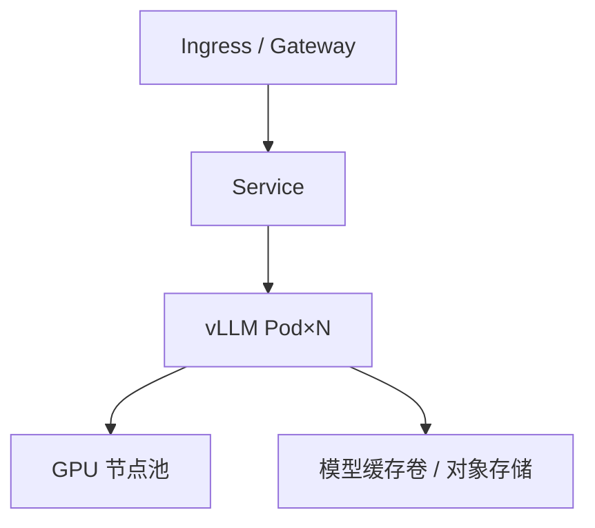

本地 `vllm serve` 能跑，不代表生产能稳。生产要解决：镜像可复现、GPU 被正确调度、模型加载慢时探针不误杀、权重从哪来、多副本怎么管。这一节以 vLLM 为例，把容器化与 Kubernetes 部署的关键决策讲清。

<!-- more -->

## 📑 目录

- [1. 镜像：把运行时钉死](#1-镜像把运行时钉死)
- [2. GPU 调度与资源声明](#2-gpu-调度与资源声明)
- [3. 探针、生命周期与加载长尾](#3-探针生命周期与加载长尾)
- [4. 权重与配置拉取策略](#4-权重与配置拉取策略)
- [5. Production Stack、KServe 与自管 Deployment](#5-production-stackkserve-与自管-deployment)
- [6. 上线检查清单](#6-上线检查清单)
- [总结](#-总结)
- [自我检验清单](#-自我检验清单)
- [参考资料](#-参考资料)

---

## 1. 镜像：把运行时钉死

推荐做法：

- 基于官方/组织内维护的 CUDA 镜像构建
- **钉死** vLLM、驱动用户态组件、关键系统库版本
- 用镜像 digest 部署，而不是漂浮的 `latest`
- 尽量"瘦"：去掉训练无关大包，缩短拉取时间

分层建议：

```text
基础 CUDA runtime
  └─ Python + vLLM 与依赖
      └─ 入口脚本 / 默认配置（不含巨型权重）
```

权重通常**不进镜像**（除非合规要求离线一体包），以免镜像百 GB 级膨胀。

📌 **关键点**：可复现部署的第一公民是 **镜像 digest + 引擎参数 + 模型版本**，不是某一台机器上的 conda env。

---

## 2. GPU 调度与资源声明

在 Kubernetes 中，GPU 一般通过 device plugin 暴露为扩展资源，例如：

```yaml
resources:
  limits:
    nvidia.com/gpu: 1
```

注意：

- 请求与限制通常对 GPU 要一致，避免"分数 GPU"幻觉（除非确有时间分片方案）
- 多卡 TP 时，Pod 需要多 GPU，并保证落在同一节点
- 节点选择：用 `nodeSelector` / affinity 固定 GPU 型号，防止 H100/A10 混部导致容量模型失效
- CPU/内存也要给足：Tokenizer、多模态解码、页缓存都会吃主机内存

💡 **提示**：把"每副本 GPU 数"写进容量模型（第 10.4 节），并与 TP 配置一致，避免调度成功但引擎启动失败。

---

## 3. 探针、生命周期与加载长尾

模型加载、编译、权重落盘可能耗时数分钟。若套用默认 HTTP 探针，Kubernetes 会在就绪前反复杀 Pod。

实践：

| 探针 | 建议 |
|---|---|
| startupProbe | 必须有；失败阈值高、周期长，覆盖最坏加载时间 |
| readinessProbe | 检查服务已可接流量（如 `/health` / `/v1/models`） |
| livenessProbe | 更保守；避免把"短暂过载"当死亡 |

```yaml
startupProbe:
  httpGet:
    path: /health
    port: 8000
  failureThreshold: 120
  periodSeconds: 10
```

配合 `terminationGracePeriodSeconds`，给在途请求排水时间。

⚠️ **注意**：就绪不等于"前缀缓存已热"或"CUDA Graph 已捕获"。需要极致首秒体验时，用独立预热 Job/脚本，而不是只靠探针。

---

## 4. 权重与配置拉取策略

常见模式：

| 模式 | 优点 | 缺点 |
|---|---|---|
| 启动时从对象存储/HF 拉取 | 镜像小 | 冷启动慢，依赖网络 |
| 节点本地缓存 / PVC | 重启快 | 要管缓存一致性 |
| 初始化容器预取 | 主容器逻辑干净 | 编排稍复杂 |
| 只读 NFS/并行文件 | 多副本共享 | 元数据与吞吐要评估 |

配置用 ConfigMap/Secret 注入；**密钥不要打进镜像**。模型版本用显式 revision/hash。

---

## 5. Production Stack、KServe 与自管 Deployment

| 方案 | 适合 | 说明 |
|---|---|---|
| 自管 Deployment/StatefulSet | 想完全控细节 | 灵活，但路由/扩缩容/观测都要自己攒 |
| **vLLM Production Stack** | 快速生产化 vLLM | 社区面向生产的 Helm/编排参考，含常见组件拼装 |
| **KServe** | 已有云原生 ML Serving 平台 | 统一 InferenceService 抽象，多框架并存 |

选型直觉：

- 团队强 K8s、只要 vLLM：Production Stack 或精简自管
- 平台已标准化模型服务：KServe（或内部等价物）上挂 vLLM runtime
- 无论哪种，GPU 调度、探针、权重缓存原则不变



---

## 6. 上线检查清单

1. 镜像 digest 与引擎参数入库
2. GPU 型号亲和与 `nvidia.com/gpu` 数量正确
3. startup/readiness 覆盖加载长尾
4. 权重来源、权限、校验和明确
5. 资源 requests：CPU/内存/临时盘足够
6. PDB、优雅退出、滚动更新策略已设
7. 下一节所需的指标端口已暴露

🔑 **核心概念**：K8s 部署的目标不是"Pod Running"，而是**可滚动、可回滚、可扩缩的稳定服务**。

### 滚动更新额外建议

- `maxUnavailable` 设小，保证峰值时仍有足够 Ready 副本
- 更新前预拉镜像到节点，缩短拉取窗口
- 大版本引擎升级先金丝雀 1 个副本，观察 TTFT/错误率再全量
- 失败时回滚到上一 digest，而不是"热修容器里的文件"

---

## 📝 总结

- 用钉死的容器镜像承载运行时，权重单独拉取或挂载。
- GPU 资源声明、同型号亲和与 TP 拓扑必须一致。
- 模型加载长，必须用 startupProbe 并放宽阈值。
- 权重缓存策略决定冷启动；配置与密钥分离。
- Production Stack / KServe / 自管各有定位，底层原则相同。
- 上线以可滚动可回滚为准，而不是容器能起来就算成功。
- 金丝雀与镜像预热能显著降低发布风险。

## 🎯 自我检验清单

- 能说明为何权重通常不打进推理镜像
- 能写出 GPU 资源声明并解释同型号亲和的原因
- 能区分 startup / readiness / liveness 在 LLM 场景的设置差异
- 能对比三种权重拉取模式的冷启动影响
- 能说出 Production Stack 与 KServe 的适用差异
- 能列出滚动发布前的关键检查项

## 📚 参考资料

- [vLLM — Deployment](https://docs.vllm.ai/en/latest/deployment/)
- [vLLM Production Stack](https://github.com/vllm-project/production-stack)
- [KServe 文档](https://kserve.github.io/website/)
- [Kubernetes — Configure Liveness, Readiness and Startup Probes](https://kubernetes.io/docs/tasks/configure-pod-container/configure-liveness-readiness-startup-probes/)
