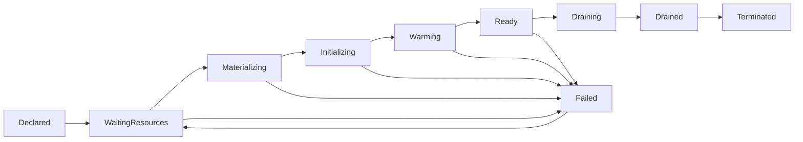

把推理进程装进容器，只解决了“用什么环境运行”。
生产部署还要回答：运行的究竟是哪份模型，四张 GPU 是否组成了完整副本，何时可以接流量，停止时怎样保护在途生成，以及一次发布失败后能否回到已知正确状态。
本节把 Kubernetes 当作控制器案例，而不是操作对象。
重点是副本生命周期背后的不变量；这些不变量同样适用于其他编排系统。
本文不提供编排清单、命令、环境搭建步骤或厂商特定配置。

## 📑 目录
- [1. 问题：Running 为什么不等于可服务](#1-问题running-为什么不等于可服务)
- [2. 贯穿本节的 C10 合同](#2-贯穿本节的-c10-合同)
- [3. 制品身份：先回答运行的是什么](#3-制品身份先回答运行的是什么)
- [4. GPU 与 TP 副本的原子调度](#4-gpu-与-tp-副本的原子调度)
- [5. Pod、进程、rank 与逻辑副本](#5-pod进程rank-与逻辑副本)
- [6. 从创建到可路由的状态机](#6-从创建到可路由的状态机)
- [7. startup、readiness 与 liveness](#7-startupreadiness-与-liveness)
- [8. 180 秒冷启动的关键路径](#8-180-秒冷启动的关键路径)
- [9. 摘流、排空与终止](#9-摘流排空与终止)
- [10. 滚动发布与回退](#10-滚动发布与回退)
- [11. 故障域与放置约束](#11-故障域与放置约束)
- [12. Kubernetes 控制器案例](#12-kubernetes-控制器案例)
- [13. 常见故障、代价与边界](#13-常见故障代价与边界)
- [总结](#总结)
- [自我检验](#自我检验)
- [SRE 与系统资料](#sre-与系统资料)

---

## 1. 问题：Running 为什么不等于可服务

对普通短请求服务，进程启动后很快就可能接收流量。
对大模型推理，进程出现只是长链路中的一个中间状态。
它可能仍在读取权重、分配显存、建立 TP 通信组、捕获计算图或执行预热。
此时端口甚至可能已经打开，但真实生成仍会失败或出现极长首 token 延迟。

“部署成功”至少包含四层不同事实：
1. **身份正确**：镜像、权重、Tokenizer、模板和运行参数属于同一个已批准版本；
2. **资源完整**：逻辑副本需要的四张 GPU 与四个 rank 同时可用；
3. **服务就绪**：预热完成，正确性检查通过，Router 已能安全送入新请求；
4. **生命周期可控**：副本能在故障、缩容和发布时停止新流量并排空在途请求。

因此，部署目标不是“控制器看见若干运行中的 Pod”，而是：
$$
\text{Ready Capacity}
=
\sum_{j=1}^{N}
\mathbf{1}
\left[
I_j=I_0
\land A_j
\land W_j
\land R_j
\right]
\cdot c_j
$$
其中 \(I_j=I_0\) 表示制品身份兼容，\(A_j\) 表示 TP 资源完整，\(W_j\) 表示初始化和预热完成，\(R_j\) 表示副本仍接收新流量，\(c_j\) 才是该副本在 SLO 下的有效能力。
任何一个条件为假，该副本都不能计入入口容量。

## 2. 贯穿本节的 C10 合同

本节严格沿用第十章总览中的 \(C_{10}\)，以下数字是统一教学边界，不是硬件性能承诺。
- **模型与副本**：同一份 70B 稠密指令模型 \(M_0\)，固定权重 revision、Tokenizer、Chat Template、BF16 与解码语义；TP=4、PP=1，一个逻辑副本占四张 80 GiB GPU。
- **Workload**：流式请求按 60% \((512,128)\)、30% \((2048,256)\)、10% \((8192,512)\) 分布；一半带可复用稳定前缀，命中与未命中分开观测。
- **流量**：稳态 offered load 为 \(6\) req/s，每 10 分钟出现一次 \(10\) req/s、持续 30 秒的突发；拒绝、超时和取消仍计入到达。
- **SLO**：请求须协议与结果正确，且 \(TTFT\le1.5\,s\)、\(TPOT\le60\,ms\)、\(E2E\le45\,s\)；以入口到达时间归属 cohort，拒绝、超时和取消均为 bad event，30 天滚动联合达标率 \(A_{10}\ge S_{10}=99\%\)。
- **控制约束**：扩容决策到可路由的冷启动 P99 为 180 秒；任一逻辑副本不可用时仍承接峰值并满足相同 SLO。
- **发布约束**：一次最多摘流一个副本，期间还容忍另一个副本故障；canary 过门禁后才放量，旧版本保留至回滚窗口结束。
后文“副本”均指四卡 TP 逻辑副本，而不是单个进程、单张 GPU 或单个 rank。

## 3. 制品身份：先回答运行的是什么

### 3.1 镜像标签不是完整身份

名称相同不代表内容相同。
可变标签可能在两个时间点指向不同镜像，模型仓库中的同名路径也可能被覆盖。
生产身份应由不可变内容和兼容关系共同定义。

可把一次可运行发布的身份写成：
$$
I=H(D_{\text{image}},R_{\text{weight}},D_{\text{weight}},R_{\text{tokenizer}},R_{\text{template}},P_{\text{precision}},P_{\text{runtime}},P_{\text{decode}})
$$
这里 \(D\) 表示内容摘要，\(R\) 表示不可变 revision，\(P\) 表示会改变执行或语义的配置。
\(H\) 不是要求真的把所有字段拼成一个哈希，而是强调任何一项变化都必须形成新的可审计身份。

对 \(M_0\)，身份记录至少应能回答：
- 运行镜像的内容摘要是什么；
- 权重来自哪个 revision，完整清单与分片摘要是什么；
- Tokenizer 文件及其特殊 token 定义是什么；
- Chat Template 与系统提示模板是哪一版；
- 模型以 BF16、TP=4、PP=1 的哪组运行时参数加载；
- CUDA、通信库和推理引擎处于哪个兼容组合；
- 采样默认值、停止条件和输出协议是否改变；
- 该身份通过了哪些正确性与性能门禁。

### 3.2 身份图比“镜像版本”更准确

镜像与权重可以分开发放。
权重可能位于对象存储、只读卷或节点缓存，Tokenizer 又可能来自另一份制品。
因此真正的发布单元是一张依赖图，而不只是一个容器层。

发布身份把镜像、权重、Tokenizer、模板、执行配置和兼容矩阵汇聚到同一门禁记录。
如果只回退镜像，却继续挂载新权重或新模板，就没有回到旧身份。
同理，新旧版本只有名称相同，也不能默认共享 Prefix Cache、编译产物或其他派生状态。
兼容性必须由身份规则证明，而不是由路径巧合推断。

### 3.3 完整性先于可用性

制品分发应具有“先完整、后可见”的语义：在临时位置完成读取、摘要与清单核对，再原子地暴露完整集合。
这能防止下载半成品、缓存混入两个 revision，以及不同 rank 看见不同内容。
完整性校验会增加启动时间和读放大，但省略它会把“启动慢”变成更危险的静默错误。

## 4. GPU 与 TP 副本的原子调度

### 4.1 四张卡不是四个副本

\(C_{10}\) 的一个副本需要四张 80 GiB GPU。
TP 将一次矩阵计算分散到四个 rank，rank 之间在每层或关键算子处交换结果。
缺失任意必要 rank，整个 forward 都无法按原拓扑推进。

因此副本可用性是一个合取条件：
$$
A_j=\bigwedge_{r=0}^{3}(\text{GPU}_{j,r}\text{ allocated}\land\text{process}_{j,r}\text{ healthy}\land\text{collective}_{j,r}\text{ joined})
$$
三张已分配 GPU 加一张仍在等待，产生的是零个可服务副本，而不是 \(0.75\) 个副本。

### 4.2 原子调度的含义

原子调度不是说底层必须在同一条指令中完成所有动作。
它要求对上层控制环呈现“整组成功或整组不计容量”的语义。

一个 TP 副本的调度判定要同时考虑：
- 同一节点或获准拓扑内是否有四张可用 GPU；
- 四张卡之间的互联是否符合压测基线；
- 主机 CPU、内存、共享内存与本地存储是否同时满足；
- 四个 rank 能否使用一致的制品身份和配置；
- 任一资源申请失败时，是否能释放已占但无效的部分资源；
- 等待中的半组资源会不会阻塞其他完整副本。

Kubernetes 的整数 GPU 资源能表达“需要四张卡”，但不能自动证明卡间拓扑与通信质量满足目标。
若一个逻辑副本跨多个调度单元，还需要 gang 或等价的协同调度语义。
否则部分成员先占资源、其余成员长期等待，会形成资源死锁或碎片。

### 4.3 容量计数必须使用原子单位

设 \(n_{\text{gpu-ready}}\) 是健康 GPU 数量。
简单使用 \(\lfloor n_{\text{gpu-ready}}/4\rfloor\) 仍可能高估容量，因为 GPU 可能散落在不兼容的拓扑和故障域中。
令 \(\mathcal F\) 是所有满足拓扑与资源约束的四卡候选组。
更准确的计数是能同时选出的两两不相交候选组数量：
$$
N_{\text{schedulable}}
=
\max_{\mathcal P\subseteq\mathcal F}
\left\{
|\mathcal P|:
\forall S_a\ne S_b\in\mathcal P,\ S_a\cap S_b=\varnothing
\right\}
$$
若不加互斥条件，同一张 GPU 会被多个候选组重复计数。
这解释了为什么“集群总计还有四张空闲卡”不必然能启动一个 TP=4 副本。
四张卡若各自位于不同节点，而设计只允许单节点 TP，它们只是四个碎片。

## 5. Pod、进程、rank 与逻辑副本

### 5.1 四种对象不能混用

- **Pod 或等价沙箱**：编排器管理的调度与生命周期边界；
- **进程**：加载运行时并执行请求的操作系统实体；
- **rank**：参与 TP 集合通信的逻辑成员；
- **逻辑副本**：能够独立接收并完成 \(M_0\) 请求的四 rank 整体。

一种实现可以在单个 Pod 中运行四个 rank。
另一种实现也可能让多个 Pod 共同组成一个逻辑副本。
实现不同，不变量不变：Router 只能把请求交给完整逻辑副本，控制器也只能按完整逻辑副本计算容量。

### 5.2 进程重启不是免费恢复

某个 rank 退出后，编排器可能只看到一个容器需要重启。
但其他 rank 的通信组通常已经失效，在途请求的 KV 状态也不再完整。
此时局部重启未必能重新加入旧集合。

保守恢复语义是先把整个副本标为不可就绪并停止新请求，再按协议处理失败流、重建完整 rank 组、重新预热，最后以新代际入池。
这种做法牺牲了局部恢复速度，却避免“看似四个进程都在、实际通信代际不一致”的灰色状态。

## 6. 从创建到可路由的状态机

生产副本需要显式状态，而不是二元的“存在/不存在”。

各状态回答不同问题：
- **Declared**：desired state 已提出一个副本；
- **WaitingResources**：仍在等待完整四卡放置组；
- **Materializing**：镜像、权重和派生制品正在准备；
- **Initializing**：进程、显存、通信组和计算图正在建立；
- **Warming**：用代表性输入验证执行路径与基础性能；
- **Ready**：身份、原子资源、正确性和接流条件均成立；
- **Draining**：已停止新流量，但仍有在途请求；
- **Drained**：在途请求归零或已到明确截止时间；
- **Terminated**：资源已释放；
- **Failed**：无法在当前代际继续向 Ready 收敛。

状态必须具有单调阶段和超时语义。
例如，副本在 Initializing 与 Warming 间反复跳转，不能无限伪装成“仍在启动”。
控制器需要知道阶段年龄、最近进展和失败原因，才能区分慢路径与死锁。

## 7. startup、readiness 与 liveness

### 7.1 三个问题、三种后果

三类探针不是同一健康检查的三份副本。
它们分别驱动不同动作。

- **startup** 问：“规定的冷启动状态机是否已经完成？”
- **readiness** 问：“此刻还能否接受一个新请求？”
- **liveness** 问：“进程是否进入自身无法恢复、必须重建的状态？”

正确的逻辑关系可写成：
$$
\text{route-new}\Rightarrow\text{startup-complete}\land\text{ready-now}\land\neg\text{draining}
$$
而 \(\text{liveness-failed}\Rightarrow\text{restart is safer than waiting}\)。
第二个蕴含必须很谨慎，因为重启会丢失 KV、缓存温度和在途生成。

### 7.2 startup：保护重启动作不被误触发

在 180 秒 P99 冷启动窗口内，权重加载或图捕获可能暂时没有业务响应。
startup 应观察明确进展，例如制品已验证、四 rank 已建组、预热已完成。
在 startup 尚未成功前，不应让常规 liveness 因“生成接口不可用”反复杀死进程。

startup 窗口过短会产生重启风暴。
窗口过长又会让真实死锁占用四张 GPU 太久。
因此窗口应由阶段 P99、进展信号和失败上限共同校准，而不是简单把超时设得无限大。

### 7.3 readiness：控制新流量，不宣判进程死亡

readiness 可以因为以下原因变为假：
- 预热尚未完成；
- 任一 TP rank 不健康；
- Router 与副本的版本或代际不兼容；
- 副本收到摘流指令；
- 内部队列、KV 压力或依赖状态已不适合接收新请求；
- 正确性 canary 尚未通过。

readiness 失败的第一后果是停止新流量。
它不应自动终止进程，因为现有流式请求仍可能安全完成。

### 7.4 liveness：只处理不可自愈失活

适合触发重建的证据包括进程退出、事件循环永久停止、TP 集合通信组不可恢复，或设备错误使当前进程代际失效。
高 GPU 利用率、短时队列增长、下游抖动和单次超时通常不应直接判定 liveness 失败。
把过载误当死亡，会同时清空热缓存、减少容量并放大重试。

探针本身也有成本。
若探针执行完整生成，它会占用调度与 GPU，甚至在过载时更容易超时。
健康判定应尽量检查内部状态与轻量进展，不额外制造与用户请求竞争的重工作。

## 8. 180 秒冷启动的关键路径

### 8.1 总时长不是各项均值的简单相加

\(C_{10}\) 规定从扩容决策到真正可路由的 P99 为 180 秒。
它包含控制面、资源、制品、运行时和流量接入全过程。

可写成：
$$
T_{\text{cold}}=T_{\text{observe}}+T_{\text{decide}}+T_{\text{wait-gpu}}+T_{\text{materialize}}+T_{\text{init}}+T_{\text{warm}}+T_{\text{publish-ready}}
$$
若某些阶段并行，实际关键路径取并行分支的最大值，而不是机械相加。
但容量规划仍应使用端到端实测 P99，而不是把各阶段 P99 相加后冒充真实分位数。

一个与 180 秒一致的教学分解可以是：
- 观测与决策传播 10 秒；
- 等待完整四卡放置组 20 秒；
- 镜像与权重准备 35 秒；
- 权重映射、显存与运行时初始化 65 秒；
- TP 通信、图捕获和预热 40 秒；
- 就绪传播与 Router 加权 10 秒。

这些数字之和为 180 秒，只是阶段预算，不是新的性能测量。
真实系统必须记录每个副本的阶段起止时间，并用端到端分布校准。

### 8.2 180 秒解释了热余量的必要性

\(C_{10}\) 的突发持续 30 秒，而冷启动 P99 是 180 秒。
即使扩容在突发开始时立即决定，新副本大概率也会在突发结束后才进入路由池。
所以该突发不能依赖纯反应式冷扩容兑现 SLO。

若突发期间有效能力比 offered load 少 \(\Delta\lambda\)，理想化积压为：
$$
Q_{\text{burst}}
\approx
\Delta\lambda \times 30
$$
这些请求中的许多会先撞上 1.5 秒 TTFT 边界，而不是耐心等待 180 秒。
热副本、预热池、预测性动作和 admission 因此是生命周期设计的一部分，而不是容量章节才考虑的附加项。

## 9. 摘流、排空与终止

### 9.1 删除不是一个瞬时动作

流式请求已经返回首 token 后，客户端可见状态持续增长。
把它迁移到另一副本，可能改变随机状态、重复或丢失 token，也可能造成重复计费。
因此逻辑副本终止必须先阻止新工作，再处理既有工作。

可靠顺序是：
1. 把副本代际标记为 Draining；
2. Router 将其从新请求候选集中移除；
3. 等待摘流状态传播到连接池和所有入口；
4. 已建立连接不得继续提交新的生成；
5. 允许已接受请求在原四 rank 组上推进；
6. 观测 in-flight、剩余 deadline 与排空年龄；
7. in-flight 归零后进入 Drained；
8. 超过明确截止时间时按协议终止并记录用户影响；
9. 最后释放四张 GPU 与进程资源。

### 9.2 排空也是原子语义

TP=4 的四个 rank 共同保存一次请求的执行状态。
不能先终止一个“空闲 rank”，因为 rank 并没有独立的请求归属。
排空完成条件属于整个逻辑副本：
$$
\text{Drained}_j\iff\text{new-admission}_j=0\land\text{in-flight}_j=0
$$
强制截止是例外路径，必须与正常 Drained 分开计数。

### 9.3 重试边界

尚未产生客户端可见 token、失败原因可重试且剩余 deadline 足够时，Router 可以考虑换到不同故障域。
一旦流式输出已经开始，透明重放通常不再安全。
无界重试还会把一个副本故障放大成全池 offered load。

排空的代价是短时减少可接流副本，同时保留 GPU 给旧请求。
但直接终止的代价是用户失败、重试风暴与 Error Budget 燃烧。
两者之间不是“效率高低”，而是服务合同选择。

## 10. 滚动发布与回退

### 10.1 发布是受约束的状态迁移

发布不是把所有旧副本同时替换为新副本。
\(C_{10}\) 要求一次最多摘流并排空一个副本，并且发布期间仍能再承受一个逻辑副本故障。

设峰值所需工作副本数为：
$$
N_{\text{load}}=\left\lceil\frac{10}{h\,\lambda_{\mathrm{cap}}}\right\rceil,\qquad R_{\min}=N_{\text{load}}+1_{\text{failure}}+1_{\text{release}}
$$
\(\lambda_{\mathrm{cap}}\) 是达到 \(S_{10}\) 且队列稳定时实测的单副本最大 offered capacity，不是 Goodput；实际 Goodput 为 \(G(\lambda)=\lambda A_{10}(\lambda)\)。
这两个余量不能因“通常不会同时发生”而静默合并，因为合同明确允许发布中再故障。

### 10.2 新版本门禁

新副本扩大流量前依次证明：
- 制品身份完整且与目标发布记录一致；
- 四卡 TP 组完整，所有 rank 属于同一代际；
- startup 完成且基础生成正确；
- readiness 持续稳定，而不是一次探测偶然成功；
- canary 的协议、结果、TTFT、TPOT、E2E 与错误均符合门禁；
- 长度分布与缓存冷热被纳入比较；
- 观测数据能按版本区分；
- 回退所需旧身份和旧副本仍保留。

canary 只收到极少短请求时，不能证明 \((8192,512)\) 长请求路径或冷缓存路径安全。
门禁样本应覆盖 \(C_{10}\) 的三档长度和缓存命中分层。

### 10.3 回退恢复的是身份与容量

回退目标是恢复已知正确的完整身份 \(I_{\text{old}}\)，而不只是改回某个镜像名称。
旧权重、Tokenizer、Chat Template、运行参数与路由兼容关系都必须可恢复。

回退时还要避免两个陷阱：
1. 新版本已破坏共享派生状态，旧版本重新接流后仍是冷缓存；
2. 旧副本已全部终止，只能等待 180 秒冷启动。

因此旧版本要保留到回滚窗口结束。
这种保留占用 GPU 和存储，但它把回退从“重新部署愿望”变成可兑现动作。

## 11. 故障域与放置约束

### 11.1 先定义会一起坏掉什么

故障域可能是：
- 单个进程或 rank；
- 单张 GPU；
- 一个四卡逻辑副本；
- GPU 所在节点及其电源、PCIe 和主机内存；
- 机架、网络叶节点或可用区；
- 制品存储、控制面或身份服务。

\(C_{10}\) 的 N+1 明确保护“任意一个逻辑副本不可用”。
它不自动承诺整个八卡节点或可用区失效。
若一个节点上放置两个 TP=4 副本，节点故障会同时损失两个逻辑副本，已经超出单副本故障假设。

### 11.2 放置要和容量公式使用同一故障域

设故障域 \(d\) 中有 \(n_d\) 个副本。
失去该域后仍满足峰值的条件是：
$$
R_{\text{ready}}-n_d\ge N_{\text{load}}
$$
发布期间还要满足 \(R_{\text{ready}}-1_{\text{release}}-n_d\ge N_{\text{load}}\)。

如果这里只计划单副本故障，就必须限制任一共同故障域最多损失一个计入合同的副本。
否则纸面上的 \(+1\) 与实际放置不一致。

跨域分散会增加调度等待、资源碎片、网络与制品分发成本。
严格故障隔离也可能让有空闲 GPU 的副本仍保持 Pending。
这不是调度器“笨”，而是可用性约束正在与利用率竞争。

## 12. Kubernetes 控制器案例

Kubernetes 可以把上述理论映射为“desired state → 控制器调和 → 四卡调度 → Pod/进程状态机 → 探针 → Router 候选集 → 请求反馈”的循环。
在这个案例中：
- 工作负载控制器维护期望副本与版本；
- 调度器尝试找到满足四卡与拓扑约束的放置；
- Pod 生命周期承载进程创建和终止；
- 探针把运行时状态翻译为控制信号；
- Service 或 Router 只选择 Ready、非 Draining 的代际；
- 发布控制器逐个替换，并等待门禁成立；
- 观测系统记录每次状态迁移与动作延迟。

控制器只能依据可见状态行动。
如果 readiness 只检查端口，控制器就会忠实地把未加载模型的副本加入流量池。
如果 TP 完整性没有暴露，控制器也无法知道四个“活进程”属于两个不同通信代际。
编排器不会替应用发明正确语义；应用必须提供可判定状态。

## 13. 常见故障、代价与边界

### 13.1 症状到机制

- **长期等待资源**：四张 GPU 总量或拓扑不可满足，或严格故障域约束造成碎片；
- **反复启动**：startup 窗口、制品完整性或初始化进展判断错误；
- **Ready 后首请求极慢**：预热没有覆盖真实长度与执行路径；
- **过载时全池重启**：liveness 错把队列超时当作进程死亡；
- **缩容产生大量中断**：摘流传播和 in-flight 排空没有形成协议；
- **发布卡住**：缺少额外完整四卡组，或新版本始终无法通过门禁；
- **回退后语义仍错**：只恢复镜像，没有恢复模型、Tokenizer 或模板身份；
- **一个节点故障损失多副本**：容量假设与实际放置故障域不一致。

### 13.2 主要代价

不可变制品增加存储和治理成本。
完整性校验增加读取与启动延迟。
故障域分散降低装箱率。
保守 liveness 延长某些故障发现时间。
排空延迟 GPU 释放。
保留旧版本与 warm pool 消耗昂贵设备。

这些代价应进入容量和成本模型，而不能通过删除安全约束假装不存在。

### 13.3 本节边界

本节没有规定具体镜像构建方式、调度插件或探针端点。
没有证明某种 70B 模型一定能在任意四张 80 GiB GPU 上达到目标性能。
没有把单副本 N+1 扩展为节点、可用区或集群级灾备承诺。
没有讨论 admission、路由评分与扩缩容控制律的具体设计，这些属于 10.3。
没有给出永久副本数，最终容量由 10.4 的实测 Goodput 推导。

## 总结

生产部署的核心对象不是容器，而是拥有完整身份、完整 TP 资源和可判定生命周期的逻辑副本。
对 \(C_{10}\) 而言，四张 80 GiB GPU 与四个 rank 必须作为一个调度、就绪、排空和恢复单元。

startup 保护 180 秒冷启动过程，readiness 控制新流量，liveness 只重建不可自愈进程。
滚动发布一次只摘流一个副本，并保留另一个故障余量；回退恢复的是完整制品身份和有效容量。

Kubernetes 能执行 desired state 的调和，却不能替模型服务定义正确状态。
只有把身份、原子资源、探针、排空、回退和故障域接成状态机，Running 才可能收敛为真正可服务。

## 自我检验

- [ ] 能否列出 \(M_0\) 发布身份中除镜像外的至少五个组成部分？
- [ ] 为什么四张散落在不兼容节点上的空闲 GPU 不等于一个 TP=4 副本？
- [ ] 为什么一个 rank 重启后通常要把整个逻辑副本重新判定？
- [ ] 端口可连接为什么不足以让 readiness 成功？
- [ ] 180 秒冷启动为何无法挽救持续 30 秒的突发请求？
- [ ] 摘流与排空之间为什么必须保留传播阶段？
- [ ] 首 token 已输出后，为什么不能默认透明换副本重试？
- [ ] 发布期间的 \(+1_{\text{failure}}+1_{\text{release}}\) 分别保护什么？
- [ ] N+1 逻辑副本要求为什么不自动覆盖整节点故障？
- [ ] 能否用放置公式验证某个共同故障域失效后的剩余容量？

## SRE 与系统资料

- Google SRE Book：[The Production Environment at Google, from the Viewpoint of an SRE](https://sre.google/sre-book/production-environment/)
- Google SRE Book：[Handling Overload](https://sre.google/sre-book/handling-overload/)
- Kubernetes：[Pod Lifecycle](https://kubernetes.io/docs/concepts/workloads/pods/pod-lifecycle/)
- Kubernetes：[Liveness, Readiness, and Startup Probes](https://kubernetes.io/docs/concepts/configuration/liveness-readiness-startup-probes/)
- Kubernetes：[Deployments](https://kubernetes.io/docs/concepts/workloads/controllers/deployment/)
- Kubernetes：[Schedule GPUs](https://kubernetes.io/docs/tasks/manage-gpus/scheduling-gpus/)
- Kubernetes：[Topology Spread Constraints](https://kubernetes.io/docs/concepts/scheduling-eviction/topology-spread-constraints/)

> 本节所有模型、流量、SLO、冷启动和发布条件均来自 \(C_{10}\)。生产实现必须用目标制品、目标 GPU 拓扑和故障演练验证。
