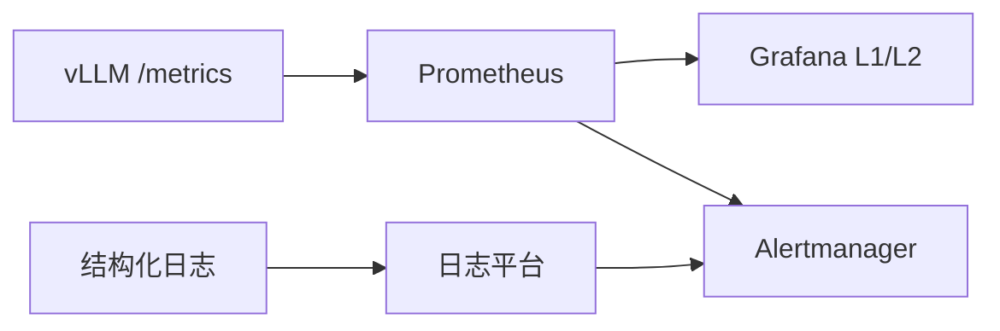

服务在 K8s 里跑起来之后（[10.1](./10.1-容器化与Kubernetes部署.md)），下一问是：**此刻是否健康、破线该不该叫醒人、线上数字能否和压测对话**。可观测性把第 9 章的指标体系接到线上——同一套 TTFT/TPOT/Goodput 口径，换成 Prometheus 刮取、Grafana 决策面、告警降噪与手册。这一节给 vLLM 场景的最小可行观测集，并显式处理「告警太多反而看不见火」的运营问题。

<!-- more -->

## 📑 目录

- [1. 问题：看见延迟还不够](#1-问题看见延迟还不够)
- [2. 与第9章对齐的黄金指标](#2-与第9章对齐的黄金指标)
- [3. 饱和与解释性指标](#3-饱和与解释性指标)
- [4. Grafana：服务决策的分层看板](#4-grafana服务决策的分层看板)
- [5. 日志：结构化与关联](#5-日志结构化与关联)
- [6. 告警设计与降噪](#6-告警设计与降噪)
- [7. 落地注意点与 on-call 路径](#7-落地注意点与-on-call-路径)
- [8. 代价与权衡](#8-代价与权衡)
- [总结](#-总结)
- [自我检验清单](#-自我检验清单)
- [参考资料](#-参考资料)

---

## 1. 问题：看见延迟还不够

| 支柱 | 回答的问题 | 载体 |
|---|---|---|
| Metrics | 系统现在怎样、趋势如何 | Prometheus |
| Logs | 某个请求/错误发生了什么 | 结构化日志 |
| Traces（可选） | 网关—引擎—工具的耗时拆解 | OpenTelemetry 等 |

LLM 服务至少先把 **Metrics + Logs** 做扎实；分布式 Trace 在多跳 Agent / 工具链场景再加。

只盯「延迟高」却没有 **waiting 队列与 KV 利用率**，on-call 只能猜：是 Prefill 变慢、池子满了、还是发布把 Ready 副本打没了？观测的目标是**可归因**，不是指标越多越好。

📌 **关键点**：线上指标定义必须与 [9.1](../第9章-性能分析与Benchmark/9.1-推理指标体系.md) / [9.2](../第9章-性能分析与Benchmark/9.2-压测工具.md) 同源——否则「压测绿、线上红」会变成口径战争，而不是故障。

---

## 2. 与第9章对齐的黄金指标

vLLM 暴露 `/metrics`（路径以当前版本为准）。**黄金信号**建议与第 9 章门禁同一语义：

| 黄金指标 | 第9章对应 | 线上用途 |
|---|---|---|
| TTFT P95 / P99 | 首 Token 体验 | SLO、发布金丝雀 |
| TPOT / ITL P95 | 解码流畅度 | SLO、回归对比 |
| 成功请求下的有效吞吐（Goodput） | 饱和曲线纵轴 | 产能与扩容 |
| 错误率 / 超时率 | 门禁硬项 | 错误预算、P1 |
| 可用性（Ready 副本 / 成功率） | — | 发布与故障域 |

分位计算纪律：

- 用直方图 + `histogram_quantile`，**先跨副本聚合桶，再取分位**；
- 禁止「对每个 Pod 的 P95 再平均」——那会系统性乐观；
- scrape 间隔（如 $15\,\mathrm{s}$）决定你对秒级尖刺的分辨率；门禁里的「正式窗」与线上「持续 `for`」要说清差异。

💡 **提示**：活动备战前，用同一混合负载把线上 scrape 的 TTFT/TPOT 与 `vllm bench` 对一次表；偏差来自负载形状或定义漂移时，先修定义，再调阈值。

---

## 3. 饱和与解释性指标

黄金指标说「坏了」；饱和指标说「为什么」：

| 指标族 | 含义 | 典型动作 |
|---|---|---|
| running / waiting 请求数 | 执行中 vs 排队 | waiting 持续高 → 扩容/限流 |
| KV Cache 利用率 | 上下文与前缀占池 | >0.85～0.9 持续 → 领先扩容或降并发 |
| 抢占次数 | KV 不够踢请求 | 尾延迟解释；查并发与长度 |
| 前缀缓存命中率 | 路由/粘滞是否生效 | 验证 [10.3](./10.3-自动扩缩容与负载均衡.md) |
| Token 吞吐（in/out） | 毛产能 | 与 Goodput 对照，防「忙但无效」 |
| GPU 显存 / 利用率 | 硬件侧 | 辅助；**单独告 GPU Util 易误导** |



Decode 常偏 Memory Bound：GPU Util 不高也可能已经排队——这正是 [10.3](./10.3-自动扩缩容与负载均衡.md) 不用纯 CPU/GPU Util 做 HPA 的原因，观测侧同样成立。

---

## 4. Grafana：服务决策的分层看板

建议四行布局（避免一屏五十图）：

1. **黄金信号**：QPS、错误率、TTFT P95、TPOT P95  
2. **饱和**：KV 利用率、waiting、抢占、显存  
3. **吞吐**：in/out tokens/s、每副本 Goodput  
4. **变更注解**：部署 digest、配置变更打在时间轴上  

分层：

| 层 | 受众 | 30 秒问题 |
|---|---|---|
| L1 总览 | on-call | 是否破 SLO？是否在发版？ |
| L2 引擎 | 推理业主 | 队列 / KV / 命中率谁异常？ |
| L3 节点/GPU | 平台 | 驱逐、硬件、驱动？ |

🔑 **核心概念**：每张图应对应一个动作——扩容、限流、回滚、查日志；画不出动作的图，默认删掉。

---

## 5. 日志：结构化与关联

推荐字段（示例）：

```json
{
  "ts": "2026-08-10T12:00:01Z",
  "level": "info",
  "request_id": "…",
  "model": "chat-7b",
  "adapter": "tenant_a",
  "input_tokens": 1024,
  "output_tokens": 128,
  "ttft_ms": 210,
  "status": "ok",
  "reason": null
}
```

实践：

- 网关生成 `request_id`，贯穿引擎；
- 默认勿落完整 Prompt/回答（隐私与成本）；需要时采样脱敏；
- 错误带明确 `reason`：OOM、超时、校验失败、上游 5xx。

Metrics 负责趋势，Logs 负责「这一单」；两者靠 `request_id` 与时间窗汇合。

---

## 6. 告警设计与降噪

告警要少而准。建议从这些开始：

| 告警 | 条件思路 | 严重度 |
|---|---|---|
| 高错误率 | 失败率 > 阈，持续 `for` | P1 |
| TTFT / TPOT SLO 破线 | P95 超阈持续 | P1/P2 |
| 队列堆积 | waiting 持续高于阈 | P2 |
| KV 将满 | 利用率高位持续 | P2（领先） |
| 抢占激增 | 速率环比暴涨 + `for` | P2 |
| Ready 副本不足 | Ready < 期望 | P1 |

### 6.1 降噪纪律

| 手段 | 作用 | 滥用后果 |
|---|---|---|
| `for` 窗口（如 5～10 min） | 过滤瞬时尖刺 | 过长 → 真故障发现晚 |
| 中位数/多窗口确认 | 降假阳性 | 过宽 → 假阴性（同 [9.5](../第9章-性能分析与Benchmark/9.5-性能回归门禁.md)） |
| 抑制与聚合 | 同一根因少吵 | 可能吞掉第二故障 |
| label 基数克制 | 控 TSDB 与查询成本 | 按用户 ID 打标会炸 |
| 手册链接 | 降低 MTTR | 无手册 → 告警变噪音 |

反模式：

- 无 `for` 的瞬时尖刺页；
- 复制几十条低价值告警导致疲劳；
- **只告 GPU Util**——Decode 下常不升高却已过载；
- 阈值拍脑袋，不与压测噪声/业务 SLO 对齐。

取舍句：把 TTFT 告警从「破线即叫」改成「破线 30 分钟再叫」以减少打扰，本质是**用更长的用户伤害窗口换安静**——若 $\sigma$ 来自 scrape 抖动，应先修指标与聚合，而不是无限加长 `for`。

⚠️ **注意**：每条 P1/P2 必须挂手册：先看哪张 L1 图、常见缓解（扩容 / 限流 / 回滚）、升级给谁。

---

## 7. 落地注意点与 on-call 路径

1. 与压测同源：TTFT/TPOT/错误率定义对齐第 9 章；  
2. 多副本分位：直方图聚合后再 `histogram_quantile`；  
3. `/metrics` 不对公网（安全基线见 [10.3](./10.3-自动扩缩容与负载均衡.md)）；  
4. 多模态 / LoRA：Encoder 耗时、Adapter 加载纳入定制指标；  
5. 发布注解：没有注解，金丝雀回滚只能靠猜。  

### on-call 五分钟路径

1. L1：错误率是否升？TTFT 与 TPOT 谁破线？  
2. 饱和：waiting 与 KV 是否顶满？抢占是否暴涨？  
3. 变更注解：是否刚发版 / 改配置 / 缩容？  
4. 抽样日志：`reason` 是超时、OOM 还是上游？  
5. 决策：限流 / 扩容 / 回滚 / 下钻节点。  

把五步贴进告警通知，比只丢一个阈值有效得多。

---

## 8. 代价与权衡

| 选择 | 收益 | 代价 / 不适用 |
|---|---|---|
| 黄金指标 + 饱和四件套 | 可归因 | 要维护与第9章同源的定义 |
| 高基数租户 label | 细账单 | TSDB 与告警爆炸 |
| 短 `for`、严阈值 | 假阴性↓ | 假阳性↑、疲劳 |
| 长 `for`、宽阈值 | 安静 | 用户先受伤 |
| 全量 Trace | 跨服务好查 | 成本高；先 Metrics+Logs |
| 只看板不告警 | 无打扰 | 无人看时等于没有观测 |

适用：已有 Prometheus/Grafana，且能从引擎刮到队列与 KV。  
若只有节点级 GPU Util，先补引擎指标，再谈「智能告警」。

---

## 📝 总结

- 观测底座是 Metrics + Logs；目标是可归因，不是堆图。
- **黄金指标与第 9 章 TTFT/TPOT/Goodput/错误率对齐**；分位先聚合再计算。
- waiting、KV、抢占、命中率解释「为什么慢」；勿单靠 GPU Util。
- Grafana 按黄金→饱和→吞吐→变更分层，图要对应动作。
- 告警少而准：`for`、聚合、手册与基数克制是降噪主力；放宽阈值是最后手段。
- on-call 需要可执行的五分钟路径。

## 🎯 自我检验清单

- 能列出黄金指标，并说明与 [9.1](../第9章-性能分析与Benchmark/9.1-推理指标体系.md) 的对应关系
- 能解释 waiting 与 KV 利用率如何把「延迟高」变成可动作结论
- 能说明为何不能对多副本 P95 再平均
- 能设计 L1/L2 核心图表，并各配一个动作
- 能给出三条高价值告警与两条降噪手段，并口述假阳性/假阴性权衡
- 能走完五分钟 on-call 路径

## 📚 参考资料

- [vLLM — Metrics](https://docs.vllm.ai/en/latest/serving/metrics.html)
- [Prometheus 文档](https://prometheus.io/docs/)
- [Grafana 最佳实践](https://grafana.com/docs/)
- [本模块 9.1 推理指标体系](../第9章-性能分析与Benchmark/9.1-推理指标体系.md)
- [本模块 9.2 压测工具](../第9章-性能分析与Benchmark/9.2-压测工具.md)
- [本模块 9.5 性能回归门禁](../第9章-性能分析与Benchmark/9.5-性能回归门禁.md)
- [本模块 10.3 自动扩缩容与负载均衡](./10.3-自动扩缩容与负载均衡.md)
