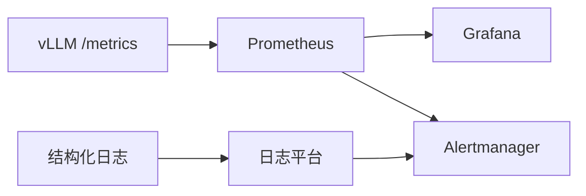

服务在 K8s 里跑起来之后，下一问是：怎么知道它此刻健康、明天是否扛得住活动流量？可观测性把第 9 章的指标体系接到线上：Prometheus 抓取引擎指标，Grafana 呈现，日志与告警补齐因果链。这一节给出 vLLM 场景下的最小可行观测集。

<!-- more -->

## 📑 目录

- [1. 观测的三根支柱](#1-观测的三根支柱)
- [2. vLLM / Prometheus 关键指标](#2-vllm--prometheus-关键指标)
- [3. Grafana 看板怎么铺](#3-grafana-看板怎么铺)
- [4. 日志：结构化与关联](#4-日志结构化与关联)
- [5. 告警规则设计](#5-告警规则设计)
- [6. 落地注意点](#6-落地注意点)
- [总结](#-总结)
- [自我检验清单](#-自我检验清单)
- [参考资料](#-参考资料)

---

## 1. 观测的三根支柱

| 支柱 | 回答的问题 | 载体 |
|---|---|---|
| Metrics | 系统现在怎样、趋势如何 | Prometheus |
| Logs | 某个请求/错误发生了什么 | 结构化日志 |
| Traces（可选） | 跨网关—引擎—工具的耗时拆解 | OpenTelemetry 等 |

LLM 服务至少要先把 **Metrics + Logs** 做扎实；分布式 Trace 在网关与多服务 Agent 场景再增强。

📌 **关键点**：没有 KV 利用率与排队长度，你只能看见"延迟高"，看不见"为什么高"。

---

## 2. vLLM / Prometheus 关键指标

vLLM 暴露 Prometheus 端点（路径以当前版本为准，常见为 `/metrics`）。优先刮取并理解：

| 指标族 | 含义 | 用途 |
|---|---|---|
| TTFT / TPOT 相关直方图或摘要 | 首 Token 与每 Token 延迟 | SLO 与体验 |
| 成功/失败请求计数 | 可用性 | 错误预算 |
| running / waiting 请求数 | 执行中 vs 排队 | 过载判断 |
| KV Cache 利用率 | 前缀与上下文占池比例 | 扩容领先指标 |
| 抢占次数 | KV 不够触发抢占 | 尾延迟解释 |
| Token 吞吐 | 输入/输出 token 速率 | 产能 |
| 前缀缓存命中（若有） | 缓存是否生效 | 优化验证 |



💡 **提示**：直方图分位要用 Prometheus 的 `histogram_quantile` 正确计算，并注意 scrape 间隔对短突刺的分辨率。

---

## 3. Grafana 看板怎么铺

建议四行布局（避免一屏五十图）：

1. **黄金信号**：QPS、错误率、TTFT P95、TPOT P95
2. **饱和**：KV 利用率、waiting 队列、抢占、GPU 显存
3. **吞吐**：输入/输出 tokens/s、每副本产能
4. **变更注解**：部署版本、配置变更事件打在时间轴上

分层看板：

- L1 总览：给 on-call 30 秒判断
- L2 引擎：给推理业主下钻
- L3 节点/GPU：给平台组看硬件与驱逐

🔑 **核心概念**：看板服务**决策**，不是指标堆砌。每张图都应对应一个动作（扩容 / 限流 / 回滚 / 查日志）。

---

## 4. 日志：结构化与关联

推荐字段：

```json
{
  "ts": "2026-08-10T12:00:01Z",
  "level": "info",
  "request_id": "…",
  "model": "chat-7b",
  "adapter": "tenant_a",
  "input_tokens": 1024,
  "output_tokens": 128,
  "ttft_ms": 210,
  "status": "ok"
}
```

实践：

- 网关生成 `request_id`，贯穿引擎日志
- 默认勿记录完整 Prompt/回答（隐私与成本）；需要时采样脱敏
- 错误日志带明确 `reason`：OOM、超时、校验失败、后端 5xx

---

## 5. 告警规则设计

告警要少而准，建议从这些开始：

| 告警 | 条件思路 | 严重度 |
|---|---|---|
| 高错误率 | 5xx/失败率 > 阈值，持续 N 分钟 | P1 |
| TTFT SLO 破线 | P95 超阈持续 | P1/P2 |
| 队列堆积 | waiting 持续高于阈值 | P2 |
| KV 将满 | 利用率 > 0.85～0.9 持续 | P2（领先） |
| 抢占激增 | 速率环比暴涨 | P2 |
| 副本未就绪 | Ready Pod < 期望 | P1 |

反模式：

- 对瞬时尖刺原样报警（无 for 窗口）
- 复制 100 条低价值告警导致疲劳
- 只告 GPU Util——Decode 下容易误导

⚠️ **注意**：告警必须挂**手册链接**：谁处理、先看哪张图、常见缓解（扩容/限流/回滚）。

---

## 6. 落地注意点

1. 指标基数爆炸：按模型/租户 label 要克制
2. 多副本聚合：P95 应在直方图上聚合再分位，不是对 P95 再平均
3. 与压测同源：线上定义和 bench 定义尽量对齐
4. 安全：`/metrics` 勿对公网裸露
5. 多模态/LoRA：把 Encoder 耗时、Adapter 加载延迟纳入定制指标

### 6.1 on-call 五分钟手册（示例）

1. 打开 L1：错误率是否升？TTFT/TPOT 谁破线？
2. 看饱和：waiting 与 KV 是否顶满？抢占是否暴涨？
3. 看变更注解：最近是否发版/改配置？
4. 抽样日志：失败 `reason` 是超时、OOM 还是上游 5xx？
5. 决策：限流 / 扩容 / 回滚 / 继续下钻节点

把这五步贴进告警通知，比只丢一个阈值有效得多。

---

## 📝 总结

- 生产观测以 Metrics + Logs 为底座，按需加 Trace。
- 优先刮取 TTFT/TPOT、队列、KV 利用率、抢占与吞吐。
- Grafana 按黄金信号→饱和→吞吐→变更注解铺设。
- 结构化日志用 request_id 串联，注意隐私。
- 告警少而准，附手册，并用领先指标（KV/队列）防患未然。
- on-call 需要可执行的五分钟路径，而不是一堆红图。

## 🎯 自我检验清单

- 能列出至少六类应刮取的引擎指标及用途
- 能说明 waiting 队列与 KV 利用率如何解释延迟
- 能设计 L1/L2 两层看板的核心图表
- 能写出一条含 request_id 的结构化日志示例
- 能给出三条高价值告警与一条反模式
- 能解释多副本上错误计算 P95 的风险

## 📚 参考资料

- [vLLM — Metrics](https://docs.vllm.ai/en/latest/serving/metrics.html)
- [Prometheus 文档](https://prometheus.io/docs/)
- [Grafana 最佳实践](https://grafana.com/docs/)
