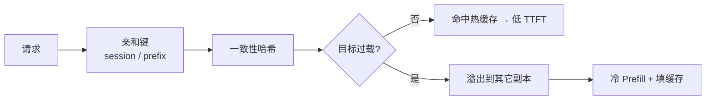
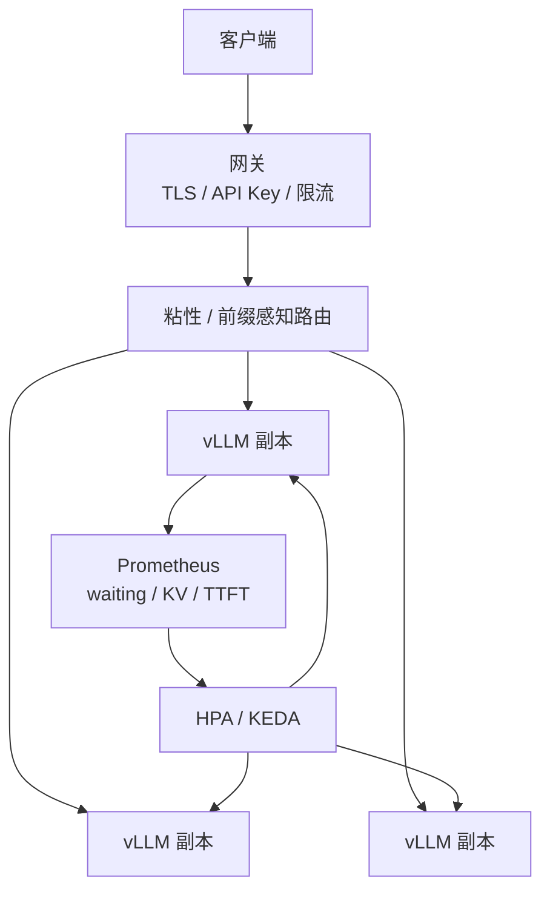

单副本摸高之后，流量靠多副本扛。可是 LLM 的扩缩容不能只抄 CPU HPA：**真正的饱和信号常常是 waiting 队列与 KV，而不是 GPU 利用率百分比**（[10.2](./10.2-可观测性.md)）。路由也不能只做圆桌轮询——前缀缓存命中率依赖「相似请求是否打到同一副本」。再加上安全：vLLM OpenAI 兼容服务默认无认证，裸露公网等于开放算力与数据。这一节把伸缩信号、粘性/前缀路由与网关安全串成可运维决策。

<!-- more -->

## 📑 目录

- [1. 问题：多副本并不等价](#1-问题多副本并不等价)
- [2. 伸缩信号：队列深度 vs GPU 利用率](#2-伸缩信号队列深度-vs-gpu-利用率)
- [3. HPA / KEDA 落地要点](#3-hpa--keda-落地要点)
- [4. 粘性会话与前缀感知路由](#4-粘性会话与前缀感知路由)
- [5. 安全：默认无认证，必须外置加固](#5-安全默认无认证必须外置加固)
- [6. 推荐架构与验收](#6-推荐架构与验收)
- [7. 代价与权衡](#7-代价与权衡)
- [总结](#-总结)
- [自我检验清单](#-自我检验清单)
- [参考资料](#-参考资料)

---

## 1. 问题：多副本并不等价

目标：

- 在 SLO 内吸收峰值 QPS；
- 滚动升级时不中断（[10.1](./10.1-容器化与Kubernetes部署.md)）；
- 尽量吃到 Prefix Cache / 会话前缀复用的红利。

难点：

- 冷启动慢（镜像 + 权重 + 编译）→ 扩容有时延；
- 伸缩信号与 CPU/GPU Util 弱相关；
- **缓存状态**打破「副本完全无状态」假设——路由会改变有效 $Q^{*}$。

📌 **关键点**：把每个副本当成「带热缓存的准有状态工人」；扩缩容看队列与 KV，路由看前缀与会话亲和。

---

## 2. 伸缩信号：队列深度 vs GPU 利用率

| 信号 | 推荐度 | 机制直觉 | 误导场景 |
|---|---|---|---|
| CPU 利用率 | 弱 | Decode 常不吃满 CPU | 已严重排队而 CPU 仍低 |
| **GPU Util** | 中偏弱 | 有参考，但不等于 Goodput | Memory Bound / 等 KV 时 Util 不高 |
| 并发 / QPS | 中高 | 直观，需标定单副本 $Q^{*}$ | 负载形状变了仍用旧阈值 |
| **waiting 队列深度** | 高 | 直接反映「来不及做」 | 要防瞬时尖刺（加窗口） |
| **KV Cache 利用率** | 高 | 满池前的领先指标 | 命中率突变时水位解释要变 |
| TTFT P95 | 高但滞后 | 适合告警与门禁 | 单独做 HPA 易抖 |

为何 GPU Util 不够格当主信号：

教学对照（**示意**）：某副本 GPU Util $\approx 45\%$，但 waiting $=40$、TTFT P95 已从 $600\,\mathrm{ms}$ 爬到 $2.5\,\mathrm{s}$——瓶颈在调度队列与 KV，不在「算力百分比」。若 HPA 盯 Util $<70\%$ 不扩容，等于**用错误仪表盘节省了副本、卖掉了 SLO**。

取舍句：用 GPU Util 做唯一伸缩信号「简单」，本质是把 Memory Bound 与排队过载当成「还有余量」——便宜的是实现，昂贵的是尾延迟。

与第 9 章衔接：先用饱和曲线标定 SLO 内单副本 $Q^{*}$（[9.2](../第9章-性能分析与Benchmark/9.2-压测工具.md)、[10.4](./10.4-容量规划.md)），再把 HPA 目标绑在「每副本负载 $\approx 0.6\sim 0.8\,Q^{*}$」或等价的队列/KV 阈值上。

---

## 3. HPA / KEDA 落地要点

推荐顺序：

1. 压出 $Q^{*}$（含业务混合长度与保守缓存命中率）；  
2. 选主信号：waiting 或「每副本 inflight / 目标 QPS」，KV 作领先扩容；  
3. **minReplicas** 盖住基线，**maxReplicas** 卡预算；  
4. **扩容快、缩容慢**，避免抖动与缓存反复冷启动；  
5. 未 Ready 副本不计入有效容量（探针见 [10.1](./10.1-容器化与Kubernetes部署.md)）；  
6. 网关侧排队/限流托住超预测量，比无限扩容更能保护尾延迟。  

示意目标（概念，非某一 CRD 方言）：

```text
scale_up   when  avg(waiting) > W_high  for 1–2 min
           or    kv_util > 0.85       for 2–3 min
scale_down when  avg(waiting) < W_low and kv_util < 0.6
           for 10–20 min   # 明显长于 scale_up
```

冷启动时延 $T_{\text{cold}}$ 若为 $5\sim 10\,\mathrm{min}$，活动前应**预热到所需副本**，而不是指望警报响起后再扩——HPA 救的是「缓爬坡」，不是「零准备秒级翻倍」。

💡 **提示**：KEDA / Prometheus Adapter 只是「把自定义指标接到伸缩器」的管子；管子再顺，信号选错仍然会反着扩。

---

## 4. 粘性会话与前缀感知路由

普通轮询/随机会把共享同一 System Prompt 或同一会话前缀的请求打散 → **Prefix Cache 命中率下降** → Prefill 变重 → TTFT 回升，单副本有效 $Q^{*}$ 变差。

### 4.1 两种亲和

| 策略 | 键 | 收益 | 风险 |
|---|---|---|---|
| **粘性会话** | `session_id` / 用户连接 | 多轮对话 KV/前缀友好 | 长会话黏在热点副本 |
| **前缀感知** | 系统提示 / 工具前缀指纹、图像 Hash 等 | 跨用户共享长前缀 | 指纹过粗→假共享；过细→无粘滞 |

机制：

1. 计算亲和键（会话 ID 或前缀指纹）；  
2. 一致性哈希落到副本；  
3. 目标过载则**溢出**到次优副本，接受短期命中率损失；  
4. 缩容时避免一次抽掉承载大量粘滞热度的副本（分批 + 慢缩）。  



适用：长系统提示、多轮会话、同图多轮 VLM。  
不太适用：完全随机短请求——粘滞成本可能高于收益。

教学账（**示意**）：共享 $2\,\mathrm{k}$ Token 系统提示，命中时 Prefill 可省大半。若轮询把命中率从 $70\%$ 打到 $20\%$，同样 QPS 下 TTFT P95 与 GPU 时间都会变差——**路由在偷容量**。粘滞过度则另一端：单租户打爆一副本，全局还有空闲。必须同时有**过载溢出 + 租户限流**。

⚠️ **注意**：亲和不是「永远钉死」。SLO 优先于命中率；过载时果断溢出。

---

## 5. 安全：默认无认证，必须外置加固

⚠️ **严重安全提示**：vLLM 的 OpenAI 兼容 HTTP 服务**默认不启用用户认证**。拿到地址即可消耗 GPU、触达 Prompt 与已挂载能力（视配置）。**切勿把引擎端口直接暴露公网。**

| 控制 | 要求 |
|---|---|
| 网络隔离 | 仅集群内/私网；公网只进网关 |
| TLS | 网关终止 HTTPS |
| API Key / OAuth | 网关校验；按租户配额 |
| 限流 | 保护 $Q_{\text{peak}}$ 与错误预算 |
| 管理端点 | `/metrics`、调试口不对公网 |
| 秘密 | Secret 挂载；镜像无密钥 |

```text
Internet → API Gateway (TLS + API Key + 限流)
        → 前缀/会话感知路由
        → 内部 Service → vLLM Pods
```

🔑 **核心概念**：**认证、配额、限流属于网关职责**；引擎专注生成。默认信任网络是事故模板。

---

## 6. 推荐架构与验收



检查清单：

```text
[ ] 单副本 Q* 已在业务负载下测得
[ ] HPA 主信号是队列 / 目标 QPS / KV，而非 CPU 或裸 GPU Util
[ ] 扩容快、缩容慢；冷启动长时活动前预热
[ ] 路由有会话或前缀亲和，并具备过载溢出
[ ] 网关强制 TLS + API Key；引擎不对公网
[ ] 外网视角验收：直连引擎失败、无 Key 401、超配额限流、/metrics 不可达
```

任何一项安全验收不过，都不允许宣称「生产已就绪」。

---

## 7. 代价与权衡

| 选择 | 收益 | 代价 / 不适用 |
|---|---|---|
| 队列 / KV 驱动 HPA | 对准真实过载 | 依赖自定义指标管线 |
| GPU Util 驱动 HPA | 实现简单 | Memory Bound 下假阴性扩容 |
| 强粘滞 / 前缀路由 | TTFT↓、有效 $Q^{*}$↑ | 热点租户；缩容更谨慎 |
| 纯轮询 | 实现简单、均匀 | 缓存命中率与产能双杀 |
| 活动前预热 | 避开 $T_{\text{cold}}$ | 多付空闲 GPU 时间 |
| 无限自动扩 | 看似省心 | 成本失控；不如网关限流 |

适用：已能量出 $Q^{*}$ 与 $T_{\text{cold}}$，并刮到 waiting/KV。  
若副本数长期=1，先把单副本观测与容量账做对，再上复杂路由。

---

## 📝 总结

- 多副本是准有状态工人：伸缩看饱和，路由看缓存亲和。
- **waiting / KV 优于 GPU Util** 作为主伸缩信号；HPA 绑定 $Q^{*}$，扩快缩慢，冷启动长则预热。
- 粘性会话与前缀感知提升命中率与有效产能，必须配合过载溢出与租户限流。
- 认证与配额放网关；引擎默认无认证，禁止公网裸奔。
- 架构拼装：网关安全面 + 感知路由 + 指标驱动扩缩容。

## 🎯 自我检验清单

- 能解释为何 GPU Util / CPU HPA 对 LLM 常失灵，并举队列反例
- 能根据饱和曲线设定 HPA 目标负荷区间
- 能对比粘性会话与前缀感知的键、收益与热点风险
- 能说明过载时为何应溢出而非死守命中率
- 能复述默认无认证的风险与最低安全基线
- 能画出网关—路由—副本—HPA 的数据与控制流

## 📚 参考资料

- [Kubernetes HPA](https://kubernetes.io/docs/tasks/run-application/horizontal-pod-autoscale/)
- [KEDA](https://keda.sh/)
- [vLLM — Production Serving](https://docs.vllm.ai/en/latest/serving/)
- [OWASP API Security](https://owasp.org/www-project-api-security/)
- [本模块 9.2 压测工具](../第9章-性能分析与Benchmark/9.2-压测工具.md)
- [本模块 10.1 容器化与 Kubernetes 部署](./10.1-容器化与Kubernetes部署.md)
- [本模块 10.2 可观测性](./10.2-可观测性.md)
- [本模块 10.4 容量规划](./10.4-容量规划.md)
