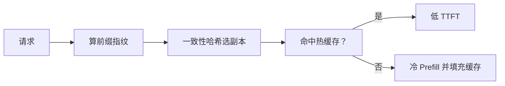
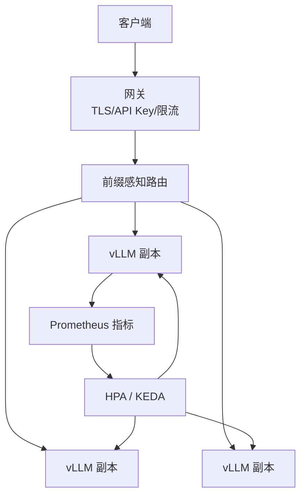

单副本摸高之后，流量增长靠多副本扛。可是 LLM 服务的扩缩容不能只抄 CPU HPA：真正的饱和信号常常是队列与 KV，而不是 CPU 百分比。路由也不能只做圆桌轮询——前缀缓存命中率高度依赖"相似请求是否打到同一副本"。更关键的是安全：vLLM OpenAI 兼容服务默认不做认证，裸露公网等于开放算力与数据。

<!-- more -->

## 📑 目录

- [1. 多副本的目标与难点](#1-多副本的目标与难点)
- [2. HPA：用对伸缩信号](#2-hpa用对伸缩信号)
- [3. 前缀感知负载均衡](#3-前缀感知负载均衡)
- [4. 安全：默认无认证，必须外置加固](#4-安全默认无认证必须外置加固)
- [5. 推荐架构拼装](#5-推荐架构拼装)
- [总结](#-总结)
- [自我检验清单](#-自我检验清单)
- [参考资料](#-参考资料)

---

## 1. 多副本的目标与难点

目标：

- 在 SLO 内吸收峰值 QPS
- 滚动升级时不中断
- 尽量提高 Prefix Cache / 系统提示复用收益

难点：

- 冷启动慢（拉镜像 + 拉权重 + 编译）
- 伸缩信号与 CPU 不相关
- 无状态假设被**缓存状态**打破——副本并不完全等价

📌 **关键点**：把每个副本当成"带热缓存的准有状态工人"，路由与扩缩容都要围绕这一点设计。

---

## 2. HPA：用对伸缩信号

| 信号 | 是否推荐 | 说明 |
|---|---|---|
| CPU 利用率 | 弱 | Decode 常 Memory Bound，CPU 可能不升高 |
| GPU Util | 中 | 有参考，但需结合队列 |
| 请求 QPS / 并发 | 中高 | 直观，需校准单副本容量 |
| waiting 队列长度 | 高 | 直接反映过载 |
| KV Cache 利用率 | 高 | 领先指标，满池前扩容 |
| TTFT P95 | 高但滞后 | 适合告警，做 HPA 要防抖 |

实践建议：

1. 用第 9 章饱和曲线确定**单副本 SLO 拐点**（例如有效 QPS=Q*）
2. HPA 目标设为维持每副本负载在 0.6～0.8 Q*
3. 设置**最小副本**覆盖基线，**最大副本**卡预算
4. 扩容要快、缩容要慢（避免抖动）
5. 配合启动探针与预热，防止"未就绪副本被计入容量"

```yaml
# 概念：自定义指标 HPA（队列/QPS）比纯 CPU 更合理
# 具体 CRD 取决于 Prometheus Adapter / KEDA 等方案
```

💡 **提示**：突发流量可在网关做**排队与限流**，比无限扩容更能保护尾延迟。

---

## 3. 前缀感知负载均衡

普通轮询会把共享同一 System Prompt / 同一会话前缀的请求打散，**Prefix Cache 命中率下降**，TTFT 回升。

前缀感知（Prefix-aware）路由思想：

1. 计算请求前缀指纹（系统提示、会话 ID、图像 Hash 等）
2. 将相同指纹的请求尽量导向同一副本（一致性哈希 / 粘滞）
3. 副本过载时再溢出到其它副本，并接受短期命中率损失



适用：

- ✅ 长系统提示、多轮会话、同图多轮 VLM
- ❌ 完全随机短请求（收益有限）

⚠️ **注意**：粘滞过度会导致"热点租户打爆单副本"。要有过载溢出与租户级限流。

---

## 4. 安全：默认无认证，必须外置加固

⚠️ **严重安全提示**：vLLM 的 OpenAI 兼容 HTTP 服务**默认不启用用户认证**。任何人拿到地址就能消耗 GPU、读取/注入 Prompt、调用已挂载工具相关能力（视配置而定）。**切勿直接把服务端口暴露到公网。**

生产最低安全基线：

| 控制 | 要求 |
|---|---|
| 网络隔离 | 仅集群内或私网可达；公网只进网关 |
| TLS | 网关终止 HTTPS，禁明文 |
| API Key / OAuth | 网关校验；按租户配额 |
| 鉴权失败审计 | 记录来源 IP 与 key id |
| 管理端点 | `/metrics`、调试接口不暴露公网 |
| 依赖与镜像 | 定期修补；秘密用 Secret 挂载 |

```text
Internet → API Gateway (TLS + API Key + 限流)
        → 内部 Service → vLLM Pods
```

不要指望"没人知道 URL 就不安全问题"。扫描器会找到你。

🔑 **核心概念**：**认证与配额属于网关职责**；推理引擎专注生成。默认信任网络是事故模板。

---

## 5. 推荐架构拼装



检查清单：

1. 单副本容量 Q* 已测
2. HPA 信号来自队列/QPS/KV，而非盲目 CPU
3. 路由考虑前缀粘滞与过载溢出
4. 网关强制 TLS + API Key，引擎不直接对公网
5. 缩容不干掉仍有粘滞热度的全部副本（可分批）

### 5.1 上线前安全验收（必做）

在浏览器或外网机器上验证：

- 直连 NodePort / 公网 IP 访问引擎端口应**失败**（仅网关可达）
- 无 Key 或错误 Key 访问网关返回 401/403
- 有 Key 但超配额被限流
- `/metrics` 外网不可达

任何一项不过，都不允许宣称"生产已就绪"。

---

## 📝 总结

- 多副本要同时解决容量、发布与缓存亲和。
- HPA 应使用队列、QPS、KV 等信号，并绑定单副本 SLO 拐点。
- 前缀感知路由提升缓存命中，但需防止热点与过载。
- vLLM 默认无认证；生产必须经网关做 TLS、API Key、限流与隔离。
- 推荐拼装：网关安全面 + 感知路由 + 指标驱动扩缩容。
- 上线前用外网视角做安全验收，防止引擎端口裸奔。

## 🎯 自我检验清单

- 能解释为何 CPU HPA 对 LLM 常常失灵
- 能根据饱和曲线设定 HPA 目标利用率
- 能描述前缀感知路由如何提高 TTFT 收益
- 能说出粘滞路由的热点风险与缓解
- 能复述"默认无认证"的风险与最低安全基线
- 能画出网关—路由—副本—HPA 的架构图

## 📚 参考资料

- [Kubernetes HPA](https://kubernetes.io/docs/tasks/run-application/horizontal-pod-autoscale/)
- [KEDA](https://keda.sh/)
- [vLLM — Production Serving / Security notes in docs](https://docs.vllm.ai/)
- [OWASP API Security](https://owasp.org/www-project-api-security/)
