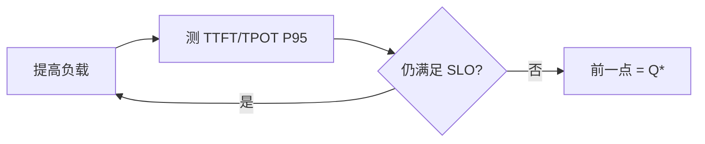

买多少卡、每张卡跑什么配置，是管理层必问、工程上又最容易拍脑袋的问题。正确路径不是从"硬件目录"往下猜，而是从 **SLO + 峰值流量** 反推：单副本有效容量是多少，再乘冗余，最后换算成本。这一节给出可复用的计算框架。

<!-- more -->

## 📑 目录

- [1. 输入：你必须先有的数](#1-输入你必须先有的数)
- [2. 单副本有效容量 Q*](#2-单副本有效容量-q)
- [3. 从峰值 QPS 到副本数与 GPU 数](#3-从峰值-qps-到副本数与-gpu-数)
- [4. 显存与上下文约束](#4-显存与上下文约束)
- [5. 成本模型与优化杠杆](#5-成本模型与优化杠杆)
- [6. 工作样例](#6-工作样例)
- [总结](#-总结)
- [自我检验清单](#-自我检验清单)
- [参考资料](#-参考资料)

---

## 1. 输入：你必须先有的数

| 输入 | 来源 |
|---|---|
| SLO：TTFT/TPOT P95、错误率 | 产品/商务 |
| 峰值 QPS（或 RPM）与持续时长 | 流量预测/历史 |
| 负载形状：输入/输出长度、缓存命中率 | 采样 trace |
| 模型与精度、并行度 | 技术方案 |
| 单副本压测饱和曲线 | 第 9 章 bench |
| 冗余目标（故障/发布/突刺） | 运维策略 |

没有负载形状的"峰值 QPS"无法换算——同样 10 QPS，输出 50 Token 与 500 Token 差一个数量级产能。

📌 **关键点**：容量规划的货币最好是 **SLO 内的有效 QPS（Goodput）**，不是实验室峰值 tokens/s。

---

## 2. 单副本有效容量 Q*

步骤：

1. 固定模型、硬件、引擎配置、采样参数
2. 用业务混合负载扫请求速率
3. 找到仍满足 SLO 的最大速率 → **Q\***（每副本）
4. 同步记录该点的 KV 利用率、TPOT/TTFT P95

若副本使用 TP=2，则该"副本"消耗 2 张 GPU，后面换算时不要漏乘。

---

## 3. 从峰值 QPS 到副本数与 GPU 数

基础公式：

$$
N_{\text{replicas}} = \left\lceil \frac{Q_{\text{peak}}}{Q^{*}} \times R \right\rceil
$$

$$
N_{\text{GPU}} = N_{\text{replicas}} \times G_{\text{per replica}}
$$

其中 $R$ 为冗余系数，建议拆解：

| 冗余分量 | 典型取值 | 含义 |
|---|---|---|
| 故障 | 1.1～1.2 | 掉一个节点/副本 |
| 发布 | 1.0～1.15 | 滚动时不可用容量 |
| 突刺 | 1.1～1.3 | 预测误差与毛刺 |
| 综合 $R$ | 常 1.3～1.6 | 视 SLA 叠加 |

网关限流要把超 $Q_{\text{peak}}$ 的部分保护起来，避免"无限进队"把 TTFT 打穿。

---

## 4. 显存与上下文约束

即便 QPS 不高，也可能因**长上下文 / 多模态 / 多 LoRA 槽位**先触顶：

- 验证 `max_model_len` 与业务 P99 输入+输出
- 看峰值并发下 KV 是否在危险区（持续 >0.85）
- 若 KV 先满：降并发、量化 KV/权重、加副本、或缩短默认上下文

容量规划要取 **QPS 约束与显存约束的更严者**：

$$
N = \max(N_{\text{by QPS}}, N_{\text{by memory concurrency}})
$$

⚠️ **注意**：前缀缓存命中率上升会提高有效 Q\*，但规划高峰时应用**保守命中率**，避免把希望当产能。

---

## 5. 成本模型与优化杠杆

简化月成本：

$$
\text{Cost} \approx N_{\text{GPU}} \times \text{price per GPU-month} + \text{周边}(存储/网络/网关)
$$

单位业务成本：

$$
\$/\text{M tokens} \approx \frac{\text{Cost}}{\text{月有效输出 Token（SLO 内）}}
$$

降本杠杆（按通常性价比排序的直觉）：

1. 提高缓存命中与批效率（同一硬件更多 Goodput）
2. 合适量化（显存↓ 或 Q\*↑，验证质量）
3. 右型号 GPU（不一定最贵最合适）
4. P/D 或投机解码等结构性优化
5. 最后才是"多买卡"

🔑 **核心概念**：先买**效率**，再买**数量**。

---

## 6. 工作样例

假设：

- SLO 内测得单副本（1×GPU）$Q^* = 6$ QPS
- 业务峰值 $Q_{peak} = 40$ QPS
- 冗余 $R = 1.4$

则：

$$
N_{\text{replicas}} = \lceil 40 / 6 \times 1.4 \rceil = \lceil 9.33 \rceil = 10
$$

$$
N_{\text{GPU}} = 10
$$

若改 TP=2 且测得每副本 $Q^*=10$（2 卡），则：

$$
N_{\text{replicas}} = \lceil 40 / 10 \times 1.4 \rceil = 6,\quad N_{\text{GPU}} = 12
$$

再比较两种拓扑的 $\$/\text{有效 QPS}$ 与运维复杂度，才能定案。

💡 **提示**：把上述计算写进表格，每次换模型/换精度就更新一行——容量规划是活文档，不是一页 PPT。

---

## 📝 总结

- 从 SLO 与峰值流量反推，而不是从硬件目录正推。
- 单副本有效容量 Q* 来自满足 SLO 的饱和曲线拐点。
- 副本数 = 峰值 / Q* × 冗余；再乘每副本 GPU 数。
- 显存与长上下文可能比 QPS 更早成为瓶颈。
- 成本用有效产出衡量；优先效率杠杆，再扩数量。

## 🎯 自我检验清单

- 能列出容量规划必需的输入清单
- 能说明 Q* 如何从压测曲线读取
- 能手算副本数与 GPU 数（含 TP）
- 能解释冗余系数各分量含义
- 能判断何时由显存约束主导扩容
- 能写出简单的 $\$/\text{M tokens}$ 口径

## 📚 参考资料

- 本模块第 9 章压测与指标体系
- [vLLM — Performance / Benchmarking](https://docs.vllm.ai/en/latest/benchmarking/)
- 云厂商 GPU 实例定价页（做成本表时取当前价）
