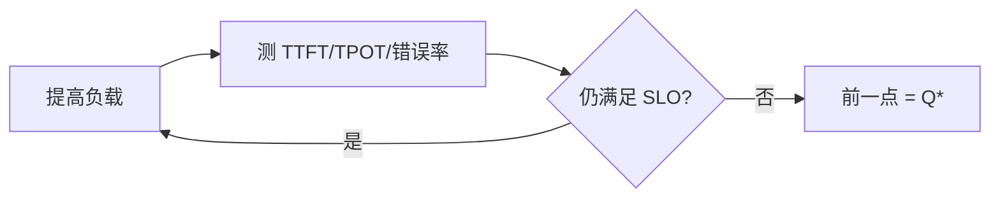

买多少卡、每副本跑几卡，是管理层必问、工程上又最容易拍脑袋的问题。正确路径不是从硬件目录往下猜，而是从 **SLO + 峰值流量** 反推：先在第 9 章负载下读出单副本有效容量 $Q^{*}$，再叠冗余与显存约束，最后换成本。这一节给出可复印的手算表与工作样例，并和 [10.1](./10.1-容器化与Kubernetes部署.md)–[10.3](./10.3-自动扩缩容与负载均衡.md) 的冷启动、发布折损、缓存命中率接上。

<!-- more -->

## 📑 目录

- [1. 问题：用 Goodput 当货币](#1-问题用-goodput-当货币)
- [2. 输入清单](#2-输入清单)
- [3. 单副本有效容量 Q*](#3-单副本有效容量-q)
- [4. 手算表：从 SLO 到实例数](#4-手算表从-slo-到实例数)
- [5. 显存与上下文约束](#5-显存与上下文约束)
- [6. 成本与优化杠杆](#6-成本与优化杠杆)
- [7. 工作样例（填表）](#7-工作样例填表)
- [8. 代价与权衡](#8-代价与权衡)
- [总结](#-总结)
- [自我检验清单](#-自我检验清单)
- [参考资料](#-参考资料)

---

## 1. 问题：用 Goodput 当货币

实验室峰值 tokens/s 好看，但不能直接当采购依据——它往往不在业务 SLO 内，也不含发布折损与故障冗余。容量规划的货币应是：

\[
\text{Goodput} = \text{满足 TTFT/TPOT/错误率 SLO 的有效 QPS（或有效 token/s）}
\]

没有负载形状的「峰值 QPS」无法换算：同样 $10\,\mathrm{QPS}$，输出 $50$ Token 与 $500$ Token 差一个数量级产能；前缀命中率从 $70\%$ 掉到 $20\%$（[10.3](./10.3-自动扩缩容与负载均衡.md)）也会改写 $Q^{*}$。

📌 **关键点**：先固定**模型 / 硬件 / 引擎 / 负载形状 / 保守命中率**，再谈张数；换其中任一变量，表要重填。

---

## 2. 输入清单

| 输入 | 单位 / 形态 | 来源 |
|---|---|---|
| TTFT / TPOT P95（或 P99）SLO | $\mathrm{ms}$ | 产品 / 商务 |
| 错误率上限 | $\%$ | SRE |
| 峰值 QPS（或 RPM）与持续时长 | $\mathrm{QPS}$、$\mathrm{min}$ | 流量预测 |
| 输入/输出长度分布 | Token | 采样 trace |
| 前缀/会话缓存命中率（规划用保守值） | $\%$ | 线上或压测 |
| 模型、精度、TP/PP | — | 技术方案 |
| 单副本饱和曲线 | QPS↔延迟 | [9.2](../第9章-性能分析与Benchmark/9.2-压测工具.md) |
| 每副本 GPU 数 $G$ | 卡/副本 | 与 TP 一致 |
| 冷启动 $T_{\text{cold}}$ | $\mathrm{min}$ | [10.1](./10.1-容器化与Kubernetes部署.md) |
| 冗余策略 | 系数或「可丢副本数」 | 运维 |

---

## 3. 单副本有效容量 Q*

步骤：

1. 固定模型、硬件、引擎、采样与**保守**缓存命中；  
2. 用业务混合负载扫描请求速率（[9.2](../第9章-性能分析与Benchmark/9.2-压测工具.md)）；  
3. 找仍满足 SLO 的最大速率 → $Q^{*}$（每副本）；  
4. 记录该点的 KV 利用率、waiting、TTFT/TPOT P95，供 [10.2](./10.2-可观测性.md) / [10.3](./10.3-自动扩缩容与负载均衡.md) 对齐阈值。  

若 `TP=2`，该副本消耗 $G=2$ 张 GPU——后面换算勿漏乘。$Q^{*}$ 是「SLO 内拐点」，不是「还能再挤一点」的实验室峰值。

---

## 4. 手算表：从 SLO 到实例数

把决策收成一张表（复印即用）：

| 行 | 符号 | 含义 | 填法 / 公式 |
|---|---|---|---|
| 1 | $\mathrm{SLO}$ | TTFT/TPOT/错误率 | 业务给定 |
| 2 | $Q_{\text{peak}}$ | 规划峰值到达率 | 预测；单位 QPS |
| 3 | $Q^{*}$ | 单副本 SLO 内有效容量 | 压测拐点；单位 QPS/副本 |
| 4 | $R_{\text{fail}}$ | 故障冗余 | 常 $1.1\sim 1.2$ |
| 5 | $R_{\text{deploy}}$ | 发布/滚动折损 | 常 $1.0\sim 1.15$（见下） |
| 6 | $R_{\text{burst}}$ | 突刺与预测误差 | 常 $1.1\sim 1.3$ |
| 7 | $R$ | 综合冗余 | $\approx R_{\text{fail}}\times R_{\text{deploy}}\times R_{\text{burst}}$，或经验 $1.3\sim 1.6$ |
| 8 | $N_{\text{replicas}}$ | 副本数 | $\lceil Q_{\text{peak}}/Q^{*}\times R\rceil$ |
| 9 | $G$ | 每副本 GPU | 与 TP 一致 |
| 10 | $N_{\text{GPU}}$ | GPU 总数 | $N_{\text{replicas}}\times G$ |
| 11 | $N_{\text{mem}}$ | 显存约束所需副本 | 见第 5 节；可更大 |
| 12 | $N_{\text{final}}$ | 最终副本 | $\max(N_{\text{replicas}}, N_{\text{mem}})$ |
| 13 | 预热策略 | 活动前是否预拉起 | 若 $T_{\text{cold}}$ 长，按 $N_{\text{final}}$ 预热 |

基础公式：

\[
N_{\text{replicas}} = \left\lceil \frac{Q_{\text{peak}}}{Q^{*}} \times R \right\rceil,\quad
N_{\text{GPU}} = N_{\text{final}} \times G
\]

发布分量与 [10.1](./10.1-容器化与Kubernetes部署.md) 对齐：若稳态 $N$ 张副本滚动时最少 Ready 为 $N-U$，粗略

\[
R_{\text{deploy}} \gtrsim \frac{N}{N-U}
\]

例如 $N=10$、$U=2$ → $R_{\text{deploy}}\gtrsim 1.25$。取舍句：把 $R$ 从 $1.2$ 砍到 $1.0$「省卡」，本质是**假设永不死机、永不发版、预测永远准**——省下的是台账，透支的是事故日。

网关限流应托住超 $Q_{\text{peak}}$ 的部分，避免无限进队把 TTFT 打穿（[10.3](./10.3-自动扩缩容与负载均衡.md)）。

---

## 5. 显存与上下文约束

即便 QPS 不高，也可能因长上下文 / 多模态 / 多 LoRA 槽位先触顶：

- 校验 `max_model_len` 与业务 P99 输入+输出；  
- 峰值并发下 KV 是否持续 $>0.85$；  
- 若 KV 先满：降并发、量化 KV/权重、加副本、或缩短默认上下文。  

\[
N_{\text{final}} = \max\!\big(N_{\text{by QPS}},\, N_{\text{by memory concurrency}}\big)
\]

⚠️ **注意**：前缀命中率上升会抬高有效 $Q^{*}$，但**规划高峰应用保守命中率**；把「希望命中」写进产能，是活动日经典事故。

---

## 6. 成本与优化杠杆

简化月成本：

\[
\text{Cost} \approx N_{\text{GPU}} \times \text{price per GPU-month} + \text{周边（存储/网络/网关）}
\]

\[
\$/\text{M tokens} \approx \frac{\text{Cost}}{\text{月有效输出 Token（SLO 内）}}
\]

降本杠杆（通常性价比直觉）：

1. 提高缓存命中与批效率（同一硬件更多 Goodput）；  
2. 合适量化（显存↓ 或 $Q^{*}$↑，验证质量）；  
3. 选对 GPU 型号（不一定最贵最合适）；  
4. P/D、投机解码等结构性优化；  
5. **最后才是多买卡**。  

🔑 **核心概念**：先买效率，再买数量；手算表应能对比「多买 2 卡」vs「命中率 +20%」哪条更便宜。

---

## 7. 工作样例（填表）

假设（**教学示意，非实测**）：

| 行 | 值 |
|---|---|
| SLO | TTFT P95 $\le 800\,\mathrm{ms}$，TPOT P95 $\le 40\,\mathrm{ms}$，错误率 $<0.1\%$ |
| $Q_{\text{peak}}$ | $40\,\mathrm{QPS}$ |
| $Q^{*}$（1×GPU，保守命中） | $6\,\mathrm{QPS}$/副本 |
| $R_{\text{fail}}, R_{\text{deploy}}, R_{\text{burst}}$ | $1.15,\ 1.15,\ 1.1$ |
| $R$ | $1.15\times 1.15\times 1.1 \approx 1.45$ |
| $N_{\text{replicas}}$ | $\lceil 40/6\times 1.45\rceil = \lceil 9.67\rceil = 10$ |
| $G$ | $1$ |
| $N_{\text{GPU}}$ | $10$ |
| 显存约束 | 并发模型要求 $\ge 8$ 副本 → 不增加 |
| $N_{\text{final}}$ | $10$ |
| $T_{\text{cold}}$ | $8\,\mathrm{min}$ → 活动前预热至 10，不靠即时 HPA |

若改 `TP=2` 且测得每副本 $Q^{*}=10\,\mathrm{QPS}$（吃 2 卡）：

\[
N_{\text{replicas}}=\lceil 40/10\times 1.45\rceil=6,\quad N_{\text{GPU}}=12
\]

再比 $\$/\text{有效 QPS}$ 与运维复杂度（多卡放置、故障域）定案——**张数少不等于更省，也不等于更好运维**。

第二行对照（命中率）：若路由改进使保守命中下 $Q^{*}$ 从 $6$ 提到 $8$，则

\[
N=\lceil 40/8\times 1.45\rceil=\lceil 7.25\rceil=8
\]

少 2 卡；这比盲目加冗余更干净——前提是命中率在高峰仍站得住。

💡 **提示**：把表放进活文档，每次换模型/精度/TP/默认上下文就更新一行；容量规划不是一页 PPT。

---

## 8. 代价与权衡

| 选择 | 收益 | 代价 / 不适用 |
|---|---|---|
| 按 Goodput 反推 | 与 SLO 一致 | 要持续压测维护 $Q^{*}$ |
| 高冗余 $R$ | 事故日更稳 | 日常空闲成本↑ |
| $R\approx 1.0$ | 台账好看 | 发版/故障即破线 |
| 乐观命中率规划 | 「算出来」卡少 | 活动日 Prefill 暴涨 |
| 预热满配 | 避开冷启动 | 多付空闲 GPU 时间 |
| 先效率后加卡 | 单位成本↓ | 需要工程迭代，不能只采购 |

适用：已有第 9 章饱和曲线与线上同源指标。  
若只有「卡目录报价」没有 $Q^{*}$，先补压测，再谈采购。

---

## 📝 总结

- 用 SLO 内 Goodput（$Q^{*}$）当货币，从峰值反推，不从硬件目录正推。
- **手算表**串起：峰值、$Q^{*}$、冗余拆解、每副本 GPU、显存约束、预热。
- $N=\lceil Q_{\text{peak}}/Q^{*}\times R\rceil$，再与显存所需取 max；发布折损要写进 $R$。
- 规划用保守缓存命中；冷启动长则活动前预热。
- 成本看 $\$/\text{有效产出}$；优先效率杠杆，最后加卡。

## 🎯 自我检验清单

- 能列出填表所需输入，并说明缺负载形状时为何无法换算
- 能从饱和曲线读取 $Q^{*}$，并解释与实验室峰值的区别
- 能手算 $N_{\text{replicas}}$ 与 $N_{\text{GPU}}$（含 TP=2 情形）
- 能拆解 $R$ 的故障/发布/突刺分量，并联系滚动 `maxUnavailable`
- 能判断何时由显存/并发约束主导 $N_{\text{final}}$
- 能用「命中率↑ → $Q^{*}$↑ → 少买卡」口述一笔对照账

## 📚 参考资料

- [vLLM — Benchmarking](https://docs.vllm.ai/en/latest/benchmarking/)
- 云厂商 GPU 实例定价页（做成本表时取当前价）
- [本模块 9.1 推理指标体系](../第9章-性能分析与Benchmark/9.1-推理指标体系.md)
- [本模块 9.2 压测工具](../第9章-性能分析与Benchmark/9.2-压测工具.md)
- [本模块 10.1 容器化与 Kubernetes 部署](./10.1-容器化与Kubernetes部署.md)
- [本模块 10.2 可观测性](./10.2-可观测性.md)
- [本模块 10.3 自动扩缩容与负载均衡](./10.3-自动扩缩容与负载均衡.md)
