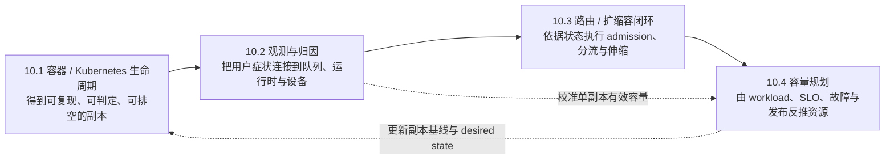

第 6 章定义了逻辑副本、服务复制与 TP/PP 共同故障域，第 9 章建立了 Workload、System、SLO 与 Measurement 合同，12.6 又把观察尺度从单实例移到多副本系统。本章把三者接成一个问题：怎样让模型服务在流量、故障和版本持续变化时，仍交付满足正确性与 SLO 的请求？
本文是 10.1—10.4 的**理论设计合同**，面向第一次接触生产 AI Infra 的读者。Kubernetes、指标系统和推理运行时只用于映射概念；本章不提供 YAML、命令、查询语句或某个扩缩容器的配置模板。
<!-- more -->

## 📑 本章导航
- [1. 本章定位：部署只是第一次状态迁移](#1-本章定位部署只是第一次状态迁移)
- [2. 把生产运维看成控制系统](#2-把生产运维看成控制系统)
- [3. 模型服务为什么不能照搬普通 Web 服务](#3-模型服务为什么不能照搬普通-web-服务)
- [4. 四节知识图](#4-四节知识图)
- [5. 贯穿四节的服务合同](#5-贯穿四节的服务合同)
- [6. 六条稳定性原则](#6-六条稳定性原则)
- [7. 四节边界与承诺](#7-四节边界与承诺)
- [8. 阅读时持续追问](#8-阅读时持续追问)
- [9. 学完应具备的能力](#9-学完应具备的能力)
- [总结](#总结)
- [自我检验](#自我检验)
- [SRE 与 Kubernetes 资料](#sre-与-kubernetes-资料)

---

## 1. 本章定位：部署只是第一次状态迁移
把镜像启动并收到一次正确响应，只能证明某个实例在某个时刻可运行。生产服务还要面对到达率突变、GPU 故障、依赖抖动、缓存冷热变化和新旧版本共存；因此“部署完成”不是终点，而是系统第一次进入期望状态。
本章把**生产运维**定义为持续缩小“系统应当是什么”与“系统现在是什么”之间差距的过程。目标不是让每张 GPU 永远繁忙，而是在正确性、安全和成本约束内，持续兑现 TTFT、TPOT、E2E 与可用性承诺。
单次操作关注“这次是否成功”，控制系统还要关注动作何时生效、观测是否可信、失败如何收敛，以及动作本身会不会制造振荡或级联故障。
> 生产结果不是“副本都在运行”，而是目标 workload 下仍有足够多请求正确且按时完成。

## 2. 把生产运维看成控制系统
- **Desired state \(D_t\)**：目标模型与版本、每副本 GPU 和并行拓扑、副本数、可接收的 workload、SLO、发布策略、故障余量与安全边界。
- **Observed state \(O_t\)**：实际可就绪副本、请求与队列、TTFT/TPOT/E2E、错误和拒绝、GPU/KV 状态、冷启动进度、版本分布与故障信号。
- **Actuator \(a_t\)**：创建、预热、摘流、排空、重启或回滚副本，调整 admission、路由权重和副本数量；每个动作都有延迟、成本与失败语义。
- **Feedback**：把请求结果、内部状态和动作结果送回控制器，用来判断偏差、归因原因并修正下一次决策；没有统一时间线的指标堆积不构成反馈。

可用一个抽象式表达这个闭环：
$$
e_t=D_t-O_t,\qquad a_t=\pi(e_t,O_t,C_t),\qquad O_{t+\Delta}=F(O_t,a_t,W_t)
$$
其中 \(C_t\) 是 GPU、成本、正确性与发布约束，\(W_t\) 是流量和故障等扰动；\(D_t\) 与 \(O_t\) 实际是多维状态，“相减”表示比较而非真的得到一个标量。观测窗口、决策时间和执行延迟共同构成 \(\Delta\)：若忽略它，控制器可能在新副本尚未就绪时反复扩容，或在短暂空闲时过早缩容。

## 3. 模型服务为什么不能照搬普通 Web 服务
- **GPU 接近原子资源**：调度通常以整张设备或固定切分单元分配；一个 TP/PP 副本需要整组 rank 同时可用，不能把缺一张卡的集合当作降配副本继续服务。
- **冷启动很重**：从获得 GPU 到可接流量，还可能经历镜像与权重读取、显存分配、编译或 Graph 捕获、通信组建立和预热；进程存在不等于模型 ready。
- **请求长且持续输出**：流式请求可能占用数十秒。摘除副本应先停止新流量再排空在途请求，已经对客户端可见的流不能随意迁移、拼接或透明重放。
- **KV/Cache 让副本有状态**：每个副本拥有不同的在途 KV、Prefix Cache、队列和缓存温度。缓存是可重建的派生状态，却会改变路由成本、冷启动曲线和短时容量。
- **并行组扩大共同故障域**：TP/PP 的多个进程共同推进一次 forward，任一必要 rank 失效通常击穿整个逻辑副本；scale-up 的 rank 数不能当作 scale-out 的副本数。
因此，普通 Web 服务里的“均匀轮询、CPU 高了加实例、进程活着即可接流量”至多是起点，不能直接成为模型服务的生产结论。

## 4. 四节知识图

实线是学习顺序：先定义副本生命周期，才知道观测对象；先能归因，控制动作才有依据；闭环的执行延迟和稳定边界，最终必须进入容量账。虚线说明生产系统没有“最后一节”：实测会持续校准容量，容量又会更新下一轮 desired state。

## 5. 贯穿四节的服务合同
以下 \(C_{10}\) 是教学合同，不是对任何框架或 GPU 的性能承诺。10.1—10.4 的例子、公式和判断默认保持它不变；若某节改变条件，必须明确把该条件标为实验变量。
- **模型与身份**：固定同一份 70B 稠密指令模型 \(M_0\) 的权重 revision、Tokenizer、Chat Template、精度和解码语义；新旧版本不得仅因名称相同就共享不兼容状态。
- **逻辑副本**：BF16、TP=4、PP=1，每副本占 4 张 80 GiB GPU；四个 rank 是一个调度、就绪、排空和恢复单元，也是一处共同故障域。
- **Workload**：流式请求长度联合分布固定为 60% \((512,128)\)、30% \((2048,256)\)、10% \((8192,512)\)，分别表示输入和目标输出 token；一半请求带可复用稳定前缀，缓存命中与否分开记录。
- **到达过程**：入口观察到的稳态 offered load 为 \(6\) req/s，每 10 分钟出现一次持续 30 秒的 \(10\) req/s 突发；拒绝、超时和客户端取消仍属于到达总体。
- **请求级合格条件**：协议与结果正确，且 \(TTFT\le1.5\,s\)、\(TPOT\le60\,ms\)、\(E2E\le45\,s\)；Goodput 只统计同时满足这些条件的请求。
- **聚合 SLO**：以可信入口到达时间归属逻辑请求 cohort，拒绝、超时和取消均作为 bad event；30 天滚动窗口内联合达标率 \(A_{10}\ge S_{10}=99\%\)。容量实验在预声明运行窗口内使用同一 \(S_{10}\)，并要求队列不持续增长。
- **冷启动输入**：从扩容决策发出到副本真正可路由的 P99 时间按 180 秒规划，包含 GPU 等待、制品读取、权重加载、Graph/通信初始化和预热；后续必须用实测分解替换假设。
- **N+1 故障要求**：任意一个逻辑副本不可用时，系统仍要承接峰值 offered load 并满足同一 SLO，而不是只保证端口可连接。
- **发布要求**：一次最多摘流并排空一个副本；发布期间还要容忍另一个副本故障。新版本通过正确性、就绪和 canary 门禁后才扩大流量，旧版本保留到回滚窗口结束。

设 \(A_{10}(\lambda)\) 是 offered load 为 \(\lambda\) 时的联合达标率，单副本 SLO 约束下的最大可持续 offered capacity 为：
$$
\lambda_{\mathrm{cap}}
=\max\{\lambda:A_{10}(\lambda)\ge S_{10}\land \text{queue stable}\}
$$
对应的实际 Goodput 是 \(G(\lambda)=\lambda A_{10}(\lambda)\)，不能把 \(\lambda_{\mathrm{cap}}\) 本身标成 Goodput。若 \(h\in(0,1)\) 是为预测误差与短时波动保留的工作余量，\(\lambda_{\mathrm{peak}}=10\) req/s，则初始下界为：
$$
N_{\mathrm{load}}=\left\lceil\frac{\lambda_{\mathrm{peak}}}{h\,\lambda_{\mathrm{cap}}}\right\rceil,\qquad
R_{\min}=N_{\mathrm{load}}+1_{\mathrm{failure}}+1_{\mathrm{release}}
$$
这里的两个“+1”来自本合同规定的故障与发布可重叠；如果组织明确禁止降级期间发布，可以共享一部分余量，但阻断规则也必须成为 desired state。\(\lambda_{\mathrm{cap}}\) 必须来自第 9 章式 offered-load 扫描，不能用峰值 tokens/s、GPU 利用率或一次低负载结果代替。

## 6. 六条稳定性原则
1. **三类探针各司其职**：startup 判断冷启动是否完成，并在此前保护进程免受过早存活判定；readiness 决定是否接收新请求，摘流时先变为不可就绪再排空；liveness 只处理进程无法自愈的失活，不把过载或暂时依赖失败变成重启风暴。
2. **先背压，再让队列失控**：队列只能吸收有限 burst，不能创造 GPU 时间。Admission、有限等待、优先级和明确拒绝要把过载反馈给上游；已无可能满足 SLO 的工作不应继续消耗稀缺设备。
3. **把扩缩容延迟写进控制律**：检测窗口、决策、GPU 供给、冷启动和预热都在反馈环内。扩容要看队列增长等先行信号并保留热余量，缩容要有滞回且先排空，避免围绕阈值来回振荡。
4. **路由必须理解状态但不能被状态绑架**：在队列成本、缓存局部性、版本兼容和剩余 SLO 预算之间选择；Affinity 是可被拥塞推翻的偏好，不能让热前缀永久压垮一个副本。
5. **用 Error Budget 管理变化速度**：Error Budget 是 SLO 允许的失败份额，正确性、可用性和延迟失败都消耗预算。预算快速燃烧时冻结发布、降低变更速度或降载；预算健康才允许实验，不能把“仍有流量成功”误判为服务健康。
6. **Headroom 是需求而非浪费**：容量余量要同时覆盖 workload 长尾、180 秒冷启动、一个故障副本和一个发布副本。平均 GPU 利用率较低可能正是兑现 N+1 与发布合同的成本。
这些原则共同限制 actuator：动作既要缩小偏差，也不能破坏仍在履约的请求。稳定性优先于控制器看起来“反应迅速”。

## 7. 四节边界与承诺
- [**10.1 容器化与 Kubernetes 部署**](/AIInfraGuide/inference/模块四-推理优化/第10章-生产部署与运维/101-容器化与kubernetes部署)：承诺解释制品身份、GPU 调度、启动到就绪、摘流排空、故障恢复与回滚的生命周期；边界是不写 YAML、命令和集群安装手册。
- [**10.2 可观测性**](/AIInfraGuide/inference/模块四-推理优化/第10章-生产部署与运维/102-可观测性)：承诺用请求、入口队列、Worker、KV/Cache、GPU 与控制动作的统一时间线完成症状归因，并沿用第 9 章指标口径；边界是不写 PromQL、仪表盘点击步骤或指标名百科。
- [**10.3 自动扩缩容与负载均衡**](/AIInfraGuide/inference/模块四-推理优化/第10章-生产部署与运维/103-自动扩缩容与负载均衡)：承诺解释 admission、状态化路由、排队信号、扩缩容延迟、滞回和排空如何组成闭环；边界是不提供 HPA 配置、网关参数或可直接复制的策略。
- [**10.4 容量规划**](/AIInfraGuide/inference/模块四-推理优化/第10章-生产部署与运维/104-容量规划)：承诺从模型显存、单副本 Goodput、到达分布、SLO、冷启动、N+1 和发布余量反推 GPU/副本边界；边界是不把教学数字当永久 QPS 或采购承诺。
四节共同维护 \(C_{10}\)。10.1 定义 actuator 能操作的生命周期，10.2 提供 feedback，10.3 实现在线控制，10.4 给出 desired state 的容量基线。

## 8. 阅读时持续追问
1. 当前说的是进程、rank、逻辑副本，还是整个服务？它们的故障域相同吗？
2. 观测值对应用户结果、队列现象、运行时状态还是设备原因？时间边界一致吗？
3. 某个动作从决定到生效要多久？期间到达的请求由谁接住？
4. 新请求能否停止、在途请求能否排空、已开始流式输出的请求能否安全重试？
5. 路由是在均分连接，还是同时考虑预计排队、缓存局部性、版本和 SLO？
6. 扩容是在追赶瞬时噪声，还是在修正可持续的容量缺口？缩容会丢失什么状态？
7. 故障、发布和 workload 突发同时发生时，容量与 Error Budget 是否仍满足合同？

## 9. 学完应具备的能力
- 能用 desired state、observed state、actuator 和 feedback 画出模型服务控制环；
- 能把 GPU 原子分配、重冷启动、长流式请求、KV 状态和 TP/PP 故障域放进生命周期设计；
- 能区分 startup、readiness、liveness 的责任，并解释错误探针如何引发级联故障；
- 能从 TTFT/TPOT/E2E 症状逐层检查入口队列、Worker、KV/Cache、GPU 和控制动作；
- 能设计同时考虑排队、状态局部性、扩容延迟、滞回与排空的路由/伸缩策略；
- 能用固定 workload、单副本 Goodput、headroom、N+1 与发布要求核算副本下界。

## 总结
生产运维不是把一次部署永久维持在原样，而是在 workload、故障和版本变化中不断调节系统。Kubernetes 管理生命周期，观测系统提供反馈，路由与扩缩容执行动作，容量规划定义基线；四者必须共享同一服务合同。
对模型服务而言，GPU、冷启动、流式请求、KV/Cache 和并行故障域会放大控制延迟与状态成本。可靠系统允许优化状态丢失后回到正确基线，也会用背压、Error Budget 和容量余量保护仍可兑现的请求。

## 自我检验
- [ ] 能否说明“所有副本 Running”为什么不等于生产目标已经达成？
- [ ] 能否为 \(C_{10}\) 分别指出 desired state、observed state、actuator 与 feedback？
- [ ] 为什么 startup 期间不应让 liveness 过早重启进程，readiness 又为什么必须独立？
- [ ] 为什么 180 秒冷启动会让只看当前 GPU 利用率的扩容策略失效？
- [ ] 一个 TP=4 的副本失去一个 rank 后，为什么不能按三个健康副本计数？
- [ ] 为什么缓存命中率高的副本不一定是本次请求的最佳路由目标？
- [ ] 能否解释 \(R_{\min}\) 中 headroom、故障余量与发布余量分别保护什么？
- [ ] 若 Error Budget 快速燃烧，哪些动作应暂停，哪些过载保护仍应继续？

## SRE 与 Kubernetes 资料
- Google SRE Book：[Monitoring Distributed Systems](https://sre.google/sre-book/monitoring-distributed-systems/)
- Google SRE Book：[Handling Overload](https://sre.google/sre-book/handling-overload/)
- Google SRE Workbook：[Alerting on SLOs](https://sre.google/workbook/alerting-on-slos/)
- Kubernetes：[Pod Lifecycle](https://kubernetes.io/docs/concepts/workloads/pods/pod-lifecycle/)
- Kubernetes：[Liveness, Readiness and Startup Probes](https://kubernetes.io/docs/concepts/configuration/liveness-readiness-startup-probes/)
- Kubernetes：[Deployments](https://kubernetes.io/docs/concepts/workloads/controllers/deployment/)
- Kubernetes：[Workload Autoscaling](https://kubernetes.io/docs/concepts/workloads/autoscaling/)
- Kubernetes：[Schedule GPUs](https://kubernetes.io/docs/tasks/manage-gpus/scheduling-gpus/)

> 文中的模型、流量、SLO 与冷启动数字只用于固定推导边界；生产结论必须回到目标制品、硬件拓扑、真实到达分布、故障演练和发布观测中验证。
