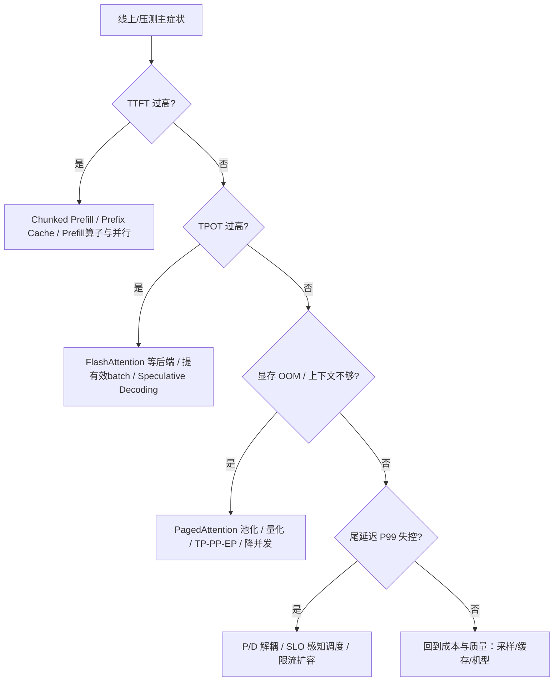

技术章节读完后，真正难的是临场决策：线上 TTFT 爆了，该开 Chunked Prefill 还是加 Prefix Cache？显存不够，该量化还是上并行？这一节把症状映射到技术选项，形成一棵可执行的决策树——先诊断，再开方。

<!-- more -->

## 📑 目录

- [1. 决策前的四问](#1-决策前的四问)
- [2. 症状 → 技术总图](#2-症状--技术总图)
- [3. TTFT 过高](#3-ttft-过高)
- [4. TPOT 过高](#4-tpot-过高)
- [5. 显存不够 / 装不下](#5-显存不够--装不下)
- [6. 尾延迟失控](#6-尾延迟失控)
- [7. 使用决策树的纪律](#7-使用决策树的纪律)
- [总结](#-总结)
- [自我检验清单](#-自我检验清单)
- [参考资料](#-参考资料)

---

## 1. 决策前的四问

1. **主症状是什么？** TTFT / TPOT / OOM / P99 抖动 / 成本
2. **负载形状？** 长短上下文、缓存可复用性、是否多模态
3. **约束硬吗？** 质量阈值、硬件锁定、上线时间
4. **如何验收？** 第 9 章指标与门禁

没有这四问，决策树会变成"把所有开关打开"。

也可以把四问写成开工检查：

```text
[ ] 主症状（唯一）: ________
[ ] 负载形状摘要: ________
[ ] 硬约束（质量/硬件/工期）: ________
[ ] 验收指标与门槛: ________
```

📌 **关键点**：一次只攻一个主症状，其它当作约束。多目标同时最优通常不存在。

---

## 2. 症状 → 技术总图



---

## 3. TTFT 过高

先拆 TTFT 构成：排队 vs Prefill 计算 vs 多模态 Encoder。

| 子因 | 优先技术 |
|---|---|
| 排队久 | 扩容、限流、提高有效产能 |
| 长 Prompt Prefill 重 | Chunked Prefill、合适并行、GEMM/Attention 后端 |
| 前缀大量重复 | Automatic Prefix Cache / 前缀感知路由 |
| 同图多轮 | Encoder Cache + 图像 Hash 前缀缓存 |
| 冷启动/编译 | 预热、镜像与权重缓存 |

🔑 **核心概念**：TTFT 优化的主战场在 **Prefill 路径与排队**，不是盲目加 Speculative Decoding。

---

## 4. TPOT 过高

Decode 多是 Memory Bound，方向是：

| 手段 | 机制 |
|---|---|
| 高效 Attention 后端 | 降低访存与 kernel 开销 |
| 更大有效 batch | 摊薄带宽，提高利用率（可能伤 TTFT） |
| KV 量化 / 更短上下文 | 降低每步读写量 |
| Speculative Decoding | 用验收过的草稿步减少有效步数 |
| 避免长 Prefill 干扰 | Chunked Prefill / 统一 Token Budget |

若 TPOT P50 还行、P95 差，优先查抢占、调度尖刺与网关，而不是只换 Attention kernel。

---

## 5. 显存不够 / 装不下

按"先管理、再压缩、再切分"的顺序：

1. **PagedAttention + 合理 `gpu_memory_utilization`**：先把池用对
2. **量化权重/KV**：换显存与质量
3. **并行（TP/PP/EP）**：把模型切开
4. **降 `max_model_len` / 并发 / LoRA 槽位**：产品层退让
5. **更大显存机型**：预算允许时的最后杠杆之一

⚠️ **注意**：OOM 时最忌同时打开所有特性。先恢复可运行，再谈加速。

---

## 6. 尾延迟失控

P99 常见元凶：

- 偶发超长 Prompt 堵住 Decode
- KV 打满触发抢占
- 批内极端异构
- 多副本缓存命中不均
- 节点抖动 / 垃圾回收式停顿

对应药方：

- Chunked Prefill + 统一调度
- P/D 解耦隔离重 Prefill
- SLO 感知调度与准入控制
- 前缀感知路由
- 扩容与限流（运维面）

💡 **提示**：尾延迟往往是**系统问题**，不是单点 kernel 参数能根治。

若 P99 与 P50 比值持续扩大，优先画一张"慢请求画像"：输入长度、是否缓存未命中、是否撞上发布/扩容、是否集中在某副本。画像比继续拧全局参数更接近根因。

---

## 7. 使用决策树的纪律

1. 用指标证明症状（第 9.1）
2. 选 1～2 个手段做对照实验（第 9.2）
3. 评估与其它目标的 trade-off（第 11.2）
4. 过门禁再合入（第 9.5）
5. 上线后看 Goodput 与告警（第 10.2）

### 7.1 快速对照卡（可贴显示器旁）

| 我看到… | 我先试… | 我暂缓… |
|---|---|---|
| TTFT P95 高、队列也高 | 扩容/限流 | 微调 Attention 参数 |
| TTFT 高、队列低、Prompt 长 | Chunked Prefill / 缓存 | 先上 P/D |
| TPOT 高、KV 高抢占多 | 降并发或扩池 | 只开更大 batch |
| OOM | 量化/并行/降长度 | 投机解码 |
| P99 偶发尖刺 | 查超长请求与调度 | 全面换模型 |

---

## 📝 总结

- 选型从症状出发：TTFT、TPOT、显存、尾延迟。
- TTFT 抓 Prefill/排队/缓存；TPOT 抓 Decode 带宽与投机；显存先管理再压缩再切分；尾延迟看调度与隔离。
- 决策前明确负载、约束与验收。
- 一次主攻一个症状，用压测闭环验证。
- 用快速对照卡避免"病急乱投医"。

## 🎯 自我检验清单

- 能在白板上画出症状→技术总图
- 能把"TTFT 高"拆成排队/Prefill/Encoder 三类
- 能为 TPOT 高列出至少三条手段及原理
- 能按顺序给出 OOM 处置链
- 能说明尾延迟为何常需 P/D 或准入控制
- 能复述"诊断→实验→门禁→观测"纪律
- 能根据对照卡在五分钟内给出第一干预建议

## 📚 参考资料

- 本模块第 2～7 章各技术专章
- [vLLM 文档总览](https://docs.vllm.ai/)
- 第 9 章指标体系与压测方法
- 第 10 章容量与扩缩容（当症状实为产能不足时）
