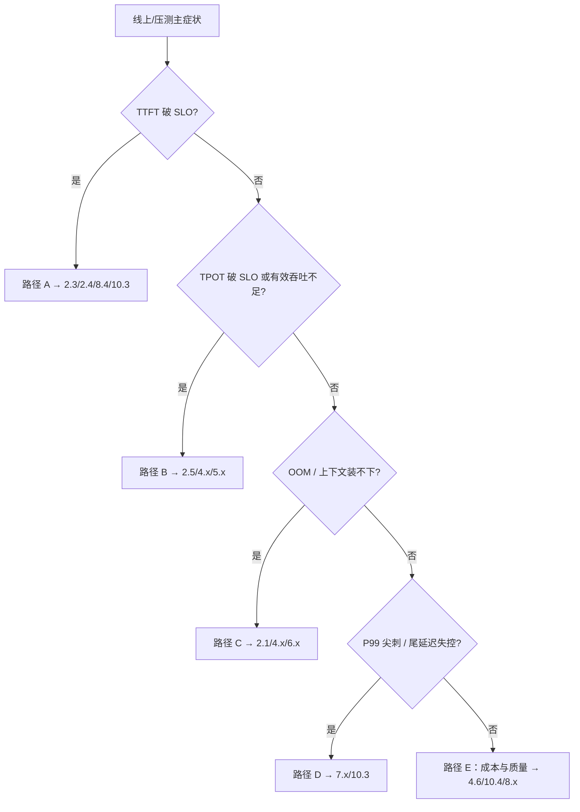

第 2–10 章把武器库与验收尺子摆齐了：引擎机制、量化、投机、并行、P/D、服务特性、压测门禁与容量运维。真正难的是临场——线上 TTFT P95 破 $800\,\mathrm{ms}$，该开 Chunked Prefill 还是加 Prefix Cache？显存不够，该量化还是上 TP？这一节把**主诉（瓶颈 / SLA）→ 先验证什么 → 对应章节 → 第一刀**收成可执行决策树；组合冲突与叠加顺序见 [11.2](./11.2-优化组合注意事项.md)，端到端剧本见 [11.3](./11.3-端到端部署实战.md)。

<!-- more -->

## 📑 目录

- [1. 问题：先定主诉与验收尺子](#1-问题先定主诉与验收尺子)
- [2. 症状 → 章节总图](#2-症状--章节总图)
- [3. 路径 A：TTFT 过高](#3-路径-attft-过高)
- [4. 路径 B：TPOT / 吞吐不够](#4-路径-btpot--吞吐不够)
- [5. 路径 C：显存不够 / 装不下](#5-路径-c显存不够--装不下)
- [6. 路径 D：尾延迟失控](#6-路径-d尾延迟失控)
- [7. 路径 E：成本与质量红线](#7-路径-e成本与质量红线)
- [8. 使用纪律与快速对照卡](#8-使用纪律与快速对照卡)
- [9. 代价与权衡](#9-代价与权衡)
- [总结](#-总结)
- [自我检验清单](#-自我检验清单)
- [参考资料](#-参考资料)

---

## 1. 问题：先定主诉与验收尺子

决策树不是「把所有开关打开」，而是规定：**一次只攻一个主症状**，其余当作硬约束。开工前写清四问（可贴看板）：

```text
[ ] 主症状（唯一）: TTFT / TPOT / OOM / P99 / 成本
[ ] 负载形状摘要: 输入/输出 Token 分布、前缀复用、是否 VLM
[ ] 硬约束: 质量阈值、硬件锁定、上线窗口
[ ] 验收尺子: 同负载下的百分位 + Goodput（见 9.1）
```

指标口径以 [9.1](../第9章-性能分析与Benchmark/9.1-推理指标体系.md) 为准：TTFT/TPOT 用 P95（或业务约定的 P99），产能用 **Goodput**（满足 SLO 的有效 QPS），不用裸 GPU Util 或营销峰值 tokens/s。取舍句：没有写成数字的 SLO 与负载形状，后面所有「优化」都无法验收——只能事后讲故事。

📌 **关键点**：主诉必须**可观测、可复现**。用 [9.2](../第9章-性能分析与Benchmark/9.2-压测工具.md) 同负载对照，而不是凭单次 `curl` 手感。

---

## 2. 症状 → 章节总图



总图只做分流；每条路径下面写**先验证什么**——跳过验证直接改配置，是最常见的归因失败。

---

## 3. 路径 A：TTFT 过高

### 3.1 机制拆分

TTFT ≈ 排队等待 + Prefill 计算（+ 多模态 Encoder）。先拆子因，再选技术：

| 子因 | 先验证什么 | 优先技术 | 章节 |
|---|---|---|---|
| 排队久 | `waiting` / 队列深度与到达率是否同向上升 | 扩容、限流、提高有效产能 $Q^{*}$ | [10.3](../第10章-生产部署与运维/10.3-自动扩缩容与负载均衡.md)、[10.4](../第10章-生产部署与运维/10.4-容量规划.md) |
| 长 Prompt Prefill 重 | 队列低、但 Prefill 段耗时长；输入长度 P95 高 | Chunked Prefill、合适并行、GEMM/Attention 后端 | [2.4](../第2章-推理引擎核心技术/2.4-Chunked%20Prefill%20与统一调度.md)、[2.5](../第2章-推理引擎核心技术/2.5-Attention%20后端与图优化.md)、[6.2](../第6章-分布式推理/6.2-张量并行推理.md) |
| 前缀大量重复 | 系统提示/多轮共享前缀比例；命中率是否接近 0 | Automatic Prefix Cache + 前缀感知路由 | [2.3](../第2章-推理引擎核心技术/2.3-Prefix%20Cache%20与%20RadixAttention.md)、[10.3](../第10章-生产部署与运维/10.3-自动扩缩容与负载均衡.md) |
| 同图多轮 VLM | Encoder 是否重复跑；图像 Hash 是否稳定 | Encoder Cache + 图像 Hash 前缀 | [8.4](../第8章-生产级服务特性/8.4-多模态推理VLM.md) |
| 冷启动/编译 | 首请求 vs 稳态；startup 探针是否过短 | 预热、镜像与权重缓存 | [10.1](../第10章-生产部署与运维/10.1-容器化与Kubernetes部署.md) |

### 3.2 算例（教学示意）

假设业务 SLO：TTFT P95 $\le 800\,\mathrm{ms}$。压测显示：到达 $12\,\mathrm{QPS}$ 时 waiting 均值 $600\,\mathrm{ms}$，Prefill 本身约 $180\,\mathrm{ms}$。则主因是**排队**，不是 Attention kernel——先按 [10.4](../第10章-生产部署与运维/10.4-容量规划.md) 抬 $Q^{*}$ 或加副本/限流，而不是先开 Speculative Decoding（投机主要改 Decode 步数，见路径 B）。

若 waiting $<50\,\mathrm{ms}$、输入 P95 $=8\,\mathrm{k}$ Token、前缀复用率 $>60\%$ 但缓存命中 $<10\%$，则先验证路由是否打散前缀，再开 Prefix Cache——引擎开了缓存、网关轮询，命中率永远上不去。

🔑 **核心概念**：TTFT 优化的主战场在 **Prefill 路径与排队**；盲目加投机解码是选错药。

---

## 4. 路径 B：TPOT / 吞吐不够

### 4.1 机制

Decode 多是 Memory Bound：每步读 KV + 权重带宽。方向是「少读 / 摊薄 / 少步」：

| 手段 | 先验证什么 | 章节 |
|---|---|---|
| 高效 Attention / 图优化 | Profiler 是否 Memory Bound；换后端后 TPOT 是否动 | [2.5](../第2章-推理引擎核心技术/2.5-Attention%20后端与图优化.md)、[9.3](../第9章-性能分析与Benchmark/9.3-性能分析工具.md) |
| 更大有效 batch | KV 利用率与抢占；TTFT 是否被拖垮 | [2.2](../第2章-推理引擎核心技术/2.2-Continuous%20Batching.md)、[3.5](../第3章-深入vLLM/3.5-关键配置调优.md) |
| KV / 权重量化 | 质量探针过线；带宽是否真降 | [4.4](../第4章-量化/4.4-KV-Cache量化.md)、[4.6](../第4章-量化/4.6-量化选型与vLLM实战.md) |
| Speculative Decoding | 接受率；同并发下端到端，不只单请求加速比 | [5.4](../第5章-Speculative-Decoding/5.4-收益边界与限制.md)、[5.5](../第5章-Speculative-Decoding/5.5-vLLM投机解码实战.md) |
| 隔离长 Prefill | TPOT P95 尖刺是否与长 Prompt 同窗 | [2.4](../第2章-推理引擎核心技术/2.4-Chunked%20Prefill%20与统一调度.md)、[7.1](../第7章-PD解耦架构/7.1-混合Batching的问题.md) |

### 4.2 取舍句

若 TPOT P50 达标、P95 差：优先查抢占、调度尖刺与网关，而不是只换 Attention kernel。若接受率 $<0.5$，投机常变成纯开销——先修草稿/量化一致性（[11.2](./11.2-优化组合注意事项.md)），再谈「加速比」。

算例前提：BF16、单卡、输出 $200$ Token、并发 $32$。基线 TPOT P95 $=48\,\mathrm{ms}$；开投机后接受率 $0.72$，同负载 TPOT P95 $=33\,\mathrm{ms}$，Goodput 上升——可进入门禁。若接受率掉到 $0.35$，TPOT 反而变差，应回退。

---

## 5. 路径 C：显存不够 / 装不下

按「**先管理、再压缩、再切分、再产品退让**」：

| 顺序 | 动作 | 先验证什么 | 章节 |
|---|---|---|---|
| 1 | PagedAttention + 合理 `gpu_memory_utilization` | 是否真碎片/池用尽，而非泄漏误判 | [2.1](../第2章-推理引擎核心技术/2.1-PagedAttention.md)、[3.5](../第3章-深入vLLM/3.5-关键配置调优.md) |
| 2 | 权重量化 / KV 量化 | 质量探针 + 同负载吞吐 | [4.3](../第4章-量化/4.3-Weight-only-INT4.md)–[4.6](../第4章-量化/4.6-量化选型与vLLM实战.md) |
| 3 | TP / PP / EP | 单卡装不下是否成立；通信是否拖垮 TPOT | [6.1](../第6章-分布式推理/6.1-推理并行策略总览.md)–[6.4](../第6章-分布式推理/6.4-数据并行与专家并行.md) |
| 4 | 降 `max_model_len` / 并发 / LoRA 槽位 | 业务 P99 长度与槽位是否可砍 | [8.3](../第8章-生产级服务特性/8.3-Multi-LoRA服务.md) |
| 5 | 更大显存机型 | 预算与交付周期 | [10.4](../第10章-生产部署与运维/10.4-容量规划.md) |

⚠️ **注意**：OOM 时最忌同时打开量化 + 投机 + 更大 batch。先恢复可运行基线（[11.3](./11.3-端到端部署实战.md) 的 B0），再谈加速。

粗算提示（数量级）：权重显存大致随比特线性降；KV 随 batch × 上下文涨。$70\mathrm{B}$ 级装不下时，INT4 权重往往比「先上 TP=8」更便宜——但要以你机型与质量红线为准，决策树见 [4.6](../第4章-量化/4.6-量化选型与vLLM实战.md)。

---

## 6. 路径 D：尾延迟失控

### 6.1 常见元凶与验证

| 元凶 | 先验证什么 | 药方 | 章节 |
|---|---|---|---|
| 超长 Prompt 堵住 Decode | 慢请求画像：长度、缓存未命中、是否同副本 | Chunked Prefill；必要时 P/D | [2.4](../第2章-推理引擎核心技术/2.4-Chunked%20Prefill%20与统一调度.md)、[7.2](../第7章-PD解耦架构/7.2-解耦架构设计.md) |
| KV 打满抢占 | KV 利用率持续 $>0.85$，preemption 计数升 | 降并发、扩池、KV 量化 | [2.1](../第2章-推理引擎核心技术/2.1-PagedAttention.md)、[4.4](../第4章-量化/4.4-KV-Cache量化.md) |
| 批内极端异构 | 长短请求同批；P99/P50 比值扩大 | 统一 Token Budget / SLO 调度 | [7.4](../第7章-PD解耦架构/7.4-Goodput与SLO感知调度.md) |
| 缓存命中不均 | 副本间命中率方差大 | 前缀感知路由 / 粘性 | [10.3](../第10章-生产部署与运维/10.3-自动扩缩容与负载均衡.md) |
| 发布/扩容抖动 | 尖刺是否对齐滚动窗口 | 提高 Ready 容量、预热 | [10.1](../第10章-生产部署与运维/10.1-容器化与Kubernetes部署.md) |

💡 **提示**：尾延迟往往是**系统问题**。P99/P50 持续扩大时，先画「慢请求画像」，再决定是否上 P/D——P/D 换隔离，付链路与运维复杂度（[7.5](../第7章-PD解耦架构/7.5-解耦挑战与配比.md)）。

### 6.2 何时才上 P/D

先验证：重 Prefill 流量占比高、且 Chunked Prefill + 准入控制后 P99 仍破线。若只是产能不足（全百分位一起漂），先回到路径 A 的扩容/限流，而不是上解耦。

---

## 7. 路径 E：成本与质量红线

当 TTFT/TPOT/显存/P99 都「勉强过线」，主诉变成 $\$/\text{有效产出}$ 或质量门禁：

- **降本**：先抬缓存命中与批效率，再合适量化，最后才多买卡（[10.4](../第10章-生产部署与运维/10.4-容量规划.md) 杠杆顺序）。
- **质量**：结构化输出 / Tool Calling / Agent 路径提高探针阈值；极限量化先让路（[8.1](../第8章-生产级服务特性/8.1-结构化输出.md)、[8.2](../第8章-生产级服务特性/8.2-Tool-Calling与Reasoning-Parser.md)、[4.6](../第4章-量化/4.6-量化选型与vLLM实战.md)）。
- **机型换代**：Hopper 上 FP8 均衡 vs 通用 INT4 兼容——按硬件世代走 [4.6](../第4章-量化/4.6-量化选型与vLLM实战.md) 决策树，不要用营销白皮书替代本机探针。

---

## 8. 使用纪律与快速对照卡

纪律（与 [9.5](../第9章-性能分析与Benchmark/9.5-性能回归门禁.md)、[10.2](../第10章-生产部署与运维/10.2-可观测性.md) 对齐）：

1. 用指标证明症状（[9.1](../第9章-性能分析与Benchmark/9.1-推理指标体系.md)）  
2. 选 1～2 个手段做对照（[9.2](../第9章-性能分析与Benchmark/9.2-压测工具.md)）  
3. 评估与其它目标的 trade-off（[11.2](./11.2-优化组合注意事项.md)）  
4. 过门禁再合入（[9.5](../第9章-性能分析与Benchmark/9.5-性能回归门禁.md)）  
5. 上线后看 Goodput 与告警（[10.2](../第10章-生产部署与运维/10.2-可观测性.md)）  

### 快速对照卡

| 我看到… | 先验证… | 我先试… | 我暂缓… |
|---|---|---|---|
| TTFT P95 高、队列也高 | waiting 与 QPS | 扩容/限流 | 微调 Attention |
| TTFT 高、队列低、Prompt 长 | Prefill 耗时与长度分布 | Chunked Prefill / 缓存 | 先上 P/D |
| TPOT 高、KV 高抢占多 | preemption / KV% | 降并发或扩池 | 只开更大 batch |
| OOM | 利用率与 `max_model_len` | 量化/并行/降长度 | 投机解码 |
| P99 偶发尖刺 | 慢请求画像与发布窗口 | 调度/准入/路由 | 全面换模型 |
| 成本高、SLO 紧 | $Q^{*}$ 与命中率 | 提效率再谈加卡 | 无脑加冗余 |

---

## 9. 代价与权衡

| 选择 | 收益 | 代价 / 不适用 |
|---|---|---|
| 严格单主诉推进 | 可归因、可回滚 | 多目标同时最优通常不存在 |
| 先验证再改配置 | 少踩「换药不对症」 | 多半到一天压测时间 |
| 路径 A 优先扩容 | 快速止血排队型 TTFT | 不解决 Prefill 结构问题 |
| 路径 B 上投机 | 降有效 Decode 步数 | 接受率与草稿成本；组合见 11.2 |
| 路径 C 先量化 | 省权重/KV 显存 | 质量与兼容性风险 |
| 路径 D 上 P/D | 隔离重 Prefill | 传输、配比、运维复杂度 |

适用：已有同负载基线与质量小集。  
若连 FP16/BF16 基线看板都没有，先补 [9.1](../第9章-性能分析与Benchmark/9.1-推理指标体系.md)–[9.2](../第9章-性能分析与Benchmark/9.2-压测工具.md)，再谈选型——否则决策树只是装饰。

---

## 📝 总结

- 选型从**唯一主诉**出发：TTFT、TPOT、显存、尾延迟、成本/质量；每条路径先写「验证什么」。
- TTFT 抓 Prefill/排队/缓存；TPOT 抓带宽、batch、量化与投机；显存先管理再压缩再切分；尾延迟看调度、抢占与隔离。
- 决策树规定**第一刀与验证顺序**，不产出「全面优于」的总冠军；组合与回退见 [11.2](./11.2-优化组合注意事项.md)。
- 用同负载百分位 + Goodput 验收，用对照卡避免病急乱投医。

## 🎯 自我检验清单

- 能在白板上画出症状→章节总图，并指出每条边的「先验证什么」
- 能把「TTFT 高」拆成排队 / Prefill / Encoder，并各给一章引用
- 能为 TPOT 高列出至少三条手段，并说明何时不该上投机
- 能按顺序给出 OOM 处置链（管理→压缩→切分→产品退让）
- 能说明尾延迟为何常需慢请求画像，以及何时才评估 P/D
- 能复述「诊断→实验→门禁→观测」纪律，并用对照卡给出第一干预

## 📚 参考资料

- [本模块 2.1 PagedAttention](../第2章-推理引擎核心技术/2.1-PagedAttention.md)
- [本模块 2.3 Prefix Cache 与 RadixAttention](../第2章-推理引擎核心技术/2.3-Prefix%20Cache%20与%20RadixAttention.md)
- [本模块 2.4 Chunked Prefill 与统一调度](../第2章-推理引擎核心技术/2.4-Chunked%20Prefill%20与统一调度.md)
- [本模块 4.6 量化选型与 vLLM 实战](../第4章-量化/4.6-量化选型与vLLM实战.md)
- [本模块 5.4 收益边界与限制](../第5章-Speculative-Decoding/5.4-收益边界与限制.md)
- [本模块 7.4 Goodput 与 SLO 感知调度](../第7章-PD解耦架构/7.4-Goodput与SLO感知调度.md)
- [本模块 9.1 推理指标体系](../第9章-性能分析与Benchmark/9.1-推理指标体系.md)
- [本模块 10.3 自动扩缩容与负载均衡](../第10章-生产部署与运维/10.3-自动扩缩容与负载均衡.md)
- [本模块 10.4 容量规划](../第10章-生产部署与运维/10.4-容量规划.md)
- [vLLM 文档总览](https://docs.vllm.ai/)
