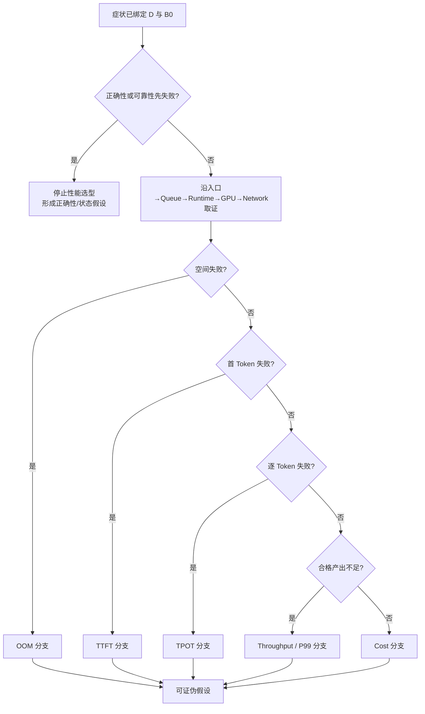

## 📑 目录
- [1. 问题：症状为什么不是结论](#1-问题症状为什么不是结论)
- [2. 冻结统一决策合同](#2-冻结统一决策合同)
- [3. 方法：症状到可证伪叶子](#3-方法症状到可证伪叶子)
- [4. 五层证据与总瓶颈树](#4-五层证据与总瓶颈树)
- [5. OOM 分支：先定位谁占了空间](#5-oom-分支先定位谁占了空间)
- [6. TTFT 分支：先分入口、排队与-prefill](#6-ttft-分支先分入口排队与-prefill)
- [7. TPOT 分支：先分调度、计算与通信](#7-tpot-分支先分调度计算与通信)
- [8. Throughput 分支：先确认有效供给](#8-throughput-分支先确认有效供给)
- [9. P99 分支：寻找条件化长尾](#9-p99-分支寻找条件化长尾)
- [10. Cost 分支：追踪合格产出的总账](#10-cost-分支追踪合格产出的总账)
- [11. 从假设映射到候选机制](#11-从假设映射到候选机制)
- [12. 统一案例算例](#12-统一案例算例)
- [13. 代价、误区与停止条件](#13-代价误区与停止条件)
- [14. 适用边界](#14-适用边界)
- [总结](#总结)
- [自我检验](#自我检验)
- [参考资料](#参考资料)

---

## 1. 问题：症状为什么不是结论
推理服务常以一句“慢了”“爆显存了”或“太贵了”进入讨论。
这些是症状，不是瓶颈，更不是优化处方。
例如 TTFT 超标至少可能来自入口解析、排队、Prefill、首 Token 传输或客户端计时边界。
如果看到 TTFT 高就启用 Prefix Cache，隐含假设是重复 Prefill 主导了首 Token 时间。
若实际主因是入口重试放大队列，缓存可能提高局部命中，却不能解释或消除症状。
本节只完成一项任务：
> 把业务症状转写为有支持证据、有反证条件、有替代解释的瓶颈假设。
决策树的叶子因此写成“若改变一个因素，某组证据应怎样变化”。
叶子不写成“开启 INT4”“增加 TP”或“采用 P/D 解耦”。
那些技术只是后续实验可选择的干预手段。
这种区分对初学者尤其重要：
- 症状回答“用户或账本哪里不合格”；
- 证据回答“时间、空间或失败发生在哪里”；
- 假设回答“哪个机制足以解释证据”；
- 实验回答“怎样让该解释暴露为真或假”；
- 处置只有在完整验收后才成立。

## 2. 冻结统一决策合同
所有分支都在同一五维合同下讨论：
$$
\mathcal D=(W,Q,S,K,R)
$$
- $W$（Workload）：长度联合分布、到达过程、共享前缀、缓存温度与请求语义；
- $Q$（Quality）：模型、Tokenizer、Chat Template、采样语义、任务质量与 JSON 正确性；
- $S$（SLO）：TTFT、TPOT、E2E 的逐请求门槛，以及按 offered logical request、硬 cohort 和窗口定义的聚合联合达标率；
- $K$（Cost）：GPU、CPU、内存、网络、存储、能耗、可观测性与运维的合格产出成本和预算；
- $R$（Reliability）：过载行为、错误状态隔离、故障影响和回退能力。
统一案例固定为一份 **8B 指令模型**。
硬件上限固定为单节点 **4 张 80 GiB GPU**，节点内具有高速互联。
输入与最大输出 Token 的联合长度分布固定为：
- 60%：$(1024,128)$；
- 30%：$(4096,256)$；
- 10%：$(8192,512)$。
40% 请求精确共享前 768 个 Token。
冷缓存与热缓存必须分开报告，不能混成一个平均命中率。
到达过程固定为开环 Poisson，负载点为 $1,2,4,6$ request/s。
每分钟加入一次持续 5 秒的两倍突发。
质量门固定为：
- 任务分数相对基线下降不超过 0.5 个百分点；
- JSON 有效率不低于 99.9%；
- 解码语义不得静默改变。
请求 SLO 固定为：
$$
TTFT\le500\,\mathrm{ms},\qquad
TPOT\le40\,\mathrm{ms},\qquad
E2E\le25\,\mathrm{s}
$$
令 \(\mathcal B_D\) 覆盖四个负载点 × 冷/热缓存 × 稳态/重复突发，并在每格检查总体及三个长度桶。
按可信入口到达归属请求，拒绝、错误、超时和取消均为 bad event；每个 \(b\in\mathcal B_D\) 都要求：
$$
A_b=\frac{N_{\mathrm{good},b}}{N_{\mathrm{offered},b}}\ge S_D=99\%
$$
完整成本按 GPU、CPU、内存、网络、存储、能耗、可观测性与运维核算，统一案例取 \(K_{\mathrm{budget}}=K_{\mathrm{good}}(B_0)\)。

可靠性要求固定为：过载和故障显式拒绝、失败或降级，不复用错误状态，并能回到基线语义。

基线 $B_0$ 固定为 BF16、单 GPU、单副本、Paged KV 与 Continuous Batching。

$B_0$ 关闭量化、Prefix Cache、投机解码、跨卡并行和 P/D 解耦。

$B_0$ 不是某个负载点的峰值，而是四个负载点、两种缓存温度和突发窗口上的完整证据集。

任何未实测结果都保持“未测”，本节不会编造延迟或吞吐数值。

## 3. 方法：症状到可证伪叶子
### 3.1 四步转写
第一步，把症状绑定到合同。
合格写法是：
> 在 $\mathcal D$ 与 $B_0$ 下，4 request/s 热缓存组的 TTFT 不满足 500 ms 门槛，而 TPOT 仍满足 40 ms 门槛。
第二步，按请求路径收集证据，不先挑技术。
第三步，为每条主假设写出至少一条替代解释。
第四步，规定什么观察会推翻主假设。
可证伪叶子的通用形式是：
> 若机制 $H$ 主导症状，则在其余合同固定时，干预 $X$ 应使证据 $E_1$ 改变，而 $E_2$ 不应出现相反变化；否则拒绝 $H$。
### 3.2 证据强度
证据可按强度分三层：
1. **同现**：症状和信号同时发生，只能生成假设；
2. **条件化**：按长度、负载点、缓存温度或副本分桶后，关系仍存在；
3. **干预响应**：只改变一个因素后，症状按预测方向变化。
GPU 利用率与 TTFT 同时升高属于同现。
只有长输入桶的 Prefill 时间和 TTFT 同步增大，属于条件化证据。

固定 Trace 后只去掉长输入头阻塞，TTFT 恢复且 TPOT 不退化，才更接近因果证据。

### 3.3 不确定性写法

每个叶子至少有五个字段：

- `claim`：机制性陈述；
- `evidence_for`：当前支持证据；
- `evidence_against`：当前反向证据；
- `falsifier`：足以推翻它的观察；
- `next_variable`：下一轮唯一主要变量。

缺少 `falsifier` 的叶子只是观点。

缺少 `evidence_against` 的叶子容易形成确认偏误。

## 4. 五层证据与总瓶颈树
### 4.1 五层不是五个互斥组件
本节统一沿五层阅读所有症状：
| 层 | 核心问题 | 典型证据 |
|---|---|---|
| 入口 | 请求是否按预期进入与返回 | 到达率、长度桶、拒绝、重试、解析与首包边界 |
| Queue | 工作是否等待或被不公平延后 | waiting、queue time、队列增长率、头阻塞、取消 |
| Runtime | 引擎怎样组织状态与工作 | batch shape、KV 分配、抢占、缓存、Draft/Verify、阶段时间 |
| GPU | 时间与空间是否落在设备约束 | 权重/KV/工作区显存、Kernel 时间、时钟、计算与带宽 |
| Network | 数据移动或同步是否主导 | 首包、集合通信、KV 传输、拥塞、重传与跨域差异 |
入口看到的是需求，Queue 看到的是供需失配，Runtime 看到的是调度与状态。
GPU 和 Network 则说明这些工作如何受物理资源限制。
某层信号正常，不代表其下一层一定正常。
### 4.2 总瓶颈树

树的入口允许记录多个症状，但每轮只能选一个主症状。
若质量或可靠性先失败，性能收益不能让实验继续成为可接受候选。
## 5. OOM 分支：先定位谁占了空间
OOM 不是“显存太小”的同义词。
先写设备空间账：
$$
M_{\mathrm{HBM}}=
M_W+M_{\mathrm{KV}}+M_{\mathrm{runtime}}+M_{\mathrm{comm}}
+M_{\mathrm{feature}}+M_{\mathrm{headroom}}
$$
五层取证顺序如下：
- 入口：OOM 是否随输入长度、输出上限、并发或特性桶出现；
- Queue：OOM 前是否已有驻留请求、等待、抢占或重计算异常；
- Runtime：发生在加载、捕获、Prefill、Decode、缓存保留还是 Draft 验证；
- GPU：权重、KV、临时工作区和通信缓冲的峰值分别是多少；
- Network：多卡缓冲或 P/D 在途 KV 是否新增了不可忽略的空间。
可证伪叶子示例：
- $H_{W}$：权重是主导项；若只降低驻留 Token 预算仍无法改变加载 OOM，则支持它；
- $H_{\mathrm{KV,reserve}}$：启动期 KV 预留主导；直接降低 KV block/显存预算后，若启动峰值和失败边界不变，则推翻它。该路径可能与请求长度和并发无关；
- $H_{\mathrm{KV,resident}}$：运行期驻留 KV 主导；在固定其他 Shape 时降低 resident token、长度或并发预算，若运行峰值和 OOM 概率仍不变，则推翻它；
- $H_{RT}$：动态工作区是主导项；若固定执行形状后峰值不变，则削弱它；
- $H_{COMM}$：并行通信缓冲主导；若单卡路径也同样 OOM，则推翻它；
- $H_{LEAK}$：状态未按请求结束释放；若稳态峰值不随运行时间上漂，则推翻它。
量化、KV 量化、Batch 限制、并行或 P/D 都可能成为干预。
只有证据指向其改变的空间项时，才允许进入候选集。
“8B 在 80 GiB 上理应放得下”不能推翻 OOM。
因为运行时空间、KV、特性状态和安全余量也属于合同。
## 6. TTFT 分支：先分入口、排队与 Prefill
TTFT 的路径账可写为：
$$
T_{\mathrm{TTFT}}=
T_{\mathrm{entry}}+T_{\mathrm{queue}}+T_{\mathrm{runtime\ setup}}
+T_{\mathrm{prefill}}+T_{\mathrm{first\ decode}}+T_{\mathrm{first\ byte}}
$$
入口证据先回答计时边界、请求体处理、重试和实际到达率。
Queue 证据回答 TTFT 是否主要在等待，以及突发后队列是否排空。
Runtime 证据回答 Prefix 命中、Batch、Chunk、KV 分配和 Prefill 时间。
GPU 证据回答 Prefill Kernel、频率、工作区和设备空洞。
Network 证据回答首包、跨卡同步或 KV 传输是否位于首 Token 关键路径。
关键分叉是：
1. TTFT 与 queue time 同向，先形成容量、头阻塞或准入假设；
2. queue time 稳定但 TTFT 随输入长度增长，先形成 Prefill 假设；
3. 服务端首 Token 正常而客户端异常，先形成入口或网络假设；
4. 只有热/冷组不同，先形成缓存温度或预热假设；
5. 只有多卡或 P/D 路径异常，先形成同步或传输假设。
可证伪叶子示例：
> $H_{\mathrm{HOL}}$：8192 Token 桶在突发中造成头阻塞；若移除该桶后 queue P99 不降，则拒绝该假设。
> $H_{\mathrm{prefix}}$：重复 Prefill 主导 TTFT；若 40% 共享前缀组在热缓存下没有分桶收益，则拒绝该假设。
> $H_{\mathrm{entry}}$：重试放大实际到达率；若入口尝试率与已接受请求率一致，则拒绝该假设。

> $H_{\mathrm{PD-net}}$：KV 传输位于首 Token 关键路径；若传输时间不是 TTFT 的条件化差异，则拒绝该假设。

Chunked Prefill、Prefix Cache、Batch、准入、副本并行和 P/D 都只能在对应叶子后出现。

## 7. TPOT 分支：先分调度、计算与通信
TPOT 观察 Decode 的相邻 Token 间隔，但它不是一个纯 Kernel 指标。
可用近似账本：
$$
T_{\mathrm{step}}=
T_{\mathrm{schedule}}+T_{\mathrm{target}}
+T_{\mathrm{draft}}+T_{\mathrm{verify}}+T_{\mathrm{collective}}
+T_{\mathrm{stream}}
$$
未启用投机解码时，Draft 与 Verify 项为零。
入口层检查客户端慢读、取消和流式聚合是否污染 TPOT 定义。
Queue 层检查 Decode 请求是否被长 Prefill、优先级或抢占延后。
Runtime 层检查活跃序列、Batch 离散度、KV 压力和 Spec 接受长度。
GPU 层检查 Decode Kernel、权重/KV 带宽、频率和量化回退路径。
Network 层检查 TP 集合通信、跨域同步和流式返回。
可证伪叶子包括：
- $H_{\mathrm{bandwidth}}$：单请求也慢且 Decode 读带宽主导；若减小权重流量后 TPOT 不变，则拒绝；
- $H_{\mathrm{batch}}$：只在高并发下步间隔拉长；若活跃序列固定后仍存在，则拒绝；
- $H_{\mathrm{prefill\ interference}}$：长 Prefill 干扰 Decode；若去掉长输入桶后 TPOT 尾部不变，则拒绝；
- $H_{\mathrm{collective}}$：跨卡同步主导；若单卡和多卡的设备时间差异不在通信，则拒绝；
- $H_{\mathrm{spec}}$：接受率不足使 Draft/Verify 成为净开销；若关闭 Spec 后 TPOT 更差，则拒绝。

权重量化、投机解码、Batch 调度、并行度和 P/D 是不同机制的探针。

它们不是看到 TPOT 高就全部启用的套餐。

## 8. Throughput 分支：先确认有效供给
本章的 Throughput 指通过候选级质量门后、逐请求成功且满足协议与联合时延条件的 Goodput，不是发起率或峰值 Token/s。
$$
I_{\mathrm{good}}(r)
=
\mathbf 1[
\mathrm{success}_r\land\mathrm{protocol/json\_ok}_r
\land TTFT_r\le500\,ms
\land TPOT_r\le40\,ms
\land E2E_r\le25\,s],
\qquad
\mathrm{Goodput}=
\frac{\sum_r I_{\mathrm{good}}(r)}{T_{\mathrm{obs}}}
$$
其中 \(I_{\mathrm{good}}(r)\) 不承载数据集级任务分数；该分数由 \(Q_{\mathrm{ok}}\) 单独裁决。每个硬 cohort 还必须满足 \(A_b\ge99\%\)。
入口层确认开环负载确实提供 $1,2,4,6$ request/s，并区分接受、拒绝与重试。
Queue 层确认到达率超过完成率时队列是否持续增长。
Runtime 层确认 Batch 是否形成、Token 预算是否空置、KV 是否阻塞准入。
GPU 层确认设备是计算忙、带宽忙、通信等待还是存在空洞。
Network 层确认通信或传输是否限制扩展效率。
稳定性可先用以下关系思考：
$$
\rho\approx\frac{\lambda\,\mathbb E[S_{\mathrm{eff}}]}{m}
$$
$m$ 是等价服务单元，$\mathbb E[S_{\mathrm{eff}}]$ 必须来自统一 Workload 下的服务曲线。
可证伪叶子包括：
- $H_{\mathrm{source}}$：入口没有持续供给；若服务端接受率已等于目标负载，则拒绝；
- $H_{\mathrm{scheduler}}$：有队列但 GPU 存在规律空洞；若 Runtime 时间线没有空洞，则拒绝；
- $H_{\mathrm{capacity}}$：4 到 6 request/s 已跨越稳定边界；若队列不增长且 SLO 通过，则拒绝；
- $H_{\mathrm{memory\ admission}}$：KV 容量阻止新请求进入 Batch；若 KV 仍有稳定余量，则拒绝；
- $H_{\mathrm{network\ scale}}$：并行扩展被通信抵消；若增加并行度后通信占比不变，则拒绝。

只有分母中的合格请求增加，才算 Throughput 症状得到缓解。

## 9. P99 分支：寻找条件化长尾
P99 不是“比平均值更大的同一个问题”。
它往往来自混合总体中的少数条件：长输入、长输出、突发、冷缓存、热点路由或异常设备。
入口层按长度、租户、特性、缓存温度和时间窗口切分。
Queue 层比较突发前、中、后的队列年龄和排空时间。
Runtime 层比较抢占、缓存驱逐、Batch Shape 与特定状态路径。
GPU 层比较峰值显存、降频、错误和慢 Kernel Shape。
Network 层比较跨卡、首包、重传和拓扑差异。
一个有用的分解是全概率视角：
$$
P(T>t)=\sum_b P(T>t\mid b)P(b)
$$
$b$ 可以是三个长度桶、冷热缓存组或四个负载点。
可证伪叶子示例：
- $H_{\mathrm{burst}}$：P99 只由两倍突发触发；若稳态窗口也同样恶化，则拒绝；
- $H_{\mathrm{long}}$：10% 的 $(8192,512)$ 桶主导长尾；若条件分位数不高，则拒绝；
- $H_{\mathrm{hotspot}}$：前缀路由形成热点；若各服务单元队列分布均衡，则拒绝；
- $H_{\mathrm{cold}}$：缓存温度形成双峰；若冷、热组无差异，则拒绝；
- $H_{\mathrm{outlier\ GPU}}$：尾部集中于某设备；若跨设备均匀，则拒绝。

不能用“删除最慢 1%”修复 P99。

那会改变 $W$ 或错误语义，而不是解释系统。

## 10. Cost 分支：追踪合格产出的总账
成本症状必须在 $Q$、$S$、$R$ 通过后定义。
$$
K_{\mathrm{good}}=
\frac{
K_{\mathrm{GPU}}+K_{\mathrm{CPU}}+K_{\mathrm{memory}}
+K_{\mathrm{network}}+K_{\mathrm{storage}}+K_{\mathrm{energy}}
+K_{\mathrm{observability}}+K_{\mathrm{operations}}
}
{N_{\mathrm{good}}}
$$
入口层检查被拒绝、重试和无效请求是否消耗资源却不进入分母。
Queue 层检查闲置容量与过载损失是否在不同时间段同时存在。
Runtime 层检查低命中缓存、低接受率 Spec 或过大 Batch 是否制造无效工作。
GPU 层检查权重承载、利用方式、显存余量和每个候选使用的 GPU-hour。
Network 层检查 TP 通信、P/D KV 传输和跨域流量是否进入总成本。
可证伪叶子包括：
- $H_{\mathrm{idle}}$：低负载闲置主导成本；若 1 request/s 与 6 request/s 的单位合格成本相近，则拒绝；
- $H_{\mathrm{SLO\ waste}}$：高负载下大量完成请求未过 SLO；若完成量与 Goodput 一致，则拒绝；
- $H_{\mathrm{precision}}$：权重显存约束了可用服务单元；若释放显存不能增加合格产出，则拒绝；
- $H_{\mathrm{communication}}$：更多 GPU 主要购买了同步；若扩展效率与成本近线性，则拒绝；
- $H_{\mathrm{complexity}}$：P/D 或 Spec 新增资源没有净收益；若成本下降且可靠性不退化，则拒绝。

“少用一张 GPU”不是成本结论。

它可能同时降低故障余量、Goodput 或质量。

## 11. 从假设映射到候选机制
映射只表达“机制可能改变哪一项”，不表达推荐顺序。
| 假设指向 | 可作为探针的候选 | 必须同时观察的转移 |
|---|---|---|
| 权重或 KV 空间主导 | 权重/激活量化、KV 量化、Batch/准入 | 质量、工作区、并发、抢占 |
| 重复 Prefill 主导 | Prefix Cache、缓存感知服务策略 | KV 容量、冷热差异、热点、公平性 |
| Decode 串行轮次主导 | 投机解码 | Draft 成本、接受率、验证、质量 |
| 调度空洞或头阻塞 | Batch、Chunk、分池、准入策略 | TTFT、TPOT、P99、拒绝 |
| 单卡承载或计算主导 | TP、多个副本 | 通信、故障域、单位成本 |
| Prefill/Decode 互扰主导 | P/D 解耦 | 双队列、KV 传输、状态与回退 |
| 入口或网络主导 | 路由、限流、重试、服务语义策略 | 公平性、错误语义、可靠性 |
一个假设可映射多个候选。
一个候选也可能改变多个瓶颈。
选择下一变量时，优先考虑最能区分主假设与替代解释的干预，而不是预期加速最大的干预。
11.2 将继续讨论这些干预组合后的资源共享和顺序效应。
## 12. 统一案例算例
### 12.1 先计算需求形状
统一长度分布的期望输入 Token 为：
$$
\mathbb E[L_{\mathrm{in}}]
=0.6\times1024+0.3\times4096+0.1\times8192
=2662.4
$$
期望最大输出 Token 为：
$$
\mathbb E[L_{\mathrm{out,max}}]
=0.6\times128+0.3\times256+0.1\times512
=204.8
$$
在 4 request/s 时，入口提供的期望输入需求为 $10649.6$ Token/s。
在 6 request/s 时，该值为 $15974.4$ Token/s。
这些只是需求侧手算，不是 $B_0$ 的实测处理能力。
### 12.2 教学观察
假设测量后只得到以下定性证据：
- 1、2 request/s 的各项门槛通过；
- 4 request/s 时 TTFT 先失败，TPOT 仍通过；
- 6 request/s 时 queue time 持续增长；
- 两倍突发窗口的 P99 明显高于相同平均到达率的稳态窗口；
- 异常主要落在 $(8192,512)$ 桶；
- GPU Decode 时间没有同幅增长；
- 冷热缓存组尚未形成可信差异。
“Prefix Cache 能解决”不是当前可接受结论。
因为缓存证据还不足，且异常与 Queue、长输入和突发同时相关。
### 12.3 形成竞争假设
主假设 $H_1$：
> 长输入 Prefill 在 4 request/s 附近造成头阻塞，并被两倍突发放大为 TTFT P99。
替代假设 $H_2$：
> $B_0$ 的总体服务率不足，长输入只是最先暴露过载的分桶。
替代假设 $H_3$：
> 入口重试使突发时的真实尝试率高于合同中的接受率。
$H_1$ 的反证是：固定到达 Trace 后移除长输入桶，Queue 与 TTFT 尾部仍不变。

$H_2$ 的反证是：短输入单独回放时，在相同负载点仍有充分余量。

$H_3$ 的反证是：入口尝试、接受和引擎到达三者一致。

下一轮应选择能最大区分三者的单变量实验。

结果可能支持 Chunked Prefill、准入策略、副本并行，也可能证明问题在入口。

此时仍没有静态“最佳方案”。

## 13. 代价、误区与停止条件
### 13.1 诊断本身有代价
更细分桶增加样本需求。
更深 Trace 会增加观测开销。
隔离变量可能暂时偏离真实流量混合。
重复实验占用 4 张 GPU 上限中的稀缺时间。
因此证据采集应从低开销、能最大排除分支的信号开始。
### 13.2 常见误区
- 把 GPU 利用率当作瓶颈名称；
- 把相关性写成因果；
- 用总体平均掩盖长度桶和突发；
- 用发送吞吐替代 Goodput；
- 一次修改量化、Batch 和并行度；
- 把热缓存结果外推到冷缓存；
- 用局部 Kernel 变快推导单位成本下降；
- 为了得到结论而忽略“证据不足”。
### 13.3 何时停止当前分支
当主假设已被反证，应停止围绕它调参。
当五维合同已经全部满足，应停止增加非必要复杂度。
当观测无法区分主假设和替代解释，应先补观测，而不是叠加优化。

当候选改变了 $W$、$Q$ 或错误语义，应重新定义问题，不能沿用旧结论。

## 14. 适用边界
这棵树适合定位推理服务中的主导时间、空间、产出和成本约束。
它不保证一次找到唯一根因。
多个瓶颈可能并存，但实验仍应逐个建立因果。
它不把 8B、4×80 GiB 或当前长度分布外推到其他模型与硬件。
它不替代质量评估、故障演练或第 10 章的生产承载设计。
它也不把某项机制在当前 vLLM 版本的实现特征当作跨版本事实。
下一节只在本节已有单项证据的前提下讨论组合。
## 总结
优化选型的起点是 $\mathcal D=(W,Q,S,K,R)$ 下的不合格症状。
六类症状都应沿入口、Queue、Runtime、GPU 和 Network 形成证据链。
决策树叶子必须是可被观察推翻的机制假设，而不是技术处方。

量化、缓存、投机、Batch、并行、P/D 和服务策略只是验证假设的不同探针。

## 自我检验

- [ ] 我能完整复述 8B、4×80 GiB、长度、流量、SLO、质量和 $B_0$ 合同
- [ ] 我能区分症状、证据、假设、实验与处置
- [ ] 我会让 OOM、TTFT、TPOT、Throughput、P99 和 Cost 都经过五层证据
- [ ] 我为每个主假设写了替代解释和反证条件
- [ ] 我没有把 GPU 利用率、命中率或峰值 Token/s 当最终结论
- [ ] 我只把候选机制映射到它真正改变的资源或时间项
- [ ] 我接受“未测”和“证据不足”
- [ ] 我知道何时停止当前分支

## 参考资料

- [本章总览：推理优化选型与端到端实战](./第11章-推理优化选型与端到端实战.md)
- [11.2：优化组合注意事项](./11.2-优化组合注意事项.md)
- [第 9 章：性能分析与 Benchmark](/AIInfraGuide/inference/模块四-推理优化/第9章-性能分析与benchmark/第9章-性能分析与benchmark)
- [vLLM Optimization and Tuning](https://docs.vllm.ai/en/latest/configuration/optimization.html)
- [MLPerf Inference](https://docs.mlcommons.org/inference/)
- [DistServe：Disaggregating Prefill and Decoding](https://arxiv.org/abs/2401.09670)
- [Google SRE：Monitoring Distributed Systems](https://sre.google/sre-book/monitoring-distributed-systems/)
- [NIST Engineering Statistics Handbook](https://www.itl.nist.gov/div898/handbook/)
