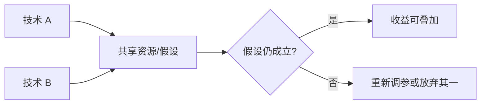

把所有优化开关拨到最大，很少得到最大收益——更常见的是互相拆台：接受率塌了、调度更抖了、显存反而更碎了。这一节聚焦组合问题：哪些叠加会冲突，以及推荐的优化顺序：先活下来（OOM），再首包（TTFT），再持续出字/吞吐（TPOT），最后收拾尾延迟。

<!-- more -->

## 📑 目录

- [1. 叠加不等于效果相加](#1-叠加不等于效果相加)
- [2. 常见冲突与相互作用](#2-常见冲突与相互作用)
- [3. 推荐优化顺序](#3-推荐优化顺序)
- [4. 组合实验怎么做](#4-组合实验怎么做)
- [5. 实用组合模板](#5-实用组合模板)
- [总结](#-总结)
- [自我检验清单](#-自我检验清单)
- [参考资料](#-参考资料)

---

## 1. 叠加不等于效果相加

每个技术都在改系统的某个"守恒量"：

| 技术 | 主要兑换 |
|---|---|
| 量化 | 显存/带宽 ↔ 精度 |
| Prefix Cache | 重复 Prefill 计算 ↔ 缓存管理复杂度 |
| Speculative Decoding | 额外草稿算力 ↔ 更少目标模型步数 |
| 更大 batch | 吞吐 ↔ 延迟百分位 |
| P/D 解耦 | 尾延迟/隔离 ↔ 链路复杂度 |

两技术若兑换同一资源或破坏对方假设，收益会亚线性甚至为负。

📌 **关键点**：组合前先问——**对方的收益假设还成立吗？**

---

## 2. 常见冲突与相互作用

### 2.1 Speculative Decoding × 量化

- 草稿模型与目标模型精度路径不一致时，**接受率**可能明显下降
- 接受率低 ⇒ 投机变成纯开销
- 建议：先固定质量可达的量化，再调投机；接受率纳入门禁

### 2.2 Speculative Decoding × Continuous Batching

- 批内请求进度、长度异构时，草稿/验证调度更复杂
- 可能出现"为投机牺牲通用批效率"的区间
- 建议：在目标并发下测端到端，不只看单请求加速比

### 2.3 强量化 × 结构化输出 / Tool Calling

- 约束解码本身可能逼近低概率区域；再叠加质量损伤，字段合法但语义更差
- 建议：对工具参数路径提高质量阈值，必要时少量化或用更大底座

### 2.4 Prefix Cache × 无亲和路由

- 引擎开了缓存，网关却轮询打散前缀 ⇒ 命中率上不去
- 建议：缓存与路由成对交付

### 2.5 为吞吐堆并发 × KV 池

- 吞吐数字好看，抢占与 P99 爆炸
- 建议：以 Goodput 替代裸吞吐作为组合验收指标

⚠️ **注意**：文档默认值的"可组合"不等于你的负载下"应组合"。

---

## 3. 推荐优化顺序

严格按优先级推进（与消防顺序一致）：

### ① OOM / 不可用

目标：稳定跑起来，能服务目标上下文。

手段：显存池化与利用率、量化、并行、削减长度/并发/LoRA 槽位。

### ② TTFT

目标：交互首包可接受。

手段：排队治理、Chunked Prefill、Prefix Cache、Encoder Cache、Prefill 路径算子与并行。

### ③ TPOT / Throughput

目标：持续出字与单位 GPU 产出。

手段：Attention/图优化、有效 batch、KV 效率、Speculative Decoding。

### ④ 尾延迟

目标：P95/P99 受控。

手段：SLO 感知调度、P/D 解耦、限流、扩容与前缀感知路由。

🔑 **核心概念**：**OOM → TTFT → TPOT → 尾延迟**。颠倒顺序常见后果是：在不可用系统上调吞吐，或在首包崩盘时迷恋 tokens/s。

---

## 4. 组合实验怎么做

1. 建立基线配置 B0（已过 OOM）
2. 每次只引入一个变化 → B1、B2…
3. 记录 TTFT/TPOT/吞吐/错误率/接受率（若投机）/命中率（若缓存）
4. 再测"候选组合" Bi+Bj，确认无负协同
5. 冻结赢家配置，写入门禁基线

反例流程（避免）：

- 同时改 5 个 flag + 换量化 + 升版本，然后宣称"优化成功"

💡 **提示**：把组合矩阵画小——只测有物理理由可能互补的对，而不是全排列。

---

## 5. 实用组合模板

| 场景 | 常见组合 | 慎加 |
|---|---|---|
| 多轮客服，长系统提示 | Prefix Cache + 前缀路由 + Chunked Prefill | 无脑大并发 |
| 卡紧、7B/13B 交互 | 权重量化 + 高效 Attention + 适度并发 | 低接受率投机 |
| 长文档理解 | 并行或更大显存 + Chunked Prefill | 仅靠提高 batch |
| 峰值毛刺明显 | 限流 + HPA +（必要时）P/D | 只靠投机解码 |
| Agent 工具密集 | 结构化输出/Tool parser 优先，再谈量化强度 | 极限量化 |

### 5.1 组合验收的最低指标集

每次宣称"组合成功"，至少同时改善或守住：

- 主攻指标（如 TTFT P95）达到目标
- 其余核心百分位不越门禁
- 错误率不升
- 若开投机：接受率高于约定下限
- 若开缓存：命中率与路由策略匹配

缺一项，就还只是"局部看起来更快"。

---

## 📝 总结

- 优化组合受资源与假设约束，收益不必线性相加。
- 重点警惕投机×量化、投机×批处理、缓存×劣路由、吞吐×KV 打满等冲突。
- 推荐顺序：OOM → TTFT → TPOT/Throughput → 尾延迟。
- 用受控单变量实验验证组合，以 Goodput 验收。
- 按场景选用模板，而不是打开全部特性。
- 组合验收看主指标与守门指标，防止拆东墙补西墙。

## 🎯 自我检验清单

- 能解释为何叠加可能为负收益
- 能举出至少三组冲突并说明机制
- 能默写推荐优化顺序及每步目标
- 能设计一个两技术组合的对照实验
- 能说明 Goodput 为何适合做组合验收
- 能为"长系统提示客服"挑选一组合理组合

## 📚 参考资料

- 本模块第 4～7 章（量化、投机、分布式、P/D）
- 第 9 章性能门禁与指标体系
- vLLM 各特性文档中的 limitations / compatibility 说明
