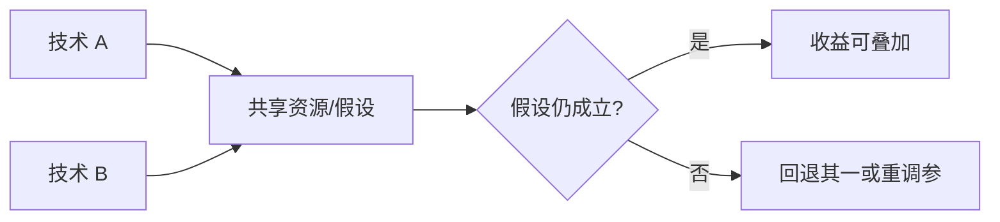

[11.1](./11.1-优化选型决策树.md) 帮你选出第一刀；这一节回答更难的问题——**第二刀、第三刀怎么叠**。把所有开关拨到最大，很少得到最大收益：更常见的是接受率塌了、调度更抖了、显存反而更碎了。下面给出冲突矩阵（量化 × 投机 × P/D × 并行等）、推荐叠加顺序，以及每步**回退条件**；端到端怎么跑剧本见 [11.3](./11.3-端到端部署实战.md)。

<!-- more -->

## 📑 目录

- [1. 问题：叠加不等于效果相加](#1-问题叠加不等于效果相加)
- [2. 冲突矩阵：量化 × 投机 × P/D × 并行](#2-冲突矩阵量化--投机--pd--并行)
- [3. 其它高频负协同](#3-其它高频负协同)
- [4. 推荐叠加顺序与回退条件](#4-推荐叠加顺序与回退条件)
- [5. 组合实验怎么做](#5-组合实验怎么做)
- [6. 实用组合模板](#6-实用组合模板)
- [7. 代价与权衡](#7-代价与权衡)
- [总结](#-总结)
- [自我检验清单](#-自我检验清单)
- [参考资料](#-参考资料)

---

## 1. 问题：叠加不等于效果相加

每个技术都在改系统的某个「守恒量」：

| 技术 | 主要兑换 | 核心假设 |
|---|---|---|
| 量化（[4.x](../第4章-量化/4.6-量化选型与vLLM实战.md)） | 显存/带宽 ↔ 精度 | 质量探针过线；Kernel 命中 |
| Prefix Cache（[2.3](../第2章-推理引擎核心技术/2.3-Prefix%20Cache%20与%20RadixAttention.md)） | 重复 Prefill ↔ 缓存与路由复杂度 | 流量有可复用前缀；路由亲和 |
| Speculative Decoding（[5.x](../第5章-Speculative-Decoding/5.4-收益边界与限制.md)） | 草稿算力 ↔ 更少目标步数 | 接受率够高；批调度可承受 |
| 更大 batch / 高并发（[2.2](../第2章-推理引擎核心技术/2.2-Continuous%20Batching.md)） | 吞吐 ↔ 延迟百分位与 KV | KV 池与抢占可控 |
| 并行 TP/PP/EP（[6.x](../第6章-分布式推理/6.1-推理并行策略总览.md)） | 单卡装得下 ↔ 通信与运维 | 通信不拖垮 TPOT |
| P/D 解耦（[7.x](../第7章-PD解耦架构/7.2-解耦架构设计.md)） | 尾延迟隔离 ↔ 传输与配比 | 重 Prefill 干扰已被证实 |

两技术若兑换同一资源或破坏对方假设，收益会亚线性甚至为负。📌 **关键点**：组合前先问——**对方的收益假设还成立吗？**

---

## 2. 冲突矩阵：量化 × 投机 × P/D × 并行

表中符号：✅ 常可叠加（仍需单变量验证）；⚠️ 有条件；❌ 默认慎叠或先拆开验证。

|  | 量化 | 投机 | P/D | 并行（TP 等） |
|---|---|---|---|---|
| **量化** | — | ⚠️ 接受率/精度路径 | ⚠️ KV 传输 dtype | ⚠️ 各 rank 一致性 |
| **投机** | ⚠️ | — | ⚠️ 草稿放哪一侧 | ⚠️ 草稿与目标并行度 |
| **P/D** | ⚠️ | ⚠️ | — | ⚠️ Prefill/Decode 各自并行 |
| **并行** | ⚠️ | ⚠️ | ⚠️ | — |

### 2.1 量化 × 投机

- **机制**：草稿与目标精度路径不一致 → token 分布漂移 → **接受率**下降；接受率低 ⇒ 投机变纯开销（[5.4](../第5章-Speculative-Decoding/5.4-收益边界与限制.md)）。
- **先验证**：同负载下接受率与质量探针；不要只看单请求「理论加速比」。
- **回退**：接受率持续 $<$ 约定下限（团队常取 $0.5\sim 0.6$，以你基线为准），或 Goodput 相对「仅量化」无增益 → 关投机，保留已验收量化。

### 2.2 量化 × P/D

- **机制**：Prefill/Decode 两侧精度、KV 布局与 Connector 传输必须一致；一侧 FP8 KV、一侧按 BF16 假设接，会在传输或正确性上翻车（[7.3](../第7章-PD解耦架构/7.3-KV-Cache传输与Connector.md)）。
- **先验证**：解耦链路的功能正确性 + 同负载 P99；再看量化增益。
- **回退**：传输错误率升、或解耦后 P99 无改善 → 先回退到单体 + Chunked Prefill（[2.4](../第2章-推理引擎核心技术/2.4-Chunked%20Prefill%20与统一调度.md)），量化单独保留或单独回退。

### 2.3 量化 × 并行

- **机制**：TP 要求各 rank 权重分片与量化格式一致；错误加载表现为错输出或通信挂起（[6.2](../第6章-分布式推理/6.2-张量并行推理.md)、[6.6](../第6章-分布式推理/6.6-vLLM分布式部署实战.md)）。
- **先验证**：单卡量化过线 → 再抬 TP；通信时间占比（[9.3](../第9章-性能分析与Benchmark/9.3-性能分析工具.md)）。
- **回退**：TPOT 因通信明显变差，且显存已可用更低并行装下 → 降 TP，优先用量化换显存。

### 2.4 投机 × P/D

- **机制**：草稿跑在 Prefill 侧还是 Decode 侧、验证步与 KV 传输如何交错，会改调度复杂度；配比失当会吃掉隔离收益（[7.5](../第7章-PD解耦架构/7.5-解耦挑战与配比.md)）。
- **先验证**：P/D 基线已证明 P99 改善；再叠加投机，看接受率与两侧利用率。
- **回退**：解耦 + 投机后 Goodput 低于「仅 P/D」→ 去掉投机；若仅 P/D 也不如单体，回退解耦。

### 2.5 投机 × 并行 / 连续批处理

- **机制**：批内长度异构时，草稿/验证调度更重；高 TP 下草稿与目标的并行配置不一致会放大气泡时间（[2.2](../第2章-推理引擎核心技术/2.2-Continuous%20Batching.md)、[5.5](../第5章-Speculative-Decoding/5.5-vLLM投机解码实战.md)）。
- **先验证**：**目标并发**下的端到端，不只 `concurrency=1`。
- **回退**：并发升高后加速比消失或 TTFT 恶化 → 降投机强度或关投机。

---

## 3. 其它高频负协同

### 3.1 强量化 × 结构化输出 / Tool Calling

约束解码本身可能逼近低概率区域；再叠质量损伤，字段合法但语义更差（[8.1](../第8章-生产级服务特性/8.1-结构化输出.md)、[8.2](../第8章-生产级服务特性/8.2-Tool-Calling与Reasoning-Parser.md)）。  
**回退**：工具参数路径探针失败 → 提高精度或加大底座，而不是再拧采样温度。

### 3.2 Prefix Cache × 无亲和路由

引擎开了缓存，网关轮询打散前缀 ⇒ 命中率上不去（[10.3](../第10章-生产部署与运维/10.3-自动扩缩容与负载均衡.md)）。  
**回退条件不必回退缓存**：应先修路由；若流量本无共享前缀，再关缓存省管理开销。

### 3.3 为吞吐堆并发 × KV 池

吞吐数字好看，抢占与 P99 爆炸。验收必须以 **Goodput** 替代裸吞吐（[9.1](../第9章-性能分析与Benchmark/9.1-推理指标体系.md)、[7.4](../第7章-PD解耦架构/7.4-Goodput与SLO感知调度.md)）。  
**回退**：KV $>0.85$ 且 preemption 升、P99 破线 → 降 `max_num_seqs` / 加副本，而不是再开投机「冲分」。

### 3.4 Multi-LoRA × 极限并发 / 极限量化

槽位与适配器显存会吃掉 KV 池（[8.3](../第8章-生产级服务特性/8.3-Multi-LoRA服务.md)）。强租户场景优先拆副本，而不是一台塞满。

⚠️ **注意**：文档写「可组合」≠ 你的负载下「应组合」。以同负载对照与门禁为准（[9.5](../第9章-性能分析与Benchmark/9.5-性能回归门禁.md)）。

---

## 4. 推荐叠加顺序与回退条件

与消防顺序一致：**OOM → TTFT → TPOT → 尾延迟**。每步只合并一个变化，并写清失败回退。

| 步 | 目标 | 典型手段 | 进入下一刀的条件 | 回退条件 |
|---|---|---|---|---|
| ① | 可运行 | 池化、利用率、量化、并行、砍长度/并发 | 目标上下文稳定服务，无 OOM | 任一变更导致启动失败/错输出 → 回上一可运行配置 |
| ② | TTFT | 排队治理、Chunked Prefill、Prefix Cache、Encoder Cache | TTFT P95 达 SLO 或逼近 | TTFT 无增益或命中率不升 → 回退该特性 |
| ③ | TPOT / 吞吐 | Attention/图、有效 batch、KV 效率、投机 | TPOT/Goodput 改善且质量过线 | 接受率低或 Goodput 降 → 关投机/降并发 |
| ④ | 尾延迟 | SLO 调度、P/D、限流、前缀路由 | P95/P99 受控 | P99 无改善或错误率升 → 回退 P/D 或放宽变更 |

🔑 **核心概念**：颠倒顺序的常见后果是——在不可用系统上调吞吐，或在首包崩盘时迷恋 tokens/s。

算例（前提：教学示意，非实测）：B0 已可运行；TTFT P95 $=1.2\,\mathrm{s}$（SLO $800\,\mathrm{ms}$），TPOT P95 $=40\,\mathrm{ms}$（SLO $35\,\mathrm{ms}$）。应先做步 ②（缓存/Chunked），再碰步 ③ 的投机。若先开投机把 TPOT 压到 $32\,\mathrm{ms}$ 而 TTFT 仍 $1.1\,\mathrm{s}$，用户感知仍失败，且你多背了一个接受率变量。

---

## 5. 组合实验怎么做

1. 建立基线 B0（已过 OOM，配置入库）  
2. 每次只引入一个变化 → B1、B2…  
3. 记录：TTFT/TPOT P95、Goodput、错误率；投机加接受率；缓存加命中率  
4. 再测候选组合 Bi+Bj，确认无负协同  
5. 冻结赢家，写入 [9.5](../第9章-性能分析与Benchmark/9.5-性能回归门禁.md) 基线  

反例：同时改 5 个 flag + 换量化 + 升版本，然后宣称「优化成功」——无法 bisect，也无法安全回滚。

💡 **提示**：组合矩阵画小——只测有物理理由可能互补的对，不做全排列。

### 组合验收最低指标集

宣称「组合成功」时至少同时满足：

- 主攻指标达目标  
- 其余核心百分位不越门禁  
- 错误率不升  
- 若开投机：接受率 ≥ 约定下限  
- 若开缓存：命中率与路由策略匹配  
- 若开 P/D：传输/错误与配比监控无回归（[7.5](../第7章-PD解耦架构/7.5-解耦挑战与配比.md)、[10.2](../第10章-生产部署与运维/10.2-可观测性.md)）  

缺一项，就还只是「局部看起来更快」。

---

## 6. 实用组合模板

| 场景 | 常见组合 | 慎加 | 回退信号 |
|---|---|---|---|
| 多轮客服，长系统提示 | Prefix Cache + 前缀路由 + Chunked Prefill | 无脑大并发 | 命中率低 / KV 打满 |
| 卡紧、7B/14B 交互 | 权重量化 + 高效 Attention + 适度并发 | 低接受率投机 | 质量探针失败 |
| 长文档理解 | 并行或更大显存 + Chunked Prefill | 仅靠提高 batch | 抢占升、P99 爆 |
| 峰值毛刺明显 | 限流 + HPA +（必要时）P/D | 只靠投机解码 | 解耦后 Goodput 降 |
| Agent 工具密集 | 结构化/Tool parser 优先，再谈量化强度 | 极限量化 | 工具参数探针失败 |
| Hopper 高吞吐 | FP8（± FP8 KV）按 [4.6](../第4章-量化/4.6-量化选型与vLLM实战.md) | 同时上投机+P/D+升 TP | 无法归因 |

---

## 7. 代价与权衡

| 选择 | 收益 | 代价 / 不适用 |
|---|---|---|
| 严格单变量叠加 | 可归因、可回滚 | 日历时间更长 |
| 一次开齐「全家桶」 | 演示好看 | 负协同与事故日难定位 |
| 量化后再投机 | 显存与步数双杠杆 | 接受率风险；要门禁 |
| 先 P/D 再量化 | 隔离与容量可分治 | 链路复杂度；dtype 契约 |
| 用 Goodput 验收组合 | 与用户体验一致 | 要稳定压测与同源指标 |

适用：已按 [11.1](./11.1-优化选型决策树.md) 选定主诉，并有质量小集。  
若主诉未定，先分流，再谈组合——否则冲突矩阵无从落笔。

---

## 📝 总结

- 组合受资源与假设约束，收益不必线性相加；先问对方假设是否仍成立。
- 冲突矩阵聚焦量化 × 投机 × P/D × 并行：接受率、KV dtype、通信与配比是高频断裂点。
- 推荐顺序：OOM → TTFT → TPOT → 尾延迟；每步写清进入条件与回退条件。
- 用受控单变量实验验证组合，以 Goodput + 守门指标验收，按场景选模板而非打开全部特性。

## 🎯 自我检验清单

- 能解释为何叠加可能为负收益，并指出被破坏的假设
- 能默写量化×投机、量化×P/D、投机×批处理的机制与回退条件
- 能复述 OOM→TTFT→TPOT→尾延迟顺序及每步目标
- 能设计两技术组合的对照实验（含记录哪些额外指标）
- 能说明 Goodput 为何适合做组合验收
- 能为「长系统提示客服」挑选一组合理组合并写出回退信号

## 📚 参考资料

- [本模块 4.6 量化选型与 vLLM 实战](../第4章-量化/4.6-量化选型与vLLM实战.md)
- [本模块 5.4 收益边界与限制](../第5章-Speculative-Decoding/5.4-收益边界与限制.md)
- [本模块 5.5 vLLM 投机解码实战](../第5章-Speculative-Decoding/5.5-vLLM投机解码实战.md)
- [本模块 6.1 推理并行策略总览](../第6章-分布式推理/6.1-推理并行策略总览.md)
- [本模块 7.3 KV Cache 传输与 Connector](../第7章-PD解耦架构/7.3-KV-Cache传输与Connector.md)
- [本模块 7.5 解耦挑战与配比](../第7章-PD解耦架构/7.5-解耦挑战与配比.md)
- [本模块 9.1 推理指标体系](../第9章-性能分析与Benchmark/9.1-推理指标体系.md)
- [本模块 9.5 性能回归门禁](../第9章-性能分析与Benchmark/9.5-性能回归门禁.md)
- [本模块 10.3 自动扩缩容与负载均衡](../第10章-生产部署与运维/10.3-自动扩缩容与负载均衡.md)
- [本模块 11.1 优化选型决策树](./11.1-优化选型决策树.md)
- vLLM 各特性文档中的 limitations / compatibility 说明
