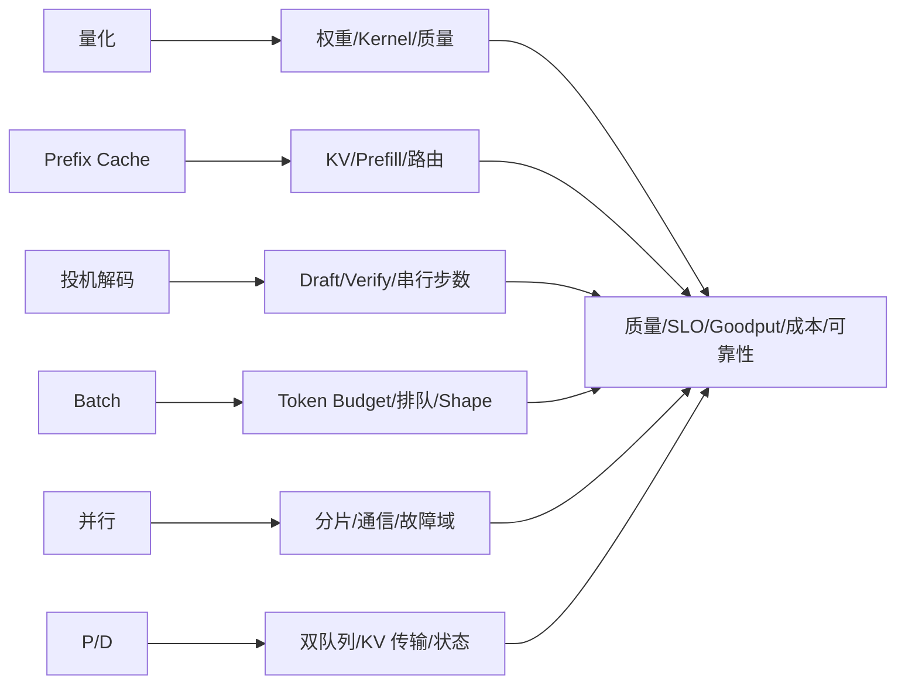

## 📑 目录
- [1. 问题：可以同时开启不等于值得组合](#1-问题可以同时开启不等于值得组合)
- [2. 统一案例与组合合同](#2-统一案例与组合合同)
- [3. 方法：把优化写成系统变换](#3-方法把优化写成系统变换)
- [4. 资源共享：六类优化在争什么](#4-资源共享六类优化在争什么)
- [5. 顺序效应：同一集合为何结果不同](#5-顺序效应同一集合为何结果不同)
- [6. 瓶颈迁移：局部胜利之后看哪里](#6-瓶颈迁移局部胜利之后看哪里)
- [7. 非乘法收益与交互项](#7-非乘法收益与交互项)
- [8. 六类优化的交互矩阵](#8-六类优化的交互矩阵)
- [9. 先单项、后组合的实验方法](#9-先单项后组合的实验方法)
- [10. 算例一：量化、缓存与 Batch](#10-算例一量化缓存与-batch)
- [11. 算例二：投机、并行与 P/D](#11-算例二投机并行与-pd)
- [12. 组合回退与决策记录](#12-组合回退与决策记录)
- [13. 代价与常见误区](#13-代价与常见误区)
- [14. 适用边界](#14-适用边界)
- [总结](#总结)
- [自我检验](#自我检验)
- [参考资料](#参考资料)

---

## 1. 问题：可以同时开启不等于值得组合
单项优化常有一条容易理解的收益路径。
权重量化可能减少权重空间或访存。
Prefix Cache 可能跳过重复 Prefill。
投机解码可能减少目标模型的串行 Decode 轮次。
更积极的 Batch 可能减少 GPU 空洞。
并行可能分摊权重与计算。
P/D 解耦可能隔离 Prefill 与 Decode 的干扰。
组合后，这些路径不再独立。
它们会共享 HBM、CPU 调度、Token Budget、Kernel Shape、网络和故障预算。
因此，两个单项都有效，不能推出组合有效。
两个单项都无速度收益，也不能推出组合无价值。
例如量化单项可能只释放显存，Prefix Cache 单项可能因 KV 空间不足而频繁驱逐。
二者组合后，量化释放的空间可能延长缓存寿命。
这时收益来自容量协同，而不是两次“速度提升”相乘。
本节回答四个系统问题：
1. 多项优化共享了哪些资源；
2. 为什么引入顺序会改变结果；
3. 原瓶颈消失后，新瓶颈移到哪里；
4. 如何用单项和组合对照区分主效应与交互。
本节不会给出一个静态“最佳套餐”。
## 2. 统一案例与组合合同
所有讨论仍服从：
$$
\mathcal D=(W,Q,S,K,R)
$$
模型固定为同一份 8B 指令模型权重、Tokenizer、Chat Template 和采样语义。
硬件上限固定为单节点 4 张 80 GiB GPU，节点内高速互联。
长度联合分布固定为：
- 60% 的请求是 $(1024,128)$；
- 30% 的请求是 $(4096,256)$；
- 10% 的请求是 $(8192,512)$。
40% 请求精确共享前 768 个 Token。
冷、热缓存条件分别实验、分别报告。
到达过程是开环 Poisson，负载点固定为 $1,2,4,6$ request/s。
每分钟一次持续 5 秒的两倍突发也保持不变。
质量门保持不变：
- 任务分数相对 $B_0$ 下降不超过 0.5 个百分点；
- JSON 有效率不低于 99.9%；
- 解码语义不得静默改变。
请求门保持不变：
$$
TTFT\le500\,\mathrm{ms},\quad
TPOT\le40\,\mathrm{ms},\quad
E2E\le25\,\mathrm{s}
$$
令 \(\mathcal B_D\) 覆盖四个负载点 × 冷/热缓存 × 稳态/重复突发，并在每格检查总体及三个长度桶。
按可信入口到达归属请求，拒绝、错误、超时和取消均为 bad event；每个 \(b\in\mathcal B_D\) 都要求 \(A_b=N_{\mathrm{good},b}/N_{\mathrm{offered},b}\ge S_D=99\%\)。
可靠性门要求显式过载行为、状态隔离和可验证回退。
成本按 GPU、CPU、内存、网络、存储、能耗、可观测性与运维之和除以合格请求或合格 Token 计算；统一案例取 \(K_{\mathrm{budget}}=K_{\mathrm{good}}(B_0)\)。
基线 $B_0$ 是 BF16、单 GPU、单副本、Paged KV 与 Continuous Batching。
$B_0$ 关闭量化、Prefix Cache、投机解码、跨卡并行和 P/D 解耦。
组合候选只能从 11.1 已有瓶颈证据的单项中产生。

未测结果仍记为“未测”，不能用理论倍率填入验收表。

## 3. 方法：把优化写成系统变换
### 3.1 状态向量
把系统状态抽象为：
$$
x=(M_W,M_{KV},M_{RT},C_{CPU},C_{GPU},B_{\mathrm{net}},
T_{\mathrm{queue}},T_{\mathrm{prefill}},T_{\mathrm{decode}},F)
$$
$F$ 表示错误状态、故障域和回退复杂度。
一项优化 $o_i$ 不是一个开关，而是状态变换：
$$
x' = f_i(x;\mathcal D,\theta_i)
$$
$\theta_i$ 是该项优化的具体实现和参数。
两项组合的结果是：
$$
x''=f_j(f_i(x))
$$
一般情况下：
$$
f_j(f_i(x))\ne f_i(f_j(x))
$$
这就是顺序效应的形式化表达。
### 3.2 接受函数
最终判断不是“某个时间项下降”，而是：
$$
\mathrm{Accept}(o\mid\mathcal D)=
Q_{\mathrm{ok}}\land S_{\mathrm{ok}}\land R_{\mathrm{ok}}
\land K_{\mathrm{good}}\le K_{\mathrm{budget}}
$$
在硬门以内，再比较 Goodput、单位合格产出成本和证据不确定性。
组合模型因此包含三层：
- **机制层**：每项优化直接改变什么；
- **资源层**：这些改变在哪里相加、竞争或释放空间；
- **验收层**：迁移后的系统是否仍满足五维合同。
### 3.3 先写因果图

箭头不是收益承诺。
它只标记下一步必须观测的中介变量。
## 4. 资源共享：六类优化在争什么
### 4.1 HBM 总账
组合后的显存仍应守恒：
$$
M_{\mathrm{HBM}}=
M_W+M_{KV}+M_{\mathrm{runtime}}+M_{\mathrm{comm}}
+M_{\mathrm{feature}}+M_{\mathrm{headroom}}
$$
量化可能减小 $M_W$，但会加入 Scale、打包布局和工作区。
Prefix Cache 希望把更多空间交给可保留的 $M_{KV}$。
投机解码可能加入 Draft 权重、候选 KV 和 Verify 工作区。
更大 Batch 增加驻留序列和临时张量。
并行减少每 Rank 权重，却可能增加通信缓冲。
P/D 可能复制权重，并让在途 KV 同时存在于发送、传输和接收侧。
显存占用重新接近上限不必然表示量化“没有生效”。
如果释放空间被有价值的 KV 使用，系统可能增加 Goodput。
但若 Headroom 被吃光，P99 和 OOM 风险也可能上升。
### 4.2 时间与调度总账
一条请求的时间近似为：
$$
T_{\mathrm{E2E}}=
T_{\mathrm{admit}}+T_{\mathrm{queue}}+T_{\mathrm{prefill}}
+T_{\mathrm{handoff}}+T_{\mathrm{decode}}+T_{\mathrm{post}}
-T_{\mathrm{valid\ overlap}}
$$
Prefix Cache 主要尝试减少 $T_{\mathrm{prefill}}$。
投机解码主要尝试减少目标模型的 Decode 轮次。
Batch 可能减少设备空洞，却增加某些请求的等待。
P/D 可能减少阶段干扰，却新增 $T_{\mathrm{handoff}}$ 和第二条队列。
并行可能减少计算时间，却增加同步时间。
只有没有破坏依赖的真实重叠才能被减去。
### 4.3 CPU、网络和故障预算
量化格式转换、缓存索引、Draft 调度和双池路由都可能增加 CPU 工作。
并行集合通信与 P/D KV 传输共享网络带宽时，会相互改变尾部。
Prefix-aware 路由可能提高命中，也可能造成服务单元热点。
P/D 把一个有状态服务变成两个池和一条状态通道。

组合越多，故障状态和回退兼容面越大。

复杂度不是“软成本”，它属于 $K$ 与 $R$。

## 5. 顺序效应：同一集合为何结果不同
### 5.1 参数最优点会移动
在 $B_0$ 上找到的安全 Batch，不一定适用于量化后系统。
量化释放空间后，可以驻留更多 KV；原 Batch 可能过于保守。
Prefix Cache 改变实际 Prefill Token 后，原 Token Budget 的含义也会变化。
投机解码改变每步提出与接受的 Token 数，使 Batch Shape 更不规则。
P/D 拆分后，Prefill 与 Decode 各有自己的局部 Batch。
因此，“先做 A 再做 B”不仅是操作顺序，也是基线更新顺序。
### 5.2 两种顺序回答不同问题
顺序一：
$$
B_0\rightarrow Q\rightarrow Q+C
$$
它先验证量化主效应，再问缓存给量化后的系统带来什么。
顺序二：
$$
B_0\rightarrow C\rightarrow C+Q
$$
它先验证缓存主效应，再问量化给缓存后的系统带来什么。
若每一步都重新寻优，两个终点可能不同。
原因包括缓存容量、Batch 预算、Graph Shape、并行度和路由状态被重新选择。
### 5.3 合理顺序不是技术排名
合理顺序由当前问题决定：
1. 先验证直接命中主瓶颈的单项；
2. 固化它的证据与安全参数；
3. 再加入有明确剩余瓶颈的第二项；
4. 在组合附近重新扫描被影响的参数；
5. 任一硬门失败就回到上一个可接受状态。
如果 OOM 阻止基线运行，承载空间的干预自然先于速度优化。

如果 $B_0$ 已能运行且 TTFT 是主问题，量化没有天然优先级。

## 6. 瓶颈迁移：局部胜利之后看哪里
### 6.1 迁移是系统优化的常态
设总时间由多个阶段组成：
$$
T=T_1+T_2+\cdots+T_n
$$
只加速占比为 $p$ 的阶段，理论上受 Amdahl 定律约束：
$$
S_{\mathrm{total}}=\frac{1}{(1-p)+p/s}
$$
当该阶段变快，原来较小的 Queue、CPU 或 Network 项可能成为主导。
### 6.2 六类典型迁移
- 量化让 GPU 计算更快，CPU 调度或通信占比上升；
- Prefix 命中减少 Prefill，Decode 与 KV 驻留成为主导；
- Spec 减少目标步数，Draft、Verify 或 Batch 不规则成为主导；
- Batch 提高设备利用率，TTFT 与 P99 排队成为主导；
- TP 分摊计算，集合通信与共同故障域成为主导；
- P/D 隔离阶段，KV 传输、双队列和配比成为主导。
### 6.3 迁移检测
每次单项通过后，都重新画一遍：
```text
入口需求
  → Queue
    → Runtime 调度与状态
      → GPU 计算/带宽
        → Network 数据移动
          → 质量、SLO、成本与可靠性
```
若新主瓶颈没有证据，不能仅因“还有 GPU”继续叠加。
## 7. 非乘法收益与交互项
### 7.1 为什么倍率不能相乘
设越大越好的指标为 $Y$，例如 Goodput。
两项优化 A、B 的加法交互项可写为：
$$
I_{AB}=(Y_{11}-Y_{00})-(Y_{10}-Y_{00})-(Y_{01}-Y_{00})
$$
$I_{AB}>0$ 表示在当前尺度上存在正协同。
$I_{AB}<0$ 表示组合增量小于两个单项增量之和。
它不自动证明冲突。
上限效应、测量噪声、参数未重新寻优和瓶颈迁移也会让 $I_{AB}<0$。
### 7.2 对倍率指标使用对数
若使用相对倍率，可在对数尺度上比较：
$$
I^{\log}_{AB}
=\log\frac{Y_{11}}{Y_{00}}
-\log\frac{Y_{10}}{Y_{00}}
-\log\frac{Y_{01}}{Y_{00}}
$$
这比直接宣称“1.2 倍乘 1.1 倍”更清楚地暴露偏离独立性的程度。
### 7.3 交互必须回到机制
负交互可能表示两项都优化了同一个瓶颈。
正交互可能表示第一项释放了第二项需要的资源。

零交互也可能只是样本不足。

所以交互项是问题生成器，不是部署裁决器。

## 8. 六类优化的交互矩阵
符号只表示需要重点验证的机制：
- `协`：存在清晰协同路径；
- `竞`：竞争同一资源；
- `迁`：容易移动瓶颈；
- `态`：引入状态或回退耦合。
| A × B | 量化 | Prefix Cache | 投机 | Batch | 并行 | P/D |
|---|---|---|---|---|---|---|
| 量化 | — | 协：权重让位 KV | 竞：Draft/Verify 空间与 Kernel | 迁：空间换并发 | 迁：格式、分片与通信 | 态：两侧精度/KV 格式 |
| Prefix Cache |  | — | 迁：Prefill/Decode 重心 | 竞：KV、成本估计与公平 | 态：缓存局部性与副本 | 态：缓存位置与传输 |
| 投机 |  |  | — | 竞：不规则步进和预算 | 竞：Draft/Target 拓扑 | 态：Decode 状态与失败 |
| Batch |  |  |  | — | 迁：计算效率与同步 | 竞：双池产消匹配 |
| 并行 |  |  |  |  | — | 态：两侧并行度与网络 |
| P/D |  |  |  |  |  | — |
矩阵不回答“能否同时开启”。
它把组合改写成具体问题。
例如“量化 × Prefix”应问：
> 权重空间下降是否延长了真实前缀的 KV 保留，并在不触碰质量和 Headroom 的前提下增加 Goodput？
“并行 × P/D”应问：
> 两侧计算节省是否被集合通信和 KV 传输共享网络后的尾部抵消？

## 9. 先单项、后组合的实验方法
### 9.1 阶段一：复现 $B_0$
确认四个负载点、三类长度、冷/热条件和两倍突发可重复。

若 $B_0$ 本身漂移，组合差异没有可靠参照。

### 9.2 阶段二：单项主效应
每项候选只改变一个主要变量。

单项记录直接中介量：

- 量化：权重/工作区、Kernel、质量；
- Prefix：跳过 Token、命中、驱逐、热点；
- Spec：Draft、Verify、Reject、接受长度；
- Batch：Batch Shape、Queue、KV、抢占；
- 并行：每 Rank 空间、计算、集合通信；
- P/D：两侧队列、KV 字节、传输与半完成状态。

未直达 11.1 主假设的单项暂不进入组合池。

### 9.3 阶段三：二因子局部矩阵
对 A、B 使用最小 2×2：

| Run | A | B | 回答的问题 |
|---|---:|---:|---|
| 00 | off | off | 当前基线 |
| 10 | on | off | A 主效应 |
| 01 | off | on | B 主效应 |
| 11 | on | on | 组合与交互 |

四格使用同一 $\mathcal D$、同一测量窗口定义和同一候选身份。

### 9.4 阶段四：重新寻优与确认
2×2 先在固定参数下识别因果。

如果组合通过，再只扫描被机制明确改变的邻近参数。

例如量化释放 KV 空间后，只局部检查 Batch 或缓存容量。

不能借“重新寻优”同时更换模型、并行拓扑和路由。

### 9.5 阶段五：接受或回退
质量、SLO、成本、可靠性任何硬门失败，都回到上一可接受基线。

三项组合不是默认下一步。

只有二阶交互可解释、合同仍未满足且新增复杂度有预算时，才提出三项假设。

## 10. 算例一：量化、缓存与 Batch
### 10.1 问题
统一案例中，40% 请求共享前 768 Token。

假设 $B_0$ 的证据指向权重空间挤压 KV，同时真实前缀组存在可复现 Prefill 成本。

这只允许生成两个单项假设：

- $H_Q$：量化释放的权重空间可以增加安全 KV 容量；
- $H_C$：热缓存下跳过 768 Token 可以降低相应分桶 TTFT。

### 10.2 单项阶段
先在原 Batch 下比较 $B_0$ 与 Q。

Q 必须先通过 0.5 个百分点质量差、99.9% JSON 和语义门。

再在 BF16 下比较冷、热 Prefix 条件。

若真实 40% 组无收益，不能用全热上界替代。

此时不能直接把 Q 与 C 的单项倍率相乘。

### 10.3 组合阶段
最小矩阵是：

| Run | 精度 | Prefix | Batch | 目的 |
|---|---|---|---|---|
| 000 | BF16 | off | $B_0$ | 基线 |
| 100 | Quant | off | $B_0$ | 量化主效应 |
| 010 | BF16 | on | $B_0$ | 缓存主效应 |
| 110 | Quant | on | $B_0$ | 空间协同 |

只有 110 通过后，才局部改变 Batch，形成第三个因子。

### 10.4 可能结论
若 110 的总显存不降，但 KV 保留增加、Goodput 上升，可写：

> 组合收益由量化释放空间后的缓存容量协同解释；尚未证明量化 Kernel 本身加速。

若 Batch 增大后 Throughput 上升而 TTFT 超过 500 ms，则组合验收失败。

这不是“参数再调大一点”的理由，而是排队瓶颈已经迁移。

## 11. 算例二：投机、并行与 P/D
### 11.1 问题
仍是同一 8B、4×80 GiB 和相同长度/到达分布。

假设 11.1 的证据指向 Decode 串行轮次，但单 GPU 仍能承载 $B_0$。

这时 Spec 是直接候选，并行与 P/D 不是天然候选。

### 11.2 Spec × Batch
在 1 request/s 时，Draft 固定开销可能清晰可见。

在 6 request/s 时，目标模型已被 Continuous Batching 喂满，Spec 增量可能缩小。

需要按负载点比较：

$$
T_{\mathrm{spec}}=
T_{\mathrm{draft}}+T_{\mathrm{verify}}+T_{\mathrm{reject}}+T_{\mathrm{schedule}}
$$

接受率相同也不保证收益相同，因为 Batch Shape 和 KV 并发不同。

### 11.3 Parallel × P/D
若后续证据显示 Prefill/Decode 互扰，再提出 P/D 假设。

4 张 GPU 可分给 TP、副本或 P/D 两侧，但每种分配改变服务单元数量。

P/D 新增 KV 传输，TP 新增集合通信。

二者共享节点内互联时，局部计算收益可能变成网络尾部。

可证伪陈述是：

> 若共享网络是组合瓶颈，则并行与 P/D 同时启用后的传输/集合通信重叠应解释新增 P99；若网络时间不变，则拒绝。

没有该证据，就不应从“有 4 张卡”推导复杂拓扑。

## 12. 组合回退与决策记录
组合实验必须保留阶梯式安全点：

$$
B_0\rightarrow B_1\rightarrow B_2
$$

$B_1$ 是已独立通过的第一个单项。

$B_2$ 是经过交互验证的组合。

回退不是关闭最后一个布尔开关。

需要恢复与该阶梯绑定的模型格式、KV 兼容身份、Batch 语义、路由状态和 P/D 状态所有权。

每一步记录：

- 它针对的剩余瓶颈；
- 直接中介量和替代解释；
- 被重新寻优的参数；
- 五维验收结果；
- 适用的长度、负载和缓存条件；
- 回到上一阶梯的状态边界。

如果无法只回退第二项而保持 $B_1$ 正确，B1+B2 就应视为一个不可拆分候选。

11.3 会把这个候选带入同一端到端验收闭环。

## 13. 代价与常见误区
### 13.1 代价
六个二元因子的全因子设计有 $2^6=64$ 个组合。

再乘四个负载点、三类长度和冷热条件，实验空间会迅速膨胀。

所以本节使用瓶颈证据筛选因子，再做局部 2×2，而不是穷举。

组合还增加样本需求、状态兼容、故障模式和解释成本。

### 13.2 误区
- 把功能兼容表当收益矩阵；
- 将单项百分比直接相乘；
- 只测最终组合，无法解释来源；
- 单项失败后仍因“也许有协同”盲目叠加；
- 组合后不重新寻找主瓶颈；
- 只看平均吞吐，不看 Goodput 与 P99；
- 重新寻优时偷偷改变多个因果；
- 把复杂度排除在成本和可靠性之外。

## 14. 适用边界
交互矩阵是提问框架，不是 vLLM 功能支持声明。

同名量化格式在不同 GPU 或版本上可能使用不同 Kernel。

Spec 收益依赖 Draft、任务分布和接受长度。

Prefix 收益依赖真实复用、温度、隔离与路由。

并行和 P/D 的边界依赖真实拓扑及 KV 字节量。

本节结论只适用于冻结的 $\mathcal D$ 和对应证据。

换模型、版本、硬件、长度分布或 SLO 后，必须重新验证主效应和交互。

## 总结
组合优化是状态变换的复合，不是独立倍率的乘法。

资源共享解释协同与冲突，顺序效应解释参数最优点变化，瓶颈迁移解释收益为何饱和。

正确方法是从 $B_0$ 出发先测单项，再用局部 2×2 测交互，最后重新验收并保留阶梯式回退。

## 自我检验
- [ ] 我能复述统一的 8B、4×80 GiB、长度、负载、质量、SLO 与 $B_0$
- [ ] 我会为六类优化分别写出节省项和新增消耗
- [ ] 我能解释为什么 $f_j(f_i(x))$ 与 $f_i(f_j(x))$ 可能不同
- [ ] 我会在单项通过后重新定位瓶颈
- [ ] 我不会把单项收益直接相乘
- [ ] 我能用 2×2 区分两个主效应和交互
- [ ] 我只在二阶交互可解释时考虑更多因子
- [ ] 我为每一级组合保留可验证回退

## 参考资料
- [本章总览：推理优化选型与端到端实战](./第11章-推理优化选型与端到端实战.md)
- [11.1：优化选型决策树](./11.1-优化选型决策树.md)
- [11.3：端到端部署实战](./11.3-端到端部署实战.md)
- [vLLM Quantization](https://docs.vllm.ai/en/latest/features/quantization/)
- [vLLM Automatic Prefix Caching](https://docs.vllm.ai/en/latest/design/prefix_caching.html)
- [vLLM Speculative Decoding](https://docs.vllm.ai/en/latest/features/spec_decode.html)
- [vLLM Parallelism and Scaling](https://docs.vllm.ai/en/latest/serving/parallelism_scaling.html)
- [vLLM Disaggregated Prefilling](https://docs.vllm.ai/en/latest/features/disagg_prefill.html)
- [NIST Engineering Statistics Handbook](https://www.itl.nist.gov/div898/handbook/)
