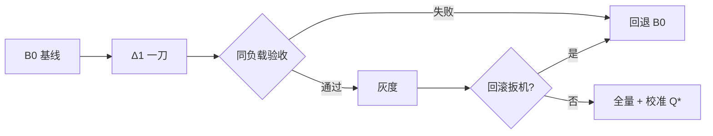

[11.1](./11.1-优化选型决策树.md) 定主诉，[11.2](./11.2-优化组合注意事项.md) 管组合；这一节把零件装成**最小可执行剧本**：基线 → 一刀 → 验收 → 发布。以 vLLM 为主引擎，数字一律标明前提（教学示意，须用你环境重测）。目标不是另一份 YAML 大全，而是一条能勾选、能回滚、能复盘的发布链。

<!-- more -->

## 📑 目录

- [1. 问题：没有剧本就没有归因](#1-问题没有剧本就没有归因)
- [2. 需求一页纸（数字化）](#2-需求一页纸数字化)
- [3. 剧本 Stage 0：冻结基线 B0](#3-剧本-stage-0冻结基线-b0)
- [4. 剧本 Stage 1：只改一刀](#4-剧本-stage-1只改一刀)
- [5. 剧本 Stage 2：同负载验收](#5-剧本-stage-2同负载验收)
- [6. 剧本 Stage 3：发布与回滚](#6-剧本-stage-3发布与回滚)
- [7. 工作样例（带前提的数字）](#7-工作样例带前提的数字)
- [8. 端到端检查表与时间盒](#8-端到端检查表与时间盒)
- [9. 代价与权衡](#9-代价与权衡)
- [总结](#-总结)
- [自我检验清单](#-自我检验清单)
- [参考资料](#-参考资料)

---

## 1. 问题：没有剧本就没有归因

常见翻车：同时换量化、开缓存、升版本、改 HPA，灰度后「好像快了」，回滚时不知道该撤哪一刀。机制很简单——**多变量变更无法 bisect**（[9.5](../第9章-性能分析与Benchmark/9.5-性能回归门禁.md)）。落地纪律：

```text
B0 基线（可运行 + 可观测）
 → Δ1 唯一变更
 → 同负载验收（过线 / 回退）
 → 灰度发布
 → 校准 Q* 与告警
```

📌 **关键点**：剧本的货币是 **Goodput + 百分位 SLO**（[9.1](../第9章-性能分析与Benchmark/9.1-推理指标体系.md)），不是实验室峰值 tokens/s。

---

## 2. 需求一页纸（数字化）

| 维度 | 必须写下的内容 | 单位 / 形态 |
|---|---|---|
| 模型 | 权重名、是否 Multi-LoRA / VLM | — |
| 质量 | 允许的量化损失；是否结构化/工具 | 探针集 + 阈值 |
| 流量 | 峰值到达率、长度分布、前缀复用、日夜差 | $\mathrm{QPS}$、Token、% |
| 体验 | 流式？TTFT/TPOT/错误率 SLO | $\mathrm{ms}$、% |
| 合规 | 驻留、脱敏、鉴权 | 清单 |
| 硬件 | GPU 型号/数量上限、能否 TP | 卡数、型号 |

没有写成数字的 SLO 与峰值，后面「优化」无法验收。角色：推理业主、平台/K8s、业务服务端、on-call——变更窗口与回滚人写进同一页。

---

## 3. 剧本 Stage 0：冻结基线 B0

目标：在**固定型号 GPU**上跑通可复现服务，观测齐全，但不追求最优。

### 3.1 动作清单

1. 钉死镜像 digest 与权重校验和（[10.1](../第10章-生产部署与运维/10.1-容器化与Kubernetes部署.md)）  
2. 配置入库：`max_model_len`、`gpu_memory_utilization`、并行度、采样默认值（[3.5](../第3章-深入vLLM/3.5-关键配置调优.md)）  
3. 网关：TLS、API Key、限流、超时——**引擎默认无认证，禁止裸奔**（[10.3](../第10章-生产部署与运维/10.3-自动扩缩容与负载均衡.md)）  
4. 探针：startup 覆盖加载长尾；readiness 与滚动 Ready 容量一起算  
5. 看板：QPS、错误率、TTFT/TPOT P95、KV、waiting（[10.2](../第10章-生产部署与运维/10.2-可观测性.md)）  
6. 微观基线：并发 1、固定长度，确认功能与正确性  

```bash
# 概念：网关探活（替换为你的地址与密钥）
curl -sS https://llm-gateway.example/v1/models \
  -H "Authorization: Bearer $API_KEY"
```

### 3.2 B0 出口条件

- 目标上下文下无 OOM  
- 同源指标可查询  
- 一键回滚到该 digest/配置已演练  

未满足出口条件，不进入「一刀」——否则你在不可观测系统上调参。

---

## 4. 剧本 Stage 1：只改一刀

按 [11.1](./11.1-优化选型决策树.md) 选定主诉，按 [11.2](./11.2-优化组合注意事项.md) 的顺序取**唯一** Δ：

| 主诉 | 常见第一刀 | 明确不做（写进方案） |
|---|---|---|
| TTFT / 前缀复用高 | Prefix Cache + 前缀路由 | 不同时上 P/D |
| TTFT / 长 Prompt | Chunked Prefill | 不同时猛加并发 |
| 显存紧 | 权重量化（按 [4.6](../第4章-量化/4.6-量化选型与vLLM实战.md)） | 不同时开投机 |
| TPOT | Attention 后端或适度投机 | 不同时升 TP |
| P99 重 Prefill | 先 Chunked；仍破线再评估 P/D | 不把「加卡」伪装成结构优化 |

⚠️ **注意**：方案里写明**不做**什么，防止范围膨胀。框架选型若仍摇摆，先看 [3.6](../第3章-深入vLLM/3.6-框架横向对比.md)，但上线窗口内不要并行换引擎。

---

## 5. 剧本 Stage 2：同负载验收

### 5.1 三层压测（[9.2](../第9章-性能分析与Benchmark/9.2-压测工具.md)）

1. **微观**：并发 1，固定长度 → 功能与单请求延迟  
2. **饱和曲线**：扫描 request-rate，找 SLO 内拐点 $Q^{*}$（每副本）  
3. **业务混合**：含系统提示复用、长尾、工具/结构化比例  

对比对象永远是 **B0 同负载**，不是「我记得上次更快」。灰度环境与生产**同型号 GPU**；异型号数字不可直接搬运。

### 5.2 验收门禁（示例阈值，按业务改）

| 检查项 | 通过条件 | 失败动作 |
|---|---|---|
| 主攻指标 | 达 SLO 或相对 B0 有约定增益 | 回退 Δ1 |
| 守门百分位 | TTFT/TPOT 均不越线 | 回退或降并发 |
| 错误率 | $\le$ 约定（如 $0.1\%$） | 回退 |
| 质量探针 | 业务小集过线 | 回退精度/关特性 |
| 投机（若开） | 接受率 ≥ 下限 | 关投机 |
| 缓存（若开） | 命中率与路由匹配 | 先修路由再谈关缓存 |

未达 SLO：按 OOM→TTFT→TPOT→尾延迟回调（[11.2](./11.2-优化组合注意事项.md)），禁止同时拧所有旋钮。慢在哪看不清时，用 [9.3](../第9章-性能分析与Benchmark/9.3-性能分析工具.md) 分层 profiling，而不是继续加 flag。

🔑 **核心概念**：验收通过的是「**配置包 + 负载前提 + 指标**」三元组，不是某一个开关名。

---

## 6. 剧本 Stage 3：发布与回滚

### 6.1 发布当日

- 滚动窗口内 Ready 容量折损写进冗余（[10.1](../第10章-生产部署与运维/10.1-容器化与Kubernetes部署.md)、[10.4](../第10章-生产部署与运维/10.4-容量规划.md)）  
- 盯 L1：QPS、错误率、TTFT/TPOT P95、KV、队列  
- 网关限流托住超峰值部分，避免无限进队打穿 TTFT（[10.3](../第10章-生产部署与运维/10.3-自动扩缩容与负载均衡.md)）  
- 回滚扳机预先写明：例如错误率 $>0.5\%$ 持续 $5\,\mathrm{min}$，或 TTFT P95 连续两窗破线  

### 6.2 上线一周：校准

- 对比预测 $Q^{*}$ 与真实 Goodput  
- 调整 HPA 最小副本与冗余 $R$  
- 复盘：哪一刀真赚到了、哪项是噪声；把赢家写入 [9.5](../第9章-性能分析与Benchmark/9.5-性能回归门禁.md) 基线  

上线不是终点，而是**容量模型的第一次校准**。



---

## 7. 工作样例（带前提的数字）

**前提（教学示意，非实测）**：

- 模型：14B 指令模型；精度候选 BF16 → FP8  
- 硬件：单卡 80GB × $N$；同型号灰度  
- SLO：TTFT P95 $\le 800\,\mathrm{ms}$，TPOT P95 $\le 35\,\mathrm{ms}$，错误率 $\le 0.1\%$  
- 负载：业务混合，输入 P50/P95 $=0.8\,\mathrm{k}/3\,\mathrm{k}$ Token，输出 P50 $=200$ Token；保守前缀命中 $30\%$  
- 峰值：$Q_{\text{peak}}=25\,\mathrm{QPS}$；窗口两周可灰度  

| 阶段 | 配置要点 | 结果（示意） | 决策 |
|---|---|---|---|
| B0 | BF16，Prefix Cache 关，TP=1 | 可运行；$Q^{*}=4.0\,\mathrm{QPS}$/副本；TTFT P95 $950\,\mathrm{ms}$ | 主诉：TTFT + 产能 |
| Δ1 | 仅开 Prefix Cache + 前缀路由 | 命中率 $\to 55\%$；$Q^{*}=5.5\,\mathrm{QPS}$；TTFT P95 $720\,\mathrm{ms}$ | 验收通过 |
| 容量 | $R\approx 1.4$ | $N=\lceil 25/5.5\times 1.4\rceil=\lceil 6.36\rceil=7$ 副本 | 按 [10.4](../第10章-生产部署与运维/10.4-容量规划.md) 下单 |
| 不做 | 同周叠加 FP8 + 投机 + P/D | — | 避免无法归因 |
| 下一迭代 | 单独评估 FP8（[4.6](../第4章-量化/4.6-量化选型与vLLM实战.md)） | 另开 Δ2 对照 | 过质量探针再合入 |

若 Δ1 后 TTFT 仍 $>800\,\mathrm{ms}$ 且 waiting 高：下一刀是扩容/限流，而不是立刻上投机。若 waiting 已低、Prefill 仍重：再评估 Chunked Prefill 或（证据足够时）P/D（[7.6](../第7章-PD解耦架构/7.6-vLLM-Disaggregated-Prefill实战.md)）。

💡 **提示**：表中 $Q^{*}$、$R$、$N$ 随模型/精度/命中率而变；换任一前提，整表重填。

---

## 8. 端到端检查表与时间盒

### 检查表

- [ ] SLO / 峰值 / 负载形状已文档化  
- [ ] B0 镜像 digest + 权重校验和 + 配置入库  
- [ ] 质量探针与（若需要）工具/结构化路径过线  
- [ ] 网关 TLS + API Key + 限流  
- [ ] Prometheus/Grafana/告警就绪，与 [9.1](../第9章-性能分析与Benchmark/9.1-推理指标体系.md) 口径一致  
- [ ] 三层压测完成，单副本 $Q^{*}$ 可引用  
- [ ] Δ1 唯一变更，验收记录可链接  
- [ ] 回滚演练做过，扳机写明  
- [ ] 容量按 [10.4](../第10章-生产部署与运维/10.4-容量规划.md) 留冗余；冷启动长则预热  
- [ ] on-call 手册可打开  

### 时间盒参考（两周）

| 天数 | 产出 |
|---|---|
| D1～D2 | 需求一页纸、质量小集、硬件确认 |
| D3～D5 | B0：镜像/配置/网关/观测跑通 |
| D6～D8 | 三层压测、定 $Q^{*}$、选定 Δ1 |
| D9～D10 | Δ1 验收、门禁入库、算 GPU |
| D11～D12 | 灰度、盯盘、复盘与基线冻结 |

节奏可裁剪，但**不要跳过压测与安全验收直接全量**。权威榜单（[9.4](../第9章-性能分析与Benchmark/9.4-权威基准.md)）只作坐标系，不作本机施工图。

---

## 9. 代价与权衡

| 选择 | 收益 | 代价 / 不适用 |
|---|---|---|
| 严格 B0→Δ1→验收→发布 | 可归因、可回滚 | 日历上比「一把梭」慢 |
| 同周叠多刀 | 演示节奏快 | 事故日无法定位 |
| 异型号「验过」就上生产 | 感觉省事 | 数字不可搬运 |
| 高冗余 + 预热 | 活动日稳 | 空闲 GPU 成本↑ |
| 乐观命中率规划产能 | 台账卡少 | 活动日 Prefill 暴涨 |

适用：已能按 [11.1](./11.1-优化选型决策树.md) 说出主诉，并具备压测机与同型号灰度池。  
若只有「要上线」没有 SLO 数字，先补第 2 节一页纸，再谈剧本。

---

## 📝 总结

- 端到端最小剧本：冻结 B0 → 只改一刀 → 同负载验收 → 灰度发布 → 校准 $Q^{*}$。
- 需求必须数字化；方案写清做与不做；验收比较的是三元组「配置包 + 负载 + 指标」。
- 部署钉死镜像与探针，网关补齐安全面；容量用 $Q^{*}$ 与冗余反推，不从卡目录正推。
- 工作样例中的数字带前提；换模型/精度/命中率须重测，禁止直接抄表。

## 🎯 自我检验清单

- 能起草一页推理需求说明书字段，并指出缺哪项就无法验收
- 能列出 B0 出口条件与网关安全底线
- 能按主诉挑选唯一 Δ1，并写出「明确不做」
- 能说明三层压测各自证明什么，以及 $Q^{*}$ 如何进入容量表
- 能设计回滚扳机，并解释为何异型号数字不能搬运
- 能用第 7 节样例口述一遍「B0→Δ1→$N$ 副本」的计算前提

## 📚 参考资料

- [本模块 3.5 关键配置调优](../第3章-深入vLLM/3.5-关键配置调优.md)
- [本模块 4.6 量化选型与 vLLM 实战](../第4章-量化/4.6-量化选型与vLLM实战.md)
- [本模块 9.1 推理指标体系](../第9章-性能分析与Benchmark/9.1-推理指标体系.md)
- [本模块 9.2 压测工具](../第9章-性能分析与Benchmark/9.2-压测工具.md)
- [本模块 9.5 性能回归门禁](../第9章-性能分析与Benchmark/9.5-性能回归门禁.md)
- [本模块 10.1 容器化与 Kubernetes 部署](../第10章-生产部署与运维/10.1-容器化与Kubernetes部署.md)
- [本模块 10.2 可观测性](../第10章-生产部署与运维/10.2-可观测性.md)
- [本模块 10.3 自动扩缩容与负载均衡](../第10章-生产部署与运维/10.3-自动扩缩容与负载均衡.md)
- [本模块 10.4 容量规划](../第10章-生产部署与运维/10.4-容量规划.md)
- [本模块 11.1 优化选型决策树](./11.1-优化选型决策树.md)
- [本模块 11.2 优化组合注意事项](./11.2-优化组合注意事项.md)
- [vLLM Documentation](https://docs.vllm.ai/)
- [vLLM Production Stack](https://github.com/vllm-project/production-stack)
