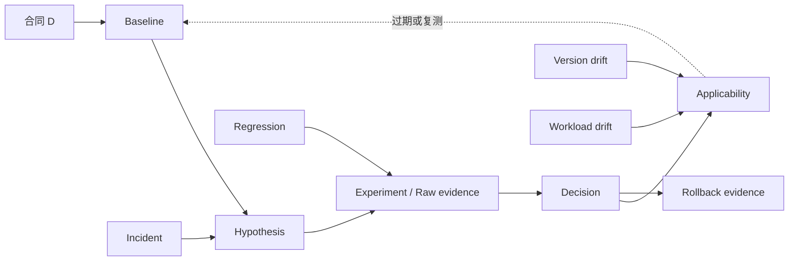

## 📑 目录
- [1. 问题：一次正确决定为什么会过期](#1-问题一次正确决定为什么会过期)
- [2. 统一治理合同](#2-统一治理合同)
- [3. 方法：把结论变成知识单元](#3-方法把结论变成知识单元)
- [4. Baseline：保留可重算的参照](#4-baseline保留可重算的参照)
- [5. Raw evidence：把观察与解释分开](#5-raw-evidence把观察与解释分开)
- [6. Decision record：记录选择与未选择](#6-decision-record记录选择与未选择)
- [7. Failure hypothesis：让失败继续产生价值](#7-failure-hypothesis让失败继续产生价值)
- [8. Applicability：为结论画出边界](#8-applicability为结论画出边界)
- [9. Regression：用固定合同发现回归](#9-regression用固定合同发现回归)
- [10. Incident：用反例更新瓶颈树](#10-incident用反例更新瓶颈树)
- [11. Version 与 workload drift](#11-version-与-workload-drift)
- [12. Rollback：把恢复能力沉淀为证据](#12-rollback把恢复能力沉淀为证据)
- [13. 统一算例：C1 的知识如何演化](#13-统一算例c1-的知识如何演化)
- [14. 迁移到 SGLang](#14-迁移到-sglang)
- [15. 代价、误区与适用边界](#15-代价误区与适用边界)
- [总结](#总结)
- [自我检验](#自我检验)
- [参考资料](#参考资料)

---

## 1. 问题：一次正确决定为什么会过期
模块四前面的章节解释了推理时间、显存、运行时、量化、投机、并行、P/D、服务语义、测量与生产承载。
第 11.1 节把症状变成可证伪瓶颈假设。
第 11.2 节解释候选组合为何产生资源竞争、顺序效应与瓶颈迁移。
第 11.3 节用同一候选完成合同、基线、实验、验收、Canary 和回退闭环。
但一次通过验收的决定不是永久事实。
引擎版本会改变默认调度和 Kernel。
模型或模板会改变质量与缓存身份。
长度、到达和前缀分布会改变主导瓶颈。
事故会暴露实验中没有覆盖的状态或故障路径。
因此持续治理的目标不是追逐新技术，而是持续回答：
> 旧结论在什么条件下仍然有效，新证据应怎样修改它？
“持续学习”在本节中指系统更新证据和适用边界。
它不是学习日程、资料清单或定期尝试所有新参数。
## 2. 统一治理合同
### 2.1 五维合同保持不变
所有知识资产都必须引用：
$$
\mathcal D=(W,Q,S,K,R)
$$
$W$ 决定请求形状、到达、前缀和缓存温度。
$Q$ 决定模型、Tokenizer、模板、采样、任务质量和协议正确性。
$S$ 决定 TTFT、TPOT、E2E 的逐请求门槛，以及 offered logical request、硬 cohort 和窗口上的聚合联合达标率。
$K$ 决定 GPU、CPU、内存、网络、存储、能耗、可观测性与运维的成本分子、合格产出分母和预算。
$R$ 决定过载、故障、状态和回退语义。
没有合同的性能数字不能进入知识库。
### 2.2 统一案例坐标
案例模型仍是同一份 8B 指令模型。
硬件上限仍是单节点 4 张 80 GiB GPU，节点内高速互联。
长度联合分布仍为：
- 60%：$(1024,128)$；
- 30%：$(4096,256)$；
- 10%：$(8192,512)$。
40% 请求精确共享前 768 个 Token。
冷、热缓存证据分别保存。
到达过程仍是开环 Poisson，负载点是 $1,2,4,6$ request/s。
每分钟一次、持续 5 秒的两倍突发仍属于合同。
质量门仍是：
- 任务分数相对 $B_0$ 下降不超过 0.5 个百分点；
- JSON 有效率不低于 99.9%；
- 解码语义不得静默改变。
请求 SLO 仍是：
$$
TTFT\le500\,\mathrm{ms},\quad
TPOT\le40\,\mathrm{ms},\quad
E2E\le25\,\mathrm{s}
$$
令 \(\mathcal B_D\) 覆盖四个负载点 × 冷/热缓存 × 稳态/重复突发，并在每格检查总体及三个长度桶。
按可信入口到达归属请求，拒绝、错误、超时和取消均为 bad event；每个 \(b\in\mathcal B_D\) 都要求 \(A_b=N_{\mathrm{good},b}/N_{\mathrm{offered},b}\ge S_D=99\%\)。
完整成本除以合格产出后，统一案例要求 \(K_{\mathrm{good}}\le K_{\mathrm{budget}}=K_{\mathrm{good}}(B_0)\)。
可靠性仍要求显式过载行为、不复用错误状态并能回到基线语义。
### 2.3 Baseline B0
$B_0$ 仍是 BF16、单 GPU、单副本、Paged KV 与 Continuous Batching。
$B_0$ 关闭量化、Prefix Cache、投机解码、跨卡并行和 P/D 解耦。
它是后续回归、事故和迁移的共同参照，不因某个候选通过就被删除。
通过的候选可以形成新的运营参照，但不能覆盖 $B_0$ 的原始证据身份。
## 3. 方法：把结论变成知识单元
### 3.1 最小知识单元
一次可复用的知识不是一句“Prefix Cache 有效”。
它应表示为：
$$
\mathcal K=
(\mathcal D,B,E,H,A,D_c,F,L,R_b)
$$
其中：
- $B$：可重算的 Baseline；
- $E$：原始证据与派生结果；
- $H$：被验证的主假设；
- $A$：替代解释；
- $D_c$：接受、回退、未决或无效的决定；
- $F$：失败假设与反例；
- $L$：适用范围和失效条件；
- $R_b$：回退前提、结果与恢复证据。
任何一项缺失，复用价值都会下降。
### 3.2 知识图而不是答案表

新证据不一定替换旧结论。
它也可能把一个宽泛结论拆成多个条件化结论。
### 3.3 三种更新
治理更新只有三种基本动作：
1. **强化**：新证据在相同边界内重复支持结论；
2. **收窄**：发现只在部分长度、负载或缓存条件成立；
3. **作废**：关键合同或实现变化后，旧证据不再能裁决当前问题。
“作废”不等于删除。
过期结论仍可解释历史决定和生成新假设。
## 4. Baseline：保留可重算的参照
### 4.1 Baseline 资产
$B_0$ 至少绑定：
- 五维合同版本；
- 模型、Tokenizer、模板和采样身份；
- 引擎版本与默认值快照；
- 4×80 GiB 硬件与拓扑身份；
- 三类长度、前缀和到达 Trace；
- 四个负载点与两倍突发标记；
- 冷、热状态定义；
- 原始逐请求与资源证据；
- 派生质量、SLO、Goodput、成本与可靠性结果。
Baseline 不是截图，也不是一组手工抄录的 P95。
它必须支持重新计算。
### 4.2 为什么保留原始粒度
若只保存总体平均值，后来无法回答：
- 回归是否只发生在 $(8192,512)$ 桶；
- 6 request/s 是否跨越新稳定边界；
- 突发是否放大 Queue；
- 热缓存是否掩盖冷启动；
- JSON 失败是否集中于某类请求。
原始粒度是未来提出新问题的选择权。
### 4.3 Baseline 的身份与继承
设 $B_t$ 是时刻 $t$ 的运营参照。
它可以由已接受候选形成，但应保留继承关系：
$$
B_0\rightarrow B_1\rightarrow\cdots\rightarrow B_t
$$
每条边都引用产生变化的假设、实验、验收和回退。
不能只保留最新配置而丢失为什么改变。
## 5. Raw evidence：把观察与解释分开
### 5.1 原始证据与派生证据
原始证据是请求事件、时间戳、长度、状态、资源计数和错误事实。
派生证据是 TTFT、TPOT、P99、Goodput、命中率和单位成本。
结论是“机制是否被支持”。
三者必须分层：
$$
\text{raw}\xrightarrow{\text{definition/version}}\text{derived}
\xrightarrow{\text{reasoning}}\text{decision}
$$
若指标定义变化，可以用相同 raw evidence 重算。
若只有截图，定义变化会让历史不可比较。
### 5.2 最小可追溯字段
每条证据至少能关联：
- 请求与观察窗口；
- 候选和 Baseline 身份；
- 长度、负载、前缀、冷热与突发条件；
- 入口、Queue、Runtime、GPU、Network 阶段；
- 质量、错误、拒绝、取消与状态结果；
- 生成派生指标的定义版本。
这不是工具要求，而是因果追溯要求。
### 5.3 完整性校验
连续观察窗必须把窗口起止时的存量写入守恒关系。
设 \(N_{\mathrm{pending}}\) 是尚未得到 admission 决定的请求，则：
$$
N_{\mathrm{pending,start}}+N_{\mathrm{arrived}}
=
N_{\mathrm{accepted}}+N_{\mathrm{rejected}}+N_{\mathrm{pending,end}}
$$
对已经接受的请求：
$$
N_{\mathrm{inflight,start}}+N_{\mathrm{accepted}}
=
N_{\mathrm{completed}}+N_{\mathrm{failed}}
+N_{\mathrm{cancelled}}+N_{\mathrm{inflight,end}}
$$
所有项必须使用同一逻辑请求或 backend attempt 口径、同一事件时间窗口；若改用 arrival cohort，则必须等待该 cohort 到达终态，并单独保留窗口结束时尚未终结的状态。
若计数不闭合，Goodput 和成本分母都不可信。
## 6. Decision record：记录选择与未选择
### 6.1 决策记录回答七个问题
一份决策记录应明确：
1. 哪个五维合同触发了决定；
2. 哪个症状和瓶颈假设被评估；
3. 比较的是哪两个不可变身份；
4. 哪些原始证据支持或反对主假设；
5. 哪些硬门通过或失败；
6. 为什么接受、回退或保持未决；
7. 结论何时失效、如何回到上一状态。
### 6.2 记录未选择项
未选择量化、Spec、并行或 P/D 也应有理由。
合格理由是“当前证据不指向它改变的瓶颈”。
不合格理由是“团队更熟悉另一个方案”或“某技术通常更快”。
未选择记录能阻止未来重复讨论已被证伪的分支。
### 6.3 决定不是事实删除器
候选被接受，不会删除反向证据。
候选被回退，也不会把所有局部收益归零。
例如 $C_1$ 可能降低 Prefill，却因 KV 压力导致 6 request/s 的 P99 失败。
记录应同时保留两件事，避免把“局部机制成立”和“系统验收失败”混为一谈。
## 7. Failure hypothesis：让失败继续产生价值
### 7.1 失败假设的结构
失败实验应沉淀：
- 原主假设；
- 首个违反的硬门；
- 能解释失败的机制候选；
- 已排除与未排除的替代解释；
- 反例所在的长度、负载、温度和突发条件；
- 若条件变化，什么证据值得重新打开该分支。
失败不是“参数不好”。
它是对适用边界的一次测量。
### 7.2 区分三类失败
**机制失败**：预期中介量没有变化，例如命中后并未减少 Prefill。
**系统失败**：局部机制成立，但质量、SLO、成本或可靠性不接受。
**实验失败**：控制变量、候选身份或证据完整性被破坏。
三类失败的后续动作不同。
机制失败应修改因果假设。
系统失败应记录瓶颈迁移或权衡。
实验失败不支持任何技术结论。
### 7.3 失败的可复用表达
合格表达：
> 在当前 8B、$B_0$ 和 6 request/s 热缓存条件下，Prefix 命中减少了 Prefill，但 KV 驻留使 TPOT 门失败；结论不外推到低负载。
不合格表达：
> Prefix Cache 不好用。
前者能被未来证据更新，后者不能。
## 8. Applicability：为结论画出边界
### 8.1 适用域
把结论的适用域写为：
$$
\Omega=
\Omega_{\mathrm{model}}\times
\Omega_{\mathrm{engine}}\times
\Omega_{\mathrm{hardware}}\times
\Omega_{\mathrm{workload}}\times
\Omega_{\mathrm{contract}}
$$
只有当前条件落在 $\Omega$ 内，历史结论才可作为直接证据。
### 8.2 失效条件
典型失效条件包括：
- 模型、Tokenizer 或 Chat Template 变化；
- 引擎版本、默认值或 Kernel 路径变化；
- GPU、驱动或拓扑变化；
- 长度分布、到达或突发形状变化；
- 前缀复用率或缓存温度变化；
- Tool、结构化输出或多模态比例变化；
- SLO、成本预算或可靠性目标变化。
失效条件是复测触发器，不是日历提醒。
### 8.3 结论强度
可把结论分为：
- **点结论**：只在一个固定负载点成立；
- **分桶结论**：在某长度或温度组成立；
- **曲线结论**：在多个负载点观察到一致机制；
- **迁移结论**：更换实现后仍由相同因果证据支持。
结论强度来自覆盖范围，不来自措辞自信。

## 9. Regression：用固定合同发现回归
### 9.1 回归问题
回归不是问“新版本快不快”。
它问：
> 在未改变目标合同的前提下，哪些已有不变量、曲线或故障边界发生了变化？
### 9.2 回归哨兵
统一案例的最小哨兵覆盖：
- 三个长度桶；
- $1,2,4,6$ request/s；
- 冷、热缓存；
- 每分钟一次持续 5 秒的两倍突发；
- 任务分数、JSON 与解码语义；
- TTFT、TPOT、E2E 与 Goodput；
- OOM、拒绝、错误状态与回退。
它不是工具清单，而是合同覆盖面。
### 9.3 差异表达
对越小越好的指标 $Y$，可记录相对差异：
$$
\delta_Y=\frac{Y_{\mathrm{new}}-Y_{\mathrm{ref}}}{Y_{\mathrm{ref}}}
$$
但是否回归仍由硬门和重复不确定性决定。
相对差异不能替代 500 ms、40 ms 与 25 s 的绝对门。
### 9.4 回归后的更新
若只在长输入突发组回归，应收窄到该条件并重走 11.1。
若质量失败，应停止性能解释并检查候选身份。
若所有门仍通过但成本上升，应更新成本权衡，而不是称为“无回归”。
## 10. Incident：用反例更新瓶颈树
### 10.1 事故是自然实验，但有偏差
事故提供真实极端条件，却通常没有完美对照。
因此事故证据先生成或修正假设，不能自动证明因果。
### 10.2 从事故反推
复盘应沿相同五层：
```text
用户症状
  → 入口请求与重试
    → Queue 与准入
      → Runtime 状态与调度
        → GPU 时间/空间
          → Network 传输与同步
```
事故暴露的新叶子应包含支持证据、反证条件和替代解释。
### 10.3 事故如何修改知识
事故可能产生四类更新：
- 新增此前未知的失败假设；
- 把适用域从“所有负载”收窄到稳定区间；
- 提升某个可靠性门为硬门；
- 证明原回退不完整，需要修改状态边界。
复盘若只记录“调大容量”，没有更新知识单元，就会重复付费。
## 11. Version 与 workload drift
### 11.1 Version drift
版本漂移包括显式升级，也包括默认值、依赖和 Kernel 选择变化。
版本变化后，先问哪些因果边可能改变：
- 相同参数是否仍有相同语义；
- 相同 Shape 是否走相同 Kernel；
- KV 布局和缓存键是否兼容；
- 调度与 Batch 默认值是否变化；
- 指标定义和错误路径是否变化。
若关键边变化，旧结果只能作为历史先验。
### 11.2 Workload drift
统一长度分布的期望输入为：
$$
\mathbb E[L_{\mathrm{in}}]=2662.4
$$
期望最大输出为：
$$
\mathbb E[L_{\mathrm{out,max}}]=204.8
$$
均值相同并不代表分布相同。
例如把 10% 的长请求拆成更多中请求，Queue 和 Prefix 行为可能完全不同。
所以漂移应比较联合分布、到达突发、前缀复用和服务特性，而不只比较均值。
### 11.3 漂移触发重评
当当前条件越出 $\Omega$，知识状态变为“需要重评”。
重评不意味着从零开始。
可以复用合同、原始证据结构、失败假设和最有区分力的实验。
不能复用的是未经验证的性能结论。
## 12. Rollback：把恢复能力沉淀为证据
### 12.1 回退记录
每次回退都应回答：
- 哪个硬门触发；
- 回到了哪个 Baseline 身份；
- 候选状态是否被隔离或失效；
- 未完成请求如何结束；
- 质量、SLO 与错误语义是否恢复；
- 恢复花费的时间和资源；
- 哪些证据在回退中丢失。
### 12.2 回退也会漂移
模型格式、缓存身份、Connector 或路由语义变化后，旧回退路径可能失效。
所以回退能力也有适用域和版本身份。
“曾经回退成功”不能证明当前候选仍可回退。
### 12.3 回退反哺设计
若一次回退必须同时恢复多个不可分状态，说明组合的回退单元比预期更大。
这会提高 $K$ 和 $R$ 的代价，并可能改变后续是否接受该组合。
## 13. 统一算例：C1 的知识如何演化
### 13.1 初始决定
沿用 11.3 的同一候选：
$$
C_1=B_0+\text{Prefix Cache}
$$
初始假设是：在 40% 精确共享 768 Token 的热缓存条件下，$C_1$ 跳过重复 Prefill，提高 SLO 内 Goodput。
假设实验通过全部硬门，于是决定状态为“接受于当前 $\Omega_0$”。
这里的“通过”是教学分支，不代表真实测量已经发生。
### 13.2 回归证据
某引擎版本变化后，回归只出现在 6 request/s 的两倍突发窗口。
Prefill 仍减少，但 Queue 与 KV 驱逐上升。
知识更新不是“新版 Prefix Cache 失效”。
更准确的更新是：
- 原 Prefill 机制仍被支持；
- 系统收益边界从全曲线收窄到较低负载；
- 新失败假设指向驱逐与调度交互；
- 版本变化使 $\Omega_0$ 过期。
### 13.3 事故证据
若事故发现不同模板错误共享 KV，质量和可靠性硬门失败。
此时历史性能收益仍可保留，但候选整体必须回退。
决策记录新增：
- 缓存身份不完整的失败假设；
- 模板摘要属于不可省略的状态键；
- 回退必须让旧 KV 失效；
- 修正后的候选是新身份，不再是原 $C_1$。
### 13.4 Workload 漂移
若共享前缀比例从 40% 大幅变化，旧收益不能直接外推。
治理动作是重新测量冷、热和真实复用组。
不是把历史命中率当作新流量事实。
这个算例说明知识会强化、收窄或作废，但始终保留证据链。
## 14. 迁移到 SGLang
### 14.1 迁移什么，不迁移什么
迁移到 SGLang 时，首先迁移问题和合同：
- 同一 8B 模型、Tokenizer、模板与采样语义；
- 同一 4×80 GiB 硬件上限与可比拓扑；
- 同一长度、前缀、到达和突发分布；
- 同一质量、SLO、成本与可靠性门；
- 同一原始证据粒度和决定逻辑。
不直接迁移 vLLM 的参数值、类名、默认值或缓存实现假设。
### 14.2 保留 B0，建立引擎内参照
$B_0$ 继续作为 vLLM 的历史业务参照。
SGLang 需要建立自己的最小实现参照 $S_0$。
$S_0$ 不是用来替换或改写 $B_0$。
它用于区分两类问题：
1. SGLang 内部某机制相对自己的参照是否有效；
2. 满足同一 $\mathcal D$ 时，$S_0$ 与 $B_0$ 的系统结果如何比较。
若直接复制 vLLM 参数到 SGLang，比较会混入不合理配置偏差。
### 14.3 概念映射
迁移按问题映射：
| 通用问题 | vLLM 证据对象 | SGLang 需要寻找的等价证据 |
|---|---|---|
| 请求在哪里等待 | Scheduler、waiting、queue time | SRT 调度路径与队列 |
| KV 怎样分配与复用 | Paged KV、Prefix Cache | KV 管理、RadixAttention/HiCache 路径 |
| Batch 怎样形成 | Continuous Batching 与 Token Budget | 对应调度批次与预算语义 |
| GPU 是否有空洞 | Worker/ModelRunner 时间线 | Model Worker 与 CPU-GPU overlap |
| 状态怎样失效 | Cache identity 与回退 | Radix/KV 状态身份与清理边界 |
| 网络何时进入关键路径 | TP、P/D 与 Connector | SGLang 对应并行和传输路径 |
表中名称只是当前概念坐标，具体实现应绑定所评估版本。
### 14.4 公平比较
公平不等于参数数值相同。
公平要求两边：
- 使用同一 $\mathcal D$；
- 分别建立可解释的引擎内 Baseline；
- 分别验证机制中介量；
- 使用同一质量与请求门；
- 计算同口径 Goodput 与单位合格成本；
- 分别验证错误状态与回退。
比较结果可以是 SGLang 更好、vLLM 更好、分桶各有优势或证据不足。
### 14.5 迁移算例
若要比较前缀复用，先让 $S_0$ 满足与 $B_0$ 相同的服务语义。
然后在 SGLang 内提出候选 $S_1$：启用对应的前缀状态复用机制。
仍使用 40% 精确共享 768 Token、冷/热条件和四个负载点。
先验证 $S_1-S_0$ 的中介量，再比较 $S_1$ 与已接受的 vLLM 候选。
不能因为 RadixAttention 与 Prefix Cache 都涉及前缀，就假定命中、容量或失效语义相同。
### 14.6 迁移后的知识更新
跨框架结果应记录：
- 哪些因果链保持；
- 哪些实现差异导致新瓶颈；
- 哪些参数不可映射；
- 哪些故障与回退状态新增；
- 结论适用于哪个 SGLang 版本；
- 与 $B_0$ 比较时有哪些不可消除的差异。
迁移成功的标准是判断方法仍可审计，而不是新框架必须更快。
## 15. 代价、误区与适用边界
### 15.1 治理代价
保留原始证据需要存储、隐私控制和定义版本。
维护 Baseline 继承关系需要额外记录。
回归、事故与漂移会生成相互重叠的结论。
跨框架比较还会增加实现差异的解释成本。
这些代价应与重复实验、错误外推和不可回退事故的成本比较。
### 15.2 常见误区
- 只保留最新配置，不保留基线与改变原因；
- 只保存聚合截图，无法按新问题重算；
- 只记录成功，不记录失败假设；
- 把事故处置写成永久最佳实践；
- 用固定日历代替漂移触发；
- 版本改变后仍沿用旧性能数字；
- 只比较平均长度，不比较联合分布；
- 把 SGLang 与 vLLM 参数强行一一对应；
- 把持续治理写成工具或资料清单。
### 15.3 适用边界
本方法依赖可识别的候选身份、可重算证据和明确合同。
无法保留请求级数据时，可以使用合规聚合，但结论粒度必须相应收窄。
外部公开 Benchmark 可以生成假设，不能替代当前 $\mathcal D$ 的证据。
治理不会消除不确定性；它让不确定性、失效条件和更新理由可见。
## 总结
模块四最终沉淀的不是一组静态调优答案，而是一套可更新的决策知识。
每个结论都绑定 $\mathcal D$、$B_0$、原始证据、主假设、失败假设、决定、适用域和回退结果。
Regression、Incident、Version drift 与 Workload drift 负责强化、收窄或作废旧结论。
迁移到 SGLang 时复用问题、合同和证据逻辑，不复制参数答案。

## 自我检验
- [ ] 我能复述统一的 8B、4×80 GiB、长度、复用、流量、SLO、质量和 $B_0$
- [ ] 每个结论都能追溯到五维合同与原始证据
- [ ] Baseline 支持按新定义和新分桶重算
- [ ] 决策记录包含未选择项和替代解释
- [ ] 失败被区分为机制、系统或实验失败
- [ ] 结论有明确适用域与失效条件
- [ ] 回归覆盖质量、SLO、成本和可靠性，而不只覆盖速度
- [ ] 事故会更新瓶颈树、适用域或回退边界
- [ ] Version 与 Workload drift 会触发重评
- [ ] 迁移 SGLang 时不强行复制 vLLM 参数
- [ ] 我接受迁移结果为“证据不足”

## 参考资料
- [本章总览：推理优化选型与端到端实战](./第11章-推理优化选型与端到端实战.md)
- [11.1：优化选型决策树](./11.1-优化选型决策树.md)
- [11.2：优化组合注意事项](./11.2-优化组合注意事项.md)
- [11.3：端到端部署实战](./11.3-端到端部署实战.md)
- [第 12 章：深入 SGLang](/AIInfraGuide/inference/模块四-推理优化/第12章-深入sglang/第12章-深入sglang)
- [vLLM Documentation](https://docs.vllm.ai/)
- [SGLang Documentation](https://docs.sglang.ai/)
- [MLPerf Inference](https://docs.mlcommons.org/inference/)
- [Google SRE：Postmortem Culture](https://sre.google/sre-book/postmortem-culture/)
- [NIST Engineering Statistics Handbook](https://www.itl.nist.gov/div898/handbook/)
