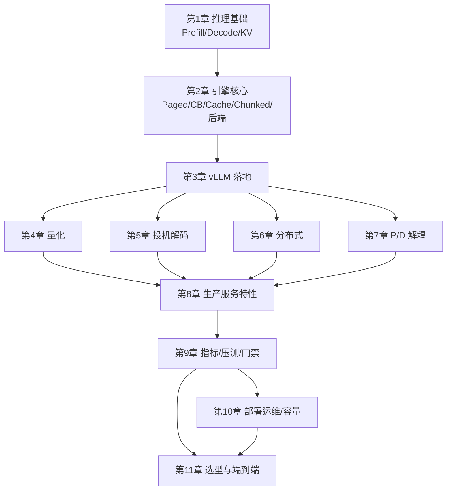

第 1–10 章加上 [11.1](./11.1-优化选型决策树.md)–[11.3](./11.3-端到端部署实战.md)，已经覆盖「诊断 → 组合 → 上线剧本」。这一节不塞新特技：把知识收成五层地图与 trade-off 表，给出**可复印的检查清单**，并指向可持续维护的入口（论文、引擎 Release、内部基线）。推理栈迭代快，清单比口号耐用。

<!-- more -->

## 📑 目录

- [1. 五层知识地图](#1-五层知识地图)
- [2. 核心 trade-off 表](#2-核心-trade-off-表)
- [3. 可复用检查清单](#3-可复用检查清单)
- [4. 持续学习入口（可执行）](#4-持续学习入口可执行)
- [5. 两周实践课题（选题即开工）](#5-两周实践课题选题即开工)
- [6. 能力验收标准](#6-能力验收标准)
- [总结](#-总结)
- [自我检验清单](#-自我检验清单)
- [参考资料](#-参考资料)

---

## 1. 五层知识地图

| 层 | 回答的问题 | 代表章节 |
|---|---|---|
| 物理层 | 算力、带宽、显存账本 | [1.x](../第1章-LLM推理基础/1.1-LLM推理基础.md) |
| 引擎层 | 分页、批处理、缓存、调度 | [2.x](../第2章-推理引擎核心技术/2.1-PagedAttention.md)–[3.x](../第3章-深入vLLM/3.2-vLLM整体架构.md) |
| 加速层 | 量化、投机、并行、P/D | [4.x](../第4章-量化/4.6-量化选型与vLLM实战.md)–[7.x](../第7章-PD解耦架构/7.2-解耦架构设计.md) |
| 产品层 | 结构化、工具、LoRA、VLM、采样 | [8.x](../第8章-生产级服务特性/8.1-结构化输出.md) |
| 体系层 | 指标、门禁、K8s、安全、容量、选型 | [9.x](../第9章-性能分析与Benchmark/9.1-推理指标体系.md)–[11.x](./11.1-优化选型决策树.md) |

自测：随机抽一个名词（如 Chunked Prefill），用一句话说清——作用于哪一层、兑换了什么、验收看哪个指标。说不利索就回到对应章，而不是收藏更多链接。

📌 **关键点**：说不清层位与兑换，就还没真正理解该优化——上线时也写不出回退条件。

---

## 2. 核心 trade-off 表

| 维度 A | 维度 B | 典型技术 | 验收看什么 |
|---|---|---|---|
| 显存 | 质量 | 量化 | 探针 + 同负载吞吐（[4.6](../第4章-量化/4.6-量化选型与vLLM实战.md)） |
| 吞吐 | 延迟百分位 | 大 batch / 高并发 | Goodput，非裸 QPS（[9.1](../第9章-性能分析与Benchmark/9.1-推理指标体系.md)） |
| TTFT | 路由/缓存复杂度 | Prefix Cache | 命中率与 TTFT P95（[2.3](../第2章-推理引擎核心技术/2.3-Prefix%20Cache%20与%20RadixAttention.md)、[10.3](../第10章-生产部署与运维/10.3-自动扩缩容与负载均衡.md)） |
| TPOT | 额外算力 | Speculative Decoding | 接受率 + 端到端（[5.4](../第5章-Speculative-Decoding/5.4-收益边界与限制.md)） |
| 尾延迟 | 运维复杂度 | P/D 解耦 | P99 与配比/传输（[7.5](../第7章-PD解耦架构/7.5-解耦挑战与配比.md)） |
| 单卡密度 | 通信 | TP/PP/EP | TPOT 是否被通信拖垮（[6.1](../第6章-分布式推理/6.1-推理并行策略总览.md)） |
| 密度 | 隔离 | Multi-LoRA 共享 | 租户干扰与槽位显存（[8.3](../第8章-生产级服务特性/8.3-Multi-LoRA服务.md)） |
| 成本 | 体验 | 容量冗余 $R$ | SLO 越严 $R$ 越大（[10.4](../第10章-生产部署与运维/10.4-容量规划.md)） |
| 安全便利 | 风险 | 默认无认证 API | 网关强制加固（[10.3](../第10章-生产部署与运维/10.3-自动扩缩容与负载均衡.md)） |

🔑 **核心概念**：推理优化是**受约束兑换**。工程水平体现在换得明白、回得回去。

方法论六条（比记 flag 默认值长久）：

1. 先诊断症状，再选技术（[11.1](./11.1-优化选型决策树.md)）  
2. 按 OOM→TTFT→TPOT→尾延迟推进（[11.2](./11.2-优化组合注意事项.md)）  
3. 用同负载百分位验收（[9.1](../第9章-性能分析与Benchmark/9.1-推理指标体系.md)–[9.2](../第9章-性能分析与Benchmark/9.2-压测工具.md)）  
4. 组合做对照，防负协同（[11.2](./11.2-优化组合注意事项.md)）  
5. 生产补齐观测、安全、容量（[10.x](../第10章-生产部署与运维/10.2-可观测性.md)）  
6. 门禁守护回归；定位用 bisect + Nsight（[9.5](../第9章-性能分析与Benchmark/9.5-性能回归门禁.md)、[9.3](../第9章-性能分析与Benchmark/9.3-性能分析工具.md)）  

---

## 3. 可复用检查清单

复印即用；合入/发布前逐项勾选。细节指向专章，不在此重复展开。

### 3.1 变更前（诊断）

- [ ] 唯一主诉已写：TTFT / TPOT / OOM / P99 / 成本  
- [ ] 负载形状：输入输出分布、前缀复用、是否 VLM/工具  
- [ ] SLO 数字与质量阈值已文档化  
- [ ] B0 可运行且同源指标可查（[11.3](./11.3-端到端部署实战.md)）  

### 3.2 变更中（一刀）

- [ ] 只合并一个 Δ；「不做清单」已写  
- [ ] 若量化：格式与硬件世代匹配，权重与 `quantization` 一致（[4.6](../第4章-量化/4.6-量化选型与vLLM实战.md)）  
- [ ] 若投机：接受率纳入记录（[5.5](../第5章-Speculative-Decoding/5.5-vLLM投机解码实战.md)）  
- [ ] 若缓存：路由亲和成对交付（[10.3](../第10章-生产部署与运维/10.3-自动扩缩容与负载均衡.md)）  
- [ ] 若 P/D：传输与配比监控已接（[7.3](../第7章-PD解耦架构/7.3-KV-Cache传输与Connector.md)、[7.5](../第7章-PD解耦架构/7.5-解耦挑战与配比.md)）  
- [ ] 若并行：先单卡过线再抬 TP（[6.6](../第6章-分布式推理/6.6-vLLM分布式部署实战.md)）  

### 3.3 验收（同负载）

- [ ] 微观 / 饱和 / 业务混合三层压测完成（[9.2](../第9章-性能分析与Benchmark/9.2-压测工具.md)）  
- [ ] 主攻指标达线；守门百分位与错误率未破  
- [ ] 质量探针（含工具/结构化路径若适用）过线  
- [ ] $Q^{*}$ 已更新，容量表重填（[10.4](../第10章-生产部署与运维/10.4-容量规划.md)）  
- [ ] 门禁基线包已冻结（[9.5](../第9章-性能分析与Benchmark/9.5-性能回归门禁.md)）  

### 3.4 发布（生产）

- [ ] 镜像 digest + 权重校验和  
- [ ] 网关 TLS / API Key / 限流（禁止引擎公网裸奔）  
- [ ] 告警 `for` 与手册就绪（[10.2](../第10章-生产部署与运维/10.2-可观测性.md)）  
- [ ] 滚动 Ready 折损计入冗余；冷启动长则预热（[10.1](../第10章-生产部署与运维/10.1-容器化与Kubernetes部署.md)）  
- [ ] 回滚扳机与演练记录可链接  
- [ ] on-call 知悉主诉、Δ 内容与回退路径  

缺项不要用「先上线再补」糊弄——补观测的成本通常低于一次误判扩容或一次无法回滚的灰度。

---

## 4. 持续学习入口（可执行）

不列「保持好奇心」类空话；下列入口可直接订阅或排期。

### 4.1 论文与基准

| 入口 | 做什么 | 频率建议 |
|---|---|---|
| MLSys / OSDI / SOSP / NeurIPS 系统轨 | 跟 PagedAttention、speculative、disaggregation、KV 管理 | 会期前后各扫一轮 |
| [MLCommons MLPerf](https://mlcommons.org/) | 读规则更新与提交分析，不当施工图（[9.4](../第9章-性能分析与Benchmark/9.4-权威基准.md)） | 每季度 |
| 关键词雷达 | `KV cache`、`speculative decoding`、`prefill decode disaggregation` | 每月检索一次 |

### 4.2 引擎与工程

| 入口 | 做什么 |
|---|---|
| [vLLM](https://github.com/vllm-project/vllm) Release Notes / 设计讨论 | 记「行为变更」到内部兼容表 |
| SGLang / TensorRT-LLM 发布说明 | 横向对照能力边界（[3.6](../第3章-深入vLLM/3.6-框架横向对比.md)） |
| 开源贡献 | 复现 benchmark、修文档、补小 bug；附复现脚本 |

### 4.3 团队内基线（最重要）

- 维护冻结基线包：镜像 digest、配置、负载脚本、门禁阈值  
- 每次事故一页：症状、指标截图、根因、防再发、是否更新清单  
- 配置变更必须附压测链接（与 [9.5](../第9章-性能分析与Benchmark/9.5-性能回归门禁.md) 同一纪律）  
- 采样参数、Schema、LoRA 映射与引擎 flag **同一版本面**管理  

💡 **提示**：每周固定半天做**单变量**实验，比碎片化刷资讯更能校准直觉。

| 频率 | 动作 |
|---|---|
| 每周 | 读 1 篇引擎 Release Note 或设计文档 |
| 每月 | 复现/更新内部基线，校准 $Q^{*}$ |
| 每季度 | 对照 MLPerf/社区趋势，刷新技术短名单 |
| 持续 | 参与真实 on-call 或压测值班至少一次/季 |

---

## 5. 两周实践课题（选题即开工）

任选其一，输出必须含：主诉、Δ、同负载数字、回退条件。

1. 用真实业务 trace 画饱和曲线，算出 $Q^{*}$ 与 GPU 预算（[9.2](../第9章-性能分析与Benchmark/9.2-压测工具.md)、[10.4](../第10章-生产部署与运维/10.4-容量规划.md)）  
2. 打开 Prefix Cache + 前缀路由，量化 TTFT 与命中率收益（[2.3](../第2章-推理引擎核心技术/2.3-Prefix%20Cache%20与%20RadixAttention.md)、[10.3](../第10章-生产部署与运维/10.3-自动扩缩容与负载均衡.md)）  
3. 给 Tool Calling 代理加结构化参数约束与安全白名单（[8.1](../第8章-生产级服务特性/8.1-结构化输出.md)、[8.2](../第8章-生产级服务特性/8.2-Tool-Calling与Reasoning-Parser.md)）  
4. 做人造回归 → 门禁捕获 → bisect → nsys（[9.5](../第9章-性能分析与Benchmark/9.5-性能回归门禁.md)、[9.3](../第9章-性能分析与Benchmark/9.3-性能分析工具.md)）  
5. 用重 Prefill 流量评估是否值得上 P/D（[7.1](../第7章-PD解耦架构/7.1-混合Batching的问题.md)、[7.6](../第7章-PD解耦架构/7.6-vLLM-Disaggregated-Prefill实战.md)）  

⚠️ **注意**：演示环境也走鉴权；临时端口裸奔会变成生产习惯。

---

## 6. 能力验收标准

完成模块四后，应能在评审里用四句话讲清一次变更：

1. **主症状**是什么（指标 + 负载前提）  
2. **兑换**是什么（用哪项技术换哪项资源）  
3. **证明**是什么（哪些百分位 / Goodput / 探针）  
4. **回滚**是什么（撤哪一刀、扳机阈值）  

缺任一句，变更不应合并。Code Review 口头禅可以更短：**没有症状、兑换、证明与回滚，就不合「感觉更快」的配置。**

---

## 📝 总结

- 模块四覆盖物理→引擎→加速→产品→体系五层；技术要放回层位与兑换中理解。
- trade-off 表把显存、延迟、吞吐、复杂度写成显式交换；验收指标写在同一行。
- 带走可复印检查清单（诊断 / 一刀 / 验收 / 发布）与六条方法论，而不是某个默认 flag。
- 持续学习入口是论文会期、引擎 Release、MLPerf 规则与**内部基线维护**；实践课题必须产出可回滚的数字。

## 🎯 自我检验清单

- 能用五层结构复述模块地图，并给 Chunked Prefill / 投机 / P/D 各找一层
- 能默写至少六行核心 trade-off，并指出验收指标
- 能按清单走完一次假想发布，指出最容易漏的三项
- 能解释 Goodput 与裸吞吐的区别，以及为何组合验收要用前者
- 能列出每周/每月/每季度各一项具体学习动作
- 能向同事用一分钟讲清「症状—兑换—证明—回滚」

## 📚 参考资料

- [本模块 1.1 LLM 推理基础](../第1章-LLM推理基础/1.1-LLM推理基础.md)
- [本模块 4.6 量化选型与 vLLM 实战](../第4章-量化/4.6-量化选型与vLLM实战.md)
- [本模块 5.4 收益边界与限制](../第5章-Speculative-Decoding/5.4-收益边界与限制.md)
- [本模块 7.4 Goodput 与 SLO 感知调度](../第7章-PD解耦架构/7.4-Goodput与SLO感知调度.md)
- [本模块 9.1 推理指标体系](../第9章-性能分析与Benchmark/9.1-推理指标体系.md)
- [本模块 9.5 性能回归门禁](../第9章-性能分析与Benchmark/9.5-性能回归门禁.md)
- [本模块 10.4 容量规划](../第10章-生产部署与运维/10.4-容量规划.md)
- [本模块 11.1 优化选型决策树](./11.1-优化选型决策树.md)
- [本模块 11.2 优化组合注意事项](./11.2-优化组合注意事项.md)
- [本模块 11.3 端到端部署实战](./11.3-端到端部署实战.md)
- [vLLM 项目主页](https://github.com/vllm-project/vllm)
- [MLCommons MLPerf](https://mlcommons.org/)
