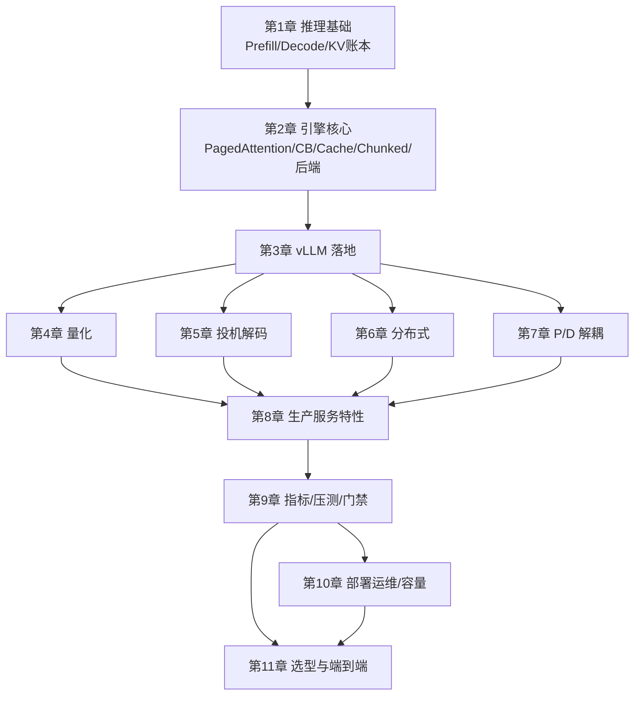

到这里，模块四从"什么是 Prefill/Decode"走到了"如何上线一台 vLLM 服务"。最后一节不塞新特技，而是把知识收成一张关联图、一张 trade-off 表，并给一条可持续的学习路径——因为推理栈的演进速度，只会比教材更快。

<!-- more -->

## 📑 目录

- [1. 模块知识关联图](#1-模块知识关联图)
- [2. 核心 trade-off 汇总](#2-核心-trade-off-汇总)
- [3. 你应该带走的方法论](#3-你应该带走的方法论)
- [4. 持续学习建议](#4-持续学习建议)
- [5. 下一步实践课题](#5-下一步实践课题)
- [6. 给读者的最后一句话](#6-给读者的最后一句话)
- [总结](#-总结)
- [自我检验清单](#-自我检验清单)
- [参考资料](#-参考资料)

---

## 1. 模块知识关联图

阅读记忆口诀：

- **物理层**：算力、带宽、显存账本
- **引擎层**：分页、批处理、缓存、调度
- **加速层**：量化、投机、并行、P/D
- **产品层**：结构化输出、工具、LoRA、VLM、采样
- **体系层**：指标、门禁、K8s、安全、容量、选型

自测方法：随机抽一个技术名词（如"Chunked Prefill"），用一句话说清它主要作用于哪一层、兑换了什么、验收看哪个指标。说不利索就回到对应章节重读。

📌 **关键点**：任一优化都能在这五层里找到位置；说不清位置，就还没真正理解它。

---

## 2. 核心 trade-off 汇总

| 维度 A | 维度 B | 典型技术 | 备注 |
|---|---|---|---|
| 显存 | 质量 | 量化 | 先定质量阈值 |
| 吞吐 | 延迟百分位 | 大 batch / 高并发 | 用 Goodput 仲裁 |
| TTFT | 实现复杂度 | Prefix Cache、路由亲和 | 命中率依赖流量 |
| TPOT | 额外算力 | Speculative Decoding | 接受率是生命线 |
| 尾延迟 | 运维复杂度 | P/D 解耦 | 适合重 Prefill 干扰 |
| 密度 | 隔离 | Multi-LoRA 共享 | 强租户拆副本 |
| 成本 | 体验 | 容量冗余 R | SLO 越严 R 越大 |
| 安全便利 | 风险 | 默认无认证 API | 网关强制加固 |

🔑 **核心概念**：推理优化的本质是**受约束兑换**。工程水平体现在"换得明明白白"。

---

## 3. 你应该带走的方法论

1. **先诊断症状，再选技术**（11.1）
2. **按 OOM→TTFT→TPOT→尾延迟推进**（11.2）
3. **用同负载百分位指标验收**（9.1～9.2）
4. **组合要做对照，防负协同**（11.2）
5. **生产补齐观测、安全、容量闭环**（10.x）
6. **门禁守护回归，bisect+Nsight 定位**（9.5）

这六条比记住某个 flag 默认值更长久——默认值会变，方法论仍在。

---

## 4. 持续学习建议

### 4.1 跟踪前沿

- 论文：MLSys、SOSP/OSDI、NeurIPS 系统轨；关键词 PagedAttention、speculative decoding、disaggregation、KV cache
- 工程：vLLM / SGLang / TensorRT-LLM 发布说明与设计文档
- 基准：MLPerf Inference 规则更新与提交分析

### 4.2 参与开源

- 从复现 benchmark、修文档、补小 bug 开始
- 阅读 Impactor PR：调度、KV、多模态路径
- 写清复现脚本，比空泛"想贡献"更有效

### 4.3 积累工程经验

- 维护内部冻结基线包与容量表
- 每次线上事故写一页：症状、指标、根因、防再发
- 建立"配置变更必须附压测链接"的团队习惯
- 把采样参数、结构化 Schema、LoRA 映射也纳入配置版本，而不是只版本化引擎 flag

💡 **提示**：每周固定半天做**受控实验**（只改一个变量），一年后你的直觉会远胜碎片化刷资讯。

### 4.4 推荐阅读节奏

| 频率 | 做什么 |
|---|---|
| 每周 | 读 1 篇引擎 Release Note 或设计文档 |
| 每月 | 复现/更新内部基线，校准 Q* |
| 每季度 | 对照 MLPerf/社区趋势，刷新短名单 |
| 持续 | 参与一次真实 on-call 或压测值班 |

---

## 5. 下一步实践课题

按难度任选：

1. 给真实业务 trace 画饱和曲线，算出 Q* 与 GPU 预算
2. 打开 Prefix Cache + 前缀路由，量化 TTFT 收益
3. 给 Tool Calling 代理加结构化参数约束与安全白名单
4. 做一次"人造回归 → 门禁捕获 → bisect → nsys"演练
5. 评估是否值得上 P/D：用重 Prefill 流量说话

⚠️ **注意**：实践时始终守住安全底线——演示环境也尽量走鉴权，避免临时端口裸奔成习惯。

---

## 6. 给读者的最后一句话

推理优化不是堆特性，而是**在约束下把用户体验与单位算力产出谈成一笔清楚的买卖**。当你能指出：

- 现在的主症状是什么
- 准备用哪一兑换改善它
- 用哪几个百分位证明成功
- 失败时如何回滚

——你就已经具备了模块四想培养的核心能力。其余的内核名与 flag，交给持续学习与工程前线即可。

也把这句话当作团队 Code Review 的口头禅：没有症状、兑换、证明与回滚，就不合并"感觉会更快"的配置。

---

## 📝 总结

- 模块四覆盖从推理基础到生产闭环的完整链条。
- 技术应放回物理/引擎/加速/产品/体系五层关联中理解。
- trade-off 表帮助你在显存、延迟、吞吐、复杂度之间显式兑换。
- 带走的是诊断—顺序—验收—门禁—观测方法论。
- 持续学习靠论文+开源+受控实验与事故复盘。
- 最终能力标准：说清症状、兑换、证明与回滚。

## 🎯 自我检验清单

- 能用五层结构复述模块知识地图
- 能默写至少六行核心 trade-off
- 能说出优化推进的四步顺序
- 能解释 Goodput 与裸吞吐的区别
- 能列出三条持续学习的具体行动
- 能为自己选一个两周内可完成的实践课题
- 能向同事用一分钟讲清"症状—兑换—证明—回滚"

## 📚 参考资料

- 本模块第 1～11 章正文与各节参考链接
- [vLLM 项目主页](https://github.com/vllm-project/vllm)
- [MLCommons MLPerf](https://mlcommons.org/)
- 系统会议与引擎 Release Notes（作为滚动更新源）
