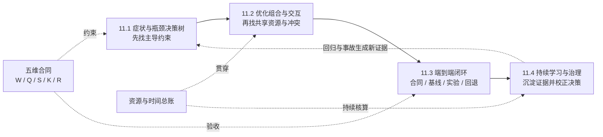

第 3～10 章分别给出了运行时、量化、投机解码、分布式、P/D 解耦、服务特性、测量与运维知识。本章把这些局部知识收束成一套可迁移的系统决策方法。它是 11.1～11.4 的**理论设计合同**，面向第一次负责 AI Infra 方案的读者；这里的“端到端”指从约束到证据、决策、验证和治理的因果闭环，不是部署命令或上线清单。

## 📑 本章导航
- [1. 本章定位：约束下的系统决策](#1-本章定位约束下的系统决策)
- [2. 决策起点：五维合同](#2-决策起点五维合同)
- [3. 一张知识图看完本章](#3-一张知识图看完本章)
- [4. 贯穿四节的统一案例](#4-贯穿四节的统一案例)
- [5. 资源与时间总账](#5-资源与时间总账)
- [6. 六条决策原则](#6-六条决策原则)
- [7. 四节边界与承诺](#7-四节边界与承诺)
- [8. 模块四怎样在此收束](#8-模块四怎样在此收束)
- [9. 学完应具备的能力](#9-学完应具备的能力)
- [总结](#总结)
- [自我检验](#自我检验)
- [参考资料](#参考资料)

---

## 1. 本章定位：约束下的系统决策
推理优化不是把“有效技术”尽量全部打开，而是在有限资源下选择一组能兑现业务合同、能解释因果并能安全回退的改变。同一个 INT4、Prefix Cache 或 Speculative Decoding，在不同输入长度、并发、硬件和质量约束下，可能是收益、无效工作，甚至回归。

因此，问题不应从“要不要启用某项技术”开始，而应改写为：
> 在固定合同下，当前证据指向哪个主导瓶颈；哪个最小改变最可能提高合格产出；它把代价移到了哪里？

本章统一使用“症状 → 证据 → 假设 → 单变量干预 → 端到端验证 → 接受或回退”的推理链。局部 Kernel 更快只是证据的一部分；只有质量、SLO、成本和可靠性同时过线，改变才是系统优化。

## 2. 决策起点：五维合同
把一次选型的前提写成：
$$
\mathcal{D}=(W,Q,S,K,R)
$$
- **Workload $W$**：输入/输出长度联合分布、内容、到达过程、并发、流式方式、共享前缀和缓存温度。
- **Quality $Q$**：模型、Tokenizer、Template、解码语义、任务质量底线，以及结构或协议正确性。
- **SLO $S$**：逐请求 TTFT、TPOT/ITL、端到端时限，以及按 offered logical request 计算的聚合联合达标率；拒绝、错误、超时和取消均需预声明归属，硬门还要绑定 cohort 与窗口。
- **Cost $K$**：GPU、CPU、内存、网络、存储、能耗、可观测性与运维的总成本，以及按合格请求或合格 Token 归一化的口径和预算。
- **Reliability $R$**：可用性、过载行为、状态一致性、故障域、恢复目标和可验证的回退路径。

五项必须一起冻结。只固定模型名称却更换长度分布，或只固定吞吐却放宽质量，都已经换了问题。候选方案被接受的必要条件可写为：
$$
\mathrm{Accept}(o\mid\mathcal D)=Q_{\mathrm{ok}}\land S_{\mathrm{ok}}\land R_{\mathrm{ok}}
\land K_{\mathrm{good}}\le K_{\mathrm{budget}}
$$
在这些硬门槛内，再比较 Goodput、单位合格产出成本和收益不确定性；没有测量的字段应标为“未测”，不能用假设值补齐结论。

## 3. 一张知识图看完本章

实线是建议学习顺序，虚线是不能中途丢失的约束。11.1 决定“为什么改”，11.2 判断“能否一起改”，11.3 证明“端到端是否更好”，11.4 让结论在版本、流量和故障变化后仍可复核。

## 4. 贯穿四节的统一案例
四节始终使用同一个教学案例，不通过更换模型、流量或 SLO 为不同技术制造优势：
- **模型 $M_0$**：固定一份 8B 指令模型权重摘要、Tokenizer、Chat Template 和采样策略；默认输出必须通过同一 JSON Schema 与任务评分器。
- **硬件 $H_0$**：单节点 4 张 80 GiB GPU，节点内高速互联；CPU、内存、驱动、运行时版本、功耗与时钟策略固定。
- **资源上限**：候选最多使用这 4 张 GPU；多用副本或跨卡并行可以换性能，但必须进入 GPU-hour 与故障域账本。
- **长度分布**：60% 为 $(1024,128)$、30% 为 $(4096,256)$、10% 为 $(8192,512)$，分别表示输入与最大输出 Token。
- **复用特征**：40% 请求精确共享前 768 个 Token；主实验冻结冷、热两种缓存条件，不混合汇总。
- **到达过程**：开环 Poisson 负载点固定为 $1,2,4,6$ request/s，并加入每分钟一次、持续 5 秒的两倍突发。
- **质量门槛**：任务分数相对基线下降不超过 0.5 个百分点，JSON 有效率不低于 99.9%，解码语义不得静默改变。
- **请求合格条件**：请求成功且协议/JSON 正确，并满足 $TTFT\le500\,\mathrm{ms}$、$TPOT\le40\,\mathrm{ms}$、$E2E\le25\,\mathrm{s}$；任务分数仍由候选级质量门判断，不伪造逐请求布尔质量。
- **聚合 SLO**：令硬 cohort 集 \(\mathcal B_D\) 覆盖四个负载点 × 冷/热缓存 × 稳态/重复突发，并在每格检查总体及三个长度桶；按可信入口到达归属请求，拒绝、错误、超时和取消均为 bad event，每个 \(b\in\mathcal B_D\) 都要求 \(A_b=N_{\mathrm{good},b}/N_{\mathrm{offered},b}\ge S_D=99\%\)。
- **成本门槛**：完整成本为 GPU、CPU、内存、网络、存储、能耗、可观测性与运维之和；统一案例取 \(K_{\mathrm{budget}}=K_{\mathrm{good}}(B_0)\)，即候选单位合格请求成本不得高于基线。
- **可靠性门槛**：过载和故障必须显式拒绝、失败或降级；不能复用错误状态，且任何候选都能回到基线语义。

基线 $B_0$ 固定为 BF16、单 GPU 单副本、Paged KV 与 Continuous Batching；关闭量化、Prefix Cache、投机解码、跨卡并行和 P/D 解耦。基线不是一个被挑选的峰值，而是冻结负载曲线上的 Goodput、TTFT/TPOT/E2E 分布、质量、错误、显存和成本证据集；没有实测就不填写数字。

候选集合也保持不变：权重/激活或 KV 量化、Prefix Cache、投机解码、TP/副本并行、P/D 解耦，以及 Batch、准入、路由和服务语义策略。它们只是待验证假设，不是推荐全部启用的套餐；某个候选若没有对应瓶颈证据，应先被拒绝。

## 5. 资源与时间总账
先看单卡或单 rank 的 HBM：
$$
M_{\mathrm{HBM}}=M_W+M_{\mathrm{KV}}+M_{\mathrm{runtime}}+M_{\mathrm{comm}}
+M_{\mathrm{feature}}+M_{\mathrm{headroom}}
$$
量化可能减少 $M_W$ 或 $M_{\mathrm{KV}}$，但会增加 scale、打包和 workspace；缓存保留更多 KV；投机解码增加 Draft 权重、候选 KV 与验证空间；并行增加通信缓冲；P/D 解耦可能复制权重并引入在途 KV。
CPU、Host 内存、网络、存储和功耗也必须记账。显存释放后若 CPU 调度先饱和，容量并不会按位宽比例增长。

一条请求的墙钟账可写成：
$$
T_{\mathrm{E2E}}=T_{\mathrm{admit}}+T_{\mathrm{queue}}+T_{\mathrm{prefill}}
+T_{\mathrm{handoff}}+T_{\mathrm{decode}}+T_{\mathrm{post}}+T_{\mathrm{retry}}
-T_{\mathrm{valid\ overlap}}
$$
只有真实并发且不破坏数据依赖的部分才能计入 overlap；TTFT 主要覆盖首 Token 前的路径，TPOT/ITL 则暴露 Decode 调度间隔，二者不能用同一个平均值代替。

当到达率为 $\lambda$、有效服务需求为 $\mathbb E[S_{\mathrm{eff}}]$、有 $m$ 个等价服务单元时，可先用
$$
\rho\approx\frac{\lambda\,\mathbb E[S_{\mathrm{eff}}]}{m}
$$
检查稳定性。接近饱和时，服务时间的小变化会被放大成非线性的排队与 P99；Continuous Batching 下的 $S_{\mathrm{eff}}$ 应来自服务曲线，而不是把单请求时延直接代入。

任务分数先通过候选级 \(Q_{\mathrm{ok}}\)；对每个到达请求再定义：
$$
I_{\mathrm{good}}(r)
=
\mathbf 1[
\mathrm{success}_r\land\mathrm{protocol/json\_ok}_r
\land TTFT_r\le500\,ms
\land TPOT_r\le40\,ms
\land E2E_r\le25\,s]
$$
Goodput 与单位合格产出成本分别为：
$$
\mathrm{Goodput}=\frac{\sum_r I_{\mathrm{good}}(r)}{T_{\mathrm{obs}}},
\qquad
K_{\mathrm{good}}=\frac{K_{\mathrm{total}}}{N_{\mathrm{good}}}
$$
其中：
$$
K_{\mathrm{total}}
=K_{\mathrm{GPU}}+K_{\mathrm{CPU}}+K_{\mathrm{memory}}
+K_{\mathrm{network}}+K_{\mathrm{storage}}+K_{\mathrm{energy}}
+K_{\mathrm{observability}}+K_{\mathrm{operations}}
$$
因此局部加速可能提高服务率、缩短队列，也可能因额外显存降低并发容量；量化可能节省成本却触碰质量门槛；TP 可能缩短单请求计算却扩大通信和共同故障域；P/D 解耦可能减少阶段互扰，却新增传输、双队列和半完成状态。
系统决策的关键不是把每项局部收益记为正数，而是追踪它沿容量、排队、质量、成本和故障域转移后的净结果。

## 6. 六条决策原则
1. **证据优先**：先用端到端症状和分层观测定位瓶颈，再选择机制；利用率、命中率和 Kernel 时间只是解释证据。
2. **一次改变一个因果**：每轮只引入一个可归因变化，冻结其余合同；组合实验建立在已验证的单项结果上。
3. **先守正确性**：模型身份、输出协议、目标分布和状态所有权不过线，任何延迟或成本收益都作废。
4. **用 Goodput 与成本裁决**：峰值 token/s、平均延迟或 GPU 利用率不能单独代表业务收益。
5. **每步可回退**：回退要覆盖权重格式、缓存身份、状态迁移和请求语义，不只是保留旧二进制。
6. **收益不简单相乘**：若单项加速为 $s_i$，组合通常满足 $S_{\mathrm{combined}}\ne\prod_i s_i$；它们共享 HBM、Token Budget、Batch、CPU、网络，并会移动主导瓶颈。

## 7. 四节边界与承诺
### [11.1 优化选型决策树](/AIInfraGuide/inference/模块四-推理优化/第11章-推理优化选型与端到端实战/111-优化选型决策树)
承诺：从 OOM、TTFT、TPOT、吞吐、P99 和成本症状出发，沿请求、队列、运行时、GPU 与网络证据定位主导瓶颈，并把叶子变成可证伪假设。
边界：不凭症状直接指定技术，不在本节设计组合或给出部署步骤。

### [11.2 优化组合注意事项](/AIInfraGuide/inference/模块四-推理优化/第11章-推理优化选型与端到端实战/112-优化组合注意事项)
承诺：把量化、缓存、投机、Batch、并行、P/D 与服务策略放入同一资源和时间账，解释协同、冲突、顺序效应与非加性收益。
边界：不提供“最佳套餐”，不把兼容性等同于收益，也不跳过单变量证据。

### [11.3 端到端部署实战](/AIInfraGuide/inference/模块四-推理优化/第11章-推理优化选型与端到端实战/113-端到端部署实战)
承诺：沿统一案例完成“合同 → 基线 → 假设 → 实验 → 验收 → 回退”的理论闭环，并让质量、SLO、成本和故障演练使用同一发布候选。
边界：这里的端到端是决策与验证边界，不重复第 10 章的容器、Kubernetes、监控或扩缩容操作，不给命令和上线清单。

### [11.4 模块总结与持续学习](/AIInfraGuide/inference/模块四-推理优化/第11章-推理优化选型与端到端实战/114-模块总结与持续学习)
承诺：把基线、原始证据、失败假设、适用边界和回退结果沉淀为可复用资产，用回归、事故和版本变化持续校正决策树。
边界：不把持续学习写成固定日程、工具名单或技术追新；目标是迁移方法和治理证据。

## 8. 模块四怎样在此收束
第 1～2 章给出推理时间、显存与引擎机制；第 3 章把机制装入有状态运行时；第 4～7 章改变数值、串行轮次、并行拓扑与阶段边界；第 8 章守住服务语义；第 9 章建立测量合同；第 10 章讨论生产承载。
第 11 章不再增加一项“更快”的技术，而是提供选择、组合、证伪、回退和治理这些技术的通用方法。

[第 12 章：深入 SGLang](/AIInfraGuide/inference/模块四-推理优化/第12章-深入sglang/第12章-深入sglang)是另一个完整案例：它把相同的状态、资源、队列、SLO 与故障域方法映射到固定版本 SGLang。
第 11 章负责可迁移的判断框架，第 12 章负责新的实现坐标；后者用于检验迁移能力，不替代本章，也不重复本章的通用结论。

## 9. 学完应具备的能力
- 能把模糊的“服务太慢”改写成包含 $W,Q,S,K,R$ 的可证伪问题。
- 能从 OOM、TTFT、TPOT、吞吐和 P99 症状建立跨请求、队列、资源与时间的证据链。
- 能为量化、缓存、投机、并行、P/D 和服务策略写出收益机制、代价、验收门槛与回退条件。
- 能解释局部加速为何可能被排队、容量、质量或故障成本抵消。
- 能用控制变量实验区分因果、交互和噪声，并限制结论适用边界。
- 能用逐请求合格条件、分 cohort 联合达标率、Goodput 与单位合格产出成本比较方案，而不是拼接峰值指标。
- 能把一次实验沉淀为可复核资产，并把同一方法迁移到 SGLang 或其他运行时。

## 总结
优化选型是在五维合同下管理瓶颈迁移，而不是管理技术数量。
四节将沿“诊断 → 组合 → 闭环 → 治理”逐层推进，并始终复用同一案例、同一总账和同一验收口径。

## 自我检验
- [ ] 能说明为什么 Workload 或质量条件变化后，原来的“最佳方案”可能失效。
- [ ] 能复述统一案例的模型、硬件、长度/到达分布、SLO、质量与基线。
- [ ] 能分别写出 HBM 总账、端到端时间账、联合达标率和 Goodput 的分子分母。
- [ ] 能举例说明局部 Kernel 加速怎样被排队或容量变化抵消。
- [ ] 能解释为什么量化、缓存与投机解码的收益不能直接相乘。
- [ ] 能为每个候选写出单变量实验、停止条件和可验证回退。
- [ ] 能说清 11.1～11.4 各自负责什么、明确不负责什么。
- [ ] 能解释第 11 章与第 12 章为何是“通用方法”和“另一个实现案例”的关系。

## 参考资料
- [第 3 章：深入 vLLM](/AIInfraGuide/inference/模块四-推理优化/第3章-深入vllm/第3章-深入vllm)
- [第 9 章：性能分析与 Benchmark](/AIInfraGuide/inference/模块四-推理优化/第9章-性能分析与benchmark/第9章-性能分析与benchmark)
- [第 10 章：生产部署与运维](/AIInfraGuide/inference/模块四-推理优化/第10章-生产部署与运维/第10章-生产部署与运维)
- [MLPerf Inference 文档](https://docs.mlcommons.org/inference/)
- [DistServe：以 Goodput 为目标的 LLM Serving](https://arxiv.org/abs/2401.09670)
- [Site Reliability Engineering：Embracing Risk](https://sre.google/sre-book/embracing-risk/)

> 公式和案例只用于建立量纲与因果结构；任何选型结论都必须回到目标模型、硬件、运行时版本、真实 Workload 和五维合同验证。
