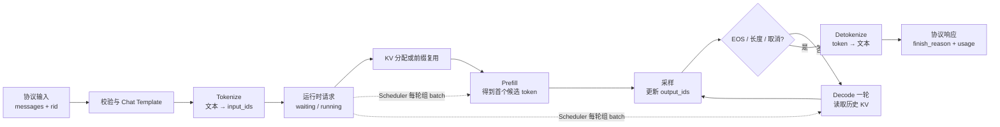

调用一次模型，和长期运行一个推理服务，是两类不同的问题。前者关心“这段输入能否生成文本”，后者还要回答：权重由谁常驻、并发请求怎样共享 GPU、KV Cache 如何分配、谁决定下一轮执行哪些 token、输出怎样流回正确的客户端，以及资源耗尽时拒绝谁。

本节不是 SGLang 命令手册，而是借 **SGLang Runtime（SRT）** 建立推理基础设施坐标系。本节末尾的最小实验只用于验证推导，不是学习目标。源码、参数和接口边界固定到 **SGLang v0.5.17**；模型 revision、CUDA、Kernel 与硬件组合仍须按实际环境记录。

全章继续使用同一条 AI Infra 值班事务：`trace_id=agent-trace-001`。本节追踪第一次模型调用 `rid=agent-rid-001/plan`；现在没有真实工具结果，所以合理意图是“需要先调用工具”，而不是编造 `gpu-prod` 的利用率。

## 📑 目录

- [1. 四层坐标系](#1-四层坐标系)
- [2. 从函数调用到常驻状态机](#2-从函数调用到常驻状态机)
- [3. 一条请求的抽象状态](#3-一条请求的抽象状态)
- [4. Engine 与 Server 的控制边界](#4-engine-与-server-的控制边界)
- [5. 显存与容量模型](#5-显存与容量模型)
- [6. 延迟与吞吐模型](#6-延迟与吞吐模型)
- [7. SGLang 核心设计地图](#7-sglang-核心设计地图)
- [8. 把启动参数读成资源策略](#8-把启动参数读成资源策略)
- [9. 用一个实验检验心智模型](#9-用一个实验检验心智模型)
- [10. 初学者常见误解](#10-初学者常见误解)
- [11. 把 plan rid 交给 12.2](#11-把-plan-rid-交给-122)
- [总结](#总结)
- [自我检验](#自我检验)
- [参考资料](#参考资料)

---

## 1. 四层坐标系

初学者说“模型服务很慢”时，常把四层对象混成一个东西。先分层，才能判断一项优化究竟改了什么。

### 1.1 模型层：定义“算什么”

模型层包含网络结构、训练后的参数、tokenizer、词表与 Chat Template 等制品。以 `Qwen/Qwen2.5-7B-Instruct` 为例，权重决定每层矩阵中的数值，配置决定层数、hidden size、KV head 数和上下文边界。

模型层回答的是“给定 token，概率分布是什么”。它通常不负责让权重跨请求常驻，也不负责多用户 KV 分配、Prefill/Decode 调度、HTTP 连接、取消、限流或副本路由。

因此，模型能力相同不代表服务性能相同；同一 checkpoint 放进不同运行时，吞吐、尾延迟和可承载上下文都可能不同。

### 1.2 Kernel 层：定义“一步怎么算”

Kernel 是 GPU 上执行的算子实现，例如 GEMM、Attention、采样和多卡 collective。它关心 dtype、张量形状、显存布局、硬件指令和工作区。

一个更快的 Attention Kernel 可以缩短某次 forward，却不知道哪些请求应组成 batch、某段 KV 是否已存在、请求是否取消，或为了 P99 是否应暂缓一条长 Prompt。

Kernel 优化的代价也不是零：它可能增加编译或捕获时间、工作区、形状限制和硬件兼容矩阵。单算子更快，不自动推出端到端更快。

### 1.3 推理运行时层：定义“许多请求怎样持续执行”

推理运行时持有长期状态：模型进程、请求队列、KV 池、调度状态、执行 batch、采样状态和输出映射。**SRT 主要位于这一层。**

它把一次次 forward 组织成长期循环：

```text
接收请求 → admission → 分配/复用 KV → 组 batch
        → GPU forward → 采样 → 更新请求状态 → 下一轮
```

运行时换来的是资源复用和并发效率，代价是更多状态、一致性边界和故障模式。排队、取消传播、KV 回收或 CPU 调度都可能成为瓶颈，即使 Kernel 本身没有问题。

### 1.4 在线服务层：定义“谁能以什么契约调用”

在线服务层处理 OpenAI 兼容协议、HTTP/SSE、连接生命周期、鉴权、配额、限流、可观测性与多副本路由。SGLang 的 Server 入口覆盖其中一部分，但一个生产平台通常还会在外部增加网关、服务发现和安全控制。

服务层不应被误认为模型计算本身。JSON 校验与 Chat Template 渲染本身是 CPU 成本，网络缓冲属于传输成本；但模板还会改变输入 token 数，因此会间接改变 Prefill FLOPs。分析时要区分“处理模板的成本”和“模板变长后模型多算的成本”。

把四层压缩成一句话：

```text
模型决定结果空间，Kernel 执行算子，
运行时管理跨请求状态，在线服务管理跨用户契约。
```

## 2. 从函数调用到常驻状态机

### 2.1 为什么 `model.generate()` 不够

`model.generate()` 适合教学、单元测试和小规模离线任务，但函数边界天然隐藏了在线系统必须显式管理的六类状态。

**第一，权重生命周期。** 假设下载之外的加载与初始化耗时 25 秒，真正生成耗时 2 秒。每个请求都重建模型时，单请求是 27 秒；若常驻进程服务 1,000 个请求，初始化摊销约为：

$$
\frac{25\text{ s}}{1000}=25\text{ ms/request}
$$

这只是摊销，不表示冷启动消失。服务重启后的第一批请求仍会看到加载、Kernel 初始化或 CUDA Graph 捕获。

**第二，请求并发。** 多个用户同时到达时，系统需要 admission、排队和组批。让每个调用独占 GPU 会浪费 Decode 的批处理机会；无条件把所有请求塞入 batch，又会让显存和尾延迟失控。

**第三，KV 生命周期。** 每个活跃序列都在增长 KV。系统必须知道哪些 token 已占用物理槽位、哪些前缀可复用、完成或取消后何时释放，以及容量不足时应排队还是拒绝。

**第四，迭代级调度。** 自回归输出不能一次算完。一个 64-token 输出会经历多轮状态转换，新请求可能在旧请求 Decode 期间到达。运行时必须每轮重新决定执行集合。

**第五，流式输出与取消。** token 要回到正确连接；客户端断开后，请求也不能永远占用 KV。这里需要稳定请求 ID、增量反分词、完成原因和取消传播。

**第六，故障隔离。** 输入校验失败、模型进程 OOM、某个 worker 退出和客户端超时属于不同故障域。单次函数异常不足以表达服务是否还能接收后续请求。

所以升级关系不是“把函数外面套一层 HTTP”，而是：

$$
\text{单次生成函数}
\quad\Longrightarrow\quad
\text{长期运行、可并发、可回收的状态机}
$$

### 2.2 状态机付出的代价

常驻运行时会引入队列、进程间通信、元数据、调度 CPU 开销和更复杂的恢复逻辑。低并发、短任务下，这些固定成本可能比直接调用更显眼。

因此“需要运行时”不等于“所有场景都需要 Server”。离线批处理也需要权重和 KV 的长期管理，但不一定需要 HTTP、SSE 或多租户治理。这正是 Engine 与 Server 要分开讨论的原因。

## 3. 一条请求的抽象状态

先不背 v0.5.17 的具体类名，把请求抽象为：

$$
R=(rid,\ input\_ids,\ output\_ids,\ phase,\ kv\_handles,\ sampling,\ status)
$$

其中 `phase` 至少区分 Prefill 与 Decode，`status` 至少区分 waiting、running、finished/cancelled。每生成一个 token，`output_ids`、KV 占用和终止条件都会改变。

贯穿案例的协议输入固定为：`trace_id=agent-trace-001`、`rid=agent-rid-001/plan`，模型为 `Qwen/Qwen2.5-7B-Instruct`，system/tool 前缀要求实时状态只能来自工具结果且最多调用一次 `get_cluster_status`，用户问题是“检查 gpu-prod，并判断是否需要扩容及理由”，采样使用 `temperature=0, max_tokens=32`。

它从外到内经历下面这条链路：



这张图有三个容易忽略的事实。

第一，`messages` 不是 GPU 输入。Chat Template 和 tokenizer 会改变 token 序列；字符数相同不代表 Prefill 工作量相同。

第二，运行时请求不是 HTTP 对象。它要持有 waiting/running、已生成 token、KV 位置和结束状态，才能跨多轮 forward 生存。

第三，一次响应对应许多次执行。Prefill 通常产出首 token，后续 token 由串行 Decode 产生；Scheduler 可以在轮次之间插入其他请求，但不能消除单条序列的自回归依赖。

本节只建立对象变化。`GenerateReqInput`、tokenized input、Scheduler `Req`、IPC 和反分词进程的真实映射交给 [12.2](/AIInfraGuide/inference/模块四-推理优化/第12章-深入sglang/122-sglang整体架构)。

## 4. Engine 与 Server 的控制边界

Engine 与 Server **不是两套模型执行实现**。在本章的 v0.5.17 边界内，它们最终都使用 SRT；差别主要在调用者把控制边界画在哪里。

Engine 把 API 边界画在本地 Python 调用上。调用方负责输入组织、任务生命周期和结果消费，适合离线批处理、评测流水线或运行时内测；但 Engine 内部仍会启动 Scheduler、Detokenizer 等 SRT 子进程并使用 IPC，它不是“没有进程和队列的轻量路径”。下面只是**非逐字伪代码**：

```python
# 非逐字伪代码：表达长期复用，不代表 v0.5.17 完整 API
engine = Engine(model)
for batch in workload:
    outputs = engine.generate(batch)
engine.shutdown()
```

Server 把边界画在网络协议上。它增加请求校验、OpenAI 字段转换、HTTP/SSE、连接取消和网络入口，适合多进程或多语言客户端，以及端到端 SLO 验收。

两者共同承担的成本包括：权重读取、KV 管理、Scheduler 排队、模型 forward、采样与核心进程通信。Server 额外承担协议解析、序列化、网络、连接，以及部署时可能存在的入口网关等待。

可以写成诊断式 $T_{\text{Server}}\approx T_{\text{SRT core}}+T_{\text{protocol}}+T_{\text{transport}}+T_{\text{ingress}}$，其中 $T_{\text{ingress}}$ 只在代理、网关或入口排队存在时出现；这不是性能承诺。

只有输入 token、采样参数、并发、缓存状态和冷暖边界一致时，Engine 与 Server 的差值才接近“服务层成本”。如果 Chat 路径多套了一次模板，或 Server 正在批处理并发请求，直接相减没有解释力。

## 5. 显存与容量模型

### 5.1 先建立显存账本

推理进程的 GPU 显存不是只有权重和 KV。一个更接近运行时的账本是：

$$
M_{\text{total}}
\approx M_{\text{weights}}
+M_{\text{KV}}
+M_{\text{activations}}
+M_{\text{graph}}
+M_{\text{workspace}}
+M_{\text{runtime}}
$$

$M_{\text{weights}}$ 是参数与常驻权重副本，$M_{\text{KV}}$ 是活跃 token 与保留前缀占用的 KV 池，$M_{\text{activations}}$ 是当前 Prefill/Decode batch 的中间张量与 logits，$M_{\text{graph}}$ 是 CUDA Graph 及静态 buffer，$M_{\text{workspace}}$ 是算子和 collective 的临时工作区，$M_{\text{runtime}}$ 则包含 CUDA context、allocator 元数据、对齐与碎片。

这些项的边界会因 backend 和版本而变化，公式的价值是防止把“剩余显存”全部许诺给 KV。

### 5.2 Qwen2.5-7B BF16 权重手算

为了量级估算，先按 70 亿参数、BF16 每参数 2 Bytes：

$$
M_{\text{weights}}
\approx 7\times10^9\times2
=14\text{ GB}
\approx13.0\text{ GiB}
$$

`7B` 是规模名，不是精确 tensor 计数。若按约 7.61B 参数估算，则是 15.22 GB，约 14.17 GiB。容量评审应读取固定 revision 的真实 checkpoint；这两种心算都没有包含 Graph、workspace 和运行时开销。

### 5.3 每 token 的 KV 手算

假设 Qwen2.5-7B 配置为 28 层、4 个 KV heads、`head_dim=128`，KV dtype 为 BF16，并先按 `TP=PP=1` 计算未分片的全模型逻辑载荷：

$$
M_{\text{KV/token}}
=2_{\text{K,V}}\times28\times4\times128\times2
=57{,}344\text{ Bytes}
=56\text{ KiB}
$$

若把 4,096 定义为已经执行过 forward、因而需要保留 KV 的位置数，理论 KV 为：

$$
56\text{ KiB}\times4096
=224\text{ MiB}
$$

8 个同长度、没有共享物理前缀的活跃请求约占：

$$
224\text{ MiB}\times8
=1.75\text{ GiB}
$$

普通自回归生成 \(N\) 个输出 token 时，最后一个 sampled token 尚未再次 forward，实际已缓存位置通常是 \(P+N-1\)；容量规划也可以保守按上界预留。数字不含 page 对齐、allocator 与碎片开销。TP/PP 后每个 rank 的占用要按该 rank 实际持有的层、KV heads 与复制策略重算。RadixAttention 命中时，多个逻辑请求可能引用部分共享 KV；但只有物理上仍被保留且可复用的前缀才能从账本中扣除，不能直接用业务上的相似率代替。

### 5.4 为什么权重固定后并发主要看 KV 池

同一进程加载模型后，权重近似固定；每接纳一个请求，变化最大的常驻项是其活跃 token KV。因此粗略容量为：

$$
N_{\text{token slots}}
\lesssim
\frac{M_{\text{budget}}-M_{\text{fixed}}}
{M_{\text{KV/token}}}
$$

其中 $M_{\text{fixed}}$ 至少包含权重、Graph、workspace 预留和运行时 headroom。并发不是一个独立数字：8 个 512-token 请求与 8 个 32K 请求的 KV 压力完全不同。

分页或池化分配避免了按最大长度为每个请求整块预留，但不会创造显存。它只是让容量更接近“当前物理 token 总数”，并把问题转化为 token admission、页面回收和碎片管理。

### 5.5 三类显存失败不能混用一个药方

**启动 OOM** 发生在权重加载、进程初始化或 Graph 捕获附近。若权重本身放不下，降低并发上限通常无效；应考虑更小模型、经验证的量化或并行切分。

**KV 容量校验失败** 表示留给 token pool 的空间不足以满足配置边界。此时模型可能已加载成功，但声明的上下文、并发或最小 token 容量互相矛盾。

**运行时峰值 OOM** 出现在某种 batch 形状、长 Prefill、collective 或临时 workspace 的峰值。盲目提高静态 KV 占比反而会挤掉 headroom，使这类 OOM 更容易出现。

所以“显卡容量大于权重大小”只能说明第一道下界可能满足，不能证明服务能启动、能接纳目标上下文，更不能证明峰值稳定。

## 6. 延迟与吞吐模型

### 6.1 把端到端时间拆开

对一条请求，可用下面的账本定位时间：

$$
T_{\text{E2E}}
\approx T_{\text{queue}}
+T_{\text{preprocess}}
+T_{\text{prefill}}
+\sum T_{\text{decode}}
+T_{\text{postprocess}}
$$

`preprocess` 包含协议校验、模板化和 tokenize；`postprocess` 包含采样后的增量处理、detokenize、序列化与传输。这是定位成本的近似账本，不是要求把 profiler 事件严格相加：流式响应会让 Decode 与后处理重叠，真正 E2E 由关键路径决定。

TTFT 覆盖提交后到首 token 可见之前的排队、预处理、Prefill，以及首 token 的采样、detokenize、序列化和传输。常见的请求级 TPOT 是：

$$
TPOT=\frac{T_{\text{E2E}}-TTFT}{N_{\text{out}}-1}
$$

ITL 则保留每两个可见 token 时间戳的间隔 $ITL_i=t_i-t_{i-1}$，更适合观察抖动和 P99。不同工具可能混用名称，报告必须写清公式。

因此：

- TTFT 高而 TPOT 正常，优先看排队、长 Prompt、Prefill 和入口 CPU；
- TTFT 正常而 TPOT 高，优先看 Decode batch、KV 访问、调度间隔与输出链路；
- E2E 高不能直接推出 GPU 慢，`T_queue` 可能才是主项。

### 6.2 用贯穿请求算一遍

假设暖态、单副本、Prompt 为 512 token、输出上限保持贯穿案例的 32 token，并测得 queue 20 ms、preprocess 10 ms、prefill 180 ms、后续 31 次 Decode 平均 32 ms、最终未被重叠隐藏的 postprocess 尾部 15 ms。

若首 token 由 Prefill 产出，则：

$$
T_{\text{E2E}}
\approx20+10+180+31\times32+15
=1217\text{ ms}
$$

这个前提下 TTFT 的计算与排队主体约 210 ms，之后还要加首 token 的采样与输出路径；TPOT 约 32 ms。数字只描述该模型、输入输出长度、硬件、backend、缓存状态和并发；换任一前提都不能照搬。

### 6.3 为什么并发提高吞吐却可能伤害 P99

Decode 常受权重和 KV 搬运约束。把多个请求组成 batch，可以让一次权重读取服务更多 token，系统 token/s 因而上升。

但请求看到的延迟还包含等待：更满的 batch 可能延长单轮执行，长 Prefill 会争用预算，KV 接近容量时 admission 等待上升，少数长尾请求又会在高利用率下放大队列波动。

这就是吞吐与延迟的非显然取舍：**GPU 更忙不等于每个用户更快。** 生产目标应是满足 TTFT/TPOT SLO 的 Goodput，而不是无条件追求最高 token/s。

P99 还要求看分布而不是均值。平均 TTFT 200 ms 可能同时包含大量 80 ms 请求和少数数秒请求；只有记录到达率、并发、长度分布与分位数，数字才可解释。

### 6.4 冷启动与稳态只是实验边界

冷启动包括模型下载、权重加载、Kernel 初始化、内存池建立和可能的 Graph 捕获。稳态测量保持进程、模型 revision 和负载口径不变，先完成与目标形状相近的预热。

两者都值得测，但回答不同问题：冷启动影响扩缩容和故障恢复，稳态影响常规 SLO。把首请求混进稳态 P99，会同时测到两套机制。

## 7. SGLang 核心设计地图

这一节只回答“它们在解决哪类 Infra 问题、代价是什么”，具体实现留给后续章节。

### 7.1 RadixAttention：减少重复 Prefill

Agent 请求常共享 system prompt、工具描述和历史前缀。RadixAttention 用可匹配的前缀索引复用已计算 KV，目标是少算重复 Prefill、降低 TTFT 和计算量。

代价是索引、引用计数、锁定、淘汰与内存保留。命中率高也不一定收益高：命中很短、恢复成本很高，或为了命中把请求路由到拥塞副本，都可能让 P99 变差。详见 [12.3](/AIInfraGuide/inference/模块四-推理优化/第12章-深入sglang/123-radixattention与层次化缓存)。

### 7.2 Iteration scheduling 与 overlap：填平执行空洞

请求在不同时间到达、长度也不同。迭代级调度允许完成的请求退出、新请求进入，并让 CPU 调度、结果处理与 GPU 工作尽可能重叠，目标是提高设备利用率和吞吐。

代价是状态跨轮次存在，结果提交可能晚一拍，公平性、取消和调试都更复杂。更激进的 batch 不一定有更好的 TTFT/TPOT。详见 [12.4](/AIInfraGuide/inference/模块四-推理优化/第12章-深入sglang/124-调度器与cpu-gpu重叠)。

### 7.3 Structured generation：把格式约束放进生成过程

JSON Schema、正则或 grammar 可以在采样时屏蔽非法 token，比“生成后再解析失败”更早维护结构契约，适合工具调用和 Agent 输出。

代价包括 grammar 编译、mask 维护、状态同步和 backend 兼容。结构合法也不代表事实正确；一个格式完美的“需要扩容”仍可能是幻觉。详见 [12.5](/AIInfraGuide/inference/模块四-推理优化/第12章-深入sglang/125-结构化生成与agent能力)。

### 7.4 Multi-replica gateway：在副本之间分配负载

单实例容量有限，网关需要考虑健康、负载、缓存局部性和故障转移。cache-aware routing 可能让共享前缀继续命中，减少跨副本冷 Prefill。

代价是额外一跳和分布式状态。过度追求粘性会制造热点，纯最短队列又可能丢失缓存收益；扩副本也不会自动消除入口限流和跨区网络成本。详见 [12.6](/AIInfraGuide/inference/模块四-推理优化/第12章-深入sglang/126-生产部署调优与框架对比)。

这四项分别在“重复计算、执行空洞、输出契约、横向扩展”上动刀。它们不是独立开关：缓存会改变 Prefill 工作量，调度会改变命中兑现时机，结构约束会进入每轮采样，路由会改变缓存所在位置。

## 8. 把启动参数读成资源策略

不要背参数大全。参数只是把容量、延迟和兼容性决策写进启动配置；以下语义固定在 v0.5.17，升级后应重新核对默认值和实现。

### 8.1 `mem_fraction_static`：KV 容量与峰值余量

在 v0.5.17 中，`--mem-fraction-static` 近似约束“模型权重 + KV pool”占整卡显存的比例，不是实例所有显存分配的硬上限，更不是“KV 占权重的比例”。同一模型的权重大小基本固定，目标静态预算扣除权重后，剩余部分才主要成为 KV 池。因而调高时最直观的效果通常是增加 token slots，同时压缩留给 Graph、workspace、collective、激活峰值和碎片的其余显存余量；调低更稳健，却可能导致 KV 容量不足。

它不是“越大性能越好”的旋钮。正确证据是启动后的实际 KV token 容量、目标长度分布，以及压力下的峰值显存。

### 8.2 上下文与并发：共同消费 token slots

上下文上限约束单请求最长序列，并发上限约束同时 running 的请求数。分页 KV 不会为每个请求预留完整上限，但最坏情况下两者仍通过“活跃 token 总数”耦合。

如果业务 P99 Prompt 只有 4K，却为了极少数请求开放超长上下文，应同时设计 admission 或单独队列；否则少数长请求可能吞掉大部分 KV 池。

### 8.3 Tensor Parallel：装得下与跑得快是两道题

增大 `--tp-size` 可以把权重计算分到多张 GPU，常用于单卡放不下模型。代价是 collective、同步、拓扑依赖和多卡故障面。

TP 不保证吞吐线性增长；小 batch 下通信甚至可能抵消计算收益。先问“是否必须切分才能装下”，再在固定形状和互联上测延迟与 Goodput。

### 8.4 Chunked Prefill：长请求效率与短请求公平

`--chunked-prefill-size` 把长 Prompt 拆到多个调度轮次。较小 chunk 可减少长 Prefill 独占一次迭代的时间，给 Decode 或短请求插入机会，也可能降低单次峰值。

代价是更多调度轮次、额外边界开销，并可能削弱大矩阵的执行效率。它优化的是混合负载下的调度形状，不是让 Prefill FLOPs 凭空消失。

### 8.5 Backend：兼容矩阵优先于名字

Attention 等 backend 决定具体 Kernel、支持的 dtype/模型形状、workspace 和 Graph 行为。不存在脱离 GPU 架构、模型、batch、序列长度与版本的“永远最快 backend”。

选择顺序应是：先验证正确性和兼容性，再固定输入分布比较 TTFT、TPOT、峰值显存和失败率。更换 backend 后，旧的容量与延迟基线都应作废重测。

## 9. 用一个实验检验心智模型

这里不展开安装与 API 教程；环境配置以 [v0.5.17 官方安装页](https://github.com/sgl-project/sglang/blob/v0.5.17/docs/docs/get-started/install.mdx) 为准。我们只设计一个最小实验，验证前面的四层、显存和延迟推导是否能解释真实现象。

### 9.1 先写实验假设

固定 SGLang 版本、模型 revision、GPU、精度和启动参数，只启动一个 Server、只发送一条非流式请求：

```text
trace_id = agent-trace-001
rid = agent-rid-001/plan
input = 固定 system/tool 前缀 + 检查 gpu-prod
temperature = 0
max_tokens = 32
stream = false
```

非流式是有意选择：它让实验先验证对象和容量边界，不声称测到了逐 token ITL。若目标是 TTFT/ITL，下一轮应改成流式并保存每个可见事件时间戳，方法见第 9 章。

### 9.2 用证据检验三条推导

**推导一：运行时是常驻状态机。** 启动阶段应出现权重加载、KV pool 规划和 worker ready；请求阶段不应重新加载模型。v0.5.17 的请求日志可关联 `received/finished`，若要观察内部调度与执行阶段，还需显式启用 trace 或增加 Scheduler instrumentation。

**推导二：字符不会直接进入 GPU。** 响应中的 `usage.prompt_tokens` 应对应 Chat Template 与 tokenizer 处理后的长度，而不是中文字符数；`finish_reason=length` 说明输出被上限截断，不是自然完成。

**推导三：容量不只有权重。** 启动日志中的权重、KV token 容量和剩余 headroom 应与第 5 节的量级同向。若 24 GB GPU 能放下约 14～15 GB 权重却仍启动失败，应继续检查 Graph、workspace、激活峰值和 KV 最小容量，而不是断言公式失效。

### 9.3 什么结果会推翻当前解释

```text
每次请求都重新加载权重
  → 生命周期设计错误，不是正常 SRT 稳态

本地 tokenizer 与服务 usage 长期不一致
  → revision、Chat Template 或输入边界没有固定

非流式总时延很高但 GPU forward 很短
  → 排队、预处理或后处理可能主导，不能归咎于 Kernel

服务返回具体扩容结论但没有工具数据
  → 系统可运行，但业务语义门禁失败
```

实验的目的不是证明“会调用 SGLang”，而是训练一种 Infra 方法：先写出可证伪的资源与时间模型，再用最小观测判断问题属于模型、Kernel、运行时还是服务层。

## 10. 初学者常见误解

### 误解一：`/health` 成功就说明服务正确
健康检查通常只能证明进程或核心 worker 可响应。它不证明 served model、revision、Chat Template、采样参数和业务语义正确。代价最低的修正是保存一次固定输入的 token 与语义证据。

### 误解二：tokens/s 越高，用户体验越快
系统 tokens/s 可能通过更大 batch 提升，同时让排队和 P99 TTFT 恶化。必须把吞吐与 TTFT、TPOT、成功率和 SLO 放在同一负载前提下判断。

### 误解三：Engine 是另一套更轻的推理引擎
Engine 与 Server 共用 SRT 核心，主要差异是 Python 控制边界与网络服务边界。把模板、并发和缓存状态混在一起比较，会把输入差异误算成 HTTP 开销。

### 误解四：默认参数代表当前机器的最佳值
默认值只能提供版本内的通用起点，不知道业务长度分布、SLO、GPU 拓扑和副本策略。每次调参都应说明它改变显存账本、调度形状还是 Kernel 兼容性。

### 误解五：缓存命中率高就一定收益高
收益取决于避免了多少 Prefill、命中 KV 所在层级、恢复成本和路由排队。命中 90% 的短前缀可能不如命中 30% 的超长公共前缀；应看节省的计算与最终 Goodput。

### 误解六：把 `mem_fraction_static` 调高可以治所有 OOM
它可能扩大 KV 池，也可能挤压运行时峰值余量。先区分权重启动 OOM、KV 容量不足和 workspace 峰值 OOM，再选择动作。

## 11. 把 plan rid 交给 12.2

本节留下的追踪记录是：

```text
trace_id = agent-trace-001
rid = agent-rid-001/plan
model = Qwen/Qwen2.5-7B-Instruct（revision 单独固定）
input = 固定 system/tool 前缀 + 检查 gpu-prod
stream = false
temperature = 0
expected intent = 无工具结果时不猜测
```

我们现在能解释它属于哪一层、为什么需要常驻运行时、显存和延迟花在哪里。下一节保持请求与 `rid` 不变，继续追问：协议对象怎样成为 tokenized input，怎样跨 IPC 变成 Scheduler `Req`，又怎样从 sampled token 回到响应。

## 总结

SGLang 的学习入口不是安装命令，而是四层坐标系：模型定义计算，Kernel 执行算子，SRT 管理长期请求状态，Server 管理网络契约。`model.generate()` 到在线推理的关键跃迁，是权重、KV、调度、流式输出和故障域都进入常驻状态机。

容量上，权重固定后并发主要受物理 KV token slots 约束，但 Graph、workspace 和运行时余量不能被忽略；性能上，E2E 必须拆成排队、预处理、Prefill、Decode 与后处理，并发提高系统吞吐时可能恶化 P99。最小实验的价值，是用 `agent-rid-001/plan` 验证这些推导，而不是证明“会调用 API”。

## 自我检验

- [ ] 能判断一个问题属于模型、Kernel、推理运行时还是在线服务层。
- [ ] 能解释为什么长期服务不能退化为每请求一次 `model.generate()`。
- [ ] 能画出协议输入、Scheduler 请求、KV/执行、采样与文本输出的状态链。
- [ ] 能解释 Engine 与 Server 共享什么、额外成本分别在哪里。
- [ ] 能从模型配置推导 BF16 权重与每 token KV 的量级。
- [ ] 能判断启动 OOM、KV 容量失败和运行时峰值 OOM 的差异。
- [ ] 能用延迟分解判断 TTFT 或 TPOT 的主要贡献段。
- [ ] 能解释为什么并发可能同时提高吞吐并恶化 P99。
- [ ] 能说明四项 SGLang 核心设计分别解决的问题及其代价。
- [ ] 能把五类启动参数翻译成容量、延迟或兼容性策略。
- [ ] 能用观察证据判断一次返回是否真的验证了心智模型。
- [ ] 能区分 `agent-trace-001` 与 `agent-rid-001/plan`，并说明 plan rid 在 12.2 中还要经过哪些对象边界。

## 参考资料

- [SGLang v0.5.17 Release](https://github.com/sgl-project/sglang/releases/tag/v0.5.17)
- [SGLang v0.5.17 Installation](https://github.com/sgl-project/sglang/blob/v0.5.17/docs/docs/get-started/install.mdx)
- [SGLang v0.5.17 Server Arguments](https://github.com/sgl-project/sglang/blob/v0.5.17/python/sglang/srt/server_args.py)
- [SGLang v0.5.17 Engine](https://github.com/sgl-project/sglang/blob/v0.5.17/python/sglang/srt/entrypoints/engine.py)
- [SGLang OpenAI API 文档](https://docs.sglang.ai/basic_usage/openai_api_completions.html)
- [Qwen2.5-7B-Instruct](https://huggingface.co/Qwen/Qwen2.5-7B-Instruct)

> 本文的参数语义与源码边界固定到 SGLang v0.5.17；任何升级都应重新核对默认值、backend 支持和容量基线。
