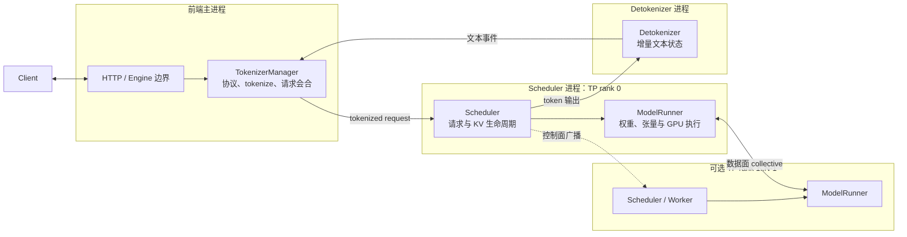
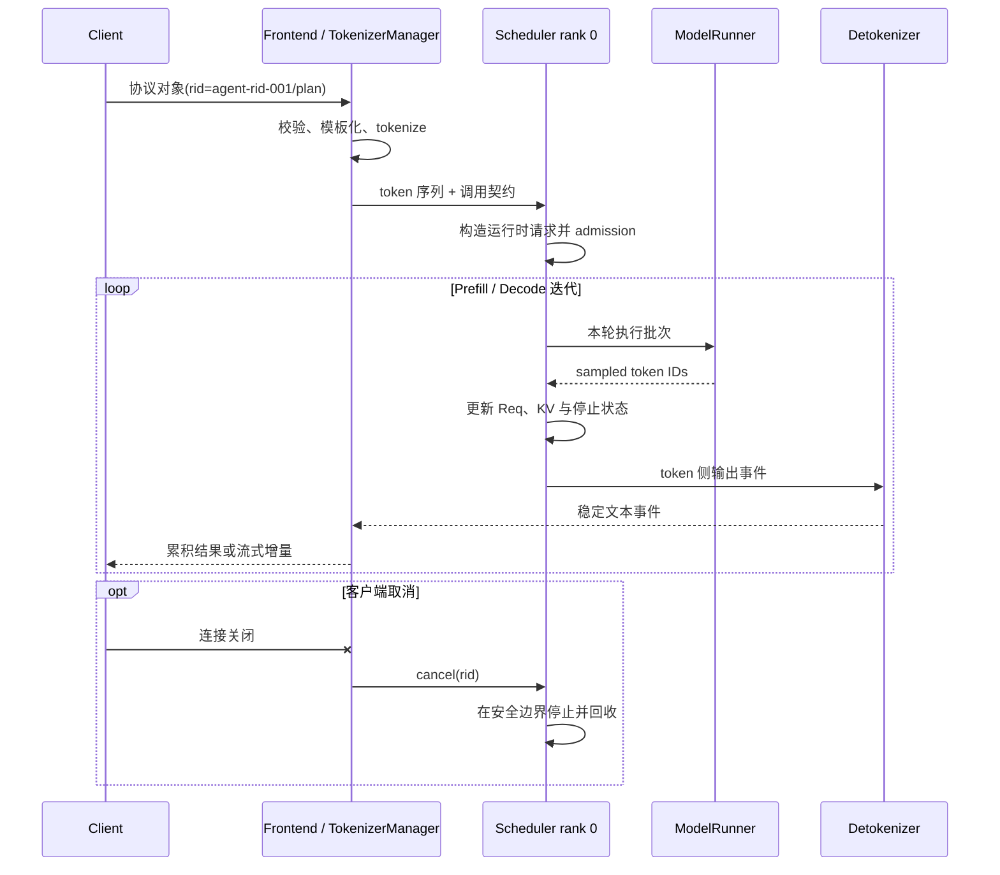

[12.1](/AIInfraGuide/inference/模块四-推理优化/第12章-深入sglang/121-sglang快速入门) 已经把模型、Kernel、推理运行时和在线服务放进四层坐标系，并说明在线推理本质上是常驻状态机。本节继续追问：为什么这台状态机不能写成一个大循环，为什么同一请求要换多种表示，又为什么“GPU 正在计算”只覆盖了服务的一小段生命线。

全文固定到 **SGLang v0.5.17**，以 Python SRT 的常见单节点路径建立心智模型。启动参数会改变进程数量和并行拓扑，因此组件名用于映射职责，不表示所有部署都必须拥有完全相同的物理进程。本节的重点不是追源码调用栈，而是建立一套可迁移到其他推理运行时的分析方法：先找状态，再找所有者，最后看状态在哪个边界发生转换。

## 📑 目录

- [1. 为什么推理运行时必须拆层](#1-为什么推理运行时必须拆层)
- [2. 一条请求的五次状态转换](#2-一条请求的五次状态转换)
- [3. 进程架构与状态所有权](#3-进程架构与状态所有权)
- [4. IPC：隔离、流水化与背压](#4-ipc隔离流水化与背压)
- [5. Scheduler：运行时的资源裁判](#5-scheduler运行时的资源裁判)
- [6. ModelRunner：从动态请求到 GPU 执行](#6-modelrunner从动态请求到-gpu-执行)
- [7. 输出路径：token、文本与取消](#7-输出路径token文本与取消)
- [8. 端到端时序与延迟分层](#8-端到端时序与延迟分层)
- [9. 架构取舍与故障域](#9-架构取舍与故障域)
- [10. 用最后可见对象分层排障](#10-用最后可见对象分层排障)
- [11. 交接下一节：共享前缀改变了什么](#11-交接下一节共享前缀改变了什么)
- [总结](#总结)
- [自我检验](#自我检验)
- [参考资料](#参考资料)

---

## 1. 为什么推理运行时必须拆层

问题不在于“一个进程能不能调用模型”。单请求演示当然可以把模板化、分词、forward 和解码写进同一个函数；困难来自并发、长生命周期和异构硬件：每条请求要生成多轮，数百条请求共享有限 KV，CPU 工作量又会随协议和文本变化。

运行时拆层，是为了让变化速度、执行设备和失败方式不同的状态分别演进。SGLang 的组件划分可以从三组矛盾理解。

### 1.1 控制面与数据面

**控制面**回答“谁可以算、下一轮算谁、占用哪些资源、何时停止”。请求校验、admission、排队、组批、取消和 KV 生命周期都属于控制决策。

**数据面**回答“选定以后怎样完成张量计算”。模型权重、激活、KV 数据、Attention/GEMM Kernel 和 TP collective 位于这条高吞吐路径。

两者不能完全独立：控制面必须把本轮计划交给数据面，数据面产生的 token 和完成状态又会影响下一轮。但如果每个协议分支都进入 GPU 执行路径，GPU 会等待不可预测的 CPU 工作；如果数据面反过来决定请求生命周期，资源回收和公平性就难以表达。设计收益是控制策略可以变化，而模型执行仍保持相对规则；代价是多了一致性边界。控制面认为某请求已取消、数据面却还有一轮在途时，系统必须定义哪一刻停止和何时回收。

### 1.2 CPU 与 GPU

CPU 擅长分支、对象管理、协议解析和队列操作；GPU 擅长对规则张量执行大规模并行计算。把二者塞进串行循环，会形成“CPU 准备一拍，GPU 执行一拍，双方轮流等待”的时间线。

运行时因此尽量把模板化、tokenize、调度和 detokenize 放在 CPU 侧，把 forward、采样相关 Kernel 和张量通信放在 GPU 侧，并在安全的数据依赖范围内流水化。

这样设计不是因为 CPU 工作“不重要”，而是因为 CPU 延迟的方差通常更大。一个复杂 Chat Template 或一次垃圾回收停顿，不应无条件阻塞已经准备好的 GPU 工作。代价是同步：CPU 必须知道哪些 GPU 结果已经可用，GPU 必须拿到合法的输入和 KV 地址。异步只能隐藏没有依赖的工作，不能消除真实依赖。

### 1.3 长期状态与单轮执行

事务 `agent-trace-001` 的 plan 请求 `agent-rid-001/plan` 可能存活几十到几百个 Decode 轮次。它的输出 token、停止条件、KV 引用和连接状态会持续变化，这是**长期状态**。

某一次 GPU forward 只需要当前轮次的请求集合、输入位置和执行元数据，这是**单轮快照**。可以抽象为：

$$
R_i(t)\xrightarrow{\text{schedule at }t}B_t\xrightarrow{\text{forward}}Y_t
$$

$R_i(t)$ 是请求 $i$ 在时刻 $t$ 的运行状态，$B_t$ 是本轮批次，$Y_t$ 是本轮结果。`Req` 一类对象跨轮存在，而执行 batch 用完即弃；把两者合并，会让“请求仍在运行”和“请求本轮被执行”无法区分。收益是 Scheduler 可以每轮重组 batch，让已完成请求退出、新请求进入；代价是每轮结果都要正确提交回长期状态，迟到结果和取消竞态也必须处理。

### 1.4 拆层不等于盲目拆进程

逻辑分层先定义职责和状态所有者，物理分进程只是实现选择。两个组件可以在同一进程里保持清晰边界，也可以因隔离和流水化需要跨进程。判断边界是否合理，应问四个问题：状态更新频率是否相近、是否使用同一设备、是否需要独立背压、失败后能否局部恢复。类名数量不是架构成熟度指标。

## 2. 一条请求的五次状态转换

继续使用 12.1 留下的请求：

```text
trace_id = agent-trace-001
rid = agent-rid-001/plan
model = Qwen/Qwen2.5-7B-Instruct
input = 值班 system/tool 前缀 + “检查 gpu-prod，并判断是否需要扩容及理由”
temperature = 0
max_tokens = 32
stream = false
```

此时还没有真实工具结果。请求的业务意图应是先请求工具，而不是编造集群状态；本节只研究这段意图如何穿过运行时。

不要把链路记成七个类名。更稳定的理解是五种语义不同的状态：

$$
\text{协议对象}
\rightarrow\text{token 序列}
\rightarrow\text{运行时请求}
\rightarrow\text{执行批次}
\rightarrow\text{输出事件}
$$

### 2.1 协议对象：表达调用契约

协议对象保存 `messages`、模型名、采样参数、是否流式和 `rid`。它面向调用方，重点是字段是否合法、角色顺序是否正确、服务是否支持相应能力。

此时“用户输入”仍是文本和结构化字段，不是 GPU 可计算的张量。它的生命周期通常与 HTTP/Python 调用相连，连接取消也先在这一层被感知。SGLang 映射：OpenAI 兼容入口与 `TokenizerManager` 所在的前端路径承接这类状态。具体 Python 类型是版本细节，协议语义才是稳定边界。

### 2.2 token 序列：确定模型实际看到什么

Chat Template 先把角色、工具描述和特殊 token 编排成模型文本，tokenizer 再把文本映射为整数序列：

$$
(\text{messages},\ \text{template},\ \text{tokenizer revision})
\longrightarrow [x_0,x_1,\ldots,x_{P-1}]
$$

这次转换决定 Prompt 长度 $P$，也决定后续前缀是否真的相同。两个肉眼相同的请求，只要模板、特殊 token 或 tokenizer revision 不同，就可能得到不同序列。为什么单独设一层：调度和 KV 容量按 token 计费，不按字符计费。代价是 CPU 开销与版本耦合；模板和 tokenizer 必须与模型制品一致。

### 2.3 运行时请求：获得跨轮生命

token 序列进入 Scheduler 后，才变成可长期演进的运行时请求。它至少需要表达身份、输入 token、已生成 token、waiting/running/finished 状态、采样规则、停止条件和 KV 引用。

可以抽象为：

$$
R=(rid,\ input,\ output,\ phase,\ kv,\ sampling,\ lifecycle)
$$

这一对象不再代表“调用方提交了什么”，而代表“运行时当前欠调用方什么”。它可以等待很多轮，也可以因容量不足暂不进入 GPU。这样设计让取消、重排和连续批处理成为可能；代价是 Scheduler 必须成为权威写入者，不能让前端、执行器和反分词器各自维护一份互相竞争的完成状态。

### 2.4 执行批次：冻结本轮计划

Scheduler 每轮从多个运行时请求中选出成员，形成一次执行批次。它回答：本轮包含谁、每条序列推进多少位置、读取或写入哪些 KV 槽位、使用何种执行模式。

批次是快照，不是请求本身。同一个 `agent-rid-001/plan` 会出现在多个不同批次中；某轮没有出现，也不表示它已经结束，可能只是仍在排队或本轮预算给了其他请求。把长期状态转成短期快照，可以让 ModelRunner 面对规则的张量接口；代价是快照提交后不能随意改写，取消通常要等安全边界生效。

### 2.5 输出事件：把一次进展交还外部

一次 forward 和采样通常只产生一个或少量新 token。运行时先形成 token 侧输出，再由 Detokenizer 形成文本增量，最终包装成非流式结果或流式事件。这里仍称为同一种“输出事件”，因为它们表达同一轮进展；但 token 视图是 Scheduler 更新状态的依据，文本视图才是客户端契约。

`rid` 在五种状态中保持不变，是身份不变量；内容表示、所有者和生命周期则不断变化。排障时应追踪“不变量是否保留、转换是否发生”，而不是假设一个 Python 对象从头传到尾。

## 3. 进程架构与状态所有权

下面是 v0.5.17 Python SRT 常见单节点路径的概念图。ModelRunner 通常位于 Scheduler/worker 执行进程内，不应误画成一个必然独立的服务。



图的重点不是箭头协议，而是**状态所有权**：每类可变状态要有一个权威所有者，其他组件只持有快照、派生结果或用于关联的副本。

### 3.1 TokenizerManager：拥有前端会合状态

`TokenizerManager` 负责把外部调用规范化为 token 化请求，并用 `rid` 关联等待中的调用与返回事件。它拥有的是协议/连接附近的状态：谁在等、结果送回哪里、输入是否已规范化。

它不应成为 KV 是否已分配、请求是否正在某个 GPU batch 中的最终权威，否则前端与 Scheduler 会在网络延迟和取消竞态下产生双写。将 tokenize 留在前端侧，能让可变长度 CPU 工作与 GPU 循环并行；代价是模板、tokenizer 和模型版本必须一致，前端积压也会在 GPU 之前制造 TTFT。

### 3.2 Scheduler：拥有请求与逻辑资源状态

Scheduler 是运行时请求生命周期的权威：waiting、running、finished/cancelled 如何转换，谁获得 token/KV 预算，下一轮执行谁，都由它协调。

对 KV，要区分逻辑所有权和物理存储。Scheduler 维护“哪些请求或缓存节点有权引用哪些槽位”的生命周期；真正的 KV 字节驻留在 GPU 内存池中，由执行侧资源实现承载。为什么集中：admission、调度和 KV 回收必须看到同一份容量事实；代价是 Scheduler 的 CPU 停顿会影响整个实例，错误回收还可能破坏后续请求的正确性。

### 3.3 ModelRunner：拥有设备执行状态

ModelRunner 长期持有模型权重、设备 buffer、Kernel/backend 选择、CUDA Graph 捕获结果和执行所需的物理资源视图。

它接受“本轮算什么”的计划，但不决定某租户是否应被接纳，也不拥有 HTTP 连接。把策略与执行分开，才能在不重写 admission 的情况下切换 eager/graph 或 Attention backend。代价是接口必须精确描述形状、位置和 KV 映射；控制面给出错误元数据时，GPU 可能报 shape 错误、访问非法槽位，或在多 rank collective 中等待。

### 3.4 Detokenizer：拥有增量文本状态

Detokenizer 按 `rid` 保存足以稳定解码的 token 上下文，并产生可提交的文本增量。它拥有“哪些字符已经安全输出”的状态，而不是模型的 token 生命周期。这样既避免 CPU 反分词阻塞 Scheduler，也能正确处理一个字符跨多个 token 的情况；代价是多一份按请求增长的 CPU 状态，以及 token 已生成但文本事件尚未形成的短暂窗口。

### 3.5 所有权决定故障边界

前端失败会丢失连接和会合状态，即使 GPU 进程暂时还活着，原请求也不能假装可透明继续。Detokenizer 失败时，token 可能已经生成，但文本契约无法可靠补齐。Scheduler 或 ModelRunner 失败通常会使该实例的请求、KV 引用和设备状态一起失效；进程隔离能缩小污染范围，却不能自动重建模型语义状态。

因此“多进程”提供的是故障隔离和明确重启边界，不是无损恢复承诺。生产系统仍需定义请求幂等性、客户端重试和实例摘流策略。

## 4. IPC：隔离、流水化与背压

组件拥有不同状态后，需要 IPC 传递状态转换结果。v0.5.17 的 Python 基线路径使用 ZeroMQ 等机制承接前端、Scheduler 与 Detokenizer 之间的消息；理解其系统作用比背三条 PUSH 路径更重要。

### 4.1 IPC 为什么存在

第一是**隔离**。协议或反分词的异常不应直接破坏 GPU 执行进程的 Python 堆；GPU OOM 也应有清晰的实例失败边界。第二是**流水化**。当 GPU 执行批次 $t$ 时，CPU 可以准备后续输入或处理更早的输出，只要没有真实数据依赖。

第三是**背压边界**。队列长度和等待时间让“生产速度大于消费速度”可被观察，并允许入口限流或 admission 采取动作。

IPC 本身不会解决过载。无限增长的队列只是把拒绝推迟成高 P99 或内存耗尽；背压需要容量上限、超时和明确的拒绝策略。

### 4.2 IPC 的成本

跨进程消息需要序列化、复制或句柄传递，并经历发送队列、接收队列和进程调度。一次消息的固定成本可能很小，但高频 Decode 输出会把固定成本放大。消息结构还是版本契约：发送端新增字段、接收端仍按旧语义解释时，错误可能直到调度或输出阶段才出现；所以运行时内部组件通常应按同一版本部署。

异步队列还会制造取消竞态：取消消息到达时，一次执行可能已经在途。正确语义通常是“在下一个安全边界停止并回收”，不是承诺 GPU 在连接断开的同一微秒停下。

### 4.3 TP 的控制面广播不是数据面 collective

当 `TP>1` 时，rank 0 通常承接前端控制入口，再把请求或批次控制信息同步给其他 rank，使所有 rank 以一致顺序进入 forward。这是**控制面广播**。模型执行期间，各 rank 需要交换张量分片的部分结果，例如通过 All-Reduce/All-Gather 完成层计算。这是**数据面 collective**。

前者传递“算什么”，后者传递“计算中的张量”。控制广播异常可能让 rank 对批次理解不一致；collective 异常则可能表现为通信慢、超时或某个 rank 等待。两类问题不能只用“多卡通信”概括。

## 5. Scheduler：运行时的资源裁判

Scheduler 不是简单 FIFO，也不是只负责把列表拼成 batch。它同时维护服务承诺、请求进度和稀缺 KV 资源，可以用四个理论角色理解。

### 5.1 Admission：现在能否接纳

Admission 判断请求是否满足上下文和资源边界，以及当前是否有足够 token/KV 预算进入运行集合。接收成功不等于立即运行；排队本身就是一种资源保护。无条件接纳会提高短时吞吐假象，却可能让 KV 枯竭和尾延迟失控；过度保守又会让 GPU 空闲，因此 admission 是容量安全与利用率的第一处取舍。

### 5.2 Iteration scheduling：这一轮轮到谁

自回归生成每轮只推进有限位置，Scheduler 因而在迭代边界重新选择请求。完成者退出，新请求可以进入，长 Prefill 也可以拆分，形成 Continuous Batching。每轮重排提高了利用率，却引入公平性问题：只追求最容易填满 GPU 的请求，可能让长请求或低优先级请求长期等待。

### 5.3 KV ownership：谁可以继续引用

请求进入运行集合前，需要获得合法 KV 槽位或缓存前缀引用；完成、取消或回退后，相应引用必须释放或转交缓存。这里维护的不是“还有多少显存”一个数字，而是逻辑 token 与物理槽位的对应关系；重复分配会浪费容量，过早释放则会破坏正确性。

前缀匹配、锁定、淘汰和层次化恢复详见 [12.3](/AIInfraGuide/inference/模块四-推理优化/第12章-深入sglang/123-radixattention与层次化缓存)。

### 5.4 Batch formation：把策略变成可执行形状

Scheduler 最终要把不同长度、不同阶段的请求形成 ModelRunner 能消费的批次，并附上位置、长度、KV 映射和采样等元数据。这一步决定本轮实际工作量；相同的请求数不代表相同成本：8 条 Decode 通常只推进约 8 个新位置，而 8 条 Prefill 可能展开数千个位置。

可以用下面的非逐字伪代码概括职责，不对应 v0.5.17 的具体函数：

```text
接收新请求与取消
→ 按容量执行 admission
→ 结算上一轮结果与资源
→ 选择本轮请求并保留 KV
→ 形成执行快照并提交
```

跨轮调度、结果结算与 CPU-GPU overlap 的细节留给 [12.4](/AIInfraGuide/inference/模块四-推理优化/第12章-深入sglang/124-调度器与cpu-gpu重叠)。在本节只需记住：Scheduler 维护长期真相，batch 只是它对某一轮的承诺。

## 6. ModelRunner：从动态请求到 GPU 执行

Scheduler 面对的是动态对象：请求长度不同、阶段不同、随时完成。GPU 更喜欢规则张量。ModelRunner 的核心角色，就是把前者映射为后者并选择可执行路径。

### 6.1 把请求语义降成张量语义

对本轮第 $i$ 条序列，设需要处理的新位置数为 $e_i$，则 Prefill/Extend 的 query token 总数近似为：

$$
Q=\sum_{i=1}^{B}e_i
$$

普通 Decode 时常有 $e_i=1$，于是 $Q\approx B$。这一个关系已经足以解释：只报 batch size，无法判断 GPU 工作量；还必须知道阶段、序列长度和 KV 命中。

ModelRunner 需要据此组织 token、position、长度和 KV 映射等张量，并让模型 forward 与 sampler 在正确 stream 和 backend 上执行。具体字段形状会随模型和后端变化，不应当作架构知识背诵。

### 6.2 Eager 与 CUDA Graph

Eager 路径按当前动态形状发起 Kernel，适应范围广，调试边界也更直接，但会重复承担 Python/CUDA launch 开销。

CUDA Graph 把满足约束的执行路径预先捕获并 replay，可降低重复 launch 成本；代价是启动捕获时间、静态 buffer/显存，以及对 batch 形状和控制流的约束。

Graph 不是另一种模型语义，而是同一执行语义的不同提交方式。某个形状无法 replay 时回到 eager，并不表示请求错误，只表示优化条件没有满足。

### 6.3 Kernel 与 collective 共同决定一步时间

一步执行可粗略写成：

$$
T_{\text{step}}\approx T_{\text{kernel}}+T_{\text{collective}}+T_{\text{launch/sync}}
$$

Attention/GEMM backend 决定单卡算子效率，TP collective 又受 rank 数、互联和形状影响。ModelRunner 能让模型“装得下”，不等于多卡延迟会线性下降。

### 6.4 为什么 GPU 忙不等于服务健康

GPU 利用率高，可能是有效 batch 在稳定产出，也可能是超大 Prefill 挤压短请求、collective 反复等待、过量请求把队列推高。利用率只说明设备活动，不能说明用户 SLO。

更接近服务目标的是 Goodput：

$$
\text{Goodput}=
\frac{\text{满足 TTFT、TPOT 与正确性 SLO 的完成请求数}}
{\text{单位时间}}
$$

低利用率也不必然有故障：低到达率时 GPU 本来就应空闲。只有把利用率与队列、batch 形状、成功率、TTFT/TPOT 和所有 TP rank 的时间线放在一起，才能判断 ModelRunner 是否是瓶颈。

## 7. 输出路径：token、文本与取消

GPU forward 结束后先得到 logits，采样再选择 token ID。这个 ID 会更新运行时请求、停止条件和下一轮输入，但它还不是可以安全发给用户的文本。

### 7.1 token 状态为什么不能等同文本状态

子词 tokenizer 允许一个字符或字节序列跨多个 token。逐个执行 `decode([token])` 再拼接，可能产生乱码、重复空格或错误的清理行为。

因此 Scheduler 维护 token 世界的事实：采样了什么、是否 EOS、是否达到长度；Detokenizer 维护文本世界的事实：哪些前缀已经稳定、哪些字符可以增量提交。

分离后，GPU 可以继续下一轮而 CPU 处理文本；代价是 token 已完成与文本可见之间多了一段队列和状态。

### 7.2 流式与非流式只是交付策略

流式请求把稳定文本增量尽早包装成事件，降低“首段可见”时间；非流式请求积累到完成后再返回。两者共享前面的 token 生成主线，不应被误解为两套推理引擎。

流式会增加事件频率、连接状态和网络缓冲敏感性。服务端已经产生文本事件，代理或客户端仍可能攒批，因此“用户没看到”不能直接归因于 Decode。

### 7.3 取消是一条跨所有者的状态传播

客户端断开先改变前端连接状态；取消再按 `rid` 传播给 Scheduler，后者停止后续 admission/调度并释放 KV；Detokenizer 还要清理增量上下文。

取消不是把已经执行的 GPU Kernel 倒放。系统要容忍在途 token 或文本事件迟到，并确保它们不会重新唤醒已经结束的调用。

## 8. 端到端时序与延迟分层

下面把五次状态转换、四个主要状态所有者和一次 Decode 循环放在同一张时序图中。



### 8.1 延迟不是一个 GPU 数字

对一次请求，可先用不重复计费的分层账本：

$$
T_{\text{E2E}}
\approx T_{\text{net,in}}
+T_{\text{cpu,in}}
+T_{\text{queue}}
+T_{\text{gpu}}
+T_{\text{cpu,out}}
+T_{\text{net,out}}
-T_{\text{overlap}}
$$

其中：

- $T_{\text{net,in}}$：客户端、网关和请求体进入服务的关键路径；
- $T_{\text{cpu,in}}$：校验、模板化、tokenize 和必要序列化；
- $T_{\text{queue}}$：入口、IPC 与 Scheduler admission 等待中未与别段重叠的部分；
- $T_{\text{gpu}}=T_{\text{prefill}}+\sum T_{\text{decode}}$；
- $T_{\text{cpu,out}}$：采样后处理、detokenize 与响应包装；
- $T_{\text{net,out}}$：事件到客户端可见的传输和缓冲尾部；
- $T_{\text{overlap}}$：确实并行、已在前面重复覆盖的时间。

公式是诊断账本，不是要求把任意 profiler 区间机械相加。队列可能与别的请求 GPU 工作并存，流式网络也会与后续 Decode 重叠；必须按单请求关键路径定义口径。

### 8.2 一个带单位的算例

假设 `agent-rid-001/plan` 有 512 个 Prompt token、输出 32 个 token，暖态测得：

```text
入口网络                     8 ms
前端 CPU                    12 ms
Scheduler 排队              40 ms
GPU Prefill                 95 ms
31 次 GPU Decode       31 × 18 ms = 558 ms
输出 CPU 累计               28 ms
出口网络与缓冲尾部           22 ms
已确认的关键路径重叠          15 ms
```

则：

$$
T_{\text{gpu}}=95+558=653\text{ ms}
$$

$$
T_{\text{E2E}}\approx8+12+40+653+28+22-15=748\text{ ms}
$$

若首 token 的输出 CPU 为 4 ms、首段网络为 6 ms，则：

$$
TTFT\approx8+12+40+95+4+6=165\text{ ms}
$$

这个例子里，E2E 的最大贡献者是 GPU Decode；但 TTFT 中排队已经占 $40/165\approx24\%$。若负载升高后 GPU 各段不变、排队增至 240 ms，TTFT 会升到约 365 ms，GPU 利用率甚至可能更高。

因此结论应是“高负载下 admission/排队主导 TTFT 恶化”，而不是“GPU 更忙所以服务更快”。同理，若文本事件已形成但出口网络从 22 ms 增到 300 ms，优化 Kernel 几乎不会改善用户可见尾延迟。

## 9. 架构取舍与故障域

架构没有免费午餐。每次拆分都用一种成本换另一种能力，评审时应同时写出收益、代价和失败后的恢复范围。

### 9.1 多进程与单进程

多进程能隔离 Python 堆、让 tokenize/detokenize 与 GPU 执行流水化，并给不同角色独立监控与重启边界；代价是 IPC、序列化、更多内存和跨进程调试。

单进程减少传输与部署复杂度，低并发时可能更直接；但一次长 CPU 停顿或异常更容易阻塞所有角色。选择依据应是隔离、负载和故障恢复目标，而非“进程越多越专业”。

### 9.2 异步与同步

异步允许等待连接、队列和 GPU 时处理其他工作，是高并发的基础；代价是状态可能同时处于“已提交、未结算、已取消”等中间阶段。

同步路径因果关系清晰，适合建立正确性基线和故障对照；但把每个阶段串行等待会留下 CPU-GPU 空洞。异步优化必须证明隐藏了哪段等待，而不是只增加 task 数。

### 9.3 rank 0 控制面

让 rank 0 接收一次控制请求、再同步到其他 rank，可以避免每个 rank 都连接前端并重复返回结果，也能统一批次顺序。

代价是 rank 0 成为控制面汇聚点。它的 CPU 抖动、消息顺序错误或故障会影响整个 TP 组；其他 rank 即使 GPU 正常，也不能独立完成同一模型请求。

### 9.4 可观测性必须跨边界

每个边界至少需要稳定 `rid`、进入/离开时间、队列等待、对象计数和完成原因。GPU profiler 只能解释设备区间，HTTP access log 只能解释外部边界，任一单点视图都不够。

观测也有成本：记录完整 Prompt 会泄露数据，高频逐 token 日志会增加 CPU 与 I/O。合理做法是保留身份、阶段和聚合指标，对内容采样、脱敏并设置基数预算。

故障域应与指标对应：前端看接收与连接，Scheduler 看 waiting/running/KV，ModelRunner 看 batch/Kernel/collective，Detokenizer 看 token 到文本积压。只有这样，重启或降级才有明确目标。

## 10. 用最后可见对象分层排障

初学者最容易从“慢”直接跳到 GPU。更稳健的方法是找同一个 `rid` 的**最后可见对象**：它证明前面的转换至少发生过，把搜索范围缩到下一条边界。

```text
只看到协议对象
→ 检查校验、模板化、tokenize 与前端 CPU

已经看到 token 序列
→ 检查 IPC 接收、Scheduler admission 与版本契约

已经看到运行时请求，但长期没有执行批次
→ 检查排队、公平性、KV 容量和调度预算

已经提交执行批次，但没有 token 输出事件
→ 检查形状、Kernel、设备错误与 TP collective

已有 token 输出事件，但没有稳定文本事件
→ 检查 Detokenizer 积压、增量上下文与停止处理

已有文本事件，但客户端不可见
→ 检查响应包装、代理缓冲、网络和客户端消费
```

“没有看到”只有在该边界确实被观测时才是证据。埋点缺失不能冒充组件失败；应先确认相邻阶段是否使用同一 `rid` 和同一时间基准。

对每个阶段再问四件事：当前对象由谁权威持有，下一次合法转换是什么，等待是否有容量上限，取消或错误后谁负责清理。回答完这四问，通常已经能把问题归到 CPU、队列、GPU、输出或网络，而不需要先背命令清单。

这种方法也适用于错误而非延迟。例如 token 已生成但响应报超时，模型计算可能完全正确，失败发生在文本或网络契约；反之，HTTP 200 也不能证明请求没有被错误模板化。

## 11. 交接下一节：共享前缀改变了什么

到目前为止，可以假设 `agent-rid-001/plan` 的 512 个 Prompt token 都需要 Prefill，并由请求独占相应 KV。但 Agent 流量常共享 system prompt 和工具描述，这会改变运行时请求与 KV 的关系。

若前 $K$ 个 token 已有可复用 KV，运行时请求不再只有“自己的输入”：

$$
input=[x_0,\ldots,x_{K-1}]\oplus[x_K,\ldots,x_{P-1}]
$$

其中前一段对应共享缓存引用，后一段才需要新分配并执行 Prefill。于是本轮工作量从 $P$ 降为约 $P-K$，但 Scheduler 还必须保证共享槽位未被提前淘汰。

更重要的是状态所有权发生了变化：请求完成后，独占 KV 通常可释放；缓存前缀却可能继续由索引结构持有，供未来请求引用。一个请求的生命周期结束，不再等于其所有 KV 立即消失。

这会引出四个新问题：token 前缀怎样匹配，逻辑节点怎样映射物理槽位，运行请求怎样锁定引用，容量不足时淘汰谁。[12.3 RadixAttention 与层次化缓存](/AIInfraGuide/inference/模块四-推理优化/第12章-深入sglang/123-radixattention与层次化缓存) 将接住这四个问题。

## 总结

SGLang 整体架构可以从三次拆分理解：控制面与数据面分工，CPU 与 GPU 分工，长期请求状态与单轮执行快照分工。它们共同把不规则的在线请求变成规则的 GPU 工作，同时引入 IPC、一致性和故障恢复成本。

`agent-rid-001/plan` 依次成为协议对象、token 序列、运行时请求、执行批次和输出事件。TokenizerManager、Scheduler、ModelRunner 与 Detokenizer 分别拥有不同状态；`rid` 是单次模型请求的跨边界身份，`agent-trace-001` 才关联后续工具与 final 阶段。

性能诊断必须把网络、CPU、排队、GPU 和输出分开，并根据最后可见对象定位。GPU 很忙只描述设备活动，满足延迟、正确性和成功率 SLO 的 Goodput 才描述服务健康。

## 自我检验

1. **解释题：** 为什么控制面不能完全脱离数据面，却仍值得与数据面分层？
2. **解释题：** 为什么运行时请求和执行批次不能合并成一个“当前请求列表”？
3. **判断题：** “`agent-rid-001/plan` 已进入 running，所以它此刻一定在 GPU 上执行。”判断正误并说明依据。
4. **判断题：** “IPC 队列让生产者不再阻塞，因此天然解决背压。”判断正误并说明可能的失败方式。
5. **解释题：** 分别说出 TokenizerManager、Scheduler、ModelRunner、Detokenizer 的权威状态，以及它们不应拥有的状态。
6. **判断题：** “TP 控制面广播变慢”和“TP collective 变慢”属于同一条数据通路。判断正误并描述两者传递的内容。
7. **算例题：** 若第 8.2 节只有前端 CPU 从 12 ms 增至 112 ms，TTFT 和 E2E 各增加多少？应先优化哪一层？
8. **解释题：** 为什么 sampled token 已存在时，客户端仍可能没有可见文本？
9. **判断题：** “GPU 利用率从 70% 升到 95%，所以服务健康度提高。”还缺哪些证据？
10. **迁移题：** 当 400 个 Prompt token 命中共享前缀时，运行时请求、执行批次和 KV 所有权分别发生什么变化？

## 参考资料

- [SGLang v0.5.17 Release](https://github.com/sgl-project/sglang/releases/tag/v0.5.17)
- [SGLang v0.5.17 SRT](https://github.com/sgl-project/sglang/tree/v0.5.17/python/sglang/srt)
- [SGLang 论文](https://arxiv.org/abs/2312.07104)
- [12.1 认识 SGLang：从模型调用到推理运行时](/AIInfraGuide/inference/模块四-推理优化/第12章-深入sglang/121-sglang快速入门)
- [12.3 RadixAttention 与层次化缓存](/AIInfraGuide/inference/模块四-推理优化/第12章-深入sglang/123-radixattention与层次化缓存)
- [12.4 调度器与 CPU-GPU 重叠](/AIInfraGuide/inference/模块四-推理优化/第12章-深入sglang/124-调度器与cpu-gpu重叠)

> 本节的组件职责、进程基线与外部源码链接固定到 **SGLang v0.5.17**。升级后应重新核对进程拓扑、消息契约、默认 backend 与并行控制路径。
