## 📑 目录
- [1. 为什么公共前缀值得缓存](#1-为什么公共前缀值得缓存)
- [2. 为什么用 Radix Tree](#2-为什么用-radix-tree)
- [3. 缓存对象与所有权](#3-缓存对象与所有权)
- [4. 生命周期与并发不变量](#4-生命周期与并发不变量)
- [5. 淘汰如何与调度耦合](#5-淘汰如何与调度耦合)
- [6. 层次化缓存的基本模型](#6-层次化缓存的基本模型)
- [7. 驻留状态与数据恢复](#7-驻留状态与数据恢复)
- [8. 写入策略与写放大](#8-写入策略与写放大)
- [9. 计算与搬运的 Break-even](#9-计算与搬运的-break-even)
- [10. 分布式一致性与 Namespace](#10-分布式一致性与-namespace)
- [11. 失败必须降级到重算](#11-失败必须降级到重算)
- [12. 如何观测真实收益](#12-如何观测真实收益)
- [13. SGLang v0.5.17 案例与选型](#13-sglang-v0517-案例与选型)
- [总结](#总结)
- [自我检验](#自我检验)
- [参考资料](#参考资料)

---

本节不是 HiCache 参数表，也不是源码字段手册，而是一套可迁移到不同推理引擎的缓存理论：

> 先判断哪些 Prefill 可以复用，再用索引找到它，用所有权保护它，最后比较“恢复旧 KV”和“重新计算 KV”谁更便宜。

**SGLang v0.5.17** 只作为贯穿案例。
它把 GPU 前缀缓存称为 RadixAttention，并用 HiCache 扩展到 host 与分布式存储。
实现名称会变，但最长前缀、引用保护、层间搬运和可计算降级这些问题不会变。

## 1. 为什么公共前缀值得缓存
### 1.1 重复 Prefill 的计算账
设一批请求都有公共前缀 \(P\)，各自后缀为 \(S_i\)：

$$
X_i=P\oplus S_i
$$
没有前缀缓存时，每个请求都要从头执行 Prefill：

$$
T_{\text{no-share}}
=\sum_{i=1}^{N}C_{\text{prefill}}(P\oplus S_i)
$$
若先计算一次 \(P\) 并保留其 KV，后续请求只需查找缓存并扩展自己的后缀：

$$
T_{\text{share}}
\approx C_{\text{prefill}}(P)
+\sum_{i=1}^{N}C_{\text{extend}}(S_i\mid KV(P))
+T_{\text{cache}}
$$
直觉上，公共前缀的计算从 \(N\) 份降为一份。
严格地说，节省量不一定恰好是 \((N-1)C_{\text{prefill}}(P)\)。
批大小、Attention 长度、Chunked Prefill 和 Kernel 效率都会改变单次成本。
但因果关系不变：**越长、越昂贵、复用次数越多的前缀，越值得保留。**
### 1.2 为什么旧 KV 可以给新请求使用
在因果 Transformer 中，位置 \(j\) 的隐藏状态只依赖位置 \(0\ldots j\)，不依赖未来后缀。
因此，在模型执行条件相同的前提下：

$$
KV(P\oplus S_a)[0:|P|]
=KV(P\oplus S_b)[0:|P|]
$$
缓存避免的是公共位置已经完成的前向计算。
新后缀仍需计算，也仍要读取公共前缀参与 Attention。
所以 Prefix Cache 不是“跳过 Attention”，更不是新的 Attention Kernel。
它只是让 Kernel 直接读取已经存在的前缀 KV。
### 1.3 匹配 token，而不是相似文本
缓存键必须精确到 token 序列。
下面几类输入肉眼相似，却可能在很早的位置分叉：
- chat template 或 special token 不同；
- system prompt 中插入时间戳、请求 ID；
- tool schema 的字段或工具顺序不同；
- tokenizer revision 不同；
- 空格、换行或 Unicode 规范化不同。
只要 token 序列和执行命名空间兼容，前缀来自用户文本、工具定义还是历史模型输出并不重要。
语义相似、embedding 相近都不能用于复用 KV。
KV 是精确计算状态，近似命中会直接改变后续 logits。
### 1.4 共享同时节省计算和容量
若十个请求分别保存同一前缀的十份 KV，GPU Pool 会更早耗尽。
共享一份前缀既减少 Prefill，也为并发 Decode 或其他请求释放更多位置。
不过缓存还需要索引、引用、淘汰、层间搬运和命名空间隔离。
后面的所有机制，都在回答“复用收益能否大于这些成本”。

## 2. 为什么用 Radix Tree
### 2.1 查询目标是最长前缀
新请求到来时，系统不是只问“完整 Prompt 是否出现过”，而是问：

$$
h=\operatorname{LCP}(X,\mathcal{C})
$$
其中 \(\mathcal{C}\) 是已缓存序列集合，\(h\) 是能连续复用的最长前缀长度。
普通 Hash Map 擅长完整键查找。
若只存整条 Prompt，最后一个 token 改变也会得到全量 miss，且难以表达多个请求共享的中间前缀。
也可以给每个 page 或每个前缀建立哈希索引，现代系统确实会这样做。
Radix Tree 的优势不是“Hash 做不到”，而是它直接把最长前缀、分支共享和叶子淘汰放进同一个结构。
### 2.2 压缩边减少单分支开销
普通 Trie 的每条边只放一个 token。
长 Prompt 常有大量没有分叉的连续路径，若逐 token 建节点，CPU 元数据和遍历次数都很大。
Radix Tree 允许一条边保存一段 token：
```text
普通 Trie：  11 → 12 → 13 → 14 → 50 → 51
压缩边：   [11, 12, 13, 14, 50, 51]
```
只有出现分叉时，系统才建立新的边界。
路径压缩保留前缀树语义，同时减少无意义的单子节点。
### 2.3 一个小 token 树手算
假设请求 A 已计算完成：
```text
A tokens = [11, 12, 13, 14, 50, 51]
A slots  = [101,102,103,104,105,106]

root
└─ [11,12,13,14,50,51] → [101,102,103,104,105,106]
```
请求 E 为 `[11,12,13,14,50,51,70]`。
它精确命中前六个 token，只需为 `70` 计算新 KV。
现在请求 B 为：
```text
B tokens = [11, 12, 13, 14, 60, 61]
```
A 与 B 的最长公共前缀长度为 4，命中点落在原压缩边内部。
树把原边切开：
```text
root
└─ [11,12,13,14] → [101,102,103,104]
   ├─ [50,51] → [105,106]
   └─ [60,61] → [205,206]
```
这个动作叫 **split**。
它只改变逻辑边界，不复制 `[101,102,103,104]` 中的 KV。
B 的新后缀完成后，`[205,206]` 才被插入。
此后 A 和 B 引用共享父边，但拥有不同后缀。
### 2.4 树解决什么，不解决什么
Radix Tree 解决精确最长前缀、共享分支、按需 split 和叶子回收。
从叶子删除独有后缀时，共享祖先还可以继续服务其他分支。
它不会自动决定 KV 物理内存由谁释放。
它也不会自动保证匹配后的数据不被并发淘汰。
host 或远端命中值不值得搬回，以及不同模型能否共享，也不属于树本身。
树是索引，不是完整缓存协议。

## 3. 缓存对象与所有权
### 3.1 逻辑 token 与物理 KV slot
理解前缀缓存，必须把两类地址分开：
- **逻辑地址**：token 序列、位置与 namespace，回答“这是什么前缀”；
- **物理地址**：GPU page、host page 或存储对象，回答“KV 在哪里”。
token `11` 不是 slot `101`。
同一 token 出现在不同上下文或位置时，KV 通常不同。
同一逻辑前缀从 L2 恢复到 L1 后，也可以获得全新的 GPU slot。
因此，树中稳定的是前缀身份，物理 slot 只是当前驻留位置。
### 3.2 四种生命周期角色
安全实现通常至少有四类参与者：
1. **Allocator** 管理物理 page，并最终执行 free。
2. **Tree** 持有可跨请求复用的缓存引用。
3. **Request** 持有运行引用，防止所需 KV 被逐出。
4. **I/O operation** 在异步搬运期间临时保护源和目标。
“树和请求都引用同一 slot”不等于双方都能释放它。
多个引用共同决定 liveness，但 allocator 只能按协议回收一次。
### 3.3 引用计数保护的是路径
请求命中一个叶子时，实际依赖从根到该叶子的完整前缀。
保护不能只落在最后节点，而要覆盖祖先路径。
引用从 0 变为 1，表示路径从可淘汰变成受保护。
从 1 变为 2 只表示多一个使用者，不会把同一批 token 重复计算为两份容量。
引用回答“现在能否回收”，策略回答“若能回收，先回收谁”。
### 3.4 Use-after-free 与泄漏
若 slot 已归还 allocator，但请求或树还保存地址：
```text
过早 free → stale pointer → use-after-free → 错误 KV / 错误输出
```
若请求结束后引用未释放，或并发插入产生的冗余 slot 没归还：
```text
漏掉 free → 泄漏 → 可用容量持续下降 → 最终 admission 失败
```
前者是正确性事故。
后者通常先表现为性能衰退，最终也会影响可用性。
### 3.5 Page 让所有权变成离散单位
工程实现常按 page 管理 KV，而不是逐 token 分配。
这会降低元数据成本并提高搬运效率，但发布、引用和回收也必须以完整 page 为边界。
Chunked Prefill 只能把已完成且满足对齐要求的连续页交给树。
尾部 partial page 仍由请求持有，不能提前发布。
最重要的所有权不变量是：
- 已发布逻辑段与物理 KV 段一一对应；
- 未完成写入的 page 不可见；
- 受保护 page 不可回收；
- 每个 page 最终只由一个回收路径归还；
- 请求取消后，所有临时引用都能收敛到零。

## 4. 生命周期与并发不变量
一次完整生命周期可以压缩为：
```text
match → protect → extend → insert → release → evict
```
顺序本身就是正确性协议，不能随意交换。
### 4.1 Match：找到连续可复用边界
`match` 从根开始比较精确 token，返回最长连续前缀及当前驻留信息。
若命中落在压缩边中间，系统可能需要 split。
因此“查树”不一定是纯只读操作，并发实现需要树锁、版本号或等价线性化机制。
一次 L2/L3 中间页缺失会截断后面所有页的可用性。
Attention 需要连续历史，不能把“前两页和第四页命中”拼成带洞前缀。
### 4.2 Protect：先固定，再交地址
匹配成功不代表 slot 已保留。
考虑下面的竞态：
```text
请求 R：match 到 slots
淘汰线程：判断 slots 无引用并 free
请求 R：开始 forward，读取已被复用的地址
```
所以 `match` 与 `protect` 之间必须有清晰线性化点。
可以在同一临界区完成，也可以先临时 pin，再做版本校验与重试。
**任何交给 GPU 或异步 I/O 的地址，都必须先有有效引用。**
### 4.3 Extend：只为未命中后缀分配
Scheduler 根据命中长度，为剩余 token 申请新 slot 并执行 Prefill。
请求同时读取共享前缀、写入私有后缀。
若空间不足，可以淘汰其他未保护叶子，不能回收本请求已 protect 的前缀。
若 L2/L3 恢复不划算，也可缩短采用段，把其余 token 当普通 Prefill。
### 4.4 Insert：完成后再发布
新 KV 只有在对应 GPU 工作完成后才能插入公共树。
发布必须遵守“先初始化数据，后公开索引”。
两个并发请求可能计算相同后缀。
插入时若已有等价前缀，应选一份 canonical slots，让请求改用它，并释放另一份冗余 slots。
释放错对象会 use-after-free，两份都留下则会泄漏。
未完成的 Chunked Prefill 每次只能发布已提交的连续整页。
### 4.5 Release：所有退出路径都必须成对
请求正常完成、取消、超时或被调度器撤回，都必须释放运行引用。
容易遗漏的是分配失败回退、I/O 取消、客户端断开、重复回调和迟到确认。
释放应当幂等，或由明确状态保证只执行一次。
计数降到零后，数据只是重新成为候选，并不要求立即删除。
### 4.6 Evict：只回收合法候选
前缀树通常从未保护叶子开始淘汰。
叶子没有缓存子孙依赖它，删除独有后缀后，共享祖先仍可服务其他分支。
所有子分支都消失后，祖先才成为新叶子。
层次化缓存还可把 eviction 解释为“从 L1 降到 L2”，而非销毁全部副本。
生命周期必须维持三条核心不变量：
- **可达性**：树返回的 slot 仍属于对应逻辑前缀；
- **活性**：受保护数据在使用期间不会消失；
- **可回收性**：引用结束后，资源最终能够释放。

## 5. 淘汰如何与调度耦合
### 5.1 用同一个 Agent workload 思考
假设队列中长期混合三类请求：
- **H**：`agent-trace-001` 的 plan/final 请求共享稳定 system prompt 与 tool schema，反复出现；
- **S**：一次性读取不同长文档，形成扫描流量；
- **C**：几乎无共享的短请求，但有严格 P99 SLO。
淘汰策略的差异，不在名称，而在它们对这三类序列做了什么假设。
### 5.2 Reuse distance 比“多久以前”更有用
某前缀两次访问之间，其他不同缓存对象累计占用的容量称为 reuse distance。
它应按 page 或字节计算，而不是只看墙上时间。
若 H 两次访问间经过的独特工作集大于 L1，即使间隔很短，H 也可能在复用前被逐出。
容量规划真正关心 reuse-distance 分布：多少热点能在下一次访问前仍留在目标层。
### 5.3 LRU：近期性与扫描污染
LRU 假设“刚访问过的数据更可能再次访问”。
H 连续出现时，它简单有效。
但一长串 S 会把一次性 page 标成最新，挤掉稍早访问的 H。
扫描结束后留下大量不会再用的数据，热点反而重算，这就是扫描污染。
### 5.4 LFU：稳定热点与历史包袱
LFU 根据累计频率保护 H，因此更能抵抗一次扫描。
代价是历史热点可能长期占位。
某工具前缀昨天很热、今天已下线，旧计数仍可能压过新热点。
实现需要衰减、窗口化或 aging，否则适应变化太慢。
### 5.5 SLRU：先观察，再晋升
经典 SLRU 把新对象先放入 probationary 区，只有再次访问才晋升到 protected 区。
S 的一次性 page 多数在 probationary 内互相淘汰，反复出现的 H 进入 protected。
它用更多状态换取抗扫描能力。
经典实现中，protected 区过大时旧热点仍会僵化，过小则保护不足，分区比例必须由 workload 验证。SGLang v0.5.17 的对应策略更简单：主要用 `hit_count >= 2` 做阈值分类，并没有可调 protected 区比例；不要把经典 SLRU 的全部旋钮强套到该版本。
### 5.6 调度主动改变 reuse distance
若 Scheduler 把共享 H 的请求靠近执行，H 的 reuse distance 会变小。
但只追求最长前缀会推迟 C，造成租户不公平或 P99 上升。
缓存局部性、等待年龄、batch 效率和 SLO 必须共同进入目标。
最高 hit rate 不一定是最优服务。
合理目标是在公平性和 P99 约束下，最大化真正避免的 Prefill。
调度算法怎样平衡这些目标，交给 [12.4 调度器与 CPU-GPU 重叠](/AIInfraGuide/inference/模块四-推理优化/第12章-深入sglang/124-调度器与cpu-gpu重叠)。

## 6. 层次化缓存的基本模型
GPU KV 空间昂贵且有限。
把冷前缀移到更大但更慢的介质，可以延长生命周期。
### 6.1 三层能力边界
**L1：GPU memory**
- 容量最小，延迟最低，带宽最高；
- 通常是实例或 rank 私有；
- 只有恢复到 L1 的 KV 才能被普通 forward 直接读取。
**L2：host memory**
- 容量通常大于 L1；
- 需要分配 GPU slot，再经 PCIe、CXL 或片间互连搬运；
- 受 pinned memory、NUMA 和主机带宽约束；
- 一般仍属于本地实例或本机范围。
**L3：分布式存储或远端 KV 服务**
- 容量和共享范围最大，可跨实例；
- 查询、网络排队、序列化与尾延迟更高；
- 需要显式 namespace、完整性校验和超时；
- 命中后通常先进入 L2，再恢复到 L1。
这些层不像 CPU 硬件 Cache 那样自动透明。
每一次放置、查询和搬运都是软件策略。
### 6.2 四个维度要一起看
“下一层更大”只说明它可能提高逻辑命中率，不说明它能降低 TTFT。
越往下层，容量和可覆盖 reuse distance 通常增加。
同时，有效带宽下降，固定延迟、排队抖动和一致性边界增加。
所以层级越深，越需要长前缀和高重算成本来摊薄恢复开销。
### 6.3 Local match 与搬运分离
元数据匹配只回答：
```text
最长逻辑前缀是多少？
其中多少已在 L1？
其后的连续部分是否在 L2？
还有多少需要查询 L3？
```
它不应在“查树”中隐式执行长时间 H2D 或网络读取。
先得到匹配结果，再由 admission 判断是否等待，可以在内存不足时缩短采用前缀。
也可以在 SLO 紧张时直接重算，并对异步读取设置超时和取消。
L2/L3 的“命中”只是发现可恢复数据。
恢复完成并 protect 后，它才是可执行命中。

## 7. 驻留状态与数据恢复
### 7.1 不把状态压成一个 hit 布尔值
同一逻辑前缀可能同时有 GPU 与 host 副本，也可能只在远端存在。
最小状态机如下：

```mermaid
stateDiagram-v2
    state "device-resident" as D
    state "device + host" as DH
    state "host-backed" as H
    state "storage-only / unknown" as S
    state "evicted" as E

    [*] --> D: compute or restore
    D --> DH: L1 to L2 copy completes
    DH --> H: evict L1 copy
    H --> DH: restore L2 to L1
    DH --> D: evict L2 copy
    D --> E: evict without backup
    H --> S: release local host copy
    S --> H: L3 query hit and fetch
    S --> E: confirmed miss or corruption
    S --> S: timeout / query unavailable; remain unknown
    E --> D: recompute
```

`storage-only / unknown` 合并两个本地视角。
L3 可能确有对象，也可能根本没有；本地若不维护完整全局目录，就要实时 query 才能区分。
查询超时只说明本次不可用，不能证明远端对象已被淘汰；状态仍是 unknown，而当前请求放弃等待并走重算。
### 7.2 以完成事件提交转换
发起 D2H 不等于已经 host-backed，发起 H2D 也不等于 device-resident。
异步操作期间必须保护源 page，目标 page 在校验完成前不可公开。
只有完成事件或 ack 成功，才能提交新状态。
若复制失败，旧状态仍应成立。
不能既丢失源引用，又发布未完成目标。
### 7.3 L2 恢复与 L3 Prefetch
L2 hit 的基本路径是：
```text
匹配连续 host 前缀 → 判断 break-even → 保护 L2 源
→ 分配 L1 pages → H2D → 发布 L1 映射 → forward
```
L3 hit 多两段工作：
```text
查询连续对象 → L3 到 L2 → 提交 host pages
→ L2 到 L1 → forward
```
无论数据来自哪层，模型执行看到的都是合法 L1 slots，而非远端地址。
### 7.4 层级不必严格 inclusive
L1 有数据时，L2 不一定已有副本。
L2 被释放后，L3 也可能仍有对象。
L3 存在对象也不要求每个实例永久保留本地树节点。
这种非严格包含关系减少元数据同步，却要求状态明确表达“已知在哪里”和“需要查询”。

## 8. 写入策略与写放大
读取策略决定“命中时是否等待”，写入策略决定“新 KV 何时进入更慢层”。
### 8.1 Write-through：尽早获得副本
新 KV 在 L1 形成后，立即安排写入下一层。
优点是 L1 很快淘汰时仍有恢复副本，跨实例冷启动窗口也更小。
缺点是一次性 S 数据也被写入，消耗 D2H、host 容量和网络带宽。
异步 write-through 不必阻塞当前请求，但仍会与 Prefill、Decode 和恢复流量争链路。
### 8.2 Selective：先证明值得保留
通用选择性策略先让对象留在 L1，可在观察到再次访问、较高重算成本或业务优先级后再下沉。
它能过滤扫描流量、降低写放大。
代价是对象在首次 L1 eviction 前可能没有 L2 副本。
“热”的定义应结合复用概率、KV 字节数和 Prefill 成本。
单纯按次数会偏爱频繁但很短、重算很便宜的前缀。
SGLang v0.5.17 的 `write_through_selective` 采用更具体的规则：第二次命中后才下沉，不直接按重算成本或业务优先级决策；后二者是可迁移的设计目标，不是该版本现成行为。
### 8.3 Write-back：淘汰时才搬
Write-back 平时不写下层，只有 L1 需要释放对象时才尝试 D2H。
它减少无用写，却可能把 D2H 放到 admission 关键路径：
```text
L1 空间不足 → 选 victim → 等待 D2H → 释放 pages → 接纳请求
```
若 host 也不足，应允许放弃备份并重算，不能无限等待。
### 8.4 两条边不能混为一谈
- **L1→L2** 是本地显存卸载，重点是 GPU 空间、H2D/D2H 与 NUMA；
- **L2→L3** 是跨实例共享，重点是网络、对象布局、去重与 namespace。
系统可以积极保留本地 L2，只把高价值、可跨实例复用的对象写入 L3。
写入 admission 可抽象为：

$$
p_{\text{reuse}}\left(T_{\text{recompute}}-T_{\text{restore}}\right)
>
T_{\text{write}}+C_{\text{occupancy}}+C_{\text{eviction}}
$$
右侧还包括占用下层后挤掉其他对象的机会成本。
容量很大不代表应该写入一切；带宽和未来复用概率往往才是约束。

## 9. 计算与搬运的 Break-even
### 9.1 统一成本式
对总 Prompt 长度 \(P\)、可恢复前缀 \(h\)，冷路径成本是：

$$
T_{\text{cold}}(P)=C_{\text{prefill}}(P)
$$

复用路径则是：

$$
T_{\text{reuse}}(P,h)
=T_{\text{restore}}^{(k)}(h)
+C_{\text{extend}}(P-h\mid KV(h))
$$

其中恢复部分可写为：

$$
T_{\text{restore}}^{(k)}(h)
=T_{\text{lookup}}+T_{\text{io-queue}}+T_{\text{alloc}}
+\frac{B(h)}{BW_{\text{effective}}}
+T_{\text{sync}}-T_{\text{overlap}}
$$
只有满足完整请求路径的比较：

$$
T_{\text{reuse}}(P,h)<T_{\text{cold}}(P)
$$
读取下层缓存才有直接收益。
只有在同一 batch/分块条件下 Prefill 成本近似可加时，才可进一步简化成“恢复 \(h\) 个 token 是否比重算这 \(h\) 个 token 更便宜”。
生产系统还要加 P99 与公平性约束。
平均恢复更快，但少数请求被远端长尾拖住，仍可能不值得。
下面三个算例统一采用 **Qwen2.5-7B 教学配置、BF16、TP=1、标准 GQA**。
算例忽略 allocator 元数据、量化和额外对齐；真实值必须取自固定 model revision。
### 9.2 数字算例一：Qwen KV 容量
设层数 \(L=28\)，KV heads \(H_{kv}=4\)，head dimension \(D=128\)，每元素 \(b=2\) Bytes。
一个 token 的 K 与 V 覆盖全模型：

$$
B_{\text{token}}
=2\times L\times H_{kv}\times D\times b
$$

$$
B_{\text{token}}
=2\times28\times4\times128\times2
=57{,}344\ \text{Bytes}
=56\ \text{KiB}
$$
8192 token 的逻辑 KV 约为：

$$
8192\times56\ \text{KiB}=448\ \text{MiB}
$$
若十个请求都含 4000-token 公共前缀，只比较这段前缀：

$$
B_{\text{one-prefix}}
=4000\times56\ \text{KiB}
=218.75\ \text{MiB}
$$
不共享约占 \(2.14\ \text{GiB}\)。
共享一份约占 \(0.21\ \text{GiB}\)，教学上节省约 \(1.92\ \text{GiB}\)。
TP>1 时每 rank 的字节数取决于 KV head 是分片还是复制，不能机械除以 TP。
### 9.3 数字算例二：H2D 还是重算
沿用 56 KiB/token，假设 payload 为 32 MiB，约对应 585 个 token。
有效 H2D 带宽为 24 GiB/s，分配、launch 和同步共 0.1 ms，暂不计 overlap。

$$
T_{\text{load}}
=\frac{32\ \text{MiB}}{24\ \text{GiB/s}}
+0.1\ \text{ms}
\approx1.40\ \text{ms}
$$
若同一 Prefix Prefill 只需 0.8 ms，恢复更慢。
若重算需 10 ms，理论净节省约 8.6 ms。
必须使用端到端有效带宽，而不是链路标称峰值。
NUMA 跨节点、同时 D2H、page layout 和同步都会降低有效值。
### 9.4 数字算例三：Page 对齐
仍按 56 KiB/token，设 page size \(p=64\)，最长匹配 \(H=3070\)：

$$
H_{\text{usable}}
=\left\lfloor\frac{3070}{64}\right\rfloor\times64
=3008
$$
尾部 62 token 不能作为完整 page 命中：

$$
62\times56\ \text{KiB}\approx3.39\ \text{MiB}
$$
若 allocator 为长度 3073 的序列保留整页：

$$
\left\lceil\frac{3073}{64}\right\rceil\times64=3136
$$
尾页有 63 个保留但未使用的 slots，约为 \(3.45\ \text{MiB}\)。
前者是**匹配向下取整**，后者是**分配向上取整**。
小 page 提高匹配粒度，却增加元数据和 I/O 对象数。
大 page 更利于批量搬运，却放大边界损失。
### 9.5 Hit rate 不能替代 SavedCompute
传统 token hit rate：

$$
\text{HitRate}=\frac{\sum_i h_i}{\sum_i |X_i|}
$$
它没有表达 token 属于哪个模型、上下文多长、命中在哪层，也没有扣除恢复和排队。
更接近目标的量是：

$$
\text{NetBenefit}
=\text{SavedPrefill}-\text{RestoreIO}-\text{Lookup}
-\text{QueueRegression}-\text{EvictionExternality}
$$
很短但频繁的 L1 hit 可贡献高命中次数，却几乎不节省 GPU 时间。
很长的 L3 hit 虽避免大量计算，也可能被网络尾延迟抵消。
因此必须直接估计或测量 SavedCompute，不能用 hit rate 代替。

## 10. 分布式一致性与 Namespace
### 10.1 Cache identity 不只包含 token
跨实例缓存键可抽象为：

$$
\text{CacheIdentity}
=H(\text{namespace},\text{parent digest},\text{token page},\text{position})
$$
namespace 至少应约束：
- 模型名称与精确 revision；
- tokenizer 与 chat template revision；
- RoPE、位置语义及模型执行配置；
- KV dtype、量化格式和 page layout；
- TP 规模、分片规则与 rank identity；
- LoRA 或其他 adapter identity；
- tenant、权限域或业务 cache salt。
token page 的哈希只能证明“内容看起来相同”，不能替代这些执行条件。
### 10.2 TP rank 保存不同分片
Tensor Parallel 下，各 rank 通常持有同一 token 的不同 KV 分片。
L3 对象必须标明分片布局和生产者身份，或采用已验证的 canonical layout 与转换协议。
一次恢复中，所有 rank 必须对可用连续前缀达成一致。
某 rank 只恢复较短前缀时，应共同缩短或共同重算。
各自采用不同长度会破坏 shape 与 collective 顺序。
### 10.3 错误共享是正确性与安全事故
若模型 revision、LoRA 或租户错误共享 KV，服务可能不会 crash，而会产生“语法正常但内容错误”的输出。
跨租户复用还会引入数据治理和侧信道风险。
即使数学上兼容，也应按安全策略隔离 namespace。
远端对象应尽量不可变，并携带版本、长度和完整性校验。
校验失败时按 miss 处理，不能把可疑数据交给 forward。

## 11. 失败必须降级到重算
KV 与数据库原始数据不同：只要 token 和模型仍在，KV 就能重新计算。
所以层次化缓存应该是 **soft dependency**，而不是模型服务硬依赖。
### 11.1 所有失败回到同一基线
- L2 没有连续页：从最后可用 L1 边界继续 Prefill；
- L3 miss：按普通 cache miss 处理；
- L3 超时：取消等待并重算；
- host 空间不足：缩短恢复段或完全重算；
- 校验失败：丢弃对象并重算；
- 写入失败：当前请求继续，未来少一次命中；
- 某个 TP rank 的缓存查询失败或只能恢复更短前缀：共同缩短或共同重算。
缓存失败可以损失性能，不能损失请求完成能力。
若 rank 进程或 GPU 真正失效，collective 通常无法继续，整个 TP 副本应按实例故障处理，而不是在原 rank 集合内靠重算恢复。
### 11.2 部分完成只提交连续前缀
若 L3 只取回部分 pages，可使用已校验并提交的连续前缀，其余重算。
不能发布带洞映射，也不能为了最后几页无限阻塞。
超时预算应由“预计还能省多少计算”和请求剩余 SLO 决定。
### 11.3 取消与迟到 ack
请求取消时，要释放预分配 pages、源/目标临时引用和 I/O tracking。
网络或 DMA ack 可能在取消后到达。
回调必须携带 operation generation 或等价身份，先确认操作仍有效，再提交状态。
否则迟到 ack 会复活已取消对象或造成重复释放。
幂等 cleanup 与有界等待，是缓存不成为硬依赖的关键。

## 12. 如何观测真实收益
### 12.1 每个请求回答五个问题
1. **命中了哪里**：L1、L2、L3 的连续可用 token 各是多少？
2. **避免了什么**：少执行了多少 Prefill GPU 时间？
3. **搬了多少**：L1↔L2、L2↔L3 各有多少 payload bytes？
4. **等了多久**：lookup、I/O queue、restore、同步和 admission 各多少？
5. **影响了谁**：P99 TTFT、goodput、淘汰和租户公平性怎样变化？
只记录“hit/miss”无法回答 break-even 问题。
### 12.2 区分三种命中长度
- **逻辑匹配长度**：索引找到的最长前缀；
- **采用长度**：admission 决定实际恢复或复用的部分；
- **L1 就绪长度**：forward 前已经可读的连续 KV。
三者不同，才能看出“找到了，但因过慢、超时或内存不足而没采用”。
### 12.3 用成本分桶
观测应按前缀长度、来源层、reuse distance、模型和租户分桶。
每个桶比较：

$$
\Delta TTFT,\quad
\Delta \text{GPU Prefill time},\quad
\text{bytes moved},\quad
\Delta P99
$$
同一稳定 trace 下比较 L1-only 与层次化缓存，才能分离“容量提高”和“I/O 增加”。
压测还要固定模型 revision、tokenizer、batch 条件和请求到达过程。
Write-through 可能提高后续平均命中，却争抢当前链路。
远端读取可能降低平均 Prefill，却让少量请求遭遇长尾。
最终必须同时看平均收益、P99、goodput 和公平性。

## 13. SGLang v0.5.17 案例与选型
### 13.1 通用理论如何落到 SGLang
在 v0.5.17 案例中，可把前面的抽象映射为：
- **RadixAttention**：用压缩 token 前缀树管理 L1 KV 复用；
- **物理 KV Pool**：提供非连续 slots，树保存逻辑段到 slots 的映射；
- **运行引用与叶子淘汰**：保护使用路径，回收未保护后缀；
- **HiCache**：把驻留扩展到 L2 host 与可选 L3 storage；
- **local match**：先查本地 L1/L2 元数据，不等于立即搬运；
- **prefetch / load-back**：把较低层连续 KV 恢复到 L1；
- **三种写策略**：决定新 KV 何时向下层复制。
这些名称帮助阅读 SGLang，但不应限制理解。
其他引擎可能使用 block hash、不同 page 粒度或 I/O controller，仍面对相同不变量。
具体默认值、兼容矩阵和参数名会变化。
部署时应以 v0.5.17 tag 与该版本帮助信息为准，而不是把本章当命令手册。
### 13.2 什么时候只用 L1
优先只用 RadixAttention/L1，通常因为：
- 热前缀 reuse distance 已能被 GPU 容量覆盖；
- 公共前缀短，H2D 不比重算快；
- host 或互连已经是瓶颈；
- 请求对 P99 极敏感；
- 没有可靠的跨实例 namespace 与降级验证。
L1 路径最短、状态最少，也是评估层次化收益的 baseline。
### 13.3 什么时候加入 L2
L2 适合“前缀会复用，但复用前常被 L1 淘汰”的 workload。
典型例子是长 system/tool 前缀、多轮 Agent 历史或重复查询长文档。
启用前应证明：

$$
T_{\text{reuse}}(P,h)<T_{\text{cold}}(P)
$$

也就是 L2 恢复前缀再计算后缀的完整路径，比整段冷 Prefill 更便宜。只有在相同 batch/分块条件下成本近似可加时，才可简写成“恢复这段前缀比重算它更快”。
还要确认 host 容量、NUMA 放置和链路带宽在高并发下有余量。
### 13.4 什么时候再加入 L3
L3 主要覆盖更长 reuse distance 与跨实例共享。
它适合前缀很长、重算昂贵、实例经常扩缩容，且远端有稳定带宽和有界尾延迟的场景。
若 revision、layout、TP 分片或租户隔离尚未闭合，不能用“高命中率”掩盖正确性风险。
如果 L3 miss、超时和不可用不能自动回到 Prefill，也不应进入生产关键路径。
### 13.5 可迁移的决策顺序
1. 确认真正存在精确 token 公共前缀；
2. 测量前缀长度、重算成本和 reuse-distance 分布；
3. 用 break-even 曲线求每层值得恢复的最小规模；
4. 再选择容量、淘汰和写入策略；
5. 最后用 P99、goodput 与公平性验证外部性。
本节回答“哪些 KV 可复用、由谁保护、位于哪层、恢复是否划算”。
等待队列怎样靠近同前缀请求、又怎样避免饥饿，留给 12.4。

## 总结
RadixAttention 的核心不是树名，而是把**精确 token 前缀**映射到可共享 KV slots。
Radix Tree 支持最长前缀、压缩边、split 与共享祖先。
引用保护和单一回收权威保证物理内存安全。
缓存生命周期必须遵守 `match → protect → extend → insert → release → evict`。
任何并发优化都不能破坏“数据完整、运行时不可淘汰、结束后可回收”。
层次化缓存用 L2/L3 容量换更长生命周期，也引入搬运、写放大、尾延迟和一致性。
真正目标不是最高 hit rate，而是：

$$
\text{SavedCompute}>
\text{RestoreIO}+\text{QueueRegression}+\text{Externality}
$$
只要 miss、超时、取消和资源不足都能安全回到 recompute，缓存仍是优化。
若缓存不可用会让推理不可用，它就越过了应有的系统边界。

## 自我检验
- [ ] 能解释为什么依据是 token 前缀，而不是文本相似度。
- [ ] 能写出重复 Prefill 与共享 Prefix 的计算账。
- [ ] 能说明 Radix Tree 相比整 Prompt Hash 的优势与边界。
- [ ] 能手算 exact match、partial match、split 和新后缀插入。
- [ ] 能区分逻辑 token、物理 slot、请求引用和 allocator。
- [ ] 能解释 use-after-free 与泄漏如何发生。
- [ ] 能沿完整生命周期检查并发安全。
- [ ] 能用同一 workload 比较 LRU、LFU、SLRU。
- [ ] 能解释 local match 为什么不应隐式搬运数据。
- [ ] 能区分 L1→L2 与 L2→L3 的写入决策。
- [ ] 能计算 KV 容量、H2D break-even 和 page 对齐。
- [ ] 能解释 SavedCompute 为什么不能由 hit rate 替代。
- [ ] 能列出分布式 namespace 的正确性边界。
- [ ] 能说明失败、取消和迟到 ack 怎样回到 recompute。
- [ ] 能判断应只用 L1，还是值得加入 L2/L3。

## 参考资料
- [SGLang 论文：Efficient Execution of Structured Language Model Programs（RadixAttention）](https://arxiv.org/abs/2312.07104)
- [SGLang v0.5.17 release](https://github.com/sgl-project/sglang/releases/tag/v0.5.17)
- [SGLang 官方文档：HiCache System Design and Optimization](https://docs.sglang.ai/advanced_features/hicache_design.html)
- [SGLang 官方文档：HiCache Best Practices](https://docs.sglang.ai/advanced_features/hicache_best_practices.html)
- [PagedAttention 论文：Efficient Memory Management for Large Language Model Serving](https://arxiv.org/abs/2309.06180)
- [HiCache 设计与性能说明](https://www.lmsys.org/blog/2025-09-10-sglang-hicache/)
> 本章固定 SGLang v0.5.17 作为实现案例；在线文档可能继续演进。版本行为以对应 tag 为准，算例只用于建立量纲，不能替代目标模型、硬件和 workload 上的实测。
