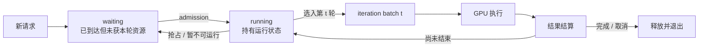
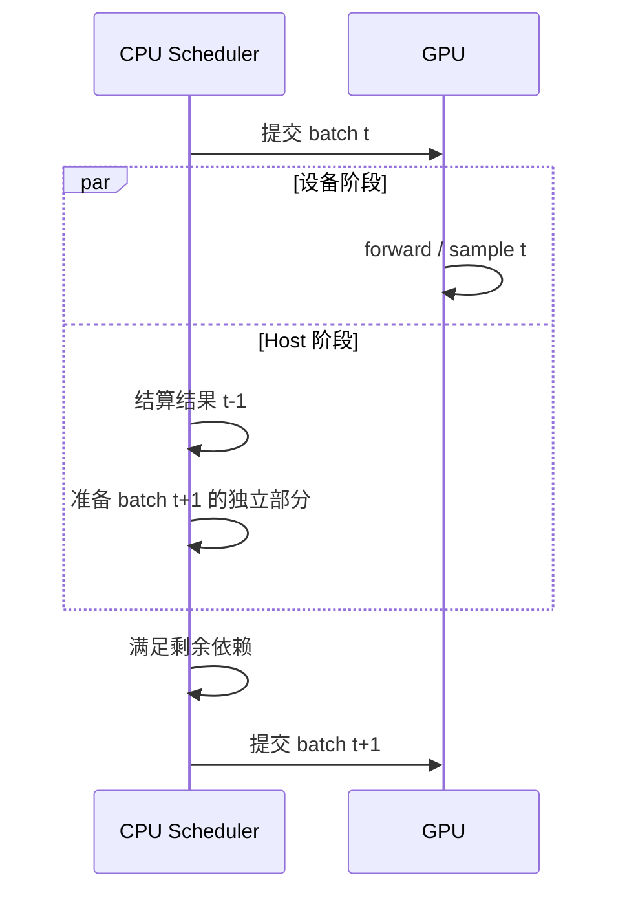

## 📑 目录
- [1. Decode 越快为什么越容易看见 CPU 空洞](#1-decode-越快为什么越容易看见-cpu-空洞)
- [2. Iteration-level Scheduling 到底在调度什么](#2-iteration-level-scheduling-到底在调度什么)
- [3. 普通串行流水线的关键路径](#3-普通串行流水线的关键路径)
- [4. Overlap 的核心是跨拍而不是少做工作](#4-overlap-的核心是跨拍而不是少做工作)
- [5. FutureMap 背后的延迟值思想](#5-futuremap-背后的延迟值思想)
- [6. 依赖与 Hazard 为什么必须同步](#6-依赖与-hazard-为什么必须同步)
- [7. 哪些状态可以晚一拍](#7-哪些状态可以晚一拍)
- [8. 公平性与缓存局部性](#8-公平性与缓存局部性)
- [9. 一个带单位的稳态算例](#9-一个带单位的稳态算例)
- [10. 怎样从 Timeline 读出因果](#10-怎样从-timeline-读出因果)
- [11. 设计取舍与何时关闭 Overlap](#11-设计取舍与何时关闭-overlap)
- [总结](#总结)
- [自我检验](#自我检验)
- [参考资料](#参考资料)

---

本文讨论推理引擎共有的调度与流水线问题，**SGLang 只作为落地案例**。
涉及实现行为时，版本固定为 **SGLang v0.5.17、Python SRT、生成模型路径**；后续版本可能改变同步边界和默认策略，不能把 `main` 分支行为倒推到本节。

第 2 章已经介绍 [Continuous Batching](/AIInfraGuide/inference/模块四-推理优化/第2章-推理引擎核心技术/22-continuous-batching) 和 [Chunked Prefill、Token Budget](/AIInfraGuide/inference/模块四-推理优化/第2章-推理引擎核心技术/24-chunked-prefill-与统一调度)。
本节换成 SGLang 视角，回答三个更具体的问题：

1. 长期存活的请求，怎样变成每轮短暂存在的执行批次？
2. GPU 为什么会在两个很短的 Decode step 之间等待 CPU？
3. 哪些状态能跨拍接力，哪些真实依赖绝不能越过？

这里不展开事件循环伪代码、具体函数或字段，也不提供 Benchmark 命令。重点是建立一套可迁移到其他推理引擎的分析方法。

贯穿案例中，`agent-trace-001` 的 final 请求 `agent-rid-001/final` 会经历多个 Decode step；下面的跨拍状态与 barrier 问题就发生在这条请求和同批其他请求之间。

## 1. Decode 越快为什么越容易看见 CPU 空洞
### 1.1 自回归生成由许多短 step 组成
Prefill 一次处理一段 Prompt，通常形成较大的矩阵计算；Decode 每轮只为每个活跃请求推进少量 Token，随后再决定下一轮做什么。

GPU 完成第 \(t\) 轮，不代表第 \(t+1\) 轮已经具备全部输入。两轮之间，Host 往往还要：

- 把设备结果对应回正确请求；
- 判断 EOS、长度上限、停止串和取消状态；
- 更新请求长度、采样状态与输出缓冲；
- 决定谁继续、谁退出、谁从等待状态进入；
- 预留 Token、KV Cache 和请求槽位；
- 构造下一轮元数据并发起设备工作。

其中有些只是记账，有些却是下一轮的真实输入依赖。若所有工作都遵循“GPU 完成 → CPU 做完 → 再启动 GPU”，再快的 GPU 也会在 step 之间留下空洞。

### 1.2 优化设备计算会放大固定 Host 成本
记一轮暴露在关键路径上的设备时间为 \(T_{\text{gpu}}\)，两轮之间未被隐藏的 Host seam 为 \(T_{\text{seam}}\)。
GPU 时间线中空洞所占比例近似为：

$$
\rho_{\text{gap}}
=
\frac{T_{\text{seam}}}{T_{\text{gpu}}+T_{\text{seam}}}
$$

Kernel 融合、CUDA Graph、量化或更快硬件持续压低 \(T_{\text{gpu}}\) 时，若调度、对象管理和小拷贝没有同比下降，\(\rho_{\text{gap}}\) 反而会上升。
这只是 Amdahl 定律在短迭代推理中的表现：被优化部分缩短后，原先不起眼的串行部分成为新瓶颈。

还要区分“CPU 很忙”和“GPU 被 CPU 卡住”。只有位于下一次设备提交关键路径上的 Host 工作才构成这里的空洞；日志或网络线程再忙，也不一定阻塞下一轮 forward。

## 2. Iteration-level Scheduling 到底在调度什么
### 2.1 长期 Request 不等于单轮 Batch
一个请求从到达到结束，可能经历数十到数千轮执行。它保存长期状态，例如输入、已生成 Token、停止条件、KV 所有权、优先级以及可选的结构化生成状态。

单轮 Batch 只是某个时刻的执行快照，回答：

- 本轮选择哪些请求，每个请求推进多少 Token；
- 读取和写入哪些 KV 位置；
- 使用什么形状、采样参数和执行后端；
- 本轮结果应映射回谁。

请求 A 可以连续出现在许多 Batch 中；请求 B 完成后，下一轮同一位置可能换成请求 C。把 Batch 当成请求生命周期，会导致身份映射和资源回收错误。

### 2.2 running 与 waiting 是状态语义
迭代级调度可抽象为下面的状态循环：



`running` 和 `waiting` 首先是语义，不要求所有引擎使用两个同名容器。running 请求已经持有可继续推进的状态；waiting 请求仍在等待 admission，或因依赖、资源、优先级暂不能执行。

每轮调度至少回答四个问题：

1. **Readiness**：输入、Grammar、媒体特征等前置状态是否就绪？
2. **Compute budget**：本轮可处理多少 Token、多少序列？
3. **Memory budget**：新增 KV、临时张量和请求槽位能否分配？
4. **Policy**：运行中请求与新请求谁优先，是否抢占或老化？

### 2.3 Token 预算只是 admission 的一部分
把请求 \(i\) 本轮计算量记为 \(c_i\)，常见约束可写为：

$$
\sum_i c_i \le B_{\text{token}},
\qquad
\sum_i \Delta KV_i \le B_{\text{KV}},
\qquad
|B_t| \le B_{\text{seq}}
$$

Decode 的 \(c_i\) 往往很小；Prefill chunk 和投机验证可能一次处理多个 Token。统一预算使它们能在同一窗口比较，但“预算可容纳”不等于“一定能入场”。

在 SGLang v0.5.17 中，RadixAttention 命中会减少实际 Prefill 和新增 KV，却不能替代 Grammar readiness、请求槽位、KV 可分配性与策略检查。所以缓存命中率高不能直接推出 TTFT 一定低。

迭代级调度提高资源周转速度，代价是调度发生得非常频繁。当 Decode 很短时，这份每拍固定成本正是需要隐藏的 Host 工作。

## 3. 普通串行流水线的关键路径
### 3.1 把一轮拆成三个阶段
为了分析而不是复刻某个实现，可把一轮简化为：

- \(T_{\text{pre}}\)：接收就绪状态、调度、组批和提交前准备；
- \(T_{\text{gpu}}\)：forward、采样及必要的设备内处理；
- \(T_{\text{post}}\)：结果等待、状态更新、停止判断和资源结算。

普通串行路径近似为：

$$
T_{\text{serial}}
=
T_{\text{pre}}+T_{\text{gpu}}+T_{\text{post}}
$$

这里应统计“暴露在关键路径上的时间”，而不是把 Timeline 上所有事件相加。D2H copy 可以异步发起；若 CPU 真正读取前它已被其他工作覆盖，其全部持续时间就不应重复计入 \(T_{\text{post}}\)。

### 3.2 串行来自依赖而不只是代码顺序
最保守的顺序是：

> 计划第 \(t\) 轮 → GPU 执行第 \(t\) 轮 → Host 结算第 \(t\) 轮 → 计划第 \(t+1\) 轮。

它容易保证正确性，却把“必须等待”和“碰巧写在后面”混在一起。真正的问题应改写为：

> 第 \(t+1\) 轮所需的每项状态，是否都必须先在 Host 结算第 \(t\) 轮？

若答案是否定的，就存在流水化空间；若答案是肯定的，强行异步只会把确定等待变成偶发 race。
对 \(N\) 个 Decode step，完全串行的理想化总时长为 \(N T_{\text{serial}}\)，Host seam 会随长输出重复累积。

## 4. Overlap 的核心是跨拍而不是少做工作
### 4.1 把上一拍结算藏进当前拍执行
Overlap 没有删除调度、结果处理或同步，只改变它们的时间位置：

> GPU 执行第 \(t\) 拍时，CPU 结算第 \(t-1\) 拍，并准备第 \(t+1\) 拍中不依赖当前结果的部分。



第 \(t\) 拍结果没有丢失，只是 Host 可见状态晚于设备结果完成。要让第 \(t+1\) 拍仍能前进，需要下一节的设备侧延迟值接力。

### 4.2 稳态公式与首尾 Bubble
把每拍工作重新分成：

- \(T_s\)：无论如何都不能跨越的串行 seam；
- \(T_h\)：可以与设备阶段并行的 Host 工作；
- \(T_g\)：设备工作。

串行与理想稳态分别近似为：

$$
T_{\text{serial}}=T_s+T_h+T_g
$$

$$
T_{\text{overlap}}^{\text{steady}}
=
T_s+\max(T_h,T_g)
$$

Overlap 的上限不是让 \(T_h+T_g\) 消失，而是让两者取较大者。若 \(T_h>T_g\)，CPU 溢出设备窗口，产生近似 \(\max(0,T_h-T_g)\) 的 GPU 等待；
若 \(T_g>T_h\)，Host 工作被隐藏，但 CPU 会有余量。

流水线还有首拍填充和末拍排空：

$$
T_N
\approx
T_{\text{fill}}+(N-1)T_{\text{overlap}}^{\text{steady}}+T_{\text{drain}}
$$

第一拍没有上一拍结果可结算，最后一拍必须清空在途状态。所以短输出、低并发或频繁 fallback 时，稳态公式会高估收益。

### 4.3 不能越过真实依赖
Overlap 的正确性原则不是“尽量不等”，而是：

> 只移动彼此独立的工作；对生产者到消费者的真实边，仍建立最窄同步。

代价包括在途 Batch 快照、设备缓冲、Event、生命周期管理，以及更困难的错误复现。它是流水线变换，不是免费加速开关。

## 5. FutureMap 背后的延迟值思想
### 5.1 下一拍需要值不等于 CPU 现在就要读值
普通 Decode 的下一输入，往往正是当前拍采样出的 Token。朴素路径执行“GPU 产出 → 拷到 CPU → CPU 写请求对象 → 再拷回 GPU”，形成逐 Token 往返。

更一般的做法是把结果视为**延迟值**：当前拍只承诺“这个值将在某个设备位置就绪”，下一拍设备消费者在真正使用前解析它；CPU 稍后再取得同一结果，用于输出、停止判断和记账。

SGLang v0.5.17 的 FutureMap 可以按这个抽象理解。它不是要求读者背诵 API，也不是普通线程池 Future；它代表按请求资源槽位组织的设备侧跨拍接力。该接力机制是 always-on 的数据路径，关闭调度 overlap 后普通路径仍可能使用它；`event_loop_overlap` 才是把 Host 与设备工作跨拍流水化的策略。

### 5.2 为什么必须使用稳定 Request Slot
假设第 \(t\) 拍顺序是 `[A, B, C]`，第 \(t+1\) 拍变成 `[C, A, D]`。若结果按 Batch position 保存，第 \(t\) 拍位置 0 的 A，会被下一拍位置 0 的 C 错读。

因此需要一个在本次 slot residency / allocation epoch 内稳定的 slot：

1. 当前拍按请求 slot 把结果 **scatter** 到设备缓冲；
2. 生产者写完后 **publish** 可见性；
3. 下一拍按新 Batch 的 slot 顺序 **gather**；
4. 消费者在需要时 **resolve** 延迟值。

Batch 可以重排，稳定 slot 仍把值送回正确请求。
稳定的是一次占用 epoch 内的身份；请求被 retract/preempt 后即使逻辑生命周期仍在，也可能重新分配另一个 slot，更不意味着 slot 永不复用。

### 5.3 能力边界与代价
FutureMap 适合接力设备已产生、下一设备阶段又要消费的值，例如下一 Token 或某些长度信息。
它不能自动完成 Host 侧语义：

- 不会判断停止串或决定何时向客户端提交文本；
- 不会推进 CPU 上的 Grammar 状态机；
- 不会证明资源已经可以安全回收。

代价是常驻缓冲、scatter/gather、可见性同步和 slot 生命周期约束。它解决数据路径，不等于解决整个调度器。

## 6. 依赖与 Hazard 为什么必须同步
### 6.1 RAW 读者必须看见新值
RAW（Read After Write）表示消费者必须读到生产者的新结果。
例如第 \(t+1\) 拍读取第 \(t\) 拍采样 Token：

> 写入 Token → 发布完成 → 下一拍读取。

若写和读位于同一设备 Stream，Stream 内顺序通常已建立 happens-before；若跨 Stream，就需要 Event 或等价依赖。CPU 已经 enqueue 两个操作，不代表前一个设备操作已经完成。

Event 应记录在真正生产完成之后，并由真正消费者等待。全局同步虽然容易掩盖 race，却会把无关工作也压回串行。

### 6.2 WAR 防止过早覆盖共享存储
WAR（Write After Read）表示前一拍还在读，后一拍就覆盖同一物理存储。设 GPU 第 \(t\) 拍仍在读取缓冲 X，CPU 已准备第 \(t+1\) 拍并重写 X。Host 函数返回或 Kernel 已发射，都不能证明 GPU 已读完 X。

安全方案通常有两类：

- **精确等待**：读者完成后记录 Event，下一写者只等待这条边；
- **Double Buffering**：奇偶拍写不同缓冲，延长可复用间隔。

Double Buffering 不是免同步。流水线再次绕回同一缓冲时，仍须证明更早读者已经结束；它只是用空间换取更长并行窗口。

### 6.3 Slot 复用会产生 ABA
稳定 slot 也有生命周期问题：

1. 请求 A 占用 slot 7，并留下延迟写入；
2. A 结束，slot 7 被过早释放；
3. 请求 B 获得同一个 slot 7；
4. A 的旧写入晚到，看起来却像 B 的当前数据。

slot 编号经历“7 → 释放 → 7”，只比较编号无法区分新旧，这就是 ABA。通用防护包括：在途工作排空后再复用、为 slot 附加 generation/epoch，或让异步消息携带生命周期标识并在消费时校验。

RAW 保护“不要读旧值”，WAR 保护“不要过早覆盖”，ABA 保护“不要把旧生命周期误认成新生命周期”。
三者不能用一个“加锁”口号含糊带过。

## 7. 哪些状态可以晚一拍
### 7.1 判断标准是下一消费者
一个状态能否晚一拍，不取决于它是否“重要”，而取决于：

> Host 结算完成前，是否存在必须读取它的正确性消费者？

若下一消费者只负责日志、指标或客户端封装，通常可以延迟；
若它决定下一 Token 的合法集合、KV 位置或资源所有权，就必须 barrier。

### 7.2 通常可以延迟的状态
在设备已有安全接力、且资源仍保留的前提下，以下工作常可晚一拍：

- sampled Token 的 Host mirror；
- 请求对象输出列表更新；
- 流式响应封装和非关键指标；
- 上一 Batch 的统计与不影响执行的清理；
- 对“可能即将完成”的 Host 可见通知。

“可以延迟”不等于“可以丢失”，也不等于资源可以马上复用。
实现必须保留 Batch 快照和请求身份，直到结算完成。

### 7.3 必须在语义边界前完成的状态
以下依赖通常要求局部 barrier；无法满足时应退回串行：

- **finish / stop**：可容忍设备多算一小步时，Host 判定可稍晚；
  但在提交越界输出、释放 KV 或复用 request slot 前必须确定；
- **资源回收**：所有仍引用资源的 Stream 和延迟结果必须完成；
- **Grammar**：上一 Token accept 后，才能构造下一 Token 的合法集合；
- **Speculative accept**：接受长度决定可提交 Token、有效 KV 和下一位置；
- **连续 Prefill**：若下一 chunk 依赖精确偏移、KV 记账，
  或复用仍在读的 staging buffer，必须先满足相应依赖。

Barrier 不等于全局同步。
优先使用 producer-consumer Event、局部等待或双缓冲；
只有无法表达更细依赖时，才把整拍退回普通顺序。

在 SGLang v0.5.17 中，FutureMap 让部分设备值跨拍，
但 Grammar、投机接受和某些连续 Prefill 路径仍可能同步或 fallback。
下一节 [12.5 结构化生成与 Agent 基础设施](/AIInfraGuide/inference/模块四-推理优化/第12章-深入sglang/125-结构化生成与agent能力) 会沿 `mask → sample → accept` 展开 Grammar 为什么不能被设备 Token 接力替代。

## 8. 公平性与缓存局部性
### 8.1 调度目标不只有吞吐
调度器同时面对多组冲突指标：

- **吞吐**：单位时间完成多少 Token 或请求；
- **TTFT**：新请求多久得到首 Token；
- **TPOT**：运行中请求相邻 Token 的间隔；
- **P99**：少数慢请求是否被长期拖延；
- **Goodput**：在 SLO 内完成的有效工作量。

优先保证 running 请求前进通常有利于 TPOT，
却可能让 waiting 请求 TTFT 上升；
不断接纳短请求可提高完成数，又可能让长请求饥饿。

### 8.2 缓存局部性也是一种偏好
优先选择共享前缀多、KV 已命中的请求，可减少 Prefill 并提高吞吐。
但若总追逐“最便宜的请求”，缓存冷的新租户可能长期等不到 admission。

常见平衡手段包括等待时长老化、租户配额、优先级上限、
Decode 保留预算和 Prefill chunk 上限。
它们牺牲部分瞬时局部性，换取尾延迟可控。

Overlap 只缩短既定决策下暴露的 Host seam，不会自动消除饥饿。
Batch 增大可能提高吞吐，却拉长单轮 \(T_g\)，抬高 TPOT；
晚一拍结算还会让完成请求多保留一段资源。
所以 GPU 更连续，不代表端到端 P99 一定改善。

## 9. 一个带单位的稳态算例
下面只有一组教学数字，不代表 SGLang 官方 Benchmark。
假设 Batch 形状稳定、无额外通信，各项均为关键路径暴露时间：

```text
设备阶段 Tg               = 1.80 ms / iteration
可隐藏 Host 阶段 Th       = 0.60 ms / iteration
不可跨越串行 seam Ts      = 0.10 ms / iteration
可安全 overlap 的拍占比 e = 80%
其余 20% 按串行路径执行
```

普通路径每拍为：

$$
T_n
=T_s+T_h+T_g
=0.10+0.60+1.80
=2.50\ \text{ms}
$$

可重叠拍的理想稳态为：

$$
T_e
=T_s+\max(T_h,T_g)
=0.10+\max(0.60,1.80)
=1.90\ \text{ms}
$$

因为 \(T_h<T_g\)，可隐藏 Host 工作全部落入设备窗口。
该拍仍有 \(0.10\ \text{ms}\) 串行 seam；
由 Host 溢出造成的额外 GPU bubble 为：

$$
B_{\text{host-overrun}}
=\max(0,T_h-T_g)
=0
$$

按 eligible 与 fallback 比例做教学平均：

$$
\bar T
=eT_e+(1-e)T_n
=0.8\times1.90+0.2\times2.50
=2.02\ \text{ms}
$$

对应理想稳态速度比：

$$
S
=\frac{T_n}{\bar T}
=\frac{2.50}{2.02}
\approx1.24
$$

设备忙碌比例从串行时约 \(1.80/2.50=72\%\)，
提高到教学平均下约 \(1.80/2.02=89.1\%\)。

结果依赖四个强前提：fallback 不成簇、\(T_g\) 稳定、
没有新内存压力、首尾 Bubble 可忽略。
短输出必须把填充和排空加回；生产结论还要看 TTFT、TPOT 和 P99，
不能只引用这个 \(1.24\times\)。

## 10. 怎样从 Timeline 读出因果
Timeline 的目标不是寻找“看起来不满”的区域，
而是重建“谁在等待谁”的 producer-consumer 链。

### 10.1 GPU 空洞
若每个 Decode Kernel 后都有相似间隔，且下一次提交前
Scheduler 正在处理结果或组批，优先怀疑暴露的 Host seam。
若 CPU 很早已提交，GPU 仍晚执行，还要考虑 Stream 依赖、
前序 Kernel、通信或设备排队；白色区域本身不能证明 CPU 慢。

### 10.2 D2H 与同步点
小型 D2H 常把 Token、长度或状态带回 Host。
关键是 CPU 在哪里第一次读取结果并因此等待。
若因果链是“D2H → Host 读取 → 更新状态 → 下一次提交”，
结果回传就在关键路径；
若 D2H 已与设备计算并行且读取时早已完成，它就不是主要空洞。

### 10.3 Copy Stream 与 Event
独立 Copy Stream 只提供并行机会，不保证一定重叠。
Pageable memory、拷贝引擎竞争、同 Stream 排序或过宽 Event wait，
都可能让 copy 实际串行。
反过来，copy 排在 forward 后也可能是正确 RAW 依赖；
依据应是数据生产关系，而不是要求两条泳道必须并排。

### 10.4 Queue wait
GPU 几乎无空洞，但请求长时间停在 waiting，
通常指向 admission、KV 容量、公平策略或前置依赖。
这时压缩 Kernel 间 Host seam 未必改善该请求 TTFT。

可信分析要把 iteration、Batch 与 request 身份关联，
并区分 enqueue、设备开始和设备完成时间，
否则容易把排队结果误读成执行原因。

## 11. 设计取舍与何时关闭 Overlap
### 11.1 Overlap 最适合什么负载
收益通常出现在：

- Decode step 短而重复次数多；
- 有足够并发形成稳定流水线；
- Host 工作能放入设备窗口；
- 大部分拍不触发强 barrier；
- 在途状态不会造成显著内存压力。

若 \(T_h\) 远大于 \(T_g\)，Overlap 仍可能隐藏一部分时间，
但系统最终受 CPU 吞吐限制。
此时还要减少对象分配、合并调度操作或并行化 Host 工作，
不能期待流水线消灭 CPU 瓶颈。

### 11.2 应关闭或局部降级的情况
以下情况适合先用普通路径，或只对安全 Batch 开启：

- 新后端、自定义 Kernel 或共享缓冲生命周期尚未证明正确；
- Grammar、Speculative accept 等强依赖使 eligible ratio 很低；
- 负载以短输出或大 Prefill 为主，首尾 Bubble 占主导；
- KV / request slot 紧张，额外一拍保留阻塞 admission；
- Event、scatter/gather 和额外拷贝成本超过被隐藏的 Host 时间；
- 使用 Pipeline Parallel 的 v0.5.17 路径：`pp_size>1` 会关闭 overlap，且该版本不允许再叠加 speculative decoding；
- 正在排查 race，需要确定执行顺序缩小问题范围。

“关闭”应由正确性证据或端到端指标决定。
不能只看平均吞吐：TTFT、TPOT、P99、取消响应和资源峰值都要纳入。

对 SGLang v0.5.17，应把 overlap 视为有版本边界的调度策略。
某条路径 fallback，不代表 FutureMap 失败；
它通常表示本轮存在不能安全晚一拍的状态依赖。

到这里，问题自然交给 [12.5 结构化生成与 Agent 基础设施](/AIInfraGuide/inference/模块四-推理优化/第12章-深入sglang/125-结构化生成与agent能力)：当下一轮合法 Token 集合依赖上一 Token 的 Grammar accept 时，barrier 应放在哪里，才能既不破坏状态机，又保留最多重叠窗口？

## 总结
Iteration-level Scheduling 在长期 Request 生命周期上，
不断构造短暂的单轮 Batch，并满足 readiness、Token、KV 和公平性约束。

普通路径把 Host 准备、GPU 执行和 Host 结算串在一起；
Overlap 让第 \(t-1\) 拍 Host 结算与第 \(t\) 拍 GPU 执行并行。
它减少暴露时间，不减少工作量，也不能越过真实数据依赖。

FutureMap 代表通用的设备侧延迟值思想：
稳定 slot 负责身份，scatter/gather 负责重排，
publish/resolve 负责可见性；
RAW、WAR 和 ABA 分别约束值、共享存储与生命周期。

是否值得开启，取决于 eligible ratio、首尾 Bubble、资源压力和 SLO。
GPU 空洞减少只是中间证据，吞吐、TTFT、TPOT 与 P99 才是服务结果。

## 自我检验
1. 固定 \(T_{\text{seam}}\) 时，推导为什么 \(T_{\text{gpu}}\) 越小，
   \(\rho_{\text{gap}}\) 越大。
2. 给出一个请求跨三轮运行的例子，分别列出长期 Request 状态
   和每轮 Batch 快照，说明两者为何不能合并。
3. 从 \(T_s,T_h,T_g\) 推导串行时间与 overlap 稳态时间，
   并讨论 \(T_h>T_g\) 和 \(T_h<T_g\)。
4. 解释首拍填充与末拍排空为何使短输出达不到稳态速度比。
5. 令 Batch 从 `[A,B,C]` 重排为 `[C,A,D]`，
   推导按 position 接力为何错误，稳定 slot 怎样修复。
6. 分别构造 RAW、WAR 和 ABA 失败例子，
   为每个例子选择 Event、双缓冲、epoch 或延迟复用。
7. 判断 finish、资源回收、Grammar accept、Speculative accept
   哪些可以晚一拍，并指出各自的下一消费者。
8. 解释为何缓存局部性优先可能提高吞吐却恶化部分请求 P99。
9. 给定含 GPU gap、D2H、Copy Stream 和 queue wait 的 Timeline，
   写出两条竞争因果假设，以及区分它们所需的证据。
10. 修改第 9 节 \(T_h\) 或 eligible ratio，
    重算 \(\bar T\)、Host overrun Bubble 和理想速度比。

## 参考资料
- [SGLang v0.5.17 Release](https://github.com/sgl-project/sglang/releases/tag/v0.5.17)
- [SGLang v0.5.17 Source Tag](https://github.com/sgl-project/sglang/tree/v0.5.17)
- [SGLang: Efficient Execution of Structured Language Model Programs](https://arxiv.org/abs/2312.07104)
- [Orca: A Distributed Serving System for Transformer-Based Generative Models](https://www.usenix.org/conference/osdi22/presentation/yu)
- [SARATHI: Efficient LLM Inference by Piggybacking Decodes with Chunked Prefills](https://arxiv.org/abs/2308.16369)
- [CUDA C++ Programming Guide: Asynchronous Execution](https://docs.nvidia.com/cuda/cuda-c-programming-guide/index.html#asynchronous-concurrent-execution)

> 实现相关结论固定到 SGLang v0.5.17；公式与数字用于教学推导，
> 不替代目标模型、硬件和业务负载上的端到端测量。
