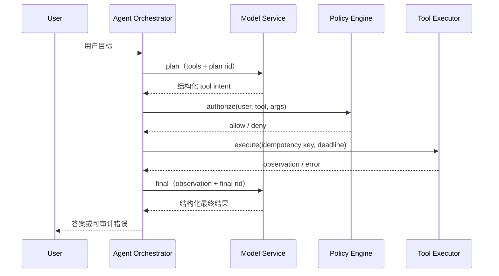

## 📑 目录
- [1. 为什么生成后 parse 不够](#1-为什么生成后-parse-不够)
- [2. Constrained Decoding 的状态机](#2-constrained-decoding-的状态机)
- [3. Tokenizer 与 Grammar 的边界](#3-tokenizer-与-grammar-的边界)
- [4. 编译阶段与请求阶段](#4-编译阶段与请求阶段)
- [5. 约束如何进入调度关键路径](#5-约束如何进入调度关键路径)
- [6. Bitmask 显存与带宽算例](#6-bitmask-显存与带宽算例)
- [7. 投机解码与 Grammar](#7-投机解码与-grammar)
- [8. Tool Calling 的三层职责](#8-tool-calling-的三层职责)
- [9. Agent 控制平面](#9-agent-控制平面)
- [10. 安全与正确性分层](#10-安全与正确性分层)
- [11. 缓存、调度与 Agent 的耦合](#11-缓存调度与-agent-的耦合)
- [12. 延迟账本与可观测性](#12-延迟账本与可观测性)
- [13. SGLang v0.5.17 实现地图](#13-sglang-v0517-实现地图)
- [14. 交给 12.6 的生产问题](#14-交给-126-的生产问题)
- [总结](#总结)
- [自我检验](#自我检验)
- [参考资料](#参考资料)

---

本节先讲与框架无关的机制，再把概念映射到 **SGLang v0.5.17 Python SRT**。结构化生成不是“让模型更听话”的提示词技巧，而是在每个采样步改变可选 Token 集合，并把语言约束、Tokenizer、CPU 状态机、GPU 采样和调度器连接起来。Tool Calling 也不是模型替应用调用函数；模型只产生结构化意图，真正的授权、执行、重试和副作用控制属于 Agent 控制平面。第 8 章已给出接口全景，本节关注这些能力为什么可靠、代价落在哪里，以及它们怎样改变推理关键路径。

## 1. 为什么生成后 parse 不够

### 1.1 失败发生时，计算已经支付

最简单的方案是让模型自由生成文本，结束后再调用 JSON parser。格式错误可能是多出解释、括号缺失、字段或类型错误、工具名拼错，也可能是长度上限和流中断造成的截断。

解析器只能报告失败，不能取回已经消耗的 Prefill、Decode 和排队时间。若应用重试，还要再经历一次模型调用。

设单次解析失败概率为 \(p\)，各次尝试近似独立且成本相同，成功前期望尝试次数为：

$$
\mathbb E[N]=\frac{1}{1-p}
$$

即使 \(p=2\%\)，一万次请求也约有两百次首轮失败；重试会重新入队，在峰值期放大尾延迟。

### 1.2 非法前缀可能不可恢复

自由生成一旦输出不合法前缀，后续 Token 未必能修复它。受约束解码采取相反策略：

> 只允许仍然存在合法完成路径的 Token 被采样。

它把错误从“生成结束后的异常”变成“采样前不可选的候选”。可靠性来自候选空间收缩，不是更强的模型自律。

### 1.3 结构合法不等于业务正确

结构约束不能判断集群是否存在、用户是否有权限、数据是否过期、决策是否符合容量策略，也不知道写操作是否已经执行。

```text
可解析：字节序列是完整 JSON
Schema valid：字段、类型和枚举满足结构契约
Business valid：事实、权限、状态和业务不变量成立
```

只有生成正常到达接受状态时，约束才承诺结构完整。外部取消、长度上限或流中断仍可能留下半个对象，调用方必须检查结束原因。

## 2. Constrained Decoding 的状态机

### 2.1 Grammar 描述允许生成的语言

Grammar \(G\) 定义合法字符串集合 \(\mathcal L(G)\)。JSON Schema、正则、枚举和 EBNF 最终都可转成某种可推进的匹配结构。

已生成前缀 \(y_{<t}\) 对应状态 \(s_t\)。状态可能包含栈、已见字段集合或多个自动机状态，不一定只是整数。

真正的问题不是“前缀现在是否合法”，而是“从此前缀是否还存在后缀能到达接受状态”。若不存在，就进入死状态 \(\bot\)，候选必须在采样前被排除。

### 2.2 字符约束怎样变成 Token mask

模型输出 Token \(v\in\mathcal V\)，Grammar 通常描述字符或字节。令 \(b(v)\) 为 Token 的字节序列：

$$
s'=\delta(s_t,b(v))
$$

若 \(s'\neq\bot\)，且从 \(s'\) 仍可到达接受态，\(v\) 才被允许：

$$
A_t=\{v\in\mathcal V\mid
\delta(s_t,b(v))\neq\bot
\land s'\text{ 可达接受态}\}
$$

运行时把允许集合编码成词表大小的 mask：

$$
m_t(v)=
\begin{cases}
0, & v\in A_t\\
-\infty, & v\notin A_t
\end{cases}
$$

模型先产生 logits \(z_t\)，再应用 \(z'_t=z_t+m_t\)。Temperature、Top-k、Top-p 随后只在合法集合内工作；约束不负责判断哪个合法候选的语义更好。

### 2.3 正确顺序是 mask、sample、transition

```text
读取状态 s_t
→ 构造 Token mask
→ mask 作用于 logits
→ sample token_t
→ 提交 token_t
→ 状态转移到 s_{t+1}
```

对应：

$$
x_t\sim P_\theta(\cdot\mid y_{<t},A_t),
\qquad
s_{t+1}=\delta(s_t,b(x_t))
$$

不能先 sample 再验证，因为非法 Token 已成为模型历史；也不能先推进状态，因为 matcher 会比真实输出提前一步。EOS 只应在接受条件满足时进入合法集合，但服务端超时和取消仍可从 Grammar 外终止请求。

### 2.4 简化 JSON 状态推导

假设目标要求 `action` 为枚举、`target` 为字符串，选择一条合法序列：

```json
{"action":"scale","target":"gpu-prod"}
```

```text
s0 等待 {                 s4 等待 ,
s1 等待 "action"          s5 等待 "target"
s2 等待 :                 s6 等待字符串值
s3 等待 "scale" 或 "hold" s7 等待 }，随后接受
```

在 \(s_3\) 中，`"delete"`、数字和直接闭合对象都应被屏蔽。这只是便于手推的一条序列，不表示 JSON Schema 规定对象键顺序；真实 matcher 也按 Token 字节而非这些字符边界推进。

## 3. Tokenizer 与 Grammar 的边界

### 3.1 Token 不是字符

一个 Token 可能是标点、多字符文本、带前导空格的片段、Unicode 字符的全部或部分字节，也可能同时跨过 JSON 的键、冒号和值。

所以“下一个合法字符是 `{`”不等于“只开放一个 `{` Token”。某 Token 必须完整消费后仍处于可完成状态；只要后半段越界，即使开头合法，也要整体屏蔽。

### 3.2 UTF-8、跨 Token 字节与特殊 Token

Tokenizer 可能把一个 Unicode 字符拆到多个 Token 的字节表示中。Grammar 引擎需要保留“等待后续字节”的中间状态，不能把每个 Token 独立解码成字符串再判断。

EOS、控制符和模型专用 Token 也要单独处理。它们未必属于用户可见文本，却会影响结束条件或模板协议。

因此 compiled grammar 通常与 Tokenizer 词表绑定。换模型或 Tokenizer 后，即使 Schema 文本相同，也不能盲目复用旧的 Token 映射产物。

### 3.3 JSON key 顺序连接语义与序列

JSON 对象语义上无序，模型输出却必然是有序 Token 序列。若 Grammar 允许任意字段顺序，就要追踪哪些必需字段已经出现。

对 \(n\) 个可交换字段，朴素状态空间可能接近 \(2^n\) 个已见集合。实际编译器会合并或惰性展开，但大量可选字段仍会增加复杂度。

稳定字段顺序有利于 Schema cache key、工具 Prompt 前缀复用和审计比较。但这只是工程约定；不要为了命中缓存而重排 `enum`、元组式数组等有序结构。

### 3.4 Jump-forward 为什么要 retokenize

若当前状态只有唯一合法字面量，运行时可跳过逐 Token 采样。但 Tokenizer merge 可能跨越旧尾部与新增字面量边界：

$$
\operatorname{tokenize}(text)+\operatorname{tokenize}(literal)
\neq\operatorname{tokenize}(text+literal)
$$

正确实现要在边界附近重新分词，找出公共 Token 前缀，并同步校准输出 IDs、KV 已提交位置、Grammar 状态和文本偏移。Jump-forward 节省模型计算，却增加 retokenize 与状态对齐成本。

## 4. 编译阶段与请求阶段

### 4.1 编译把声明变成快速查询结构

Schema 不适合每步从头解释。编译通常要解析约束、构造自动机或解析表、计算词表相关转移、建立 mask 索引，最后得到可复用的 compiled context。

成本主要支付在生成前，并随 Schema 复杂度、词表大小和 backend 设计变化。它是 CPU 延迟，不应被埋进笼统的“模型 TTFT”。

### 4.2 Cache key 必须代表编译语义

理想 key 至少区分：

```text
约束类型 + 规范化内容 + backend/version
+ tokenizer/vocab 身份 + 影响编译的选项
```

只用原始字符串会让空白和对象键序列化差异产生多个 key；但“语义规范化”也不能简单排序所有数组，因为部分数组具有顺序语义。

安全做法是使用稳定的 Schema 生成器、显式版本号和确定性对象键序列化。对 SGLang v0.5.17，也不应假设服务端会自动合并语义等价的不同字符串。

### 4.3 编译产物共享，请求状态隔离

一百个请求使用同一 Schema 时可以共享只读 compiled context，但必须拥有独立 matcher state。A 可能刚生成 `{`，B 已进入第二个字段；共享游标会让 A 的 Token 改变 B 的 mask。

```text
compiled context：按 cache key 共享
matcher state：按请求创建并独立推进
```

复制轻量 matcher 不等于复制整份大型编译表，重点是隔离可变状态。

### 4.4 Cache miss、击穿与 grammar queue

一批请求同时 miss 并重复编译同一 key，会形成 cache 击穿。通用治理包括 single-flight、并发编译上限、队列容量与超时、热门 Schema 预热、非法 Grammar 负缓存，以及动态 Schema 配额。

等待编译的请求还不能安全生成。在 SGLang v0.5.17 案例中，它先位于 grammar queue，ready 后才进入普通调度等待。

```text
compile queue wait：等待 CPU 编译资源
compile time：构造 compiled context
scheduler wait：Grammar ready 后等待 GPU admission
```

三者必须分别观测，否则无法判断该扩编译资源、治理 Schema，还是增加模型容量。

## 5. 约束如何进入调度关键路径

### 5.1 Grammar 未 ready 不能 admission

调度器只有在请求具备首步合法 mask 后，才能安全放入 batch。若先占 batch slot 再等编译，GPU 容量会被不可运行请求阻塞。

```text
请求到达 → Grammar lookup/compile → matcher ready
→ admission → 分配请求与 KV 资源 → Prefill/Decode
```

前缀 KV 已命中也不能跳过 Grammar readiness。Radix 缓存复用历史计算，Grammar 编译决定下一 Token 的合法集合，两者是不同前置条件。

### 5.2 CPU 状态形成跨 step 依赖

第 \(t\) 步 mask 依赖 \(s_t\)，而 \(s_t\) 来自已经提交的前缀。若 matcher 在 CPU 上：

```text
GPU 产生 logits_t → 应用 mask(s_t) → sample x_t
→ CPU 确认提交 x_t → 推进到 s_{t+1} → 构造下一步 mask
```

第 12.4 节的 CPU-GPU overlap 可以隐藏无冲突工作，却不能删除依赖。下一步读取 matcher 前必须存在 transition barrier；优化正确性的标准是“mask 是否严格对应已提交前缀”。

### 5.3 Mixed batch 有系统级代价

Continuous Batching 会混合不同 Grammar 和普通请求。若实现按完整 batch 分配稠密 mask，未约束行也会占位，只是全部允许。

把 constrained 请求单独组批可减少普通请求开销，却可能降低填充率并增加排队。是否分组要由受约束比例、mask 成本、延迟 SLO 与 GPU 利用率共同决定。

## 6. Bitmask 显存与带宽算例

以下是教学假设，不代表所有 backend 的布局：

```text
词表 V = 151,936；batch B = 128
机器字 w = 32 bit；每字 4 Bytes
```

每行机器字和字节数：

$$
N_{\text{word}}=\left\lceil\frac{151936}{32}\right\rceil=4748
$$

$$
M_{\text{row}}=4748\times4=18992\text{ Bytes}\approx18.55\text{ KiB}
$$

完整稠密 batch：

$$
M_{\text{batch}}=18992\times128=2430976\text{ Bytes}\approx2.32\text{ MiB}
$$

即使只有 64 行受约束，只要布局仍为 \(B\times\lceil V/32\rceil\)，占用就不会自动减半。只压缩 constrained rows 可降至约 \(1.16\) MiB，但要增加行索引与 scatter。

若每秒 50 个 Decode step，且每步把完整 mask 从 host 搬到 device：

$$
BW_{\text{mask}}\approx2.32\times50=116\text{ MiB/s}
$$

它通常不是 HBM 主带宽，却会叠加 CPU 填充、PCIe 搬运、同步点和 kernel launch。核心是 \(O(BV)\) 形状随 batch 与词表同时扩张；device 增量生成或稀疏布局会得到不同结果，必须以 profiler 为准。

## 7. 投机解码与 Grammar

### 7.1 正确目标是受约束分布

加入 Grammar 后，Target 分布是：

$$
p_G(v\mid s)=
\frac{p(v)\mathbf 1[v\in A(s)]}
{\sum_{u\in A(s)}p(u)}
$$

一种常见的高效做法，是让 Draft 也在同一合法集合上形成：

$$
q_G(v\mid s)=
\frac{q(v)\mathbf 1[v\in A(s)]}
{\sum_{u\in A(s)}q(u)}
$$

但这不是正确性的必要条件。把实际提议分布统一记为 \(r\)：它既可以是受约束的 \(q_G\)，也可以是未约束的 \(q\)。标准随机投机采样必须使用真实的 \(r\) 计算：

$$
\alpha(v)=\min\left(1,\frac{p_G(v)}{r(v)}\right)
$$

拒绝后再从归一化残差 \((p_G-r)_+\) 采样。若 \(r=q\)，非法 Token 的 \(p_G=0\)，会被拒绝但仍保持精确性，只是提议效率较低。目标是保持 \(p_G\)，不是要求 Draft 分布等于 Target；真正错误的是用 \(q\) 提议，却按另一个分布计算接受率，或验证后简单删除非法 Token 而不做残差修正。

### 7.2 候选树需要分支状态

Draft 可能提出序列或候选树，每条分支都对应从 live state 出发的临时 Grammar 路径。进入死状态的分支可剪枝；到达不同 matcher state 的分支不能共享可变游标。

实现可以复制轻量状态、保存快照或使用函数式转移，但试探状态不能提前污染 live request。

### 7.3 只提交 accepted prefix

若 Draft 提出 `[a,b,c]`，Target 只接受 `[a,b]`，则输出、KV、采样历史和 Grammar 都只能提交到相同长度：

```text
live state = δ(δ(s,a),b)
c 的 KV、输出和试探状态全部丢弃或回滚
```

若候选中途到达接受态，后缀也不能越过结构终点。Rollback 的本质不是某个方法名，而是维持“所有可见状态对应同一已提交前缀”的不变量。

投机解码的概率推导见 [5.1 核心原理](/AIInfraGuide/inference/模块四-推理优化/第5章-speculative-decoding/51-核心原理)。

## 8. Tool Calling 的三层职责

### 8.1 Prompt 与 Chat Template

第一层解决“模型看到了什么协议”。统一工具声明要翻译成模型训练时熟悉的工具名、参数 Schema、调用边界和历史 tool result 格式。

模板与模型不匹配时，模型可能把声明当普通文本，或输出另一种标记。结构约束无法弥补完全错误的对话协议。

### 8.2 受约束生成与解析

第二层解决“输出能否稳定还原为意图”：

```text
受约束生成：采样前阻止结构非法 Token
Parser：生成后识别模型专用边界并构造 tool_calls
Validator：检查参数 Schema 与业务规则
```

Parser 成功不代表可以执行。模型仍可能选择不适用于当前用户的工具，或生成格式合法但越权的参数。

### 8.3 业务 Executor

第三层才接触真实世界。Executor 负责工具 allowlist、资源级授权、凭据隔离、业务校验、timeout、并发、幂等、补偿、结果大小和审计。

模型服务应返回“调用什么”的结构化建议，而不直接持有生产凭据执行函数。Tool Calling 是协议化意图生成，不是远程执行框架。

## 9. Agent 控制平面

### 9.1 Plan 到 final 的状态机

最小闭环是 `plan → authorize → execute → observe → final`。Plan 和 final 是两次独立模型调用，工具执行位于中间。



Policy deny、工具超时和模型失败都应是显式状态，不要让一段自由文本同时承担状态转移与用户展示。

### 9.2 标识不要混用

```text
trace_id：贯穿用户任务
rid：一次模型请求的一次 attempt
tool_call_id：一次逻辑工具意图
idempotency_key：Executor 去重同一逻辑副作用
```

Plan 与 final 共享 trace，但用不同 rid；模型重试也要有新 attempt rid。Executor 重试同一逻辑调用时幂等键保持稳定，而用户后来发起的新任务不能误用旧 key。

贯穿案例固定为：

```text
trace_id = agent-trace-001
plan rid = agent-rid-001/plan
final rid = agent-rid-001/final
```

### 9.3 Timeout、retry 与副作用

端到端 deadline 要拆给 Grammar/排队、Plan、Policy、Executor、Final 和安全余量。每层都应读取剩余预算，不能让多个独立 timeout 相加后远超用户 deadline。

只读、可重放工具可在退避和总预算内重试。有副作用的工具需要服务端幂等键、事务记录或可查询状态。

分布式系统通常无法只靠客户端做到绝对 exactly-once。超时且结果未知时，应查询状态、补偿或转人工，而不是盲目再写一次。

## 10. 安全与正确性分层

### 10.1 五道门回答不同问题

1. **Syntax valid**：是否完整可解析；
2. **Schema valid**：类型、字段和枚举是否匹配；
3. **Business valid**：对象和业务不变量是否成立；
4. **Authorized**：主体能否对目标执行工具；
5. **Execution safe**：副作用、频率、成本和回滚是否可控。

Constrained decoding 主要增强前两层，后三层必须由确定性业务代码完成。即便使用 JSON Schema，也要用独立 validator 复核 backend 实际支持的约束子集；`{"action":"scale","target":"prod"}` 可以满足结构，却仍可能越权或引用错误资源。

### 10.2 Prompt injection 不会被 Schema 消除

工具结果、网页和检索文档都应视为不可信输入。攻击指令可以被包在完全合法的 JSON 字符串中，诱导模型扩大权限。

防护要放在模型之外：最小权限、数据与指令分界、Policy Engine 复核、不向模型暴露密钥、高风险写操作确认或审批。Grammar 限制输出形状，不是内容安全过滤器。

### 10.3 工具结果要限制大小

无限制回填结果会提高 Token 成本和 TTFT、破坏前缀复用、触发上下文截断并扩大注入面。Executor 应限制字节数和 content type，进行截断或结构化摘要。

原始大结果可放受控对象存储，只回填引用、摘要和完整性 hash。审计则记录主体、trace、模型/模板/工具/Schema 版本、Policy 决定、幂等键、attempt、实际副作用与最终状态，并对敏感内容脱敏。

## 11. 缓存、调度与 Agent 的耦合

### 11.1 Grammar cache 与 KV cache 不同

Grammar compile cache 复用约束编译产物，Radix/KV cache 复用相同 Prompt Token 的模型计算。稳定工具集合同时有利于二者：

- Schema 版本固定，compiled grammar 易命中；
- 工具描述与顺序固定，Prompt 前缀易复用；
- 模板稳定，Token 边界更可预测。

每请求唯一 Schema 会制造 compile miss；若它也进入 Prompt，还会造成前缀碎片。时间戳、随机 ID 和用户私有内容应尽量放在稳定前缀之后。

### 11.2 CPU 编译会反压 GPU admission

Grammar 编译消耗 CPU，但其队列推迟 GPU admission。大量 unique Schema 到达时，GPU 可能空闲，请求却都在等 matcher；反过来，编译很快后仍可能受 Token Budget、KV 容量和调度公平性限制。

容量规划不能只看 GPU utilization，还要同时看 compile queue、scheduler queue 和 active batch。

### 11.3 工具延迟常主导 E2E

Agent 的两段模型工作之间可能等待很慢的外部工具。模型服务不应让等待 API 的 Agent 占 active decode slot；是否保留 KV 则是权衡：

```text
保留 KV：final 恢复快，但工具等待占显存
释放 KV：容量更高，但 final 要恢复或重算
Radix/层次缓存：在恢复成本与显存之间折中
```

工具 P99 为数秒时，只优化 mask kernel 不会显著改善 E2E；但 grammar queue 和 mask 仍决定模型阶段的 TTFT、TPOT 与 Goodput。

## 12. 延迟账本与可观测性

### 12.1 可加和的模型

单次受约束调用：

$$
T_{\text{call}}=
T_{\text{frontend}}+T_{\text{grammar}}+T_{\text{scheduler}}
+T_{\text{prefill/first}}+T_{\text{decode}}+T_{\text{parse}}
$$

其中：

$$
T_{\text{grammar}}=
T_{\text{lookup}}+\mathbf 1_{\text{miss}}
(T_{\text{compile-queue}}+T_{\text{compile}})
$$

Agent 闭环：

$$
T_{\text{agent}}=
T_{\text{plan-call}}+T_{\text{authorize}}+T_{\text{tool}}
+T_{\text{observe}}+T_{\text{final-call}}+T_{\text{orchestrator}}
$$

若监控 TTFT 从网关入站计时，它可能已包含 frontend、Grammar 和 scheduler wait；先固定边界，不能重复相加。

### 12.2 教学数字

假设一次冷请求的串行账本如下，单位为 ms：

```text
plan frontend/template                  10
plan grammar queue + compile            30
plan scheduler + prefill 到首 Token      65
plan 后续 decode + parse                 85
authorize                                8
tool queue + network + service          420
observation 整形                         12
final frontend/template                 10
final grammar cache hit + ready           2
final scheduler + prefill 到首 Token     60
final 后续 decode + parse               115
orchestrator 其他开销                    13
```

总延迟 \(T_{\text{agent}}=830\text{ ms}\)，工具占 \(420/830\approx50.6\%\)。把两段后续 Decode 共 200 ms 优化 20%，E2E 只降 40 ms，约 4.8%；把工具从 420 ms 降到 300 ms，则节省 120 ms，约 14.5%。

这些数字不是 SGLang benchmark。冷/暖 Grammar 与冷/暖 KV 必须分桶，否则均值会隐藏 cache miss。

### 12.3 观测原因，也观测结果

Grammar 侧：
- cache hit/miss、Schema 版本与低基数 hash；
- compile queue depth/wait、compile latency、失败和超时；
- matcher 与 mask 构造耗时。

模型侧：
- scheduler wait、TTFT、TPOT、输出 Token；
- constrained batch 比例、mask fill/apply；
- 投机接受长度、rollback 异常；
- KV 命中、恢复和重算。

Agent 侧：
- tool parse success、syntax valid、Schema valid、business valid；
- authorization deny、Executor queue、tool latency、timeout、retry；
- unknown outcome、补偿、实际副作用次数；
- plan 到 final 的端到端 trace。

这些是指标语义，不假定 SGLang v0.5.17 提供同名公共指标。缺失项应由网关、编排器或 tracing 补齐，并标明采样率与边界。

## 13. SGLang v0.5.17 实现地图

把通用概念映射到 **SGLang v0.5.17 Python SRT**：

1. **Chat Template**：把消息和工具声明翻译为模型输入协议；
2. **Grammar backend**：编译结构约束，共享 context，并为请求维护 matcher；
3. **Scheduler**：把 Grammar ready 作为 admission 前置条件，协调 mixed batch 与状态推进；
4. **Sampler 路径**：采样前应用合法 Token mask；
5. **Detokenize 与 parser**：还原文本、reasoning 和统一 tool calls。

它们对应输入协议、约束编译、调度依赖、Token 选择和输出协议，不能任意拼装。模型、Tokenizer、模板、backend 和 parser 必须按同一制品组合验证。

SGLang v0.5.17 的 Python SRT 承担模板适配、受约束生成、批调度和输出解析，不直接执行工具。若部署同一 tag 的 Model Gateway `/v1/responses` MCP tool loop，Gateway 本身就进入 Agent Executor/控制面；无论由谁承载，Policy、幂等、副作用和审计职责都不能被模型生成层吞掉。本节不把内部类名、函数顺序或缓存容器当稳定 API。

## 14. 交给 12.6 的生产问题

部署阶段要回答：高频 Schema 如何版本化和预热，unique Schema 如何限流，受约束请求是否单独调度，工具前缀怎样保持稳定，工具等待时 KV 如何处理，以及结构、业务和副作用指标怎样设置门禁。

这些问题会与 Router、副本、缓存局部性、Goodput 和发布回退汇合。下一节 [12.6 生产部署调优与框架对比](/AIInfraGuide/inference/模块四-推理优化/第12章-深入sglang/126-生产部署调优与框架对比) 将把机制变成生产验收条件。

## 总结

结构化生成的核心是 `state → token mask → sample → transition`。Grammar 描述字符或字节语言，模型却按 Token 生成，因此 Tokenizer 边界、retokenize 与每请求 matcher 都属于正确性。编译 context 可缓存共享，可变 matcher 必须隔离；Grammar readiness 影响 admission，状态推进为 CPU-GPU overlap 增加 barrier，稠密 bitmask 成本随 \(batch\times vocab\) 扩张。

Tool Calling 由模板、受约束生成/解析和 Executor 三层组成。Python SRT 不直接执行工具；若 Gateway 承载 MCP loop，它就属于 Agent 控制面的一部分，仍要负责授权、幂等、timeout、retry、副作用、安全与审计。所有产品映射固定在 **SGLang v0.5.17**；跨版本应重新验证 backend、模板、parser、执行边界、调度行为和观测口径。

## 自我检验
- [ ] 能解释生成后 parse 如何放大重试与尾延迟。
- [ ] 能区分 Syntax、Schema 与 Business valid。
- [ ] 能写出 mask、sample、transition 的因果顺序。
- [ ] 能解释字符约束为何不能直接当 Token 约束。
- [ ] 能说明 JSON key 语义无序与生成有序的差别。
- [ ] 能解释 jump-forward 为什么必须 retokenize。
- [ ] 能区分共享 compiled context 与独立 matcher。
- [ ] 能区分 compile queue、compile time 与 scheduler wait。
- [ ] 能复算约 2.32 MiB 的 bitmask。
- [ ] 能说明投机解码为何只提交 accepted prefix。
- [ ] 能画出 Tool Calling 的三层职责。
- [ ] 能区分 trace、rid、tool call 与幂等键。
- [ ] 能解释 Schema 为何不能消除 prompt injection。
- [ ] 能用延迟账本选择优化对象。
- [ ] 能说出 SGLang 的职责边界。

## 参考资料
- [8.1 结构化输出](/AIInfraGuide/inference/模块四-推理优化/第8章-生产级服务特性/81-结构化输出)
- [8.2 Tool Calling 与 Reasoning Parser](/AIInfraGuide/inference/模块四-推理优化/第8章-生产级服务特性/82-tool-calling与reasoning-parser)
- [12.3 RadixAttention 与层次化缓存](/AIInfraGuide/inference/模块四-推理优化/第12章-深入sglang/123-radixattention与层次化缓存)
- [12.4 调度器与 CPU-GPU 重叠](/AIInfraGuide/inference/模块四-推理优化/第12章-深入sglang/124-调度器与cpu-gpu重叠)
- [JSON Schema 2020-12](https://json-schema.org/draft/2020-12)
- [SGLang v0.5.17 Release](https://github.com/sgl-project/sglang/releases/tag/v0.5.17)
- [SGLang v0.5.17 源码版本边界](https://github.com/sgl-project/sglang/tree/v0.5.17)

> 本文产品行为固定为 SGLang v0.5.17 Python SRT；后续版本、其他前端或不同 Grammar backend 应重新核对与压测。
