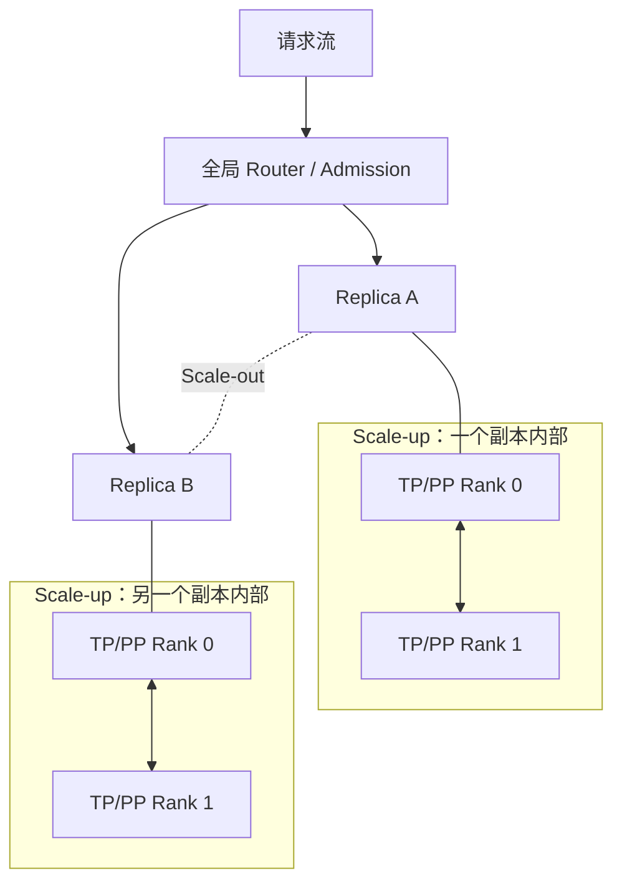
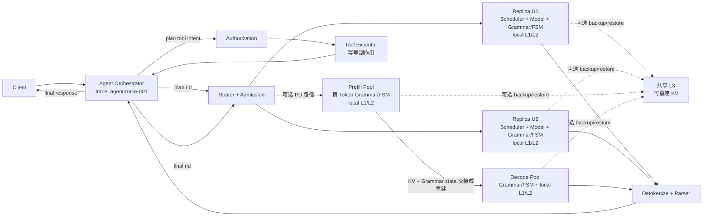

## 📑 目录

- [1. 单实例为什么不等于生产系统](#1-单实例为什么不等于生产系统)
- [2. Scale-up 与 Scale-out 是两条轴](#2-scale-up-与-scale-out-是两条轴)
- [3. Stateful Routing：负载均衡开始理解状态](#3-stateful-routing负载均衡开始理解状态)
- [4. 排队与过载：容量边界必须显式化](#4-排队与过载容量边界必须显式化)
- [5. PD 解耦：把两个阶段变成资源池](#5-pd-解耦把两个阶段变成资源池)
- [6. 容量规划：从 Workload 与 SLO 反推副本](#6-容量规划从-workload-与-slo-反推副本)
- [7. 故障域与降级：优化状态必须可重建](#7-故障域与降级优化状态必须可重建)
- [8. 可观测性：用分层证据回答系统假设](#8-可观测性用分层证据回答系统假设)
- [9. 发布与实验：让结论经得起流量变化](#9-发布与实验让结论经得起流量变化)
- [10. SGLang 与 vLLM：比较问题、机制与团队](#10-sglang-与-vllm比较问题机制与团队)
- [11. 贯穿 Agent：端到端系统图与 SLO 账本](#11-贯穿-agent端到端系统图与-slo-账本)
- [12. 第 12 章的 Infra 方法论](#12-第-12-章的-infra-方法论)
- [总结](#总结)
- [自我检验](#自我检验)
- [参考资料与章节回指](#参考资料与章节回指)

---

前五节一直在一台推理运行时内部追踪请求：对象怎样转换，KV 怎样复用，Scheduler 怎样组批，CPU 与 GPU 怎样重叠，Grammar 又怎样约束下一枚 Token。

本节把观察尺度向外移动一层。问题不再是“一个实例能否更快地完成请求”，而是：

> 当流量变化、实例失效、版本升级和请求类型混在一起时，整个系统还能完成多少满足 SLO 的正确请求？

这不是部署命令、网关参数或 Kubernetes 清单。本文以 **SGLang v0.5.17 Python SRT** 为实现边界，用少量 SGLang 名称映射通用理论；Model Gateway 等独立制品还应单独固定版本。核心结论同样适用于其他推理运行时。

## 1. 单实例为什么不等于生产系统

一个单实例实验通常证明三件事：模型能装入设备、请求能走完整条链路、某组负载下能测到延迟与吞吐。生产系统还要在时间和故障两个维度保持这些性质。

### 1.1 容量不是一次 Benchmark 的最大值

单实例的峰值吞吐只描述某个输入分布、并发和缓存温度下的局部上限。真实流量会改变 Prompt 长度、输出长度、共享前缀、Grammar 复杂度和到达间隔；同一实例的服务能力因此是一个分布，而不是常数。

生产容量还必须留出排队余量、故障余量和发布余量。若所有实例都长期运行在实验中刚好不超时的点，任何抖动都会直接越过 SLO。

### 1.2 可用性要求请求能绕开故障域

运行时内部可能有多个 TP rank，但它们通常共同完成同一个 forward。一个 rank 失效时，剩余 rank 不能自动成为较小模型副本；这组 rank 往往要作为一个整体恢复。

生产系统因此需要多个可独立完成请求的 **replica**。副本不仅增加总服务能力，也提供故障隔离和流量迁移的落点。

### 1.3 升级要求新旧状态可以并存

模型 revision、Tokenizer、Chat Template、Grammar backend、KV layout 或并行拓扑变化，都可能让旧缓存不能被新实例安全解释。升级不是替换一个无状态二进制，而是让两套带状态运行时短暂共存，并明确哪些状态可以共享、丢弃或重建。

### 1.4 异构流量需要不同资源判断

长 Prompt 的离线摘要、短 Prompt 的交互问答、固定 Schema 的 Agent plan 和长流式 final，对 TTFT、TPOT、队列公平性与缓存局部性的偏好并不相同。

把它们送进同一队列虽然简单，却可能让高成本请求阻塞延迟敏感请求。生产控制面必须理解请求成本与服务等级，而不只是连接数。

所以，单实例 SRT 是局部资源管理器；多副本系统还要完成全局 admission、路由、容量分配、故障收敛和发布控制。两者解决的是不同尺度的问题。

## 2. Scale-up 与 Scale-out 是两条轴

初学者最容易把“用了更多 GPU”统称为分布式推理。实际上，Scale-up 与 Scale-out 改变的对象不同。

### 2.1 Scale-up 扩大一个副本

Tensor Parallel 把同一层的张量计算分给多个 rank；Pipeline Parallel 把不同层或阶段分给多个 rank。它们首先解决单卡放不下模型、单 rank 计算过重或特定通信拓扑下的单副本性能问题。

一个请求进入 TP/PP 副本后，多个 rank 共同推进它。通信与同步成为关键路径，rank 集合也成为耦合故障域。

### 2.2 Scale-out 增加独立副本

Replica 复制完整的服务能力，让不同请求可以并行落到不同副本。它首先解决总吞吐、并发吸收、故障切换和滚动升级问题。



若总 GPU 数为 \(G\)，每个副本需要 \(g\) 张 GPU，则同构部署最多形成：

$$
R=\left\lfloor\frac{G}{g}\right\rfloor
$$

增大 \(g\) 可能让模型装得下或降低单请求计算时间，却会减少 \(R\)，从而减少独立排队通道和容错单元。反过来，盲目减小 \(g\) 也可能让权重、KV 或单请求延迟无法满足约束。

正确顺序是先求“一个副本至少需要多大”，再问“剩余预算能复制多少个副本”。并行策略定义副本内部结构，副本数定义系统外部容量；不能用 TP rank 数冒充 replica 数。

## 3. Stateful Routing：负载均衡开始理解状态

无状态 HTTP 服务常把任意请求送往任意健康副本。RadixAttention 改变了这个前提：每个 Worker 的 L1 Radix Tree、KV slots、排队状态和正在运行的请求都不同。

即使接入 HiCache L2/L3，副本也不会自动变回无状态。某段 KV 可能只在某个 Worker 的设备上 ready，也可能需要从较低层恢复；共享 L3 只扩大可恢复范围，不消除恢复成本和本地队列。

### 3.1 路由目标从均分请求变成最小完成成本

对候选副本 \(j\)，可以用一个教学模型表达路由代价：

$$
C_j=Q_j+\min(C^{\text{recompute}}_j,C^{\text{restore}}_j)
+E_j+S_j
$$

\(Q_j\) 是预计排队时间，第二项是在重算与恢复之间选择较小成本，\(E_j\) 表示执行拥塞，\(S_j\) 表示违反该请求 SLO 的风险惩罚。它是理想化目标函数，不是 SGLang Gateway 的逐字实现：v0.5.17 的 `cache_aware` 根据原始文本请求历史构造近似前缀树，并在负载失衡时切向 shortest-queue；它不会直接读取 Worker 的真实 L1/HiCache 状态。

Round-robin 只近似均衡请求数量；least-loaded 只看当前负载；纯 locality 策略只强调局部性也不完整。状态化路由要在它们之间做在线选择。

### 3.2 算例一：缓存命中不一定完成更早

`agent-rid-001/final` 的共享工具前缀已在副本 A 的 L1 中。A 预计排队 \(68\text{ ms}\)，采用缓存后还需 \(4\text{ ms}\) 才能开始有效 Prefill，总成本约 \(72\text{ ms}\)。

副本 B 当前空闲，但完整重算前缀需要 \(39\text{ ms}\)。此时 B 更早完成准备，Router 应牺牲局部命中而选择 B。若 A 的排队降到 \(12\text{ ms}\)，其总成本变为 \(16\text{ ms}\)，局部性才重新占优。

这个算例说明：命中率是状态描述，不是路由目标。目标是满足 SLO 的完成时间与系统 Goodput。

### 3.3 Affinity 应是偏好，不是永久绑定

稳定前缀适合形成软亲和性，但热 key 可能把一个副本压成热点。Router 必须允许队列成本推翻缓存偏好，并防止低频前缀长期饥饿。

plan 与 final 共享 Agent trace，却是两次独立模型调用；它们可以落到不同副本。是否追求同副本局部性，应由可复用 token、当前队列和剩余 SLO 预算共同决定，而不是把 trace 固定粘在一台机器上。

## 4. 排队与过载：容量边界必须显式化

请求到达率记为 \(\lambda\)，单个服务通道的平均完成率记为 \(\mu\)，利用率为：

$$
\rho=\frac{\lambda}{\mu}
$$

在理想 M/M/1 模型中，平均排队时间为：

$$
W_q=\frac{\rho}{\mu(1-\rho)}
$$

这个模型不精确描述 LLM serving：服务时间是长尾的，Continuous Batching 让请求互相影响，Prompt 与输出 token 也不是等价工作量。但它保留了关键趋势：当 \(\rho\) 接近 1，排队时间对微小波动极其敏感，尾延迟会先于平均吞吐失控。

### 4.1 队列不是免费的容量

排队只能平滑短时 burst，不能创造 GPU 时间。无限队列会把明确的容量不足变成长时间等待、客户端超时和无效计算；超时请求若仍在后台执行，还会继续挤压后来请求。

因此 admission 应按预计工作量和剩余 SLO 预算判断“现在接纳是否仍可能按时完成”，而不是只判断显存还能否分配一个 request slot。

### 4.2 三种过载动作回答不同问题

- **Admission control** 在计算开始前限制进入系统的工作量，保护已接纳请求。
- **Backpressure** 把“下游已满”传回上游，阻止请求在隐藏队列中继续堆积。
- **Load shedding** 在无法全部兑现承诺时，明确拒绝或取消低优先级、已无可能满足 SLO 的工作。

它们不是失败后的补丁，而是稳定系统的闭环。一个只会扩容、不会拒绝的系统，在扩容冷启动和突发流量之间仍会失稳。

对 Agent 请求还要计算整条事务的预算。plan 勉强按时完成但已经耗尽 final 的余量，并不算成功 admission；系统需要为工具等待和第二次模型调用保留时间。

## 5. PD 解耦：把两个阶段变成资源池

Prefill 一次处理较长输入，容易形成计算密集的大矩阵；Decode 反复生成单 token，更依赖 KV 读写、显存带宽和稳定的逐步调度。统一实例让两阶段共享权重和本地 KV，路径短，却也让长 Prefill 与在途 Decode 竞争同一批次和设备时间。

PD 解耦把它们变成两个可独立配置和扩展的资源池：

```text
请求 → Prefill Pool → KV 交接 → Decode Pool → 流式输出
```

这里的核心不是“拆成两个服务”，而是**资源池化**：P 池按输入计算需求供给，D 池按输出 token 的持续服务需求供给。两个池可以拥有不同的并行度、设备类型和队列目标。

### 5.1 解耦收益必须覆盖 KV 交接

若一次请求的 KV 传输量为 \(B_{\text{KV}}\)，有效带宽为 \(BW_{\text{eff}}\)，则仅数据搬运的下界约为：

$$
T_{\text{transfer}}\ge
\frac{B_{\text{KV}}}{BW_{\text{eff}}}
$$

实际路径还包含排队、元数据握手、可见性同步和失败清理。只有当独立调度减少的互扰与资源匹配收益，大于这些新增成本和尾延迟时，PD 才改善端到端 Goodput。

### 5.2 P:D 配比来自阶段服务需求

设每个请求在 P、D 两阶段分别消耗 \(d_P,d_D\) 个设备时间，目标利用率分别为 \(u_P,u_D\)，则初始资源比例可写成：

$$
m_P:m_D\approx
\frac{d_P}{u_P}:\frac{d_D}{u_D}
$$

长 Prompt、短输出会把比例推向 P；短 Prompt、长输出会把比例推向 D。缓存命中会减少 P 需求，投机解码和输出长度变化会改变 D 需求，因此固定比例只能是某个 workload 下的截面。

当统一实例已经满足 SLO、Prompt 较短、KV 交接接近重算成本、流量不足以填满两个池，或团队无法可靠处理跨池取消与恢复时，PD 往往不值得。通用原理与更完整的配比推导回到 [第 7 章](/AIInfraGuide/inference/模块四-推理优化/第7章-pd解耦架构/第7章-pd解耦架构)；本节只强调它在多副本系统中的位置。

## 6. 容量规划：从 Workload 与 SLO 反推副本

容量规划不能从“有多少 GPU”正向猜 QPS，而应从业务到达过程和服务承诺反推资源。

### 6.1 先描述 Workload 分布

至少要保留 Prompt 长度、输出长度、可复用前缀、Grammar 类型、Agent 工具路径和到达时间的联合分布。只保存均值会丢掉长 Prompt 与 burst 对队列的影响，也无法重放冷热缓存和 plan/final 的相关性。

异构流量可以共享资源池，但容量模型要分别估计其服务需求与 SLO。必要时为延迟敏感和吞吐优先流量设置不同 admission 类别；这是一种资源隔离，不等于必须复制两套平台。

### 6.2 用 Goodput 定义有效容量

设观察窗口内完成的请求集合为 \(\mathcal R\)，只有同时满足协议正确、质量门槛、TTFT/TPOT/E2E SLO 的请求才计入：

$$
\text{Goodput}=
\frac{
\left|\{r\in\mathcal R:
\text{correct}(r)\land\text{SLO}(r)\}\right|
}{T}
$$

峰值 tokens/s 可能来自少量超长输出，也可能伴随大量排队超时；它不能直接换算成业务容量。容量曲线应回答“在目标 workload 下，每个副本能稳定交付多少 Goodput”。

先对固定 workload 做 offered-load 扫描，把 \(g_{\text{SLO}}\) 定义为单副本在正确性与 SLO 门禁下的**最大可持续请求率**，而不是任意低负载窗口观测到的 Goodput。对同构副本、路由开销可忽略且扩展近似线性的情形，目标到达率 \(\lambda_{\text{target}}\) 对应的副本下界为：

$$
R_{\text{load}}=
\left\lceil
\frac{\lambda_{\text{target}}}{g_{\text{SLO}}}
\right\rceil
$$

该公式只是同构线性扩展的下界；低负载 Goodput 会被需求限制，过载时 Goodput 也可能下降。生产副本数还要加上可接受故障数、发布占用和扩容生效前的余量。

### 6.3 算例二：峰值吞吐会低估副本数

目标时段到达率为 \(18\text{ req/s}\)。同一 workload 下，单副本虽然能跑到峰值 \(8\text{ req/s}\)，但满足正确性和尾延迟 SLO 的 Goodput 只有 \(4.5\text{ req/s}\)。

按 Goodput 需要 \(\lceil18/4.5\rceil=4\) 个服务副本；若还要求任意一个副本失效后继续承载目标流量，则至少准备 5 个同等容量单元。若误用峰值吞吐，只会得到 3 个副本，系统在正常抖动前就已没有 SLO 余量。

这个结果仍需用时间分桶修正：冷缓存、新 Schema、流量 burst 和副本重建都会降低短期 \(g_{\text{SLO}}\)。容量规划的输出应是一条随 workload 与故障假设变化的曲线，而不是永久 QPS 数字。

## 7. 故障域与降级：优化状态必须可重建

生产设计先问“哪个状态失效”，再问“影响能否限制在一个边界内”。SGLang 相关系统至少包含以下不同故障域。

### 7.1 Worker 与 rank 集合

单 Worker 失效会丢失其在途请求和本地 Radix 状态。TP/PP 副本内任一必要 rank 失效，通常意味着整个副本不可继续提供正确 forward；恢复单位应是 rank 集合，而不是让剩余 rank 接管不完整分片。

### 7.2 Router 与全局控制面

Router 失效不应同时摧毁所有健康 Worker。路由状态可以重建，健康判断可以重新收敛，但未开始请求与已开始流式请求的处理语义必须区分。

### 7.3 HiCache L3 与外部存储

KV Cache 是由模型、输入和执行配置推导出的加速状态，不是业务事实源。L3 miss、超时、损坏或 namespace 不兼容时，正确基线应是回到 Prefill recompute；若外部缓存不可用会让模型服务整体不可用，优化层就越过了职责边界。

### 7.4 Grammar 与工具控制面

Grammar 编译或约束路径失效时，不能静默退化成无约束文本并声称请求成功。Tool executor 超时也不等于工具没有执行；控制面需要用稳定幂等键判断重试、查询结果或补偿，而不是让模型再生成一次调用来猜测。

### 7.5 流式重试的边界

首个响应字节发送前，系统可以在重试预算内把未产生外部副作用的模型调用换到其他副本。流一旦对客户端可见，就不能把另一个副本生成的后半段拼接上去；新的尝试必须拥有新 runtime request identity，并把旧尝试标为 incomplete。

对 `agent-trace-001`，Agent trace、plan rid、final rid、tool call identity 和幂等键承担不同职责。模型请求可重试，不代表工具副作用可重放。

合理的降级方向总是先移除可选优化、保留正确语义：缓存失败回到重算，局部性不足回到队列优先，PD 故障可在兼容时回到统一副本；但不能通过放松 Schema、跳过授权或重复执行工具来换可用性。

## 8. 可观测性：用分层证据回答系统假设

可观测性的目标不是收集尽可能多的字段，而是区分竞争解释。一次端到端 trace 应能在五个层次回答不同问题。

### 8.1 请求层

请求是否遵守输入输出契约，在哪个时间边界进入和离开系统，最终是否满足 TTFT、TPOT、E2E 与正确性目标？这一层定义用户看到的结果。

### 8.2 队列层

时间花在全局 admission、Router 等待、Worker waiting，还是 Grammar/工具等外部队列？队列增长来自到达 burst、服务率下降，还是错误重试放大？

### 8.3 设备层

设备时间用于 Prefill、Decode、collective、KV 搬运还是空等依赖？GPU 忙只能说明有工作，不能证明该工作属于仍可能满足 SLO 的请求。

### 8.4 缓存层

逻辑上匹配了多少 token，真正采用了多少，forward 前有多少 KV 已 ready？避免的重算是否大于恢复 I/O、排队回归和对其他请求的外部性？

### 8.5 Agent 控制面

plan、授权、工具执行、observation 与 final 是否属于同一事务？工具结果是否可信，副作用是否只发生一次，最终 JSON 是否同时满足语法、Schema 与业务规则？

这五层要用 trace identity 和统一时间边界连接。先提出假设，再寻找能推翻它的证据：例如“cache-aware 更快”必须同时看到重算减少、队列未恶化和 Goodput 上升，而不能只看到缓存命中。

## 9. 发布与实验：让结论经得起流量变化

SGLang v0.5.17、模型 revision、Tokenizer、模板、Kernel/backend、并行拓扑和 Gateway 制品共同定义实验对象。任一项变化都可能改变输出语义、缓存身份或容量曲线。

### 9.1 公平基线先固定合同

比较版本或框架时，应对齐模型与精度、硬件总预算、API 语义、输入顺序、到达过程、缓存条件、质量门槛和故障冗余。若一方使用热缓存、另一方使用冷缓存，测到的是状态差异，不是框架差异。

### 9.2 单变量建立因果

一次实验只改变一个机制假设，例如路由是否利用局部性、是否分离 P/D，或某类 Grammar 是否预编译。若同时改变副本数、并行度和缓存层级，即使结果变好，也无法知道收益来自哪里，更无法设计可靠回退。

### 9.3 Canary 观察真实分布

离线回放适合控制变量，canary 用于验证真实 burst、长尾输入和外部依赖。Canary 流量过小可能无法形成批处理，也可能长期处于冷缓存；因此“流量比例”本身也是实验条件。

### 9.4 回退也是一次状态迁移

回退后新实例会经历权重加载、Graph 建立、Grammar 与 Radix 冷启动。短期延迟变化不能自动证明旧版本失效，也不能被发布均值掩盖。回退目标必须事先在相同合同下验证，并明确哪些派生状态会丢弃。

实验最终应报告置信区间、长尾与 Goodput，而不是只报告最佳一次运行。没有稳定差异时，结论就是“当前 workload 下未证明收益”。

## 10. SGLang 与 vLLM：比较问题、机制与团队

“SGLang 和 vLLM 谁更快”不是一个完整问题。性能取决于模型、硬件、输入分布、服务合同、启用机制与版本；生产选择还取决于团队能否维护这些机制。

### 10.1 先问 Workload 暴露了什么问题

若流量包含长而稳定的 system/tool 前缀，重复 Prefill 是主要成本，就值得重点评估 SGLang 的 RadixAttention、HiCache 与状态化路由组合。

若固定 Schema、Tool Calling 和多阶段 Agent 是主路径，就应评估 Grammar 编译、调度耦合、parser 契约以及 Agent 控制面如何共同影响 Goodput。

若 Prefill 与 Decode 的资源需求长期失衡，且统一实例的互扰已被证据确认，才值得把 SGLang 的 PD 能力放进候选方案。

### 10.2 再问机制是否真正解决瓶颈

功能存在不等于目标 workload 受益。Radix 命中要换算成 SavedCompute，HiCache 要扣除恢复 I/O，cache-aware routing 要扣除热点排队，PD 要扣除 KV 交接，Grammar 要计入编译与 mask 路径。

vLLM 也持续演进缓存、调度、结构化输出和分布式能力；不能用静态功能表替代同版本实测。若现有 vLLM 系统已经满足 SLO，真实流量缺少可复用前缀，或 SGLang 的机制收益落在测量波动内，迁移未必产生净收益。

### 10.3 最后问团队能否拥有这套系统

团队需要理解版本边界、兼容矩阵、缓存身份、Parser/模板契约、故障降级和跨层 trace。一个理论上更快、但无法稳定升级与排障的栈，不会产生更高生产 Goodput。

因此框架决策应写成：

```text
已观测问题 → 候选机制 → 端到端收益 → 新故障域 → 团队维护成本
```

公平比较方法可继续参考 [3.6 框架横向对比](/AIInfraGuide/inference/模块四-推理优化/第3章-深入vllm/36-框架横向对比)。结论必须限定在固定版本、硬件和 workload 内，不做绝对胜负判断。

## 11. 贯穿 Agent：端到端系统图与 SLO 账本

全章的 AI Infra 值班 Agent 现在进入多副本系统。它要先规划工具调用，执行 `get_cluster_status`，再根据 observation 生成结构化 final。



图中统一副本与 PD 是两种可比较路径，不表示生产必须同时启用。每个 Worker/Pool 都有自己的 L1/L2；只有可选 L3 画成共享层。Grammar/FSM 在每次采样前参与：Prefill 可能产生首 Token，P→D 时必须交接或重建一致状态，之后 Decode 继续推进；Detokenize 与 Parser 才位于模型输出之后。授权与 Executor 仍属于 Python SRT 之外的 Agent 控制面；若 Gateway 承载 MCP loop，则 Gateway 进入这个控制面。Tool 返回后 Orchestrator 再用 final rid 经过 Router 发起第二次模型调用。

### 11.1 把端到端时间写成可归责账本

一次 Agent 事务可分解为：

$$
\begin{aligned}
T_{\text{agent}}={}&
T_{\text{admit}}+
T_{\text{plan-route}}+
T_{\text{plan-model}}+
T_{\text{authorize}}\\
&+T_{\text{tool}}+
T_{\text{observe}}+
T_{\text{final-route}}+
T_{\text{final-model}}+
T_{\text{deliver}}
\end{aligned}
$$

每次模型调用内部又可写成：

$$
T_{\text{model}}=
T_{\text{frontend}}+
T_{\text{grammar}}+
T_{\text{worker-queue}}+
T_{\text{restore/recompute}}+
T_{\text{prefill}}+
T_{\text{decode}}+
T_{\text{output}}
$$

Router 决定去哪一个状态副本，Worker Scheduler 决定何时进入 batch；两种 queue 不能合并。缓存恢复属于 Prefill 前的准备成本，工具等待属于模型外部依赖，也不能用 GPU timeline 解释。

### 11.2 SLO 是整条事务的共同预算

plan 必须生成合法且获准的工具调用，Executor 必须最多产生一次预期副作用，final 必须基于真实 observation 并满足结构和业务规则。任何一段失败，都不能因为模型 tokens/s 很高而计入 Agent Goodput。

这条账本把前五节重新接起来：

- **12.1** 给出模型、Kernel、运行时、服务四层坐标和容量账本；
- **12.2** 说明请求对象、状态所有权与跨进程边界；
- **12.3** 判断前缀 KV 能否复用、恢复还是重算；
- **12.4** 解释 Worker 内排队、组批和 CPU-GPU overlap；
- **12.5** 把合法 Token、工具协议与 Agent 副作用接入关键路径；
- **12.6** 再把多个有状态副本组成满足 SLO 的生产系统。

于是 `agent-trace-001` 关联的是一条跨 Router、两个模型调用、工具执行和最终交付的事务，而不是某一次模型请求。生产系统优化的单位也应从 token step 上升到合格事务。

## 12. 第 12 章的 Infra 方法论

本章借 SGLang 建立的不是产品功能记忆，而是一套分析推理基础设施的方法。

第一步是定义 workload 与外部合同。没有输入分布、正确性和 SLO，任何“更快”都没有比较边界。

第二步是拆状态并寻找所有者。请求、KV slot、Radix 节点、Grammar matcher、执行 batch 和工具副作用属于不同生命周期，不能用一个 request id 模糊所有权。

第三步是建立资源与时间账本。权重、KV、workspace、CPU seam、GPU forward、I/O、queue 和外部工具都要放回统一关键路径。

第四步是识别可消除工作与新增外部性。缓存减少 Prefill，却消耗容量与搬运；overlap 隐藏 Host seam，却增加在途状态；PD 减少阶段干扰，却增加 KV 交接；副本提高容错，却分散缓存局部性。

第五步是让任何优化都能退回正确基线。Radix/HiCache 可以重算，路由偏好可以放弃，PD 可以在兼容条件下回到统一实例；但模型版本、结构契约、授权和工具幂等不能为了性能被静默放松。

最后用公平实验和跨层观测检验因果。真正可迁移的 Infra 能力，是从“现象”追到“状态—队列—资源—SLO—故障域”，而不是背诵某个版本的参数。

## 总结

单实例运行时管理一组请求怎样共享设备；多副本生产系统管理多个有状态运行时怎样共同兑现业务承诺。TP/PP 扩大一个副本，replica 扩展吞吐和故障边界，两者不能互相替代。

RadixAttention 与 HiCache 让路由从无状态均分变成 queue、locality 和 SLO 的多目标决策。利用率接近容量边界时，admission、backpressure 与 load shedding 比继续堆队列更重要。PD 解耦只有在资源匹配收益覆盖 KV 交接和新增故障域时才成立。

容量应由 workload 和 SLO 反推，并以 Goodput 而非峰值 tokens/s 计量。缓存与外部存储必须可重建，流式重试与工具副作用必须尊重语义边界。SGLang 与 vLLM 的选择最终也应落到问题、机制证据和团队能力，而不是功能表或绝对排名。

## 自我检验

1. 为什么单实例峰值吞吐不能直接代表生产容量？
2. TP/PP 与 replica 分别改变哪个故障域和容量维度？
3. 为什么共享 L3 Cache 仍不能把 Worker 视为无状态？
4. 能否用 queue、recompute/restore 和 SLO 解释算例一的路由选择？
5. 为什么利用率接近 1 时，尾延迟会先于平均吞吐恶化？
6. Admission、backpressure 与 load shedding 各自控制哪一段过载链？
7. 怎样判断 PD 资源匹配收益是否覆盖 KV 交接成本？
8. 能否用 Goodput 和故障余量复算算例二的副本数？
9. Worker、rank、Router、L3 与 Tool Executor 的故障语义有何不同？
10. 为什么流式响应开始后不能跨副本拼接重试结果？
11. 五层可观测性分别用于推翻什么系统假设？
12. 哪类 workload 更值得评估 SGLang，团队还需具备什么能力？
13. 能否沿 `agent-trace-001` 写出 plan、工具、final 的完整 SLO 账本？
14. 本章哪些状态属于可重建优化，哪些属于不能放松的正确性合同？

## 参考资料与章节回指

- [SGLang v0.5.17 Release](https://github.com/sgl-project/sglang/releases/tag/v0.5.17)
- [SGLang v0.5.17 源码](https://github.com/sgl-project/sglang/tree/v0.5.17)
- [SGLang 论文](https://arxiv.org/abs/2312.07104)
- [v0.5.17 Model Gateway](https://github.com/sgl-project/sglang/blob/v0.5.17/docs/docs/advanced_features/sgl_model_gateway.mdx)
- [v0.5.17 PD Disaggregation](https://github.com/sgl-project/sglang/blob/v0.5.17/docs/docs/advanced_features/pd_disaggregation.mdx)
- [第 7 章：Prefill/Decode 解耦架构](/AIInfraGuide/inference/模块四-推理优化/第7章-pd解耦架构/第7章-pd解耦架构)
- [9.1 推理指标体系](/AIInfraGuide/inference/模块四-推理优化/第9章-性能分析与benchmark/91-推理指标体系)
- [第 12 章导览](/AIInfraGuide/inference/模块四-推理优化/第12章-深入sglang/第12章-深入sglang)

> 实现映射固定到 SGLang v0.5.17 Python SRT；公式与算例用于建立量纲，不替代目标模型、硬件、Gateway 制品和真实 workload 上的验证。
