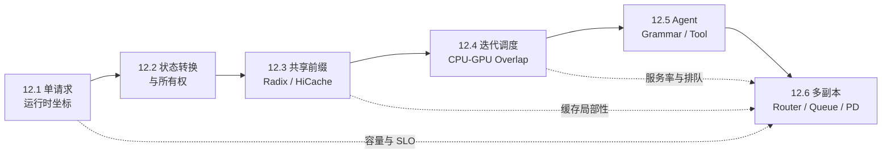

## 📑 本章导航

- [1. 本章的理论主线](#1-本章的理论主线)
- [2. 版本与实现边界](#2-版本与实现边界)
- [3. 一张知识图看完本章](#3-一张知识图看完本章)
- [4. 贯穿案例](#4-贯穿案例)
- [5. 六节标题与承诺](#5-六节标题与承诺)
- [6. 阅读路径](#6-阅读路径)
- [7. 学完应具备的能力](#7-学完应具备的能力)
- [总结](#总结)
- [自我检验](#自我检验)
- [参考资料](#参考资料)

---

## 1. 本章的理论主线

前 11 章已经介绍模型计算、KV Cache、量化、投机解码、分布式推理、PD 解耦、服务特性和性能分析。第 12 章不重复这些主题的通用结论，而是把 **SGLang** 当作一个完整案例，观察它们怎样在真实推理运行时中发生耦合。

主线从一次请求开始：先区分模型、Kernel、运行时与在线服务，再追踪请求对象和状态所有权；随后解释共享前缀怎样减少 Prefill、Scheduler 怎样组织迭代并隐藏 CPU seam、Grammar 怎样把输出合同放进生成过程；最后把一个有状态实例扩展成多副本生产系统。

因此，本章关心的不是“会不会启动 SGLang”，而是能否用状态、资源、队列、关键路径、SLO 和故障域解释系统行为。

## 2. 版本与实现边界

全章固定 **SGLang v0.5.17**。源码路径、默认行为和产品映射只对该 tag 负责；模型 revision、Tokenizer、CUDA、Kernel、硬件与 backend 组合仍需单独固定。

架构分析以较成熟的 **Python SRT** 路径为主。v0.5.17 已包含初始 Rust frontend 支持，但本章不把不同前端假设成完全相同的进程拓扑。

Model Gateway 等独立制品可能拥有不同发布节奏。第 12.6 节只解释状态化路由和多副本的通用原理，不承诺某组 CLI 或参数跨版本稳定。

## 3. 一张知识图看完本章



实线表示学习顺序：单请求 → 缓存 → 调度 → Agent → 多副本。虚线表示生产收束时要重新使用的约束：容量来自单实例账本，路由受缓存状态影响，系统稳定性受队列与服务率支配。

## 4. 贯穿案例

六节都追踪同一个 AI Infra 值班 Agent：

```text
模型：Qwen/Qwen2.5-7B-Instruct
trace_id：agent-trace-001
plan rid：agent-rid-001/plan
final rid：agent-rid-001/final
任务：检查 gpu-prod，并判断是否需要扩容及理由
共享前缀：system prompt + get_cluster_status 工具声明
控制合同：没有真实工具结果时不得猜测，工具最多执行一次
输出合同：final 必须满足固定 JSON 结构和业务规则
```

plan 与 final 是两次模型调用，应使用不同 runtime rid；工具调用还要有独立 identity 与幂等键。这个案例让缓存复用、Grammar、排队、路由和端到端 SLO 落到同一事务，而不是各讲一个孤立功能。

## 5. 六节标题与承诺

### [12.1 认识 SGLang：从模型调用到推理运行时](/AIInfraGuide/inference/模块四-推理优化/第12章-深入sglang/121-sglang快速入门)
承诺：建立模型、Kernel、推理运行时和在线服务的四层坐标，并从显存与延迟账本解释常驻服务为什么不同于一次 `generate()`。

### [12.2 SGLang 整体架构：状态、进程与请求生命周期](/AIInfraGuide/inference/模块四-推理优化/第12章-深入sglang/122-sglang整体架构)
承诺：沿一个 `rid` 追踪协议对象、token 序列、运行时请求、执行批次和输出事件，用状态所有权理解进程边界与故障边界。

### [12.3 RadixAttention 与层次化缓存：从前缀复用到可计算降级](/AIInfraGuide/inference/模块四-推理优化/第12章-深入sglang/123-radixattention与层次化缓存)
承诺：从精确 token 前缀推导 KV 共享、引用保护、淘汰与 HiCache 搬运，并用 SavedCompute 与恢复成本判断缓存是否值得。

### [12.4 调度器与 CPU-GPU 重叠：从迭代级调度到跨拍流水线](/AIInfraGuide/inference/模块四-推理优化/第12章-深入sglang/124-调度器与cpu-gpu重叠)
承诺：解释长期请求怎样被切成单轮 batch，以及 overlap 如何隐藏 Host seam、又为何不能越过 RAW/WAR/生命周期依赖。

### [12.5 结构化生成与 Agent 基础设施：从合法 Token 到可控执行](/AIInfraGuide/inference/模块四-推理优化/第12章-深入sglang/125-结构化生成与agent能力)
承诺：从 Grammar 状态机和 token mask 推导结构化生成，再划清模板、Parser、授权、Executor、重试与工具副作用的职责。

### [12.6 从单实例推理运行时到多副本生产系统](/AIInfraGuide/inference/模块四-推理优化/第12章-深入sglang/126-生产部署调优与框架对比)
承诺：区分单副本并行与多副本扩展，用状态化路由、排队、PD 资源池、Goodput、故障域和公平实验完成全章系统收束。

## 6. 阅读路径

- **第一次系统学习推理运行时**：按 `12.1 → 12.6` 顺序阅读，每节都补齐上一节新增的状态和成本。
- **已经熟悉 vLLM**：重点阅读 `12.2 → 12.3 → 12.4 → 12.6`，比较状态组织、前缀复用、调度关键路径和生产扩展思路。
- **正在建设 Agent 平台**：阅读 `12.1 → 12.3 → 12.5 → 12.6`，把共享工具前缀、结构合同、幂等执行和端到端 SLO 连起来。

无论选择哪条路径，都不建议跳过 12.1 的容量与延迟坐标；没有单实例基线，就无法解释多副本系统为何扩展或失稳。

## 7. 学完应具备的能力

- 能把模型调用还原为跨 CPU、GPU、IPC、KV 和输出路径的状态机；
- 能从模型结构与 workload 估算权重、KV 容量和延迟构成；
- 能判断缓存复用、层次化恢复和 CPU-GPU overlap 的收益边界；
- 能把 Grammar 正确性、Agent 工具副作用与模型性能放进同一账本；
- 能区分 TP/PP 的单副本扩展与 replica 的吞吐、容错扩展；
- 能从 workload 与 SLO 反推 Goodput、路由目标、副本容量和降级边界；
- 能设计固定版本、单变量、可推翻假设的公平实验，而不是比较参数数量。

## 总结

第 12 章从一个请求对象出发，逐层加入可复用 KV、迭代级调度、结构化 Agent 状态和多副本控制面。SGLang v0.5.17 提供实现坐标，真正要掌握的是可迁移的 Infra 推理链：定义合同，寻找状态所有者，建立资源与时间账本，再用 SLO 和故障域检验优化。

## 自我检验

- [ ] 能说明六节之间新增了哪些状态与系统边界。
- [ ] 能解释为什么版本边界不只是一条包版本号。
- [ ] 能沿知识图从单请求讲到有状态多副本。
- [ ] 能区分 Agent trace、模型 rid、tool identity 与幂等键。
- [ ] 能为自己的背景选择阅读路径，并说明不能跳过的前置模型。
- [ ] 能用“workload → 状态 → 资源 → 队列 → SLO → 故障域”复述本章方法。

## 参考资料

- [SGLang v0.5.17 Release](https://github.com/sgl-project/sglang/releases/tag/v0.5.17)
- [SGLang v0.5.17 源码](https://github.com/sgl-project/sglang/tree/v0.5.17)
- [SGLang 论文](https://arxiv.org/abs/2312.07104)
- [第 7 章：Prefill/Decode 解耦架构](/AIInfraGuide/inference/模块四-推理优化/第7章-pd解耦架构/第7章-pd解耦架构)
- [第 9 章：性能分析与 Benchmark](/AIInfraGuide/inference/模块四-推理优化/第9章-性能分析与benchmark/第9章-性能分析与benchmark)

> 本导览只提供理论地图和阅读入口；具体推导、公式、算例与实现映射分别留在 12.1～12.6。
