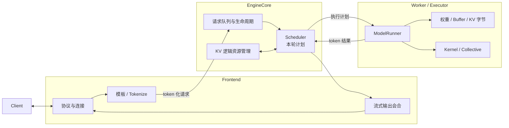
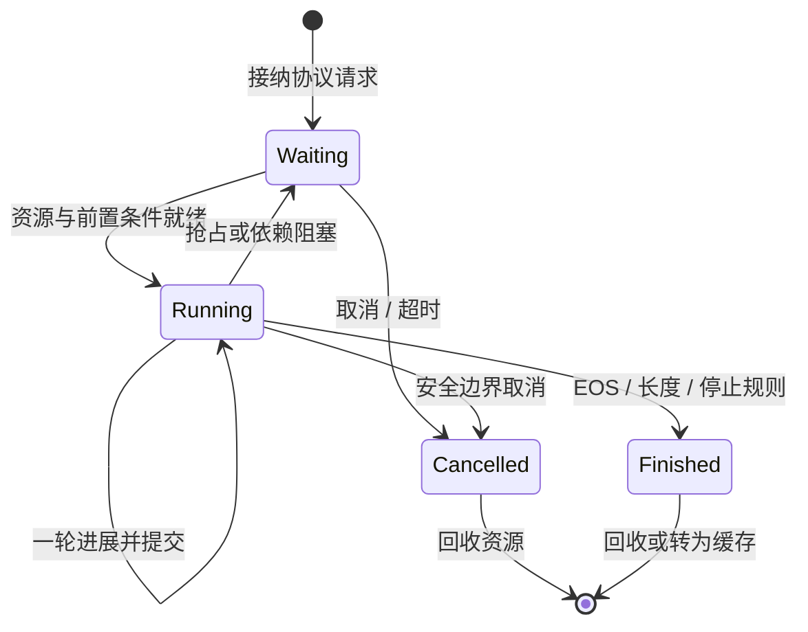

## 📑 目录

- [1. 真实问题：一次请求为什么要穿过多层](#1-真实问题一次请求为什么要穿过多层)
- [2. 稳定组件地图：Frontend、EngineCore、Worker](#2-稳定组件地图frontendenginecoreworker)
- [3. 控制面与数据面](#3-控制面与数据面)
- [4. 请求的六种表示与状态所有权](#4-请求的六种表示与状态所有权)
- [5. 贯穿请求的一次完整旅程](#5-贯穿请求的一次完整旅程)
- [6. 请求状态机与关键不变量](#6-请求状态机与关键不变量)
- [7. IPC：隔离、流水化与背压](#7-ipc隔离流水化与背压)
- [8. 多 GPU 时的控制与执行边界](#8-多-gpu-时的控制与执行边界)
- [9. 故障域与恢复边界](#9-故障域与恢复边界)
- [10. 带单位的端到端时延算例](#10-带单位的端到端时延算例)
- [11. 用最后可见状态分层排障](#11-用最后可见状态分层排障)
- [12. 架构取舍与框架对照](#12-架构取舍与框架对照)
- [总结](#总结)
- [自我检验](#自我检验)
- [参考资料](#参考资料)

---

3.1 已经把 vLLM 放在模型、Kernel、运行时和在线服务四层坐标中。
本节继续追踪 `infra-guide-001`，但不把调用链写成文件路径清单。内部模块会演进，稳定的问题始终是：什么状态被创建，谁拥有它，它在哪里转换，失败时影响多大。

## 1. 真实问题：一次请求为什么要穿过多层

把模板化、分词、排队、KV 分配、模型执行、采样和反分词写进一个大循环，在单请求演示中完全可行。
并发服务会暴露三组冲突。

### 1.1 变化速度不同
HTTP 连接和文本事件随客户端变化，请求生命周期跨越几十到几千个迭代，GPU Batch 却可能每几毫秒重组一次。

若用一个对象覆盖三种时间尺度，短期执行细节会污染长期状态，连接取消也容易直接改坏设备侧状态。

### 1.2 适合的执行设备不同
协议校验、模板、Tokenize、队列和停止判断包含大量分支，适合 CPU。

模型权重、KV 字节、Attention 和 GEMM 需要规则的张量路径，适合 GPU。
把二者串行绑定，会让 GPU 等待高方差 CPU 工作，也让 CPU 等待设备完成后才处理无关连接。

### 1.3 失败方式不同
非法请求应在入口被拒绝，不能污染核心调度状态。

某次 GPU 执行失败可能使整个设备实例失效，却不应破坏其他实例的入口进程。
客户端断连只表示输出合同终止，不保证在途 Kernel 能在同一瞬间停下。

架构分层的目的，就是让这些变化与失败落在明确边界。

## 2. 稳定组件地图：Frontend、EngineCore、Worker
vLLM 的具体类名和进程拓扑会随版本、部署方式和并行策略变化。对初学者更稳定的地图只有三层。

图中的箭头表示语义转换，不承诺某个版本使用哪种 socket、线程或 Python 类型。

### 2.1 Frontend：拥有调用合同附近的状态

Frontend 接收外部协议，校验字段，应用模板和 Tokenizer，把文本请求规范化成 Token 侧输入，并把输出事件送回正确连接。
它通常拥有：

- 外部请求身份；
- 连接、超时和取消信号；
- 协议参数；
- 模板化与 Tokenize 的结果；
- 流式输出已经交付到哪里。

Frontend 不应成为 KV 块和运行时 Running/Waiting 状态的最终权威。否则网络重试或断连就可能与 Scheduler 双写资源生命周期。

### 2.2 EngineCore：拥有运行时决策状态
EngineCore 是“这条请求现在还欠多少计算”的权威边界。

它协调：

- 请求接纳与 Waiting/Running；
- 已计算 Token 与待计算 Token；
- 每轮计算预算；
- KV 逻辑分配、引用与释放；
- 抢占、恢复、完成和取消；
- 执行结果向长期状态的提交。

Scheduler 决定本轮做什么，KV 管理部分回答相应状态能否被显存承载。两者必须看到一致的资源事实，否则会出现“计算预算允许，KV 却无处落”的错误计划。

### 2.3 Worker：拥有设备执行状态
Worker 或 Executor 把 EngineCore 的计划落实到一个或多个设备。

ModelRunner 长期持有模型权重、设备 Buffer、KV 物理存储视图、编译结果、Graph 状态和执行后端。
Worker 接受“本轮执行谁”的计划，但不决定哪个租户更重要，也不拥有 HTTP 连接。策略与执行分开后，调度策略可以变化，而设备路径保持相对规则。

### 2.4 逻辑所有权不等于物理字节位置
EngineCore 可以拥有“请求 A 引用物理块 17、29、4”的逻辑事实，KV 字节本身则驻留在 Worker 管理的设备内存。

同理，Frontend 拥有“连接仍在等待”的事实，却不拥有请求在 GPU 上的张量。
理解所有权时要问“谁有权改变生命周期”，而不是只问“字节放在哪个进程”。

## 3. 控制面与数据面

三层地图还可以沿另一条轴切开：控制面与数据面。

### 3.1 控制面回答能不能算
控制面处理：

- 请求是否就绪；
- 本轮选择谁；
- 分配多少 Token 和 KV；
- 是否允许新请求进入；
- 是否抢占或取消；
- 结果是否达到停止条件。

这些决策频繁、分支多、状态性强。

### 3.2 数据面回答选定后怎样算

数据面处理：

- Token 与位置张量；
- 权重读取；
- KV 读写；
- Attention、GEMM 与采样；
- 多卡 Collective；
- 必要的设备间同步。

它追求规则布局、大批量和少分支。

### 3.3 两者不能完全分离
控制面必须把合法的 Token 位置、Block Table 和 Batch 形状交给数据面。
数据面产生的新 Token、接受数量与错误状态，又会改变下一轮控制决策。

边界上的核心合同可以抽象为：

$$
\text{Plan}_t
=
(\text{members},\ \text{token ranges},\ \text{KV mapping},\ \text{mode})
$$

$$
\text{Result}_t
=
(\text{request identity},\ \text{sampled tokens},\ \text{accepted progress},\ \text{status})
$$

Plan 是单轮不可随意改写的快照；Result 必须先关联回正确请求，才能提交长期状态。

## 4. 请求的六种表示与状态所有权
不要想象同一个 Python 对象从 HTTP 一直传到 GPU。更准确的模型是同一身份经历多次语义转换。

| 表示 | 主要内容 | 权威所有者 | 生命周期 |
|---|---|---|---|
| 协议请求 | messages、采样参数、流式合同 | Frontend | 一次调用 |
| Token 输入 | 模板后的 Token、长度、特殊标记 | Frontend/输入边界 | 进入运行时前 |
| 运行时请求 | 进度、状态、约束、KV 引用 | EngineCore | 多个迭代 |
| 调度计划 | 本轮成员、Token 数、KV 映射 | Scheduler | 单个迭代 |
| 设备批次 | 张量、Buffer、执行形状 | Worker | 单次执行 |
| 输出事件 | Token 进展、文本增量、完成原因 | EngineCore 与 Frontend 分段拥有 | 直到交付 |

### 4.1 身份是不变量

表示可以改变，请求身份必须能够贯穿各层。
外部 ID 与内部 ID 可以不同，但映射必须一一对应，并对重试与并发有明确语义。

没有稳定身份，迟到输出可能被交给另一个连接，取消也可能释放错误请求。

### 4.2 Token 序列是模型语义边界
两个肉眼相同的 `messages`，如果模板、Tokenizer revision 或特殊 Token 不同，模型实际输入就不同。
KV Cache 和 Prefix Cache 都以 Token 语义为基础，不以字符串“看起来一样”为基础。

所以模板版本属于模型合同，而不是无关的前端细节。

### 4.3 运行时请求是长期状态
运行时请求回答“已经计算多少、还欠多少、持有哪些 KV、是否允许继续”。

它可能连续出现在许多 Batch 中，也可能仍是 Running 却因本轮预算不足没有执行。

### 4.4 执行批次是短期快照
同一个请求在相邻两轮可能位于不同 Batch 位置；旧请求结束后，新请求还能复用其设备槽位。
Persistent Batch 可以复用设备侧结构，但不能把“槽位”误当成“请求身份”。槽位可复用，身份和生命周期必须显式更新。

### 4.5 输出有 Token 与文本两个提交点

EngineCore 依据 Token 结果更新运行状态，Frontend 依据 Tokenizer 状态形成安全的文本增量。
一个 Unicode 字符可能跨多个 Token，停止串也可能跨分片，因此“新 Token 已产生”不总等于“立刻有新文本可发送”。

## 5. 贯穿请求的一次完整旅程

现在让 `infra-guide-001` 穿过三层。它有 1,536 个输入 Token，其中 1,024 个属于共享前缀；到达时已有两个请求在 Decode。

### 5.1 入口：建立调用合同
Frontend 校验模型、消息、输出上限和可选 JSON Schema，应用匹配该模型 revision 的模板与 Tokenizer。

此时它知道输入长度为 1,536 Token，但还不能承诺立即执行。协议合法只表示可以进入运行时，不表示资源已经获得。

### 5.2 入核：获得长期生命
Token 化请求越过 EngineCore 边界后，系统建立运行时请求。
它初始位于 Waiting，携带输入 Token、输出上限、停止规则与约束就绪状态。EngineCore 还会查询有多少前缀 KV 可以安全复用。

若前 1,024 Token 命中 Prefix Cache，含义是这些位置的 KV 已经存在且可引用，不是把 1,024 个 Token 从请求中删除。

### 5.3 调度：从长期状态形成单轮计划
Scheduler 先考虑已有 Running 请求的继续推进，再在剩余计算与 KV 预算中接纳该请求。

若一轮不足以处理剩余 512 个新 Prompt Token，它可以只安排一个 Prefill Chunk。请求由此获得部分进展，但尚不能输出首 Token。

### 5.4 执行：计划变成设备批次
Worker 接收本轮成员、位置、KV 映射和执行模式，把动态请求投影到规则张量与 Persistent Batch 槽位。
ModelRunner 读取共享前缀 KV，为新后缀写入 KV，并运行模型与必要采样。设备只执行计划，不自行把 Waiting 请求拉进来。

### 5.5 提交：结果改变下一轮事实

在 v0.27.1 中，Scheduler 形成计划后会先乐观推进 `num_computed_tokens`，让计划内与在途进度能够进入下一拍准备；这个计数此时不等于结果已经提交。
执行完成后，EngineCore 再确认结果属于哪一轮、哪条请求，追加真实生成 Token，更新停止状态与 KV 生命周期，并回滚没有兑现的乐观进度。
如果启用了投机解码，计划处理的候选 Token 数可能大于最终接受进度；结果阶段必须按真实接受数撤销被拒绝候选对应的进度。

### 5.6 返回：把 Token 进展变成调用方事件

Frontend 接收可提交 Token，增量反分词，并按非流式或流式合同返回。
若客户端已经取消，输出不再交付，但 EngineCore 仍需在安全边界处理取消并释放状态。连接消失不会让已经提交到 GPU 的 Kernel 倒流。

### 5.7 结束：释放不等于清零所有字节

请求完成后，它对运行 KV 的独占引用被释放。
若相应前缀符合缓存策略，某些 KV 块可能以可复用缓存身份留在池中；逻辑请求已结束，物理字节却未必立刻覆写。
这说明“请求生命周期”和“缓存生命周期”是两条相关但不同的线。

## 6. 请求状态机与关键不变量

可以把稳定状态机画成：

状态名在不同版本可能变化，下面的不变量更稳定。

### 6.1 进度单调，但投机状态可回滚
已经向调用方提交的输出不能撤回。

内部乐观安排的候选 Token 可以被拒绝或回滚，因此“已计划”“已计算”“已接受”“已输出”必须区分。

### 6.2 每个活跃 KV 引用都有所有者
一个物理块可以被多个前缀引用，但引用计数和可回收条件必须一致。

释放过早会破坏正确性，释放过晚会形成容量泄漏。

### 6.3 单轮计划与结果必须配对
异步或多 Batch 在途时，结果可能晚于后续准备工作。
系统必须用轮次、请求身份或等价机制防止旧结果覆盖新状态。

### 6.4 完成后不能继续占用运行槽位

Finished 与 Cancelled 请求应最终从运行集合退出。
若输出通道阻塞，系统需要明确是保留结果、施加背压，还是取消；不能让不可交付请求无限消耗 GPU。

### 6.5 所有 rank 对本轮 Collective 顺序一致

多 GPU 执行时，各 rank 必须对执行顺序和张量合同达成一致。某个 rank 跳过 Collective，其他 rank 可能永久等待。

## 7. IPC：隔离、流水化与背压
Frontend 与 EngineCore、EngineCore 与某些执行组件可以位于不同进程。IPC 不是架构目标，而是实现隔离与流水化的工具。

### 7.1 为什么跨进程
第一，模板化、Tokenize、Detokenize 和协议解析的 CPU 方差不应直接阻塞核心调度循环。

第二，设备 OOM 或执行崩溃需要清晰的实例故障边界，避免任意前端对象共享同一 Python 堆。
第三，多进程允许输入、GPU 执行和输出处理在没有真实依赖时重叠。

### 7.2 IPC 传递的是状态转换结果

入口消息应表达“建立或取消哪条运行时请求”，执行消息应表达“本轮计划”，输出消息应表达“哪条请求取得什么进展”。
消息越接近稳定语义，内部对象重构对边界影响越小。把任意可变对象直接共享，会让所有权重新变得模糊。

### 7.3 IPC 有固定成本

每次跨边界都会引入序列化、复制或句柄管理、排队和进程调度。
大模型 Prefill 中这点成本可能被 GPU 时间掩盖；小模型、小 Batch、短 Decode 中，固定 Host 成本更容易成为关键路径。

### 7.4 队列提供背压观测，不创造容量
如果 Frontend 生产速度大于 EngineCore 消费速度，IPC 队列会增长。

有限队列可以暴露积压并触发 admission；无限队列只会把拒绝变成高 TTFT、内存增长和超时。
需要区分至少三处等待：

- Frontend 入口等待；
- EngineCore Waiting 队列；
- Worker 前的执行计划等待。

“队列长度为 20”若没有层次语义，几乎不可诊断。

### 7.5 取消存在时间窗

取消信号和执行计划可能在 IPC 中交错。
合理承诺通常是：取消到达权威状态所有者后，在下一个安全边界停止后续推进并最终回收，而不是保证已发射 Kernel 立即中止。

## 8. 多 GPU 时的控制与执行边界
当一个副本使用 Tensor Parallel 或 Pipeline Parallel，Frontend 仍不需要为每个 rank 保存一份 HTTP 请求。

EngineCore 形成逻辑计划，Executor 将它分发到共同完成本轮执行的 Worker。

### 8.1 控制消息与张量通信不同
控制消息描述 Batch 成员、位置和模式。

数据面 Collective 传递或规约张量。
二者都跨设备边界，却具有不同量级、同步要求和失败语义，不能用“网络慢”一词混在一起。

### 8.2 多 rank 是一个耦合执行单元

TP rank 通常共同推进同一个请求。一个 rank 失败，剩余 rank 很难自动变成较小副本继续生成。
所以 rank 集合通常构成一个故障域；增加 rank 解决的是单副本容量或速度，不等于增加独立服务副本。

### 8.3 状态必须一致，字节可以分片
各 rank 可以只持有分片权重和分片 KV，但必须对请求顺序、Token 位置、完成条件与 Collective 次序保持一致。

逻辑状态一致性是正确性要求，物理分片是执行策略。

## 9. 故障域与恢复边界
多进程减少了故障传播，并不自动提供无损恢复。

### 9.1 Frontend 故障

连接与输出会合状态丢失。即使 EngineCore 暂时仍在计算，原调用方也未必能安全重新挂接到同一流。
恢复通常依赖客户端重试和请求幂等，而不是假设连接状态可凭空重建。

### 9.2 EngineCore 故障
Waiting/Running、KV 逻辑所有权和提交进度可能一起丢失。

由于尚未交付的生成状态通常只在内存中，实例重启往往意味着在途请求失败并由上游决定是否重试。

### 9.3 Worker 或 GPU 故障
权重、KV 物理字节和执行上下文不可用。若一次 Collective 中某 rank 失败，整个并行副本通常要退出并重建。

### 9.4 输出路径故障

Token 可能已由 EngineCore 提交，却尚未形成或交付完整文本。
流式接口因此不能天然做到 exactly-once；上游需要用请求身份、已接收前缀和业务语义决定是否重试。

### 9.5 缓存丢失

Prefix Cache 是优化状态，应该可由输入 Token 重算。
缓存丢失会降低性能，不应改变模型语义。若正确性依赖某段“只能从缓存取回”的 KV，架构边界就已经错位。

## 10. 带单位的端到端时延算例
对 `infra-guide-001` 的首 Token 路径，假设观测到：

| 阶段 | 时间 |
|---|---:|
| 协议校验、模板与 Tokenize | \(5.0\ \text{ms}\) |
| Frontend → EngineCore 消息 | \(0.4\ \text{ms}\) |
| Waiting 排队 | \(40.0\ \text{ms}\) |
| 调度与计划准备 | \(0.3\ \text{ms}\) |
| Prefix 命中后剩余 Prefill | \(48.0\ \text{ms}\) |
| 结果回传与首次 Detokenize | \(1.0\ \text{ms}\) |

则教学模型下的 TTFT 约为：

$$
T_{\text{TTFT}}
=5.0+0.4+40.0+0.3+48.0+1.0
=94.7\ \text{ms}
$$

其中 GPU 相关 Prefill 为 48.0 ms，只占约 50.7%。

若只优化 Prefill 20%，它减少：

$$
48.0\ \text{ms}\times20\%=9.6\ \text{ms}
$$

新 TTFT 约为 85.1 ms，而不是 75.8 ms。其余路径和 40 ms 排队并未消失。
再假设首 Token 后还有 64 个 Decode 间隔，每轮 GPU 为 \(8.0\ \text{ms}\)，未隐藏 Host seam 为 \(0.8\ \text{ms}\)：

$$
T_{\text{decode}}
\approx64\times(8.0+0.8)
=563.2\ \text{ms}
$$

这说明短暂的 0.8 ms 在长 Decode 中会重复 64 次。V1 的 Persistent Batch 与流水化正是针对这种重复固定成本，但它们也引入状态一致性代价。

算例只提供量纲。真实 Timeline 中传输、CPU 与 GPU 可能重叠，不能把所有事件持续时间无条件相加。

## 11. 用最后可见状态分层排障
架构图的价值不是记组件名，而是帮助问“请求最后在哪里仍可见”。

### 11.1 Frontend 看不到合法协议对象
检查路由、认证、字段校验、模型名和请求体，不要先怀疑 GPU。

### 11.2 已有协议对象，没有 Token 输入

检查模板、Tokenizer、媒体预处理和输入长度边界。此时尚未进入核心 KV 调度。

### 11.3 EngineCore 能看到请求，但长期 Waiting
检查前置条件、计算预算、KV 容量、优先级和过载，而不是只看设备利用率。

### 11.4 已形成计划，Worker 没有完成

检查执行进程、模型后端、显存峰值、Shape fallback 和多 rank Collective。

### 11.5 EngineCore 已提交 Token，Frontend 没有文本
检查输出 IPC、Detokenize、代理缓冲、连接取消和流式分片。

### 11.6 请求完成，资源没有恢复

检查运行引用、缓存引用和在途 Batch 是否仍持有资源。不能仅以“显存没有下降”判断泄漏，因为内存池可能保留已释放块等待复用。
这套方法依赖跨层请求身份、分层队列时间和资源计数。只有一个总延迟指标时，架构再漂亮也无法定位问题。

## 12. 架构取舍与框架对照

### 12.1 分层与 IPC
收益是隔离不同方差和故障方式的状态，并为 CPU/GPU 重叠提供空间。

代价是消息成本、取消竞态、版本合同和更复杂的跨进程观测。

### 12.2 权威状态与设备缓存
EngineCore 集中管理请求和 KV 逻辑生命周期，Worker 缓存执行所需状态，可以减少重复传输。

代价是双方必须通过增量计划和结果提交保持一致，异步越深，过期状态越难处理。

### 12.3 长期请求与短期 Batch
分离后可以连续批处理，让新请求进入、完成请求退出。

代价是每轮都要进行身份映射、预算判断和结果提交。

### 12.4 与 SGLang 对照
SGLang 也会把前端状态、Scheduler 长期请求、执行批次和 Detokenize 分开。组件名字和缓存结构不同，但“长期状态 → 单轮快照 → 结果提交”的骨架相同。
比较时应看状态所有权和边界成本，不应数进程或类名。

### 12.5 与 TensorRT-LLM 对照

当前 TensorRT-LLM 的主线同样是 PyTorch 原生运行时：PyExecutor 维护请求循环、Scheduler 与 ResourceManager，设备侧组合 NVIDIA 专用 Kernel、Paged KV、In-flight Batching、CUDA Graph 和重叠调度。
它不再依赖预构建 TensorRT Engine，但仍需要请求管理、KV 状态、执行批次和服务边界；与 vLLM 的差异应落到状态组织、Kernel 覆盖、调度策略和 NVIDIA 平台约束，而不是“是否编译 Engine”。

下一节将解释 vLLM V1 为什么围绕隔离、统一状态和增量更新重构这条链路。

## 总结
vLLM 架构可以稳定地理解为 Frontend、EngineCore 与 Worker 三层。
Frontend 拥有协议和连接附近的状态，EngineCore 拥有请求与逻辑资源生命周期，Worker 拥有设备执行状态。

同一请求会转换为协议对象、Token 输入、运行时请求、调度计划、设备批次和输出事件；身份保持不变，表示和所有者不断变化。
IPC 带来隔离、流水化和背压边界，也带来固定成本与取消竞态。

架构正确性的核心不是路径，而是所有权、不变量、提交点和可恢复边界。

## 自我检验

- [ ] 能画出 Frontend、EngineCore、Worker 三层图，并说出各自不应拥有的状态。
- [ ] 能区分控制面计划与数据面张量执行。
- [ ] 能列出请求的六种语义表示。
- [ ] 能解释运行时 Request、单轮 Plan 和设备 Batch 的生命周期差异。
- [ ] 能说明逻辑 KV 所有权与物理 KV 字节位置为什么不同。
- [ ] 能沿 `infra-guide-001` 讲清从协议到释放的旅程。
- [ ] 能列出身份、进度、KV 引用、结果配对和多 rank 顺序不变量。
- [ ] 能解释 IPC 为什么既是隔离边界，也是成本与背压边界。
- [ ] 能区分 Frontend、EngineCore、Worker 和输出路径故障。
- [ ] 能用“最后可见状态”定位一条卡住的请求。

## 参考资料

- [vLLM Architecture Overview](https://docs.vllm.ai/en/stable/design/arch_overview.html)
- [vLLM V1 Guide](https://docs.vllm.ai/en/stable/usage/v1_guide.html)
- [vLLM Metrics](https://docs.vllm.ai/en/stable/design/metrics.html)
- [第 2.2 节：Continuous Batching](/AIInfraGuide/inference/模块四-推理优化/第2章-推理引擎核心技术/22-continuous-batching)
- [第 12.2 节：SGLang 整体架构](/AIInfraGuide/inference/模块四-推理优化/第12章-深入sglang/122-sglang整体架构)

> v0.27.1 可作为核对组件映射的版本案例；正文中的三层、所有权和状态转换不依赖某条源码路径，升级时应重新确认实际进程拓扑与边界合同。
