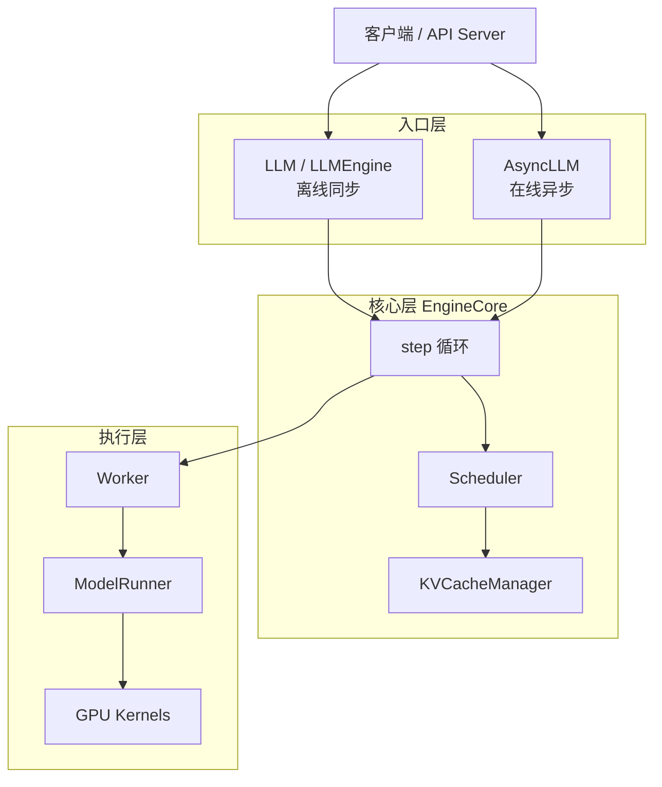
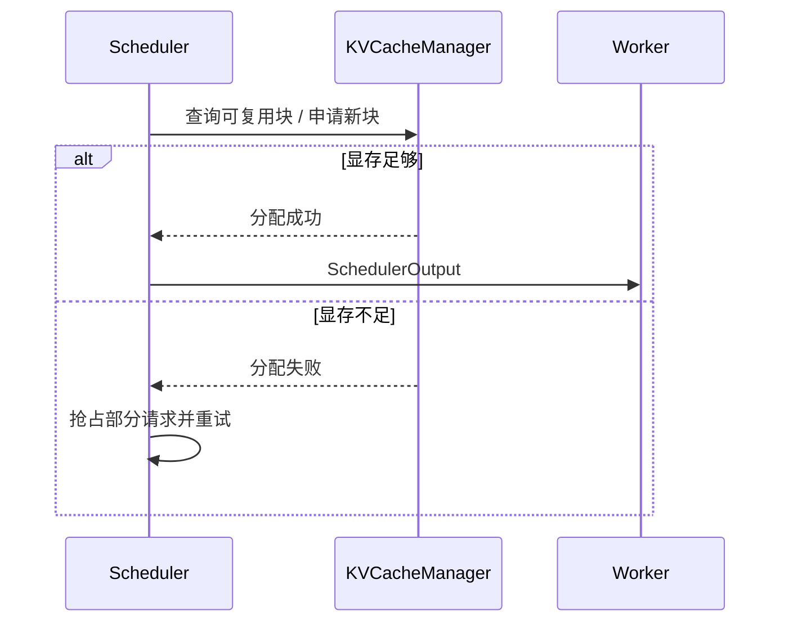

上一节已经能把模型跑起来、把 OpenAI 兼容服务拉起来。接下来要回答的问题是：一个请求进了 vLLM 之后，到底经过哪些组件、谁决定它何时上 GPU、谁管它的 KV Cache、谁真正跑模型前向？这一节按 V1 引擎的分层设计把整条链路走通——后续读调度器源码、做配置调优，都建立在这张地图上。

<!-- more -->

## 📑 目录

- [1. 为什么要先看架构](#1-为什么要先看架构)
- [2. 分层鸟瞰：五层职责](#2-分层鸟瞰五层职责)
- [3. 入口层：LLMEngine 与 AsyncLLM](#3-入口层llmengine-与-asyncllm)
- [4. 核心层：EngineCore 执行循环](#4-核心层enginecore-执行循环)
- [5. 调度与显存：Scheduler + KVCacheManager](#5-调度与显存scheduler--kvcachemanager)
- [6. 执行层：Worker 与 ModelRunner](#6-执行层worker-与-modelrunner)
- [7. 端到端数据流：一个请求的一生](#7-端到端数据流一个请求的一生)
- [8. 同步与异步两条路径](#8-同步与异步两条路径)
- [总结](#-总结)
- [自我检验清单](#-自我检验清单)
- [参考资料](#-参考资料)

---

## 1. 为什么要先看架构

推理引擎的难点不在"会不会调 API"，而在**吞吐、延迟、显存三者同时受约束**。调一个参数却不知道它落在哪一层，就只能靠试错。

vLLM V1 把系统切成清晰的几层：入口只负责接单与交付，核心循环只负责调度与执行，Worker 只负责前向。理解这套分工后，你才能把"并发上不去""TTFT 抖动""抢占频繁"等问题定位到正确的层。

🔑 **核心概念**：**架构图不是背组件名，而是回答三件事——谁拥有请求状态、谁决定下一步算哪些 Token、谁真正碰 GPU。**

---

## 2. 分层鸟瞰：五层职责

用一张图先建立全局感（以 V1 为主）：



| 层级 | 核心组件 | 一句话职责 |
|---|---|---|
| 入口层 | `LLM` / `LLMEngine`、`AsyncLLM` | 接请求、做 Tokenize/Detokenize、把结果交回调用方 |
| 核心层 | `EngineCore` | 隔离后的主循环：调度 → 执行 → 回收输出 |
| 调度 | `Scheduler` | 决定本步哪些请求、各处理多少 Token |
| 显存 | `KVCacheManager` | 为调度结果分配/释放 KV Block |
| 执行 | `Worker` + `ModelRunner` | 组装输入、跑模型前向、采样下一个 Token |

📌 **关键点**：V1 刻意把 **Tokenize / Detokenize / 流式回包** 等 CPU 重活放在入口侧，与 `EngineCore` 的调度+执行循环**重叠**——这是后面 3.3 节"多进程隔离"的动机。

---

## 3. 入口层：LLMEngine 与 AsyncLLM

对使用者来说，常见入口只有两个：

- **`LLM`（内部走同步引擎路径）**：适合离线批处理、脚本评测。调用方阻塞等待整批结果。
- **`AsyncLLM`**：适合 `vllm serve` 这类在线服务。请求以异步方式进入，输出可流式推送。

两者在业务语义上类似（提交 Prompt → 拿 Completion），但并发模型不同：

| 维度 | `LLM` / 同步引擎 | `AsyncLLM` |
|---|---|---|
| 典型场景 | 离线批量、单进程脚本 | OpenAI 兼容 HTTP 服务 |
| 调用方式 | 阻塞 `generate` / `chat` | `async` 提交 + 流式消费 |
| CPU 重叠 | 有限 | 与 EngineCore 深度重叠 |
| 进程形态 | 可同进程 | V1 下常与 EngineCore 分进程 |

💡 **提示**：`vllm serve` 背后走的是异步路径。你在业务里用 OpenAI SDK 打 `/v1/chat/completions`，请求最终会落到 `AsyncLLM` → `EngineCore`，而不是你脚本里那个同步 `LLM` 对象。

---

## 4. 核心层：EngineCore 执行循环

`EngineCore` 是 V1 的心脏。可以把它想成工厂里的**总调度室**：外面的订单（请求）先进来排队，总调度室每拍（一步 `step`）决定这一拍产哪些货、产多少，再把指令发给车间（Worker）。

一个极简的循环骨架如下（概念伪代码，非逐字源码）：

```python
# 概念示意：EngineCore.step()
def step(self):
    # 1) 调度：产出 {request_id: num_tokens} + KV 块分配
    scheduler_output = self.scheduler.schedule()

    # 2) 执行：Worker/ModelRunner 做前向 + 采样
    model_output = self.executor.execute_model(scheduler_output)

    # 3) 更新：把新 Token、完成状态写回请求；释放结束请求的 KV
    engine_core_output = self.scheduler.update_from_output(
        scheduler_output, model_output
    )
    return engine_core_output
```

每一步只做三件事：**排谁上、算一把、写回状态**。复杂特性（Chunked Prefill、Prefix Cache、投机解码）都尽量折叠进"本步给每个请求多少 Token"这一表示，而不是再搞一套并行状态机——这是 V1 相对 V0 的关键简化，下一节会展开。

⚠️ **注意**：源码类名与方法签名会随版本演进（例如 executor 的封装层级）。抓住"调度 → 执行 → 更新"三拍循环即可，不要死记某一版函数名。

---

## 5. 调度与显存：Scheduler + KVCacheManager

### 5.1 Scheduler：决定"算什么"

`Scheduler` 维护请求的生命周期队列（Waiting / Running 等），并在每一步给出：

- 本步参与计算的请求集合；
- 每个请求本步处理的 Token 数（Token Budget 分配）；
- 需要新分配或可复用的 KV 块信息。

输出通常会打包成类似 `SchedulerOutput` 的结构，交给执行层。

### 5.2 KVCacheManager：决定"显存够不够"

调度想让某个请求进 Running、或给它追加 Decode Token，必须先过 `KVCacheManager`：

- 查 Prefix Cache：前面多少 Token 已经有现成 KV；
- `allocate_slots`：为新增 Token 申请物理块；
- 空闲块不够 → 返回失败信号，触发抢占（Preemption）。

两者的关系可以记成一句话：**Scheduler 提需求，KVCacheManager 批预算。**



📌 **关键点**：你在日志里看到的 preemption，根因几乎都在这一层——不是模型算不动，而是**块池被抽干了**。第 2.1 节讲的 PagedAttention，正是在这里落地。

---

## 6. 执行层：Worker 与 ModelRunner

- **Worker**：进程/设备侧的执行代理。张量并行时，每个 rank 一个 Worker；V1 让各 Worker 更对称——本地缓存请求状态，每步只接收增量 diff，而不是整包重传元数据。
- **ModelRunner**：真正拼输入张量、调 Attention 后端、跑 `forward`、做 Sampling 的地方。Persistent Batch（缓存输入张量、只打补丁）就发生在这一层附近。

用餐厅类比：

- Scheduler = 前台排桌（谁先上、上几道菜的分量）；
- KVCacheManager = 仓库管货架（有没有空盘子/能不能复用半成品）；
- Worker/ModelRunner = 后厨出菜（真正开火）。

---

## 7. 端到端数据流：一个请求的一生

把一条 Chat 请求从进入到返回串起来：

1. **接入**：HTTP / Python API 收到 messages，入口层做 Chat Template + Tokenize，得到 `input_ids`。
2. **入队**：请求对象进入 Scheduler 的 Waiting 队列，带上采样参数、最大长度等约束。
3. **调度准入**：某次 `schedule()` 发现还有 Token Budget 和空闲 KV 块，把它迁入 Running；若命中 Prefix Cache，则跳过已缓存前缀的 Prefill。
4. **执行**：Worker 根据本步 Token 数组装 batch，ModelRunner 前向；Prefill 段可能被切成多个 Chunk 跨 step 完成（Chunked Prefill）。
5. **Decode 循环**：每步为该请求分配约 1 个新 Token 的预算（投机解码等场景会更多），写回 KV，采样出下一个 token_id。
6. **完成与释放**：遇到 EOS / 达到 `max_tokens` 后，请求从 Running 移除；KV 块按策略释放（带哈希的块可留在池中供后续复用）。
7. **交付**：入口层 Detokenize，同步返回或流式推给客户端。

| 阶段 | 主要组件 | 你感知到的指标 |
|---|---|---|
| Tokenize / 入队 | AsyncLLM / API Server | 排队时延 |
| 首次进 Running + Prefill | Scheduler + ModelRunner | TTFT（首 Token 时延） |
| 持续 Decode | Scheduler + ModelRunner | TPOT / 生成速度 |
| Detokenize / 流式回包 | 入口层 | 端到端体感延迟 |

---

## 8. 同步与异步两条路径

最后补一张"调用路径"对照，避免把两个入口混为一谈：

| 路径 | 典型入口 | EngineCore 关系 | 适合 |
|---|---|---|---|
| 离线同步 | `LLM.generate` / `LLM.chat` | 同进程或紧密耦合地驱动 step | 批处理、评测 |
| 在线异步 | `vllm serve` → `AsyncLLM` | V1 下常分进程，ZMQ 等 IPC 传请求/输出 | 在线服务、流式 |

⚠️ **注意**：对外 API 稳定，不代表内部永远只有一套引擎实现。学习与排障时以 **V1 的 EngineCore 路径**为准；遇到老文档提到的 V0 类名（如历史上的部分 Engine 结构），先对照你安装的版本再下结论。

---

## 📝 总结

- vLLM V1 可粗分为**入口层、EngineCore、Scheduler、KVCacheManager、Worker/ModelRunner**五层职责。
- **入口**负责接单与编解码；**EngineCore** 以 `schedule → execute → update` 三拍循环驱动系统。
- **Scheduler** 决定本步算哪些请求、各多少 Token；**KVCacheManager** 用 PagedAttention 块池审批显存预算。
- **Worker/ModelRunner** 真正执行前向与采样；张量并行下靠本地状态 + 增量 diff 保持对称。
- 一条请求的一生是：Tokenize → Waiting → 分配 KV → Prefill/Decode 多步 → 释放/复用块 → Detokenize 返回。

## 🎯 自我检验清单

- 能画出 V1 从入口到 GPU 的分层示意图，并说出每层一句话职责
- 能区分 `LLM` 同步路径与 `AsyncLLM` / `vllm serve` 异步路径
- 能用"三拍循环"描述 `EngineCore.step()` 在做什么
- 能说明 Scheduler 与 KVCacheManager 如何配合完成准入与抢占
- 能顺着一条 Chat 请求，指出 TTFT 与 Decode 延迟大致落在哪几步
- 能解释 Worker 与 ModelRunner 的分工，以及为什么需要增量 diff

## 📚 参考资料

- [vLLM Architecture Overview](https://docs.vllm.ai/en/latest/design/arch_overview.html)
- [vLLM V1: A Major Upgrade to vLLM's Core Architecture（官方博客）](https://blog.vllm.ai/2025/01/27/v1-alpha-release.html)
- [vLLM Engine Arguments](https://docs.vllm.ai/en/latest/configuration/engine_args.html)
- [vLLM V1 源码树 — vllm/v1](https://github.com/vllm-project/vllm/tree/main/vllm/v1)
- [Efficient Memory Management for Large Language Model Serving with PagedAttention](https://arxiv.org/abs/2309.06180)
