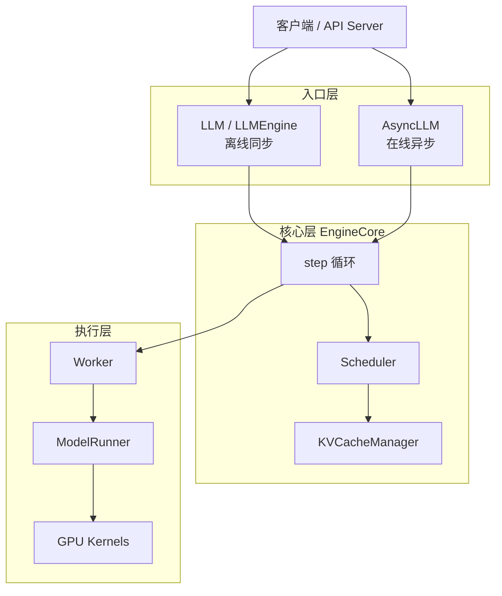
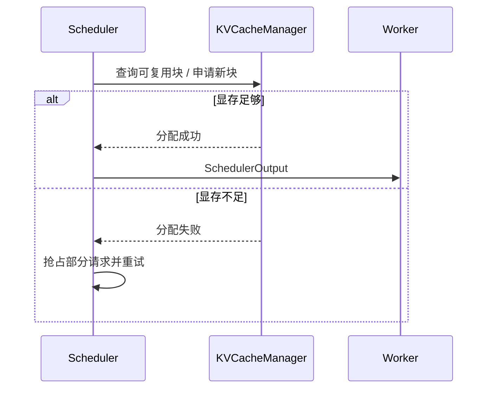

上一节已经能把模型跑起来、把 OpenAI 兼容服务拉起来。接下来要回答的问题是：一个请求进了 vLLM 之后，到底经过哪些组件、谁决定它何时上 GPU、谁管它的 KV Cache、谁真正跑模型前向？这一节按 V1 引擎的分层设计把整条链路走通——后续读调度器源码、做配置调优，都建立在这张地图上。

<!-- more -->

## 📑 目录

- [1. 为什么要先看架构](#1-为什么要先看架构)
- [2. 分层鸟瞰：五层职责](#2-分层鸟瞰五层职责)
- [3. 入口层：LLMEngine 与 AsyncLLM](#3-入口层llmengine-与-asyncllm)
- [4. 核心层：EngineCore 执行循环](#4-核心层enginecore-执行循环)
- [5. 调度与显存：Scheduler + KVCacheManager](#5-调度与显存scheduler--kvcachemanager)
- [6. 执行层：Worker 与 ModelRunner](#6-执行层worker-与-modelrunner)
- [7. 端到端数据流：一个请求的一生](#7-端到端数据流一个请求的一生)
- [8. 同步与异步两条路径](#8-同步与异步两条路径)
- [9. 架构带来的代价与排障定位](#9-架构带来的代价与排障定位)
- [总结](#-总结)
- [自我检验清单](#-自我检验清单)
- [参考资料](#-参考资料)

---

## 1. 为什么要先看架构

推理引擎的难点不在"会不会调 API"，而在**吞吐、延迟、显存三者同时受约束**。调一个参数却不知道它落在哪一层，就只能靠试错。

vLLM V1 把系统切成清晰的几层：入口只负责接单与交付，核心循环只负责调度与执行，Worker 只负责前向。理解这套分工后，你才能把"并发上不去""TTFT 抖动""抢占频繁"等问题定位到正确的层。

🔑 **核心概念**：**架构图不是背组件名，而是回答三件事——谁拥有请求状态、谁决定下一步算哪些 Token、谁真正碰 GPU。**

---

## 2. 分层鸟瞰：五层职责

用一张图先建立全局感（以 V1 为主）：



| 层级 | 核心组件 | 一句话职责 |
|---|---|---|
| 入口层 | `LLM` / `LLMEngine`、`AsyncLLM` | 接请求、做 Tokenize/Detokenize、把结果交回调用方 |
| 核心层 | `EngineCore` | 隔离后的主循环：调度 → 执行 → 回收输出 |
| 调度 | `Scheduler` | 决定本步哪些请求、各处理多少 Token |
| 显存 | `KVCacheManager` | 为调度结果分配/释放 KV Block（PagedAttention 落地处，见 [2.1](../第2章-推理引擎核心技术/2.1-PagedAttention.md)） |
| 执行 | `Worker` + `ModelRunner` | 组装输入、跑模型前向、采样下一个 Token |

📌 **关键点**：V1 刻意把 **Tokenize / Detokenize / 流式回包** 等 CPU 重活放在入口侧，与 `EngineCore` 的调度+执行循环**重叠**——这是下一节"多进程隔离"的动机。

---

## 3. 入口层：LLMEngine 与 AsyncLLM

对使用者来说，常见入口只有两个：

- **`LLM`（内部走同步引擎路径）**：适合离线批处理、脚本评测。调用方阻塞等待整批结果。
- **`AsyncLLM`**：适合 `vllm serve` 这类在线服务。请求以异步方式进入，输出可流式推送。

| 维度 | `LLM` / 同步引擎 | `AsyncLLM` |
|---|---|---|
| 典型场景 | 离线批量、单进程脚本 | OpenAI 兼容 HTTP 服务 |
| 调用方式 | 阻塞 `generate` / `chat` | `async` 提交 + 流式消费 |
| CPU 重叠 | 有限 | 与 EngineCore 深度重叠 |
| 进程形态 | 可同进程 | V1 下常与 EngineCore 分进程 |

💡 **提示**：`vllm serve` 背后走的是异步路径。你在业务里用 OpenAI SDK 打 `/v1/chat/completions`，请求最终会落到 `AsyncLLM` → `EngineCore`，而不是脚本里那个同步 `LLM` 对象。

---

## 4. 核心层：EngineCore 执行循环

`EngineCore` 是 V1 的心脏。可以把它想成工厂里的**总调度室**：外面的订单（请求）先进来排队，总调度室每拍（一步 `step`）决定这一拍产哪些货、产多少，再把指令发给车间（Worker）。

教学伪代码（**非逐字源码**，类名随版本可能变）：

```python
# 概念示意：EngineCore.step()（非逐字）
def step(self):
    # 1) 调度：产出 {request_id: num_tokens} + KV 块分配
    scheduler_output = self.scheduler.schedule()

    # 2) 执行：Worker/ModelRunner 做前向 + 采样
    model_output = self.executor.execute_model(scheduler_output)

    # 3) 更新：把新 Token、完成状态写回请求；释放结束请求的 KV
    engine_core_output = self.scheduler.update_from_output(
        scheduler_output, model_output
    )
    return engine_core_output
```

每一步只做三件事：**排谁上、算一把、写回状态**。Chunked Prefill、Prefix Cache、投机解码都尽量折叠进"本步给每个请求多少 Token"这一表示（机制见 [2.4](../第2章-推理引擎核心技术/2.4-Chunked%20Prefill%20与统一调度.md)），而不是再搞一套并行状态机——这是 V1 相对 V0 的关键简化，下一节展开。

⚠️ **注意**：源码方法签名会随版本演进。抓住"调度 → 执行 → 更新"三拍即可，不要死记某一版函数名。

---

## 5. 调度与显存：Scheduler + KVCacheManager

### 5.1 Scheduler：决定"算什么"

`Scheduler` 维护 Waiting / Running 等队列，并在每一步给出：

- 本步参与计算的请求集合；
- 每个请求本步处理的 Token 数（Token Budget 分配）；
- 需要新分配或可复用的 KV 块信息。

输出通常打包成类似 `SchedulerOutput` 的结构，交给执行层。细节走读见 3.4。

### 5.2 KVCacheManager：决定"显存够不够"

调度想让某个请求进 Running、或给它追加 Decode Token，必须先过 `KVCacheManager`：

- 查 Prefix Cache：前面多少 Token 已经有现成 KV；
- `allocate_slots`：为新增 Token 申请物理块；
- 空闲块不够 → 返回失败信号，触发抢占（Preemption）。

两者的关系可以记成一句话：**Scheduler 提需求，KVCacheManager 批预算。**



📌 **关键点**：日志里的 preemption，根因几乎都在这一层——不是模型算不动，而是**块池被抽干了**。PagedAttention 的块表与块池，正是在这里落地。

---

## 6. 执行层：Worker 与 ModelRunner

- **Worker**：进程/设备侧的执行代理。张量并行时，每个 rank 一个 Worker；V1 让各 Worker 更对称——本地缓存请求状态，每步只接收增量 diff。
- **ModelRunner**：真正拼输入张量、调 Attention 后端、跑 `forward`、做 Sampling 的地方。Persistent Batch（缓存输入、只打补丁）发生在这一层附近。

统一餐厅类比（与 3.1 / 2.1 一致）：

- Scheduler = 前台排桌（谁先上、上几道菜的分量）；
- KVCacheManager = 仓库管货架（有没有空盘/能不能复用半成品）；
- Worker/ModelRunner = 后厨出菜（真正开火）。

---

## 7. 端到端数据流：一个请求的一生

把一条 Chat 请求串起来，并补一个带单位的小数例。

**假设**：某请求 Prompt 经 Tokenize 后为 **2048** 个 Token；Prefix Cache 未命中；`max_num_batched_tokens = 512`；同批还有 8 个 Decode 请求。

1. **接入**：HTTP / Python API 收到 messages，入口层做 Chat Template + Tokenize，得到 `input_ids`（本例 2048）。
2. **入队**：请求进入 Scheduler 的 Waiting 队列。
3. **调度准入**：某次 `schedule()` 发现还有序列名额与空闲 KV 块，把它迁入 Running。
4. **Chunked Prefill**：本步预算先留给 8 个 Decode（各 1 Token → 占 8），剩余约 **504**；该请求本步只能 Prefill `min(2048, 504) ≈ 504` 个 Token，`num_computed_tokens` 记到 504。整段 Prefill 大约要 **⌈2048/504⌉ ≈ 5** 个 step 才算完——这正是 2.4 的 Chunked Prefill，用略增的 TTFT 换 Decode 不被 2048 一次性堵死。
5. **Decode 循环**：Prefill 完成后，每步通常再分配约 1 个新 Token 预算，写回 KV，采样下一个 `token_id`。
6. **完成与释放**：EOS / 达 `max_tokens` 后离开 Running；KV 块按策略释放（带哈希的块可留作前缀复用）。
7. **交付**：入口层 Detokenize，同步返回或流式推给客户端。

| 阶段 | 主要组件 | 你感知到的指标 |
|---|---|---|
| Tokenize / 入队 | AsyncLLM / API Server | 排队时延 |
| 首次进 Running + Prefill chunks | Scheduler + ModelRunner | TTFT（被切块拉长是刻意权衡） |
| 持续 Decode | Scheduler + ModelRunner | TPOT / 出字速度 |
| Detokenize / 流式回包 | 入口层 | 端到端体感延迟 |

取舍句：在上例里，若把预算一次性放开到 ≥2048，该请求 TTFT 可能更好，但同批 8 个 Decode 的那一步会被整段 Prefill 拖成尖刺——**架构把"切块"做成默认能力，就是为了让你能显式做这笔交换**。

---

## 8. 同步与异步两条路径

| 路径 | 典型入口 | EngineCore 关系 | 适合 |
|---|---|---|---|
| 离线同步 | `LLM.generate` / `LLM.chat` | 同进程或紧密耦合地驱动 step | 批处理、评测 |
| 在线异步 | `vllm serve` → `AsyncLLM` | V1 下常分进程，经 IPC 传请求/输出 | 在线服务、流式 |

⚠️ **注意**：对外 API 稳定，不代表内部永远只有一套引擎实现。学习与排障以 **V1 的 EngineCore 路径**为准；遇到老文档里的 V0 类名，先对照你安装的版本。

---

## 9. 架构带来的代价与排障定位

分层换来的是可维护性与 CPU/GPU 重叠，不是零成本：

| 收益 | 代价 |
|---|---|
| 入口与核心循环解耦，小模型高 QPS 时更不容易被 Tokenize 堵死 | 多进程 + IPC：调试栈更长，要会看"卡在前端还是 EngineCore" |
| Scheduler / KV / Worker 职责清晰，参数有落点 | 出问题时不能只盯 ModelRunner；抢占、预算、块池都在别层 |
| 统一 `{id: num_tokens}` 表示，特性可组合 | 心智模型要从"Prefill 阶段 / Decode 阶段"切换到"每步预算" |

**症状 → 先看哪一层**（排障速查）：

| 症状 | 优先怀疑 | 对应组件 |
|---|---|---|
| HTTP 已 200 排队很长，GPU 却很闲 | 前端过载 / Tokenize 跟不上 | 入口层、API Server |
| 日志频繁 preemption，P99 尖刺 | KV 块池不够 | `KVCacheManager` / 容量参数 |
| 长 Prompt 一来，在线出字全卡 | 单步 Prefill 过重或预算过大 | `Scheduler` + `max_num_batched_tokens`（见 2.4、3.5） |
| 所有请求统一变慢，Util 打满 | 算力/带宽打满或 batch 过大 | `ModelRunner` / 并发与预算 |
| 仅 TP 多卡异常、单卡正常 | 并行通信或某 rank Worker | Worker 层、分布式配置 |
| Chat 乱码但离线 `llm.chat` 正常 | 模板/路由打错 API | 入口层，而非 Scheduler |

📌 **关键点**：把问题先映射到层，再决定改参数还是读源码——这是架构图的实用价值，也是下一节拆 V1 改动的前提。

---

## 📝 总结

- vLLM V1 可粗分为**入口层、EngineCore、Scheduler、KVCacheManager、Worker/ModelRunner**。
- **EngineCore** 以 `schedule → execute → update` 三拍驱动；Scheduler 提需求，KVCacheManager 批显存预算。
- 2048 Token 的 Prompt 在预算 512 量级下会跨多步 Prefill——这是 Chunked Prefill 在架构上的自然结果。
- 分层的代价是多进程调试与"预算心智"；排障时应先按症状定位到层。

## 🎯 自我检验清单

- 能画出 V1 从入口到 GPU 的分层示意图，并说出每层一句话职责
- 能区分 `LLM` 同步路径与 `AsyncLLM` / `vllm serve` 异步路径
- 能用"三拍循环"描述 `EngineCore.step()` 在做什么
- 能说明 Scheduler 与 KVCacheManager 如何配合完成准入与抢占
- 能用"2k Prompt + 512 预算"估算 Prefill 大约跨多少 step，并说出对 TTFT/TPOT 的含义
- 能根据"频繁 preemption / 前端排队 / 长 Prefill 卡 Decode"三类症状指出优先排查层
- 能解释 Worker 与 ModelRunner 的分工，以及为什么需要增量 diff

## 📚 参考资料

- [vLLM Architecture Overview](https://docs.vllm.ai/en/latest/design/arch_overview.html)
- [vLLM V1: A Major Upgrade to vLLM's Core Architecture](https://blog.vllm.ai/2025/01/27/v1-alpha-release.html)
- [vLLM Engine Arguments](https://docs.vllm.ai/en/latest/configuration/engine_args.html)
- [vLLM V1 源码树 — vllm/v1](https://github.com/vllm-project/vllm/tree/main/vllm/v1)
- [本模块 2.1 PagedAttention](../第2章-推理引擎核心技术/2.1-PagedAttention.md)
- [本模块 2.4 Chunked Prefill](../第2章-推理引擎核心技术/2.4-Chunked%20Prefill%20与统一调度.md)
