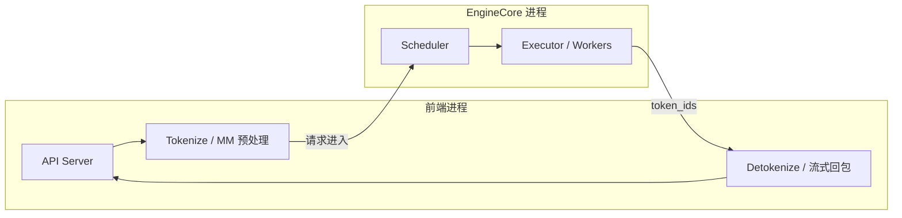
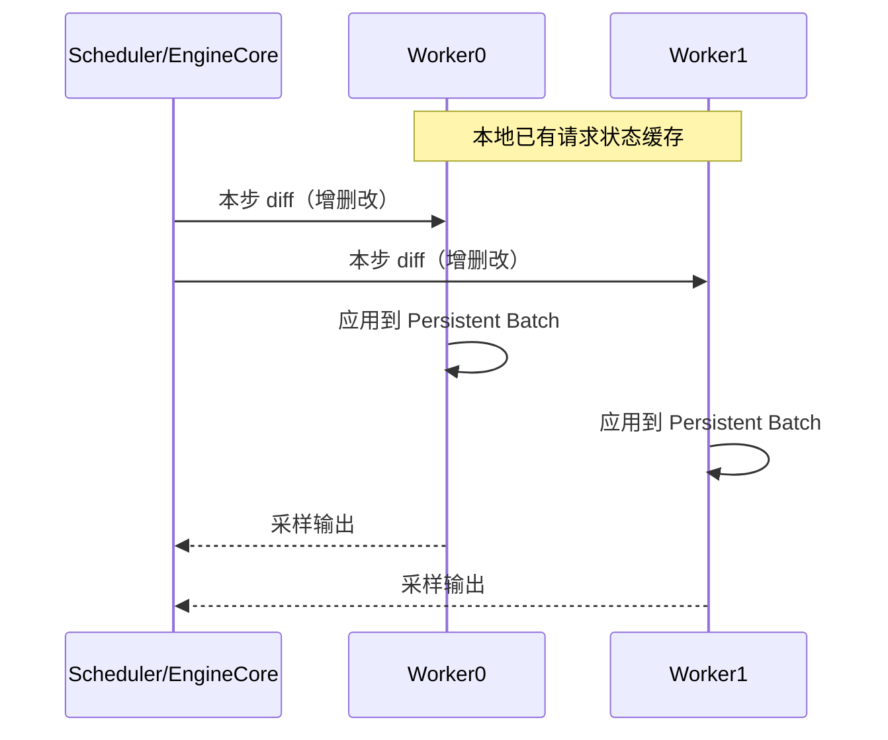

上一节把 V1 的分层地图铺开了。这一节聚焦"V1 到底改了什么"：它不是换了一套用户 API，而是把调度、KV 管理、Worker、采样和 API 服务侧的核心路径重做了一遍，目标是**更简单的代码 + 近零 CPU 开销 + 默认开启关键优化**。官方基准在特定前提下报告相对 V0 吞吐最高约 **1.7x**——收益主要来自架构减负，而不是换了一套全新 GPU Kernel。本节把每项改动的"换来了什么、付出什么"钉死，并说清 1.7x 何时可期待、何时不该拿来当承诺。

<!-- more -->

## 📑 目录

- [1. 为什么需要 V1](#1-为什么需要-v1)
- [2. 多进程隔离：让 CPU 与 GPU 重叠](#2-多进程隔离让-cpu-与-gpu-重叠)
- [3. 统一 Token 预算调度](#3-统一-token-预算调度)
- [4. 近零开销 Prefix Cache](#4-近零开销-prefix-cache)
- [5. Persistent Batch：只传增量 diff](#5-persistent-batch只传增量-diff)
- [6. 其它关键拼图](#6-其它关键拼图)
- [7. 约 1.7x：基线、负载与适用边界](#7-约-17x基线负载与适用边界)
- [8. 代价、适用与不适用](#8-代价适用与不适用)
- [总结](#-总结)
- [自我检验清单](#-自我检验清单)
- [参考资料](#-参考资料)

---

## 1. 为什么需要 V1

V0 在两年多时间里堆出了惊人的模型与硬件覆盖面，但也留下了典型的"水平扩展成功、垂直整合吃力"：

- 特性各自演进，Prefill/Decode、Chunked Prefill、Prefix Cache 等难以干净组合；
- GPU 越来越快（小模型在 H100 上一步可能只有数毫秒），**CPU 侧调度、组 batch、编解码**反而成为瓶颈；
- 为了省 IPC，调度器与 Worker0 同进程，架构不对称，张量并行路径更难维护。

V1 的目标可以压缩成四句话：**简单可改、近零 CPU 开销、优化默认组合、用户零改 API。**

🔑 **核心概念**：**V1 保留了模型实现、多数 Kernel 与分布式控制面，重写的是"引擎核心"——Scheduler、KVCacheManager、Worker、Sampler 与执行循环的组织方式。**

---

## 2. 多进程隔离：让 CPU 与 GPU 重叠

### 2.1 问题：GPU 等 CPU

在线服务里，一步模型前向前后夹着大量 CPU 工作：接收 HTTP、Tokenize、多模态预处理、调度决策、Detokenize、流式写回。若这些与核心循环串行，GPU 就会空转。

### 2.2 V1 的解法：EngineCore 专核

V0.6 起已有多进程 API Server；V1 把多进程推到更深——抽出隔离的 **`EngineCore` 执行循环**，只专注：

1. 调度；
2. 调用模型执行器；
3. 回收输出、更新请求状态。

Tokenize、多模态预处理、Detokenize、向客户端流式推送，尽量放在核心循环之外并行。

| 换来了什么 | 付出什么 |
|---|---|
| CPU 杂务与 GPU step **时间重叠**，小模型高 QPS 时吞吐更稳 | 多进程调试更难；IPC 本身有固定成本 |
| 核心循环更干净，特性迭代不易把 API 层搅乱 | 排障要分清"堵在前端"还是"堵在 EngineCore"（见 3.2 定位表） |

📌 **关键点**：V1 的性能故事，很大一部分是**时间重叠**——不是单步 MatMul 突然快了 70%，而是 CPU 杂务不再堵住 GPU 的下一拍。

💡 **提示**：早期开启 V1 需要环境变量；随着版本推进，V1 已逐步成为默认引擎。以你安装版本的文档与 release note 为准。

---

## 3. 统一 Token 预算调度

Chunked Prefill 与 Token Budget 的机制已在 [2.4](../第2章-推理引擎核心技术/2.4-Chunked%20Prefill%20与统一调度.md) 讲透。这里只看 V1 的**工程切口**：调度表示如何被抹平。

V0 里 Prefill 与 Decode 常被当成两种阶段，Chunked Prefill 等特性是后加的，状态机容易臃肿。V1 换了更干净的抽象：

> 每一步只输出一个字典：`{request_id: num_tokens}`——本步每个请求要处理多少 Token。

于是：

- **Decode**：通常 `num_tokens = 1`（或投机解码时 > 1）；
- **Prefill / Chunked Prefill**：`num_tokens` 可以是 prompt 剩余长度，或被预算截断后的一个 chunk；
- **Prefix Cache 命中**：已缓存部分不再计入需要计算的 Token，只为未命中后缀分配预算。

| 换来了什么 | 付出什么 |
|---|---|
| Chunked Prefill、混批、投机验证用同一套调度语言表达 | 心智要从"两个阶段"换成"每步预算"；读旧博客易错位 |
| Prefill/Decode 特性可组合，代码路径更短 | 并不消灭两者在 Kernel 上的算力差异——只是调度不再维护两套语义 |

| 场景 | V0 常见思维 | V1 统一预算 |
|---|---|---|
| 长 Prompt | 单独 Prefill 阶段，或后补 Chunked Prefill | 直接分配部分 Token 预算 |
| 在线 Decode | 与 Prefill 强分离 | 与 chunk 共享同一步预算 |
| 投机解码 | 额外特殊路径更多 | 仍是"该请求本步多算几个 Token" |

⚠️ **注意**：统一调度不等于"没有 Prefill/Decode 计算差异"。变的是**调度表示**，不是物理定律。

---

## 4. 近零开销 Prefix Cache

Automatic Prefix Caching（哈希 + 按块复用）的原理见第 2.3 节。V1 的切口是**空载开销与默认策略**：

| 项目 | V0 | V1 |
|---|---|---|
| 低命中率时 | 可能引入明显 CPU 开销，吞吐反而下降 | 官方测得命中率 0% 时吞吐下降通常 < 1% |
| 默认开关 | 常默认关闭 | **常见默认开启**（以当前文档为准） |
| 实现要点 | 数据结构与 Python 对象开销更重 | 常量时间淘汰、减少对象创建 |

| 换来了什么 | 付出什么 |
|---|---|
| 即使前缀很少命中，也不必为了"怕拖后腿"先关缓存 | 块级哈希仍有对齐粒度；极短、无共享前缀的流量收益接近 0 |
| 命中上来后 Prefill/TTFT 可显著改善 | 缓存池与 KV 池争空间——极端内存压力下仍要靠容量参数兜底 |

📌 **关键点**：调优时更应关注**请求是否真有共享前缀**，而不是先纠结开关。无共享时保持默认开通常也不可怕；有共享时它是 TTFT 的主杠杆之一。

---

## 5. Persistent Batch：只传增量 diff

### 5.1 V0 的浪费

每一步都重新构建输入张量与元数据，Python 侧开销在高 QPS、小模型场景非常刺眼。

### 5.2 V1 的 Persistent Batch

- 在执行侧**缓存**当前 batch 的输入张量/元数据；
- 每步只把**增量变更（diff）**打进缓存：谁新加入、谁结束离开、哪些位置追加了 Token；
- 尽量用批量数组操作更新，而不是纯 Python 循环拼列表。

### 5.3 与张量并行对称架构

V0 为减少广播开销，曾让 Scheduler 与 Worker0 同进程，造成不对称。V1 靠"Worker 本地缓存请求状态 + 每步只传 diff"，把 IPC 体积压下去，从而允许 **Scheduler 与 Worker0 分进程**，架构重新对称。

| 换来了什么 | 付出什么 |
|---|---|
| 砍掉每步全量重建与沉重元数据广播，CPU 开销下降 | 实现更绕：状态不一致时排查要同时看本地缓存与 diff |
| TP 路径与单卡路径更对称，可维护性上升 | 依赖"本地状态正确"——进程崩溃恢复路径必须干净重建缓存 |

---

## 6. 其它关键拼图

V1 博客还点名了几块与吞吐强相关、但本节能简记的能力：

- **`torch.compile` + Piecewise CUDA Graph**：扩大可自动优化的模型面，同时缓解"整图 CUDA Graph 太僵"的问题；
- **FlashAttention 3 等后端**：更好支撑 Prefill/Decode 混批等动态 shape；
- **多模态一等公民**：预处理进独立进程、图像哈希参与 Prefix Cache、Encoder Cache 支持 MLLM 的 Chunked Prefill。

这些说明 V1 的性能是**全栈减负**：调度表示简化、IPC 减负、缓存默认可开、Kernel 与编译栈跟上混批现实。

---

## 7. 约 1.7x：基线、负载与适用边界

官方表述里的"最高约 1.7x"需要连同前提一起记，否则会变成营销数字。

| 前提项 | 常见口径（以 V1 发布博客为准，复测请固定你的版本） |
|---|---|
| 对比对象 | **V1 vs 不含 multi-step scheduling 的 V0** |
| 负载类型 | ShareGPT 类对话流量（偏短到中等 Prompt + 对话 Decode） |
| 变化来源 | 架构减负（进程重叠、调度/IPC/缓存），**不是**宣称换了一套全新 Attention Kernel |
| 表述性质 | 官方基准上的**上限量级**，不是 SLA 保证 |

**更可能接近大幅收益的场景**

- 小到中模型 + 很快的 GPU（单步仅数毫秒）→ CPU/调度更容易成为瓶颈；
- 高 QPS 在线服务，Tokenize/Detokenize/组 batch 频繁；
- 能吃到默认 Prefix Cache 或混批调度简化的流量。

**收益容易收窄的场景**

- 极大模型、强 Kernel / 通信 bound（时间都花在 MatMul 与 AllReduce 上）；
- 极低并发、离线批处理（本来就没什么 CPU 重叠可挖）；
- 你的 V0 已开 multi-step 等激进优化时，对比基线与官方不一致。

取舍句：若你的画像是"7B～13B、高并发 Chat、GPU 一步几毫秒"，把 V1 当作默认引擎是合理预期；若画像是"70B+ TP、已经 Kernel-bound"，应自己复测，**不要在容量规划里直接写死 1.7x**。

| 维度 | V0 | V1 |
|---|---|---|
| 核心循环 | CPU 杂务更易与执行串行 | EngineCore 隔离，CPU/GPU 重叠更好 |
| 调度抽象 | Prefill/Decode 阶段感强 | `{id: num_tokens}` 统一预算 |
| Prefix Cache | 低命中可能亏，常默认关 | 近零开销，常见默认开 |
| Batch 准备 | 每步重建输入 | Persistent Batch + diff |
| TP 架构 | Scheduler 与 Worker0 易耦合 | 对称多进程，Worker 本地状态 |
| 抢占恢复 | 曾依赖 GPU↔CPU KV Swap 等路径 | 核心简化后**不再依赖** KV Swap；常见路径是丢弃 KV 后 Recompute |
| 官方吞吐对比 | 基线 | 最高约 **1.7x**（见上表前提） |

💡 **提示**：功能矩阵仍在快速演进。早期 alpha 缺的能力后续版本已大量补齐；选型时查当前文档的 V1 特性表，不要拿旧限制清单当永久结论。

---

## 8. 代价、适用与不适用

| 适用（把 V1 当默认） | 不适用 / 需额外验证 |
|---|---|
| 新部署的在线 Chat/API | 你依赖的冷门特性仅在某条旧 V0 路径验证过 |
| 小模型高 QPS、怀疑 CPU 瓶颈 | 强依赖历史上的 KV Swap 抢占语义（V1 主路径是 Recompute） |
| 希望 Prefix Cache / Chunked Prefill 默认可组合 | 调试工具与内部指标仍按 V0 类名编写的老运维脚本 |

总代价可以记成一句话：**用多进程与更抽象的调度表示，换 CPU 重叠和可组合性；用 Recompute 简化抢占实现，换被抢占请求的重算延迟。** 下一节进 Scheduler 源码，把预算与抢占的每一步钉死。

---

## 📝 总结

- V1 重写引擎核心，目标是简单、默认可组合、近零 CPU 开销；用户 API 保持兼容。
- **多进程 EngineCore**、**统一 Token 预算**、**近零开销 Prefix Cache**、**Persistent Batch + diff** 各自都有明确的收益与代价。
- 官方约 **1.7x** 是相对"无 multi-step 的 V0"、在 ShareGPT 类负载上的上限表述；小模型高 QPS 更易体现，Kernel-bound 大模型需自测。
- 抢占主路径走向 Recompute，不再依赖 GPU↔CPU KV Swap。

## 🎯 自我检验清单

- 能说明 V1 要解决的核心矛盾（GPU 变快后的 CPU 开销与架构债务）
- 能画出 API 前端进程与 EngineCore 进程的职责边界，并说出多进程的代价
- 能用 `{request_id: num_tokens}` 解释 Chunked Prefill 如何被统一调度表达
- 能对比 V0/V1 在 Prefix Cache 默认策略与空载开销上的差异
- 能解释 Persistent Batch 与"只传 diff"如何支撑对称多进程 TP
- 能完整复述 1.7x 的对比基线、负载前提与不适用场景
- 能指出 V1 抢占为何不再依赖 GPU↔CPU KV Swap，以及 Recompute 付出什么

## 📚 参考资料

- [vLLM V1: A Major Upgrade to vLLM's Core Architecture](https://blog.vllm.ai/2025/01/27/v1-alpha-release.html)
- [vLLM V1 Guide](https://docs.vllm.ai/en/latest/usage/v1_guide.html)
- [vLLM Architecture Overview](https://docs.vllm.ai/en/latest/design/arch_overview.html)
- [vLLM Design — Automatic Prefix Caching](https://docs.vllm.ai/en/latest/design/prefix_caching.html)
- [vLLM GitHub — vllm/v1](https://github.com/vllm-project/vllm/tree/main/vllm/v1)
- [本模块 2.4 Chunked Prefill](../第2章-推理引擎核心技术/2.4-Chunked%20Prefill%20与统一调度.md)
