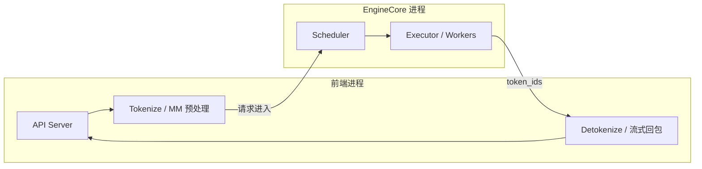
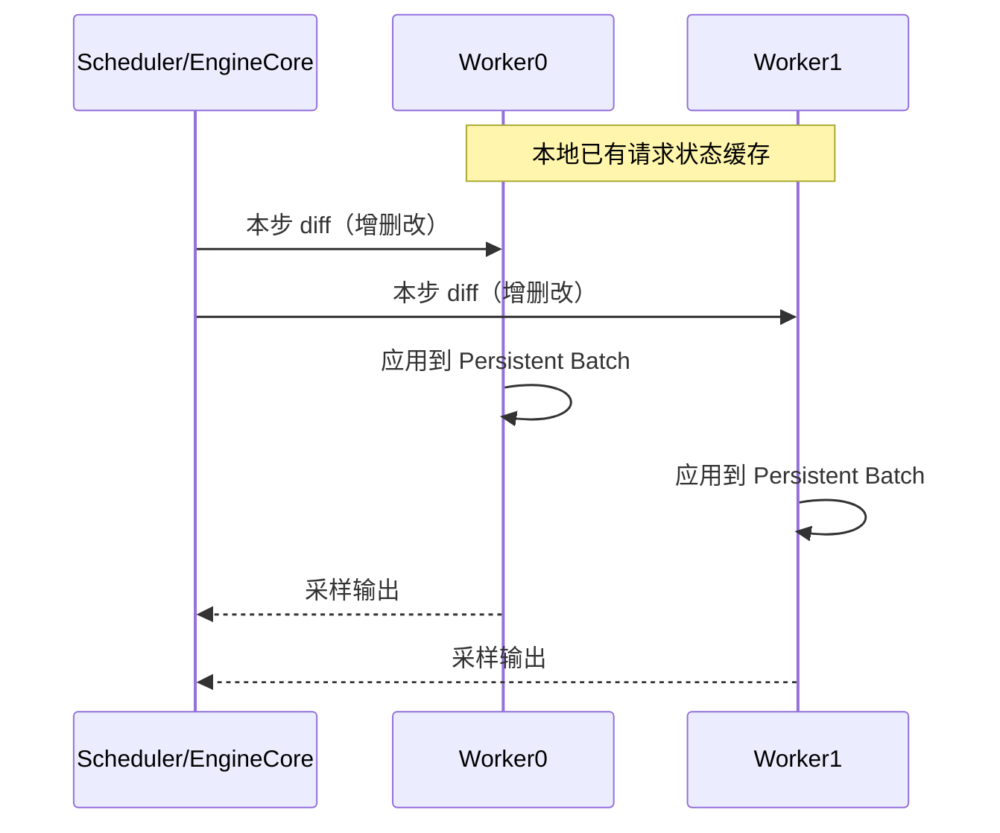

上一节把 V1 的分层地图铺开了。这一节聚焦"V1 到底改了什么"：它不是换了一套用户 API，而是把调度、KV 管理、Worker、采样和 API 服务侧的核心路径重做了一遍，目标是**更简单的代码 + 近零 CPU 开销 + 默认开启关键优化**。官方基准上，相对不含 multi-step 的 V0，吞吐最高约 **1.7x**——收益主要来自架构减负，而不是换了一套全新 GPU Kernel。

<!-- more -->

## 📑 目录

- [1. 为什么需要 V1](#1-为什么需要-v1)
- [2. 多进程隔离：让 CPU 与 GPU 重叠](#2-多进程隔离让-cpu-与-gpu-重叠)
- [3. 统一 Token 预算调度](#3-统一-token-预算调度)
- [4. 零开销 Prefix Cache](#4-零开销-prefix-cache)
- [5. Persistent Batch：只传增量 diff](#5-persistent-batch只传增量-diff)
- [6. 其它关键拼图](#6-其它关键拼图)
- [7. 相对 V0：收益与差异清单](#7-相对-v0收益与差异清单)
- [总结](#-总结)
- [自我检验清单](#-自我检验清单)
- [参考资料](#-参考资料)

---

## 1. 为什么需要 V1

V0 在两年多时间里堆出了惊人的模型与硬件覆盖面，但也留下了典型的"水平扩展成功、垂直整合吃力"：

- 特性各自演进，Prefill/Decode、Chunked Prefill、Prefix Cache 等难以干净组合；
- GPU 越来越快（小模型在 H100 上一步可能只有数毫秒），**CPU 侧调度、组 batch、编解码**反而成为瓶颈；
- 为了省 IPC，调度器与 Worker0 同进程，架构不对称，张量并行路径更难维护。

V1 的目标可以压缩成四句话：**简单可改、近零 CPU 开销、优化默认组合、用户零改 API。**

🔑 **核心概念**：**V1 保留了模型实现、多数 Kernel 与分布式控制面，重写的是"引擎核心"——Scheduler、KVCacheManager、Worker、Sampler 与执行循环的组织方式。**

---

## 2. 多进程隔离：让 CPU 与 GPU 重叠

### 2.1 问题：GPU 等 CPU

在线服务里，一步模型前向前后夹着大量 CPU 工作：接收 HTTP、Tokenize、多模态预处理、调度决策、Detokenize、流式写回。若这些与核心循环串行，GPU 就会空转。

### 2.2 V1 的解法：EngineCore 专核

V0.6 起已有多进程 API Server；V1 把多进程推到更深——抽出隔离的 **`EngineCore` 执行循环**，只专注：

1. 调度；
2. 调用模型执行器；
3. 回收输出、更新请求状态。

Tokenize、多模态预处理、Detokenize、向客户端流式推送，尽量放在核心循环之外并行。

📌 **关键点**：V1 的性能故事，很大一部分是**时间重叠**——不是单步算得更快，而是 CPU 杂务不再堵住 GPU 的下一拍。

💡 **提示**：早期开启 V1 需要 `VLLM_USE_V1=1`；随着版本推进，V1 已逐步成为默认引擎。以你安装版本的文档与 release note 为准。

---

## 3. 统一 Token 预算调度

V0 里 Prefill 与 Decode 常被当成两种阶段，Chunked Prefill 等特性是后加的，状态机容易臃肿。V1 换了更干净的抽象：

> 每一步只输出一个字典：`{request_id: num_tokens}`——本步每个请求要处理多少 Token。

于是：

- **Decode**：通常 `num_tokens = 1`（或投机解码时 > 1）；
- **Prefill / Chunked Prefill**：`num_tokens` 可以是 prompt 剩余长度，或被预算截断后的一个 chunk；
- **Prefix Cache 命中**：已缓存部分不再计入需要计算的 Token，只为未命中后缀分配预算。

统一预算还自然支持**同一 batch 混跑**长 Prompt 的 chunk 与大量 Decode 请求，避免"一个超长 Prefill 饿死所有在线 Decode"。

| 场景 | V0 常见思维 | V1 统一预算 |
|---|---|---|
| 长 Prompt | 单独 Prefill 阶段，或后补 Chunked Prefill | 直接分配部分 Token 预算 |
| 在线 Decode | 与 Prefill 强分离 | 与 chunk 共享同一步预算 |
| 投机解码 | 额外特殊路径更多 | 仍是"该请求本步多算几个 Token" |

⚠️ **注意**：统一调度不等于"没有 Prefill/Decode 计算差异"。Kernel 与算力特征仍不同；变的是**调度表示**不再逼你维护两套队列语义。

---

## 4. 零开销 Prefix Cache

V0/V1 都使用基于哈希的 Automatic Prefix Caching + LRU 淘汰（见第 2.3 节）。差别在工程开销：

| 项目 | V0 | V1 |
|---|---|---|
| 低命中率时 | 可能引入明显 CPU 开销，吞吐反而下降 | 官方测得命中率 0% 时吞吐下降通常 < 1% |
| 默认开关 | 常默认关闭 | **默认开启** |
| 实现要点 | 数据结构与 Python 对象开销更重 | 常量时间淘汰、减少对象创建 |

这就是"零开销"（更准确说是**近零开销**）的含义：就算前缀几乎从不命中，你也不必为了"怕拖后腿"去关缓存；一旦命中率上来，Prefill 计算与 TTFT 可以成倍改善。

📌 **关键点**：V1 把 Prefix Cache 从"高级可选项"变成了"默认基建"。调优时更应关注**请求是否真有共享前缀**，而不是先纠结要不要打开开关。

---

## 5. Persistent Batch：只传增量 diff

### 5.1 V0 的浪费

每一步都重新构建输入张量与元数据，Python 侧开销在高 QPS、小模型场景非常刺眼。

### 5.2 V1 的 Persistent Batch

- 在执行侧**缓存**当前 batch 的输入张量/元数据；
- 每步只把**增量变更（diff）**打进缓存：谁新加入、谁结束离开、哪些位置追加了 Token；
- 尽量用 NumPy 等批量操作更新，而不是纯 Python 循环拼列表。

### 5.3 与张量并行对称架构的关系

V0 为减少广播开销，曾让 Scheduler 与 Worker0 同进程，造成不对称。V1 靠"Worker 本地缓存请求状态 + 每步只传 diff"，把 IPC 体积压下去，从而允许 **Scheduler 与 Worker0 分进程**，架构重新对称——单卡与多卡 Worker 行为更一致。

---

## 6. 其它关键拼图

V1 博客还点名了几块与吞吐强相关、但本节能简记的能力：

- **`torch.compile` + Piecewise CUDA Graph**：扩大可自动优化的模型面，同时缓解"整图 CUDA Graph 太僵"的问题；
- **FlashAttention 3**：更好支撑 Prefill/Decode 混批等动态 shape；
- **多模态一等公民**：预处理进独立进程、图像哈希参与 Prefix Cache、Encoder Cache 支持 MLLM 的 Chunked Prefill。

这些不是"再背一堆名词"，而是说明 V1 的性能是**全栈减负**：调度表示简化、IPC 减负、缓存默认可开、Kernel 与编译栈跟上混批现实。

---

## 7. 相对 V0：收益与差异清单

| 维度 | V0 | V1 |
|---|---|---|
| 核心循环 | CPU 杂务更易与执行串行 | EngineCore 隔离，CPU/GPU 重叠更好 |
| 调度抽象 | Prefill/Decode 阶段感强 | `{id: num_tokens}` 统一预算 |
| Prefix Cache | 低命中可能亏，常默认关 | 近零开销，默认开 |
| Batch 准备 | 每步重建输入 | Persistent Batch + diff |
| TP 架构 | Scheduler 与 Worker0 易耦合 | 对称多进程，Worker 本地状态 |
| 抢占恢复 | 曾依赖 GPU↔CPU KV Swap 等路径 | 核心简化后，**不再依赖** KV Swap 做抢占；常见路径是丢弃 KV 后 Recompute |
| 官方吞吐对比 | 基线 | 最高约 **1.7x**（相对无 multi-step 的 V0；随模型/负载变化） |

⚠️ **注意**：1.7x 是官方在特定模型与 ShareGPT 类负载上的**上限表述**，不是你业务流量上的保证。小模型 + 高 QPS（CPU 更容易成为瓶颈）往往更能体现 V1；极大模型、强 Kernel-bound 场景下，差距可能收窄。

💡 **提示**：功能矩阵仍在快速演进。早期 alpha 缺的 logprobs、部分并行策略、结构化输出等，后续版本已大量补齐；选型时查当前文档的 V1 特性表，不要拿 2025 年初的限制清单当永久结论。

---

## 📝 总结

- V1 重写引擎核心，目标是简单、默认可组合、近零 CPU 开销，用户 API 保持兼容。
- **多进程 EngineCore** 把 Tokenize/Detokenize 等与调度执行重叠，减少 GPU 空等。
- **统一 Token 预算**抹平 Prefill/Decode 调度边界，天然容纳 Chunked Prefill 与混批。
- **Prefix Cache** 做到近零空载开销并默认开启；**Persistent Batch + diff** 砍掉每步重建与沉重 IPC。
- 官方报告相对 V0（无 multi-step）吞吐最高约 **1.7x**；抢占路径不再依赖 KV Swap，更多走 Recompute。

## 🎯 自我检验清单

- 能说明 V1 要解决的核心矛盾（GPU 变快后的 CPU 开销与架构债务）
- 能画出 API 前端进程与 EngineCore 进程的职责边界
- 能用 `{request_id: num_tokens}` 解释 Chunked Prefill 如何被统一调度表达
- 能对比 V0/V1 在 Prefix Cache 默认策略与空载开销上的差异
- 能解释 Persistent Batch 与"只传 diff"如何支撑对称多进程 TP
- 能正确理解 1.7x 的含义与适用边界，不把它当成无条件承诺
- 能指出 V1 抢占为何不再依赖 GPU↔CPU KV Swap

## 📚 参考资料

- [vLLM V1: A Major Upgrade to vLLM's Core Architecture](https://blog.vllm.ai/2025/01/27/v1-alpha-release.html)
- [vLLM V1 Guide](https://docs.vllm.ai/en/latest/usage/v1_guide.html)
- [vLLM Architecture Overview](https://docs.vllm.ai/en/latest/design/arch_overview.html)
- [vLLM Design — Automatic Prefix Caching](https://docs.vllm.ai/en/latest/design/prefix_caching.html)
- [vLLM GitHub — vllm/v1](https://github.com/vllm-project/vllm/tree/main/vllm/v1)
