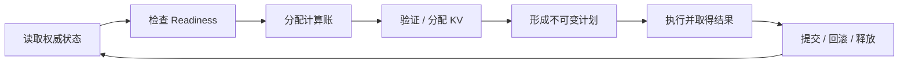

## 📑 目录
- [1. 真实问题：调度器不是请求排序器](#1-真实问题调度器不是请求排序器)
- [2. 稳定抽象：计算、KV、请求状态三本账](#2-稳定抽象计算kv请求状态三本账)
- [3. Waiting 与 Running 是生命周期语义](#3-waiting-与-running-是生命周期语义)
- [4. 一轮调度的理论闭环](#4-一轮调度的理论闭环)
- [5. 为什么通常先 Running、再 Waiting](#5-为什么通常先-running再-waiting)
- [6. Chunked Prefill：在预算内切分长工作](#6-chunked-prefill在预算内切分长工作)
- [7. Preemption 与 Recompute：容量不足时撤销承诺](#7-preemption-与-recompute容量不足时撤销承诺)
- [8. Structured Output：就绪状态进入调度](#8-structured-output就绪状态进入调度)
- [9. Speculative Decoding：计划工作不等于提交进度](#9-speculative-decoding计划工作不等于提交进度)
- [10. 唯一逐轮手算：三本账如何同时变化](#10-唯一逐轮手算三本账如何同时变化)
- [11. 公平性、优先级与跳过队首](#11-公平性优先级与跳过队首)
- [12. 指标、失败模式与源码阅读方法](#12-指标失败模式与源码阅读方法)
- [13. 代价、边界与框架对照](#13-代价边界与框架对照)
- [总结](#总结)
- [自我检验](#自我检验)
- [参考资料](#参考资料)
---
文件名保留“源码导读”，但本文不逐行复述某版 `schedule()`。源码会变，调度器必须维护的资源约束、状态不变量与提交闭环更稳定。
3.3 已经说明 V1 用统一进度表达 Prefill、Decode 和投机验证。本节把镜头收紧到每一轮：为什么计算预算还有余额时仍不能接纳请求，为什么已经 Running 的请求也可能退回 Waiting，以及为什么计划了五个 Token 最终可能只前进三个。

## 1. 真实问题：调度器不是请求排序器
普通任务队列常被简化为“按先来后到取下一个任务”。LLM 推理调度不同，因为一个请求不是取出一次就结束。每条请求可能经历：

```text
Waiting → Running → 第 1 轮 → 第 2 轮 → … → Finished
```

每轮只推进一部分 Token，下一轮又要和新到请求共同竞争资源。调度器因此同时承担四种角色：
- **Admission controller**：请求是否能从 Waiting 获得运行资源；
- **Iteration scheduler**：本轮选谁、推进多少 Token；
- **Resource accountant**：计算、KV 和请求槽位是否同时允许；
- **Lifecycle coordinator**：完成、取消、抢占和结果回滚后怎样恢复一致。
“队首是谁”只是 Policy 的一部分。一个请求即使优先级最高，也不能突破物理 KV 容量、模型长度或尚未就绪的 Grammar。

### 1.1 调度正确性先于利用率
错误调度可能表现为：
- 同一请求读到别人的 KV；
- 已取消请求被迟到结果复活；
- 计划的 Token 位置与写入位置不一致；
- 一个 rank 进入 Collective，另一个 rank 跳过；
- 投机候选被拒绝后，乐观进度没有回滚；
- Grammar 未就绪的请求消耗 GPU 后才发现非法。
所以“GPU 是否满载”不是调度器的第一问题。第一问题是每一次资源承诺都能被执行、提交或安全撤销。

## 2. 稳定抽象：计算、KV、请求状态三本账
理解调度器最有效的方法，是把所有判断还原为三本相互独立又必须同时平衡的账。

### 2.1 计算 Token 账
计算账描述本轮允许设备处理多少 Token 位置。记请求 \(i\) 本轮分配的工作量为 \(c_i\)，全局 Token Budget 为 \(B_{\text{token}}\)：

$$
\sum_i c_i\le B_{\text{token}}
$$

普通 Decode 的 \(c_i\) 常接近 1；Prefill Chunk 和投机验证可以大于 1。
Token 是控制面的统一货币，不是设备时间的精确计量。同样 128 Token，在长 Prefill、多个短 Decode 或不同 Attention Backend 下可能产生不同毫秒数。
### 2.2 KV 存储账
每个新计算位置通常要有相应 KV 槽位。记请求 \(i\) 需要新增的物理块数为 \(\Delta b_i\)，当前可分配块为 \(B_{\text{free}}\)：

$$
\sum_i \Delta b_i\le B_{\text{free}}
$$

块级分配意味着新增一个 Token 不一定新增一个块：当前尾块有空位时可直接追加，尾块已满时才需要新块。
Prefix Cache 命中会让一部分历史 KV 已经存在，但它仍占用可引用的物理块。命中减少新计算，不等于不计存储。

### 2.3 请求状态账
请求账描述谁已经被接纳、谁在等待、谁因依赖阻塞，以及哪些执行仍在途。常见约束可抽象为：

$$
|S_{\text{active}}|\le B_{\text{seq}}
$$

但一个“活跃槽位”还不足以决定可执行性。请求可能受下面条件约束：
- Grammar 是否编译完成；
- 多模态特征或远端 KV 是否就绪；
- 是否已取消或达到长度上限；
- 是否仍有一轮结果在途；
- 当前优先级与公平策略；
- 所需模型适配器或其他互斥资源是否可用。

### 2.4 三本账不能相互代替
下面三句话分别只说明一部分事实：
- “本轮还剩 100 Token”只说明计算账有余额；
- “显存还有一个空块”只说明存储账有部分余额；
- “并发上限还有一个槽位”只说明请求账允许再接纳一个身份。
调度一个请求需要三者与所有前置条件同时成立：

$$
\text{runnable}_i
=
C_i\land M_i\land S_i\land Ready_i
$$

这也是为什么把所有失败都归因于 `max_num_seqs` 或“显存不足”会误诊。

## 3. Waiting 与 Running 是生命周期语义
`Waiting` 和 `Running` 不应按字面理解为“CPU 队列”和“此刻在 GPU 上”。

### 3.1 Waiting
Waiting 表示请求已经到达运行时，但还没有获得持续运行资格，或者先前资格被撤销。它可能在等待：
- 首次 Admission；
- KV 容量；
- Grammar、媒体特征或远端状态；
- 更高优先级请求让出资源；
- 抢占后的重新计算。
Waiting 请求本轮没执行，不等于它不占任何 CPU 元数据，也不等于它一定没有可复用缓存。
### 3.2 Running
Running 表示请求已进入活跃生命周期，通常持有运行状态和 KV 引用，可以在后续轮次继续推进。
它本轮仍可能因为预算耗尽、流水线依赖或执行 Shape 限制而没有出现在设备 Batch 中。所以：

$$
\text{Running}\not\equiv\text{currently on GPU}
$$

### 3.3 状态转换必须与资源转换一致
Waiting → Running 不能只改队列位置；必须在 KV、请求槽位和前置条件成功后提交。Running → Finished 要停止后续调度，并释放运行引用。
Running → Waiting 的 Preemption 要撤销本轮冲突计划、释放相应资源并记录恢复起点。
若状态先变、资源分配后失败，回滚路径会迅速复杂化。稳定原则是“先验证并预留，后提交可见状态”。

## 4. 一轮调度的理论闭环
不看函数细节，一轮调度可以抽象成六步。



### 4.1 读取权威状态
调度器看到的是请求的当前进度、队列、KV 引用、剩余预算和在途结果，而不是调用方最初提交的协议对象。
异步路径中，读取时必须区分已提交事实与乐观事实。否则同一个 Token 可能被安排两次。

### 4.2 检查 Readiness
Readiness 是布尔门禁：输入、约束、适配器和必要外部状态是否已经可用。
未就绪请求不应先占用 GPU Token Budget 再等待 CPU 条件，因为这会把设备计划变成不可兑现承诺。

### 4.3 计算本轮需求
统一进度差给出请求理论需求：

$$
d_i
=
\max(0,n_i^{\text{target}}-n_i^{\text{computed}})
$$

实际 \(c_i\) 还要裁剪到剩余 Token Budget、单请求公平上限和模型位置边界。

### 4.4 验证 KV 可承载
根据已占尾块、Prefix 命中和新增 Token 数，计算新增块需求。计算账通过但 KV 分配失败时，不能形成计划。
此时可以缩小 Chunk、跳过请求、抢占其他请求或拒绝 Admission，取决于策略与生命周期。
### 4.5 冻结执行计划
计划至少要确定成员、每条请求的 Token 区间、KV 映射和执行模式。一旦提交给 Worker，就不能在设备执行中途悄悄替换成员。新的取消和优先级变化通常从后续安全边界生效。

### 4.6 提交真实结果
执行返回后，调度器按请求身份和轮次结算：
- 实际接受多少 Token；
- 是否 EOS、到达长度或发生错误；
- 乐观进度是否需要回滚；
- 哪些 KV 保留、释放或转为缓存；
- 哪些请求继续 Running、完成或重新 Waiting。
只有提交后的进度，才能成为下一轮可靠起点。

## 5. 为什么通常先 Running、再 Waiting
vLLM V1 的常见策略先尝试推进 Running 请求，再用剩余预算接纳 Waiting。它表达的是服务承诺，而不是绝对公平定理。

### 5.1 Running 已经消耗 Admission 成本
Running 请求通常已经持有 KV、请求槽位和调用方等待中的流式合同。
继续推进可以让已接纳工作尽快完成，释放整条请求的资源；频繁停下它们再启动新请求，会增加在途集合和平均生命周期。
### 5.2 Decode 连续性影响 TPOT
已进入 Decode 的用户正在等待下一枚 Token。若每个新长 Prompt 都能抢走全部预算，TPOT 会出现明显尖刺。
先 Running 可以保护出字连续性，但不能保证每轮耗时稳定，因为 Running 集合中也可能包含尚未完成的长 Prefill Chunk 或投机验证。

### 5.3 Waiting 需要防止饥饿
若 Running 长期占满预算，新请求 TTFT 会持续上升。
Chunk 上限、优先级、老化、配额或 SLO-aware Policy 可以约束这种倾向。公平性不是简单把顺序反过来，而是明确“已经接纳的连续性”和“新请求的等待上限”如何交换。

### 5.4 先 Running 不是不可修改的框架真理
离线吞吐任务可能偏向填满大 Batch；交互式服务更关心 TPOT；多租户系统还要加入租户配额。
阅读实现时应把顺序识别为 Policy，并检查它受哪些资源门禁约束，不要把某版容器遍历顺序当作永恒语义。

## 6. Chunked Prefill：在预算内切分长工作
一个 32K Prompt 若必须一次 Prefill 完，单轮设备时间会被它主导，同批 Decode 请求也会等待。
Chunked Prefill 把“长请求”转换成多轮可抢占的计算增量：

$$
c_i
=
\min(d_i,\ B_{\text{left}},\ C_{\text{chunk}})
$$

\(C_{\text{chunk}}\) 表示策略允许的单轮 Chunk 上限，不要求每个版本都有同名字段。

### 6.1 收益
- 限制单轮 Prefill 峰值；
- 给 Running Decode 留出 Token Budget；
- 让新旧请求在同一统一调度框架共存；
- 提高短时间尺度上的可调度性。
### 6.2 代价
- 长 Prompt 要跨更多轮才能完成，单请求 TTFT 可能上升；
- 每个 Chunk 都要参与调度和元数据准备；
- Chunk 太小会降低 Prefill 的大矩阵效率；
- Token Budget 相同的不同混合 Batch，设备耗时仍可能不同。

### 6.3 Chunk 是策略结果，不是新的模型阶段
从统一进度看，Chunk 只是本轮实际分配 \(c_i<d_i\)。请求长期状态仍记录总进度，下一轮从已提交位置继续。
这让 Prefill 与 Decode 共用同一三本账，也让 3.5 的 Token Budget 成为延迟与吞吐的关键耦合参数。

## 7. Preemption 与 Recompute：容量不足时撤销承诺
当计算预算仍有余额，但 KV 块无法满足 Running 请求继续增长时，调度器必须选择：等待、缩小计划、抢占其他请求，或让当前请求退出。

### 7.1 Preemption 处理的是存储冲突
典型触发条件不是“本轮 Token 用完”，而是新增位置没有 KV 槽位。一个请求即使只 Decode 1 Token，只要尾块已满，也可能需要新物理块。
因此 Preemption 是三本账不一致的显式处理：计算账说可以，存储账说不可以。

### 7.2 选择受害者是一项 Policy
FCFS 可以倾向保留更早接纳请求，优先级策略可以牺牲低优先级请求，SLO-aware 策略还可以考虑剩余截止时间与已完成工作量。
没有零代价受害者。抢占长上下文会释放更多 KV，却可能浪费更多已完成计算；抢占短上下文释放较少，可能不足以解除压力。
### 7.3 Recompute 的含义
一种常见恢复方式是释放受害者 KV，把请求退回 Waiting，之后从仍可命中的 Prefix Cache 起点或序列开头重新计算。重计算成本可记为：

$$
C_{\text{waste}}
=
N_{\text{lost tokens}}\times
\overline{C}_{\text{prefill/token}}
$$

这里的乘法只是一阶模型；Prefill 每 Token 成本会随长度和 Batch 变化。

### 7.4 为什么不一定 Swap
把 KV 搬到 Host 再搬回会消耗带宽、Host 内存和恢复时延，还增加异步生命周期。重计算利用 GPU，并保持状态路径相对简单。
哪种方式更优取决于 KV 字节、重计算时间、互连和等待时长。不能把 Recompute 理解为所有系统的唯一答案。

### 7.5 抢占过多是容量或策略信号
持续 Preemption 表明实例长期在承诺超过可承载状态，或调度策略导致 KV 抖动。
它不是“运行时正在聪明优化”的正面指标。最终输出吞吐若不计重计算 Token，会掩盖被浪费的设备工作。

## 8. Structured Output：就绪状态进入调度
Structured Output 要求下一枚 Token 满足 Grammar、JSON Schema 或正则约束。它不是输出结束后再做一次校验，而是生成过程中维护状态机并屏蔽非法 Token。

### 8.1 Grammar 是请求长期状态
请求需要保存当前 Grammar 状态；每接受一枚 Token，状态机向前推进，并决定下一步允许的 Token 集合。
因此 Structured Output 同时影响请求账和每轮采样，不只是 Frontend 的协议字段。
### 8.2 编译未完成时请求不可运行
Schema 到 Grammar/Mask 结构的准备可能发生在 CPU。未就绪请求即使计算和 KV 预算充足，也不应进入需要该约束的采样轮。
调度器可以暂时跳过它并继续其他 Ready 请求。这样牺牲严格队首顺序，换取设备不被 CPU 前置工作冻结。

### 8.3 Mask 必须在采样前生效
正确路径是先根据 Grammar 状态得到合法 Token Mask，再在模型分布上采样。
若先产生非法 Token 再在提交阶段报错，已消耗的 GPU 工作无法恢复输出正确性，还可能让投机状态与 KV 进度不一致。

### 8.4 约束有性能成本
Grammar 编译增加首轮准备时间，Mask 生成和应用增加每轮 CPU/GPU 工作，合法集合很窄时还会降低 Speculative Decoding 的候选有效率。
结构正确性是调用合同，不能为了吞吐关闭后仍声称实验等价。

## 9. Speculative Decoding：计划工作不等于提交进度
投机解码由 Draft 路径提出多个候选，Target 模型一次验证，希望每轮提交多个 Token。

### 9.1 计算账按验证工作预留
若提出 \(K\) 个 Draft 候选，标准验证路径还要处理当前尚未计算的基线位置，因此 Target 一轮通常调度 \(K+1\) 个 Token 位置。调度预算应覆盖这些实际执行工作，而不是只按候选数或最终用户看见的 Token 计费。
### 9.2 存储账要覆盖候选峰值
候选在验证时需要相应位置与临时状态。即使最终只接受一部分，执行前也不能假设拒绝结果已知。KV 或中间 Buffer 的峰值因此可能按候选数增长，提交后再回收到真实接受边界。

### 9.3 请求账区分四种进度
至少要分清：
1. Draft 提议数；
2. Target 验证数；
3. 模型接受数；
4. 已向调用方提交数。
设本轮验证 \(K\) 个候选，接受 \(A\) 个：

$$
0\le A\le K
$$

计划工作量与有效进度的比值为：

$$
\eta_{\text{spec}}
=
\frac{A}{K}
$$

这里只表达候选利用率，不含 Target 额外采样的纠正或 Bonus Token。标准路径通常会向用户提交 \(A+1\) 个 Token：前 \(A\) 个被接受候选，加上拒绝处的纠正 Token；若全部接受，则最后一项是 Bonus Token。接受率低时，调度 Token 吞吐可能很高，Goodput 却下降。

### 9.4 Structured 与 Spec 会相互约束
Draft 候选先要满足当前 Grammar 合法集合，随后还要通过 Target 验证。
排障时应区分“因 Grammar 非法被过滤”和“Grammar 合法但 Target 拒绝”。把两者合并成一个接受率，会失去优化方向。

## 10. 唯一逐轮手算：三本账如何同时变化
下面是全节唯一一组逐轮手算。数字只用于验证三本账，不对应某版默认配置。

### 10.1 初始条件

```text
每轮 Token Budget：8 token
KV Block 粒度：4 token/block
空闲 KV：3 block
最大活跃请求：3 sequence
A：Running，已计算 15 token，目标 16；持有 4 block，尾块已用 3/4
B：Running，已计算 8 token，本轮验证 2 个 Draft 候选；持有 2 block，尾块已满
C（infra-guide-001 的缩小版）：Waiting，输入 11 token；前 4 token 命中 1 个共享块
D：Waiting，输入 6 token；JSON Grammar 尚未就绪
```

缓存块已经存在并被 C 引用，所以不从“3 个空闲块”中重复扣除；它仍然占物理容量，只是不需要新分配。
### 10.2 Round 1：先 Running
A 需要 1 Token。尾块还有一个槽位，所以：

```text
计算账：8 - 1 = 7 token
KV 账：3 - 0 = 3 block
请求账：A 仍 Running
```

B 提出 2 个 Draft 候选。标准 Target 验证还要计算当前基线位置，因此本轮共调度 3 Token；它的尾块已满，新增三个位置需要 1 个块：

```text
计算账：7 - 3 = 4 token
KV 账：3 - 1 = 2 block
请求账：B 仍 Running
```

### 10.3 Round 1：再接纳 Waiting
C 的未计算 Prompt 为：

$$
11-4=7\ \text{token}
$$

本轮只剩 4 Token Budget，因此形成 4 Token 的 Prefill Chunk。新增位置 4～7 正好填满一个逻辑块，需要 1 个物理块：

```text
计算账：4 - 4 = 0 token
KV 账：2 - 1 = 1 block
请求账：C 从 Waiting 变为 Running，活跃数达到 3
```

D 的 Grammar 未就绪，而且请求槽位与计算预算都已满，所以本轮不执行。跳过 D 不会消耗 GPU Token。Round 1 计划总量为：

$$
1+3+4=8\ \text{token}
$$

假设这轮设备执行耗时 \(4.6\ \text{ms}\)。这个时间不能由“8 Token”单独预测，因为 Batch 混合了 Decode、Spec 验证与 Prefill。

### 10.4 Round 1：提交真实结果
A 生成 EOS，提交 1 Token 后完成，释放它的 4 个运行块。
B 验证了 2 个 Draft 候选，但只接受 1 个。计算账已经花掉 3 Token 的 Target 工作；标准拒绝采样还会在拒绝处生成 1 个纠正 Token，因此用户输出增加 2 Token。Scheduler 撤销 1 个被拒绝候选的乐观计算进度后，`num_computed_tokens` 相对轮前净前进 2，而不是只前进 1。
C 完成 4 Token Chunk，已计算进度从缓存起点 4 到 8。它仍未完成全部 Prompt，所以没有用户可见输出。
提交后的空闲 KV 至少恢复 A 的 4 个块；具体缓存是否保留内容由引用与淘汰策略决定。

### 10.5 Round 2：就绪条件改变
假设 D 的 Grammar 已编译完成。此时 Running 为 B、C，活跃槽位还有 1 个。
B 下一步普通 Decode 需要 1 Token；C 剩余 Prompt 为 \(11-8=3\) Token。先 Running：

```text
计算账：8 - 1 - 3 = 4 token
请求账：B、C 继续 Running
```

D 现在同时满足 Readiness 和序列槽位，可用剩余预算接纳 4 Token Prefill Chunk：

```text
计算账：4 - 4 = 0 token
请求账：D 从 Waiting 变为 Running
```

假设 Round 2 同样处理 8 Token，却只耗时 \(3.1\ \text{ms}\)。差异来自 Batch 构成和 Shape，而不是 Token Budget 失效；统一货币保证控制上界，不保证毫秒恒定。

### 10.6 这组手算证明了什么
- A 追加 1 Token 不需要新块，B 为 2 个 Draft 候选调度 3 个 Target 位置且需要新块；
- C 有 Prefix 命中仍需为未命中后缀分配计算与 KV；
- Grammar 未就绪会阻塞请求账，而不应消耗计算账；
- Spec 验证的计算账包含基线位置与候选位置，乐观进度再按接受结果回滚；
- 相同 8 Token Budget 可以对应不同设备毫秒数；
- 完成请求释放存储后，后续 Waiting 才可能获得 Admission。
任何一条结论都无法只靠一个“Batch Size”数字表达。

## 11. 公平性、优先级与跳过队首
### 11.1 FCFS 是排序原则，不是物理保证
先来请求可以优先被检查，但若 Grammar 未就绪、KV 不足或在等外部状态，严格阻塞队首会让整台 GPU 空转。
允许跳过暂不可执行请求提高 Work Conservation，却会偏离纯 FCFS。系统应记录跳过原因和等待年龄，避免某类请求永久饥饿。

### 11.2 Priority 不能突破资源约束
高优先级请求可以影响检查顺序或受害者选择，不能让不存在的 KV 出现，也不能让模型超过位置上限。
若高优先级流量长期超过容量，低优先级饥饿是策略必然结果，不是调度 Bug。多租户系统需要配额、老化或独立资源池。

### 11.3 Work-conserving 与 SLO 可能冲突
把所有剩余预算塞满通常提高吞吐，却可能加入大 Prefill Chunk，拉长同批 Decode 的 TPOT。
保留部分余量可能降低瞬时利用率，却改善 P99 和后续高优先级请求的可接纳性。优化目标应是 Goodput，不是每轮预算使用率。

### 11.4 公平单位要明确
按请求公平、按 Token 公平、按 GPU 毫秒公平和按租户配额公平会给出不同顺序。
长 Prompt 若只按请求计费会占用更多设备工作；只按 Token 计费又忽略不同 Token 形态成本。生产策略需要用 Workload 测量校准近似成本。

## 12. 指标、失败模式与源码阅读方法
### 12.1 最少需要观察的证据
- Waiting 数量与等待时间分布；
- Running 数量与每轮成员变化；
- 每轮计划 Token 及其 Prefill/Decode/Spec 构成；
- KV 总块、空闲块、缓存块与受保护块；
- Preemption 次数和重计算 Token；
- Grammar/外部状态阻塞时间；
- Spec 提议、合法、验证与接受数量；
- TTFT、TPOT、E2E 和 Goodput。
这些指标要按时间关联。只看累计计数，无法知道 Preemption 是否恰好对应 P99 尖刺。

### 12.2 TTFT 高、TPOT 正常
优先检查 Waiting、长 Prompt Chunk、Grammar 准备和 Prefix 未命中。Decode 正常说明已接纳请求推进稳定，不应先调 Graph Shape。

### 12.3 TPOT 在长 Prompt 到来时抖动
检查同轮 Prefill Token、实际设备时间和 Token Budget。Chunk 太大可能造成干扰，太小又可能拖长新请求 TTFT。
### 12.4 Preemption 持续增长
检查 KV 容量、上下文分布、活跃序列和抢占受害者。若吞吐只统计输出 Token，补充重计算 Token 才能看见浪费。

### 12.5 Prefix 命中高但 TTFT 没改善
检查命中 Token 数而非请求命中率，并分离排队、后缀 Prefill、Grammar 与输出路径。缓存只减少相应计算项。

### 12.6 Spec 吞吐升高但 Goodput 下降
区分验证 Token、Grammar 合法候选和接受 Token。候选数增加可能放大计算与 KV 峰值，却没有产生等量有效输出。

### 12.7 如何读源码
进入具体版本源码时，按下面问题寻找证据：
1. 三本账分别由什么状态表示？
2. Waiting/Running 的权威容器在哪里？
3. 状态改变前，资源是否已经验证或预留？
4. 计划对象怎样冻结单轮决策？
5. 结果怎样按身份与轮次提交？
6. Preemption、取消和 Spec rejection 怎样回滚？
7. 完成后哪些引用被释放，哪些内容可留作缓存？
这比背字段列表更能抵抗版本变化。版本升级后，答案应重新核对，问题本身不变。

## 13. 代价、边界与框架对照
### 13.1 统一预算
收益是 Prefill、Decode 和 Spec 共用一种可切分控制量。代价是 Token 不是精确时间，混合 Batch 仍需实测校准。

### 13.2 Running 优先
收益是保护已接纳请求和 TPOT。代价是新请求可能等待，需要 Chunk、公平和 Admission 共同限制。

### 13.3 Recompute Preemption
收益是释放大量 KV，避免复杂 Swap 生命周期。代价是丢弃已完成计算，反复发生会形成抖动。

### 13.4 跳过未就绪请求
收益是 Work-conserving。代价是严格队首顺序被打破，必须防止隐藏饥饿。
### 13.5 Structured 与 Spec
它们让正确性或多 Token 推进进入同一调度闭环，也增加 Readiness、Mask、候选峰值和回滚状态。

### 13.6 SGLang 对照
SGLang 的 Scheduler 同样需要管理长期请求、Token/KV 预算、Prefix 状态和每轮 Batch。RadixAttention 改变前缀索引和淘汰组织，CPU–GPU Overlap 改变结果可见时刻，但三本账仍适用。

### 13.7 TensorRT-LLM 对照
当前 TensorRT-LLM 的 PyExecutor 也用 Capacity Scheduler、MicroBatch Scheduler 与 ResourceManager 在迭代级接纳和移除请求，并管理 Paged KV。NVIDIA 专用 Kernel、CUDA Graph 与 Overlap Scheduler 可以让设备路径更专门化，但调度仍要面对序列、Token、KV 和服务策略。
下一节把这些调度约束映射到配置：参数不是字段表，而是决定三本账边界和执行形状的资源策略。

## 总结
调度器不是简单请求排序器，而是计算 Token、KV 存储和请求状态三本账的共同记账人。
Waiting/Running 表达长期生命周期，不等于队列位置和“此刻在 GPU”。常见策略先推进 Running，再用剩余预算接纳 Waiting；Chunked Prefill 控制长工作粒度，Preemption/Recompute 处理 KV 冲突。
Structured Output 增加 Readiness 与合法 Token 状态，Speculative Decoding 则要求区分计划、验证、接受和提交进度。
读任何版本源码，都应寻找预算、所有权、计划冻结、结果提交和资源释放，而不是记住一次实现的字段顺序。

## 自我检验
- [ ] 能解释调度器为什么同时是 Admission、Iteration、Resource 和 Lifecycle 协调器。
- [ ] 能写出计算、KV、请求三本账的约束。
- [ ] 能说明 Running 为什么不等于“正在 GPU 上”。
- [ ] 能复述一轮调度从 Readiness 到结果提交的闭环。
- [ ] 能解释先 Running 的 TPOT 收益与 Waiting 饥饿风险。
- [ ] 能说明 Chunked Prefill 改善什么、牺牲什么。
- [ ] 能解释计算预算有余但仍触发 Preemption 的原因。
- [ ] 能区分 Recompute 与 Swap。
- [ ] 能说明 Grammar 未就绪为何不应占用 GPU Token Budget。
- [ ] 能区分 Spec 提议、验证、接受和提交进度。
- [ ] 能用唯一手算同时核对三本账。
- [ ] 能按稳定问题阅读新版 Scheduler，而不是依赖旧路径。

## 参考资料
- [vLLM Optimization and Tuning](https://docs.vllm.ai/en/stable/configuration/optimization.html)
- [Automatic Prefix Caching](https://docs.vllm.ai/en/stable/design/prefix_caching.html)
- [Speculative Decoding](https://docs.vllm.ai/en/stable/features/spec_decode.html)
- [Structured Outputs](https://docs.vllm.ai/en/stable/features/structured_outputs.html)
- [第 2.4 节：Chunked Prefill 与统一调度](/AIInfraGuide/inference/模块四-推理优化/第2章-推理引擎核心技术/24-chunked-prefill-与统一调度)
- [第 12.4 节：SGLang 调度器与 CPU-GPU 重叠](/AIInfraGuide/inference/模块四-推理优化/第12章-深入sglang/124-调度器与cpu-gpu重叠)
> 本节公式描述调度不变量，算例用于建立 Token、Block、Sequence 和毫秒的量纲；具体策略顺序与状态表示应以目标版本为准。
