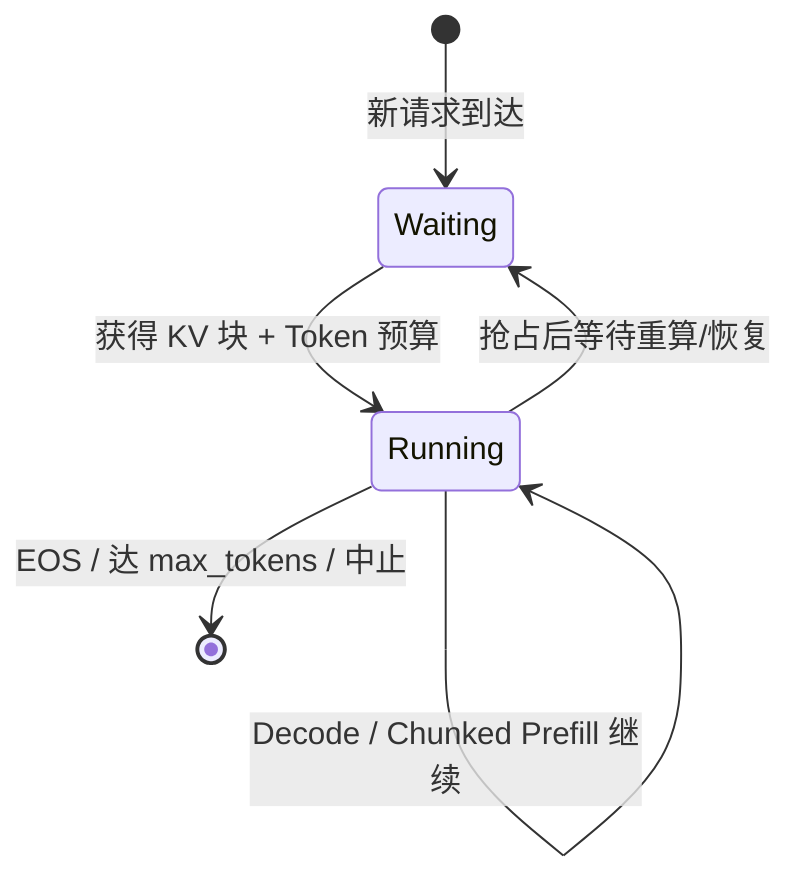
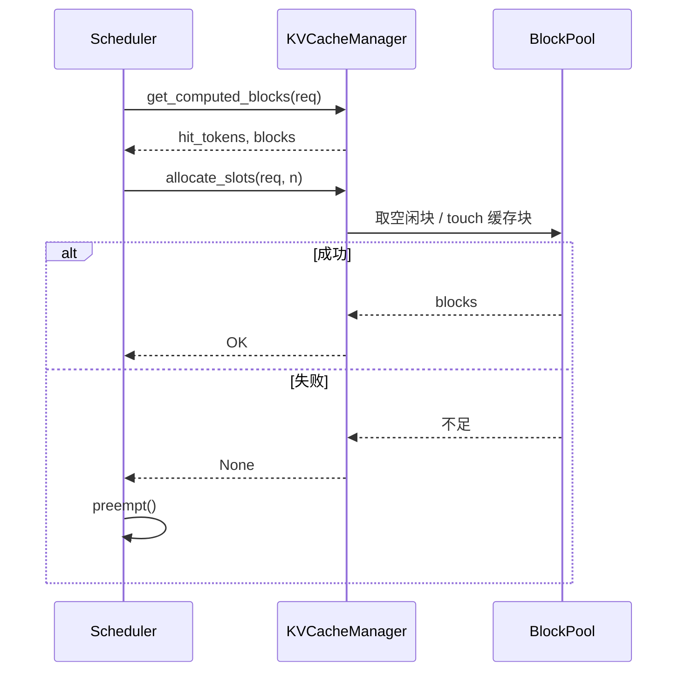

架构和 V1 设计都清楚之后，最值得读的源码入口就是 Scheduler：每一步 GPU 算哪些请求、各算多少 Token、显存不够时牺牲谁，都在这里拍板。这一节按 V1 的 `vllm/v1/core/sched/` 思路走读——不抠某一版函数签名，而是把 **Waiting/Running、Token Budget、Preemption/Recompute** 三条主线钉死。

<!-- more -->

## 📑 目录

- [1. 调度器在引擎里的位置](#1-调度器在引擎里的位置)
- [2. 请求状态与双队列](#2-请求状态与双队列)
- [3. 一次 schedule 的步骤拆解](#3-一次-schedule-的步骤拆解)
- [4. Token Budget：统一的硬约束](#4-token-budget统一的硬约束)
- [5. 与 KVCacheManager 的握手](#5-与-kvcachemanager-的握手)
- [6. 抢占 Preemption 与重计算 Recompute](#6-抢占-preemption-与重计算-recompute)
- [7. 调度策略：FCFS 与 Priority](#7-调度策略fcfs-与-priority)
- [8. 源码阅读路线建议](#8-源码阅读路线建议)
- [总结](#-总结)
- [自我检验清单](#-自我检验清单)
- [参考资料](#-参考资料)

---

## 1. 调度器在引擎里的位置

回顾 EngineCore 的三拍：

```text
schedule() → execute_model() → update_from_output()
```

Scheduler 占据第一拍和第三拍的"账本更新"：

- **`schedule()`**：在 Waiting/Running 中挑选工作，产出 `SchedulerOutput`（含每请求 Token 数、KV 块分配等）；
- **`update_from_output()`**：吃下模型输出，追加 token、标记完成、释放资源，并把仍存活的请求留在 Running。

🔑 **核心概念**：**Scheduler 不跑矩阵乘，它是"资源拍卖师"**——拍卖的商品是 Token 预算槽位和 KV 块。

---

## 2. 请求状态与双队列

V1 里可以先用两个核心队列建立心智模型（实现里还有结束、抢占等待等细分状态，但主路径是这两条）：

| 队列 | 含义 | 典型进出 |
|---|---|---|
| **Waiting** | 已到达、尚未持续占用运行名额的请求 | 新请求入队；被抢占后也可能回到等待侧 |
| **Running** | 本轮可持续被调度执行的请求 | 获得 KV 与预算后进入；完成或被抢占后离开 |

用安检口类比：Waiting 是候检队伍，Running 是已经进入安检通道、可以持续过包的人。通道容量有限（`max_num_seqs`），传送带每分钟能过的行李件数也有限（`max_num_batched_tokens`）。



📌 **关键点**：Continuous Batching 的本质，就是 **Running 集合每步可增可减**——有人结束立刻腾出名额，Waiting 里下一个马上补位，不必等"整批齐刷刷结束"。

---

## 3. 一次 schedule 的步骤拆解

下面用教学伪代码还原 V1 常见控制流（非逐字源码）：

```python
def schedule(self) -> SchedulerOutput:
    token_budget = self.max_num_batched_tokens
    scheduled = {}  # request_id -> num_tokens

    # A. 先服务 Running：保证在途 Decode/续算不被饿死
    for req in self.running:
        n = min(req.num_tokens_to_compute(), token_budget)
        if n <= 0:
            continue
        if not self.kv_cache_manager.allocate_slots(req, n):
            self.preempt(req)          # 或抢占别人以保住更高优先级者
            continue
        scheduled[req.request_id] = n
        token_budget -= n

    # B. 再从 Waiting 准入新请求（受 max_num_seqs 约束）
    while self.can_admit_more() and token_budget > 0:
        req = self.pop_waiting()       # FCFS 或 priority
        cached = self.kv_cache_manager.get_computed_blocks(req)
        n = min(req.remaining_prompt_after(cached), token_budget)
        if n <= 0 or not self.kv_cache_manager.allocate_slots(req, n):
            self.return_to_waiting(req)
            break
        self.running.append(req)
        scheduled[req.request_id] = n
        token_budget -= n

    return SchedulerOutput(scheduled, ...)
```

实际代码会处理更多细节：停用词/结构化输出、投机解码多 Token、Encoder Cache、LoRA 切换约束等。但主序几乎总是：

1. **保住 Running**（降低在线延迟抖动）；
2. **用剩余预算与序列名额拉新**；
3. **一切分配以 KV 块审批为准**。

---

## 4. Token Budget：统一的硬约束

V1 调度的第一公民不是"这是 Prefill 还是 Decode"，而是：

```text
本步 Σ num_tokens(req)  ≤  max_num_batched_tokens
本步 |参与序列|        ≤  max_num_seqs
```

于是长 Prompt 会自动变成 Chunked Prefill：第一次只吃预算允许的前 N 个 Token，下次 schedule 再继续，直到 prompt 算完才进入纯 Decode。

| 请求 | 本步需要 | 预算内分配 | 说明 |
|---|---|---|---|
| R1（长 Prefill 剩余 800） | 800 | 512 | 被 chunk 截断 |
| R2～R9（Decode） | 1×8 | 8 | 混在同一步 |
| 合计 | — | 520 | ≤ `max_num_batched_tokens` |

💡 **提示**：把 `max_num_batched_tokens` 调太小，长 Prompt 的 TTFT 会被切得很碎；调太大，单步 Prefill 过重，会抬高同批 Decode 的尾延迟。下一节调优会专门展开这对张力。

---

## 5. 与 KVCacheManager 的握手

Scheduler 每次想给请求 `n` 个新 Token 名额，都要问 KV 层：

1. **`get_computed_blocks`**：前缀命中了多少，已命中部分无需再算、也无需再为这部分申请"计算预算"（块本身可能只需 `touch` 抬引用计数）；
2. **`allocate_slots`**：为尚未物化的 Token 准备块/槽位；
3. 失败 → 本请求本步无法按计划执行，进入抢占逻辑。



📌 **关键点**：读调度源码时，把 **`allocate_slots` 返回失败** 当成主剧情转折点——后面所有抢占、延迟尖刺、吞吐抖动，多半从这里开始。

---

## 6. 抢占 Preemption 与重计算 Recompute

### 6.1 何时抢占

典型触发：Running 中的 Decode 需要新块，或 Waiting 想准入，但 `BlockPool` 空闲块不够，且无法通过结束请求自然腾退。

### 6.2 V1 常见恢复方式：Recompute

第 2.1 节提过两种经典恢复：

| 方式 | 做法 | V1 中的位置 |
|---|---|---|
| **Swapping** | KV 拷到 CPU，再拷回 | V1 核心为简化架构，**不再依赖** GPU↔CPU KV Swap 做抢占 |
| **Recompute** | 丢掉 KV，之后把已生成 Token 拼回输入重新 Prefill | V1 主路径 |

Recompute 的代价很直白：被抢占请求的 TTFT/总耗时会出现一次"回滚重算"。它用算力换实现复杂度与 CPU 内存占用。

### 6.3 抢谁

策略与实现细节随版本变化，但工程直觉稳定：

- 优先保证能推进的请求继续推进；
- 常从 Running 中选代价可接受者踢回等待侧；
- 与调度策略（FCFS / priority）联动——高优先级请求更不该被轻易挤掉。

⚠️ **注意**：日志里频繁 preemption = 并发或上下文长度压过了 KV 池。先减 `max_num_seqs` / `max_model_len`，或加显存与 `gpu_memory_utilization`，而不是先怀疑模型 Kernel。

---

## 7. 调度策略：FCFS 与 Priority

V1 通过 `--scheduling-policy` 等配置支持：

- **`fcfs`**：Waiting 按到达顺序准入，简单公平，默认心智模型；
- **`priority`**：按请求优先级排序（数值越小通常越优先，具体以当前文档为准），同优先级再比到达时间。

Priority 适合"付费档 / 内部 VIP / 交互式高于批处理"的混合流量。注意：优先级改变的是**准入与抢占时的排序**，不是绕过 Token Budget 与 KV 硬约束。

---

## 8. 源码阅读路线建议

建议按下面顺序打开仓库（路径以 main 线 V1 为准）：

1. `vllm/v1/core/sched/scheduler.py` — `schedule()` / `update_from_output()` 主循环；
2. `vllm/v1/core/sched/output.py` — `SchedulerOutput` 字段，看清调度结果长什么样；
3. `vllm/v1/core/kv_cache_manager.py` — `get_computed_blocks` / `allocate_slots` / `free`；
4. `vllm/v1/core/block_pool.py` — 空闲链表与前缀哈希命中；
5. 再回到 `vllm/v1/engine/core.py` — 看 EngineCore 如何调用 Scheduler。

阅读口诀：**先跟住一个假想请求的 id，看它何时进 Waiting、何时进 Running、何时被 chunk、何时被 preempt、何时 free。** 比一上来就全局搜索类名更高效。

💡 **提示**：对照跑一次小模型 + 打开 INFO 日志，人为把 `gpu_memory_utilization` 调低、并发打高，更容易在真实日志里看到 preemption 与预算截断，和源码互相印证。

---

## 📝 总结

- Scheduler 是 EngineCore 的资源拍卖师：产出每步 `{request_id: num_tokens}` 并协调 KV 分配。
- **Waiting / Running** 支撑 Continuous Batching：在途请求优先，空位再拉新。
- **Token Budget**（`max_num_batched_tokens`）+ **序列上限**（`max_num_seqs`）是硬约束，长 Prefill 由此变成 Chunked Prefill。
- 与 **KVCacheManager** 的握手决定调度能否落地；失败则进入 **Preemption**。
- V1 抢占主路径是 **Recompute**，不再依赖 GPU↔CPU KV Swap；频繁抢占是容量信号而非偶发噪音。

## 🎯 自我检验清单

- 能说明 Waiting 与 Running 各自代表什么，以及请求如何在两者间迁移
- 能按顺序口述一次 `schedule()` 的主步骤
- 能用 Token Budget 解释为什么长 Prompt 不会一次吃光整步
- 能指出 `allocate_slots` 失败后系统可能发生什么
- 能对比 Swap 与 Recompute，并说明 V1 为何偏向后者
- 能区分 FCFS 与 Priority 影响的是排序而非预算本身
- 能独立在仓库里找到 Scheduler 与 KVCacheManager 的源码入口

## 📚 参考资料

- [vLLM V1 源码 — scheduler](https://github.com/vllm-project/vllm/tree/main/vllm/v1/core/sched)
- [vLLM V1 源码 — kv_cache_manager](https://github.com/vllm-project/vllm/blob/main/vllm/v1/core/kv_cache_manager.py)
- [vLLM V1 Blog — Simple & Flexible Scheduler](https://blog.vllm.ai/2025/01/27/v1-alpha-release.html)
- [vLLM Engine Arguments（max_num_seqs / max_num_batched_tokens 等）](https://docs.vllm.ai/en/latest/configuration/engine_args.html)
- [Understanding vLLM Scheduling: Token Budgets, Chunked Prefill, and Policies](https://audreywongkg.medium.com/understanding-vllm-scheduling-token-budgets-chunked-prefill-and-policies-2c879e3980e3)
