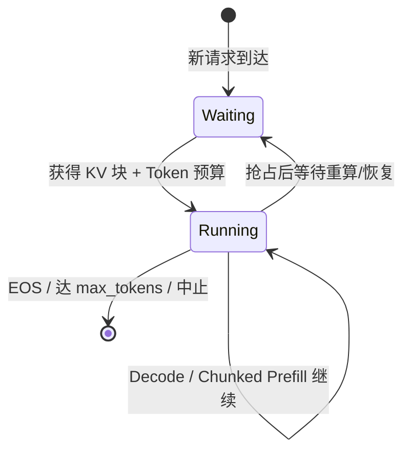
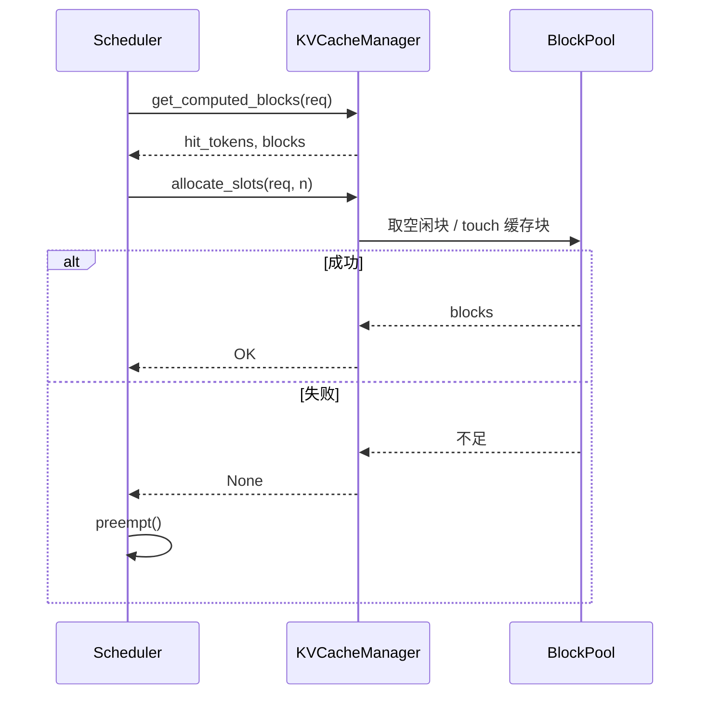

架构和 V1 设计都清楚之后，最值得读的源码入口就是 Scheduler：每一步 GPU 算哪些请求、各算多少 Token、显存不够时牺牲谁，都在这里拍板。这一节按 V1 的 `vllm/v1/core/sched/` 思路走读——不抠某一版函数签名，而是把 **Waiting/Running、Token Budget、Preemption/Recompute** 三条主线钉死，并特别解释一个非显然设计：**为什么总是先服务 Running，再从 Waiting 拉新**。

<!-- more -->

## 📑 目录

- [1. 调度器在引擎里的位置](#1-调度器在引擎里的位置)
- [2. 请求状态与双队列](#2-请求状态与双队列)
- [3. 为何先 Running 再 Waiting](#3-为何先-running-再-waiting)
- [4. 一次 schedule 的步骤拆解](#4-一次-schedule-的步骤拆解)
- [5. Token Budget：手算一笔账](#5-token-budget手算一笔账)
- [6. 与 KVCacheManager 的握手](#6-与-kvcachemanager-的握手)
- [7. 抢占 Preemption 与重计算 Recompute](#7-抢占-preemption-与重计算-recompute)
- [8. 调度策略：FCFS 与 Priority](#8-调度策略fcfs-与-priority)
- [9. 权衡与适用场景](#9-权衡与适用场景)
- [10. 源码阅读路线建议](#10-源码阅读路线建议)
- [总结](#-总结)
- [自我检验清单](#-自我检验清单)
- [参考资料](#-参考资料)

---

## 1. 调度器在引擎里的位置

回顾 EngineCore 的三拍：

```text
schedule() → execute_model() → update_from_output()
```

Scheduler 占据第一拍和第三拍的"账本更新"：

- **`schedule()`**：在 Waiting/Running 中挑选工作，产出 `SchedulerOutput`（含每请求 Token 数、KV 块分配等）；
- **`update_from_output()`**：吃下模型输出，追加 token、标记完成、释放资源，并把仍存活的请求留在 Running。

🔑 **核心概念**：**Scheduler 不跑矩阵乘，它是"资源拍卖师"**——拍卖的商品是 Token 预算槽位和 KV 块。

---

## 2. 请求状态与双队列

V1 里可以先用两个核心队列建立心智模型（实现里还有结束、抢占等待等细分状态，但主路径是这两条）：

| 队列 | 含义 | 典型进出 |
|---|---|---|
| **Waiting** | 已到达、尚未持续占用运行名额的请求 | 新请求入队；被抢占后也可能回到等待侧 |
| **Running** | 本轮可持续被调度执行的请求 | 获得 KV 与预算后进入；完成或被抢占后离开 |

用安检口类比：Waiting 是候检队伍，Running 是已经进入安检通道、可以持续过包的人。通道容量有限（`max_num_seqs`），传送带每分钟能过的行李件数也有限（`max_num_batched_tokens`）。



📌 **关键点**：Continuous Batching（第 2.2 节）的本质，就是 **Running 集合每步可增可减**——有人结束立刻腾出名额，Waiting 里下一个马上补位，不必等"整批齐刷刷结束"。

---

## 3. 为何先 Running 再 Waiting

若把 schedule 写成"先尽量从 Waiting 拉新，再伺候 Running"，直觉上好像更能提高并发——但这会伤害在线体验。V1 常见主序是反过来的：

1. **先遍历 Running**，给在途请求分配本步 Token（Decode 或续上的 Prefill chunk）；
2. **再用剩余预算与序列名额**从 Waiting 准入。

| 若先拉新（错误直觉） | 若先保 Running（V1 主序） |
|---|---|
| 新来的长 Prefill 可能吃光本步预算 | 在途 Decode 每步都能推进约 1 Token |
| 已在说话的用户突然"哑一拍" | 新请求的 TTFT 可能多等半拍，但 TPOT 更稳 |
| Continuous Batching 的"持续出字"被破坏 | 用 Waiting 侧的排队换 Running 侧的流畅 |

这不是公平性教条，而是 SLA 选择：**在线服务通常更不能接受"已经开始生成的回复突然卡死"，可以相对容忍"新请求多等一会儿才出首 Token"**。Token Budget 与 Chunked Prefill（[2.4](../第2章-推理引擎核心技术/2.4-Chunked%20Prefill%20与统一调度.md)）都建立在这个优先级之上——预算是共享的，但**分配顺序**先保护在途请求。

取舍句：先 Running 等于明确宣布——**用可能变差的新请求 TTFT，换在途请求更平稳的 TPOT**；若你的业务是纯离线批处理、只在乎总吞吐，这个顺序的收益会变小，但实现上仍保持同一套主序以降低复杂度。

---

## 4. 一次 schedule 的步骤拆解

教学伪代码（**非逐字源码**）：

```python
def schedule(self) -> SchedulerOutput:
    token_budget = self.max_num_batched_tokens
    scheduled = {}  # request_id -> num_tokens

    # A. 先服务 Running：保证在途 Decode/续算不被饿死
    for req in self.running:
        n = min(req.num_tokens_to_compute(), token_budget)
        if n <= 0:
            continue
        if not self.kv_cache_manager.allocate_slots(req, n):
            self.preempt(req)          # 或抢占别人以保住更高优先级者
            continue
        scheduled[req.request_id] = n
        token_budget -= n

    # B. 再从 Waiting 准入新请求（受 max_num_seqs 约束）
    while self.can_admit_more() and token_budget > 0:
        req = self.pop_waiting()       # FCFS 或 priority
        cached = self.kv_cache_manager.get_computed_blocks(req)
        n = min(req.remaining_prompt_after(cached), token_budget)
        if n <= 0 or not self.kv_cache_manager.allocate_slots(req, n):
            self.return_to_waiting(req)
            break
        self.running.append(req)
        scheduled[req.request_id] = n
        token_budget -= n

    return SchedulerOutput(scheduled, ...)
```

实际代码还会处理停用词/结构化输出、投机解码多 Token、Encoder Cache、LoRA 切换等。但主序几乎总是：**保住 Running → 用剩余预算拉新 → 一切以 KV 块审批为准**。

---

## 5. Token Budget：手算一笔账

V1 调度的第一公民不是"这是 Prefill 还是 Decode"，而是：

```text
本步 Σ num_tokens(req)  ≤  max_num_batched_tokens
本步 |参与序列|        ≤  max_num_seqs
```

**手算表**（设 `max_num_batched_tokens = 1024`，先 Running 再 Waiting）：

| 顺序 | 请求 | 角色 | 仍需计算 | 本步分配 | 预算余额 |
|---|---|---|---|---|---|
| 初始 | — | — | — | — | 1024 |
| 1 | R2～R9 | Running / Decode | 1×8 | 8 | 1016 |
| 2 | R1 | Running / Prefill 续算 | 剩余 1800 | 1016（被截断） | 0 |
| 3 | R10 | Waiting 新请求 | 512 | **0（预算已尽，本步进不来）** | 0 |

读表结论：

- R1 的长 Prefill 自动变成 Chunked Prefill：本步只吃 1016，下次 schedule 再继续；
- 8 个 Decode 因为排在前面，**没有被 1800 的 Prefill 一次性饿死**；
- 新请求 R10 即使序列名额还够，也要等后续 step 的剩余预算——这是"先 Running"的直接后果。

💡 **提示**：把 `max_num_batched_tokens` 调太小，长 Prompt 的 TTFT 会被切得很碎；调太大，单步 Prefill 过重，会抬高同批 Decode 的尾延迟。调优展开见 3.5。

---

## 6. 与 KVCacheManager 的握手

Scheduler 每次想给请求 `n` 个新 Token 名额，都要问 KV 层（PagedAttention 块池，见 [2.1](../第2章-推理引擎核心技术/2.1-PagedAttention.md)）：

1. **`get_computed_blocks`**：前缀命中了多少；已命中部分无需再算（块可能只需 `touch` 抬引用计数）；
2. **`allocate_slots`**：为尚未物化的 Token 准备块/槽位；
3. 失败 → 本请求本步无法按计划执行，进入抢占逻辑。



📌 **关键点**：读调度源码时，把 **`allocate_slots` 返回失败** 当成主剧情转折点——后面所有抢占、延迟尖刺、吞吐抖动，多半从这里开始。

---

## 7. 抢占 Preemption 与重计算 Recompute

### 7.1 何时抢占

典型触发：Running 中的 Decode 需要新块，或 Waiting 想准入，但 `BlockPool` 空闲块不够，且无法通过结束请求自然腾退。

### 7.2 V1 常见恢复方式：Recompute

第 2.1 节提过两种经典恢复：

| 方式 | 做法 | V1 中的位置 |
|---|---|---|
| **Swapping** | KV 拷到 CPU，再拷回 | V1 核心为简化架构，**不再依赖** GPU↔CPU KV Swap 做抢占 |
| **Recompute** | 丢掉 KV，之后把已生成 Token 拼回输入重新 Prefill | V1 主路径 |

### 7.3 可检验点：`num_computed_tokens` 归零

读源码或打日志时，用这个检查点验证自己是否真的理解了 Recompute：

| 时刻 | 期望观察到的状态（概念层） |
|---|---|
| 抢占前 | 请求在 Running；`num_computed_tokens` 已推进到某一值；持有若干 KV 块 |
| 抢占发生 | 相关 KV 块被释放（或不再专属于该请求）；请求回到等待/可恢复侧 |
| 恢复后首次再调度 | **`num_computed_tokens` 回到 0（或等价地"需从头/从可复用前缀之后重算"）**；输出过的 Token 作为新的 prompt 后缀再走 Prefill |
| 用户体感 | TTFT/总耗时出现一次"回滚重算"尖刺，而不是静默从 CPU 换回 KV |

若你在实现里看到抢占后仍保留完整 `num_computed_tokens` 却又声称"已释放 KV"，那多半是读错了路径——**没有 KV 却宣称已计算，是状态机的矛盾**。

### 7.4 抢谁

策略与实现细节随版本变化，但工程直觉稳定：

- 优先保证能推进的请求继续推进；
- 常从 Running 中选代价可接受者踢回等待侧；
- 与调度策略（FCFS / priority）联动——高优先级请求更不该被轻易挤掉。

⚠️ **注意**：日志里频繁 preemption = 并发或上下文长度压过了 KV 池。先减 `max_num_seqs` / `max_model_len`，或加显存与 `gpu_memory_utilization`，而不是先怀疑模型 Kernel。

---

## 8. 调度策略：FCFS 与 Priority

V1 通过 `--scheduling-policy` 等配置支持（名称以当前文档为准）：

- **`fcfs`**：Waiting 按到达顺序准入，简单公平，默认心智模型；
- **`priority`**：按请求优先级排序（常见约定是数值越小越优先，**以当前文档为准**），同优先级再比到达时间。

Priority 适合"付费档 / 内部 VIP / 交互式高于批处理"的混合流量。注意：优先级改变的是**准入与抢占时的排序**，不是绕过 Token Budget 与 KV 硬约束。

---

## 9. 权衡与适用场景

| 设计选择 | 收益 | 代价 / 不适用 |
|---|---|---|
| 先 Running 再 Waiting | 在途 TPOT 稳 | 新请求 TTFT 在高负载下更易排队；纯吞吐批处理收益有限 |
| 统一 Token Budget | Prefill/Decode 可混批、可切块 | 预算过大伤害 Decode P99；过小拉长 TTFT |
| Recompute 抢占 | 实现简单，无 GPU↔CPU 大块搬运 | 被抢占者付重算成本；抢占风暴时尾延迟很差 |
| Priority 策略 | 混合 SLA 可表达 | 低优先级可能饥饿，需要配额与监控 |

适用：在线多租户、长短 Prompt 混部、要看懂日志里的调度与抢占。  
若负载极端简单（固定短 Prompt、低并发、从不打满 KV），你仍该理解这套机制，但日常可能很少撞见抢占分支。

---

## 10. 源码阅读路线建议

建议按下面顺序打开仓库（路径以 main 线 V1 为准，文件名可能微调）：

1. `vllm/v1/core/sched/scheduler.py` — `schedule()` / `update_from_output()` 主循环；
2. `vllm/v1/core/sched/output.py` — `SchedulerOutput` 字段；
3. `vllm/v1/core/kv_cache_manager.py` — `get_computed_blocks` / `allocate_slots` / `free`；
4. `vllm/v1/core/block_pool.py` — 空闲链表与前缀哈希命中；
5. 再回到 `vllm/v1/engine/core.py` — EngineCore 如何调用 Scheduler。

阅读口诀：**先跟住一个假想请求的 id，看它何时进 Waiting、何时进 Running、何时被 chunk、何时被 preempt、`num_computed_tokens` 如何变化、何时 free。**

💡 **提示**：对照跑一次小模型 + 打开 INFO 日志，人为把 `gpu_memory_utilization` 调低、并发打高，更容易在真实日志里看到 preemption 与预算截断，和源码互相印证。

---

## 📝 总结

- Scheduler 是资源拍卖师：产出每步 `{request_id: num_tokens}` 并协调 KV 分配。
- **先 Running 再 Waiting** 用新请求 TTFT 换在途 TPOT；Continuous Batching 建立在 Running 可增减之上。
- Token Budget 手算能直接看出 Chunked Prefill 与"新请求为何进不来"。
- 抢占主路径是 **Recompute**；可检验点是抢占后计算进度归零（或从可复用前缀之后重算）并释放 KV。
- 频繁抢占是容量信号：先减并发/上下文或加 KV 池。

## 🎯 自我检验清单

- 能说明 Waiting 与 Running 各自代表什么，以及请求如何在两者间迁移
- 能解释为何先服务 Running 再拉 Waiting，并说出这对 TTFT/TPOT 的含义
- 能按顺序口述一次 `schedule()` 的主步骤
- 能根据一张 Token Budget 手算表解释长 Prefill 如何被截断、Decode 为何仍能推进
- 能指出 `allocate_slots` 失败后系统可能发生什么
- 能用 `num_computed_tokens` 归零（或等价重算）描述 Recompute 抢占的可检验状态
- 能对比 Swap 与 Recompute，并说明 V1 为何偏向后者
- 能区分 FCFS 与 Priority 影响的是排序而非预算本身
- 能独立在仓库里找到 Scheduler 与 KVCacheManager 的源码入口

## 📚 参考资料

- [vLLM V1 源码 — scheduler](https://github.com/vllm-project/vllm/tree/main/vllm/v1/core/sched)
- [vLLM V1 源码 — kv_cache_manager](https://github.com/vllm-project/vllm/blob/main/vllm/v1/core/kv_cache_manager.py)
- [vLLM V1 Blog — Simple & Flexible Scheduler](https://blog.vllm.ai/2025/01/27/v1-alpha-release.html)
- [vLLM Engine Arguments](https://docs.vllm.ai/en/latest/configuration/engine_args.html)
- [本模块 2.1 PagedAttention](../第2章-推理引擎核心技术/2.1-PagedAttention.md)
- [本模块 2.4 Chunked Prefill](../第2章-推理引擎核心技术/2.4-Chunked%20Prefill%20与统一调度.md)
