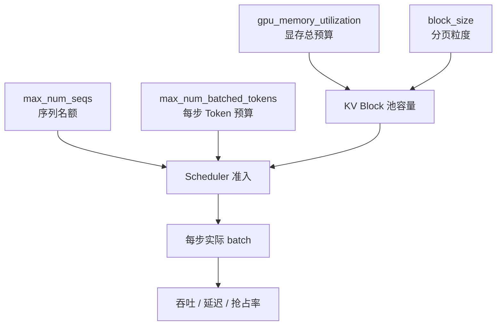

会看架构和调度之后，调参就不再是"改两个数字碰运气"。vLLM 最常动的几个旋钮，本质上分别卡在**显存池大小、并发序列数、每步 Token 预算、分页粒度**四条约束上。这一节把它们对吞吐、延迟、显存的影响说清楚，并给一套可复现的调参顺序。

<!-- more -->

## 📑 目录

- [1. 先分清你要优化什么](#1-先分清你要优化什么)
- [2. 参数地图：旋钮卡在哪条约束](#2-参数地图旋钮卡在哪条约束)
- [3. gpu-memory-utilization：KV 池总闸门](#3-gpu-memory-utilizationkv-池总闸门)
- [4. max-num-seqs：并发序列上限](#4-max-num-seqs并发序列上限)
- [5. max-num-batched-tokens：每步 Token 预算](#5-max-num-batched-tokens每步-token-预算)
- [6. block-size：分页粒度](#6-block-size分页粒度)
- [7. 其它高频相关项](#7-其它高频相关项)
- [8. 推荐调参顺序与场景处方](#8-推荐调参顺序与场景处方)
- [总结](#-总结)
- [自我检验清单](#-自我检验清单)
- [参考资料](#-参考资料)

---

## 1. 先分清你要优化什么

同一个参数，对"峰值吞吐"和"交互延迟"的好坏往往相反。先选定主指标：

| 目标 | 更关心 | 调参偏向 |
|---|---|---|
| 离线批处理吞吐 | tokens/s、请求完成率 | 更大 batch、更高显存利用率 |
| 在线聊天体验 | TTFT、TPOT、P99 | 防止长 Prefill 饿死 Decode，控制抢占 |
| 长上下文 | 能否放下、是否 OOM | 提高 KV 池或降并发/降 `max_model_len` |

🔑 **核心概念**：**没有万能最优参数，只有与 SLA 对齐的可行域。** 先写清"P99 TTFT < X、同时支持 Y 并发"，再动旋钮。

---

## 2. 参数地图：旋钮卡在哪条约束



| 参数 | 主要约束对象 | 调大常见效果 | 调小常见效果 |
|---|---|---|---|
| `gpu_memory_utilization` | KV 池能装多少块 | 更高并发潜力、更少抢占 | 更安全，但易抢占/拒纳 |
| `max_num_seqs` | 同时在途序列数 | 吞吐↑（Decode 更满） | 延迟更稳、抢占↓ |
| `max_num_batched_tokens` | 单步 Token 数 | Prefill 更快结束（TTFT↓ 可能） | Decode 尾延迟更受保护 |
| `block_size` | 块大小 | 块表更短 | 尾块碎片↓、管理更细 |

⚠️ **注意**：默认值随版本与模型后端变化。下文讨论的是**作用机制**；具体默认请以当前版本 `vllm serve --help` / 引擎参数文档为准。

---

## 3. gpu-memory-utilization：KV 池总闸门

含义：vLLM 实例规划使用的 GPU 显存比例。权重加载完成后，剩余部分大部分划给 KV Block 池（还要留激活、临时缓冲等）。

```bash
vllm serve Qwen/Qwen2.5-7B-Instruct \
  --gpu-memory-utilization 0.90
```

| 调高 | 调低 |
|---|---|
| ✅ 更多 KV 块 → 更高并发、更少 preemption | ✅ 给碎片/别的进程/激活留余量，降低启动或运行 OOM |
| ❌ 过满时一旦峰值激活上升就 OOM | ❌ 过早抢占，吞吐与 P99 一起坏 |

📌 **关键点**：这是**容量旋钮**，不是速度旋钮。它不直接让单次 MatMul 更快，而是决定系统能不能把 batch 做大、能不能扛住长上下文。

经验法则：

- 单卡专用推理：可从 `0.90` 左右起步；
- 同卡还有别的进程 / 多实例：显式降到 `0.80`～`0.85` 并监控；
- 启动 OOM：先降它或降 `max_model_len`，再考虑加 TP。

---

## 4. max-num-seqs：并发序列上限

含义：调度器 Running 侧大约最多同时扛多少条序列。

对 Decode 为主、Memory Bound 的负载：

- 过小：GPU 显存带宽吃不满，tokens/s 上不去；
- 过大：KV 顶满 → 抢占风暴，P99 爆炸，平均吞吐也可能下降。

| 症状 | 更可能的方向 |
|---|---|
| GPU Util/带宽明显吃不满，且几乎无抢占 | 适当**增大** `max_num_seqs` |
| 日志频繁 preemption，延迟尖刺 | **减小** `max_num_seqs`，或加 KV 容量 |
| TTFT 尚可但总完成时间抖 | 检查是否在"高并发 + 长输出"下互相挤占 |

💡 **提示**：`max_num_seqs` 是**上限**，不是保证并发。真实并发还受 KV 池与 `max_num_batched_tokens` 约束——三者取更紧的那个。

---

## 5. max-num-batched-tokens：每步 Token 预算

含义：单次 `schedule()` 最多安排多少 Token 进入本步前向（Prefill chunk + Decode 等合计）。

它对延迟形态影响最大：

```text
一步里：长 Prefill chunk  ←→  大量 Decode(1 token)
         共享同一个预算池
```

| 设置偏大 | 设置偏小 |
|---|---|
| 长 Prompt 更快被吃完，单请求 TTFT 可能更好 | 每步更"碎"，长 Prompt 要更多步 |
| 单步计算更重，同批 Decode 的 TPOT/P99 可能变差 | 更容易保证 Decode 节奏，交互更稳 |

官方优化文档给出的方向感（数值随版本微调，机制稳定）：

- **偏小**（如 2048 量级）：更利于 ITL/Decode 间隔，因为每步 Prefill 干扰更少；
- **偏大**：更利于 TTFT，因为一步能吞更多 Prefill Token；
- **冲吞吐**时，小模型 + 大卡常建议把预算拉到较高（文档示例提到 `> 8192` 量级），仍需用你的 P99 验收。

在线聊天常见策略：

1. 先保证 Decode 延迟达标；
2. 再逐步提高预算，观察 TTFT 与 P99 的权衡；
3. 用真实流量（长短 Prompt 混合）压测，避免只拿短 Prompt 打分。

📌 **关键点**：如果你的 SLA 写的是"交互式 P99"，**优先盯 `max_num_batched_tokens` 与抢占率**，而不是只看平均 tokens/s。

---

## 6. block-size：分页粒度

含义：每个 KV Block 覆盖多少 Token。它影响：

- **内部碎片**：最后一块浪费 < `block_size`；
- **块表长度与管理开销**：块越小，块越多；
- **前缀缓存粒度**：哈希通常按块对齐，块大小影响可共享边界。

| 块偏小 | 块偏大 |
|---|---|
| 碎片更少、共享边界更细 | 块表更短、管理更轻 |
| 管理与查找开销上升 | 尾块浪费上升 |

⚠️ **注意**：绝大多数生产场景**不要先调 `block_size`**。它与 Attention 后端、硬件对齐相关，默认值通常已经过验证。只有在明确的 profiling 证据下再动。

---

## 7. 其它高频相关项

这些不是本节标题四件套，但常和它们绞在一起：

| 参数 | 作用 | 调优提示 |
|---|---|---|
| `max_model_len` | 上下文上限，直接放大每请求 KV 上限 | 按业务真实上限设，切忌"模型标称多长就开多长" |
| `enable_prefix_caching` | 前缀复用（V1 默认倾向开启） | 有系统提示/多轮共享就保持开 |
| `tensor_parallel_size` | 模型分片到多卡 | 权重大到单卡放不下，或要降单卡激活压力时用 |
| `dtype` / 量化 | 权重与部分缓存精度 | 显存紧张时，量化往往比把 utilization 拉到 0.99 更安全 |
| `scheduling_policy` | FCFS / priority | 混合 SLA 时用优先级，而不是无限抬并发 |

---

## 8. 推荐调参顺序与场景处方

### 8.1 建议顺序

1. **定 `max_model_len`**：按业务真实最大上下文；
2. **定 `gpu_memory_utilization`**：单实例稳定不 OOM 的最高舒适值；
3. **压 `max_num_seqs`**：找到"吞吐高且抢占罕见"的平台区；
4. **调 `max_num_batched_tokens`**：对齐 TTFT vs Decode P99；
5. **最后才考虑 `block_size`/内核级选项**。

### 8.2 场景处方（起点，不是结论）

| 场景 | 起点思路 |
|---|---|
| 离线合成数据 / 批评测 | 偏高 `max_num_seqs` + 偏高 utilization；预算可放大 |
| 多用户聊天 | 中等 `max_num_seqs`；认真调预算；紧盯 preemption |
| 超长文档问答 | 先保证 `max_model_len` 与 KV 池；并发往往要主动降 |
| 共享超长 System Prompt | 保持 Prefix Cache；并发可以更激进，因 KV 被共享摊薄 |

```bash
# 在线聊天类起点示例（数值需按模型与硬件重测）
vllm serve meta-llama/Llama-3.1-8B-Instruct \
  --gpu-memory-utilization 0.90 \
  --max-model-len 8192 \
  --max-num-seqs 128 \
  --max-num-batched-tokens 4096
```

💡 **提示**：每次只改一个旋钮，用同一套压测集看 **吞吐、TTFT、TPOT、抢占次数、OOM** 五元组。没有对照实验的"经验值"不可复用。

---

## 📝 总结

- 先锁定 SLA（吞吐 vs 延迟 vs 长上下文），再调参。
- **`gpu_memory_utilization`** 决定 KV 池容量；**`max_num_seqs`** 决定序列并发上限；**`max_num_batched_tokens`** 塑造每步 Prefill/Decode 混部形态；**`block_size`** 是分页粒度，通常少动。
- 抢占频繁优先减并发或加 KV 容量；Decode P99 差优先审视 Token 预算是否过大。
- 推荐顺序：`max_model_len` → utilization → `max_num_seqs` → `max_num_batched_tokens` → 其它。

## 🎯 自我检验清单

- 能说明四个核心参数各自约束的是容量、并发、步预算还是分页粒度
- 能解释为什么提高 utilization 可能提升吞吐，却也可能换来 OOM
- 能根据"GPU 吃不满"与"频繁 preemption"两种症状给出相反的 `max_num_seqs` 调整方向
- 能分析 `max_num_batched_tokens` 对 TTFT 与 Decode P99 的张力
- 能说出为什么生产上不应首先调 `block_size`
- 能按推荐顺序设计一轮只改单变量的压测

## 📚 参考资料

- [vLLM Engine Arguments](https://docs.vllm.ai/en/latest/configuration/engine_args.html)
- [vLLM Optimization and Tuning](https://docs.vllm.ai/en/latest/configuration/optimization/)
- [vLLM CLI Reference — serve](https://docs.vllm.ai/en/latest/cli/serve/)
- [PagedAttention 论文（理解 KV 池与 block）](https://arxiv.org/abs/2309.06180)
- [vLLM GitHub Discussions / Issues（真实调参案例）](https://github.com/vllm-project/vllm)
