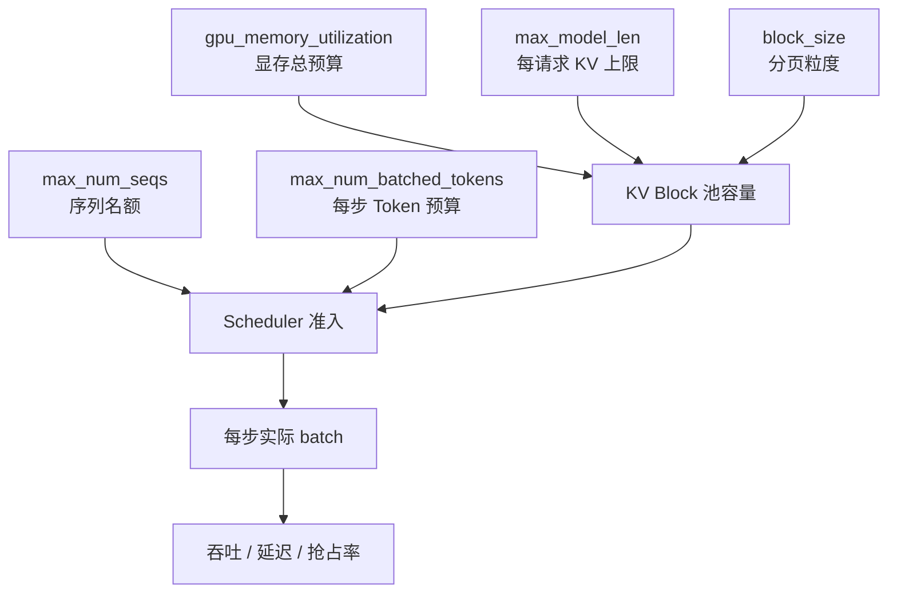

会看架构和调度之后，调参就不再是"改两个数字碰运气"。vLLM 最常动的几个旋钮，本质上分别卡在**显存池大小、并发序列数、每步 Token 预算、分页粒度**四条约束上——而且它们是**耦合**的：只拧其中一个，另外两个的有效上限可能立刻改变。这一节把机制、耦合、症状速查和单变量实验顺序一次说清。

<!-- more -->

## 📑 目录

- [1. 先分清你要优化什么](#1-先分清你要优化什么)
- [2. 参数地图与耦合关系](#2-参数地图与耦合关系)
- [3. 症状 → 改哪个旋钮](#3-症状--改哪个旋钮)
- [4. gpu-memory-utilization：KV 池总闸门](#4-gpu-memory-utilizationkv-池总闸门)
- [5. max-num-seqs：并发序列上限](#5-max-num-seqs并发序列上限)
- [6. max-num-batched-tokens：每步 Token 预算](#6-max-num-batched-tokens每步-token-预算)
- [7. block-size：分页粒度](#7-block-size分页粒度)
- [8. 其它高频相关项](#8-其它高频相关项)
- [9. 单变量实验顺序与场景处方](#9-单变量实验顺序与场景处方)
- [10. 权衡小结](#10-权衡小结)
- [总结](#-总结)
- [自我检验清单](#-自我检验清单)
- [参考资料](#-参考资料)

---

## 1. 先分清你要优化什么

同一个参数，对"峰值吞吐"和"交互延迟"的好坏往往相反。先选定主指标：

| 目标 | 更关心 | 调参偏向 |
|---|---|---|
| 离线批处理吞吐 | tokens/s、请求完成率 | 更大 batch、更高显存利用率 |
| 在线聊天体验 | TTFT、TPOT、P99 | 防止长 Prefill 饿死 Decode，控制抢占 |
| 长上下文 | 能否放下、是否 OOM | 提高 KV 池或降并发/降 `max_model_len` |

🔑 **核心概念**：**没有万能最优参数，只有与 SLA 对齐的可行域。** 先写清"P99 TTFT < X、同时支持 Y 并发"，再动旋钮。

---

## 2. 参数地图与耦合关系



| 参数 | 主要约束对象 | 调大常见效果 | 调小常见效果 |
|---|---|---|---|
| `gpu_memory_utilization` | KV 池能装多少块 | 更高并发潜力、更少抢占 | 更安全，但易抢占/拒纳 |
| `max_num_seqs` | 同时在途序列数 | 吞吐↑（Decode 更满） | 延迟更稳、抢占↓ |
| `max_num_batched_tokens` | 单步 Token 数 | Prefill 更快结束（TTFT↓ 可能） | Decode 尾延迟更受保护 |
| `block_size` | 块大小 | 块表更短 | 尾块碎片↓、管理更细 |

**耦合（必须写进实验设计）**

1. **`max_num_seqs` × `max_model_len` × utilization**：三者共同决定"会不会抢占"。只把 `max_num_seqs` 加到 256，而 `max_model_len=32K` 且 KV 池不大，有效并发会被块池提前打断——日志表现是 preemption，不是"seqs 没生效"。
2. **`max_num_batched_tokens` × 实际 Running 集合**：预算是每步总额。Running 里 Decode 越多，留给新 Prefill chunk 的余量越少（见 3.4 手算表）；只调预算不看并发，结论会飘。
3. **Prefix Cache × KV 池**：高命中时同样 utilization 能支撑更高并发；无共享前缀时，不要把 Cache"默认开着"误当成容量变大。

⚠️ **注意**：默认值随版本与模型后端变化。下文讨论的是**作用机制**；具体默认请以当前版本 `vllm serve --help` / 引擎参数文档为准。

---

## 3. 症状 → 改哪个旋钮

先对症，再实验。下表是**起点假设**，不是免测结论。

| 症状 | 先改 / 先查 | 方向 | 同时盯住 |
|---|---|---|---|
| 启动即 OOM | `gpu_memory_utilization` 或 `max_model_len`；必要时 TP / 量化 | 下调 utilization 或上下文；或加卡 | 是否同卡有别的进程 |
| 运行中 OOM / 峰值激活炸了 | utilization 略降；检查是否预算过大导致单步激活飙升 | 略降 utilization；核对 `max_num_batched_tokens` | 是否刚换更大模型/更长上下文 |
| 日志频繁 preemption，P99 尖刺 | `max_num_seqs` 或 KV 容量 | **减小** seqs，或提高 utilization / 降 `max_model_len` | 输出是否特别长（Decode 持续占块） |
| GPU Util/带宽吃不满，且几乎无抢占 | `max_num_seqs`（其次预算） | **增大** seqs | 是否输入侧 QPS 本身不足 |
| TTFT 差、Decode 还行 | `max_num_batched_tokens`；Prefix Cache 是否命中 | 适当**增大**预算；确认共享前缀场景开着 Cache | 是否被"先 Running"挤掉新请求（高负载常态） |
| Decode TPOT/P99 差、有长 Prompt 混入 | `max_num_batched_tokens` | **减小**预算，让长 Prefill 更碎（机制见 [2.4](../第2章-推理引擎核心技术/2.4-Chunked%20Prefill%20与统一调度.md)） | 同步看吞吐是否掉太多 |
| 仅长上下文请求失败/被挤 | `max_model_len` 与 KV 池 | 降并发或加容量；按真实上限设长度 | 不要为少数长请求把全局 seqs 开满 |

带单位的决策例：

> 单卡 80 GB，utilization=0.90，7B 权重约 14 GB，KV+缓冲粗算数十 GB。若平均每请求占用约 0.5 GB KV，则块池理论并发量级约 **几十路**，而不是你设的 `max_num_seqs=256`。此时把 seqs 从 128 调到 256 **不会**线性涨吞吐，只会增加抢占——应先加容量或降 `max_model_len`，再谈提高 seqs。

---

## 4. gpu-memory-utilization：KV 池总闸门

含义：vLLM 实例规划使用的 GPU 显存比例。权重加载完成后，剩余部分大部分划给 KV Block 池（还要留激活、临时缓冲等）。

```bash
vllm serve Qwen/Qwen2.5-7B-Instruct \
  --gpu-memory-utilization 0.90
```

| 调高 | 调低 |
|---|---|
| ✅ 更多 KV 块 → 更高并发、更少 preemption | ✅ 给碎片/别的进程/激活留余量，降低 OOM |
| ❌ 过满时峰值激活一上升就 OOM | ❌ 过早抢占，吞吐与 P99 一起坏 |

📌 **关键点**：这是**容量旋钮**，不是速度旋钮。它不直接让单次 MatMul 更快，而是决定系统能不能把 batch 做大、能不能扛住长上下文。

经验法则：

- 单卡专用推理：可从约 `0.90` 起步（以当前默认为准）；
- 同卡还有别的进程 / 多实例：显式降到约 `0.80`～`0.85` 并监控；
- 启动 OOM：先降它或降 `max_model_len`，再考虑加 TP。

---

## 5. max-num-seqs：并发序列上限

含义：调度器 Running 侧大约最多同时扛多少条序列。

对 Decode 为主、Memory Bound 的负载：

- 过小：GPU 显存带宽吃不满，tokens/s 上不去；
- 过大：KV 顶满 → 抢占风暴，P99 爆炸，平均吞吐也可能下降。

💡 **提示**：`max_num_seqs` 是**上限**，不是保证并发。真实并发还受 KV 池与 `max_num_batched_tokens` 约束——三者取更紧的那个。

---

## 6. max-num-batched-tokens：每步 Token 预算

含义：单次 `schedule()` 最多安排多少 Token 进入本步前向（Prefill chunk + Decode 等合计）。它直接塑造 3.4 里那张手算表。

```text
一步里：长 Prefill chunk  ←→  大量 Decode(1 token)
         共享同一个预算池
```

| 设置偏大 | 设置偏小 |
|---|---|
| 长 Prompt 更快被吃完，单请求 TTFT 可能更好 | 每步更"碎"，长 Prompt 要更多步 |
| 单步计算更重，同批 Decode 的 TPOT/P99 可能变差 | 更容易保证 Decode 节奏，交互更稳 |

官方优化文档给出的方向感（数值随版本微调，机制稳定）：

- **偏小**（如约 2048 量级）：更利于 Decode 间隔，每步 Prefill 干扰更少；
- **偏大**：更利于 TTFT，一步能吞更多 Prefill Token；
- **冲吞吐**时，小模型 + 大卡常把预算拉到较高（文档示例提到 `> 8192` 量级），仍需用你的 P99 验收。

在线聊天常见策略：先保证 Decode 延迟达标 → 再逐步提高预算观察 TTFT → 用真实长短混合流量压测。

---

## 7. block-size：分页粒度

含义：每个 KV Block 覆盖多少 Token（PagedAttention 分页单位，见 [2.1](../第2章-推理引擎核心技术/2.1-PagedAttention.md)）。它影响内部碎片、块表长度、前缀缓存对齐粒度。

| 块偏小 | 块偏大 |
|---|---|
| 碎片更少、共享边界更细 | 块表更短、管理更轻 |
| 管理与查找开销上升 | 尾块浪费上升 |

⚠️ **注意**：绝大多数生产场景**不要先调 `block_size`**。它与 Attention 后端、硬件对齐相关，默认值通常已经过验证。只有在明确的 profiling 证据下再动。

---

## 8. 其它高频相关项

| 参数 | 作用 | 调优提示 |
|---|---|---|
| `max_model_len` | 上下文上限，直接放大每请求 KV 上限 | 按业务真实上限设，切忌"模型标称多长就开多长" |
| `enable_prefix_caching` | 前缀复用（V1 常见默认开启） | 有系统提示/多轮共享就保持开 |
| `tensor_parallel_size` | 模型分片到多卡 | 权重大到单卡放不下，或要降单卡激活压力时用 |
| `dtype` / 量化 | 权重与部分缓存精度 | 显存紧张时，量化往往比把 utilization 拉到 0.99 更安全 |
| `scheduling_policy` | FCFS / priority | 混合 SLA 时用优先级，而不是无限抬并发 |

---

## 9. 单变量实验顺序与场景处方

### 9.1 为什么必须单变量

一次改 utilization + seqs + 预算，你无法解释 P99 的变化来自哪条约束。正确做法：

1. 固定模型、精度、数据集、并发曲线；
2. **每次只改一个旋钮**（或一对已知强耦合项里的一个）；
3. 记录五元组：**吞吐、TTFT、TPOT、抢占次数、OOM**；
4. 改回基线再试下一个，避免"累积漂移"。

### 9.2 建议顺序

1. **定 `max_model_len`**：按业务真实最大上下文；
2. **定 `gpu_memory_utilization`**：单实例稳定不 OOM 的最高舒适值；
3. **压 `max_num_seqs`**：找到"吞吐高且抢占罕见"的平台区；
4. **调 `max_num_batched_tokens`**：对齐 TTFT vs Decode P99；
5. **最后才考虑 `block_size`/内核级选项**。

### 9.3 场景处方（起点，不是结论）

| 场景 | 起点思路 |
|---|---|
| 离线合成数据 / 批评测 | 偏高 `max_num_seqs` + 偏高 utilization；预算可放大 |
| 多用户聊天 | 中等 `max_num_seqs`；认真调预算；紧盯 preemption |
| 超长文档问答 | 先保证 `max_model_len` 与 KV 池；并发往往要主动降 |
| 共享超长 System Prompt | 保持 Prefix Cache；并发可以更激进，因 KV 被共享摊薄 |

```bash
# 在线聊天类起点示例（数值需按模型与硬件重测）
vllm serve meta-llama/Llama-3.1-8B-Instruct \
  --gpu-memory-utilization 0.90 \
  --max-model-len 8192 \
  --max-num-seqs 128 \
  --max-num-batched-tokens 4096
```

---

## 10. 权衡小结

| 你想要 | 往往要付出 |
|---|---|
| 更高峰值吞吐 | 更高抢占风险或更差的 P99 |
| 更稳的 Decode P99 | 更碎的 Prefill → 可能更差的 TTFT / 更低峰值吞吐 |
| 更长上下文 | 更低有效并发，或更多 GPU / 更低精度 |
| 更满的显存利用率 | 更小的安全余量，峰值激活时 OOM |

📌 **关键点**：调参是在**可行域里找 SLA 角点**，不是寻找全局最优解。下一节把"什么时候甚至不该只拧 vLLM 旋钮、而该换框架"放到选型桌上。

---

## 📝 总结

- 先锁定 SLA，再调参；四类旋钮分别管容量、并发、步预算、分页粒度，且彼此耦合。
- 用**症状速查表**选起点，用**单变量实验**拿证据；不要一次拧三个螺丝。
- 抢占频繁优先减并发或加 KV 容量；Decode P99 差优先审视 Token 预算是否过大。
- 推荐顺序：`max_model_len` → utilization → `max_num_seqs` → `max_num_batched_tokens` → 其它。

## 🎯 自我检验清单

- 能说明四个核心参数各自约束的是容量、并发、步预算还是分页粒度
- 能解释 `max_num_seqs` 与 KV 池、`max_model_len` 如何耦合导致"调了 seqs 却只增加抢占"
- 能根据症状速查表给出 OOM、preemption、GPU 吃不满、TTFT/TPOT 差时的首调旋钮
- 能解释为什么提高 utilization 可能提升吞吐，却也可能换来 OOM
- 能分析 `max_num_batched_tokens` 对 TTFT 与 Decode P99 的张力
- 能说出为什么生产上不应首先调 `block_size`
- 能按推荐顺序设计一轮只改单变量、记录五元组的压测

## 📚 参考资料

- [vLLM Engine Arguments](https://docs.vllm.ai/en/latest/configuration/engine_args.html)
- [vLLM Optimization and Tuning](https://docs.vllm.ai/en/latest/configuration/optimization/)
- [vLLM CLI Reference — serve](https://docs.vllm.ai/en/latest/cli/serve/)
- [PagedAttention 论文](https://arxiv.org/abs/2309.06180)
- [本模块 2.1 PagedAttention](../第2章-推理引擎核心技术/2.1-PagedAttention.md)
- [本模块 2.4 Chunked Prefill](../第2章-推理引擎核心技术/2.4-Chunked%20Prefill%20与统一调度.md)
