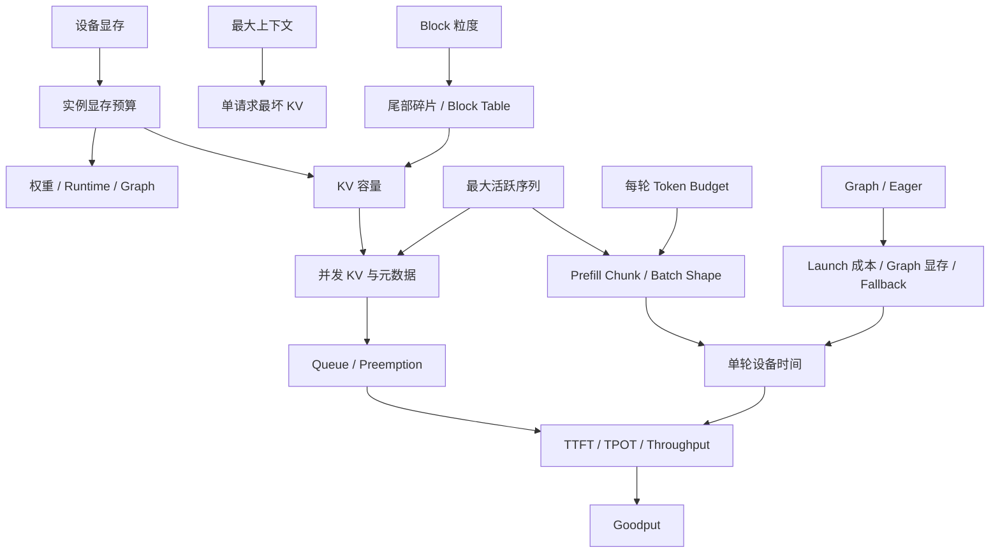

## 📑 目录
- [1. 真实问题：参数是资源策略，不是独立旋钮](#1-真实问题参数是资源策略不是独立旋钮)
- [2. 一张因果图连接容量、延迟与执行](#2-一张因果图连接容量延迟与执行)
- [3. Static 显存预算：先决定钱放在哪里](#3-static-显存预算先决定钱放在哪里)
- [4. 上下文、并发与 Token Budget 的耦合](#4-上下文并发与-token-budget-的耦合)
- [5. Block/Page 粒度：碎片换元数据](#5-blockpage-粒度碎片换元数据)
- [6. Graph 与 Eager：固定成本换约束](#6-graph-与-eager固定成本换约束)
- [7. 三类显存失败必须分开](#7-三类显存失败必须分开)
- [8. 从产品合同到配置的调参顺序](#8-从产品合同到配置的调参顺序)
- [9. 用 Pareto 前沿而不是万能参数选点](#9-用-pareto-前沿而不是万能参数选点)
- [10. 观测、边界与框架对照](#10-观测边界与框架对照)
- [总结](#总结)
- [自我检验](#自我检验)
- [参考资料](#参考资料)
---
3.4 把 Scheduler 还原为计算 Token、KV 存储和请求状态三本账。本节继续用 `infra-guide-001` 看配置：每个关键参数都在改变某本账的上限、粒度或执行方式。
本文不列默认值大全，也不提供 Sweep 脚本。默认值会随版本、模型和硬件变化；稳定的方法是先写出因果假设，再用真实 Workload 与 SLO 找可行域。

## 1. 真实问题：参数是资源策略，不是独立旋钮
“把最大并发从 128 调到 256，会不会更快？”这个问题没有独立答案。更高并发可能增加 Batching 机会，也会增加：
- 活跃 KV Token；
- Persistent Batch 元数据；
- 采样与输出状态；
- Graph Shape；
- Preemption 风险；
- 单轮和排队的尾部波动。
如果 KV 只够健康容纳 40 条平均请求，把请求上限设为 256 只是允许调度器做出更多超额承诺。同样，“扩大每轮 Token Budget”可能让长 Prefill 更高效，却会拉长同批 Decode 请求等待这一轮结束的时间。一个参数至少要写出五件事：
1. 它直接改变哪项资源约束；
2. 哪类 Workload 能利用新增资源；
3. 希望改善哪个指标；
4. 可能恶化哪个反指标；
5. 达到什么条件后边际收益归零。
例如：

```text
动作：扩大每轮 Token Budget
机制：允许更大的 Prefill Chunk / 更多同轮 Token
目标：降低长 Prompt TTFT、提高 Prefill 吞吐
风险：step 变长、Decode TPOT P99 上升、Shape 分布变化
停止条件：Goodput 不再增长或任一 SLO 越界
```

这才是一条可验证的调参假设。

## 2. 一张因果图连接容量、延迟与执行



图中有三条主链。
### 2.1 容量链

$$
\text{显存预算}
\rightarrow\text{KV 容量}
\rightarrow\text{可驻留 Token}
\rightarrow\text{健康并发}
$$

它决定系统能承诺多少长期状态。
### 2.2 调度链

$$
\text{序列上限}+\text{Token Budget}
\rightarrow\text{Batch 构成}
\rightarrow\text{step time}
\rightarrow\text{TTFT/TPOT}
$$

它决定每轮怎样使用设备时间。
### 2.3 执行链

$$
\text{Graph/Compile/Backend}
\rightarrow\text{Launch 与 Kernel}
\rightarrow\text{稳态延迟和额外内存}
$$
它决定同一计划怎样落到设备上。三条链会相互反馈。Graph 占用更多显存会压缩 KV；更高并发改变 Shape 分布；Prefix Cache 减少 Prefill 又改变 Token Budget 的实际构成。

## 3. Static 显存预算：先决定钱放在哪里
常驻实例启动时要对显存做静态规划，但“Static”不表示所有字节从此不变，而是先划定各类用途能使用的空间。
### 3.1 总账
设设备物理显存为 \(M_{\text{device}}\)，实例预算比例为 \(u\)：

$$
M_{\text{budget}}=uM_{\text{device}}
$$

可给 KV 的空间一阶近似为：

$$
M_{\text{KV}}
\le
M_{\text{budget}}
-M_{\text{weights}}
-M_{\text{runtime}}
-M_{\text{graph}}
-M_{\text{headroom}}
$$

其中：
- \(M_{\text{weights}}\) 由参数规模、精度、量化元数据和并行切分决定；
- \(M_{\text{runtime}}\) 包含 Profile 观察到的激活、工作区、通信区等；
- \(M_{\text{graph}}\) 是捕获与重放需要的额外 Buffer；
- \(M_{\text{headroom}}\) 吸收碎片、未建模峰值和共存进程影响。
类似 `gpu-memory-utilization` 的比例表达实例预算策略，不是“KV 占总显存的比例”。KV 通常是扣除权重与运行开销后的剩余。
调低 \(u\) 会减少实例可用空间，常常首先压缩 KV。若权重本身装不下物理设备，单纯调低比例不会让权重变小。
### 3.2 带单位的完整算例
假设一张 \(80\ \text{GiB}\) GPU，实例预算 \(u=0.90\)：

$$
M_{\text{budget}}
=80\ \text{GiB}\times0.90
=72\ \text{GiB}
$$

固定教学假设：
- 权重：\(28\ \text{GiB}\)；
- Runtime/Profile 开销：\(6\ \text{GiB}\)；
- Graph：\(4\ \text{GiB}\)；
- 安全余量：\(2\ \text{GiB}\)。
KV 预算为：

$$
M_{\text{KV}}
=72-28-6-4-2
=32\ \text{GiB}
$$

若模型 KV 为 \(256\ \text{KiB/token}\)，理论 Token 槽位为：

$$
C_{\text{KV-token}}
=
\frac{32\times2^{30}\ \text{Byte}}
{256\times2^{10}\ \text{Byte/token}}
=131{,}072\ \text{token}
$$

若平均活跃长度为 2,048 Token，一阶并发上界是：

$$
\left\lfloor\frac{131{,}072}{2{,}048}\right\rfloor
=64\ \text{request}
$$
若按 8,192 Token 的最坏合同计算，上界只有：

$$
\left\lfloor\frac{131{,}072}{8{,}192}\right\rfloor
=16\ \text{request}
$$

这两个数字都不是生产并发承诺。还要扣除页尾、Lookahead、混合缓存组、在途候选和容量水位，并考虑长度分布而非单一均值。如果 Block 为 16 Token，理论物理块数为：

$$
\frac{131{,}072}{16}
=8{,}192\ \text{block}
$$

64 条请求每条最多浪费 15 个尾部槽位，最坏尾部浪费为 \(960\ \text{token}\)，对应：

$$
960\times256\ \text{KiB}
=240\ \text{MiB}
$$

算例把比例、GiB、KiB/Token、Token、Block 和请求数放到同一量纲，避免“显存看起来还有很多”的模糊判断。
### 3.3 Profile 比纸面公式更接近实现
普通 GQA 公式适合一阶估算，MLA、滑窗、混合 Attention、Mamba 或量化缓存可能有不同布局。
启动时的内存 Profile 和最终 KV Token 容量更接近当前模型、Backend 与版本组合。公式用于质疑数量级，运行时报告用于确认实际边界。两者相差很大时，应检查单位、精度、并行切分、Graph、工作区和模型结构，而不是盲信任一方。

## 4. 上下文、并发与 Token Budget 的耦合
三个参数分别回答不同问题。
### 4.1 最大上下文是产品合同
最大上下文约束：

$$
N_{\text{prompt}}+N_{\text{output}}
\le L_{\max}
$$

它首先定义 API 接受多长请求，其次才参与容量调优。把模型宣称的 128K 上限原样开放，不代表业务真的需要 128K。极少数超长请求会持有大量 KV、拉长 Prefill 并扩大 P99。
合理做法是根据真实输入/输出联合分布与产品需求设边界，并为超长流量定义独立 Admission 或资源池。
### 4.2 最大活跃序列是请求状态上限
类似 `max-num-seqs` 的参数限制运行时同时维持或纳入执行的序列规模。它不等于 HTTP 连接数、队列长度或每秒请求数。
增大它只有在 KV 容量、请求到达和设备效率都允许时，才会增加有效 Batch。否则可能只提高 Preemption、元数据与尾延迟。健康上限可先写成：

$$
N_{\text{healthy}}
\le
\min\left(
N_{\text{seq-limit}},
\left\lfloor
\frac{C_{\text{KV-token}}}
{\overline{L}_{\text{active}}}
\right\rfloor
\right)
$$
这里用平均活跃长度只是一阶估算，生产应看分位数和相关分布。
### 4.3 每轮 Token Budget 是时间切片近似
类似 `max-num-batched-tokens` 的参数限制每轮总计划 Token：

$$
\sum_i c_i\le B_{\text{token}}
$$

较小预算：
- 把长 Prefill 切成更多 Chunk；
- 通常缩短单轮峰值；
- 可能改善 Decode TPOT；
- 增加调度与 Launch 次数；
- 可能拉长长 Prompt TTFT。
较大预算：
- 允许更大 Prefill 矩阵；
- 可能改善 Prefill 吞吐与单请求 TTFT；
- 拉长混合 Batch step；
- 可能伤害在途 Decode 的 TPOT P99；
- 改变 Graph Shape 与临时内存峰值。
### 4.4 三者共同定义超额承诺
最大上下文很大、序列上限很高、Token Budget 也很大时，运行时被允许同时接纳更多长期状态并在单轮制造更大计算峰值。任何一个参数单独可行，不代表组合可行。调优应先保证 KV 容量与 SLO，再扩大 Batching 机会。

## 5. Block/Page 粒度：碎片换元数据
PagedAttention 把 KV 切成固定 Token 粒度的块。Block 大小改变的是分配与映射粒度，不直接改变模型最大上下文。
### 5.1 尾部碎片
请求长度为 \(L\)，Block 粒度为 \(B\)，占用槽位：

$$
S(L,B)=\left\lceil\frac{L}{B}\right\rceil B
$$

尾部浪费：

$$
W(L,B)=S(L,B)-L,
\qquad
0\le W<B
$$

Block 越小，单请求最坏尾部浪费越少，短序列并发下尤其明显。
### 5.2 元数据与 Kernel 约束
Block 越小，同一长序列需要更多 Block ID、Hash、分配操作和 Block Table 项。Attention Backend 也可能只支持特定粒度或布局。
所以不能只从碎片率选择最小 Block。管理成本、Kernel 支持和缓存匹配粒度必须一起验证。
### 5.3 物理页与前缀匹配单位不要混淆
某些实现允许缓存 Hash 的匹配单位与物理存储粒度不同，尤其在混合缓存布局中。调优时先确认参数改变的是物理 KV Block、Hash 匹配边界，还是二者。相同名字在不同版本可能映射到不同能力，正文不记具体默认值。
### 5.4 Prefix Cache 让粒度影响命中边界
基于块的 Hash 复用通常以完整匹配单位为边界。块更细可能减少未命中尾巴，却增加索引成本。真实目标不是“命中率最高”，而是节省的 Prefill 毫秒减去 Hash、查找、缓存占用与淘汰抖动后，TTFT 和 Goodput 是否改善。

## 6. Graph 与 Eager：固定成本换约束
Eager 路径每轮按动态程序提交设备工作，适应性强，也便于调试。Graph 路径复用捕获的设备操作，减少短 Decode 中重复 Launch。
### 6.1 Graph 的收益条件
Graph 更适合：
- Decode step 多；
- Shape 分布集中；
- 相同执行路径反复出现；
- Host launch 已成为可见瓶颈；
- 有足够显存保留捕获 Buffer。
### 6.2 Graph 的代价
- 启动与捕获时间；
- 额外显存；
- Shape 填充；
- 未覆盖 Shape 的 fallback；
- 动态模型分支与 Backend 兼容；
- 更复杂的首次请求和升级行为。
捕获更多 Shape 会减少 Padding 和 fallback，却增加 Graph 数量与内存。最佳集合由真实 Batch Shape 直方图决定。
### 6.3 Eager 是归因基线
Eager 更慢不代表所有收益都来自 CUDA Graph，因为一个开关可能同时改变 Compile、Graph 和其他执行路径。
Eager 不 OOM、Graph OOM，说明差异可能来自捕获 Buffer、Shape 或编译工作区；它不自动证明 KV 配置正确。逐层对照 Compile 与 Graph 才能归因。具体开关语法应查目标版本帮助，而不是写进长期理论。
### 6.4 Graph 会反向挤压 KV
增加 \(M_{\text{graph}}\) 后，静态总账中的 \(M_{\text{KV}}\) 下降。更低 Launch 延迟和更小并发容量可能同时发生。
因此评估 Graph 不能只看单请求 TPOT，还要看 Preemption、Queue、Goodput 和启动时间。

## 7. 三类显存失败必须分开
“OOM”常被当成一个症状，其实至少有三类机制不同的失败。
### 7.1 启动 OOM：分配器真的在初始化阶段耗尽
特征：权重加载、内存 Profile、Compile 或 Graph Capture 期间，设备分配器报告无法再分配所需字节，实例未进入健康服务。可能原因：
- 权重与量化元数据超出物理显存；
- TP/PP 切分不足；
- Profile 或 Backend 工作区峰值过高；
- Graph Capture 需要额外 Buffer；
- 同卡已有其他进程或碎片。
处理方向取决于发生阶段。权重装不下应改变精度、模型切分或硬件；Graph Capture OOM 可缩小图策略或用 Eager 对照；降低 KV 预算只在 KV 已经占据冲突空间时有帮助。
### 7.2 KV 容量失败：规划器无法兑现上下文合同
特征：权重可能已经成功加载，分配器也未必抛 CUDA OOM，但剩余空间算出的 KV Block 为零或不足以容纳要求的最小序列/上下文。
它可能在启动校验中直接拒绝配置，也可能在运行中表现为 Admission 失败、Waiting 增长或频繁 Preemption。处理方向：
- 核对最大上下文是否超过产品需要；
- 增加真正的 KV 预算；
- 降低活跃序列承诺；
- 评估 KV 精度与质量；
- 改变模型并行或释放 Graph/共存空间；
- 用 Admission 阻止超额状态进入。
调低实例显存利用比例通常会进一步减少 KV，不应被当作通用“防 OOM”动作。
### 7.3 运行峰值 OOM：静态规划通过，动态形状仍越界
特征：实例已启动并处理过请求，只有特定 Batch、长 Prompt、并行通信、Spec 候选或 fallback Shape 出现时才发生真实设备 OOM。静态 Profile 只能覆盖被采样的路径。运行时峰值可能来自：
- 更大的激活或 Attention Workspace；
- Collective 临时 Buffer；
- Graph 未覆盖后的不同执行路径；
- Speculative/Structured 组合状态；
- 多模态或异常 Shape；
- 外部进程后来占用显存。
处理方向是复现触发 Shape，记录当时 Batch 构成与内存 Timeline，扩大 Headroom 或限制峰值来源。只缩短平均请求无助于一个仍被允许进入的极端 Batch。
### 7.4 三类失败的判别顺序
先问“发生在启动还是运行”，再问“是分配器耗尽还是容量规划拒绝”，最后定位权重、KV、Graph、Workspace 或外部占用。没有阶段证据就调参数，会把可解释的资源冲突变成下一种失败。

## 8. 从产品合同到配置的调参顺序
调参顺序比参数列表更重要。下面是一条依赖关系明确的路径。
### 第一步：固定正确性合同
固定模型、Tokenizer、模板、精度、量化、输出规则和质量门槛。否则性能变化可能来自语义变化。
### 第二步：描述 Workload 与 SLO
记录输入/输出 Token 联合分布、到达过程、共享前缀、Structured/Spec 比例，并定义 TTFT、TPOT、E2E 与错误率门槛。
### 第三步：让权重可靠装入
先决定单副本需要的设备数、权重精度和并行方式。权重都不稳定时，讨论并发与 Token Budget 没有意义。
### 第四步：设置上下文产品边界
用业务需要而不是模型声明上限定义 \(L_{\max}\)，为极端长度决定拒绝、截断或独立资源池策略。
### 第五步：建立 Static 显存总账
测量权重、Runtime、Graph 和 Headroom，得到 KV Token 容量。纸面公式与启动报告互相校验。
### 第六步：设置保守活跃序列上限
根据活跃长度分布估算健康并发，从不会持续 Preemption 的点开始，而不是从参数允许的最大值开始。
### 第七步：调整每轮 Token Budget
观察长 Prompt TTFT、Decode TPOT P99、实际 step time 和 GPU 利用率。在 Prefill 效率与 Decode 平稳之间找 Knee。
### 第八步：评估 Block、KV 精度与 Prefix
只有证据显示碎片、容量或重复 Prefill 是主要约束时，才改更底层粒度或精度，并补充 Backend 兼容和任务质量测试。
### 第九步：加入 Compile/Graph
先保留 Eager 正确性基线，再确认 Compile、Graph 命中、Padding、额外显存与冷启动的净收益。
### 第十步：回到生产余量
实验极限不是 Admission 上限。为流量突发、版本抖动、实例故障和模型升级留容量，不要让所有实例长期运行在刚好不超时的边缘。

## 9. 用 Pareto 前沿而不是万能参数选点
调优通常同时关注：
- Goodput；
- TTFT P99；
- TPOT P99；
- 正确率或质量；
- GPU/请求成本；
- 启动时间；
- 故障余量。
不存在一个标量参数让所有方向同时改善。
### 9.1 先筛硬约束
删除以下配置点：
- 无法启动；
- 输出合同或质量不合格；
- 任一关键 SLO 越界；
- Preemption、错误率或显存余量不符合生产边界。
峰值 Tokens/s 再高，也不能让这些点重新合格。
### 9.2 再找支配关系
若配置 A 在 Goodput、P99、成本和稳定性上都不差于 B，且至少一项更好，则 B 被 A 支配。未被其他点支配的集合构成 Pareto 前沿。团队在前沿上根据业务权重选择，而不是给每个参数指定“最佳值”。
### 9.3 找 Knee，不追极限
随着并发或 Token Budget 增大，吞吐通常先上升、后趋平，Queue 和 P99 则在容量边缘迅速恶化。Knee 是新增资源利用开始变小、尾部风险开始变大的区域。生产点通常应位于 Knee 之前并留余量。
### 9.4 参数交互只按机制验证
优先验证有因果依据的二阶交互：
- 活跃序列 × KV 容量；
- Token Budget × 长 Prompt 比例；
- Graph Shape × Batch 分布；
- KV 精度 × 长上下文质量；
- Prefix 局部性 × 多副本路由。
不需要穷举所有笛卡尔积。每个实验都应写出可被推翻的机制假设与反指标。

## 10. 观测、边界与框架对照
### 10.1 最小观测集合
配置变化至少关联：
- 权重、KV、Graph、Runtime 和空闲显存；
- KV Token/Block 容量与使用率；
- Waiting、Running、Preemption 和重计算；
- 每轮 Token 构成、序列数、Shape 与设备时间；
- Graph 命中、Padding 和 fallback；
- TTFT、TPOT、E2E、错误率与 Goodput；
- 实际输入/输出 Token 和完成原因。
只看 `nvidia-smi` 利用率或平均 Tokens/s，无法解释参数因果。
### 10.2 参数名不是跨框架合同
SGLang 也有内存池、最大 Running 数、Chunked Prefill、Graph 和缓存相关策略，但名称、默认值和耦合方式不同。
当前 TensorRT-LLM 由 PyTorch 原生 PyExecutor 在运行时装载模型，并把精度、Shape、并行和内存选择映射到 NVIDIA 专用 Kernel、CUDA Graph、调度器与资源管理器。修改一个维度通常需要重新验证 Kernel 覆盖、Graph 捕获、内存峰值和并行通信，而不是重建旧式 Engine Artifact。
跨框架迁移应对齐“KV 字节预算、活跃状态上限、每轮工作量、执行 Shape、SLO”，不能按相似参数名逐项翻译。
### 10.3 下一节的交接
当 vLLM 内部已经找到一个 Pareto 合格点，才有资格与其他框架比较。若三个候选使用不同上下文、并发、精度、缓存温度或输出规则，比较到的只是三组资源策略，而不是框架能力。
3.6 将先固定合同和 Workload，再讨论 vLLM、SGLang 与 TensorRT-LLM 的条件化选择。

## 总结
关键配置不是字段表，而是显存、请求、计算和执行的资源策略。
Static 显存总账先扣除权重、Runtime、Graph 与 Headroom，剩余才形成 KV 容量；最大上下文定义产品边界，活跃序列限制长期状态，每轮 Token Budget 近似切分设备时间。
Block 粒度在尾部碎片与元数据之间交换，Graph 在 Launch 成本与 Shape/显存约束之间交换。
启动 OOM、KV 容量失败和运行峰值 OOM 的阶段与机制不同，必须先分类再处理。最终配置应位于满足正确性和 SLO 的 Pareto 前沿，并在 Knee 之前保留生产余量。

## 自我检验
- [ ] 能为一个参数写出机制、目标、风险、反指标和停止条件。
- [ ] 能画出显存、调度与执行三条因果链。
- [ ] 能解释显存利用比例为什么不等于 KV 比例。
- [ ] 能用 GiB 与 KiB/Token 计算 KV Token 和 Block 容量。
- [ ] 能说明最大上下文、活跃序列和 Token Budget 各回答什么问题。
- [ ] 能推导 Block 尾部浪费，并指出小 Block 的管理代价。
- [ ] 能说明 Graph 的收益为何会反向压缩 KV。
- [ ] 能严格区分启动 OOM、KV 容量失败和运行峰值 OOM。
- [ ] 能按依赖关系给出调参顺序，而不是同时 Sweep 所有参数。
- [ ] 能用硬约束、支配关系和 Knee 选择生产配置。
- [ ] 能说明跨框架为什么不能按参数名直接翻译。

## 参考资料
- [vLLM Engine Arguments](https://docs.vllm.ai/en/stable/configuration/engine_args.html)
- [vLLM Optimization and Tuning](https://docs.vllm.ai/en/stable/configuration/optimization.html)
- [vLLM Conserving Memory](https://docs.vllm.ai/en/stable/configuration/conserving_memory.html)
- [vLLM Metrics](https://docs.vllm.ai/en/stable/design/metrics.html)
- [第 2.1 节：PagedAttention](/AIInfraGuide/inference/模块四-推理优化/第2章-推理引擎核心技术/21-pagedattention)
- [第 9.1 节：推理指标体系](/AIInfraGuide/inference/模块四-推理优化/第9章-性能分析与benchmark/91-推理指标体系)
> 所有数值都是教学假设；参数支持、默认行为与内存布局应以目标版本、模型、Backend 和硬件的实测证据为准。
