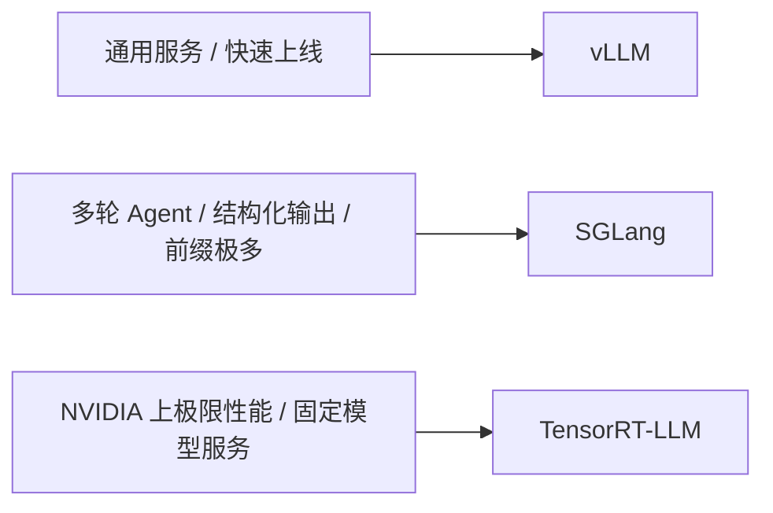
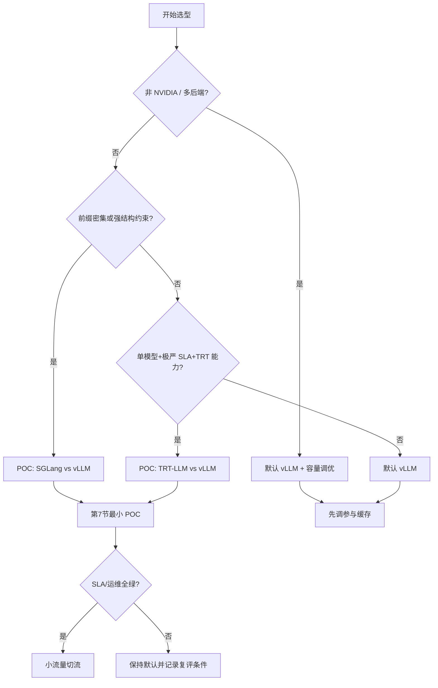

前几节把 vLLM 从入门、架构、V1 到调度与调参串起来了。工程上还要回答另一个问题：什么时候继续用 vLLM，什么时候该认真评估 SGLang 或 TensorRT-LLM？这一节用统一维度做横向对比，并给出**可操作的决策树与可执行的最小 POC**——重点是匹配场景，而不是评出一个永远的第一名。

<!-- more -->

## 📑 目录

- [1. 为什么需要横向对比](#1-为什么需要横向对比)
- [2. 三个框架的一句话定位](#2-三个框架的一句话定位)
- [3. 统一维度对比表](#3-统一维度对比表)
- [4. 技术特长与各自代价](#4-技术特长与各自代价)
- [5. 用负载画像做匹配](#5-用负载画像做匹配)
- [6. 选型决策树](#6-选型决策树)
- [7. 最小 POC：可执行对比步骤](#7-最小-poc可执行对比步骤)
- [8. 常见误区](#8-常见误区)
- [9. 迁移与共存策略](#9-迁移与共存策略)
- [总结](#-总结)
- [自我检验清单](#-自我检验清单)
- [参考资料](#-参考资料)

---

## 1. 为什么需要横向对比

推理框架的"快"至少有三层：

1. **Kernel 与图编译**（单步算得快不快）；
2. **调度与显存管理**（能不能把 GPU 喂饱、能不能共享前缀）；
3. **产品化与生态**（模型覆盖、量化、多硬件、观测、社区坑位）。

只看某一篇跑分榜单，很容易把"特定模型 + 特定负载 + 特定版本"的结果，误当成你的业务结论。选型应回到：**流量形态、延迟 SLA、团队栈、硬件绑定、运维复杂度**。

🔑 **核心概念**：**框架选型是约束满足问题，不是绝对性能竞赛。** 下文任何"更适合"都附带场景前提，避免解读成全面优于。

---

## 2. 三个框架的一句话定位

| 框架 | 一句话定位 |
|---|---|
| **vLLM** | 通用高吞吐服务引擎；生态宽、上手快，多数团队的默认起点 |
| **SGLang** | 以 RadixAttention 与编程式/结构化生成见长，偏 Agent、多轮、约束解码场景 |
| **TensorRT-LLM** | NVIDIA 栈上的深度优化运行时，冲极限延迟/吞吐，换来更重的引擎构建与硬件绑定 |



---

## 3. 统一维度对比表

下表是**选型用的工程判断**（随版本快速变化；落地前用你的模型与流量复测）。

| 维度 | vLLM | SGLang | TensorRT-LLM |
|---|---|---|---|
| 核心卖点 | PagedAttention、Continuous Batching、V1 统一调度 | RadixAttention、高效前缀复用、结构化/编程式生成 | TRT 图优化、融合 Kernel、NVIDIA 深度调优 |
| 典型优势负载 | 通用 Chat/API、多模型接入、快速迭代 | 多轮、共享前缀密集、JSON/文法约束、Agent | 固定模型的高 QPS/低延迟生产 |
| 模型生态 | 非常广（文本/多模态/MoE 等持续跟进） | 强，尤其对话与 Agent 相关路径 | 广，但常需转换/构建引擎，跟进速度看发布节奏 |
| 硬件 | GPU 为主，并扩展多后端 | 主要 NVIDIA GPU | **深度绑定 NVIDIA** |
| 易用性 | `vllm serve` + OpenAI API，上手快 | 同样偏 Python/服务化，学习曲线中等 | 引擎构建、版本与插件组合更重 |
| 量化与加速 | FP8/INT8/AWQ/GPTQ 等丰富 | 常用量化路径齐全 | 与 TensorRT 量化/插件体系结合紧 |
| 前缀复用 | Hash APC（V1 常见默认近零开销） | Radix Tree，细粒度共享更突出 | 有 KV/缓存相关能力，表达与生态叙事不同 |
| 结构化输出 | 有且在增强 | **传统强项之一** | 支持，但不是其最鲜明标签 |
| 社区与招聘友好度 | 很高 | 高、增长快 | 高，但更偏 NVIDIA 平台团队 |
| 运维复杂度 | 低到中 | 中 | 中到高（构建产物、版本钉扎） |

📌 **关键点**：把"谁第一"换成"谁匹配"。例如共享 System Prompt 极多的 Agent 网关，SGLang 的 RadixAttention 可能比泛化框架更合适；而要在两周内接入 10 个开源模型做统一 API，vLLM 通常阻力最小——这是摩擦与特长的匹配，不是笼统的全面碾压。

---

## 4. 技术特长与各自代价

### 4.1 vLLM：通用服务的默认底座

- **PagedAttention + V1 调度**把显存利用率与混批效率做成默认能力（本模块前几节主线）；
- OpenAI 兼容层、丰富后端与量化，让平台团队能"一个引擎服务多种模型"；
- **代价**：在某些极端前缀共享或深度 NVIDIA 图优化场景，点对点不一定压过专精框架；你要用调参与容量规划补齐（见 3.5）。

### 4.2 SGLang：RadixAttention 与可编程生成

- **RadixAttention** 用基数树管理可复用前缀，多轮/分支生成时缓存命中路径很直观（见第 2.3 节）；
- 对 **JSON Schema / 文法约束 / 多步 Program** 一类工作流更友好；
- **代价**：若流量并无前缀/结构特征，特长用不上，还要另建一套运维与观测资产。

### 4.3 TensorRT-LLM：把性能压到平台里

- 通过 TensorRT 构建优化引擎，融合算子、最大化 NVIDIA GPU 潜力；
- 常出现在"模型相对固定、愿意为性能付工程成本"的生产环境；
- **代价**：引擎构建时间、版本组合、调试链路更重；换模型/改精度往往不是改个参数那么轻。

💡 **提示**：三者并非互斥——很多团队用 **vLLM/SGLang 做异构模型网关**，对个别旗舰模型再上 **TensorRT-LLM** 做性能特区。

---

## 5. 用负载画像做匹配

把流量拆成可观测特征，比空谈"谁更快"有用：

| 负载特征 | 更偏向 | 原因 |
|---|---|---|
| 短 Prompt、高并发 Decode | vLLM 或 TensorRT-LLM | Continuous Batching + Kernel/图优化都能吃饱 GPU；用 POC 决定 |
| 超长共享 System Prompt / 多轮历史 | SGLang（或开了 APC 的 vLLM） | 前缀树/块级复用直接砍 Prefill |
| 输出必须过 JSON Schema / 文法 | 优先 POC SGLang，并对照 vLLM | 约束解码路径与工具链通常更顺，但仍需用你的 Schema 复测 |
| 模型每周换、量化方案常试 | vLLM | 转换与上线摩擦最低 |
| 单模型钉死半年、要抠最后一截延迟 | TensorRT-LLM | 付得起构建与钉版本成本才划算 |
| 需要 AMD/TPU 等多元硬件叙事 | 先看 vLLM/SGLang 当前后端矩阵 | TensorRT-LLM 基本不在候选 |

先给自己的流量打标签（前缀共享率、平均输入/输出长度、结构化比例、模型变更频率），再进决策树。

---

## 6. 选型决策树

按问题顺序筛——每一步都给出**可执行动作**，而不是形容词：

1. **是否必须绑定非 NVIDIA，或要快速覆盖多后端？**  
   - 是 → 以 vLLM 为默认候选；TensorRT-LLM 通常直接排除。  
   - 否 → 进入下一步。
2. **抽样 200～1000 条真实请求，估算：共享前缀命中潜力、JSON/文法约束占比、多轮深度。**  
   - 前缀共享率高 **或** 强结构约束占比高 → **并行 POC：SGLang vs vLLM**（同一流量）。  
   - 否则 → 下一步。
3. **是否单一旗舰模型、SLA 极严、团队有 NVIDIA/TRT 经验，且能接受引擎构建流水线？**  
   - 是 → **并行 POC：TensorRT-LLM vs 当前默认（多为 vLLM）**。  
   - 否 → **默认 vLLM**，把时间花在量化、缓存与容量规划（3.5）上。
4. **任一 POC 只有在第 7 节清单全绿时才允许切换**；否则保持默认，记录"下次再评"的触发条件（例如模型冻结 90 天、P99 连续两周撞线）。



| 业务画像 | 首选起点 | 对照 POC |
|---|---|---|
| 公司级统一模型网关、模型频繁增减 | vLLM | 仅在某条 Agent 链路吃前缀时局部试 SGLang |
| 客服/Agent，系统提示长、多轮深 | SGLang | 必须用同一流量打 vLLM，防止"感觉更快" |
| 广告/搜索等高 QPS，模型稳定，NVIDIA 集群 | TensorRT-LLM | 对照已调优的 vLLM，算清构建人日 |
| 教学、实验、开源追踪 | vLLM | 按需体验 SGLang |
| 强 JSON/文法输出 | SGLang | 对照 vLLM 当前结构化能力是否已够用 |

---

## 7. 最小 POC：可执行对比步骤

没有对照实验的选型等于站队。下面是一套**按顺序能做完**的最小 POC（以单模型、单卡或固定 TP 为例）。

### 7.1 准备（半天内完成）

1. 固定权重路径与精度（例如都 BF16，或都同一 AWQ 量化）；禁止一边 FP8 一边 BF16。
2. 从生产抽 **N≥500** 条请求（或按分位合成：P50/P95 输入长度、多轮比例、系统提示是否共享）。
3. 写清 SLA：例如 `P99 TTFT ≤ A ms`、`P99 TPOT ≤ B ms`、目标 QPS = C。

### 7.2 拉起两个（或三个）服务

```bash
# A. vLLM（端口 8000）——参数按 3.5 先调到不抢占的稳态
vllm serve MODEL -tp TP --port 8000 \
  --gpu-memory-utilization 0.90 \
  --max-model-len MAX_LEN \
  --max-num-seqs SEQS \
  --max-num-batched-tokens BUDGET

# B. SGLang（端口 8001）——同一 MODEL / 精度 / 上下文上限
# 具体 CLI 以当前 SGLang 文档为准，保持模型与精度一致

# C. 如做 TRT-LLM：先按官方流程构建引擎，再起服务（端口 8002）
# 记录引擎构建耗时与产物版本，计入成本账
```

### 7.3 压测与记录

对每个引擎跑同一脚本（可用 `guidellm`、自研异步客户端或团队现有压测床）：

| 步骤 | 动作 | 记录字段 |
|---|---|---|
| 1 | 并发 = 1 暖机 2 分钟 | 冷启动/编译是否异常 |
| 2 | 并发 = 目标 C 的 50% | TTFT/TPOT P50/P99、tokens/s、错误率 |
| 3 | 并发 = C | 同上 + GPU Util + OOM/抢占 |
| 4 | 并发 = 1.2C（过载） | 是否优雅降级还是雪崩 |
| 5 | 正确性抽检 50 条 | 约束满足率、明显胡言比例 |

### 7.4 决策门槛（示例，可改数字不可改结构）

| 检查项 | 通过标准 |
|---|---|
| 正确性 | 约束满足率 ≥ 业务门槛；无阻断级功能缺失 |
| 延迟 | P99 TTFT/TPOT 落入 SLA |
| 吞吐 | 同硬件达到容量规划 C |
| 运维 | 发布可脚本化、可回滚；构建时间可接受 |
| 成本 | 工程人日与机器成本可接受（TRT 务必计入构建） |

取舍句：若候选框架吞吐高 **10%～15%** 但发布多耗 **一周** 且模型每月一换，对多数中台团队是净亏——**POC 赢指标不等于赢业务**。

⚠️ **注意**：POC 全绿后仍要小流量切流，确认监控、鉴权、限流、崩溃恢复可接受，再放大比例。

---

## 8. 常见误区

- **只看官方博客的最大加速比**：负载不同，结论不同；必须用自己的 Prompt 长度分布与并发曲线复测。
- **把框架当唯一矛盾**：多数性能问题先出在 `max_model_len` 乱设、KV 池不够、无前缀复用、量化未开——换框架解决不了错误容量规划。
- **忽视团队成本**：多出来的吞吐若换不回发布节奏与可维护性，对业务可能是净亏。
- **忽视版本钉扎**：三者都在狂奔；生产环境要锁版本并保留回滚。
- **用微观基准代替业务**：ShareGPT 类短对话跑分好看，不代表你的 32K 文档问答也好看。
- **把"默认推荐 vLLM"读成"全面优于"**：默认只表示摩擦最低；特长场景下对照 POC 完胜时，就应该偏离默认。

---

## 9. 迁移与共存策略

- **API 层统一**：对外继续暴露 OpenAI 兼容接口，网关后面对接不同引擎，避免业务代码绑死框架。
- **先并列 POC**：同一模型、同一流量回放，对齐 TTFT/TPOT/吞吐/错误率/GPU 利用率，再决定切换。
- **能力降级清单**：结构化输出、Logprobs、多模态、LoRA、投机解码等，切换前逐项核对目标引擎版本是否支持。
- **可逆迁移**：保留旧引擎副本与配置，按百分比切流，而不是"周五晚上全量替换"。
- **配置资产化**：把引擎参数、量化方案、压测报告与决策理由写进仓库。

---

## 📝 总结

- **vLLM**：通用、生态宽、上手快，大多数服务化场景的默认起点，而非所有细分场景的终点。
- **SGLang**：RadixAttention + 结构化/Agent 友好，适合前缀密集与约束解码产品。
- **TensorRT-LLM**：NVIDIA 上冲极限性能，适合模型稳定且愿意付构建与运维成本的团队。
- 先给流量打标签，再按决策树行动，并用第 7 节最小 POC 验证；禁止无对照切换。
- 网关层保持 OpenAI 兼容，允许多引擎共存与可逆迁移。

## 🎯 自我检验清单

- 能用一句话说明三个框架各自的定位，而不诉诸"全面更好"
- 能从生态、前缀复用、结构化输出、硬件绑定、运维复杂度做对照
- 能根据"多模型网关 / Agent 多轮 / 极限 NVIDIA 服务"三类画像给出首选起点与对照项
- 能列出至少三个选型前的负载标签（如前缀共享率、结构约束比例、模型变更频率）
- 能按第 7 节步骤搭起双引擎、跑完三档并发并填写决策门槛表
- 能指出至少两个"别只看跑分"的选型误区
- 能说明为何网关层做 OpenAI 兼容有利于引擎共存与迁移

## 📚 参考资料

- [vLLM 官方文档](https://docs.vllm.ai/en/latest/)
- [vLLM GitHub](https://github.com/vllm-project/vllm)
- [vLLM V1 架构博客](https://blog.vllm.ai/2025/01/27/v1-alpha-release.html)
- [SGLang 官方文档](https://docs.sglang.ai/)
- [SGLang GitHub](https://github.com/sgl-project/sglang)
- [TensorRT-LLM 文档](https://nvidia.github.io/TensorRT-LLM/)
- [TensorRT-LLM GitHub](https://github.com/NVIDIA/TensorRT-LLM)
- [PagedAttention 论文](https://arxiv.org/abs/2309.06180)
