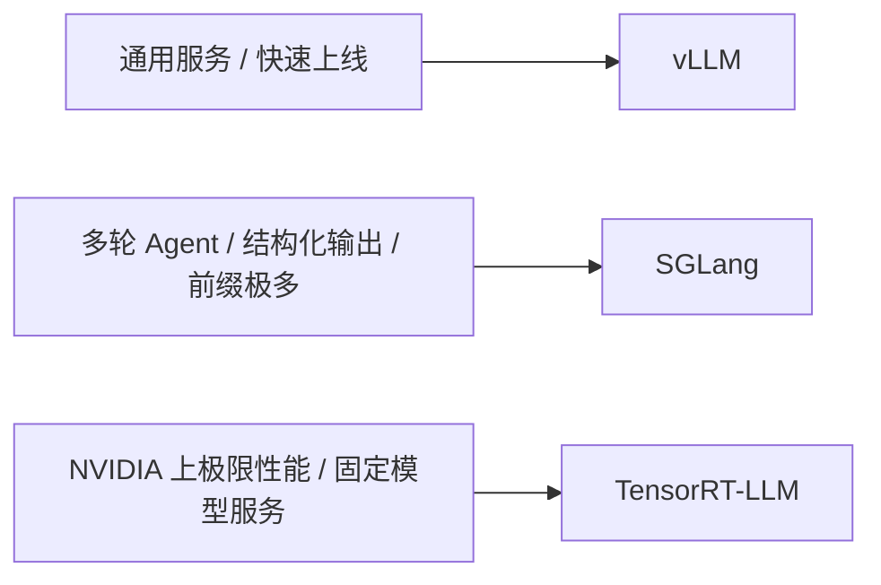
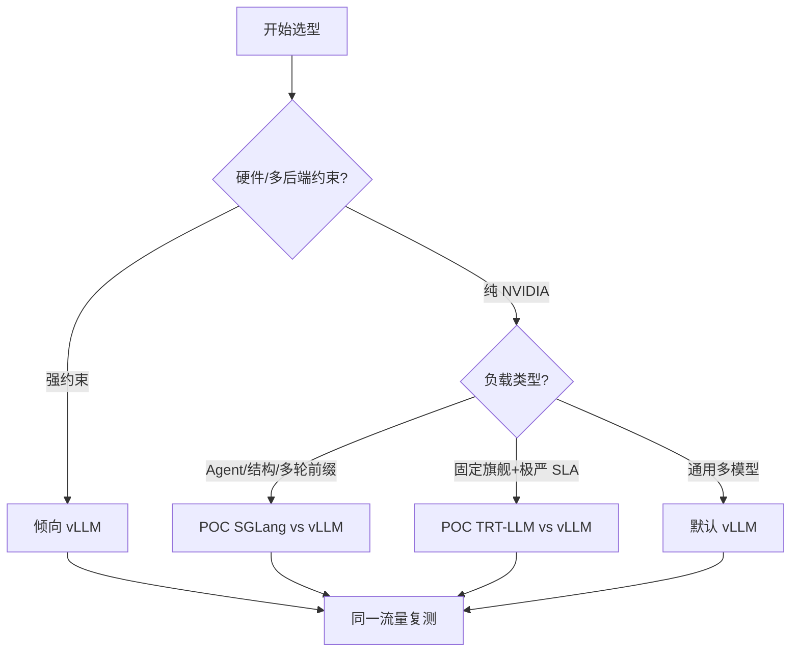

前几节把 vLLM 从入门、架构、V1 到调度与调参串起来了。工程上还要回答另一个问题：什么时候继续用 vLLM，什么时候该认真评估 SGLang 或 TensorRT-LLM？这一节用统一维度做横向对比，给出决策表——重点是**匹配场景**，而不是 crowning 一个永远的第一名。

<!-- more -->

## 📑 目录

- [1. 为什么需要横向对比](#1-为什么需要横向对比)
- [2. 三个框架的一句话定位](#2-三个框架的一句话定位)
- [3. 统一维度对比表](#3-统一维度对比表)
- [4. 技术特长深挖](#4-技术特长深挖)
- [5. 用负载画像做匹配](#5-用负载画像做匹配)
- [6. 选型决策树](#6-选型决策树)
- [7. 最小 POC 怎么做](#7-最小-poc-怎么做)
- [8. 常见误区](#8-常见误区)
- [9. 迁移与共存策略](#9-迁移与共存策略)
- [总结](#-总结)
- [自我检验清单](#-自我检验清单)
- [参考资料](#-参考资料)

---

## 1. 为什么需要横向对比

推理框架的"快"至少有三层：

1. **Kernel 与图编译**（单步算得快不快）；
2. **调度与显存管理**（能不能把 GPU 喂饱、能不能共享前缀）；
3. **产品化与生态**（模型覆盖、量化、多硬件、观测、社区坑位）。

只看某一篇跑分榜单，很容易把"特定模型 + 特定负载 + 特定版本"的结果，误当成你的业务结论。选型应回到：**流量形态、延迟 SLA、团队栈、硬件绑定、运维复杂度**。

🔑 **核心概念**：**框架选型是约束满足问题，不是绝对性能竞赛。**

---

## 2. 三个框架的一句话定位

| 框架 | 一句话定位 |
|---|---|
| **vLLM** | 通用高吞吐服务引擎；生态最全、默认选择面最大 |
| **SGLang** | 以 RadixAttention 与编程式/结构化生成见长，偏 Agent、多轮、约束解码场景 |
| **TensorRT-LLM** | NVIDIA 栈上的深度优化运行时，冲极限延迟/吞吐，换来更重的引擎构建与硬件绑定 |

---

## 3. 统一维度对比表

下表是**选型用的工程判断**（随版本快速变化；落地前用你的模型与流量复测）。

| 维度 | vLLM | SGLang | TensorRT-LLM |
|---|---|---|---|
| 核心卖点 | PagedAttention、Continuous Batching、V1 统一调度 | RadixAttention、高效前缀复用、结构化/编程式生成 | TRT 图优化、融合 Kernel、NVIDIA 深度调优 |
| 典型优势负载 | 通用 Chat/API、多模型接入、快速迭代 | 多轮、共享前缀密集、JSON/文法约束、Agent | 固定模型的高 QPS/低延迟生产 |
| 模型生态 | 非常广（文本/多模态/MoE 等持续领先覆盖） | 强，尤其对话与 Agent 相关路径 | 广，但常需转换/构建引擎，跟进速度看发布节奏 |
| 硬件 | GPU 为主，并扩展多后端 | 主要 NVIDIA GPU | **深度绑定 NVIDIA** |
| 易用性 | `vllm serve` + OpenAI API，上手快 | 同样偏 Python/服务化，学习曲线中等 | 引擎构建、版本与插件组合更重 |
| 量化与加速 | FP8/INT8/AWQ/GPTQ 等丰富 | 常用量化路径齐全 | 与 TensorRT 量化/插件体系结合紧 |
| 前缀复用 | Hash APC（V1 默认近零开销） | Radix Tree，细粒度共享更突出 | 有 KV/缓存相关能力，表达与生态叙事不同 |
| 结构化输出 | 有且在增强 | **传统强项之一** | 支持，但不是其最鲜明标签 |
| 社区与招聘友好度 | 很高 | 高、增长快 | 高，但更偏 NVIDIA 平台团队 |
| 运维复杂度 | 低到中 | 中 | 中到高（构建产物、版本钉扎） |

📌 **关键点**：把"谁第一"换成"谁匹配"。例如共享 System Prompt 极多的 Agent 网关，SGLang 的 RadixAttention 可能比泛化框架更香；而要在两周内接入 10 个开源模型做统一 API，vLLM 通常阻力最小。

---

## 4. 技术特长深挖

### 4.1 vLLM：通用服务的默认底座

- **PagedAttention + V1 调度**把显存利用率与混批效率做成默认能力；
- OpenAI 兼容层、丰富后端与量化，让平台团队能"一个引擎服务多种模型"；
- 代价是：在某些**极端前缀共享**或**深度 NVIDIA 图优化**场景，不一定点对点压过专精框架。

### 4.2 SGLang：RadixAttention 与可编程生成

- **RadixAttention** 用基数树管理可复用前缀，多轮/分支生成时缓存命中路径很直观（见第 2.3 节）；
- 对 **JSON Schema / 文法约束 / 多步 Program** 一类工作流更友好；
- 适合 Agent、工具调用、复杂解码约束密集的产品。

### 4.3 TensorRT-LLM：把性能压到平台里

- 通过 TensorRT 构建优化引擎，融合算子、最大化 NVIDIA GPU 潜力；
- 常出现在"模型相对固定、愿意为性能付工程成本"的生产环境；
- 代价是：引擎构建时间、版本组合、调试链路更重；换模型/改精度往往不是改个参数那么轻。

💡 **提示**：三者并非互斥——很多团队用 **vLLM/SGLang 做异构模型网关**，对个别旗舰模型再上 **TensorRT-LLM** 做性能特区。

---

## 5. 用负载画像做匹配

把流量拆成可观测特征，比空谈"谁更快"有用：

| 负载特征 | 更偏向 | 原因 |
|---|---|---|
| 短 Prompt、高并发 Decode | vLLM / TRT-LLM | Continuous Batching + Kernel/图优化都能吃饱 GPU |
| 超长共享 System Prompt / 多轮历史 | SGLang（或开了 APC 的 vLLM） | 前缀树/块级复用直接砍 Prefill |
| 输出必须过 JSON Schema / 文法 | SGLang 优先对照 | 约束解码路径与工具链通常更顺 |
| 模型每周换、量化方案常试 | vLLM | 转换与上线摩擦最低 |
| 单模型钉死半年、要抠最后 10%～30% | TensorRT-LLM | 付得起构建与钉版本成本才划算 |
| 需要 AMD/TPU 等多元硬件叙事 | 先看 vLLM/SGLang 当前后端矩阵 | TRT-LLM 基本不在候选 |

📌 **关键点**：先给自己的流量打标签（前缀共享率、平均输入/输出长度、结构化比例、模型变更频率），再进决策树——否则对比表只是装饰。

---

## 6. 选型决策树

按问题顺序筛：

1. **是否必须绑定非 NVIDIA 或要快速多后端？**  
   → 优先 vLLM（或其它更宽松生态），TRT-LLM 通常排除。
2. **流量是否以多轮 Agent / 海量共享前缀 / 强结构约束为主？**  
   → 认真 POC SGLang；同时用同一套流量打 vLLM 做对照。
3. **是否单一旗舰模型、SLA 极严、团队有 NVIDIA 优化经验？**  
   → POC TensorRT-LLM；确认构建与发布流水线可接受。
4. **其它情况（通用 Chat API、多模型、要快上线）**  
   → **默认 vLLM**，把时间花在量化、缓存与容量规划上。

| 业务画像 | 首选 | 备选 |
|---|---|---|
| 公司级统一模型网关、模型频繁增减 | vLLM | SGLang |
| 客服/Agent，系统提示长、多轮深 | SGLang | vLLM |
| 广告/搜索等高 QPS，模型稳定，NVIDIA 集群 | TensorRT-LLM | vLLM |
| 教学、实验、开源追踪 | vLLM | SGLang |
| 强 JSON/文法输出 | SGLang | vLLM |

---

## 7. 最小 POC 怎么做

没有对照实验的选型等于站队。一套最小可复现 POC：

1. **固定模型与精度**：同一权重、同一量化（或都 BF16），禁止一边 FP8 一边 BF16 却宣称框架胜利。
2. **固定流量**：从生产抽样或合成贴近分布的数据集（输入长度分位、多轮比例、系统提示是否共享）。
3. **固定并发曲线**：至少测 1 / 中位 / 峰值 三档 QPS 或并发数。
4. **固定指标**：TTFT（P50/P99）、TPOT/ITL（P50/P99）、吞吐 tokens/s、错误率、GPU Util、是否 OOM/抢占。
5. **固定成本账**：工程人日（转换、调参、上线）、镜像体积、冷启动/引擎构建时间。

| POC 检查项 | 通过标准（示例） |
|---|---|
| 正确性 | 抽检输出与约束满足率达标 |
| 延迟 SLA | P99 TTFT/TPOT 落入预算 |
| 吞吐 | 同硬件下达到容量规划 |
| 运维 | 发布步骤可脚本化、可回滚 |
| 生态缺口 | 无阻断级缺失（多模态/LoRA/logprobs 等） |

⚠️ **注意**：POC 赢了还不等于能上生产——还要看监控指标是否可导出、与现有网关鉴权/限流是否好接、崩溃恢复是否可接受。

---

## 8. 常见误区

- **只看官方博客的最大加速比**：负载不同，结论不同；必须用自己的 Prompt 长度分布与并发曲线复测。
- **把框架当唯一矛盾**：多数性能问题先出在 `max_model_len` 乱设、KV 池不够、无前缀复用、量化未开——换框架解决不了错误容量规划。
- **忽视团队成本**：TRT-LLM 赢了 15% 吞吐但输了两周发布节奏，对业务可能是净亏。
- **忽视版本钉扎**：三者都在狂奔；生产环境要锁版本并保留回滚，而不是永远追 main。
- **用微观基准代替业务**：ShareGPT 类短对话跑分好看，不代表你的 32K 文档问答也好看。

⚠️ **注意**：本模块以 vLLM 为实例主线，不代表它在所有细分场景都最优；对比的目的是让你**有依据地偏离默认选择**。

---

## 9. 迁移与共存策略

- **API 层统一**：对外继续暴露 OpenAI 兼容接口，网关后面对接不同引擎，避免业务代码绑死框架。
- **先并列 POC**：同一模型、同一流量回放，对齐 TTFT/TPOT/吞吐/错误率/GPU 利用率，再决定切换。
- **能力降级清单**：结构化输出、Logprobs、多模态、LoRA、投机解码等，切换前逐项核对目标引擎版本是否支持。
- **可逆迁移**：保留旧引擎副本与配置，按百分比切流，而不是"周五晚上全量替换"。
- **配置资产化**：把引擎参数、量化方案、压测报告与决策理由写进仓库，避免知识只活在某次会议纪要里。

---

## 📝 总结

- **vLLM**：通用、生态全、上手快，大多数服务化场景的默认解。
- **SGLang**：RadixAttention + 结构化/Agent 友好，适合前缀密集与约束解码产品。
- **TensorRT-LLM**：NVIDIA 上极限性能，适合模型稳定且愿意付构建与运维成本的团队。
- 先给流量打标签，再按硬件约束 → 负载形态 → SLA/团队技能决策，并用同一套 POC 指标验证。
- 网关层保持 OpenAI 兼容，允许多引擎共存与可逆迁移。

## 🎯 自我检验清单

- 能用一句话说明三个框架各自的定位，而不是背参数列表
- 能从生态、前缀复用、结构化输出、硬件绑定、运维复杂度做对照
- 能根据"多模型网关 / Agent 多轮 / 极限 NVIDIA 服务"三类画像给出首选
- 能列出至少三个应用在选型前的负载标签（如前缀共享率、结构约束比例）
- 能设计一个最小 POC：同一模型、同一流量、同一组延迟吞吐指标
- 能指出至少两个"别只看跑分"的选型误区
- 能说明为何网关层做 OpenAI 兼容有利于引擎共存与迁移

## 📚 参考资料

- [vLLM 官方文档](https://docs.vllm.ai/en/latest/)
- [vLLM GitHub](https://github.com/vllm-project/vllm)
- [vLLM V1 架构博客](https://blog.vllm.ai/2025/01/27/v1-alpha-release.html)
- [SGLang 官方文档](https://docs.sglang.ai/)
- [SGLang GitHub](https://github.com/sgl-project/sglang)
- [TensorRT-LLM 文档](https://nvidia.github.io/TensorRT-LLM/)
- [TensorRT-LLM GitHub](https://github.com/NVIDIA/TensorRT-LLM)
- [Efficient Memory Management for Large Language Model Serving with PagedAttention](https://arxiv.org/abs/2309.06180)
