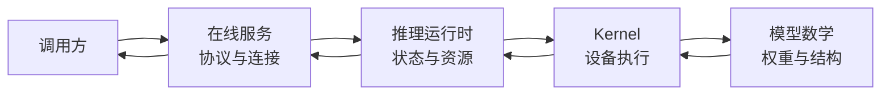
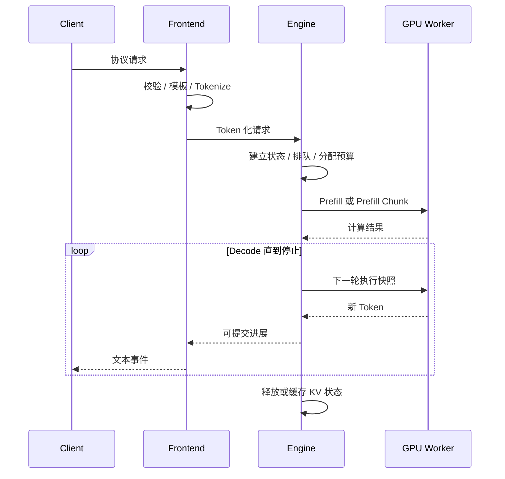

## 📑 目录
- [1. 真实问题：模型会生成，为什么还需要运行时](#1-真实问题模型会生成为什么还需要运行时)
- [2. 餐厅、包房与分页餐桌](#2-餐厅包房与分页餐桌)
- [3. 四层坐标：模型、Kernel、运行时与服务](#3-四层坐标模型kernel运行时与服务)
- [4. 有状态推理运行时到底保存什么](#4-有状态推理运行时到底保存什么)
- [5. 离线 Engine 与在线 Server 的边界](#5-离线-engine-与在线-server-的边界)
- [6. 贯穿请求的第一段旅程](#6-贯穿请求的第一段旅程)
- [7. 第一份显存账本](#7-第一份显存账本)
- [8. 第一份延迟账本](#8-第一份延迟账本)
- [9. 概念性最小验证](#9-概念性最小验证)
- [10. 初学者最常见的误区](#10-初学者最常见的误区)
- [11. vLLM 解决什么，不解决什么](#11-vllm-解决什么不解决什么)
- [12. 与其他框架的第一眼对照](#12-与其他框架的第一眼对照)
- [总结](#总结)
- [自我检验](#自我检验)
- [参考资料](#参考资料)
---
第 1～2 章已经解释自回归生成、KV Cache、分页、连续批处理与统一调度。
本节不再把这些机制各讲一遍。
我们的目标是把它们放回一台常驻系统，理解 vLLM 在“模型调用”和“在线服务”之间补上了什么。

## 1. 真实问题：模型会生成，为什么还需要运行时
在一段 Python 代码里加载模型并调用 `generate()`，已经可以得到文本。
这证明的是：
> 给定输入 Token 和模型权重，某次生成能够完成。
线上服务面对的却不是“一次生成”，而是一条不断变化的请求流：
- 请求到达时间不同；
- Prompt 和输出长度不同；
- 有些请求共享前缀，有些完全独立；
- 有些连接会取消，有些要求流式返回；
- 多个请求竞争同一组 GPU、KV Cache 和 CPU 时间；
- 业务关心 P99，而不是某次演示能否成功。
如果每个请求都独占模型直到结束，短请求会被长请求阻塞。
如果每个请求都按最大上下文预留 KV，显存会被大量未使用空间占住。
如果每轮 Decode 都重新构造完整批次，CPU 元数据工作会逐渐显眼。
如果只限制请求个数，不限制 Token 与 KV，系统仍可能在长 Prompt 下失稳。
所以 vLLM 的核心身份不是“另一个模型库”，而是**推理运行时**。它持续回答四个问题：
1. 下一轮允许哪些请求执行？
2. 每个请求本轮推进多少 Token？
3. 它们的 KV 状态放在哪里、何时释放？
4. 结果怎样在不破坏请求身份的前提下返回调用方？

## 2. 餐厅、包房与分页餐桌
原稿用餐厅解释 vLLM，这个直觉值得保留。
### 2.1 包房式分配
想象一家餐厅，每组客人到店时都要预订一间十人包房。
两位客人也占满一间，六位客人也占满一间。只要包房被占用，剩下的座位就不能给其他人。
这类似按最大可能长度为每个请求预留连续 KV 空间：
- 预留量由上限决定；
- 实际使用量由请求何时结束决定；
- 两者差额在请求存活期间不能被别人利用。
餐厅可能还有很多空椅子，却因为没有完整空包房而拒绝新客。
这对应内部碎片与外部碎片共同造成的低利用率。
### 2.2 分页餐桌
现在餐厅改用可拼接的四人小桌。一组客人先拿一张桌，人数增加时再拿下一张。
小桌不必物理相邻，前台只需保存“这组客人用了哪些桌”的映射。
请求看到的是连续 Token 历史，显存中承载 KV 的块却可以分散。
最后一张桌可能还有少量空位，但浪费被限制在一个固定粒度内。
请求结束后，桌子可以回到公共池。相同前缀在满足身份条件时，还可能共享已经准备好的桌子。
这就是 PagedAttention 借用操作系统分页思想提供的直觉。
### 2.3 类比在哪里停止
真实系统不是移动椅子。
Attention Kernel 必须根据 Block Table 找到分散的物理 KV。
Block 分配、引用、复用与回收都要保持一致。
页变小会减少尾部浪费，却增加映射元数据和管理次数。页变大则相反。
PagedAttention 的 Block Table、碎片公式与 Copy-on-Write 已在第 2.1 节展开。
本章只保留一个结论：
> 分页不是单独的加速按钮，而是运行时能按需管理长期 KV 状态的基础设施。

## 3. 四层坐标：模型、Kernel、运行时与服务
初学者常把下面四层都叫作“推理框架”，于是很难判断问题发生在哪里。
### 3.1 模型层
模型层定义数学与语义：
- Transformer 层数；
- Attention 结构；
- 词表与 Tokenizer；
- 权重精度；
- 最大位置范围；
- Chat Template 和停止语义。
模型层回答“算什么”。它不负责决定多个请求如何排队。
### 3.2 Kernel 层
Kernel 层执行具体算子：
- GEMM；
- Attention；
- Normalization；
- Sampling；
- Collective。
Kernel 层回答“某个张量操作怎样在硬件上高效完成”。
更快的 Kernel 不会自动解决 KV 生命周期或请求取消。
### 3.3 推理运行时层
运行时把长期请求状态转换成一轮轮 GPU 工作：
- 接纳与排队；
- Continuous Batching；
- Token Budget；
- KV 块分配；
- Prefix Cache；
- 执行计划；
- 完成与释放。
vLLM 的主要分析对象就在这一层。
### 3.4 在线服务层
服务层把运行时暴露给远程调用方：
- HTTP 与协议兼容；
- 鉴权和限流；
- 流式连接；
- 超时与取消；
- 多租户；
- 指标与健康检查。
服务层回答“外部怎样安全、稳定地使用运行时”。
OpenAI 兼容描述的是接口合同，不代表内部实现、性能或全部语义都相同。

排障时应先定位层，再讨论工具。输出质量异常可能来自模型模板。
小 Batch 延迟异常可能来自 Kernel launch 或图执行。
排队与抢占通常属于运行时。连接中断但 GPU 仍短暂计算，则涉及服务取消跨越运行时边界的语义。

## 4. 有状态推理运行时到底保存什么
“有状态”不是说服务一定把聊天记录存进数据库。
它指一次请求在多个迭代之间必须保留可继续执行的运行状态。
对请求 \(i\)，可以用下面的教学抽象表示：

$$
R_i(t)=
(\text{id},\ \text{tokens},\ \text{progress},\ \text{kv},
\text{sampling},\ \text{constraints},\ \text{lifecycle})
$$
其中：
- `id` 关联输入、执行与输出；
- `tokens` 表示模型实际看到的 Token 序列；
- `progress` 表示已经计算和已经提交到哪一位置；
- `kv` 表示该请求有权引用的 KV 块；
- `sampling` 保存生成规则和必要状态；
- `constraints` 可以包含 Grammar 或其他就绪条件；
- `lifecycle` 区分 Waiting、Running、Finished、Cancelled。
一次 Batch 只是这些长期状态在时刻 \(t\) 的执行快照：
$$
B_t=\operatorname{Schedule}\left(\{R_i(t)\},\ \text{budgets}(t)\right)
$$
GPU 返回结果后，运行时再把结果提交回长期状态：
$$
\{R_i(t+1)\}=\operatorname{Commit}\left(\{R_i(t)\},B_t,Y_t\right)
$$
如果把 Batch 和 Request 当成同一对象，就很难表达“请求仍存活但本轮没有执行”。
如果多个组件都能独立修改 `progress`，则迟到结果、取消与重试会造成双写。
因此，状态所有权比类名更重要。
3.2 会专门沿一次请求追踪这些所有权。

## 5. 离线 Engine 与在线 Server 的边界
vLLM 同时支持离线生成和在线服务。它们共享推理运行时能力，却解决不同的系统问题。
### 5.1 离线 Engine
离线模式通常由同一进程中的程序直接提交一批输入。
调用方自己掌握数据集、重试、结果落盘和任务完成条件。它适合：
- 批量生成；
- 离线评测；
- 数据合成；
- 受控实验；
- 不要求网络并发的内部流水线。
这里仍有调度与 KV 管理。“离线”不等于“一次只能处理一个请求”。
边界在于：网络协议、远程连接、认证与多客户端背压通常不属于 Engine 的核心职责。
### 5.2 在线 Server
在线模式在 Engine 外增加长期存在的服务边界。
请求随时到达，调用方也可能随时离开。Server 还要处理：
- 协议字段到运行时请求的转换；
- Chat Template 与 Tokenize；
- 流式事件；
- 连接取消；
- 入口队列与限流；
- 可观测性。
Engine 判断“请求是否还能推进”。
Server 还要判断“结果应该交给哪个连接、合同是否仍有效”。
### 5.3 二者不是快慢关系
不能因为离线少一层 HTTP 就笼统说离线更快。
若离线提交方式不能形成合适负载，GPU 也可能利用不足。
在线服务虽然增加协议成本，却能聚合多个独立调用方的并发。
公平比较必须固定相同的输入 Token、输出规则、并发和计时边界。

## 6. 贯穿请求的第一段旅程
本章请求 `infra-guide-001` 含 1,536 个输入 Token，最多生成 128 个 Token。
它到达时已有两个请求在 Decode。在本节只观察稳定阶段，不绑定具体函数名：

这条链路里有三个不同的“完成”：
1. GPU 完成某一轮计算；
2. Engine 判断请求达到停止条件并释放运行状态；
3. Server 把最后一个输出事件交付给调用方。
三者不在同一时刻发生。所以“GPU 已经算完”不能直接推出“客户端已经收到”。

## 7. 第一份显存账本
启动一个常驻运行时时，显存至少要容纳：
$$
M_{\text{total}}
\ge
M_{\text{weights}}
+M_{\text{KV}}
+M_{\text{runtime}}
+M_{\text{graph}}
+M_{\text{headroom}}
$$
\(M_{\text{runtime}}\) 包括临时激活、通信区和实现需要的工作区。
\(M_{\text{graph}}\) 只在相应图执行策略下存在，且不是免费空间。
\(M_{\text{headroom}}\) 用来吸收估算误差与运行峰值。
### 7.1 KV 每 Token 的一阶估算
对普通多头或 GQA 模型，每个 Token 的 KV 字节可近似写为：
$$
m_{\text{KV/token}}
=
2L H_{\text{kv}} d_{\text{head}} b
$$
其中：
- \(2\) 表示 Key 与 Value；
- \(L\) 是层数；
- \(H_{\text{kv}}\) 是 KV Head 数；
- \(d_{\text{head}}\) 是每个 Head 的维度；
- \(b\) 是每个元素的字节数。
假设教学模型有 32 层、8 个 KV Head、Head 维度 128，KV 使用 2 Byte：
$$
m_{\text{KV/token}}
=2\times32\times8\times128\times2
=131{,}072\ \text{Byte}
=128\ \text{KiB}
$$
一个 4,096 Token 的完整上下文约需：
$$
4{,}096\times128\ \text{KiB}
=512\ \text{MiB}
$$
### 7.2 一张 24 GiB GPU 的教学算例
假设可用于该实例的静态预算为显存的 90%：
$$
24\ \text{GiB}\times 0.90=21.6\ \text{GiB}
$$
再假设：
- 权重占 \(14\ \text{GiB}\)；
- 非 KV 的运行时与保留空间共占 \(2\ \text{GiB}\)；
- 暂不计独立 Graph 池。
留给 KV 的估算为：
$$
M_{\text{KV}}=21.6-14-2=5.6\ \text{GiB}
$$
可容纳的 Token 槽位约为：
$$
\frac{5.6\ \text{GiB}}{128\ \text{KiB/token}}
\approx45{,}875\ \text{token}
$$
若每条请求都真实占满 4,096 Token，理想上界约为 11 条。
这不是“并发一定等于 11”。
实际容量还受页尾碎片、Prefix 共享、输出增长、临时工作区、图内存和安全余量影响。
设置 256 个请求槽位也不会凭空创造 KV 空间。这就是为什么参数要看成耦合资源策略。

## 8. 第一份延迟账本
一次在线请求先用首 Token 路径定义 TTFT：
$$
T_{\text{TTFT}}
=
T_{\text{front}}+T_{\text{queue}}+T_{\text{prefill}}+T_{\text{first-return}}
$$
若总共生成 \(N\) 个 Token，端到端时间可粗略写成：
$$
T_{\text{E2E}}
\approx T_{\text{TTFT}}
+\sum_{k=2}^{N}T_{\text{gap},k}
+T_{\text{finish}}
$$
在稳定区间，也常用平均 TPOT 做一阶估算：
$$
T_{\text{E2E}}\approx T_{\text{TTFT}}+(N-1)\overline{T}_{\text{POT}}+T_{\text{finish}}
$$
### 8.1 带单位算例
假设 `infra-guide-001` 的观测值为：
- 前端规范化与 Tokenize：\(4\ \text{ms}\)；
- 运行时排队：\(18\ \text{ms}\)；
- Prefill 到首个可采样结果：\(55\ \text{ms}\)；
- 生成 32 Token，平均每 Token \(12\ \text{ms}\)；
- 最后输出提交：\(7\ \text{ms}\)。
则端到端近似为：
$$
T_{\text{E2E}}
=4+18+55+(32-1)\times12+7
=456\ \text{ms}
$$

其中 TTFT 的一阶估算为 \(4+18+55=77\ \text{ms}\)，之后还有 31 个 Token 间隔。
把 456 ms 全部归因于 GPU，会错过 29 ms 的前端、排队与收尾路径，也会忽略排队可能随流量急剧放大。
平均值还不能代替 P99。
长 Prompt 插入、抢占、Graph fallback 或 CPU 抖动都可能只出现在尾部。

## 9. 概念性最小验证
快速入门需要验证边界，但不需要复制一套安装教程。
### 9.1 先固定环境合同
至少记录：
- vLLM 版本；
- 模型与 Tokenizer revision；
- GPU 型号和显存；
- 驱动、CUDA 与 PyTorch 兼容组合；
- 权重与 KV 精度；
- 是否启用量化、编译或图执行；
- 输入与输出 Token 长度。
“能成功安装”只说明依赖解析完成。
“能导入包”也不说明某模型、某 Kernel 后端和某硬件组合可执行。
版本兼容矩阵应以当前官方文档和发行说明为准。
### 9.2 离线最小验证
离线只需证明四件事：
1. 权重能够加载；
2. 两条不同长度输入能进入同一运行时；
3. 输出 Token 数和停止原因可观察；
4. 第二次运行不因残留状态改变输入语义。
这一步不追求峰值吞吐。它建立的是模型合同和显存基线。
### 9.3 在线最小验证
在线只需再证明：
1. 同一模型合同能通过远程协议提交；
2. 非流式与流式结果在 Token 语义上相容；
3. 请求 ID 能关联入口、运行时和输出；
4. 客户端取消后，运行时最终会停止推进并回收资源；
5. 并发两条请求时，不出现串线或全局阻塞。
OpenAI 兼容 API 是这里的一种协议边界。不要把“HTTP 200”当作语义正确性证明。
模板错误、输出截断和停止条件不一致，都可能在成功状态码下发生。
### 9.4 最小证据集
一次合格验证至少留下：
- 最终配置摘要；
- 输入与实际 Token 长度；
- 权重、KV 和剩余显存概况；
- TTFT、TPOT、端到端延迟；
- 完成、取消和错误的计数。
这些证据足以支撑后续 3.2～3.5 的分析。完整压测应留到第 9 章，而不是塞进快速入门。

## 10. 初学者最常见的误区
### 误区一：vLLM 快是因为一个 Kernel
PagedAttention Kernel 很重要，但吞吐还来自分页 KV、迭代调度、组批、缓存、编译和 Host 路径协同。
任何单点都不能代表整台运行时。
### 误区二：显存利用率越高越好
高静态占用可以给 KV 更多空间，也会压缩临时峰值和故障余量。
接近 100% 的占用不是容量规划目标。目标是在真实负载下满足 SLO 且不发生不可接受的失败。
### 误区三：最大上下文等于每条请求都会预留这么多 KV
分页管理允许按需增长。但最大上下文仍影响产品合同、单请求可行性和最坏情况容量。它不是免费数字。
### 误区四：请求数就是负载
一个 32 Token Prompt 和一个 32,000 Token Prompt 都算一条请求。
它们对 Prefill、KV 与队列的成本完全不同。
负载至少要用输入 Token、输出 Token 和到达过程描述。
### 误区五：离线吞吐可以直接预测在线 P99
离线数据通常已准备好，并发也更可控。
在线还包含协议、Tokenize、排队、取消、流式输出和突发到达。
计时边界不同，数字不能直接横比。
### 误区六：Prefix Cache 命中就不会做 Prefill
命中只减少可复用前缀的重复计算。未命中后缀、边界 Token、调度等待和输出生成仍然存在。
缓存收益还取决于命中发生在多长前缀、是否仍驻留以及恢复成本。
### 误区七：OpenAI 兼容等于行为完全相同
字段名称兼容不保证默认采样、Tokenizer、模板、错误码、流式分片和高级功能都完全相同。
迁移时要测试调用合同，而不是只替换地址。
### 误区八：OOM 都用同一种办法解决
权重加载失败、KV 容量不足和运行峰值 OOM 的原因不同。
盲目调低某个比例可能只隐藏症状，甚至减少可服务容量。
3.5 会把三类失败严格分开。

## 11. vLLM 解决什么，不解决什么
vLLM 主要解决单个或分布式推理实例内部的高效执行与服务。
它擅长把动态请求转换成可持续推进的 GPU 批次。但它不会自动替业务完成所有生产职责：
- 不会替你定义正确的模型与模板合同；
- 不会知道哪个租户应拥有更高优先级；
- 不会凭空创造超出物理显存的容量；
- 不会保证所有模型、硬件和量化组合性能相同；
- 不会替代跨副本路由、灾难恢复和业务幂等；
- 不会让不公平的 Benchmark 变得可信。
分页和 Continuous Batching 也有代价。
它们引入块表、频繁调度、状态提交和更复杂的故障边界。
高并发可提高设备利用率，却可能放大排队和尾延迟。
Prefix Cache 可节省 Prefill，却需要可验证的前缀身份和缓存容量。
图执行可减少 Launch 开销，却会占用内存并约束形状。理解这些代价，才算完成“快速入门”。

## 12. 与其他框架的第一眼对照
vLLM、SGLang 与 TensorRT-LLM 都能承载模型推理，但切入点并不相同。
vLLM 适合用来学习通用动态服务运行时：
- 分页 KV；
- 统一调度；
- 广泛模型与服务生态；
- 运行时策略和执行后端解耦。
SGLang 特别强调共享前缀、结构化生成与程序化工作负载中的状态组织。
当前 TensorRT-LLM 采用 PyTorch 原生运行时，在 NVIDIA 平台上用专用 Kernel、Paged KV、In-flight Batching、CUDA Graph 与重叠调度组织执行；它不再以预构建 TensorRT Engine 作为主路径。
这只是问题空间的第一眼坐标，不是排名。同一框架在不同模型、精度、硬件和流量下会落在不同性能点。
3.6 将用固定合同、Workload 和 SLO 完成正式对照。
下一节先留在 vLLM 内部，沿 `infra-guide-001` 找到 Frontend、EngineCore 与 Worker 的职责边界。

## 总结
vLLM 把一次模型调用提升为有状态推理运行时。
原稿的“包房浪费”说明了连续预留 KV 的问题；分页餐桌说明了按需分块与映射的价值。
更重要的是，运行时持续维护请求、资源、执行与输出状态，并把它们投影成一轮轮 Batch。
离线 Engine 负责受控程序中的高效生成，在线 Server 再承担协议、连接、背压与交付边界。
显存账本回答“能容纳多少状态”，延迟账本回答“时间花在哪里”。
后续所有架构与调优判断都应从这两本账出发。

## 自我检验
- [ ] 能解释为什么 `generate()` 成功不等于在线服务成立。
- [ ] 能用餐厅类比说明连续预留和分页分配的差别，并指出类比边界。
- [ ] 能区分模型、Kernel、推理运行时和在线服务四层。
- [ ] 能列出运行时请求至少保存的七类状态。
- [ ] 能说明长期 Request 与单轮 Batch 为什么不是同一对象。
- [ ] 能说明离线 Engine 与在线 Server 共享什么、各自负责什么。
- [ ] 能写出显存总账和普通 GQA KV/token 的单位公式。
- [ ] 能用 TTFT、TPOT 和端到端时间拆解一条请求。
- [ ] 能说明为什么请求数、显存利用率和 API 兼容都不能单独代表服务能力。
- [ ] 能指出 vLLM 的能力边界，并说出下一节要寻找的三个组件层次。

## 参考资料
- [vLLM Quickstart](https://docs.vllm.ai/en/stable/getting_started/quickstart.html)
- [vLLM Architecture Overview](https://docs.vllm.ai/en/stable/design/arch_overview.html)
- [OpenAI-Compatible Server](https://docs.vllm.ai/en/stable/serving/openai_compatible_server.html)
- [PagedAttention 论文](https://arxiv.org/abs/2309.06180)
- [第 2.1 节：PagedAttention](/AIInfraGuide/inference/模块四-推理优化/第2章-推理引擎核心技术/21-pagedattention)
- [第 2.2 节：Continuous Batching](/AIInfraGuide/inference/模块四-推理优化/第2章-推理引擎核心技术/22-continuous-batching)
> 版本、安装方式、支持矩阵和默认值会变化；本文只保留建立运行时心智模型所需的最小接口概念，实际环境以对应版本官方文档为准。
