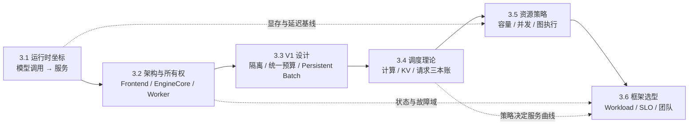

## 📑 本章导航
- [1. 本章为什么以 vLLM 为实例主线](#1-本章为什么以-vllm-为实例主线)
- [2. 从技术清单到有状态推理运行时](#2-从技术清单到有状态推理运行时)
- [3. 一张知识图看完本章](#3-一张知识图看完本章)
- [4. 贯穿六节的请求](#4-贯穿六节的请求)
- [5. 六节标题与承诺](#5-六节标题与承诺)
- [6. 阅读方法与版本边界](#6-阅读方法与版本边界)
- [7. 学完应具备的能力](#7-学完应具备的能力)
- [总结](#总结)
- [自我检验](#自我检验)
- [参考资料](#参考资料)
---

## 1. 本章为什么以 vLLM 为实例主线
第 1 章建立了 Prefill、Decode、KV Cache、TTFT、TPOT 与吞吐的基础账本。
第 2 章分别介绍了 PagedAttention、Continuous Batching、Prefix Cache、Chunked Prefill、统一 Token Budget 与图优化。
这些机制单独看都不难，真正困难的是让它们在同一个常驻服务里共享状态、资源和时间线。
vLLM 是本模块的实例主线，因为它把前两章的机制放进了一台可观察的真实运行时：
- 请求会跨越许多 Decode 轮次；
- KV 块要在请求、缓存和空闲池之间流转；
- Scheduler 每轮都要重新分配计算与存储预算；
- CPU 前后处理、GPU 执行与进程通信要尽量重叠；
- 在线接口还要处理排队、取消、流式返回与故障。
因此，本章不是一本命令手册，也不是按文件路径展开的源码百科。
本章借 vLLM 回答一个更稳定的问题：
> 一个模型调用，怎样被提升为能同时管理并发请求、显存状态、执行批次和服务承诺的有状态推理运行时？

## 2. 从技术清单到有状态推理运行时
“模型能生成文本”只证明一次数学计算可以完成。
“推理运行时能服务”还要求系统持续维护四类状态：
1. **请求状态**：谁已到达、谁在等待、谁正在推进、谁已完成或取消；
2. **资源状态**：权重、KV 块、临时工作区和执行槽位由谁占用；
3. **执行状态**：本轮 Batch 包含谁、每个请求推进多少 Token、使用何种执行路径；
4. **输出状态**：哪些 Token 已提交、哪些文本已返回、连接是否仍然有效。
这些状态互相耦合，却不能由多个组件同时随意改写。
本章会反复使用三个分析动作：
- 先找状态；
- 再找权威所有者；
- 最后看状态在哪个边界转换，以及失败后能否重建。
这套方法可以迁移到 SGLang、TensorRT-LLM 和其他推理系统。

## 3. 一张知识图看完本章



实线是建议学习顺序。
虚线表示后面仍会复用的约束：没有单请求账本就不能解释容量，没有状态所有权就不能解释故障，没有调度策略就不能公平比较框架。

## 4. 贯穿六节的请求
六节共同追踪下面这条请求：

```text
request_id：infra-guide-001
模型：一个采用 GQA 的 7B 指令模型
输入：1,536 token，其中前 1,024 token 是团队共享的 system/tool 前缀
输出上限：128 token
到达时刻：实例中已有两个请求处于 Decode
服务合同：TTFT P99 ≤ 300 ms，TPOT P99 ≤ 30 ms
可选约束：最终输出必须满足一个固定 JSON Schema
```

3.1 用它建立显存与延迟账本。
3.2 沿它观察协议对象、运行时请求、执行批次和输出事件的转换。
3.3 用它解释 V1 为什么减少 Host seam 与重复元数据工作。
3.4 用它观察 Running、Waiting、Chunked Prefill、重计算和结构约束。
3.5 用它判断上下文、并发、Token Budget 与图执行配置是否兑现 SLO。
3.6 再把同一请求合同交给三个候选框架，讨论怎样得到可比较结论。

## 5. 六节标题与承诺
### [3.1 vLLM 快速入门：从模型调用到推理运行时](/AIInfraGuide/inference/模块四-推理优化/第3章-深入vllm/vllm快速入门)
承诺：保留原稿的餐厅与包房直觉，但把重点从安装命令转向运行时边界；读者会建立离线 Engine、在线 Server、显存容量和端到端延迟的第一份账本。
### [3.2 vLLM 整体架构：状态、进程与请求旅程](/AIInfraGuide/inference/模块四-推理优化/第3章-深入vllm/32-vllm整体架构)
承诺：用 Frontend、EngineCore、Worker 三层地图解释控制面与数据面，沿一次请求确定状态所有权、IPC 边界、背压位置与故障域。
### [3.3 V1 引擎深度解析：从瓶颈到设计原则](/AIInfraGuide/inference/模块四-推理优化/第3章-深入vllm/33-v1引擎深度解析)
承诺：从 V0 暴露的结构性瓶颈推导多进程隔离、统一 Token Budget、Persistent Batch、Prefix Cache、编译与图执行，重点解释为什么这样设计以及付出什么代价。
### [3.4 调度器源码导读：三本账与迭代级决策](/AIInfraGuide/inference/模块四-推理优化/第3章-深入vllm/34-调度器源码导读)
承诺：不逐行复刻 `schedule()`，而是用计算 Token、KV 存储和请求状态三本账解释 Running/Waiting、Chunked Prefill、Preemption、Speculative Decoding 与 Structured Output。
### [3.5 关键配置调优：把参数还原为资源策略](/AIInfraGuide/inference/模块四-推理优化/第3章-深入vllm/35-关键配置调优)
承诺：围绕静态显存预算、上下文、并发、Token Budget、页粒度和 Graph/Eager 建立因果图，并区分启动 OOM、KV 容量不足与运行峰值 OOM。
### [3.6 框架横向对比：从绝对排名到条件化选型](/AIInfraGuide/inference/模块四-推理优化/第3章-深入vllm/36-框架横向对比)
承诺：先固定模型合同、Workload 和 SLO，再比较 vLLM、SGLang、TensorRT-LLM 解决的问题、状态组织方式、硬件边界和团队成本；结论只在实验条件内成立。

## 6. 阅读方法与版本边界
正文优先讲稳定抽象，组件名只用来把抽象映射到 vLLM。
vLLM 的默认值、内部类型、进程拓扑和优化组合会快速演进。
当某个版本被提到时，它只是一个可核对案例，不代表后续版本仍有相同路径或字段。
阅读源码时也建议从不变量出发：请求身份是否保持、资源由谁回收、计划何时提交、失败结果是否会污染下一轮。
第一次学习可按 3.1 → 3.6 顺序阅读。
已经熟悉命令但解释不了性能波动时，优先阅读 3.2、3.4、3.5。
准备做框架迁移时，先用 3.1 的账本和 3.6 的合同固定基线，再讨论功能差异。

## 7. 学完应具备的能力
- 能区分模型、Kernel、推理运行时与在线服务；
- 能沿请求生命周期指出状态的权威所有者；
- 能用计算、KV 和请求三本账解释一次调度决策；
- 能从 V0 的瓶颈推导 V1 的设计，而不是背特性名词；
- 能用带单位的容量与延迟估算检查配置是否合理；
- 能区分资源不足、策略取舍和实现故障；
- 能为固定 Workload 与 SLO 设计公平的框架比较；
- 能说明任何优化改善了哪一项成本，又把代价移到了哪里。

## 总结
第 3 章把前两章分散的优化机制接回同一台有状态运行时。
vLLM 提供实例坐标，真正要掌握的是“请求状态—资源预算—执行批次—输出合同”的闭环。
后续六节每次只增加一层复杂度，最终把“为什么快、为什么慢、为什么会失效、怎样公平选型”放进同一套分析框架。

## 自我检验
- [ ] 能解释为什么会调用模型不等于会管理在线推理。
- [ ] 能说出全章共同维护的四类状态。
- [ ] 能复述贯穿请求的输入、输出与 SLO。
- [ ] 能说明六节各自新增了哪一层抽象。
- [ ] 能解释为什么源码路径和默认值不能成为正文主线。
- [ ] 能用“问题 → 抽象 → 机制 → 账本 → 代价 → 对照”概括本章写法。

## 参考资料
- [vLLM 官方文档](https://docs.vllm.ai/en/stable/)
- [vLLM Architecture Overview](https://docs.vllm.ai/en/stable/design/arch_overview.html)
- [PagedAttention 论文](https://arxiv.org/abs/2309.06180)
- [第 2 章：推理引擎核心技术](/AIInfraGuide/inference/模块四-推理优化/第2章-推理引擎核心技术/第2章-推理引擎核心技术)
- [第 12 章：深入 SGLang](/AIInfraGuide/inference/模块四-推理优化/第12章-深入sglang/第12章-深入sglang)
> 本章中的公式和算例用于建立量纲；容量与性能结论必须回到目标模型、硬件、版本和真实 Workload 验证。
