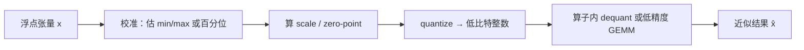
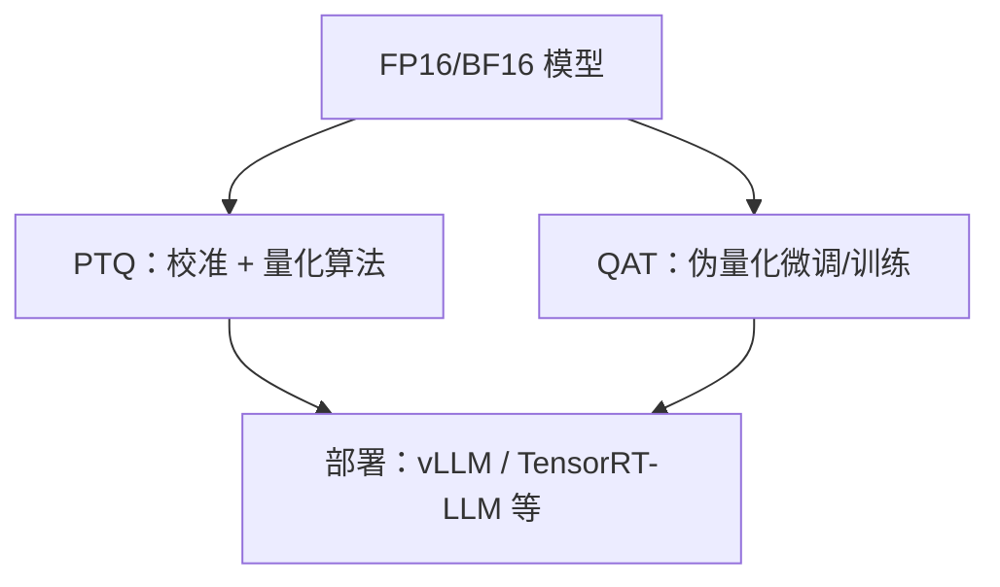

前三章把"怎么装下请求、怎么喂饱 GPU"讲清楚了——PagedAttention、Continuous Batching、调度与配置都在同一条显存/带宽账本上。从这一章起换一条杠杆：**用更少的比特表示同样的张量**。量化不是把模型"随便压扁"，而是在可接受误差内换取显存与吞吐。这一节先钉死地基：仿射映射、对称/非对称、粒度怎么选、PTQ 与 QAT 各自适合什么，并用一笔 **INT8 vs FP16** 的显存与带宽粗算把收益说成带单位的数。

<!-- more -->

## 📑 目录

- [1. 为什么要量化](#1-为什么要量化)
- [2. 仿射量化：从浮点到整数](#2-仿射量化从浮点到整数)
- [3. 对称 vs 非对称](#3-对称-vs-非对称)
- [4. 量化粒度：Tensor / Channel / Group](#4-量化粒度tensor--channel--group)
- [5. 手算：INT8 相对 FP16 省多少](#5-手算int8-相对-fp16-省多少)
- [6. PTQ vs QAT](#6-ptq-vs-qat)
- [7. 推理侧要盯的三件事](#7-推理侧要盯的三件事)
- [8. 代价与权衡](#8-代价与权衡)
- [总结](#-总结)
- [自我检验清单](#-自我检验清单)
- [参考资料](#-参考资料)

---

## 1. 为什么要量化

LLM 推理里，显存与带宽常常比"算力本身"更紧。以 BF16/FP16 存一份 70B 权重大约要 **140 GB** 量级（$70\times 10^9 \times 2\,\mathrm{B}$）；若权重压到 INT4，理论体积可降到约四分之一。KV Cache 若再做低精度存储，长上下文场景的显存压力也会缓和——那是 4.4 的主战场。

量化的本质不是"截断小数"，而是：**在可接受的误差范围内，用更少比特近似原始浮点分布，并尽量让硬件跑真正的低精度算子**。只压存储、算时再反量化回 FP16，省的是显存与权重读带宽；若权重与激活都能以低精度进入 Tensor Core，还能抬算术强度、提吞吐。

📌 **关键点**：量化收益来自两条通路——**更小的显存占用**与**更高的有效算力利用率**。选型时先问：你缺的是显存，还是 Decode 吞吐，还是长上下文的 KV？（决策树见 [4.6](./4.6-量化选型与vLLM实战.md)。）

---

## 2. 仿射量化：从浮点到整数

最常见的均匀量化可写成仿射映射。设浮点值 $x$，量化位数 $b$，则：

$$
x_q = \mathrm{clamp}\Big(\mathrm{round}\big(\frac{x}{s}\big) + z,\ q_{\min}, q_{\max}\Big),\quad
\hat{x} = s\cdot(x_q - z)
$$

其中：

- **scale $s$**：把浮点区间映射到整数网格的步长；
- **zero-point $z$**：决定"浮点 0"落在哪个整数格点上；
- **clamp / round**：保证落在合法整数范围，并完成离散化。

误差来自两部分：**舍入误差**（round）和**钳制误差**（超出校准范围被夹到边界）。若分布里有极端离群点，为了兜住它们而把 $s$ 拉得很大，大多数正常值就会挤在少数几个整数格点上——这正是后文 Activation Outlier、SmoothQuant（[4.2](./4.2-W8A8-SmoothQuant.md)）要对付的问题。

🔑 **核心概念**：**量化 = 选范围 + 选步长 + 离散化**。算法差异往往不在公式本身，而在"范围怎么估、按什么粒度估、误差怎么补偿"。

---

## 3. 对称 vs 非对称

### 3.1 对称量化（Symmetric）

对称量化通常令 $z=0$，正负半轴共用同一套 scale。实现简单，和有符号 INT8 乘加更合拍，很多权重量化默认走这条路。

代价是：若真实分布严重偏斜（大量值挤在正半轴、负半轴几乎空着），对称网格会浪费一半动态范围。

### 3.2 非对称量化（Asymmetric）

非对称量化显式引入 zero-point，让整数 0 对应浮点真实的零点附近，从而更好贴合偏斜分布。激活值有时更吃这一套。

| 📊 维度 | 对称 | 非对称 |
|---|---|---|
| zero-point | 通常为 0 | 可非零 |
| 实现复杂度 | 低 | 稍高（要处理 $z$） |
| 偏斜分布 | 可能浪费动态范围 | 更贴合 |
| 权重常见选择 | ✅ 常用 | 视格式而定 |
| 激活常见选择 | 也常见（为 Kernel 简单） | 精度敏感时更有用 |

💡 **提示**：工程上"对称/非对称"往往还受 **Kernel 支持**约束。即使非对称理论上更准，若高性能 Kernel 只高效支持对称 INT8/INT4，实战仍可能选对称。

⚠️ **注意**：不要把"有无 zero-point"和"有无 per-channel scale"混为一谈——前者是映射形态，后者是粒度。

---

## 4. 量化粒度：Tensor / Channel / Group

同一套仿射公式，**共享 scale 的范围**不同，精度与开销就不同。

### 4.1 Per-tensor

整个张量共用一组 $(s,z)$。开销最小，但被少数极大值绑架时，误差扩散到全张量。

### 4.2 Per-channel（或 Per-token）

沿某个轴（权重常按输出通道；激活有时按 token）各自一套 scale。动态范围适配更好，是 W8A8 / INT8 权重里非常常见的折中。

### 4.3 Per-group

把通道再切成固定大小的 group（如 64/128），每组一个 scale。INT4 weight-only（GPTQ/AWQ，见 [4.3](./4.3-Weight-only-INT4.md)）几乎标配 group-wise：比特越少，越需要更细的局部尺度来保住精度。

| 粒度 | 精度潜力 | 元数据开销 | 典型用途 |
|---|---|---|---|
| Per-tensor | 低 | 极小 | 粗暴基线、部分激活 |
| Per-channel | 中 | 小 | INT8 权重、部分 W8A8 |
| Per-group | 高 | 随 group 变小而升 | INT4/INT3 权重 |

📌 **关键点**：**比特越低，越要靠更细粒度的 scale（以及更好的校准/补偿算法）把误差按住。** 4-bit 不是把 8-bit 的 scale 原样搬过去就完事。

---

## 5. 手算：INT8 相对 FP16 省多少

把"省一半比特"说成可核对的数。以下为**数量级估算**，不计碎片、工作区与引擎开销。

### 5.1 权重显存

设参数量 $N = 7\times 10^9$（约 7B）：

| 精度 | 每参数 | 权重体积 |
|---|---|---|
| FP16/BF16 | 2 B | $7\times 10^9 \times 2 = 14\,\mathrm{GB}$ |
| INT8 | 1 B | $7\,\mathrm{GB}$（另加 per-channel scale，通常 $\ll 1\%$） |
| INT4（打包后约 0.5 B） | ~0.5 B | ~$3.5\,\mathrm{GB}$（另加 group scale） |

粗结论：**同模型 INT8 权重相对 FP16 约省一半显存；INT4 再砍约一半**（相对 FP16 约 1/4）。省下的空间若交给 KV 块池（见 [2.1](../第2章-推理引擎核心技术/2.1-PagedAttention.md)），才能在 Continuous Batching 下变成更高并发。

### 5.2 权重读带宽（Decode 直觉）

Decode 往往 Memory Bound（第 1–2 章结论）。极端简化：每生成 1 个 Token，若近似要把整份权重扫过一遍（真实有层融合/缓存，这里只为数量级）：

| 精度 | 每 Token 权重流量（7B） | 相对 FP16 |
|---|---|---|
| FP16 | ~14 GB | 1× |
| INT8 | ~7 GB | ~0.5× |
| INT4 | ~3.5 GB | ~0.25× |

取舍句：在**权重读取是瓶颈**的 Decode 上，INT8/INT4 的带宽账可以很漂亮；但若瓶颈已转到 **KV 读取**或 **未命中低精度 Kernel**（仍 dequant 回 FP16 再算），墙钟加速会远小于纸面比特比——这正是后文要反复核对"Kernel 是否命中"的原因。

💡 **提示**：上表是**上界直觉**，不是你机器上的 tok/s。真实吞吐还受 batch、Kernel、激活/KV 流量与调度约束；验收方法见 4.6。

---

## 6. PTQ vs QAT

### 6.1 PTQ：训练后量化

**Post-Training Quantization（PTQ）**在已有浮点模型上校准并量化，通常只需一小份校准数据（几百到几千条），无需完整重训。GPTQ、AWQ、SmoothQuant、许多 FP8 checkpoint 流程都属于这一族。

优点：落地快、成本低、和开源权重生态契合。  
缺点：对敏感层/极端分布更脆弱；若直接 W8A8 撞上 Activation Outlier，精度可能塌方。

### 6.2 QAT：量化感知训练

**Quantization-Aware Training（QAT）**在训练或微调图里插入伪量化节点，让权重"提前适应"量化噪声。精度上限通常更高，尤其在更低比特或对质量极严的场景。

代价是：要训练流水线、数据与算力；对多数"拿开源权重直接部署"的推理团队来说，PTQ 仍是主路径。

🔑 **核心概念**：推理工程默认先问 **"PTQ 能否达标"**；只有 PTQ 卡精度时，再评估是否值得上 QAT 或混合精度（敏感层回退高比特）。

---

## 7. 推理侧要盯的三件事

把基础概念落到服务系统，始终盯这三件事：

1. **误差落在哪**：权重、激活、KV Cache 三者对质量与吞吐的敏感度不同。Weight-only 往往最容易先做；激活与 KV 更挑算法与硬件。
2. **算子是否真的低精度执行**：若格式只有"压缩存储 + FP16 计算"，收益主要在显存与权重带宽；若有 FP8/INT8 Tensor Core 或 Marlin 一类 Kernel，才谈得上算力侧加速。
3. **服务形态是否兼容**：Continuous Batching、Prefix Cache、多 LoRA、投机解码等特性，对不同量化后端的支持成熟度并不一致——[4.6](./4.6-量化选型与vLLM实战.md) 会做选型决策树。

💡 **提示**：评估量化别只看困惑度（PPL）。线上应同时看 **任务指标**（准确率/胜率）、**坏例抽检**，以及 **TTFT / TPOT / 吞吐** 是否相对 **同一 FP16/BF16 基线、同一负载** 真的变好。

---

## 8. 代价与权衡

| 选择 | 收益 | 代价 / 不适用 |
|---|---|---|
| 更低比特 | 显存与读带宽下降 | 精度风险上升；对校准与粒度更敏感 |
| 更细粒度 scale | 精度更好 | 元数据与 Kernel 复杂度上升 |
| 非对称 + zero-point | 贴合偏斜分布 | 部分高性能 Kernel 支持弱 |
| PTQ | 快、便宜 | 极端分布/敏感任务可能不过线 |
| QAT | 精度上限更高 | 训练成本高，多数推理团队非首选 |
| 只压存储、不算低精度 | 仍可装下更大模型 | 吞吐增益可能远小于比特比 |

适用：显存装不下、Decode 权重带宽吃紧、或准备进入 W8A8/INT4/FP8/KV 专项之前的概念底座。  
若模型已极小、上下文极短、GPU 算力闲置，量化的边际收益薄，却引入数值与兼容性风险——不必为优化清单而量化。

---

## 📝 总结

- 均匀量化通过 scale（与可选 zero-point）把浮点映射到低比特网格；误差来自舍入与钳制。
- 对称实现简单；非对称更贴合偏斜分布，但受 Kernel 约束。
- Per-tensor / Per-channel / Per-group 是精度与元数据开销的主权衡；低比特几乎必然更细粒度。
- 7B 量级粗算：INT8 权重相对 FP16 约省一半显存与权重读流量；是否变成 tok/s，取决于瓶颈与 Kernel。
- PTQ 是推理部署主流入口；QAT 换更高精度上限，成本显著更高。

## 🎯 自我检验清单

- 能写出仿射量化的 $x_q$ / $\hat{x}$ 公式，并解释 $s$ 与 $z$ 的含义
- 能说明对称与非对称各自的适用动机与代价
- 能对比 Per-tensor、Per-channel、Per-group 的精度/开销差异
- 能对 7B 模型手算 FP16 vs INT8 的权重显存（带 GB 单位）
- 能解释为何"比特减半"不等于"吞吐翻倍"
- 能说清 PTQ 与 QAT 的流程差异，以及为何推理侧常先选 PTQ
- 能区分"只压缩存储"与"低精度计算"两种收益路径

## 📚 参考资料

- [Gholami et al., A Survey of Quantization Methods for Efficient Neural Network Inference](https://arxiv.org/abs/2103.13630)
- [Nagel et al., A White Paper on Neural Network Quantization](https://arxiv.org/abs/2106.08295)
- [vLLM — Quantization](https://docs.vllm.ai/en/latest/features/quantization/)
- [Hugging Face — Quantization Concepts](https://huggingface.co/docs/transformers/main/en/quantization/overview)
