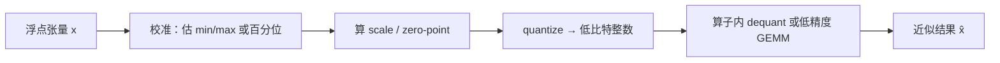
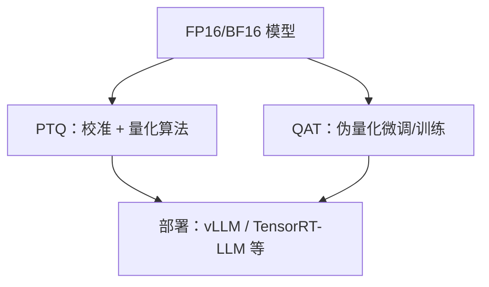

前三章把"怎么装下请求、怎么喂饱 GPU"讲清楚了；从这一章开始，我们转向另一条主线——**用更少的比特表示同样的张量**。量化是推理优化里"用精度换吞吐与显存"的核心杠杆。这一节先把地基打牢：量化在数学上是什么、对称/非对称差在哪、粒度怎么选、训练后量化（PTQ）和量化感知训练（QAT）各自适合什么场景。

<!-- more -->

## 📑 目录

- [1. 为什么要量化](#1-为什么要量化)
- [2. 仿射量化：从浮点到整数](#2-仿射量化从浮点到整数)
- [3. 对称 vs 非对称](#3-对称-vs-非对称)
- [4. 量化粒度：Tensor / Channel / Group](#4-量化粒度tensor--channel--group)
- [5. PTQ vs QAT](#5-ptq-vs-qat)
- [6. 推理侧要盯的三件事](#6-推理侧要盯的三件事)
- [总结](#-总结)
- [自我检验清单](#-自我检验清单)
- [参考资料](#-参考资料)

---

## 1. 为什么要量化

LLM 推理里，显存与带宽常常比"算力本身"更紧。以 BF16/FP16 存一份 70B 权重大约要 140GB 量级；若权重压到 INT4，理论体积可降到约四分之一，KV Cache 若再做低精度存储，长上下文场景的显存压力也会明显缓和。

量化的本质不是"随便截断小数"，而是：**在可接受的误差范围内，用更少比特近似原始浮点分布，并尽量让硬件能跑真正的低精度算子**。只压存储、算时再反量化回 FP16，省的是显存；若权重与激活都能以低精度进入 Tensor Core / 专用 Kernel，还能抬算术强度、提吞吐。

📌 **关键点**：量化收益来自两条通路——**更小的显存占用**与**更高的有效算力利用率**。选型时要先问清楚：你缺的是显存，还是 Decode 吞吐，还是长上下文的 KV？

---

## 2. 仿射量化：从浮点到整数

最常见的均匀量化可写成仿射映射。设浮点值 $x$，量化位数 $b$，整数网格为 $\{0,1,\ldots,2^b-1\}$（或对称情形下的有符号整数），则：

$$
x_q = \mathrm{clamp}\Big(\mathrm{round}\big(\frac{x}{s}\big) + z,\ q_{\min}, q_{\max}\Big),\quad
\hat{x} = s\cdot(x_q - z)
$$

其中：

- **scale $s$**：把浮点区间映射到整数网格的步长；
- **zero-point $z$**：决定"浮点 0"落在哪个整数格点上；
- **clamp / round**：保证落在合法整数范围，并完成离散化。

误差来自两部分：**舍入误差**（round）和**钳制误差**（超出校准范围被夹到边界）。若分布里有极端离群点，为了兜住它们而把 $s$ 拉得很大，大多数正常值就会挤在少数几个整数格点上——这正是后文 Activation Outlier、SmoothQuant 要对付的问题。

🔑 **核心概念**：**量化 = 选范围 + 选步长 + 离散化**。算法差异往往不在公式本身，而在"范围怎么估、按什么粒度估、误差怎么补偿"。

---

## 3. 对称 vs 非对称

### 3.1 对称量化（Symmetric）

对称量化通常令 $z=0$，正负半轴共用同一套 scale。实现简单，和有符号 INT8 乘加更合拍，很多权重量化默认走这条路。

代价是：若真实分布严重偏斜（大量值挤在正半轴、负半轴几乎空着），对称网格会浪费一半动态范围。

### 3.2 非对称量化（Asymmetric）

非对称量化显式引入 zero-point，让整数 0 对应浮点真实的零点附近，从而更好贴合偏斜分布。激活值（尤其 ReLU 类后续、或某些归一化后的中间结果）有时更吃这一套。

| 📊 维度 | 对称 | 非对称 |
|---|---|---|
| zero-point | 通常为 0 | 可非零 |
| 实现复杂度 | 低 | 稍高（要处理 $z$） |
| 偏斜分布 | 可能浪费动态范围 | 更贴合 |
| 权重常见选择 | ✅ 常用 | 视格式而定 |
| 激活常见选择 | 也常见（为 Kernel 简单） | 精度敏感时更有用 |

💡 **提示**：工程上"对称/非对称"往往还受 **Kernel 支持**约束。即使非对称理论上更准，若高性能 Kernel 只高效支持对称 INT8/INT4，实战仍可能选对称。

⚠️ **注意**：不要把"有无 zero-point"和"有无 per-channel scale"混为一谈——前者是映射形态，后者是粒度。

---

## 4. 量化粒度：Tensor / Channel / Group

同一套仿射公式，**共享 scale 的范围**不同，精度与开销就不同。

### 4.1 Per-tensor

整个张量共用一组 $(s,z)$。开销最小，但被少数极大值绑架时，误差扩散到全张量。

### 4.2 Per-channel（或 Per-token）

沿某个轴（权重常按输出通道；激活有时按 token）各自一套 scale。动态范围适配更好，是 W8A8 / INT8 权重里非常常见的折中。

### 4.3 Per-group

把通道再切成固定大小的 group（如 64/128），每组一个 scale。INT4 weight-only（GPTQ/AWQ）几乎标配 group-wise：比特越少，越需要更细的局部尺度来保住精度。

| 粒度 | 精度潜力 | 元数据开销 | 典型用途 |
|---|---|---|---|
| Per-tensor | 低 | 极小 | 粗暴基线、部分激活 |
| Per-channel | 中 | 小 | INT8 权重、部分 W8A8 |
| Per-group | 高 | 随 group 变小而升 | INT4/INT3 权重 |

📌 **关键点**：**比特越低，越要靠更细粒度的 scale（以及更好的校准/补偿算法）把误差按住。** 4-bit 不是把 8-bit 的 scale 原样搬过去就完事。

---

## 5. PTQ vs QAT

### 5.1 PTQ：训练后量化

**Post-Training Quantization（PTQ）**在已有浮点模型上校准并量化，通常只需一小份校准数据（几百到几千条），无需完整重训。GPTQ、AWQ、SmoothQuant、许多 FP8 checkpoint 流程都属于这一族。

优点：落地快、成本低、和开源权重生态契合。  
缺点：对敏感层/极端分布更脆弱；若直接 W8A8 撞上 Activation Outlier，精度可能塌方。

### 5.2 QAT：量化感知训练

**Quantization-Aware Training（QAT）**在训练或微调图里插入伪量化节点，让权重"提前适应"量化噪声。精度上限通常更高，尤其在更低比特或对质量极严的场景。

代价是：要训练流水线、数据与算力；对多数"拿开源权重直接部署"的推理团队来说，PTQ 仍是主路径。

🔑 **核心概念**：推理工程默认先问 **"PTQ 能否达标"**；只有 PTQ 卡精度时，再评估是否值得上 QAT 或混合精度（敏感层回退高比特）。

---

## 6. 推理侧要盯的三件事

把基础概念落到服务系统，建议始终盯这三件事：

1. **误差落在哪**：权重、激活、KV Cache 三者对质量与吞吐的敏感度不同。Weight-only 往往最容易先做；激活与 KV 更挑算法与硬件。
2. **算子是否真的低精度执行**：若格式只有"压缩存储 + FP16 计算"，收益主要在显存与权重带宽；若有 FP8/INT8 Tensor Core 或 Marlin 一类 Kernel，才谈得上算力侧加速。
3. **服务形态是否兼容**：Continuous Batching、Prefix Cache、多 LoRA、投机解码等特性，对不同量化后端的支持成熟度并不一致——第 4.6 节会专门做选型决策树。

💡 **提示**：评估量化别只看困惑度（PPL）。线上应同时看 **任务指标**（准确率/胜率）、**坏例抽检**，以及 **TTFT / TPOT / 吞吐** 是否真的变好。

---

## 📝 总结

- 均匀量化通过 scale（与可选 zero-point）把浮点映射到低比特整数网格；误差来自舍入与钳制。
- 对称实现简单、偏斜分布可能浪费动态范围；非对称用 zero-point 更好贴合偏斜，但受 Kernel 支持约束。
- Per-tensor / Per-channel / Per-group 是精度与元数据开销的主权衡；低比特几乎必然走向更细粒度。
- PTQ 是推理部署的主流入口；QAT 换更高精度上限，但成本显著更高。
- 工程上要同时问：省的是显存还是算力、Kernel 是否吃满、与服务特性是否兼容。

## 🎯 自我检验清单

- 能写出仿射量化的 $x_q$ / $\hat{x}$ 公式，并解释 $s$ 与 $z$ 的含义
- 能说明对称与非对称各自的适用动机与代价
- 能对比 Per-tensor、Per-channel、Per-group 的精度/开销差异
- 能说清 PTQ 与 QAT 的流程差异，以及为何推理侧常先选 PTQ
- 能区分"只压缩存储"与"低精度计算"两种收益路径
- 能举出权重、激活、KV Cache 量化各自更常解决什么瓶颈

## 📚 参考资料

- [Gholami et al., A Survey of Quantization Methods for Efficient Neural Network Inference](https://arxiv.org/abs/2103.13630)
- [Nagel et al., A White Paper on Neural Network Quantization](https://arxiv.org/abs/2106.08295)
- [vLLM — Quantization](https://docs.vllm.ai/en/latest/features/quantization/)
- [Hugging Face — Quantization Concepts](https://huggingface.co/docs/transformers/main/en/quantization/overview)
