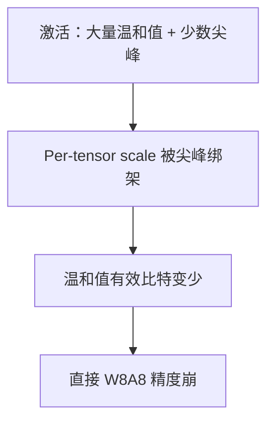

[4.1](./4.1-量化基础.md) 把仿射量化与粒度讲清之后，下一步会撞上一个不对称事实：LLM 上"权重 INT8 还行，激活 INT8 却经常翻车"。根因几乎总是 **Activation Outlier（激活离群点）**——少数通道把 scale 绑架，多数正常值有效比特被挤没。这一节聚焦 W8A8（权重与激活皆 8-bit）路线，把 SmoothQuant 的核心把戏钉死：用一层数学等价变换，把量化难度从激活挪到更耐受的权重，并说清**迁移为何有效、数字直觉、适用边界**。

<!-- more -->

## 📑 目录

- [1. W8A8 想解决什么](#1-w8a8-想解决什么)
- [2. Activation Outlier：数字直觉](#2-activation-outlier数字直觉)
- [3. SmoothQuant：等价变换](#3-smoothquant等价变换)
- [4. 为何"迁移难度"有效](#4-为何迁移难度有效)
- [5. 迁移强度与精度权衡](#5-迁移强度与精度权衡)
- [6. 和其它 W8A8 思路的关系](#6-和其它-w8a8-思路的关系)
- [7. 在推理引擎里怎么落地](#7-在推理引擎里怎么落地)
- [8. 校准与评测的最小闭环](#8-校准与评测的最小闭环)
- [9. 权衡与适用边界](#9-权衡与适用边界)
- [总结](#-总结)
- [自我检验清单](#-自我检验清单)
- [参考资料](#-参考资料)

---

## 1. W8A8 想解决什么

**Weight-only**（见 [4.3](./4.3-Weight-only-INT4.md)）主要砍权重体积与权重带宽；矩阵乘时激活仍常以 FP16/BF16 参与，算力侧加速有限。**W8A8** 则希望权重与激活都以 INT8（或 FP8，见 [4.5](./4.5-FP8与NVFP4.md)）进入 GEMM，从而：

- 降低激活写回/读取带宽；
- 吃到 INT8 Tensor Core 的更高吞吐（在硬件支持的前提下）；
- 在显存紧张但不想掉到 4-bit 时，给出相对更稳的折中。

代价是：激活动态、随输入变化，校准与在线量化都比静态权重难得多。

📌 **关键点**：W8A8 的卖点是**计算侧加速 + 适度省显存**；它不是 INT4 那种"极致压权重"路线，而是更偏向吞吐与硬件利用率。

---

## 2. Activation Outlier：数字直觉

Transformer 里不少层的激活会出现：绝大多数通道数值温和，少数通道却冒出幅度极大的尖峰。用一个**教学数量级**建立直觉（非某模型实测断言）：

| 量 | 温和通道（多数） | 离群通道（少数） |
|---|---|---|
| 典型幅度 $|x|$ | ~1–10 | ~100–1000+（可再高） |
| 若共用一个 Per-tensor scale | scale 必须按最大值定 | 正常值被挤进极少整数格点 |

设 INT8 有效格点大约 $\pm 127$。若 $\max|x|=1000$，则 $s \approx 1000/127 \approx 7.9$；幅度为 5 的"正常"激活量化后只剩 $\mathrm{round}(5/7.9)\approx 1$ 档——**有效分辨率从百级格点塌成个位数**。深层一累积，困惑度与任务指标就会明显恶化。

权重侧相对"好说话"：权值静态，可离线用 Per-channel / 补偿算法精细处理。于是出现经典不对称——**同样 8-bit，权重量化容易，激活量化难**。



⚠️ **注意**：Outlier 往往具有**通道结构性**——某些 channel 持续更大，而非纯随机尖峰。SmoothQuant 正是利用了这种结构性：按通道缩放，而不是对整张量一刀切。

---

## 3. SmoothQuant：等价变换

SmoothQuant 的出发点很干净：线性层 $Y = XW$。插入对角缩放 $s$（按通道）后：

$$
Y = XW = (X\,\mathrm{diag}(s)^{-1})\cdot(\mathrm{diag}(s)\,W)
$$

对激活按通道**除以** $s$，对权重对应通道**乘以** $s$，数学结果不变（忽略后续非线性时，需把缩放融进相邻线性层；论文给出了系统性做法）。

效果是：

- 激活上原先特别大的通道被压下去 → 激活动态范围更平滑，更适合 INT8；
- 权重对应通道变大一些 → 权重量化稍难，但权重本就更耐受、可用 Per-channel 消化。

🔑 **核心概念**：**SmoothQuant = 把量化难度从 Activation 迁移到 Weight 的等价重参数化。** 它不创造信息，只是重新分配"谁更难量化"。

用类比：原来激活像"一筐苹果里混了几个西瓜"，一把秤（一个 scale）没法同时量准；SmoothQuant 先按通道把西瓜"缩小标签"、把对应权重"放大标签"，箱子变得均匀，激活这把秤就好用了。

| 步骤 | 对激活 $X$ | 对权重 $W$ | 目的 |
|---|---|---|---|
| 估通道迁移强度 | 观察通道最大幅度等统计量 | — | 找出难通道 |
| 应用 $\mathrm{diag}(s)^{-1}$ | 难通道被缩小 | — | 平滑激活 |
| 应用 $\mathrm{diag}(s)$ | — | 对应通道放大 | 保持 $XW$ 等价 |
| 再做 INT8 量化 | 更易 Per-tensor/Per-token | 仍可用 Per-channel | W8A8 可落地 |

---

## 4. 为何"迁移难度"有效

为什么把难度挪到权重就行，而不是"两边一起更难"？

1. **权重静态、可 Per-channel**：每个输出通道可以有自己的 scale；某个通道被放大后，它的 scale 跟着变大，其它通道不受绑架。
2. **激活曾被迫共享粗 scale**：Per-tensor（或过粗的）激活量化里，一个离群通道毁掉整段激活的有效比特——这是主要矛盾。
3. **误差预算不对称**：层输出对"权重多承担一点量化噪声"往往比"激活有效比特被掏空"更耐受——SmoothQuant 论文用校准实验支撑这一观察；你方仍须用业务集复核。

接上一节数字：若离群通道幅度 1000、温和通道 5，取迁移因子使该通道激活缩小 10×（示意），则激活动态范围从 ~1000 收到 ~100 量级，$s$ 大约降一个数量级，温和值从"只剩 1 档"回到十余档——**激活可量化性显著改善**；对应权重通道变大，交给 Per-channel INT8 消化。

取舍句：SmoothQuant 有效，是因为它把"激活侧被一个 scale 绑架"这个**结构性缺陷**，换成"权重侧多吃一点、但可用每通道 scale 吸收"的**可解问题**；不是魔术地消灭了量化误差。

---

## 5. 迁移强度与精度权衡

迁移不是越猛越好。论文用超参（常记为 $\alpha$）控制"难度搬多少"：

- $\alpha$ 偏大：更照顾激活平滑，权重更吃亏；
- $\alpha$ 偏小：激活仍可能残留 outlier，权重更轻松。

实务上需要在校准集上扫一小段，看 PPL / 下游任务，而不是死记某一个魔法值。不同模型族（LLaMA、Qwen 等）最优点可能不同；有的层比其它层更敏感，也可做层间混合策略。

💡 **提示**：SmoothQuant 解决的是**激活范围可量化**问题，并不自动保证端到端生成质量。部署前仍要用真实业务 Prompt 做对照，尤其是长上下文与工具调用场景。

---

## 6. 和其它 W8A8 思路的关系

W8A8 不是只有 SmoothQuant 一条路：

- **Outlier 专用通道保留高比特**：少数难通道留 FP16，其余走 INT8（实现更复杂）。
- **更细粒度激活量化**：Per-token、甚至 group-wise 激活 scale，降低"被绑架"程度。
- **FP8 W8A8 风格**：用 E4M3 等格式代替 INT8，动态范围更大，Hopper/Blackwell 上更自然（见 [4.5](./4.5-FP8与NVFP4.md)）。

可以把 SmoothQuant 理解成：在坚持"激活也走低比特整数"的前提下，用最小侵入的重参数化换来可用精度。

📌 **关键点**：若硬件原生更吃 FP8，可能不必在 INT8+SmoothQuant 上死磕；但理解 SmoothQuant，有助于读懂"为什么激活比权难度"这一普遍规律。

---

## 7. 在推理引擎里怎么落地

在 vLLM 等引擎中，W8A8/INT8 路径通常表现为：

1. 使用已经过 SmoothQuant（或同类算法）处理好的量化 checkpoint；或
2. 通过量化工具链离线生成 compressed-tensors / 其它受支持格式；
3. 服务启动时指定对应 `quantization` 后端，确保 GEMM 走 INT8 Kernel。

示意（**非逐字 API**；参数名随版本演进，以当前文档与 `vllm serve --help` 为准）：

```python
from vllm import LLM

llm = LLM(
    model="your-org/llama3-8b-smoothquant-w8a8",
    quantization="compressed-tensors",  # 或其它受支持的 INT8 格式名
    dtype="auto",
)
```

落地检查清单：

- 校准数据是否覆盖业务域（代码、中文对话、RAG 上下文等）；
- 是否真的命中 INT8/FP8 Kernel（看日志与 profiling，而不是只看模型体积）；
- 与 Prefix Cache、CUDA Graph、多 LoRA 的组合是否在你用的版本里成熟。

⚠️ **注意**：社区里"标称 W8A8"的权重质量参差不齐。换引擎部署时，务必用同一套评测集对比 FP16/BF16 基线，避免把量化误差误当成提示词或采样问题。

---

## 8. 校准与评测的最小闭环

SmoothQuant 再优雅，也救不了"校准域错位"。最小闭环建议固定为四步：

1. **收集校准集**：从线上日志抽样，覆盖长/短 Prompt、工具调用、多语言；规模不必大，代表性比条数重要。
2. **扫迁移强度**：对 $\alpha$（或工具链等价超参）做小网格搜索，记录 PPL 与 1–2 个业务指标。
3. **看层间敏感度**：若某几层特别脆弱，允许它们回退到更高精度（混合精度），而不是全局放弃 W8A8。
4. **上线对照**：同一流量切片对比 FP16 vs W8A8 的 TTFT、TPOT、吞吐与坏例率。

| 校准集问题 | 可能后果 |
|---|---|
| 只有英文短对话 | 中文长上下文/代码任务掉点 |
| 全是干净百科 | 工具 JSON、脏输入上崩 |
| 与线上模板不一致 | 系统提示相关层误差被放大 |

📌 **关键点**：SmoothQuant 解决的是**可量化性**；校准集解决的是**可迁移性**。两者缺一，W8A8 都很难在生产站稳。

---

## 9. 权衡与适用边界

| 场景 | 更适合 W8A8/SmoothQuant？ | 原因 |
|---|---|---|
| 有 INT8 Tensor Core，要抬 Decode/混批吞吐 | ✅ 优先评估 | 计算侧收益是卖点 |
| 只有权重装不下，激活算力不是瓶颈 | ⚠️ 次选 | INT4 weight-only 往往更直接 |
| 已有 Hopper + 成熟 FP8 栈 | ⚠️ 常被 FP8 替代 | 动态范围与工具链可能更省心 |
| 激活 outlier 极强且校准扫 $\alpha$ 仍不过线 | ❌ 谨慎 | 考虑混合精度、保留高比特通道或换 FP8 |
| 强依赖未验证的多 LoRA / 投机解码组合 | ❌ 先查兼容矩阵 | 精度过线也可能工程上不可用 |

适用：需要吃满 INT8 计算、能投入校准与业务回归的团队。  
不适用：把 W8A8 当成"比 INT4 全面更优"的默认——没有硬件与 Kernel 前提时，你可能只得到一份更难运维的 checkpoint，却吃不到吞吐。

---

## 📝 总结

- W8A8 追求激活与权重共同低比特计算，从而同时改善带宽与算力利用率。
- Activation Outlier 会绑架激活 scale；教学数量级上，温和值可能从百级格点塌成个位数。
- SmoothQuant 通过 $XW=(Xs^{-1})(sW)$ 把难度迁到权重；有效是因为权重可 Per-channel 吸收，而激活曾被粗 scale 绑架。
- 迁移强度 $\alpha$ 要校准权衡；校准域错位会直接毁掉可迁移性。
- 有 Hopper FP8 栈时不必死磕 INT8；上线必须验证 Kernel 命中与业务指标。

## 🎯 自我检验清单

- 能解释为何 LLM 上激活 INT8 往往比权重 INT8 更难
- 能用"scale 被最大值绑架 → 温和值有效格点变少"讲清 outlier 的数字直觉
- 能写出 SmoothQuant 的等价变换并说明 $s$ 的作用方向
- 能说明为何把难度迁到权重通常比硬量化激活更划算
- 能举例其它缓解 Activation Outlier 的思路（保留高比特通道、更细粒度、FP8）
- 能列出 W8A8 上线前应检查的三项：校准域、Kernel 命中、业务评测
- 能说出至少两种不该优先上 W8A8 的场景

## 📚 参考资料

- [Xiao et al., SmoothQuant: Accurate and Efficient Post-Training Quantization for Large Language Models](https://arxiv.org/abs/2211.10438)
- [SmoothQuant GitHub](https://github.com/mit-han-lab/smoothquant)
- [vLLM — Quantization](https://docs.vllm.ai/en/latest/features/quantization/)
- [LLM.int8()（Outlier 通道思想的代表性工作）](https://arxiv.org/abs/2208.07339)
