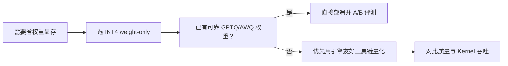

W8A8 侧重"让计算也低比特"；但很多部署现场的第一痛点其实是——**权重大、显存装不下，或同卡并发被权重挤占**。这时 Weight-only INT4 往往是性价比最高的第一刀：激活仍用 FP16/BF16，权重以 4-bit 存储（常配 group-wise scale），在可接受的质量损失下把模型体积砍到大约四分之一。这一节对比 GPTQ 与 AWQ，并补上常被忽略的一环：Marlin 一类 Kernel 如何把"压得下"变成"跑得快"。

<!-- more -->

## 📑 目录

- [1. Weight-only INT4 的定位](#1-weight-only-int4-的定位)
- [2. GPTQ：用二阶信息做逐层补偿](#2-gptq用二阶信息做逐层补偿)
- [3. AWQ：保护对激活重要的权重](#3-awq保护对激活重要的权重)
- [4. GPTQ vs AWQ：怎么选](#4-gptq-vs-awq怎么选)
- [5. Marlin Kernel：把 4-bit 变成吞吐](#5-marlin-kernel把-4-bit-变成吞吐)
- [6. vLLM 中的使用要点](#6-vllm-中的使用要点)
- [7. Group Size、打包格式与质量回退](#7-group-size打包格式与质量回退)
- [总结](#-总结)
- [自我检验清单](#-自我检验清单)
- [参考资料](#-参考资料)

---

## 1. Weight-only INT4 的定位

Weight-only 的计算图大致是：

1. 从显存读取打包的 INT4 权重与 group scale；
2. 在 Kernel 内反量化（或融合乘加）到较高精度；
3. 与 FP16/BF16 激活做矩阵乘。

因此：

- ✅ **强项**：显著降低权重显存与权重带宽，70B 级模型更容易塞进单卡/更少卡；
- ⚠️ **边界**：激活与 KV 仍占大头时，单靠 INT4 权重救不了长上下文；Decode 若已是 Memory Bound，减权重流量通常有助 TPOT，但别指望达到 W8A8/FP8 那种"算力规格跃迁"。

📌 **关键点**：INT4 weight-only 首先是**容量与权重带宽**武器；是否"更快"取决于 Kernel 质量与瓶颈是否在权重读取。

---

## 2. GPTQ：用二阶信息做逐层补偿

**GPTQ**（Generative Pre-trained Transformer Quantization）属于精确的 PTQ 路线。它逐层处理：在校准数据上估计该层输入的二阶统计（Hessian 相关信息），按块把权重量化到低比特，并在量化一部分权重后，对其余权重做补偿更新，尽量减小层输出误差。

直觉上：不是"每个权重点各自 round 完事"，而是问——**我把这个权重钉死后，怎样调整还没量化的权重，才能让层输出仍接近原浮点？**

常见配置：

- 4-bit 权重 + group size 128（也有 32/64）；
- 可带描述符/元数据以便引擎加载；
- 校准集规模通常远小于训练，但领域覆盖仍然重要。

🔑 **核心概念**：**GPTQ = 逐层、基于二阶信息的误差补偿式权重量化。** 它把"量化误差"当成可在层内消化的优化问题。

---

## 3. AWQ：保护对激活重要的权重

**AWQ**（Activation-aware Weight Quantization）换了一条更"激活中心"的思路：并非所有权重同等重要——**那些经常与大幅度激活相乘的权重通道，对输出误差更关键**。AWQ 通过激活统计找出显著通道，对其权重做缩放保护，再量化，从而在极低比特下保住精度。

与 GPTQ 相比，AWQ 往往：

- 校准流程更轻、更好并行；
- 对"哪些权重不能伤害"有更直观的解释；
- 与后续 Kernel（含 fused dequant GEMM）生态结合紧密，社区 INT4 权重里非常常见。

💡 **提示**：AWQ 的"activation-aware"并不是在做 W8A8，激活运行时仍可是 FP16——它只是**借用激活统计来指导权重量化**。

---

## 4. GPTQ vs AWQ：怎么选

| 📊 维度 | GPTQ | AWQ |
|---|---|---|
| 核心思想 | Hessian/二阶补偿 | 保护激活显著通道 |
| 校准成本 | 相对更高 | 通常更轻 |
| 精度表现 | 很多模型很强 | 很多模型同样很强，视结构而定 |
| 生态与引擎 | 广泛支持 | 广泛支持，vLLM 等一流支持 |
| 实用建议 | 已有优质 GPTQ 权重可直接用 | 新做 INT4 时很常作为默认尝试 |

没有永远胜出的一方。实务决策更像：

1. 优先选**你的引擎 Kernel 最成熟**的格式；
2. 用同一评测集对比 PPL + 任务指标 + 坏例；
3. 看吞吐是否命中高性能 Kernel（见下一节），而不是只看仓库卡片上的 "4-bit"。



---

## 5. Marlin Kernel：把 4-bit 变成吞吐

早期不少 INT4 方案能"加载"，却在 Decode 时因为反量化写回、内存布局不友好、占用寄存器/共享内存不佳，导致**理论带宽节省吃不满**。**Marlin** 一类 Kernel 针对 FP16×INT4（及后续变体）做了系统性的布局与流水优化，使 weight-only 4-bit 在实际服务中接近理想加速。

你作为使用者不必复刻其 CUDA 细节，但要建立判断：

- 同为 AWQ/GPTQ 权重，不同引擎、不同版本，吞吐可能差一截；
- 日志/文档里若提到 Marlin / Machete / 其它后端，说明正在走高性能路径；
- 若量化后几乎不加速，先查是否回退到通用 dequant + FP16 GEMM。

⚠️ **注意**："模型变小了"≠"服务变快了"。容量收益几乎总有；吞吐收益强依赖 Kernel 与 batch 形态。

---

## 6. vLLM 中的使用要点

```python
from vllm import LLM

# AWQ 示例
llm_awq = LLM(
    model="TheBloke/Llama-2-7B-AWQ",  # 换成你的 AWQ 模型
    quantization="awq",
    dtype="float16",
)

# GPTQ 示例
llm_gptq = LLM(
    model="TheBloke/Llama-2-7B-GPTQ",
    quantization="gptq",
    dtype="float16",
)
```

实战建议：

- **先确认架构受支持**（注意力实现、词表、RoPE 等），再谈量化格式；
- 对生产模型做 **FP16 vs INT4** 的同 Prompt 对比：准确率、拒绝率、代码编译率等；
- 观察 `gpu_memory_utilization`：权重变小后，多出来的显存应尽量转化为 KV Cache 与更高并发（回顾第 2 章）；
- 与 LoRA、投机解码组合前，查清当前 vLLM 版本的兼容矩阵。

📌 **关键点**：INT4 省下的显存，只有再投入 **KV / 并发** 时，才会在 Continuous Batching 下放大成系统吞吐。

---

## 7. Group Size、打包格式与质量回退

INT4 实战里还有三个常被忽略的旋钮：

1. **Group size**：128 是常见默认；降到 64/32 通常更准、元数据与计算稍贵；升到 256 更省但更容易伤质量。
2. **打包与描述符**：权重如何 pack、scale/zero 如何对齐，决定能否命中 Marlin 等 Kernel。同名"AWQ"若导出布局不兼容，可能走慢路径。
3. **敏感层回退**：embed、lm_head、个别 MLP/Attention 投影对量化更敏感时，可保持更高比特，形成混合精度 checkpoint。

| 现象 | 优先排查 |
|---|---|
| 体积降了但不加速 | Kernel 是否命中、是否通用 dequant |
| 代码任务掉点明显 | group size 过大、敏感层未回退 |
| 加载报错/极慢 | 打包格式与引擎后端不匹配 |
| 并发上不去 | 省下的显存未留给 KV（利用率设置过低） |

💡 **提示**：做自己的量化产物时，把 **group size、是否量化 lm_head、导出工具版本** 写进模型卡；否则三个月后的你会无法复现基线。

---

## 📝 总结

- Weight-only INT4 主要优化权重显存与权重带宽；激活通常仍为 FP16/BF16。
- GPTQ 以二阶信息做逐层误差补偿；AWQ 以激活统计保护重要权重通道。
- 选型应同时看精度、生态与引擎 Kernel 成熟度，而非站队算法名。
- Marlin 等 Kernel 决定 4-bit 能否转化为真实 Decode 加速。
- 在 vLLM 中启用后，要把省下的显存转化为 KV 与并发，并做业务级质量回归。

## 🎯 自我检验清单

- 能说明 Weight-only 与 W8A8 的收益差异
- 能用一句话概括 GPTQ 与 AWQ 的核心思想
- 能解释 group size 为何在 4-bit 中几乎必不可少（联系 4.1 粒度）
- 能说明为何存在"模型更小但几乎不更快"的现象
- 能写出在 vLLM 中加载 AWQ/GPTQ 的基本参数，并列出上线检查项

## 📚 参考资料

- [Frantar et al., GPTQ: Accurate Post-Training Quantization for Generative Pre-trained Transformers](https://arxiv.org/abs/2210.17323)
- [Lin et al., AWQ: Activation-aware Weight Quantization for LLM Compression and Acceleration](https://arxiv.org/abs/2306.00978)
- [Marlin: Mixed-Precision GEMM Kernel（IST-DASLab）](https://github.com/IST-DASLab/marlin)
- [vLLM — Quantization](https://docs.vllm.ai/en/latest/features/quantization/)
- [AutoAWQ](https://github.com/casper-hansen/AutoAWQ)
