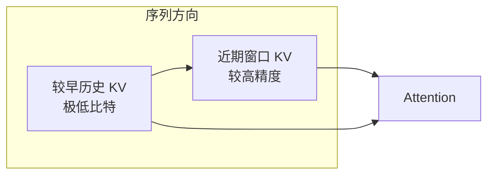
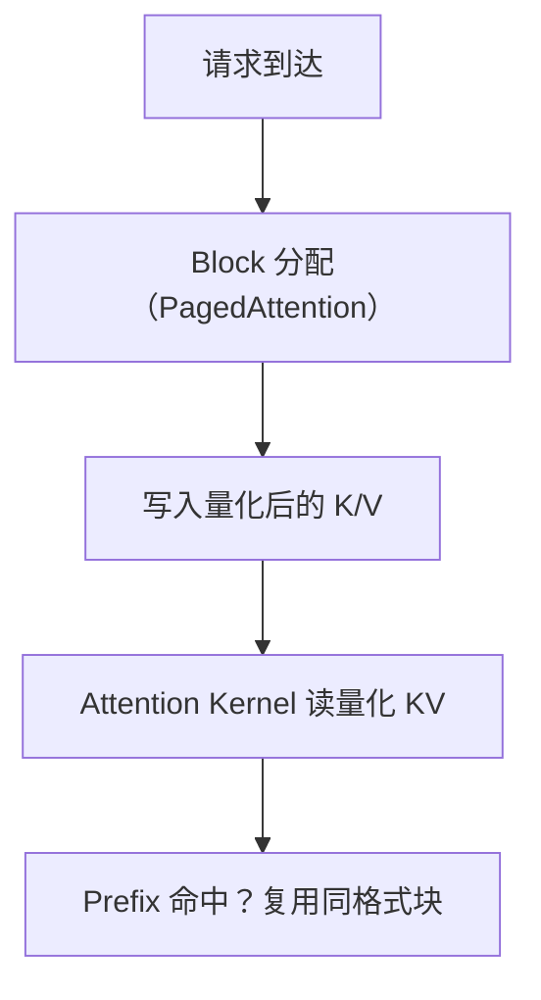
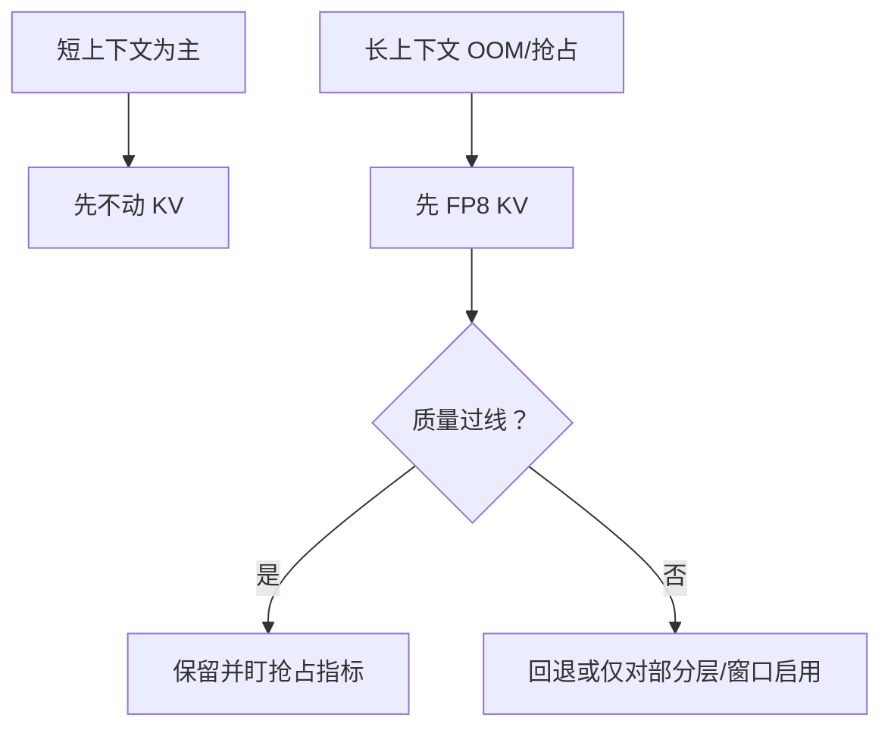

权重压到 INT4（[4.3](./4.3-Weight-only-INT4.md)）之后，长上下文服务里下一个胀满显存的大户往往是 **KV Cache**。第 1–2 章的账本已经说明：序列越长、并发越高，KV 呈线性膨胀，并直接挤压 Continuous Batching 的入场券、诱发抢占（[2.1](../第2章-推理引擎核心技术/2.1-PagedAttention.md)、[3.4](../第3章-深入vLLM/3.4-调度器源码导读.md)）。这一节不再重复分页机制，而是换切口：**历史 K/V 怎么用更少比特存**——先手算容量，再谈精度敏感点、KIVI 的 2-bit 直觉，以及工程上更常见的 **FP8 KV Cache** 与叠加风险。

<!-- more -->

## 📑 目录

- [1. 为什么 KV 比权重更"咬人"](#1-为什么-kv-比权重更咬人)
- [2. 容量公式：手算一笔账](#2-容量公式手算一笔账)
- [3. KV 量化要额外小心什么](#3-kv-量化要额外小心什么)
- [4. KIVI：面向 2-bit KV 的代表性思路](#4-kivi面向-2-bit-kv-的代表性思路)
- [5. FP8 KV Cache：工程折中](#5-fp8-kv-cache工程折中)
- [6. 与权重量化叠加的风险](#6-与权重量化叠加的风险)
- [7. 与 PagedAttention / Prefix Cache 的交织](#7-与-pagedattention--prefix-cache-的交织)
- [8. 启用与评测建议](#8-启用与评测建议)
- [9. 权衡与适用场景](#9-权衡与适用场景)
- [总结](#-总结)
- [自我检验清单](#-自我检验清单)
- [参考资料](#-参考资料)

---

## 1. 为什么 KV 比权重更"咬人"

权重体积基本固定；KV 随层数、头数、序列长度、并发与 dtype 增长。于是出现典型现象：

- 70B 权重 INT4 后单卡"好像够了"；
- 一上 32K/128K 上下文或多并发，立刻被 KV 打回原形；
- 调度器开始频繁抢占，TTFT/TPOT 抖动。

对 Memory Bound 的 Decode，KV 读取本身也是带宽消费者。量化 KV 同时瞄准：**显存容量**与**注意力读带宽**。

📌 **关键点**：长上下文优化里，KV Cache 量化与 PagedAttention、Prefix Cache、Chunked Prefill 是同一条显存战线上的不同兵器——前三者管"怎么管块、怎么复用、怎么切 Prefill"，本节管"块里每个元素几个比特"。

---

## 2. 容量公式：手算一笔账

对常见 MHA/GQA，单请求 KV 显存可先用：

$$
\mathrm{KV\ bytes} \approx 2 \times L \times H_{\mathrm{kv}} \times D \times S \times B_{\mathrm{elem}}
$$

其中：$L$ 层数，$H_{\mathrm{kv}}$ 为 KV 头数（GQA 时常小于查询头数），$D$ 为 head dim，$S$ 为序列长度，$B_{\mathrm{elem}}$ 为每元素字节数（FP16=2，FP8=1），因子 2 表示 K 与 V。

**例（教学数量级，非某官方配置断言）**：设 $L=32$，$H_{\mathrm{kv}}=8$，$D=128$，$S=32{,}768$（32K），$B_{\mathrm{elem}}=2$（FP16）：

$$
2 \times 32 \times 8 \times 128 \times 32768 \times 2
= 2^{2}\times 2^{5}\times 2^{3}\times 2^{7}\times 2^{15}\times 2^{1}
= 2^{33}\ \mathrm{B}
= 8\,\mathrm{GiB}
$$

再乘并发：若 `max_num_seqs` 想冲到 16、且多数请求都顶满 32K（极端上界），仅 KV 就可到 **~128 GiB**——远超单卡。若 KV 改为 FP8（$B_{\mathrm{elem}}=1$），同公式直接 **减半** → 单请求约 **4 GiB**，16 并发上界约 **64 GiB**。

取舍句：FP8 KV 相对 FP16 约 **2× 容量**（同显存可撑更长 $S$ 或更高并发）；它救的是**状态体积**，不自动等于 tok/s 翻倍——还要看 Attention Kernel 是否高效读 FP8、以及质量是否过线。

💡 **提示**：真实引擎还有 block 对齐、碎片、多模态/编码器缓存等；手算用来定数量级与优先级，上线仍以引擎日志里的 KV 池大小为准。

---

## 3. KV 量化要额外小心什么

KV 不是普通静态权重：

1. **在线生成**：每个新 Token 都要写入新的 K/V，量化必须足够便宜；
2. **误差会进入注意力**：K 的误差扭曲相似度，V 的误差污染加权求和；
3. **长上下文更敏感**：依赖远处 token 的针检索、多跳推理，对早期历史 KV 的误差更不宽容；
4. **与分页存储耦合**：物理块、`block_size`、dtype 布局都要和 Kernel 对齐。

因此，"把 FP16 KV 直接按 Per-tensor INT4 一压"很少能在质量上过关。成功的方法几乎都会做**非对称的精细策略**（对不同张量、不同轴用不同粒度）。

| 精度敏感点 | 为何要紧 | 评测时应盯 |
|---|---|---|
| 长距离依赖 | 早期 KV 误差被反复用于注意力 | 针检索 / 多跳 QA |
| Attention 分布 | K 误差改变 softmax 焦点 | 指令遵循、引用准确性 |
| 近期窗口 | 下一步预测更依赖近邻 | 短对话是否无感（应基本无感） |
| 与权重量化叠加 | 双重近似可能在敏感层放大 | 组合回归，而非只测单改动 |

⚠️ **注意**：KV 量化的失败模式不一定是 PPL 微涨，而可能是**长距离依赖丢失、指令遵循变差、幻觉增多**。必须用长上下文任务集回归。

---

## 4. KIVI：面向 2-bit KV 的代表性思路

**KIVI** 等工作观察：K 与 V 的量化敏感度不同，且沿序列/通道的统计结构可被利用。其代表性做法包括：

- 对 K、V 采用不同的分组与量化策略（而非同一套粗暴配置）；
- 保留少量**全精度（或更高精度）的近期 Token KV**（sliding residual / 近期窗口），因为最近上下文对下一步预测往往更关键；
- 对更早的历史 KV 使用极低比特（论文推进到 2-bit 量级）以换取显存。



🔑 **核心概念**：**不是所有历史 Token 的 KV 都值得同等精度。** 用"近期高精 + 历史低精"换取 2-bit 级压缩，是 KIVI 类方法的关键直觉。

这对理解后续工程系统很有帮助：即便你最终上线的是 FP8 而非 2-bit，"精度预算应倾斜给敏感部分"这一原则仍然成立。

---

## 5. FP8 KV Cache：工程折中

在生产推理引擎里，更常见、更稳妥的一步是 **FP8 KV Cache**（E4M3/E5M2 等，取决于硬件与实现）：

| 📊 方案 | 压缩率（相对 FP16） | 质量风险 | 工程成熟度 |
|---|---|---|---|
| FP8 KV | ~2× | 较低（多数模型可接受，仍需回归） | 较高，硬件友好 |
| INT4/INT2 KV | 4×~8× | 更高，需精巧算法 | 视引擎/论文实现而定 |
| 仅量化权重 | 不直接减 KV | — | 无法解决长上下文 KV 胀 |

FP8 的吸引力在于：

- 动态范围优于同比特整数，更不易被偶发大幅度打崩；
- Hopper/Ada 等 GPU 对 FP8 有更好的生态；
- 与"权重 FP8 + KV FP8"的统一低精度栈更容易运维。

💡 **提示**：FP8 KV 的收益要用**同并发下的最大上下文**或**同上下文下的最大并发**来量，而不是只看单请求短对话。

---

## 6. 与权重量化叠加的风险

生产上很常见：**INT4 权重 + FP8 KV**，或 **FP8 权重 + FP8 KV**。叠加能同时砍固定成本（权重）与可变成本（KV），但也引入"双重近似"：

| 风险 | 表现 | 缓解 |
|---|---|---|
| 误差耦合 | 权重误差与 KV 误差在深层叠加 | 先单变量过线，再组合；敏感任务加严阈值 |
| 归因困难 | 坏例不知该怪权重还是 KV | A/B：FP16 全精度 / 只改权重 / 只改 KV / 两者都改 |
| Kernel 组合矩阵 | 某组合回退慢路径 | 查版本说明 + profiler |
| 过度乐观的并发 | 显存够了但质量崩了 | 长上下文探针一票否决 |

📌 **关键点**：叠加前用 **单变量对照**；叠加后必须重复长上下文与业务坏例集，不能假设"各自过线 ⇒ 一起过线"。

---

## 7. 与 PagedAttention / Prefix Cache 的交织

KV 量化不是孤立开关，它嵌在第 2 章那套机制里：

- **PagedAttention**：块内存储 dtype 变为 FP8/INT 后，同样显存可缓存更多 Token，理论上能抬高并发；
- **Prefix Cache**：共享前缀的物理块也应按同一量化格式存储，避免命中后还要反复转精度；
- **抢占/恢复**：量化后的 KV 体积更小；V1 主路径侧重 Recompute（见 3.4），但若涉及换出，体积优势仍存在。



📌 **关键点**：KV 量化的系统收益，最终应表现为 **更高的有效 batch** 或 **更少的 preemption**，而不只是"dtype 字段变了"。

---

## 8. 启用与评测建议

不同引擎参数名不同；以 vLLM 为例，关注 KV Cache dtype / 量化相关配置（版本差异大，启动前用 `--help` 与官方量化文档核对）：

```bash
# 示意：启用 FP8 KV Cache（参数名随版本变化，请核对当前文档）
vllm serve meta-llama/Llama-3.1-8B-Instruct \
  --kv-cache-dtype fp8
```

评测清单：

1. **短对话质量**：确保没有明显倒退；
2. **长上下文针检索 / 多跳问答**：专门盯长距离依赖；
3. **吞吐与抢占日志**：`max_num_seqs`、缓存命中率、preemption 次数；
4. **与权重量化叠加**：INT4 权重 + FP8 KV 很常见，但要做第 6 节的组合回归。

⚠️ **注意**：若业务强依赖精确引用原文（合同条款、代码符号），对 KV 激进量化要更保守，或对近期窗口/关键层关闭量化。

---

## 9. 权衡与适用场景

| 场景 | 建议 | 原因 |
|---|---|---|
| 短上下文、低并发 | 先不动 KV | 收益薄，白增数值风险 |
| 长上下文 OOM / 抢占狂刷 | 先评估 FP8 KV | 容量证据明确 |
| 精确针检索 / 逐字引用 | 保守或仅部分启用 | 精度敏感点在注意力与长依赖 |
| 引擎路径不成熟、墙钟变慢 | 回退 | 省显存却更慢，得不偿失 |
| 已与 INT4/FP8 权重叠加 | 强制组合回归 | 双重近似 |

更稳妥的策略是被显存证据驱动：



---

## 📝 总结

- 长上下文下 KV 常取代权重成为显存主瓶颈；量化 KV 同时服务容量与读带宽。
- 手算：示例配置下 32K 单请求 FP16 KV 约 8 GiB，FP8 约减半——用来决定优先级，不是替代引擎账本。
- KV 在线写入、误差进入注意力；长距离依赖与引用类任务更敏感。
- KIVI 等表明：K/V 不对称 + 近期高精窗口，可把 KV 推向极低比特。
- 工程上 FP8 KV 常是风险/收益更均衡的落点；与权重量化叠加必须单变量后再组合回归。

## 🎯 自我检验清单

- 能写出 KV 显存随哪些变量线性增长，并完成一笔带 GiB 单位的手算
- 能说明 FP8 KV 相对 FP16 约 2× 容量意味着什么、不意味着什么
- 能说明 KV 量化相对权重量化的额外风险与精度敏感点
- 能概括 KIVI"近期高精、历史低精"的直觉
- 能对比 FP8 KV 与更低比特 KV 的工程取舍
- 能设计权重×KV 四种对照（全精度 / 只权重 / 只 KV / 两者）以定位坏例
- 能列出上线 FP8 KV 时的四类评测：短对话、长上下文、吞吐/抢占、组合回归

## 📚 参考资料

- [Liu et al., KIVI: A Tuning-Free Asymmetric 2bit Quantization for KV Cache](https://arxiv.org/abs/2402.02750)
- [vLLM — Quantization / KV Cache dtype 相关文档](https://docs.vllm.ai/en/latest/features/quantization/)
- [NVIDIA — Floating Point 8（FP8）](https://docs.nvidia.com/deeplearning/transformer-engine/user-guide/examples/fp8_primer.html)
- [Efficient Memory Management with PagedAttention](https://arxiv.org/abs/2309.06180)
