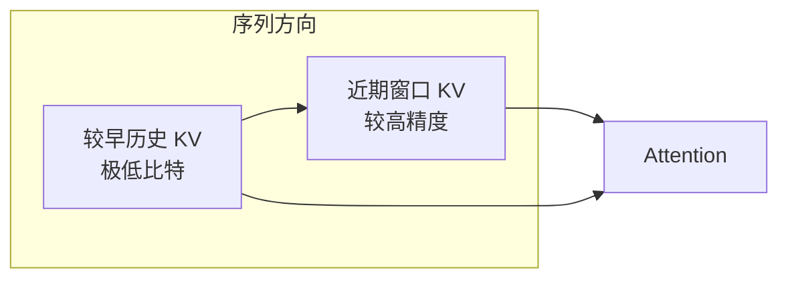
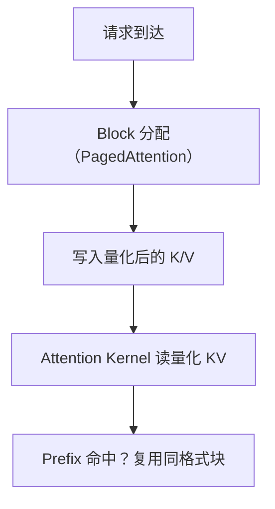
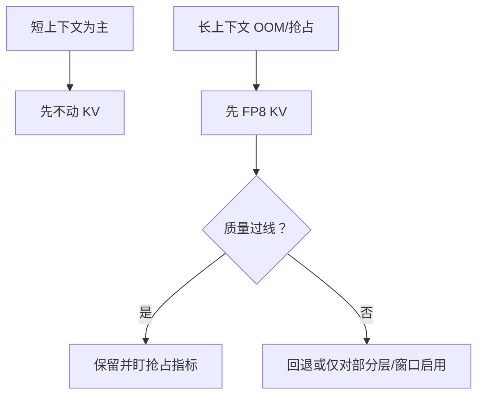

权重压到 INT4 之后，长上下文服务里下一个胀满显存的大户往往是 **KV Cache**。第 1–2 章的账本已经说明：序列越长、并发越高，KV 呈线性膨胀，并且直接挤压 Continuous Batching 的入场券。这一节把焦点从"权重怎么压"转到"历史 K/V 怎么压"：以 KIVI 的 2-bit 思路理解算法边界，再落到目前更工程化的 **FP8 KV Cache**。

<!-- more -->

## 📑 目录

- [1. 为什么 KV 比权重更"咬人"](#1-为什么-kv-比权重更咬人)
- [2. KV 量化要额外小心什么](#2-kv-量化要额外小心什么)
- [3. KIVI：面向 2-bit KV 的代表性思路](#3-kivi面向-2-bit-kv-的代表性思路)
- [4. FP8 KV Cache：工程折中](#4-fp8-kv-cache工程折中)
- [5. 与 PagedAttention / Prefix Cache 的交织](#5-与-pagedattention--prefix-cache-的交织)
- [6. 启用与评测建议](#6-启用与评测建议)
- [7. 什么时候不该上 KV 量化](#7-什么时候不该上-kv-量化)
- [总结](#-总结)
- [自我检验清单](#-自我检验清单)
- [参考资料](#-参考资料)

---

## 1. 为什么 KV 比权重更"咬人"

权重体积基本固定；KV 随 `num_layers × num_kv_heads × seq_len × batch × head_dim × dtype` 增长。于是出现典型现象：

- 70B 权重 INT4 后单卡"好像够了"；
- 一上 32K/128K 上下文或多并发，立刻被 KV 打回原形；
- 调度器开始频繁抢占（第 2.1 节），TTFT/TPOT 抖动。

对 Memory Bound 的 Decode，KV 读取本身也是带宽消费者。量化 KV 同时瞄准：**显存容量**与**注意力读带宽**。

📌 **关键点**：长上下文优化里，KV Cache 量化与 PagedAttention、Prefix Cache、Chunked Prefill 是同一条显存战线上的不同兵器。

---

## 2. KV 量化要额外小心什么

KV 不是普通静态权重：

1. **在线生成**：每个新 Token 都要写入新的 K/V，量化必须足够便宜；
2. **误差会累积进注意力分布**：K 的误差影响相似度，V 的误差影响加权求和；
3. **不同位置/通道统计不同**：最近 Token 与早期 Token、不同 head 的敏感度可能不同；
4. **与分页存储耦合**：物理块、block_size、dtype 布局都要和 Kernel 对齐。

因此，"把 FP16 KV 直接按 Per-tensor INT4 一压"很少能在质量上过关。成功的方法几乎都会做**非对称的精细策略**（对不同张量、不同轴用不同粒度）。

⚠️ **注意**：KV 量化的失败模式不一定是 PPL 微涨，而可能是**长距离依赖丢失、指令遵循变差、幻觉增多**。必须用长上下文任务集回归。

---

## 3. KIVI：面向 2-bit KV 的代表性思路

**KIVI** 等工作观察：K 与 V 的量化敏感度不同，且沿序列/通道的统计结构可被利用。其代表性做法包括：

- 对 K、V 采用不同的分组与量化策略（而非同一套粗暴配置）；
- 保留少量**全精度（或更高精度）的近期 Token KV**（sliding residual / 近期窗口），因为最近上下文对下一步预测往往更关键；
- 对更早的历史 KV 使用极低比特（论文推进到 2-bit 量级）以换取显存。



🔑 **核心概念**：**不是所有历史 Token 的 KV 都值得同等精度。** 用"近期高精 + 历史低精"换取 2-bit 级压缩，是 KIVI 类方法的关键直觉。

这对理解后续工程系统很有帮助：即便你最终上线的是 FP8 而非 2-bit，"精度预算应倾斜给敏感部分"这一原则仍然成立。

---

## 4. FP8 KV Cache：工程折中

在生产推理引擎里，更常见、更稳妥的一步是 **FP8 KV Cache**（E4M3/E5M2 等，取决于硬件与实现）：

| 📊 方案 | 压缩率（相对 FP16） | 质量风险 | 工程成熟度 |
|---|---|---|---|
| FP8 KV | ~2× | 较低（多数模型可接受） | 较高，硬件友好 |
| INT4/INT2 KV | 4×~8× | 更高，需精巧算法 | 视引擎/论文实现而定 |
| 仅量化权重 | 不直接减 KV | — | 无法解决长上下文 KV 胀 |

FP8 的吸引力在于：

- 动态范围优于同比特整数，更不易被偶发大幅度打崩；
- Hopper/Ada 等 GPU 对 FP8 有更好的生态；
- 与"权重 FP8 + KV FP8"的统一低精度栈更容易运维。

💡 **提示**：FP8 KV 的收益要用**同并发下的最大上下文**或**同上下文下的最大并发**来量，而不是只看单请求短对话。

---

## 5. 与 PagedAttention / Prefix Cache 的交织

KV 量化不是孤立开关，它嵌在第 2 章那套机制里：

- **PagedAttention**：块内存储 dtype 变为 FP8/INT 后，块容量（可缓存的 Token 数）相对显存上升，理论上能抬高并发；
- **Prefix Cache**：共享前缀的物理块也应按同一量化格式存储，避免命中后还要反复转精度；
- **抢占/换出**：量化后的 KV 换出到 CPU 时体积更小，但编解码与类型转换开销要纳入评估。



📌 **关键点**：KV 量化的系统收益，最终应表现为 **更高的有效 batch** 或 **更少的 preemption**，而不只是"dtype 字段变了"。

---

## 6. 启用与评测建议

不同引擎参数名不同；以 vLLM 为例，关注 KV Cache dtype / 量化相关配置（版本差异大，启动前用 `--help` 与官方量化文档核对）：

```bash
# 示意：启用 FP8 KV Cache（参数名随版本变化，请核对当前文档）
vllm serve meta-llama/Llama-3.1-8B-Instruct \
  --kv-cache-dtype fp8
```

评测清单：

1. **短对话质量**：确保没有明显倒退；
2. **长上下文针检索 / 多跳问答**：专门盯长距离依赖；
3. **吞吐与抢占日志**：`max_num_seqs`、缓存命中率、preemption 次数；
4. **与权重量化叠加**：INT4 权重 + FP8 KV 很常见，但要做组合回归，避免"双重近似"在敏感任务上叠加放大。

⚠️ **注意**：若业务强依赖精确引用原文（合同条款、代码符号），对 KV 激进量化要更保守，或对近期窗口/关键层关闭量化。

---

## 7. 什么时候不该上 KV 量化

KV 量化不是默认必开。下面几类情况更宜先别动，或只做小流量试验：

1. **上下文并不长、并发也不高**：瓶颈在权重或算力时，KV 量化收益薄，却引入数值风险。
2. **任务对位置精度极敏感**：精确针检索、逐字引用、符号密集代码修复；一旦坏例增多，省下的显存不值钱。
3. **引擎/内核路径不成熟**：某模型架构上 FP8 KV 仍回退到低效实现，墙钟更慢。
4. **已经用 Prefix Cache 把大量前缀成本抹平**：若 Decode KV 增长才是问题，再针对 Decode 路径评估；不要假设"开了量化一切长上下文都免费"。

更稳妥的策略是分层：



📌 **关键点**：KV 量化的正确打开方式是 **被显存证据驱动**，而不是被"又一项优化清单"驱动。

---

## 📝 总结

- 长上下文下 KV Cache 常取代权重成为显存主瓶颈；量化 KV 同时服务容量与读带宽。
- KV 在线写入、误差进入注意力，必须比静态权重量化更谨慎。
- KIVI 等研究表明：K/V 不对称策略 + 近期高精窗口，可把 KV 推向极低比特。
- 工程上 FP8 KV Cache 常是风险/收益更均衡的落点。
- 收益应通过并发、上下文长度与抢占行为验证，并与 PagedAttention/Prefix Cache 协同理解。

## 🎯 自我检验清单

- 能写出 KV 显存随哪些变量线性增长
- 能说明 KV 量化相对权重量化的额外风险
- 能概括 KIVI"近期高精、历史低精"的直觉
- 能对比 FP8 KV 与更低比特 KV 的工程取舍
- 能列出上线 FP8 KV 时的四类评测：短对话、长上下文、吞吐/抢占、与权重量化组合

## 📚 参考资料

- [Liu et al., KIVI: A Tuning-Free Asymmetric 2bit Quantization for KV Cache](https://arxiv.org/abs/2402.02750)
- [vLLM — Quantization / KV Cache dtype 相关文档](https://docs.vllm.ai/en/latest/features/quantization/)
- [NVIDIA — Floating Point 8（FP8）](https://docs.nvidia.com/deeplearning/transformer-engine/user-guide/examples/fp8_primer.html)
- [Efficient Memory Management with PagedAttention](https://arxiv.org/abs/2309.06180)
