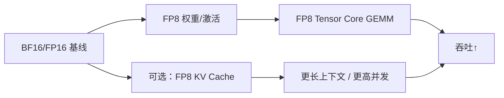

前面几节的 INT8/INT4 故事，底层假设常常是"整数网格 + scale"。从 Hopper 开始，NVIDIA 把 **FP8** 推进为训练与推理的一等公民；到 Blackwell，又进一步把目光投向 **4-bit 浮点家族（NVFP4 / MXFP4）**。这一节补齐硬件视角：这些格式为什么比"同类比特的整数"更讨喜、E4M3/E5M2 怎么选，以及你在推理选型里该如何把它们嵌进第 4.6 节的决策树。

<!-- more -->

## 📑 目录

- [1. 为什么需要低比特浮点](#1-为什么需要低比特浮点)
- [2. FP8：E4M3 与 E5M2](#2-fp8e4m3-与-e5m2)
- [3. Hopper 上的推理含义](#3-hopper-上的推理含义)
- [4. Blackwell：NVFP4 与 MXFP4](#4-blackwellnvfp4-与-mxfp4)
- [5. 和 INT8/INT4 路线如何并存](#5-和-int8int4-路线如何并存)
- [6. 落地时的现实约束](#6-落地时的现实约束)
- [7. 从 FP16 迁到 FP8/FP4 的演进路径](#7-从-fp16-迁到-fp8fp4-的演进路径)
- [总结](#-总结)
- [自我检验清单](#-自我检验清单)
- [参考资料](#-参考资料)

---

## 1. 为什么需要低比特浮点

整数量化依赖 scale 把实数拽到固定网格；遇到宽动态范围时，要么被 outlier 绑架，要么把粒度切得很细（Per-channel/group）并配套复杂算法。**低比特浮点**把一部分动态范围能力做进格式本身：用指数位表达量级，用尾数位表达精度。

对 LLM 而言，这意味着：

- 激活/梯度（训练）或激活/KV（推理）更不容易"一夜之间不可量化"；
- 硬件可以提供原生 Tensor Core 吞吐，而不是只做压缩存储；
- 工具链逐步从"研究特性"变成"引擎默认路径之一"。

📌 **关键点**：FP8/FP4 的战略意义是 **格式 + 硬件 + 软件栈** 一起到位；只有 checkpoint 而没有 Kernel，或只有硬件而没有稳定量化配方，都形不成产品能力。

---

## 2. FP8：E4M3 与 E5M2

常见 FP8 有两种布局（名称即指数/尾数位数）：

| 格式 | 布局直觉 | 动态范围 | 精度 | 常见用途 |
|---|---|---|---|---|
| **E4M3** | 4 位指数 + 3 位尾数 | 较小 | 相对更高 | 推理权重/激活很常用 |
| **E5M2** | 5 位指数 + 2 位尾数 | 更大 | 更粗 | 更偏训练中需要更大范围的张量 |

没有绝对冠军：推理里若数值范围可控，**E4M3** 往往因更高尾数精度更受欢迎；若某种张量更容易溢出/下溢，才会更看重 E5M2 的范围。

🔑 **核心概念**：**E4M3 偏精度，E5M2 偏范围。** 选型是数值分布问题，不是"版本号越高越好"。

此外，FP8 实务几乎必然伴随 **缩放（scaling）策略**——块级、张量级或按硬件支持的微缩放——以把数值塞进可表示范围。看到 FP8 方案时，要同时问："scale 怎么存、怎么更新、Kernel 是否融合"。

---

## 3. Hopper 上的推理含义

Hopper（如 H100）原生强化了 FP8 矩阵乘能力。对推理团队，这意味着一条极具吸引力的路径：

- 权重 FP8 + 激活 FP8 的 W8A8 风格（这里的 "8" 是浮点 8-bit）；
- KV Cache 也可走 FP8（见 4.4）；
- 相对纯 INT4 weight-only，常在**质量与吞吐之间更均衡**，尤其当你有 Hopper 且不想维护太复杂的 INT4 工具链时。



💡 **提示**：FP8 推理不是"改个 dtype 就完成"。需要量化配方（静态或延迟缩放）、可靠的 checkpoint、以及引擎对融合 Kernel 的支持。vLLM 等框架已提供 FP8 相关后端，但模型族覆盖与性能仍需实测。

---

## 4. Blackwell：NVFP4 与 MXFP4

Blackwell 一代把竞争推进到 **4-bit 浮点** 生态。你会在资料里看到相近但并不完全相同的名字：

- **NVFP4**：NVIDIA 在其软件/硬件叙事中强调的 4-bit 浮点能力与对应支持路径；
- **MXFP4**：与微缩放（micro-scaling）家族相关的 4-bit 浮点格式思路，强调更细的共享缩放以保住精度。

对学习者，不必先死记每个比特字段，先抓住工程含义：

1. **比 FP8 更省带宽与显存**，理论上接近/挑战 INT4 的容量收益；
2. **比 INT4 更希望保留浮点式动态范围**，以降低对重型 PTQ 算法的依赖；
3. **强绑定新硬件与新软件栈**——在旧 GPU 上不可假设"有 NVFP4 就有同样加速"。

⚠️ **注意**：FP4 生态仍在快速演进，格式命名、中间表示、引擎开关在半年内都可能变化。写进生产方案时，请以你目标驱动与引擎版本的发布说明为准，把本文当作选型地图而非 API 手册。

---

## 5. 和 INT8/INT4 路线如何并存

一张对照表帮助把第 4 章串起来：

| 路线 | 典型硬件 | 主要收益 | 主要风险 |
|---|---|---|---|
| INT4 weight-only（GPTQ/AWQ） | 通用 CUDA GPU | 权重显存大降 | 质量依赖算法；算力加速看 Kernel |
| INT8 W8A8 + SmoothQuant | 支持 INT8 Tensor Core | 计算与带宽 | Activation Outlier |
| FP8 | Hopper+（及部分其它） | 质量/吞吐均衡 | 需要缩放与引擎支持 |
| NVFP4/MXFP4 | Blackwell 等新硬件 | 更激进的低比特浮点 | 生态与可移植性 |

它们不是互斥：生产上常见 **权重一种格式、KV 另一种格式**（例如 AWQ 权重 + FP8 KV），前提是引擎组合矩阵允许，并做质量回归。

📌 **关键点**：硬件换代时，优先问"我的集群明年主力卡是什么"，再决定是把精力投入 INT4 工具链还是 FP8/FP4 栈。

---

## 6. 落地时的现实约束

1. **可移植性**：INT4 权重在多代 GPU 上更容易"至少能跑"；FP8/FP4 的峰值收益更绑硬件。
2. **模型供应**：有现成高质量 FP8 权重，往往比自己从 BF16 现场量化更稳。
3. **观测**：用 profiler 确认进入了预期 GEMM；否则你可能只是在用 FP8 存储、却以更高精度计算。
4. **评测**：对推理任务，除了吞吐，还要看长上下文与工具调用——低比特浮点同样可能在尾部行为上露怯。

```python
# 示意：vLLM 加载 FP8 模型（格式名/参数随版本变化）
from vllm import LLM

llm = LLM(
    model="your-org/llama-3.1-8b-fp8",
    quantization="fp8",
)
```

---

## 7. 从 FP16 迁到 FP8/FP4 的演进路径

若团队还在 FP16/BF16，不建议直接跳到 NVFP4。更稳的台阶是：

1. **基线**：BF16/FP16 + 完善的质量/性能看板；
2. **Hopper 上试 FP8 权重（或权重+激活）**：验证 Kernel 与业务指标；
3. **长上下文再加 FP8 KV**：把容量收益从权重扩展到状态；
4. **Blackwell 就绪后评估 NVFP4/MXFP4**：用同一套评测集做世代对比，而不是只看厂商幻灯片上的峰值 FLOPs。

| 阶段 | 成功标准 |
|---|---|
| FP8 权重 | 质量过线，GEMM 命中 FP8，吞吐有增益 |
| FP8 KV | 同显存下上下文或并发提升，长文任务不崩 |
| FP4 | 在目标卡上端到端优于 FP8，且工具链可复现 |

💡 **提示**：迁移的隐藏成本是**权重供应链**——谁负责出品、如何签名校验、如何回滚。格式越新，越要把供应链与引擎版本绑在一起做变更管理。

同一阶段内也建议保留 **A/B 开关**：例如新会话走 FP8，出问题可瞬时切回 BF16 池。低比特浮点的运维成熟度，往往比又抠掉 0.1 bit 的理论精度更重要。

---

## 📝 总结

- 低比特浮点用指数位换动态范围，缓解整数量化对 outlier 与复杂 scale 的依赖。
- FP8 中 E4M3 偏精度、E5M2 偏范围；推理常优先考虑 E4M3 + 合适缩放。
- Hopper 让 FP8 成为务实的 W8A8/KV 选项；Blackwell 把战场推到 NVFP4/MXFP4。
- FP8/FP4 与 INT4/INT8 长期并存，应按硬件世代、质量目标与引擎成熟度组合拳出击。
- 落地以"Kernel 命中 + 业务回归 + 版本说明"为准，格式名词会持续演进。
- 迁移宜分台阶：BF16 基线 → FP8 计算 → FP8 KV → 再评估 FP4，并管好权重供应链。

## 🎯 自我检验清单

- 能对比整数量化与低比特浮点在动态范围处理上的差异
- 能说明 E4M3 与 E5M2 的适用偏向
- 能解释 Hopper 对 FP8 推理意味着什么
- 能用一两句话描述 NVFP4/MXFP4 相对 FP8 的动机
- 能画出"硬件世代 → 优先量化路线"的简单映射
- 能说清从 FP16 迁到 FP8/FP4 的推荐台阶与每阶段成功标准

## 📚 参考资料

- [NVIDIA Transformer Engine — FP8 Primer](https://docs.nvidia.com/deeplearning/transformer-engine/user-guide/examples/fp8_primer.html)
- [FP8 Formats for Deep Learning（NVIDIA 技术博客/白皮书相关入口）](https://developer.nvidia.com/blog/nvidia-arm-and-intel-publish-fp8-specification/)
- [vLLM — Quantization](https://docs.vllm.ai/en/latest/features/quantization/)
- [NVIDIA Blackwell 架构相关开发者博客](https://developer.nvidia.com/blog/tag/blackwell/)
